When a trace is loaded, the workspace restores pinned tracks, provides options for managing track layouts, and applies any user-specified track states from the URL. This helps users maintain and customize their workspace efficiently.

# Handling pinned tracks commands and auto-expansion on trace load

```mermaid
%%{init: {"flowchart": {"defaultRenderer": "elk"}} }%%
flowchart TD
    node1["Trace loaded: Register commands for saving, restoring, exporting, importing pinned tracks"] --> node2["Process URL parameters for auto-expanding and pinning tracks"]
    click node1 openCode "ui/src/plugins/dev.perfetto.AutoPinAndExpandTracks/index.ts:91:191"
    click node2 openCode "ui/src/plugins/dev.perfetto.AutoPinAndExpandTracks/index.ts:193:215"
    subgraph loop1["For each track"]
      node2 --> node3["Expand track if matches expand parameter"]
      click node3 openCode "ui/src/plugins/dev.perfetto.AutoPinAndExpandTracks/index.ts:195:201"
    end
    subgraph loop2["For each track"]
      node2 --> node4["Pin track if matches pin parameter"]
      click node4 openCode "ui/src/plugins/dev.perfetto.AutoPinAndExpandTracks/index.ts:203:209"
    end
    node2 --> node5["Clear URL parameters after processing"]
    click node5 openCode "ui/src/plugins/dev.perfetto.AutoPinAndExpandTracks/index.ts:213:215"

classDef HeadingStyle fill:#777777,stroke:#333,stroke-width:2px;

%% Swimm:
%% %%{init: {"flowchart": {"defaultRenderer": "elk"}} }%%
%% flowchart TD
%%     node1["Trace loaded: Register commands for saving, restoring, exporting, importing pinned tracks"] --> node2["Process URL parameters for <SwmToken path="ui/src/plugins/dev.perfetto.AutoPinAndExpandTracks/index.ts" pos="189:11:13" line-data="    // Process URL parameters for auto-expanding groups and pinning tracks">`auto-expanding`</SwmToken> and pinning tracks"]
%%     click node1 openCode "<SwmPath>[ui/…/dev.perfetto.AutoPinAndExpandTracks/index.ts](ui/src/plugins/dev.perfetto.AutoPinAndExpandTracks/index.ts)</SwmPath>:91:191"
%%     click node2 openCode "<SwmPath>[ui/…/dev.perfetto.AutoPinAndExpandTracks/index.ts](ui/src/plugins/dev.perfetto.AutoPinAndExpandTracks/index.ts)</SwmPath>:193:215"
%%     subgraph loop1["For each track"]
%%       node2 --> node3["Expand track if matches expand parameter"]
%%       click node3 openCode "<SwmPath>[ui/…/dev.perfetto.AutoPinAndExpandTracks/index.ts](ui/src/plugins/dev.perfetto.AutoPinAndExpandTracks/index.ts)</SwmPath>:195:201"
%%     end
%%     subgraph loop2["For each track"]
%%       node2 --> node4["Pin track if matches pin parameter"]
%%       click node4 openCode "<SwmPath>[ui/…/dev.perfetto.AutoPinAndExpandTracks/index.ts](ui/src/plugins/dev.perfetto.AutoPinAndExpandTracks/index.ts)</SwmPath>:203:209"
%%     end
%%     node2 --> node5["Clear URL parameters after processing"]
%%     click node5 openCode "<SwmPath>[ui/…/dev.perfetto.AutoPinAndExpandTracks/index.ts](ui/src/plugins/dev.perfetto.AutoPinAndExpandTracks/index.ts)</SwmPath>:213:215"
%% 
%% classDef HeadingStyle fill:#777777,stroke:#333,stroke-width:2px;
```



<SwmSnippet path="/ui/src/plugins/dev.perfetto.AutoPinAndExpandTracks/index.ts" line="91">

---

In <SwmToken path="ui/src/plugins/dev.perfetto.AutoPinAndExpandTracks/index.ts" pos="91:3:3" line-data="  async onTraceLoad(ctx: Trace): Promise&lt;void&gt; {">`onTraceLoad`</SwmToken>, we set up all the commands for managing pinned tracks—saving, restoring, naming, exporting, and importing. Each command is registered with a unique ID and callback, some using prompt dialogs for user input. Next, we call <SwmToken path="ui/src/plugins/dev.perfetto.AutoPinAndExpandTracks/index.ts" pos="113:3:3" line-data="        this.restoreTracks(tracks);">`restoreTracks`</SwmToken> to try and bring back any previously saved pinned tracks, making sure the user's workspace state is consistent right after loading.

```typescript
  async onTraceLoad(ctx: Trace): Promise<void> {
    this.ctx = ctx;

    ctx.commands.registerCommand({
      id: `dev.perfetto.SavePinnedTracks`,
      name: 'Save: Pinned tracks',
      callback: () => {
        setSavedState({
          ...getSavedState(),
          tracks: this.getCurrentPinnedTracks(),
        });
      },
    });
    ctx.commands.registerCommand({
      id: RESTORE_COMMAND_ID,
      name: 'Restore: Pinned tracks',
      callback: () => {
        const tracks = getSavedState()?.tracks;
        if (!tracks) {
          alert('No saved tracks. Use the Save command first');
          return;
        }
        this.restoreTracks(tracks);
      },
    });

    ctx.commands.registerCommand({
      id: `dev.perfetto.SavePinnedTracksByName`,
      name: 'Save by name: Pinned tracks',
      callback: async () => {
        const name = await this.ctx.omnibox.prompt(
          'Give a name to the pinned set of tracks',
        );
        if (name) {
          const tracks = this.getCurrentPinnedTracks();
          addOrReplaceNamedPinnedTracks({name, tracks});
        }
      },
    });
    ctx.commands.registerCommand({
      id: `dev.perfetto.RestorePinnedTracksByName`,
      name: 'Restore by name: Pinned tracks',
      callback: async () => {
        const tracksByName = getSavedState()?.tracksByName ?? [];
        if (tracksByName.length === 0) {
          alert('No saved tracks. Use the Save by name command first');
          return;
        }
        const res = await this.ctx.omnibox.prompt(
          'Select name of set of pinned tracks to restore',
          {
            values: tracksByName,
            getName: (x) => x.name,
          },
        );
        if (res) {
          this.restoreTracks(res.tracks);
        }
      },
    });

```

---

</SwmSnippet>

<SwmSnippet path="/ui/src/plugins/dev.perfetto.AutoPinAndExpandTracks/index.ts" line="217">

---

<SwmToken path="ui/src/plugins/dev.perfetto.AutoPinAndExpandTracks/index.ts" pos="217:3:3" line-data="  private restoreTracks(tracks: ReadonlyArray&lt;SavedPinnedTrack&gt;) {">`restoreTracks`</SwmToken> tries to match each saved track with a local track in the workspace and pins it if found. If any tracks can't be matched, their names are collected and the user gets an alert listing those missing tracks.

```typescript
  private restoreTracks(tracks: ReadonlyArray<SavedPinnedTrack>) {
    const localTracks = this.ctx.currentWorkspace.flatTracks.map((track) => ({
      savedTrack: this.toSavedTrack(track),
      track: track,
    }));
    const unrestoredTracks = tracks
      .map((trackToRestore) => {
        const foundTrack = this.findMatchingTrack(localTracks, trackToRestore);
        if (foundTrack) {
          foundTrack.pin();
          return {restored: true, track: trackToRestore};
        } else {
          console.warn(
            '[AutoPinAndExpandTracks] No track found that matches',
            trackToRestore,
          );
          return {restored: false, track: trackToRestore};
        }
      })
      .filter(({restored}) => !restored)
      .map(({track}) => track.trackName);

    if (unrestoredTracks.length > 0) {
      alert(
        `[AutoPinAndExpandTracks]\nUnable to restore the following tracks:\n${unrestoredTracks.join('\n')}`,
      );
    }
  }
```

---

</SwmSnippet>

<SwmSnippet path="/ui/src/plugins/dev.perfetto.AutoPinAndExpandTracks/index.ts" line="152">

---

Back in <SwmToken path="ui/src/plugins/dev.perfetto.AutoPinAndExpandTracks/index.ts" pos="91:3:3" line-data="  async onTraceLoad(ctx: Trace): Promise&lt;void&gt; {">`onTraceLoad`</SwmToken>, after restoring tracks and registering all the commands for managing pinned tracks, we call <SwmToken path="ui/src/plugins/dev.perfetto.AutoPinAndExpandTracks/index.ts" pos="190:3:3" line-data="    this.processUrlParameters();">`processUrlParameters`</SwmToken> to handle any auto-expansion or pinning based on the current URL. This lets users get the right workspace layout automatically if the URL encodes specific track states.

```typescript
    ctx.commands.registerCommand({
      id: `dev.perfetto.ExportPinnedTracksByName`,
      name: 'Export by name: Pinned tracks',
      callback: async () => {
        const tracksByName = getSavedState()?.tracksByName ?? [];
        if (tracksByName.length === 0) {
          alert('No saved tracks. Use the Save by name command first');
          return;
        }
        const tracks = await this.ctx.omnibox.prompt(
          'Select name of set of pinned tracks to export',
          {
            values: tracksByName,
            getName: (x) => x.name,
          },
        );
        if (tracks) {
          const a = document.createElement('a');
          a.href =
            'data:application/json;charset=utf-8,' + JSON.stringify(tracks);
          a.download = 'perfetto-pinned-tracks-export.json';
          a.target = '_blank';
          document.body.appendChild(a);
          a.click();
          document.body.removeChild(a);
        }
      },
    });
    ctx.commands.registerCommand({
      id: `dev.perfetto.ImportPinnedTracksByName`,
      name: 'Import by name: Pinned tracks',
      callback: async () => {
        const files = document.querySelector('.pinned_tracks_import_selector');
        assertIsInstance<HTMLInputElement>(files, HTMLInputElement).click();
      },
    });

    // Process URL parameters for auto-expanding groups and pinning tracks
    this.processUrlParameters();
  }
```

---

</SwmSnippet>

<SwmSnippet path="/ui/src/plugins/dev.perfetto.AutoPinAndExpandTracks/index.ts" line="193">

---

<SwmToken path="ui/src/plugins/dev.perfetto.AutoPinAndExpandTracks/index.ts" pos="193:3:3" line-data="  private processUrlParameters(): void {">`processUrlParameters`</SwmToken> expands or pins tracks based on name prefixes, then clears the prefix arrays to avoid repeating the action.

```typescript
  private processUrlParameters(): void {
    const localTracks = this.ctx.defaultWorkspace.flatTracks;
    if (AutoPinAndExpandTracks.expandTracks.length > 0) {
      const expandRegexes = AutoPinAndExpandTracks.expandTracks.map(
        (prefix) => new RegExp('^' + prefix),
      );
      localTracks
        .filter((t) => expandRegexes.some((regex) => regex.test(t.name)))
        .forEach((t) => t.expand());
    }
    if (AutoPinAndExpandTracks.pinTracks.length > 0) {
      const pinRegexes = AutoPinAndExpandTracks.pinTracks.map(
        (prefix) => new RegExp('^' + prefix),
      );
      localTracks
        .filter((t) => pinRegexes.some((regex) => regex.test(t.name)))
        .forEach((t) => t.pin());
    }

    // Once the expand or pin traces have been processed, we don’t want to do it again.
    AutoPinAndExpandTracks.expandTracks = [];
    AutoPinAndExpandTracks.pinTracks = [];
  }
```

---

</SwmSnippet>

&nbsp;

*This is an auto-generated document by Swimm 🌊 and has not yet been verified by a human*

<SwmMeta version="3.0.0" repo-id="Z2l0aHViJTNBJTNBY3BsdXNwbHVzLXBlcmZldHRvJTNBJTNBcmljYXJkb2xvcGV6Zw==" repo-name="cplusplus-perfetto"><sup>Powered by [Swimm](https://app.swimm.io/)</sup></SwmMeta>
