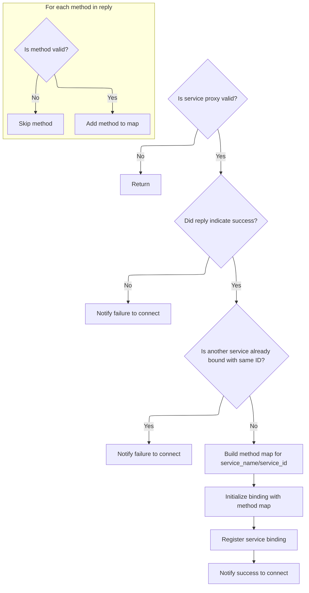
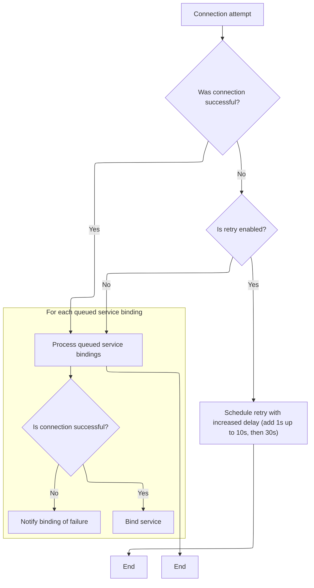

This document explains how the system manages replies to service binding requests and processes queued service bindings. When a reply is received, the system determines if the binding can proceed, registers the service if successful, and notifies the relevant component. Queued binding requests are managed and retried as needed to ensure valid service registration and timely notifications.

# Handling service binding replies



<SwmSnippet path="/src/ipc/client_impl.cc" line="265">

---

In <SwmToken path="src/ipc/client_impl.cc" pos="265:4:4" line-data="void ClientImpl::OnBindServiceReply(QueuedRequest req,">`OnBindServiceReply`</SwmToken>, we start by validating the service proxy and reply, handle failure cases, check for duplicate service bindings, and build a map of method names to remote IDs from the reply. This sets up the context for binding the service and enables method invocation by name.

```c++
void ClientImpl::OnBindServiceReply(QueuedRequest req,
                                    const Frame::BindServiceReply& reply) {
  base::WeakPtr<ServiceProxy>& service_proxy = req.service_proxy;
  if (!service_proxy)
    return;
  const char* svc_name = service_proxy->GetDescriptor().service_name;
  if (!reply.success()) {
    PERFETTO_DLOG("BindService(): unknown service_name=\"%s\"", svc_name);
    return service_proxy->OnConnect(false /* success */);
  }

  auto prev_service = service_bindings_.find(reply.service_id());
  if (prev_service != service_bindings_.end() && prev_service->second.get()) {
    PERFETTO_DLOG(
        "BindService(): Trying to bind service \"%s\" but another service "
        "named \"%s\" is already bound with the same ID.",
        svc_name, prev_service->second->GetDescriptor().service_name);
    return service_proxy->OnConnect(false /* success */);
  }

  // Build the method [name] -> [remote_id] map.
  std::map<std::string, MethodID> methods;
  for (const auto& method : reply.methods()) {
    if (method.name().empty() || method.id() <= 0) {
      PERFETTO_DLOG("OnBindServiceReply(): invalid method \"%s\" -> %" PRIu64,
                    method.name().c_str(), static_cast<uint64_t>(method.id()));
      continue;
    }
    methods[method.name()] = method.id();
  }
```

---

</SwmSnippet>

<SwmSnippet path="/src/ipc/client_impl.cc" line="295">

---

After setting up the binding and method map, we notify the service proxy of a successful connection by calling <SwmToken path="src/ipc/client_impl.cc" pos="298:3:3" line-data="  service_proxy-&gt;OnConnect(true /* success */);">`OnConnect`</SwmToken>(true). This lets the proxy know it can start interacting with the bound service.

```c++
  service_proxy->InitializeBinding(weak_ptr_factory_.GetWeakPtr(),
                                   reply.service_id(), std::move(methods));
  service_bindings_[reply.service_id()] = service_proxy;
  service_proxy->OnConnect(true /* success */);
}
```

---

</SwmSnippet>

# Managing connection attempts and queued bindings



<SwmSnippet path="/src/ipc/client_impl.cc" line="154">

---

In <SwmToken path="src/ipc/client_impl.cc" pos="154:4:4" line-data="void ClientImpl::OnConnect(base::UnixSocket*, bool connected) {">`OnConnect`</SwmToken>, we handle connection failures with exponential backoff and schedule retries safely using weak pointers. We also drain and process queued service bindings, making sure to avoid accessing 'this' after potentially destructive calls.

```c++
void ClientImpl::OnConnect(base::UnixSocket*, bool connected) {
  if (!connected && socket_retry_) {
    socket_backoff_ms_ =
        (socket_backoff_ms_ < 10000) ? socket_backoff_ms_ + 1000 : 30000;
    PERFETTO_DLOG(
        "Connection to traced's UNIX socket failed, retrying in %u seconds",
        socket_backoff_ms_ / 1000);
    auto weak_this = weak_ptr_factory_.GetWeakPtr();
    task_runner_->PostDelayedTask(
        [weak_this] {
          if (weak_this)
            static_cast<ClientImpl&>(*weak_this).TryConnect();
        },
        socket_backoff_ms_);
    return;
  }

  // Drain the BindService() calls that were queued before establishing the
  // connection with the host. Note that if we got disconnected, the call to
  // OnConnect below might delete |this|, so move everything on the stack first.
  auto queued_bindings = std::move(queued_bindings_);
  queued_bindings_.clear();
  for (base::WeakPtr<ServiceProxy>& service_proxy : queued_bindings) {
    if (connected) {
      BindService(service_proxy);
    } else if (service_proxy) {
      service_proxy->OnConnect(false /* success */);
    }
  }
```

---

</SwmSnippet>

<SwmSnippet path="/src/ipc/client_impl.cc" line="183">

---

After draining the queue and notifying service proxies, we avoid touching 'this' since the object might have been deleted during those calls.

```c++
  // Don't access |this| below here.
}
```

---

</SwmSnippet>

&nbsp;

*This is an auto-generated document by Swimm 🌊 and has not yet been verified by a human*

<SwmMeta version="3.0.0" repo-id="Z2l0aHViJTNBJTNBY3BsdXNwbHVzLXBlcmZldHRvJTNBJTNBcmljYXJkb2xvcGV6Zw==" repo-name="cplusplus-perfetto"><sup>Powered by [Swimm](https://app.swimm.io/)</sup></SwmMeta>
