This document describes how the recording manager is set up to manage trace recording sessions in the UI. The flow receives the application instance and returns a fully configured recording manager, ready to handle trace recording operations. It registers all available trace providers and record sections, and restores previous state.

# Where is this flow used?

This flow is used multiple times in the codebase as represented in the following diagram:

```mermaid
graph TD;
      a95c2fa714140951f3070b84405019b141f11d0160c49099887b964bef3aaabe(ui/…/dev.perfetto.RecordTraceV2/index.ts::onActivate) --> 71e8b9d4434836434be64c302307a49b2c93d20c3e25b4c11afdbfbd00897e9e(ui/…/dev.perfetto.RecordTraceV2/index.ts::getRecordingManager):::mainFlowStyle

cdc31ed895a0c0852adbf37cf4f39ccd1579ad70ed0d29c1de07a3c7fb973e72(ui/…/dev.perfetto.RecordTraceV2/index.ts::render) --> 71e8b9d4434836434be64c302307a49b2c93d20c3e25b4c11afdbfbd00897e9e(ui/…/dev.perfetto.RecordTraceV2/index.ts::getRecordingManager):::mainFlowStyle

71e8b9d4434836434be64c302307a49b2c93d20c3e25b4c11afdbfbd00897e9e(ui/…/dev.perfetto.RecordTraceV2/index.ts::getRecordingManager) --> 71e8b9d4434836434be64c302307a49b2c93d20c3e25b4c11afdbfbd00897e9e(ui/…/dev.perfetto.RecordTraceV2/index.ts::getRecordingManager):::mainFlowStyle

cc8a4a3ee7e9ce6174fae985dc571493f6c864459578583c13617b1da6509a77(ui/…/pages/record_page.ts::RecordPageV2.constructor) --> 71e8b9d4434836434be64c302307a49b2c93d20c3e25b4c11afdbfbd00897e9e(ui/…/dev.perfetto.RecordTraceV2/index.ts::getRecordingManager)

06a2dea790b18e52887d7f86e12eaabe4a69d566728ab17c996bdb31d6058b0b(ui/…/dev.perfetto.RecordTraceV2/index.ts::callback) --> 71e8b9d4434836434be64c302307a49b2c93d20c3e25b4c11afdbfbd00897e9e(ui/…/dev.perfetto.RecordTraceV2/index.ts::getRecordingManager):::mainFlowStyle


classDef mainFlowStyle color:#000000,fill:#7CB9F4
classDef rootsStyle color:#000000,fill:#00FFF4
classDef Style1 color:#000000,fill:#00FFAA
classDef Style2 color:#000000,fill:#FFFF00
classDef Style3 color:#000000,fill:#AA7CB9

%% Swimm:
%% graph TD;
%%       a95c2fa714140951f3070b84405019b141f11d0160c49099887b964bef3aaabe(<SwmPath>[ui/…/dev.perfetto.RecordTraceV2/index.ts](ui/src/plugins/dev.perfetto.RecordTraceV2/index.ts)</SwmPath>::<SwmToken path="ui/src/plugins/dev.perfetto.RecordTraceV2/index.ts" pos="42:3:3" line-data="  static onActivate(app: App) {">`onActivate`</SwmToken>) --> 71e8b9d4434836434be64c302307a49b2c93d20c3e25b4c11afdbfbd00897e9e(<SwmPath>[ui/…/dev.perfetto.RecordTraceV2/index.ts](ui/src/plugins/dev.perfetto.RecordTraceV2/index.ts)</SwmPath>::<SwmToken path="ui/src/plugins/dev.perfetto.RecordTraceV2/index.ts" pos="75:5:5" line-data="  private static getRecordingManager(app: App): RecordingManager {">`getRecordingManager`</SwmToken>):::mainFlowStyle
%% 
%% cdc31ed895a0c0852adbf37cf4f39ccd1579ad70ed0d29c1de07a3c7fb973e72(<SwmPath>[ui/…/dev.perfetto.RecordTraceV2/index.ts](ui/src/plugins/dev.perfetto.RecordTraceV2/index.ts)</SwmPath>::render) --> 71e8b9d4434836434be64c302307a49b2c93d20c3e25b4c11afdbfbd00897e9e(<SwmPath>[ui/…/dev.perfetto.RecordTraceV2/index.ts](ui/src/plugins/dev.perfetto.RecordTraceV2/index.ts)</SwmPath>::<SwmToken path="ui/src/plugins/dev.perfetto.RecordTraceV2/index.ts" pos="75:5:5" line-data="  private static getRecordingManager(app: App): RecordingManager {">`getRecordingManager`</SwmToken>):::mainFlowStyle
%% 
%% 71e8b9d4434836434be64c302307a49b2c93d20c3e25b4c11afdbfbd00897e9e(<SwmPath>[ui/…/dev.perfetto.RecordTraceV2/index.ts](ui/src/plugins/dev.perfetto.RecordTraceV2/index.ts)</SwmPath>::<SwmToken path="ui/src/plugins/dev.perfetto.RecordTraceV2/index.ts" pos="75:5:5" line-data="  private static getRecordingManager(app: App): RecordingManager {">`getRecordingManager`</SwmToken>) --> 71e8b9d4434836434be64c302307a49b2c93d20c3e25b4c11afdbfbd00897e9e(<SwmPath>[ui/…/dev.perfetto.RecordTraceV2/index.ts](ui/src/plugins/dev.perfetto.RecordTraceV2/index.ts)</SwmPath>::<SwmToken path="ui/src/plugins/dev.perfetto.RecordTraceV2/index.ts" pos="75:5:5" line-data="  private static getRecordingManager(app: App): RecordingManager {">`getRecordingManager`</SwmToken>):::mainFlowStyle
%% 
%% cc8a4a3ee7e9ce6174fae985dc571493f6c864459578583c13617b1da6509a77(<SwmPath>[ui/…/pages/record_page.ts](ui/src/plugins/dev.perfetto.RecordTraceV2/pages/record_page.ts)</SwmPath>::RecordPageV2.constructor) --> 71e8b9d4434836434be64c302307a49b2c93d20c3e25b4c11afdbfbd00897e9e(<SwmPath>[ui/…/dev.perfetto.RecordTraceV2/index.ts](ui/src/plugins/dev.perfetto.RecordTraceV2/index.ts)</SwmPath>::<SwmToken path="ui/src/plugins/dev.perfetto.RecordTraceV2/index.ts" pos="75:5:5" line-data="  private static getRecordingManager(app: App): RecordingManager {">`getRecordingManager`</SwmToken>)
%% 
%% 06a2dea790b18e52887d7f86e12eaabe4a69d566728ab17c996bdb31d6058b0b(<SwmPath>[ui/…/dev.perfetto.RecordTraceV2/index.ts](ui/src/plugins/dev.perfetto.RecordTraceV2/index.ts)</SwmPath>::callback) --> 71e8b9d4434836434be64c302307a49b2c93d20c3e25b4c11afdbfbd00897e9e(<SwmPath>[ui/…/dev.perfetto.RecordTraceV2/index.ts](ui/src/plugins/dev.perfetto.RecordTraceV2/index.ts)</SwmPath>::<SwmToken path="ui/src/plugins/dev.perfetto.RecordTraceV2/index.ts" pos="75:5:5" line-data="  private static getRecordingManager(app: App): RecordingManager {">`getRecordingManager`</SwmToken>):::mainFlowStyle
%% 
%% 
%% classDef mainFlowStyle color:#000000,fill:#7CB9F4
%% classDef rootsStyle color:#000000,fill:#00FFF4
%% classDef Style1 color:#000000,fill:#00FFAA
%% classDef Style2 color:#000000,fill:#FFFF00
%% classDef Style3 color:#000000,fill:#AA7CB9
```



# Managing the <SwmToken path="ui/src/plugins/dev.perfetto.RecordTraceV2/index.ts" pos="75:14:14" line-data="  private static getRecordingManager(app: App): RecordingManager {">`RecordingManager`</SwmToken> Lifecycle

<SwmSnippet path="/ui/src/plugins/dev.perfetto.RecordTraceV2/index.ts" line="75">

---

GetRecordingManager sets up the singleton <SwmToken path="ui/src/plugins/dev.perfetto.RecordTraceV2/index.ts" pos="75:14:14" line-data="  private static getRecordingManager(app: App): RecordingManager {">`RecordingManager`</SwmToken>, registers all providers and record sections, restores state, and exposes it for debugging. This is the entry point for configuring trace recording.

```typescript
  private static getRecordingManager(app: App): RecordingManager {
    if (this.recordingMgr === undefined) {
      const recMgr = new RecordingManager(app);
      this.recordingMgr = recMgr;
      recMgr.registerProvider(new AdbWebusbTargetProvider());
      recMgr.registerProvider(new AdbWebsocketTargetProvider());
      recMgr.registerProvider(new WebDeviceProxyTargetProvider());

      const chromeProvider = new ChromeExtensionTargetProvider();
      recMgr.registerProvider(chromeProvider);
      recMgr.registerProvider(new TracedWebsocketTargetProvider());
      recMgr.registerPage(
        targetSelectionPage(recMgr),
        bufferConfigPage(recMgr),
        instructionsPage(recMgr),

        chromeRecordSection(() => chromeProvider.getChromeCategories()),
        cpuRecordSection(),
        gpuRecordSection(),
        powerRecordSection(),
        memoryRecordSection(),
        androidRecordSection(),
        perfettoSDKRecordSection(),
        stackSamplingRecordSection(),
        networkRecordSection(),
        advancedRecordSection(),
      );
      recMgr.restorePluginStateFromLocalstorage();
    }

    // For devtools debugging purposes.
    (window as {} as {recordingMgr: unknown}).recordingMgr = this.recordingMgr;
    return this.recordingMgr;
  }
```

---

</SwmSnippet>

&nbsp;

*This is an auto-generated document by Swimm 🌊 and has not yet been verified by a human*

<SwmMeta version="3.0.0" repo-id="Z2l0aHViJTNBJTNBY3BsdXNwbHVzLXBlcmZldHRvJTNBJTNBcmljYXJkb2xvcGV6Zw==" repo-name="cplusplus-perfetto"><sup>Powered by [Swimm](https://app.swimm.io/)</sup></SwmMeta>
