This document describes how trace conversion jobs are managed to keep the application responsive. When a user requests a trace conversion, the job is handled in the background. The application provides feedback to the user through status updates, file downloads, legacy viewer access, or error dialogs, and completes the process when the job finishes.

# Where is this flow used?

This flow is used multiple times in the codebase as represented in the following diagram:

(Note - these are only some of the entry points of this flow)

```mermaid
graph TD;
      2d71d0bd3c3f17cb12379e7cbabc2285f1584d060f51ffffd68a125d363ed69f(ui/…/frontend/sidebar.ts::Sidebar.view) --> ca73cf8f77015d030a8f82bd045ae78f2fe47826ddca82876063d8d5645bf394(ui/…/frontend/sidebar.ts::Sidebar.renderSection)

ca73cf8f77015d030a8f82bd045ae78f2fe47826ddca82876063d8d5645bf394(ui/…/frontend/sidebar.ts::Sidebar.renderSection) --> 13662759489b891c8414f2f8ce21113abfb80f5d2fe2ad649811f83727da20a8(ui/…/frontend/sidebar.ts::getConvertTraceItems)

13662759489b891c8414f2f8ce21113abfb80f5d2fe2ad649811f83727da20a8(ui/…/frontend/sidebar.ts::getConvertTraceItems) --> 0be6789d5d3b83cace93523a198e85d37596588aacbbafb956ba3a0cb5d1a627(ui/…/frontend/sidebar.ts::convertTraceToSystrace)

13662759489b891c8414f2f8ce21113abfb80f5d2fe2ad649811f83727da20a8(ui/…/frontend/sidebar.ts::getConvertTraceItems) --> 98c50f3b3ce6bc3b2fa6acac6581fda77f558cafd8c799e877251371eb7627ca(ui/…/frontend/sidebar.ts::openCurrentTraceWithOldUI)

13662759489b891c8414f2f8ce21113abfb80f5d2fe2ad649811f83727da20a8(ui/…/frontend/sidebar.ts::getConvertTraceItems) --> ed8e67992db04032d852e450163c5b83aa3c1c384827c2c456b15499f1a0f037(ui/…/frontend/sidebar.ts::convertTraceToJson)

0be6789d5d3b83cace93523a198e85d37596588aacbbafb956ba3a0cb5d1a627(ui/…/frontend/sidebar.ts::convertTraceToSystrace) --> 05bb94a43ce5c5aff338f4e180eb5f9cb99f266a1f8a55eb2e0d12799d0d06c7(ui/…/frontend/trace_converter.ts::convertTraceToSystraceAndDownload)

05bb94a43ce5c5aff338f4e180eb5f9cb99f266a1f8a55eb2e0d12799d0d06c7(ui/…/frontend/trace_converter.ts::convertTraceToSystraceAndDownload) --> 60c2756cd9f6d216af0e1c36f9872c3616e1cd8620f74d4e1351ca5199fd1dc1(ui/…/frontend/trace_converter.ts::makeWorkerAndPost):::mainFlowStyle

98c50f3b3ce6bc3b2fa6acac6581fda77f558cafd8c799e877251371eb7627ca(ui/…/frontend/sidebar.ts::openCurrentTraceWithOldUI) --> a0a090a4e3073e021735a7475d4fbe16ce2057ee5c8ad8fab0b4225c20eadd73(ui/…/frontend/legacy_trace_viewer.ts::openInOldUIWithSizeCheck)

a0a090a4e3073e021735a7475d4fbe16ce2057ee5c8ad8fab0b4225c20eadd73(ui/…/frontend/legacy_trace_viewer.ts::openInOldUIWithSizeCheck) --> e0fb304e981aa36313c3ca8782429ac00ef32cd24b16fb4b0fa509888e5ade81(ui/…/frontend/trace_converter.ts::convertToJson)

e0fb304e981aa36313c3ca8782429ac00ef32cd24b16fb4b0fa509888e5ade81(ui/…/frontend/trace_converter.ts::convertToJson) --> 60c2756cd9f6d216af0e1c36f9872c3616e1cd8620f74d4e1351ca5199fd1dc1(ui/…/frontend/trace_converter.ts::makeWorkerAndPost):::mainFlowStyle

ed8e67992db04032d852e450163c5b83aa3c1c384827c2c456b15499f1a0f037(ui/…/frontend/sidebar.ts::convertTraceToJson) --> 225a75a4b78bc715d65aca37aa1e711b4400b22cc2eef9115811006789a43546(ui/…/frontend/trace_converter.ts::convertTraceToJsonAndDownload)

225a75a4b78bc715d65aca37aa1e711b4400b22cc2eef9115811006789a43546(ui/…/frontend/trace_converter.ts::convertTraceToJsonAndDownload) --> 60c2756cd9f6d216af0e1c36f9872c3616e1cd8620f74d4e1351ca5199fd1dc1(ui/…/frontend/trace_converter.ts::makeWorkerAndPost):::mainFlowStyle

100fd5fbdf00607d31e673d88772b0aa3fd9c9d132a78b4fbc9baf00d9fadce2(ui/…/bigtrace/index.ts::onInputElementFileSelectionChanged) --> f49ca3d79ea1bcd2f8b264bc7a08d171fc09b3a9c816e441058749d63889befd(ui/…/bigtrace/index.ts::openWithLegacyUi)

f49ca3d79ea1bcd2f8b264bc7a08d171fc09b3a9c816e441058749d63889befd(ui/…/bigtrace/index.ts::openWithLegacyUi) --> a0a090a4e3073e021735a7475d4fbe16ce2057ee5c8ad8fab0b4225c20eadd73(ui/…/frontend/legacy_trace_viewer.ts::openInOldUIWithSizeCheck)

f537a7ddd8eb985353ab1756eb9b73972429fb97271fb542b10ee450a6688e98(ui/…/frontend/sidebar.ts::action) --> 98c50f3b3ce6bc3b2fa6acac6581fda77f558cafd8c799e877251371eb7627ca(ui/…/frontend/sidebar.ts::openCurrentTraceWithOldUI)

ed371f2faadbc4943b90dbf4901e79e983d7ca031ed4bc0863b141ea8d188a9b(ui/…/dev.perfetto.HeapProfile/heap_profile_details_panel.ts::onclick) --> 58d821173d7cdb58e51a46ffb57adbe8382a0c7f5332ad27920efaa3d03065ad(ui/…/dev.perfetto.HeapProfile/heap_profile_details_panel.ts::downloadPprof)

58d821173d7cdb58e51a46ffb57adbe8382a0c7f5332ad27920efaa3d03065ad(ui/…/dev.perfetto.HeapProfile/heap_profile_details_panel.ts::downloadPprof) --> f23e80441e53cf985e2c5b34094285f2b9d941317f1b4e74c0722621e22ef4be(ui/…/frontend/trace_converter.ts::convertTraceToPprofAndDownload)

f23e80441e53cf985e2c5b34094285f2b9d941317f1b4e74c0722621e22ef4be(ui/…/frontend/trace_converter.ts::convertTraceToPprofAndDownload) --> 60c2756cd9f6d216af0e1c36f9872c3616e1cd8620f74d4e1351ca5199fd1dc1(ui/…/frontend/trace_converter.ts::makeWorkerAndPost):::mainFlowStyle

9b4d659e9a6b414eb33b39f2b5fbef710039c89a7890f9de65f0d4ca8fac3b7f(ui/…/frontend/legacy_trace_viewer.ts::action) --> e0fb304e981aa36313c3ca8782429ac00ef32cd24b16fb4b0fa509888e5ade81(ui/…/frontend/trace_converter.ts::convertToJson)


classDef mainFlowStyle color:#000000,fill:#7CB9F4
classDef rootsStyle color:#000000,fill:#00FFF4
classDef Style1 color:#000000,fill:#00FFAA
classDef Style2 color:#000000,fill:#FFFF00
classDef Style3 color:#000000,fill:#AA7CB9

%% Swimm:
%% graph TD;
%%       2d71d0bd3c3f17cb12379e7cbabc2285f1584d060f51ffffd68a125d363ed69f(<SwmPath>[ui/…/frontend/sidebar.ts](ui/src/frontend/sidebar.ts)</SwmPath>::Sidebar.view) --> ca73cf8f77015d030a8f82bd045ae78f2fe47826ddca82876063d8d5645bf394(<SwmPath>[ui/…/frontend/sidebar.ts](ui/src/frontend/sidebar.ts)</SwmPath>::Sidebar.renderSection)
%% 
%% ca73cf8f77015d030a8f82bd045ae78f2fe47826ddca82876063d8d5645bf394(<SwmPath>[ui/…/frontend/sidebar.ts](ui/src/frontend/sidebar.ts)</SwmPath>::Sidebar.renderSection) --> 13662759489b891c8414f2f8ce21113abfb80f5d2fe2ad649811f83727da20a8(<SwmPath>[ui/…/frontend/sidebar.ts](ui/src/frontend/sidebar.ts)</SwmPath>::getConvertTraceItems)
%% 
%% 13662759489b891c8414f2f8ce21113abfb80f5d2fe2ad649811f83727da20a8(<SwmPath>[ui/…/frontend/sidebar.ts](ui/src/frontend/sidebar.ts)</SwmPath>::getConvertTraceItems) --> 0be6789d5d3b83cace93523a198e85d37596588aacbbafb956ba3a0cb5d1a627(<SwmPath>[ui/…/frontend/sidebar.ts](ui/src/frontend/sidebar.ts)</SwmPath>::convertTraceToSystrace)
%% 
%% 13662759489b891c8414f2f8ce21113abfb80f5d2fe2ad649811f83727da20a8(<SwmPath>[ui/…/frontend/sidebar.ts](ui/src/frontend/sidebar.ts)</SwmPath>::getConvertTraceItems) --> 98c50f3b3ce6bc3b2fa6acac6581fda77f558cafd8c799e877251371eb7627ca(<SwmPath>[ui/…/frontend/sidebar.ts](ui/src/frontend/sidebar.ts)</SwmPath>::openCurrentTraceWithOldUI)
%% 
%% 13662759489b891c8414f2f8ce21113abfb80f5d2fe2ad649811f83727da20a8(<SwmPath>[ui/…/frontend/sidebar.ts](ui/src/frontend/sidebar.ts)</SwmPath>::getConvertTraceItems) --> ed8e67992db04032d852e450163c5b83aa3c1c384827c2c456b15499f1a0f037(<SwmPath>[ui/…/frontend/sidebar.ts](ui/src/frontend/sidebar.ts)</SwmPath>::convertTraceToJson)
%% 
%% 0be6789d5d3b83cace93523a198e85d37596588aacbbafb956ba3a0cb5d1a627(<SwmPath>[ui/…/frontend/sidebar.ts](ui/src/frontend/sidebar.ts)</SwmPath>::convertTraceToSystrace) --> 05bb94a43ce5c5aff338f4e180eb5f9cb99f266a1f8a55eb2e0d12799d0d06c7(<SwmPath>[ui/…/frontend/trace_converter.ts](ui/src/frontend/trace_converter.ts)</SwmPath>::<SwmToken path="ui/src/frontend/trace_converter.ts" pos="103:4:4" line-data="export function convertTraceToSystraceAndDownload(trace: Blob): Promise&lt;void&gt; {">`convertTraceToSystraceAndDownload`</SwmToken>)
%% 
%% 05bb94a43ce5c5aff338f4e180eb5f9cb99f266a1f8a55eb2e0d12799d0d06c7(<SwmPath>[ui/…/frontend/trace_converter.ts](ui/src/frontend/trace_converter.ts)</SwmPath>::<SwmToken path="ui/src/frontend/trace_converter.ts" pos="103:4:4" line-data="export function convertTraceToSystraceAndDownload(trace: Blob): Promise&lt;void&gt; {">`convertTraceToSystraceAndDownload`</SwmToken>) --> 60c2756cd9f6d216af0e1c36f9872c3616e1cd8620f74d4e1351ca5199fd1dc1(<SwmPath>[ui/…/frontend/trace_converter.ts](ui/src/frontend/trace_converter.ts)</SwmPath>::<SwmToken path="ui/src/frontend/trace_converter.ts" pos="62:4:4" line-data="async function makeWorkerAndPost(">`makeWorkerAndPost`</SwmToken>):::mainFlowStyle
%% 
%% 98c50f3b3ce6bc3b2fa6acac6581fda77f558cafd8c799e877251371eb7627ca(<SwmPath>[ui/…/frontend/sidebar.ts](ui/src/frontend/sidebar.ts)</SwmPath>::openCurrentTraceWithOldUI) --> a0a090a4e3073e021735a7475d4fbe16ce2057ee5c8ad8fab0b4225c20eadd73(<SwmPath>[ui/…/frontend/legacy_trace_viewer.ts](ui/src/frontend/legacy_trace_viewer.ts)</SwmPath>::openInOldUIWithSizeCheck)
%% 
%% a0a090a4e3073e021735a7475d4fbe16ce2057ee5c8ad8fab0b4225c20eadd73(<SwmPath>[ui/…/frontend/legacy_trace_viewer.ts](ui/src/frontend/legacy_trace_viewer.ts)</SwmPath>::openInOldUIWithSizeCheck) --> e0fb304e981aa36313c3ca8782429ac00ef32cd24b16fb4b0fa509888e5ade81(<SwmPath>[ui/…/frontend/trace_converter.ts](ui/src/frontend/trace_converter.ts)</SwmPath>::<SwmToken path="ui/src/frontend/trace_converter.ts" pos="111:4:4" line-data="export function convertToJson(">`convertToJson`</SwmToken>)
%% 
%% e0fb304e981aa36313c3ca8782429ac00ef32cd24b16fb4b0fa509888e5ade81(<SwmPath>[ui/…/frontend/trace_converter.ts](ui/src/frontend/trace_converter.ts)</SwmPath>::<SwmToken path="ui/src/frontend/trace_converter.ts" pos="111:4:4" line-data="export function convertToJson(">`convertToJson`</SwmToken>) --> 60c2756cd9f6d216af0e1c36f9872c3616e1cd8620f74d4e1351ca5199fd1dc1(<SwmPath>[ui/…/frontend/trace_converter.ts](ui/src/frontend/trace_converter.ts)</SwmPath>::<SwmToken path="ui/src/frontend/trace_converter.ts" pos="62:4:4" line-data="async function makeWorkerAndPost(">`makeWorkerAndPost`</SwmToken>):::mainFlowStyle
%% 
%% ed8e67992db04032d852e450163c5b83aa3c1c384827c2c456b15499f1a0f037(<SwmPath>[ui/…/frontend/sidebar.ts](ui/src/frontend/sidebar.ts)</SwmPath>::convertTraceToJson) --> 225a75a4b78bc715d65aca37aa1e711b4400b22cc2eef9115811006789a43546(<SwmPath>[ui/…/frontend/trace_converter.ts](ui/src/frontend/trace_converter.ts)</SwmPath>::<SwmToken path="ui/src/frontend/trace_converter.ts" pos="95:4:4" line-data="export function convertTraceToJsonAndDownload(trace: Blob): Promise&lt;void&gt; {">`convertTraceToJsonAndDownload`</SwmToken>)
%% 
%% 225a75a4b78bc715d65aca37aa1e711b4400b22cc2eef9115811006789a43546(<SwmPath>[ui/…/frontend/trace_converter.ts](ui/src/frontend/trace_converter.ts)</SwmPath>::<SwmToken path="ui/src/frontend/trace_converter.ts" pos="95:4:4" line-data="export function convertTraceToJsonAndDownload(trace: Blob): Promise&lt;void&gt; {">`convertTraceToJsonAndDownload`</SwmToken>) --> 60c2756cd9f6d216af0e1c36f9872c3616e1cd8620f74d4e1351ca5199fd1dc1(<SwmPath>[ui/…/frontend/trace_converter.ts](ui/src/frontend/trace_converter.ts)</SwmPath>::<SwmToken path="ui/src/frontend/trace_converter.ts" pos="62:4:4" line-data="async function makeWorkerAndPost(">`makeWorkerAndPost`</SwmToken>):::mainFlowStyle
%% 
%% 100fd5fbdf00607d31e673d88772b0aa3fd9c9d132a78b4fbc9baf00d9fadce2(<SwmPath>[ui/…/bigtrace/index.ts](ui/src/bigtrace/index.ts)</SwmPath>::onInputElementFileSelectionChanged) --> f49ca3d79ea1bcd2f8b264bc7a08d171fc09b3a9c816e441058749d63889befd(<SwmPath>[ui/…/bigtrace/index.ts](ui/src/bigtrace/index.ts)</SwmPath>::openWithLegacyUi)
%% 
%% f49ca3d79ea1bcd2f8b264bc7a08d171fc09b3a9c816e441058749d63889befd(<SwmPath>[ui/…/bigtrace/index.ts](ui/src/bigtrace/index.ts)</SwmPath>::openWithLegacyUi) --> a0a090a4e3073e021735a7475d4fbe16ce2057ee5c8ad8fab0b4225c20eadd73(<SwmPath>[ui/…/frontend/legacy_trace_viewer.ts](ui/src/frontend/legacy_trace_viewer.ts)</SwmPath>::openInOldUIWithSizeCheck)
%% 
%% f537a7ddd8eb985353ab1756eb9b73972429fb97271fb542b10ee450a6688e98(<SwmPath>[ui/…/frontend/sidebar.ts](ui/src/frontend/sidebar.ts)</SwmPath>::action) --> 98c50f3b3ce6bc3b2fa6acac6581fda77f558cafd8c799e877251371eb7627ca(<SwmPath>[ui/…/frontend/sidebar.ts](ui/src/frontend/sidebar.ts)</SwmPath>::openCurrentTraceWithOldUI)
%% 
%% ed371f2faadbc4943b90dbf4901e79e983d7ca031ed4bc0863b141ea8d188a9b(<SwmPath>[ui/…/dev.perfetto.HeapProfile/heap_profile_details_panel.ts](ui/src/plugins/dev.perfetto.HeapProfile/heap_profile_details_panel.ts)</SwmPath>::onclick) --> 58d821173d7cdb58e51a46ffb57adbe8382a0c7f5332ad27920efaa3d03065ad(<SwmPath>[ui/…/dev.perfetto.HeapProfile/heap_profile_details_panel.ts](ui/src/plugins/dev.perfetto.HeapProfile/heap_profile_details_panel.ts)</SwmPath>::downloadPprof)
%% 
%% 58d821173d7cdb58e51a46ffb57adbe8382a0c7f5332ad27920efaa3d03065ad(<SwmPath>[ui/…/dev.perfetto.HeapProfile/heap_profile_details_panel.ts](ui/src/plugins/dev.perfetto.HeapProfile/heap_profile_details_panel.ts)</SwmPath>::downloadPprof) --> f23e80441e53cf985e2c5b34094285f2b9d941317f1b4e74c0722621e22ef4be(<SwmPath>[ui/…/frontend/trace_converter.ts](ui/src/frontend/trace_converter.ts)</SwmPath>::<SwmToken path="ui/src/frontend/trace_converter.ts" pos="126:4:4" line-data="export function convertTraceToPprofAndDownload(">`convertTraceToPprofAndDownload`</SwmToken>)
%% 
%% f23e80441e53cf985e2c5b34094285f2b9d941317f1b4e74c0722621e22ef4be(<SwmPath>[ui/…/frontend/trace_converter.ts](ui/src/frontend/trace_converter.ts)</SwmPath>::<SwmToken path="ui/src/frontend/trace_converter.ts" pos="126:4:4" line-data="export function convertTraceToPprofAndDownload(">`convertTraceToPprofAndDownload`</SwmToken>) --> 60c2756cd9f6d216af0e1c36f9872c3616e1cd8620f74d4e1351ca5199fd1dc1(<SwmPath>[ui/…/frontend/trace_converter.ts](ui/src/frontend/trace_converter.ts)</SwmPath>::<SwmToken path="ui/src/frontend/trace_converter.ts" pos="62:4:4" line-data="async function makeWorkerAndPost(">`makeWorkerAndPost`</SwmToken>):::mainFlowStyle
%% 
%% 9b4d659e9a6b414eb33b39f2b5fbef710039c89a7890f9de65f0d4ca8fac3b7f(<SwmPath>[ui/…/frontend/legacy_trace_viewer.ts](ui/src/frontend/legacy_trace_viewer.ts)</SwmPath>::action) --> e0fb304e981aa36313c3ca8782429ac00ef32cd24b16fb4b0fa509888e5ade81(<SwmPath>[ui/…/frontend/trace_converter.ts](ui/src/frontend/trace_converter.ts)</SwmPath>::<SwmToken path="ui/src/frontend/trace_converter.ts" pos="111:4:4" line-data="export function convertToJson(">`convertToJson`</SwmToken>)
%% 
%% 
%% classDef mainFlowStyle color:#000000,fill:#7CB9F4
%% classDef rootsStyle color:#000000,fill:#00FFF4
%% classDef Style1 color:#000000,fill:#00FFAA
%% classDef Style2 color:#000000,fill:#FFFF00
%% classDef Style3 color:#000000,fill:#AA7CB9
```



# Handling Worker Communication and Message Dispatch


<SwmSnippet path="/ui/src/frontend/trace_converter.ts" line="62">

---

MakeWorkerAndPost kicks off the flow by spinning up a web worker, wiring up a message handler, and posting the initial message. The handler branches on the 'kind' property of each message from the worker, triggering repository-specific actions like showing status, downloading files, opening traces, or showing errors. The function returns a promise that resolves only when a <SwmToken path="ui/src/frontend/trace_converter.ts" pos="72:15:15" line-data="    } else if (args.kind === &#39;jobCompleted&#39;) {">`jobCompleted`</SwmToken> message is received, letting callers await the worker's completion. If the worker sends an unknown message kind, it throws, so the protocol is strict and explicit.

```typescript
async function makeWorkerAndPost(
  msg: unknown,
  openTraceInLegacy?: OpenTraceInLegacyCallback,
) {
  const promise = defer<void>();

  function handleOnMessage(msg: MessageEvent): void {
    const args: Args = msg.data;
    if (args.kind === 'updateStatus') {
      AppImpl.instance.omnibox.showStatusMessage(args.status);
    } else if (args.kind === 'jobCompleted') {
      promise.resolve();
    } else if (args.kind === 'downloadFile') {
      download({
        content: args.buffer,
        fileName: args.name,
      });
    } else if (args.kind === 'openTraceInLegacy') {
      const str = utf8Decode(args.buffer);
      openTraceInLegacy?.('trace.json', str, 0);
    } else if (args.kind === 'error') {
      maybeShowErrorDialog(args.error);
    } else {
      throw new Error(`Unhandled message ${JSON.stringify(args)}`);
    }
  }

  const worker = new Worker(assetSrc('traceconv_bundle.js'));
  worker.onmessage = handleOnMessage;
  worker.postMessage(msg);
  return promise;
}
```

---

</SwmSnippet>

&nbsp;

*This is an auto-generated document by Swimm 🌊 and has not yet been verified by a human*

<SwmMeta version="3.0.0" repo-id="Z2l0aHViJTNBJTNBY3BsdXNwbHVzLXBlcmZldHRvJTNBJTNBcmljYXJkb2xvcGV6Zw==" repo-name="cplusplus-perfetto"><sup>Powered by [Swimm](https://app.swimm.io/)</sup></SwmMeta>
