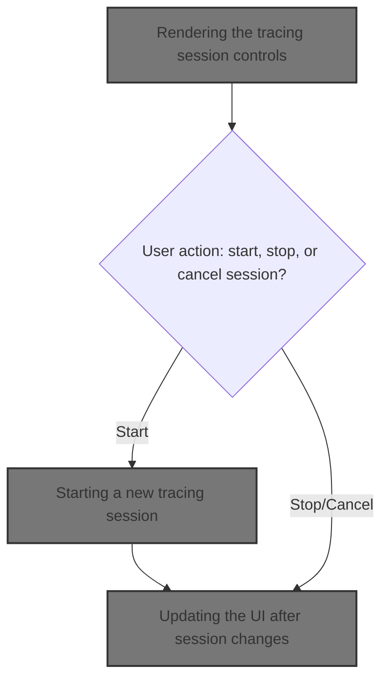

This document explains how users manage tracing sessions through the UI. User actions such as starting, stopping, or canceling a session trigger the creation of a new trace configuration, the setup of an active session, and updates to the UI to reflect the session state.



# Rendering the tracing session controls

<SwmSnippet path="/ui/src/plugins/dev.perfetto.RecordTraceV2/pages/target_selection_page.ts" line="480">

---

In `SessionMgmtRenderer.view`, we set up the UI controls for managing a tracing session. The state and config come from <SwmToken path="ui/src/plugins/dev.perfetto.RecordTraceV2/pages/target_selection_page.ts" pos="481:7:9" line-data="    const session = attrs.recMgr.currentSession;">`attrs.recMgr`</SwmToken>, which handles session logic. Button states (enabled/disabled) depend on whether we're recording and the trace mode, so users can't do something invalid. When you click a button, it triggers async actions (like <SwmToken path="ui/src/plugins/dev.perfetto.RecordTraceV2/pages/target_selection_page.ts" pos="494:13:13" line-data="          onclick: () =&gt; attrs.recMgr.startTracing().then(() =&gt; m.redraw()),">`startTracing`</SwmToken>) and redraws the UI. Next, we call into <SwmPath>[ui/…/dev.perfetto.RecordTraceV2/recording_manager.ts](ui/src/plugins/dev.perfetto.RecordTraceV2/recording_manager.ts)</SwmPath> to actually start a trace session, since that's where the backend logic lives.

```typescript
  view({attrs}: m.CVnode<SessionMgmtAttrs>) {
    const session = attrs.recMgr.currentSession;
    const isValid = attrs.recMgr.recordConfig.traceConfig.mode !== 'LONG_TRACE';
    const isRecording = session?.state === 'RECORDING';
    return [
      m('header', 'Tracing session'),
      m(
        ButtonBar,
        m(Button, {
          label: 'Start tracing',
          icon: 'not_started',
          iconFilled: true,
          className: 'start',
          disabled: isRecording || !isValid,
          onclick: () => attrs.recMgr.startTracing().then(() => m.redraw()),
        }),
        m(Button, {
          label: 'Stop',
          icon: 'stop',
          className: 'stop',
          iconFilled: true,
          disabled: !isRecording || !isValid,
          onclick: () => session?.session?.stop().then(() => m.redraw()),
        }),
        m(Button, {
          label: 'Cancel',
          icon: 'cancel',
          className: 'cancel',
          iconFilled: true,
          disabled: !isRecording || !isValid,
          onclick: () => session?.session?.cancel().then(() => m.redraw()),
        }),
        m(Checkbox, {
          label: 'Open trace when done',
          checked: attrs.recMgr.autoOpenTraceWhenTracingEnds,
          onchange: (e) => {
```

---

</SwmSnippet>

## Starting a new tracing session

<SwmSnippet path="/ui/src/plugins/dev.perfetto.RecordTraceV2/recording_manager.ts" line="144">

---

In <SwmToken path="ui/src/plugins/dev.perfetto.RecordTraceV2/recording_manager.ts" pos="144:3:3" line-data="  async startTracing(): Promise&lt;CurrentTracingSession&gt; {">`startTracing`</SwmToken>, we first check if there's an active tracing session and cancel it if so, making sure we don't have two sessions running. Then we generate a fresh trace config for the new session. This sets up everything needed before actually starting the trace.

```typescript
  async startTracing(): Promise<CurrentTracingSession> {
    if (this._tracingSession !== undefined) {
      this._tracingSession.session?.cancel();
      this._tracingSession = undefined;
    }
    const traceCfg = this.genTraceConfig();
```

---

</SwmSnippet>

### Generating the trace configuration

<SwmSnippet path="/ui/src/plugins/dev.perfetto.RecordTraceV2/recording_manager.ts" line="140">

---

<SwmToken path="ui/src/plugins/dev.perfetto.RecordTraceV2/recording_manager.ts" pos="140:1:1" line-data="  genTraceConfig(): protos.TraceConfig {">`genTraceConfig`</SwmToken> just forwards the call to <SwmToken path="ui/src/plugins/dev.perfetto.RecordTraceV2/recording_manager.ts" pos="141:5:7" line-data="    return this.recordConfig.genTraceConfig(this.currentPlatform);">`recordConfig.genTraceConfig`</SwmToken> with the current platform. No extra logic here—it's just a wrapper to get the config from the right place. Next, we call into <SwmPath>[ui/…/config/config_manager.ts](ui/src/plugins/dev.perfetto.RecordTraceV2/config/config_manager.ts)</SwmPath> to build out the actual config details.

```typescript
  genTraceConfig(): protos.TraceConfig {
    return this.recordConfig.genTraceConfig(this.currentPlatform);
  }
```

---

</SwmSnippet>

### Building the trace config from scratch

```mermaid
%%{init: {"flowchart": {"defaultRenderer": "elk"}} }%%
flowchart TD
    node1["Start with a fresh trace configuration"] --> node2["Remove non-default buffers"]
    click node1 openCode "ui/src/plugins/dev.perfetto.RecordTraceV2/config/config_manager.ts:113:117"
    
    subgraph loop1["For each buffer in configuration"]
      node2 --> node3{"Is buffer the default buffer?"}
      click node3 openCode "ui/src/plugins/dev.perfetto.RecordTraceV2/config/config_manager.ts:120:123"
      node3 -->|"No"| node4["Remove buffer"]
      click node4 openCode "ui/src/plugins/dev.perfetto.RecordTraceV2/config/config_manager.ts:122:123"
      node3 -->|"Yes"| node5["Keep buffer"]
      click node5 openCode "ui/src/plugins/dev.perfetto.RecordTraceV2/config/config_manager.ts:121:121"
      node4 --> node2
      node5 --> node2
    end
    node2 --> node6["Get enabled probes in dependency order"]
    click node6 openCode "ui/src/plugins/dev.perfetto.RecordTraceV2/config/config_manager.ts:128:128"
    
    subgraph loop2["For each enabled probe"]
      node6 --> node7{"Does probe support the selected platform?"}
      click node7 openCode "ui/src/plugins/dev.perfetto.RecordTraceV2/config/config_manager.ts:131:131"
      node7 -->|"Yes"| node8["Add probe's configuration"]
      click node8 openCode "ui/src/plugins/dev.perfetto.RecordTraceV2/config/config_manager.ts:132:132"
      node7 -->|"No"| node9["Skip probe"]
      click node9 openCode "ui/src/plugins/dev.perfetto.RecordTraceV2/config/config_manager.ts:131:131"
      node8 --> node6
      node9 --> node6
    end
    node6 --> node10["Return completed trace configuration"]
    click node10 openCode "ui/src/plugins/dev.perfetto.RecordTraceV2/config/config_manager.ts:133:133"

classDef HeadingStyle fill:#777777,stroke:#333,stroke-width:2px;

%% Swimm:
%% %%{init: {"flowchart": {"defaultRenderer": "elk"}} }%%
%% flowchart TD
%%     node1["Start with a fresh trace configuration"] --> node2["Remove non-default buffers"]
%%     click node1 openCode "<SwmPath>[ui/…/config/config_manager.ts](ui/src/plugins/dev.perfetto.RecordTraceV2/config/config_manager.ts)</SwmPath>:113:117"
%%     
%%     subgraph loop1["For each buffer in configuration"]
%%       node2 --> node3{"Is buffer the default buffer?"}
%%       click node3 openCode "<SwmPath>[ui/…/config/config_manager.ts](ui/src/plugins/dev.perfetto.RecordTraceV2/config/config_manager.ts)</SwmPath>:120:123"
%%       node3 -->|"No"| node4["Remove buffer"]
%%       click node4 openCode "<SwmPath>[ui/…/config/config_manager.ts](ui/src/plugins/dev.perfetto.RecordTraceV2/config/config_manager.ts)</SwmPath>:122:123"
%%       node3 -->|"Yes"| node5["Keep buffer"]
%%       click node5 openCode "<SwmPath>[ui/…/config/config_manager.ts](ui/src/plugins/dev.perfetto.RecordTraceV2/config/config_manager.ts)</SwmPath>:121:121"
%%       node4 --> node2
%%       node5 --> node2
%%     end
%%     node2 --> node6["Get enabled probes in dependency order"]
%%     click node6 openCode "<SwmPath>[ui/…/config/config_manager.ts](ui/src/plugins/dev.perfetto.RecordTraceV2/config/config_manager.ts)</SwmPath>:128:128"
%%     
%%     subgraph loop2["For each enabled probe"]
%%       node6 --> node7{"Does probe support the selected platform?"}
%%       click node7 openCode "<SwmPath>[ui/…/config/config_manager.ts](ui/src/plugins/dev.perfetto.RecordTraceV2/config/config_manager.ts)</SwmPath>:131:131"
%%       node7 -->|"Yes"| node8["Add probe's configuration"]
%%       click node8 openCode "<SwmPath>[ui/…/config/config_manager.ts](ui/src/plugins/dev.perfetto.RecordTraceV2/config/config_manager.ts)</SwmPath>:132:132"
%%       node7 -->|"No"| node9["Skip probe"]
%%       click node9 openCode "<SwmPath>[ui/…/config/config_manager.ts](ui/src/plugins/dev.perfetto.RecordTraceV2/config/config_manager.ts)</SwmPath>:131:131"
%%       node8 --> node6
%%       node9 --> node6
%%     end
%%     node6 --> node10["Return completed trace configuration"]
%%     click node10 openCode "<SwmPath>[ui/…/config/config_manager.ts](ui/src/plugins/dev.perfetto.RecordTraceV2/config/config_manager.ts)</SwmPath>:133:133"
%% 
%% classDef HeadingStyle fill:#777777,stroke:#333,stroke-width:2px;
```



<SwmSnippet path="/ui/src/plugins/dev.perfetto.RecordTraceV2/config/config_manager.ts" line="112">

---

In <SwmToken path="ui/src/plugins/dev.perfetto.RecordTraceV2/config/config_manager.ts" pos="112:1:1" line-data="  genTraceConfig(platform: TargetPlatformId): protos.TraceConfig {">`genTraceConfig`</SwmToken>, we wipe out all previous data sources and non-default buffers so we always start with a clean config. This avoids any stale or leftover settings from earlier sessions.

```typescript
  genTraceConfig(platform: TargetPlatformId): protos.TraceConfig {
    // We approach trace config generation similar to vdom rendering: we start
    // fresh all the time and let the various probes add things to the
    // TraceConfigBuilder.

    this._traceConfig.dataSources.clear();

    // Clear all buffers other than the default one.
    for (const bufId of this._traceConfig.buffers.keys()) {
      if (bufId !== DEFAULT_BUFFER_ID) {
        this._traceConfig.buffers.delete(bufId);
      }
    }
```

---

</SwmSnippet>

<SwmSnippet path="/ui/src/plugins/dev.perfetto.RecordTraceV2/config/config_manager.ts" line="126">

---

After resetting, we loop through probes in dependency order and only include those that support the current platform. Each probe adds its config to the builder, so the final config matches what the platform needs.

```typescript
    // Now regenerate the config. Go in probe registration order, but
    // respect dependencies (deps come first).
    const orderedProbes = this.getProbesOrderedByDep(/* enabledOnly */ true);

    for (const probe of orderedProbes) {
      if (!supportsPlatform(probe, platform)) continue;
      probe.genConfig(this._traceConfig);
    }
```

---

</SwmSnippet>

### Creating and storing the active tracing session

<SwmSnippet path="/ui/src/plugins/dev.perfetto.RecordTraceV2/recording_manager.ts" line="150">

---

Back in <SwmToken path="ui/src/plugins/dev.perfetto.RecordTraceV2/pages/target_selection_page.ts" pos="494:13:13" line-data="          onclick: () =&gt; attrs.recMgr.startTracing().then(() =&gt; m.redraw()),">`startTracing`</SwmToken> (<SwmPath>[ui/…/dev.perfetto.RecordTraceV2/recording_manager.ts](ui/src/plugins/dev.perfetto.RecordTraceV2/recording_manager.ts)</SwmPath>), we use the config we just built to create a new <SwmToken path="ui/src/plugins/dev.perfetto.RecordTraceV2/recording_manager.ts" pos="150:9:9" line-data="    const wrappedSession = new CurrentTracingSession(this, traceCfg);">`CurrentTracingSession`</SwmToken>, stash it in <SwmToken path="ui/src/plugins/dev.perfetto.RecordTraceV2/recording_manager.ts" pos="151:3:3" line-data="    this._tracingSession = wrappedSession;">`_tracingSession`</SwmToken>, and return it. This is how we keep track of the active session.

```typescript
    const wrappedSession = new CurrentTracingSession(this, traceCfg);
    this._tracingSession = wrappedSession;
    return wrappedSession;
  }
```

---

</SwmSnippet>

## Updating the UI after session changes

```mermaid
%%{init: {"flowchart": {"defaultRenderer": "elk"}} }%%
flowchart TD
  node1["Render session management UI"]
  node1 --> node2{"Is there a session error?"}
  click node1 openCode "ui/src/plugins/dev.perfetto.RecordTraceV2/pages/target_selection_page.ts:516:530"
  click node2 openCode "ui/src/plugins/dev.perfetto.RecordTraceV2/pages/target_selection_page.ts:522:522"
  node1 --> node3{"Is there a session?"}
  click node3 openCode "ui/src/plugins/dev.perfetto.RecordTraceV2/pages/target_selection_page.ts:523:528"
  node2 -->|"Yes"| node4["Display error message"]
  click node4 openCode "ui/src/plugins/dev.perfetto.RecordTraceV2/pages/target_selection_page.ts:522:522"
  node3 -->|"Yes"| node5["Display session state"]
  click node5 openCode "ui/src/plugins/dev.perfetto.RecordTraceV2/pages/target_selection_page.ts:524:528"

classDef HeadingStyle fill:#777777,stroke:#333,stroke-width:2px;

%% Swimm:
%% %%{init: {"flowchart": {"defaultRenderer": "elk"}} }%%
%% flowchart TD
%%   node1["Render session management UI"]
%%   node1 --> node2{"Is there a session error?"}
%%   click node1 openCode "<SwmPath>[ui/…/pages/target_selection_page.ts](ui/src/plugins/dev.perfetto.RecordTraceV2/pages/target_selection_page.ts)</SwmPath>:516:530"
%%   click node2 openCode "<SwmPath>[ui/…/pages/target_selection_page.ts](ui/src/plugins/dev.perfetto.RecordTraceV2/pages/target_selection_page.ts)</SwmPath>:522:522"
%%   node1 --> node3{"Is there a session?"}
%%   click node3 openCode "<SwmPath>[ui/…/pages/target_selection_page.ts](ui/src/plugins/dev.perfetto.RecordTraceV2/pages/target_selection_page.ts)</SwmPath>:523:528"
%%   node2 -->|"Yes"| node4["Display error message"]
%%   click node4 openCode "<SwmPath>[ui/…/pages/target_selection_page.ts](ui/src/plugins/dev.perfetto.RecordTraceV2/pages/target_selection_page.ts)</SwmPath>:522:522"
%%   node3 -->|"Yes"| node5["Display session state"]
%%   click node5 openCode "<SwmPath>[ui/…/pages/target_selection_page.ts](ui/src/plugins/dev.perfetto.RecordTraceV2/pages/target_selection_page.ts)</SwmPath>:524:528"
%% 
%% classDef HeadingStyle fill:#777777,stroke:#333,stroke-width:2px;
```



<SwmSnippet path="/ui/src/plugins/dev.perfetto.RecordTraceV2/pages/target_selection_page.ts" line="516">

---

After returning from <SwmPath>[ui/…/dev.perfetto.RecordTraceV2/recording_manager.ts](ui/src/plugins/dev.perfetto.RecordTraceV2/recording_manager.ts)</SwmPath>, `SessionMgmtRenderer.view` updates the UI to reflect the new session state. It uses <SwmToken path="ui/src/plugins/dev.perfetto.RecordTraceV2/pages/target_selection_page.ts" pos="516:1:3" line-data="            attrs.recMgr.autoOpenTraceWhenTracingEnds = Boolean(">`attrs.recMgr`</SwmToken> for session info, shows errors if any, and redraws the session state renderer. Async actions trigger <SwmToken path="ui/src/plugins/dev.perfetto.RecordTraceV2/pages/target_selection_page.ts" pos="494:24:26" line-data="          onclick: () =&gt; attrs.recMgr.startTracing().then(() =&gt; m.redraw()),">`m.redraw`</SwmToken> to keep everything in sync.

```typescript
            attrs.recMgr.autoOpenTraceWhenTracingEnds = Boolean(
              (e.target as HTMLInputElement).checked,
            );
          },
        }),
      ),
      session?.error && m('div', session.error),
      session && [
        m(SessionStateRenderer, {
          session,
          key: session.uuid,
        }),
      ],
    ];
  }
```

---

</SwmSnippet>

&nbsp;

*This is an auto-generated document by Swimm 🌊 and has not yet been verified by a human*

<SwmMeta version="3.0.0" repo-id="Z2l0aHViJTNBJTNBY3BsdXNwbHVzLXBlcmZldHRvJTNBJTNBcmljYXJkb2xvcGV6Zw==" repo-name="cplusplus-perfetto"><sup>Powered by [Swimm](https://app.swimm.io/)</sup></SwmMeta>
