This document describes how tracing commands from the user interface are handled to control and manage tracing sessions. The flow receives a tracing command and its data, determines the requested action, and performs the corresponding tracing operation. Users can start, configure, and interact with tracing sessions through these commands.

# Dispatching Tracing Commands

<SwmSnippet path="/ui/src/chrome_extension/chrome_tracing_controller.ts" line="70">

---

In <SwmToken path="ui/src/chrome_extension/chrome_tracing_controller.ts" pos="70:1:1" line-data="  handleCommand(methodName: string, requestData: Uint8Array) {">`handleCommand`</SwmToken>, we start by checking the <SwmToken path="ui/src/chrome_extension/chrome_tracing_controller.ts" pos="70:3:3" line-data="  handleCommand(methodName: string, requestData: Uint8Array) {">`methodName`</SwmToken>. If it's <SwmToken path="ui/src/chrome_extension/chrome_tracing_controller.ts" pos="72:4:4" line-data="      case &#39;EnableTracing&#39;:">`EnableTracing`</SwmToken>, we immediately delegate to <SwmToken path="ui/src/chrome_extension/chrome_tracing_controller.ts" pos="73:3:3" line-data="        this.enableTracing(requestData);">`enableTracing`</SwmToken> with the provided <SwmToken path="ui/src/chrome_extension/chrome_tracing_controller.ts" pos="70:9:9" line-data="  handleCommand(methodName: string, requestData: Uint8Array) {">`requestData`</SwmToken>. This sets up the tracing session and moves the flow forward to configuring and starting the trace.

```typescript
  handleCommand(methodName: string, requestData: Uint8Array) {
    switch (methodName) {
      case 'EnableTracing':
        this.enableTracing(requestData);
        break;
```

---

</SwmSnippet>

## Preparing Tracing Configuration

```mermaid
%%{init: {"flowchart": {"defaultRenderer": "elk"}} }%%
flowchart TD
  node1["Prepare for new tracing session"]
  click node1 openCode "ui/src/chrome_extension/chrome_tracing_controller.ts:98:98"
  node1 --> node2["Extract tracing configuration"]
  click node2 openCode "ui/src/chrome_extension/chrome_tracing_controller.ts:99:99"
  node2 --> node3{"Is configuration valid?"}
  click node3 openCode "ui/src/chrome_extension/chrome_tracing_controller.ts:100:100"
  node3 -->|"Yes"| node4["Start tracing"]
  click node4 openCode "ui/src/chrome_extension/chrome_tracing_controller.ts:105:105"
  node3 -->|"No"| node5["Send error message"]
  click node5 openCode "ui/src/chrome_extension/chrome_tracing_controller.ts:101:102"
classDef HeadingStyle fill:#777777,stroke:#333,stroke-width:2px;

%% Swimm:
%% %%{init: {"flowchart": {"defaultRenderer": "elk"}} }%%
%% flowchart TD
%%   node1["Prepare for new tracing session"]
%%   click node1 openCode "<SwmPath>[ui/…/chrome_extension/chrome_tracing_controller.ts](ui/src/chrome_extension/chrome_tracing_controller.ts)</SwmPath>:98:98"
%%   node1 --> node2["Extract tracing configuration"]
%%   click node2 openCode "<SwmPath>[ui/…/chrome_extension/chrome_tracing_controller.ts](ui/src/chrome_extension/chrome_tracing_controller.ts)</SwmPath>:99:99"
%%   node2 --> node3{"Is configuration valid?"}
%%   click node3 openCode "<SwmPath>[ui/…/chrome_extension/chrome_tracing_controller.ts](ui/src/chrome_extension/chrome_tracing_controller.ts)</SwmPath>:100:100"
%%   node3 -->|"Yes"| node4["Start tracing"]
%%   click node4 openCode "<SwmPath>[ui/…/chrome_extension/chrome_tracing_controller.ts](ui/src/chrome_extension/chrome_tracing_controller.ts)</SwmPath>:105:105"
%%   node3 -->|"No"| node5["Send error message"]
%%   click node5 openCode "<SwmPath>[ui/…/chrome_extension/chrome_tracing_controller.ts](ui/src/chrome_extension/chrome_tracing_controller.ts)</SwmPath>:101:102"
%% classDef HeadingStyle fill:#777777,stroke:#333,stroke-width:2px;
```



<SwmSnippet path="/ui/src/chrome_extension/chrome_tracing_controller.ts" line="97">

---

<SwmToken path="ui/src/chrome_extension/chrome_tracing_controller.ts" pos="97:1:1" line-data="  enableTracing(enableTracingRequest: Uint8Array) {">`enableTracing`</SwmToken> resets any previous state, extracts and validates the trace configuration from the request, and if valid, hands off to <SwmToken path="ui/src/chrome_extension/chrome_tracing_controller.ts" pos="105:3:3" line-data="    this.handleStartTracing(traceConfigProto);">`handleStartTracing`</SwmToken> to actually start the tracing session.

```typescript
  enableTracing(enableTracingRequest: Uint8Array) {
    this.resetState();
    const traceConfigProto = extractTraceConfig(enableTracingRequest);
    if (!traceConfigProto) {
      this.sendErrorMessage('Invalid trace config');
      return;
    }

    this.handleStartTracing(traceConfigProto);
  }
```

---

</SwmSnippet>

## Starting and Managing Tracing Session

```mermaid
%%{init: {"flowchart": {"defaultRenderer": "elk"}} }%%
flowchart TD
  node1["User requests to start tracing"] --> node2{"Was browser attached successfully?"}
  click node1 openCode "ui/src/chrome_extension/chrome_tracing_controller.ts:266:267"
  click node2 openCode "ui/src/chrome_extension/chrome_tracing_controller.ts:267:274"
  node2 -->|"No"| node3["Show error: Could not attach to browser"]
  click node3 openCode "ui/src/chrome_extension/chrome_tracing_controller.ts:269:273"
  node3 --> node10["End"]
  node2 -->|"Yes"| node4{"Does browser support Perfetto config?"}
  click node4 openCode "ui/src/chrome_extension/chrome_tracing_controller.ts:284:296"
  node4 -->|"Yes"| node5["Start tracing with Perfetto config"]
  click node5 openCode "ui/src/chrome_extension/chrome_tracing_controller.ts:285:292"
  node5 --> node6["Tracing session started (duration set)"]
  click node6 openCode "ui/src/chrome_extension/chrome_tracing_controller.ts:290:295"
  node6 --> node10
  node4 -->|"No"| node7{"Is system data source requested?"}
  click node7 openCode "ui/src/chrome_extension/chrome_tracing_controller.ts:302:308"
  node7 -->|"Yes"| node8["Show error: System tracing not supported"]
  click node8 openCode "ui/src/chrome_extension/chrome_tracing_controller.ts:303:307"
  node8 --> node10
  node7 -->|"No"| node9["Start tracing with Chrome config"]
  click node9 openCode "ui/src/chrome_extension/chrome_tracing_controller.ts:310:314"
  node9 --> node10["End"]

classDef HeadingStyle fill:#777777,stroke:#333,stroke-width:2px;

%% Swimm:
%% %%{init: {"flowchart": {"defaultRenderer": "elk"}} }%%
%% flowchart TD
%%   node1["User requests to start tracing"] --> node2{"Was browser attached successfully?"}
%%   click node1 openCode "<SwmPath>[ui/…/chrome_extension/chrome_tracing_controller.ts](ui/src/chrome_extension/chrome_tracing_controller.ts)</SwmPath>:266:267"
%%   click node2 openCode "<SwmPath>[ui/…/chrome_extension/chrome_tracing_controller.ts](ui/src/chrome_extension/chrome_tracing_controller.ts)</SwmPath>:267:274"
%%   node2 -->|"No"| node3["Show error: Could not attach to browser"]
%%   click node3 openCode "<SwmPath>[ui/…/chrome_extension/chrome_tracing_controller.ts](ui/src/chrome_extension/chrome_tracing_controller.ts)</SwmPath>:269:273"
%%   node3 --> node10["End"]
%%   node2 -->|"Yes"| node4{"Does browser support Perfetto config?"}
%%   click node4 openCode "<SwmPath>[ui/…/chrome_extension/chrome_tracing_controller.ts](ui/src/chrome_extension/chrome_tracing_controller.ts)</SwmPath>:284:296"
%%   node4 -->|"Yes"| node5["Start tracing with Perfetto config"]
%%   click node5 openCode "<SwmPath>[ui/…/chrome_extension/chrome_tracing_controller.ts](ui/src/chrome_extension/chrome_tracing_controller.ts)</SwmPath>:285:292"
%%   node5 --> node6["Tracing session started (duration set)"]
%%   click node6 openCode "<SwmPath>[ui/…/chrome_extension/chrome_tracing_controller.ts](ui/src/chrome_extension/chrome_tracing_controller.ts)</SwmPath>:290:295"
%%   node6 --> node10
%%   node4 -->|"No"| node7{"Is system data source requested?"}
%%   click node7 openCode "<SwmPath>[ui/…/chrome_extension/chrome_tracing_controller.ts](ui/src/chrome_extension/chrome_tracing_controller.ts)</SwmPath>:302:308"
%%   node7 -->|"Yes"| node8["Show error: System tracing not supported"]
%%   click node8 openCode "<SwmPath>[ui/…/chrome_extension/chrome_tracing_controller.ts](ui/src/chrome_extension/chrome_tracing_controller.ts)</SwmPath>:303:307"
%%   node8 --> node10
%%   node7 -->|"No"| node9["Start tracing with Chrome config"]
%%   click node9 openCode "<SwmPath>[ui/…/chrome_extension/chrome_tracing_controller.ts](ui/src/chrome_extension/chrome_tracing_controller.ts)</SwmPath>:310:314"
%%   node9 --> node10["End"]
%% 
%% classDef HeadingStyle fill:#777777,stroke:#333,stroke-width:2px;
```



<SwmSnippet path="/ui/src/chrome_extension/chrome_tracing_controller.ts" line="266">

---

<SwmToken path="ui/src/chrome_extension/chrome_tracing_controller.ts" pos="266:1:1" line-data="  handleStartTracing(traceConfigProto: Uint8Array) {">`handleStartTracing`</SwmToken> attaches to the browser, decodes the trace config, and chooses between Perfetto or <SwmToken path="ui/src/chrome_extension/chrome_tracing_controller.ts" pos="305:19:21" line-data="              &quot; the &#39;Chrome&#39; target instead to record a Chrome-only trace.&quot;,">`Chrome-only`</SwmToken> tracing <SwmToken path="ui/src/base/gcs_uploader.ts" pos="177:30:30" line-data=" * `shasum -a 1 file`. The reason for this is that the crypto APIs support">`APIs`</SwmToken> based on browser support. It starts the tracing session and schedules its end using the duration from the config. If system tracing is requested on unsupported Chrome, it errors out. The next step is to handle trace data, which may involve uploading via <SwmToken path="ui/src/base/gcs_uploader.ts" pos="36:8:8" line-data="  onProgress?: (uploader: GcsUploader) =&gt; void;">`GcsUploader`</SwmToken> if configured.

```typescript
  handleStartTracing(traceConfigProto: Uint8Array) {
    this.devtoolsSocket.attachToBrowser(async (error?: string) => {
      if (error) {
        this.sendErrorMessage(
          `Could not attach to DevTools browser target ` +
            `(req. Chrome >= M81): ${error}`,
        );
        return;
      }

      const requestParams: Protocol.Tracing.StartRequest = {
        streamFormat: 'proto',
        transferMode: 'ReturnAsStream',
        streamCompression: 'gzip',
        bufferUsageReportingInterval: 200,
      };

      const traceConfig = protos.TraceConfig.decode(traceConfigProto);
      if (browserSupportsPerfettoConfig()) {
        const configEncoded = base64Encode(traceConfigProto);
        await this.api.Tracing.start({
          perfettoConfig: configEncoded,
          ...requestParams,
        });
        this.tracingSessionOngoing = true;
        const tracingSessionId = ++this.tracingSessionId;
        setTimeout(
          () => this.endTracing(tracingSessionId),
          traceConfig.durationMs,
        );
      } else {
        console.log(
          'Used Chrome version is too old to support ' +
            'perfettoConfig parameter. Using chrome config only instead.',
        );

        if (hasSystemDataSourceConfig(traceConfig)) {
          this.sendErrorMessage(
            'System tracing is not supported by this Chrome version. Choose' +
              " the 'Chrome' target instead to record a Chrome-only trace.",
          );
          return;
        }

        const chromeConfig = this.extractChromeConfig(traceConfig);
        await this.api.Tracing.start({
          traceConfig: chromeConfig,
          ...requestParams,
        });
      }
    });
  }
```

---

</SwmSnippet>

<SwmSnippet path="/ui/src/base/gcs_uploader.ts" line="65">

---

<SwmToken path="ui/src/base/gcs_uploader.ts" pos="65:5:5" line-data="  private async start(data: Blob | ArrayBuffer | string) {">`start`</SwmToken> hashes or uses the provided file name, skips upload if the file exists, and otherwise uploads with event tracking.

```typescript
  private async start(data: Blob | ArrayBuffer | string) {
    let fname = this.args.fileName;
    if (fname === undefined) {
      // If the file name is unspecified, hash the contents.
      if (data instanceof Blob) {
        fname = await hashFileStreaming(data);
      } else {
        fname = await sha1(data);
      }
    }
    this.uploadedFileName = fname;
    this.uploadedUrl = `https://storage.googleapis.com/${BUCKET_NAME}/${fname}`;

    // Check if the file has been uploaded already. If so, skip.
    const res = await fetch(
      `https://www.googleapis.com/storage/v1/b/${BUCKET_NAME}/o/${fname}`,
    );
    if (res.status === 200) {
      console.log(
        `Skipping upload of ${this.uploadedUrl} because it exists already`,
      );
      this.state = 'UPLOADED';
      this.donePromise.resolve();
      return;
    }

    const reqUrl =
      'https://www.googleapis.com/upload/storage/v1/b/' +
      `${BUCKET_NAME}/o?uploadType=media` +
      `&name=${fname}&predefinedAcl=publicRead`;
    this.req.onabort = (e: ProgressEvent) => this.onRpcEvent(e);
    this.req.onerror = (e: ProgressEvent) => this.onRpcEvent(e);
    this.req.upload.onprogress = (e: ProgressEvent) => this.onRpcEvent(e);
    this.req.onloadend = (e: ProgressEvent) => this.onRpcEvent(e);
    this.req.open('POST', reqUrl, /* async= */ true);
    const mimeType = this.args.mimeType ?? MIME_BINARY;
    this.req.setRequestHeader('Content-Type', mimeType);
    this.req.send(data);
  }
```

---

</SwmSnippet>

## Handling Additional Tracing Actions

```mermaid
%%{init: {"flowchart": {"defaultRenderer": "elk"}} }%%
flowchart TD
    node1{"What is the requested command (methodName)?"}
    click node1 openCode "ui/src/chrome_extension/chrome_tracing_controller.ts:75:94"
    node1 -->|FreeBuffers| node2["Release tracing buffers"]
    click node2 openCode "ui/src/chrome_extension/chrome_tracing_controller.ts:76:76"
    node1 -->|ReadBuffers| node3["Read tracing buffers"]
    click node3 openCode "ui/src/chrome_extension/chrome_tracing_controller.ts:79:79"
    node1 -->|DisableTracing| node4["Disable tracing"]
    click node4 openCode "ui/src/chrome_extension/chrome_tracing_controller.ts:82:82"
    node1 -->|GetTraceStats| node5["Retrieve trace statistics"]
    click node5 openCode "ui/src/chrome_extension/chrome_tracing_controller.ts:85:85"
    node1 -->|GetCategories| node6["Retrieve trace categories"]
    click node6 openCode "ui/src/chrome_extension/chrome_tracing_controller.ts:88:88"
    node1 -->|"Unrecognized"| node7["Send error message: Action not recognized"]
    click node7 openCode "ui/src/chrome_extension/chrome_tracing_controller.ts:91:92"

classDef HeadingStyle fill:#777777,stroke:#333,stroke-width:2px;

%% Swimm:
%% %%{init: {"flowchart": {"defaultRenderer": "elk"}} }%%
%% flowchart TD
%%     node1{"What is the requested command (<SwmToken path="ui/src/chrome_extension/chrome_tracing_controller.ts" pos="70:3:3" line-data="  handleCommand(methodName: string, requestData: Uint8Array) {">`methodName`</SwmToken>)?"}
%%     click node1 openCode "<SwmPath>[ui/…/chrome_extension/chrome_tracing_controller.ts](ui/src/chrome_extension/chrome_tracing_controller.ts)</SwmPath>:75:94"
%%     node1 -->|<SwmToken path="ui/src/chrome_extension/chrome_tracing_controller.ts" pos="75:4:4" line-data="      case &#39;FreeBuffers&#39;:">`FreeBuffers`</SwmToken>| node2["Release tracing buffers"]
%%     click node2 openCode "<SwmPath>[ui/…/chrome_extension/chrome_tracing_controller.ts](ui/src/chrome_extension/chrome_tracing_controller.ts)</SwmPath>:76:76"
%%     node1 -->|<SwmToken path="ui/src/chrome_extension/chrome_tracing_controller.ts" pos="78:4:4" line-data="      case &#39;ReadBuffers&#39;:">`ReadBuffers`</SwmToken>| node3["Read tracing buffers"]
%%     click node3 openCode "<SwmPath>[ui/…/chrome_extension/chrome_tracing_controller.ts](ui/src/chrome_extension/chrome_tracing_controller.ts)</SwmPath>:79:79"
%%     node1 -->|<SwmToken path="ui/src/chrome_extension/chrome_tracing_controller.ts" pos="81:4:4" line-data="      case &#39;DisableTracing&#39;:">`DisableTracing`</SwmToken>| node4["Disable tracing"]
%%     click node4 openCode "<SwmPath>[ui/…/chrome_extension/chrome_tracing_controller.ts](ui/src/chrome_extension/chrome_tracing_controller.ts)</SwmPath>:82:82"
%%     node1 -->|<SwmToken path="ui/src/chrome_extension/chrome_tracing_controller.ts" pos="84:4:4" line-data="      case &#39;GetTraceStats&#39;:">`GetTraceStats`</SwmToken>| node5["Retrieve trace statistics"]
%%     click node5 openCode "<SwmPath>[ui/…/chrome_extension/chrome_tracing_controller.ts](ui/src/chrome_extension/chrome_tracing_controller.ts)</SwmPath>:85:85"
%%     node1 -->|<SwmToken path="ui/src/chrome_extension/chrome_tracing_controller.ts" pos="87:4:4" line-data="      case &#39;GetCategories&#39;:">`GetCategories`</SwmToken>| node6["Retrieve trace categories"]
%%     click node6 openCode "<SwmPath>[ui/…/chrome_extension/chrome_tracing_controller.ts](ui/src/chrome_extension/chrome_tracing_controller.ts)</SwmPath>:88:88"
%%     node1 -->|"Unrecognized"| node7["Send error message: Action not recognized"]
%%     click node7 openCode "<SwmPath>[ui/…/chrome_extension/chrome_tracing_controller.ts](ui/src/chrome_extension/chrome_tracing_controller.ts)</SwmPath>:91:92"
%% 
%% classDef HeadingStyle fill:#777777,stroke:#333,stroke-width:2px;
```



<SwmSnippet path="/ui/src/chrome_extension/chrome_tracing_controller.ts" line="75">

---

Back in ChromeTracingController.handleCommand, after returning from <SwmToken path="ui/src/chrome_extension/chrome_tracing_controller.ts" pos="73:3:3" line-data="        this.enableTracing(requestData);">`enableTracing`</SwmToken>, we handle other commands like <SwmToken path="ui/src/chrome_extension/chrome_tracing_controller.ts" pos="75:4:4" line-data="      case &#39;FreeBuffers&#39;:">`FreeBuffers`</SwmToken>, <SwmToken path="ui/src/chrome_extension/chrome_tracing_controller.ts" pos="78:4:4" line-data="      case &#39;ReadBuffers&#39;:">`ReadBuffers`</SwmToken>, and <SwmToken path="ui/src/chrome_extension/chrome_tracing_controller.ts" pos="81:4:4" line-data="      case &#39;DisableTracing&#39;:">`DisableTracing`</SwmToken>. Each is routed to its own handler, and the state from <SwmToken path="ui/src/chrome_extension/chrome_tracing_controller.ts" pos="73:3:3" line-data="        this.enableTracing(requestData);">`enableTracing`</SwmToken> can impact how these commands work.

```typescript
      case 'FreeBuffers':
        this.freeBuffers();
        break;
      case 'ReadBuffers':
        this.readBuffers();
        break;
      case 'DisableTracing':
        this.disableTracing();
        break;
      case 'GetTraceStats':
        this.getTraceStats();
        break;
      case 'GetCategories':
        this.getCategories();
        break;
      default:
        this.sendErrorMessage('Action not recognized');
        console.log('Received not recognized message: ', methodName);
        break;
    }
  }
```

---

</SwmSnippet>

&nbsp;

*This is an auto-generated document by Swimm 🌊 and has not yet been verified by a human*

<SwmMeta version="3.0.0" repo-id="Z2l0aHViJTNBJTNBY3BsdXNwbHVzLXBlcmZldHRvJTNBJTNBcmljYXJkb2xvcGV6Zw==" repo-name="cplusplus-perfetto"><sup>Powered by [Swimm](https://app.swimm.io/)</sup></SwmMeta>
