This document describes how users manage tracks and workspaces in the timeline UI. The toolbar offers controls for organizing tracks and managing workspaces. When an area is selected, users can perform bulk operations, such as editing shared settings or copying tracks to other workspaces, including creating or switching to new workspaces.

# Toolbar Controls and Workspace Menu

```mermaid
%%{init: {"flowchart": {"defaultRenderer": "elk"}} }%%
flowchart TD
  node1["Display timeline toolbar"]
  click node1 openCode "ui/src/frontend/timeline_page/timeline_toolbar.ts:40:87"
  node1 --> node2{"Are all tracks collapsed?"}
  click node2 openCode "ui/src/frontend/timeline_page/timeline_toolbar.ts:43:43"
  node2 -->|"Yes"| node3["Show 'Expand all' button (expands all tracks)"]
  click node3 openCode "ui/src/frontend/timeline_page/timeline_toolbar.ts:53:69"
  node2 -->|"No"| node4["Show 'Collapse all' button (collapses all tracks)"]
  click node4 openCode "ui/src/frontend/timeline_page/timeline_toolbar.ts:53:69"
  subgraph loop1["For each track"]
    node3 --> node5["Expand track"]
    click node5 openCode "ui/src/frontend/timeline_page/timeline_toolbar.ts:57:59"
    node4 --> node6["Collapse track"]
    click node6 openCode "ui/src/frontend/timeline_page/timeline_toolbar.ts:61:63"
  end
  node1 --> node7{"Are there pinned tracks?"}
  click node7 openCode "ui/src/frontend/timeline_page/timeline_toolbar.ts:79:79"
  node7 -->|"Yes"| node8["Show 'Unpin all' button (unpins all pinned tracks)"]
  click node8 openCode "ui/src/frontend/timeline_page/timeline_toolbar.ts:70:81"
  node7 -->|"No"| node9["'Unpin all' button disabled"]
  click node9 openCode "ui/src/frontend/timeline_page/timeline_toolbar.ts:79:79"
  subgraph loop2["For each pinned track"]
    node8 --> node10["Unpin track"]
    click node10 openCode "ui/src/frontend/timeline_page/timeline_toolbar.ts:73:75"
  end
  node1 --> node11["Show track filter"]
  click node11 openCode "ui/src/frontend/timeline_page/timeline_toolbar.ts:82:82"
  node1 --> node12["Show workspace menu (actions depend on workspace editability)"]
  click node12 openCode "ui/src/frontend/timeline_page/timeline_toolbar.ts:83:83"
  node1 --> node13{"Is selection kind 'area'?"}
  click node13 openCode "ui/src/frontend/timeline_page/timeline_toolbar.ts:44:44"
  node13 -->|"Yes"| node14["Show bulk tracks menu"]
  click node14 openCode "ui/src/frontend/timeline_page/timeline_toolbar.ts:85:85"
  node13 -->|"No"| node15["Bulk tracks menu not shown"]
  click node15 openCode "ui/src/frontend/timeline_page/timeline_toolbar.ts:85:85"

classDef HeadingStyle fill:#777777,stroke:#333,stroke-width:2px;

%% Swimm:
%% %%{init: {"flowchart": {"defaultRenderer": "elk"}} }%%
%% flowchart TD
%%   node1["Display timeline toolbar"]
%%   click node1 openCode "<SwmPath>[ui/…/timeline_page/timeline_toolbar.ts](ui/src/frontend/timeline_page/timeline_toolbar.ts)</SwmPath>:40:87"
%%   node1 --> node2{"Are all tracks collapsed?"}
%%   click node2 openCode "<SwmPath>[ui/…/timeline_page/timeline_toolbar.ts](ui/src/frontend/timeline_page/timeline_toolbar.ts)</SwmPath>:43:43"
%%   node2 -->|"Yes"| node3["Show 'Expand all' button (expands all tracks)"]
%%   click node3 openCode "<SwmPath>[ui/…/timeline_page/timeline_toolbar.ts](ui/src/frontend/timeline_page/timeline_toolbar.ts)</SwmPath>:53:69"
%%   node2 -->|"No"| node4["Show 'Collapse all' button (collapses all tracks)"]
%%   click node4 openCode "<SwmPath>[ui/…/timeline_page/timeline_toolbar.ts](ui/src/frontend/timeline_page/timeline_toolbar.ts)</SwmPath>:53:69"
%%   subgraph loop1["For each track"]
%%     node3 --> node5["Expand track"]
%%     click node5 openCode "<SwmPath>[ui/…/timeline_page/timeline_toolbar.ts](ui/src/frontend/timeline_page/timeline_toolbar.ts)</SwmPath>:57:59"
%%     node4 --> node6["Collapse track"]
%%     click node6 openCode "<SwmPath>[ui/…/timeline_page/timeline_toolbar.ts](ui/src/frontend/timeline_page/timeline_toolbar.ts)</SwmPath>:61:63"
%%   end
%%   node1 --> node7{"Are there pinned tracks?"}
%%   click node7 openCode "<SwmPath>[ui/…/timeline_page/timeline_toolbar.ts](ui/src/frontend/timeline_page/timeline_toolbar.ts)</SwmPath>:79:79"
%%   node7 -->|"Yes"| node8["Show 'Unpin all' button (unpins all pinned tracks)"]
%%   click node8 openCode "<SwmPath>[ui/…/timeline_page/timeline_toolbar.ts](ui/src/frontend/timeline_page/timeline_toolbar.ts)</SwmPath>:70:81"
%%   node7 -->|"No"| node9["'Unpin all' button disabled"]
%%   click node9 openCode "<SwmPath>[ui/…/timeline_page/timeline_toolbar.ts](ui/src/frontend/timeline_page/timeline_toolbar.ts)</SwmPath>:79:79"
%%   subgraph loop2["For each pinned track"]
%%     node8 --> node10["Unpin track"]
%%     click node10 openCode "<SwmPath>[ui/…/timeline_page/timeline_toolbar.ts](ui/src/frontend/timeline_page/timeline_toolbar.ts)</SwmPath>:73:75"
%%   end
%%   node1 --> node11["Show track filter"]
%%   click node11 openCode "<SwmPath>[ui/…/timeline_page/timeline_toolbar.ts](ui/src/frontend/timeline_page/timeline_toolbar.ts)</SwmPath>:82:82"
%%   node1 --> node12["Show workspace menu (actions depend on workspace editability)"]
%%   click node12 openCode "<SwmPath>[ui/…/timeline_page/timeline_toolbar.ts](ui/src/frontend/timeline_page/timeline_toolbar.ts)</SwmPath>:83:83"
%%   node1 --> node13{"Is selection kind 'area'?"}
%%   click node13 openCode "<SwmPath>[ui/…/timeline_page/timeline_toolbar.ts](ui/src/frontend/timeline_page/timeline_toolbar.ts)</SwmPath>:44:44"
%%   node13 -->|"Yes"| node14["Show bulk tracks menu"]
%%   click node14 openCode "<SwmPath>[ui/…/timeline_page/timeline_toolbar.ts](ui/src/frontend/timeline_page/timeline_toolbar.ts)</SwmPath>:85:85"
%%   node13 -->|"No"| node15["Bulk tracks menu not shown"]
%%   click node15 openCode "<SwmPath>[ui/…/timeline_page/timeline_toolbar.ts](ui/src/frontend/timeline_page/timeline_toolbar.ts)</SwmPath>:85:85"
%% 
%% classDef HeadingStyle fill:#777777,stroke:#333,stroke-width:2px;
```



<SwmSnippet path="/ui/src/frontend/timeline_page/timeline_toolbar.ts" line="40">

---

In `TimelineToolbar.view`, we set up the main toolbar UI, including buttons for expanding/collapsing all tracks and unpinning all pinned tracks. The expand/collapse button checks if all tracks are collapsed and toggles their state accordingly. The unpin button removes all pinned tracks, but is disabled if there are none. After these controls, we call <SwmToken path="ui/src/frontend/timeline_page/timeline_toolbar.ts" pos="83:3:3" line-data="      this.renderWorkspaceMenu(trace),">`renderWorkspaceMenu`</SwmToken> to inject the workspace management UI, letting users switch, rename, or create workspaces right from the toolbar. This keeps workspace actions grouped with other track controls.

```typescript
  view({attrs}: m.Vnode<TimelineToolbarAttrs>) {
    const trace = attrs.trace;
    const workspace = trace.currentWorkspace;
    const allCollapsed = workspace.flatTracks.every((n) => n.collapsed);
    const selection = trace.selection.selection;

    return m(
      Stack,
      {
        className: 'pf-timeline-toolbar',
        orientation: 'horizontal',
        spacing: 'small',
      },
      m(Button, {
        onclick: (e: Event) => {
          e.preventDefault();
          if (allCollapsed) {
            trace.currentWorkspace.flatTracks.forEach((track) =>
              track.expand(),
            );
          } else {
            trace.currentWorkspace.flatTracks.forEach((track) =>
              track.collapse(),
            );
          }
        },
        title: allCollapsed ? 'Expand all' : 'Collapse all',
        icon: allCollapsed ? 'unfold_more' : 'unfold_less',
        compact: COMPACT_BUTTONS,
      }),
      m(Button, {
        onclick: (e: Event) => {
          e.preventDefault();
          trace.currentWorkspace.pinnedTracks.forEach((t) =>
            trace.currentWorkspace.unpinTrack(t),
          );
        },
        title: 'Unpin all pinned tracks',
        icon: 'keep_off',
        disabled: trace.currentWorkspace.pinnedTracks.length === 0,
        compact: COMPACT_BUTTONS,
      }),
      this.renderTrackFilter(trace),
      this.renderWorkspaceMenu(trace),
      m(StackAuto),
```

---

</SwmSnippet>

<SwmSnippet path="/ui/src/frontend/timeline_page/timeline_toolbar.ts" line="126">

---

<SwmToken path="ui/src/frontend/timeline_page/timeline_toolbar.ts" pos="126:3:3" line-data="  private renderWorkspaceMenu(trace: TraceImpl) {">`renderWorkspaceMenu`</SwmToken> builds the workspace dropdown menu. It lists all workspaces, lets you switch between them, and provides options to create, rename, or remove workspaces, plus add new track groups. Actions like renaming or removing are only enabled if the workspace is user-editable. Async prompts are used for user input when renaming or creating groups. The menu structure is built with Mithril components and event handlers for each action.

```typescript
  private renderWorkspaceMenu(trace: TraceImpl) {
    const workspaces = trace.workspaces;
    const currentWorkspace = trace.currentWorkspace;
    return m(
      PopupMenu,
      {
        trigger: m(Button, {
          label: currentWorkspace.title,
          icon: 'workspaces',
          compact: COMPACT_BUTTONS,
          shrink: true,
        }),
      },
      [
        m(MenuTitle, {label: 'All workspaces'}),
        workspaces.all.map((ws) => {
          return m(MenuItem, {
            label: ws.title,
            icon:
              ws === trace?.currentWorkspace
                ? 'radio_button_checked'
                : 'radio_button_unchecked',
            onclick: () => {
              workspaces.switchWorkspace(ws);
            },
          });
        }),
        m(MenuDivider),
        m(MenuItem, {
          label: 'new workspace',
          icon: 'add',
          onclick: () => {
            const ws = workspaces.createEmptyWorkspace('Untitled Workspace');
            workspaces.switchWorkspace(ws);
          },
        }),
        m(MenuDivider),
        m(MenuTitle, {label: 'Current workspace'}),
        m(MenuItem, {
          icon: 'edit',
          label: 'Rename',
          disabled: !currentWorkspace.userEditable,
          title: currentWorkspace.userEditable
            ? 'Rename current workspace'
            : 'This workspace is not editable - please create a new workspace if you wish to modify it',
          onclick: async () => {
            const newName = await trace.omnibox.prompt('Enter a new name...');
            if (newName) {
              workspaces.currentWorkspace.title = newName;
            }
          },
        }),
        m(MenuItem, {
          icon: Icons.Delete,
          label: 'Remove',
          disabled: !currentWorkspace.userEditable,
          title: currentWorkspace.userEditable
            ? 'Remove current workspace'
            : 'This workspace is not editable - please reate a new workspace if you wish to modify it',
          onclick: () => {
            workspaces.removeWorkspace(workspaces.currentWorkspace);
          },
        }),
        m(MenuItem, {
          icon: 'create_new_folder',
          label: 'New track group',
          disabled: !trace.currentWorkspace.userEditable,
          title: trace.currentWorkspace.userEditable
            ? 'Create new group'
            : 'This workspace is not editable - please create a new workspace if you wish to modify it',
          onclick: async () => {
            const result = await trace.omnibox.prompt('Group name...');
            if (result) {
              const group = new TrackNode({name: result, isSummary: true});
              trace.currentWorkspace.addChildLast(group);
            }
          },
        }),
      ],
    );
  }
```

---

</SwmSnippet>

<SwmSnippet path="/ui/src/frontend/timeline_page/timeline_toolbar.ts" line="85">

---

After returning from <SwmToken path="ui/src/frontend/timeline_page/timeline_toolbar.ts" pos="83:3:3" line-data="      this.renderWorkspaceMenu(trace),">`renderWorkspaceMenu`</SwmToken>, `TimelineToolbar.view` conditionally adds the bulk tracks menu. This only happens if the current selection is an 'area', so bulk track operations are only available when the user has selected a region in the timeline.

```typescript
      selection.kind === 'area' && this.renderBulkTracksMenu(trace, selection),
    );
  }
```

---

</SwmSnippet>

# Bulk Track Operations Menu

<SwmSnippet path="/ui/src/frontend/timeline_page/timeline_toolbar.ts" line="89">

---

In <SwmToken path="ui/src/frontend/timeline_page/timeline_toolbar.ts" pos="89:3:3" line-data="  private renderBulkTracksMenu(trace: TraceImpl, selection: AreaSelection) {">`renderBulkTracksMenu`</SwmToken>, we start by preparing the menu for bulk operations on selected tracks. We call <SwmToken path="ui/src/frontend/timeline_page/timeline_toolbar.ts" pos="90:9:9" line-data="    const settingsMenuItems = this.renderBulkSettingsMenu(trace);">`renderBulkSettingsMenu`</SwmToken> next to get any settings that can be edited for all selected tracks, so we can include those options in the menu.

```typescript
  private renderBulkTracksMenu(trace: TraceImpl, selection: AreaSelection) {
    const settingsMenuItems = this.renderBulkSettingsMenu(trace);

```

---

</SwmSnippet>

## Bulk Track Settings Filtering

```mermaid
%%{init: {"flowchart": {"defaultRenderer": "elk"}} }%%
flowchart TD
    node1{"Is selection kind 'area'?"}
    click node1 openCode "ui/src/frontend/timeline_page/timeline_toolbar.ts:401:401"
    node1 -->|"Yes"| node2["Collect settings from selected tracks"]
    click node2 openCode "ui/src/frontend/timeline_page/timeline_toolbar.ts:408:416"
    node1 -->|"No"| node7["Do not render menu"]
    click node7 openCode "ui/src/frontend/timeline_page/timeline_toolbar.ts:401:402"
    subgraph loop1["For each selected track"]
      node2 --> node3["Group settings by descriptor"]
      click node3 openCode "ui/src/frontend/timeline_page/timeline_toolbar.ts:412:415"
    end
    subgraph loop2["For each setting group"]
      node3 --> node4{"Is setting present in all tracks?"}
      click node4 openCode "ui/src/frontend/timeline_page/timeline_toolbar.ts:420:421"
      node4 -->|"Yes"| node8["Render menu entry for bulk editing"]
      click node8 openCode "ui/src/frontend/timeline_page/timeline_toolbar.ts:430:444"
      node4 -->|"No"| node6["Remove setting"]
      click node6 openCode "ui/src/frontend/timeline_page/timeline_toolbar.ts:421:422"
    end

classDef HeadingStyle fill:#777777,stroke:#333,stroke-width:2px;

%% Swimm:
%% %%{init: {"flowchart": {"defaultRenderer": "elk"}} }%%
%% flowchart TD
%%     node1{"Is selection kind 'area'?"}
%%     click node1 openCode "<SwmPath>[ui/…/timeline_page/timeline_toolbar.ts](ui/src/frontend/timeline_page/timeline_toolbar.ts)</SwmPath>:401:401"
%%     node1 -->|"Yes"| node2["Collect settings from selected tracks"]
%%     click node2 openCode "<SwmPath>[ui/…/timeline_page/timeline_toolbar.ts](ui/src/frontend/timeline_page/timeline_toolbar.ts)</SwmPath>:408:416"
%%     node1 -->|"No"| node7["Do not render menu"]
%%     click node7 openCode "<SwmPath>[ui/…/timeline_page/timeline_toolbar.ts](ui/src/frontend/timeline_page/timeline_toolbar.ts)</SwmPath>:401:402"
%%     subgraph loop1["For each selected track"]
%%       node2 --> node3["Group settings by descriptor"]
%%       click node3 openCode "<SwmPath>[ui/…/timeline_page/timeline_toolbar.ts](ui/src/frontend/timeline_page/timeline_toolbar.ts)</SwmPath>:412:415"
%%     end
%%     subgraph loop2["For each setting group"]
%%       node3 --> node4{"Is setting present in all tracks?"}
%%       click node4 openCode "<SwmPath>[ui/…/timeline_page/timeline_toolbar.ts](ui/src/frontend/timeline_page/timeline_toolbar.ts)</SwmPath>:420:421"
%%       node4 -->|"Yes"| node8["Render menu entry for bulk editing"]
%%       click node8 openCode "<SwmPath>[ui/…/timeline_page/timeline_toolbar.ts](ui/src/frontend/timeline_page/timeline_toolbar.ts)</SwmPath>:430:444"
%%       node4 -->|"No"| node6["Remove setting"]
%%       click node6 openCode "<SwmPath>[ui/…/timeline_page/timeline_toolbar.ts](ui/src/frontend/timeline_page/timeline_toolbar.ts)</SwmPath>:421:422"
%%     end
%% 
%% classDef HeadingStyle fill:#777777,stroke:#333,stroke-width:2px;
```



<SwmSnippet path="/ui/src/frontend/timeline_page/timeline_toolbar.ts" line="399">

---

In <SwmToken path="ui/src/frontend/timeline_page/timeline_toolbar.ts" pos="399:3:3" line-data="  private renderBulkSettingsMenu(trace: TraceImpl): m.Children {">`renderBulkSettingsMenu`</SwmToken>, we check if the selection is an area and then gather all settings from the selected tracks, grouping them by descriptor. We filter out any settings not present in every selected track, so only shared settings are available for bulk editing. If there are no shared settings, we return null and skip rendering the menu.

```typescript
  private renderBulkSettingsMenu(trace: TraceImpl): m.Children {
    const selection = trace.selection.selection;
    if (selection.kind !== 'area') return null;

    // Get all unique settings for the selected tracks.
    const allSettings = new Map<
      TrackSettingDescriptor<unknown>,
      TrackSetting<unknown>[]
    >();
    for (const track of selection.tracks) {
      const settings = track.renderer?.settings;
      if (!settings) continue;
      for (const setting of settings) {
        const existing = allSettings.get(setting.descriptor) ?? [];
        existing.push(setting);
        allSettings.set(setting.descriptor, existing);
      }
    }
```

---

</SwmSnippet>

<SwmSnippet path="/ui/src/frontend/timeline_page/timeline_toolbar.ts" line="418">

---

Here, we filter out any settings not shared by all selected tracks before rendering the menu.

```typescript
    // Remove any settings that are not common to all selected tracks.
    for (const [descriptor, settings] of allSettings) {
      if (settings.length !== selection.tracks.length) {
        allSettings.delete(descriptor);
      }
    }
```

---

</SwmSnippet>

<SwmSnippet path="/ui/src/frontend/timeline_page/timeline_toolbar.ts" line="428">

---

After filtering, we render a menu entry for each shared setting using <SwmToken path="ui/src/frontend/timeline_page/timeline_toolbar.ts" pos="434:1:1" line-data="        renderTrackSettingMenu(">`renderTrackSettingMenu`</SwmToken>. Each entry lets the user set a value that gets applied to all selected tracks' settings of that type. The menu only shows up if there are any shared settings left.

```typescript
    // Iterate over all unique settings, rendering a menu entry for each.
    const settingEntries: m.Children[] = [];
    for (const [descriptor, settings] of allSettings) {
      // If all values are the same, we can render a single select.

      settingEntries.push(
        renderTrackSettingMenu(
          descriptor,
          (value) => {
            // Set all the settings to the same thing!
            for (const setting of settings) {
              setting.setValue(value);
            }
          },
          settings.map((s) => s.getValue()),
        ),
      );
    }
```

---

</SwmSnippet>

## Bulk Track Menu Actions

```mermaid
%%{init: {"flowchart": {"defaultRenderer": "elk"}} }%%
flowchart TD
  node1["User clicks bulk tracks button labeled with number of selected tracks"]
  click node1 openCode "ui/src/frontend/timeline_page/timeline_toolbar.ts:95:104"
  node1 --> node2["Show popup menu with sections"]
  click node2 openCode "ui/src/frontend/timeline_page/timeline_toolbar.ts:93:105"
  node2 --> node3["Show info: 'Changes apply to all selected tracks'"]
  click node3 openCode "ui/src/frontend/timeline_page/timeline_toolbar.ts:107:114"
  node3 --> node4["Show section title: 'Workspace'"]
  click node4 openCode "ui/src/frontend/timeline_page/timeline_toolbar.ts:115:115"
  node4 --> node5["Offer 'Copy selected tracks to workspace'"]
  click node5 openCode "ui/src/frontend/timeline_page/timeline_toolbar.ts:116:116"
  node5 --> node6{"Are bulk track settings available?"}
  click node6 openCode "ui/src/frontend/timeline_page/timeline_toolbar.ts:117:121"
  node6 -->|"Yes"| node7["Show divider and section title: 'Bulk track settings', then show bulk settings items"]
  click node7 openCode "ui/src/frontend/timeline_page/timeline_toolbar.ts:118:121"
  node6 -->|"No"| node8["Menu ends"]
classDef HeadingStyle fill:#777777,stroke:#333,stroke-width:2px;

%% Swimm:
%% %%{init: {"flowchart": {"defaultRenderer": "elk"}} }%%
%% flowchart TD
%%   node1["User clicks bulk tracks button labeled with number of selected tracks"]
%%   click node1 openCode "<SwmPath>[ui/…/timeline_page/timeline_toolbar.ts](ui/src/frontend/timeline_page/timeline_toolbar.ts)</SwmPath>:95:104"
%%   node1 --> node2["Show popup menu with sections"]
%%   click node2 openCode "<SwmPath>[ui/…/timeline_page/timeline_toolbar.ts](ui/src/frontend/timeline_page/timeline_toolbar.ts)</SwmPath>:93:105"
%%   node2 --> node3["Show info: 'Changes apply to all selected tracks'"]
%%   click node3 openCode "<SwmPath>[ui/…/timeline_page/timeline_toolbar.ts](ui/src/frontend/timeline_page/timeline_toolbar.ts)</SwmPath>:107:114"
%%   node3 --> node4["Show section title: 'Workspace'"]
%%   click node4 openCode "<SwmPath>[ui/…/timeline_page/timeline_toolbar.ts](ui/src/frontend/timeline_page/timeline_toolbar.ts)</SwmPath>:115:115"
%%   node4 --> node5["Offer 'Copy selected tracks to workspace'"]
%%   click node5 openCode "<SwmPath>[ui/…/timeline_page/timeline_toolbar.ts](ui/src/frontend/timeline_page/timeline_toolbar.ts)</SwmPath>:116:116"
%%   node5 --> node6{"Are bulk track settings available?"}
%%   click node6 openCode "<SwmPath>[ui/…/timeline_page/timeline_toolbar.ts](ui/src/frontend/timeline_page/timeline_toolbar.ts)</SwmPath>:117:121"
%%   node6 -->|"Yes"| node7["Show divider and section title: 'Bulk track settings', then show bulk settings items"]
%%   click node7 openCode "<SwmPath>[ui/…/timeline_page/timeline_toolbar.ts](ui/src/frontend/timeline_page/timeline_toolbar.ts)</SwmPath>:118:121"
%%   node6 -->|"No"| node8["Menu ends"]
%% classDef HeadingStyle fill:#777777,stroke:#333,stroke-width:2px;
```



<SwmSnippet path="/ui/src/frontend/timeline_page/timeline_toolbar.ts" line="92">

---

After returning from <SwmToken path="ui/src/frontend/timeline_page/timeline_toolbar.ts" pos="90:9:9" line-data="    const settingsMenuItems = this.renderBulkSettingsMenu(trace);">`renderBulkSettingsMenu`</SwmToken>, <SwmToken path="ui/src/frontend/timeline_page/timeline_toolbar.ts" pos="85:15:15" line-data="      selection.kind === &#39;area&#39; &amp;&amp; this.renderBulkTracksMenu(trace, selection),">`renderBulkTracksMenu`</SwmToken> builds the popup menu for bulk actions. The button label reflects the number of selected tracks, and we only show the bulk settings section if there are shared settings. Next, we call <SwmToken path="ui/src/frontend/timeline_page/timeline_toolbar.ts" pos="116:3:3" line-data="        this.renderCopySelectedTracksToWorkspace(trace, selection),">`renderCopySelectedTracksToWorkspace`</SwmToken> to add options for copying the selected tracks to other workspaces.

```typescript
    return m(
      PopupMenu,
      {
        trigger: m(Button, {
          rightIcon: 'arrow_drop_down',
          icon: 'check',
          compact: true,
          rounded: true,
          label: `${selection.tracks.length} ${selection.tracks.length === 1 ? 'track' : 'tracks'}`,
          variant: ButtonVariant.Filled,
          intent: Intent.Primary,
          title: `Bulk operations on all ${selection.tracks.length} selected tracks`,
        }),
      },
      [
        m(
          Callout,
          {
            className: 'pf-timeline-toolbar__bulk-callout',
            icon: Icons.Info,
          },
          `Changes apply to all selected tracks`,
        ),
        m(MenuTitle, {label: 'Workspace'}),
        this.renderCopySelectedTracksToWorkspace(trace, selection),
        Boolean(settingsMenuItems) && [
          m(MenuDivider),
          m(MenuTitle, {label: 'Bulk track settings'}),
          settingsMenuItems,
        ],
      ],
    );
  }
```

---

</SwmSnippet>

# Copying Selected Tracks to Workspace

```mermaid
%%{init: {"flowchart": {"defaultRenderer": "elk"}} }%%
flowchart TD
  node1["User opens copy menu"]
  click node1 openCode "ui/src/frontend/timeline_page/timeline_toolbar.ts:310:379"
  node1 --> node2{"Is an area selected?"}
  click node2 openCode "ui/src/frontend/timeline_page/timeline_toolbar.ts:314:314"
  node2 -->|"No"| node3["Show menu items disabled, prompt to select area"]
  click node3 openCode "ui/src/frontend/timeline_page/timeline_toolbar.ts:323:323"
  node2 -->|"Yes"| node4["Show 'Copy to' options"]
  click node4 openCode "ui/src/frontend/timeline_page/timeline_toolbar.ts:315:341"
  
  subgraph loop1["For each workspace in 'Copy to'"]
    node4 --> node5{"Is workspace user-editable?"}
    click node5 openCode "ui/src/frontend/timeline_page/timeline_toolbar.ts:328:328"
    node5 -->|"No"| node6["Show workspace as disabled"]
    click node6 openCode "ui/src/frontend/timeline_page/timeline_toolbar.ts:328:328"
    node5 -->|"Yes"| node7["Enable copy to workspace"]
    click node7 openCode "ui/src/frontend/timeline_page/timeline_toolbar.ts:329:331"
  end
  node4 --> node8["Allow copy to new workspace"]
  click node8 openCode "ui/src/frontend/timeline_page/timeline_toolbar.ts:335:340"
  node2 -->|"Yes"| node9["Show 'Copy & switch to' options"]
  click node9 openCode "ui/src/frontend/timeline_page/timeline_toolbar.ts:342:377"
  
  subgraph loop2["For each workspace in 'Copy & switch to'"]
    node9 --> node10{"Is workspace user-editable?"}
    click node10 openCode "ui/src/frontend/timeline_page/timeline_toolbar.ts:354:354"
    node10 -->|"No"| node11["Show workspace as disabled"]
    click node11 openCode "ui/src/frontend/timeline_page/timeline_toolbar.ts:354:354"
    node10 -->|"Yes"| node12["Enable copy & switch to workspace"]
    click node12 openCode "ui/src/frontend/timeline_page/timeline_toolbar.ts:355:359"
  end
  node9 --> node13["Allow copy & switch to new workspace"]
  click node13 openCode "ui/src/frontend/timeline_page/timeline_toolbar.ts:364:374"
classDef HeadingStyle fill:#777777,stroke:#333,stroke-width:2px;

%% Swimm:
%% %%{init: {"flowchart": {"defaultRenderer": "elk"}} }%%
%% flowchart TD
%%   node1["User opens copy menu"]
%%   click node1 openCode "<SwmPath>[ui/…/timeline_page/timeline_toolbar.ts](ui/src/frontend/timeline_page/timeline_toolbar.ts)</SwmPath>:310:379"
%%   node1 --> node2{"Is an area selected?"}
%%   click node2 openCode "<SwmPath>[ui/…/timeline_page/timeline_toolbar.ts](ui/src/frontend/timeline_page/timeline_toolbar.ts)</SwmPath>:314:314"
%%   node2 -->|"No"| node3["Show menu items disabled, prompt to select area"]
%%   click node3 openCode "<SwmPath>[ui/…/timeline_page/timeline_toolbar.ts](ui/src/frontend/timeline_page/timeline_toolbar.ts)</SwmPath>:323:323"
%%   node2 -->|"Yes"| node4["Show 'Copy to' options"]
%%   click node4 openCode "<SwmPath>[ui/…/timeline_page/timeline_toolbar.ts](ui/src/frontend/timeline_page/timeline_toolbar.ts)</SwmPath>:315:341"
%%   
%%   subgraph loop1["For each workspace in 'Copy to'"]
%%     node4 --> node5{"Is workspace user-editable?"}
%%     click node5 openCode "<SwmPath>[ui/…/timeline_page/timeline_toolbar.ts](ui/src/frontend/timeline_page/timeline_toolbar.ts)</SwmPath>:328:328"
%%     node5 -->|"No"| node6["Show workspace as disabled"]
%%     click node6 openCode "<SwmPath>[ui/…/timeline_page/timeline_toolbar.ts](ui/src/frontend/timeline_page/timeline_toolbar.ts)</SwmPath>:328:328"
%%     node5 -->|"Yes"| node7["Enable copy to workspace"]
%%     click node7 openCode "<SwmPath>[ui/…/timeline_page/timeline_toolbar.ts](ui/src/frontend/timeline_page/timeline_toolbar.ts)</SwmPath>:329:331"
%%   end
%%   node4 --> node8["Allow copy to new workspace"]
%%   click node8 openCode "<SwmPath>[ui/…/timeline_page/timeline_toolbar.ts](ui/src/frontend/timeline_page/timeline_toolbar.ts)</SwmPath>:335:340"
%%   node2 -->|"Yes"| node9["Show 'Copy & switch to' options"]
%%   click node9 openCode "<SwmPath>[ui/…/timeline_page/timeline_toolbar.ts](ui/src/frontend/timeline_page/timeline_toolbar.ts)</SwmPath>:342:377"
%%   
%%   subgraph loop2["For each workspace in 'Copy & switch to'"]
%%     node9 --> node10{"Is workspace user-editable?"}
%%     click node10 openCode "<SwmPath>[ui/…/timeline_page/timeline_toolbar.ts](ui/src/frontend/timeline_page/timeline_toolbar.ts)</SwmPath>:354:354"
%%     node10 -->|"No"| node11["Show workspace as disabled"]
%%     click node11 openCode "<SwmPath>[ui/…/timeline_page/timeline_toolbar.ts](ui/src/frontend/timeline_page/timeline_toolbar.ts)</SwmPath>:354:354"
%%     node10 -->|"Yes"| node12["Enable copy & switch to workspace"]
%%     click node12 openCode "<SwmPath>[ui/…/timeline_page/timeline_toolbar.ts](ui/src/frontend/timeline_page/timeline_toolbar.ts)</SwmPath>:355:359"
%%   end
%%   node9 --> node13["Allow copy & switch to new workspace"]
%%   click node13 openCode "<SwmPath>[ui/…/timeline_page/timeline_toolbar.ts](ui/src/frontend/timeline_page/timeline_toolbar.ts)</SwmPath>:364:374"
%% classDef HeadingStyle fill:#777777,stroke:#333,stroke-width:2px;
```



<SwmSnippet path="/ui/src/frontend/timeline_page/timeline_toolbar.ts" line="310">

---

In <SwmToken path="ui/src/frontend/timeline_page/timeline_toolbar.ts" pos="310:3:3" line-data="  private renderCopySelectedTracksToWorkspace(">`renderCopySelectedTracksToWorkspace`</SwmToken>, we build menu groups for copying selected tracks to other workspaces. The menu is only enabled if the selection is an area. For each workspace, we add a menu item, disabled if the workspace isn't editable. The onclick handlers call <SwmToken path="ui/src/frontend/timeline_page/timeline_toolbar.ts" pos="330:10:10" line-data="              ? () =&gt; this.copySelectedToWorkspace(trace, ws, selection)">`copySelectedToWorkspace`</SwmToken> to perform the copy, and in the 'Copy & switch to' group, we also switch to the workspace after copying.

```typescript
  private renderCopySelectedTracksToWorkspace(
    trace: TraceImpl,
    selection: Selection,
  ) {
    const isArea = selection.kind === 'area';
    return [
      m(
        MenuItem,
        {
          label: 'Copy to',
          disabled: !isArea,
          title: isArea
            ? 'Copy selected tracks to workspace'
            : 'Please create an area selection to copy tracks',
        },
        trace.workspaces.all.map((ws) =>
          m(MenuItem, {
            label: ws.title,
            disabled: !ws.userEditable,
            onclick: isArea
              ? () => this.copySelectedToWorkspace(trace, ws, selection)
              : undefined,
          }),
        ),
        m(MenuDivider),
        m(MenuItem, {
          label: 'New workspace',
          onclick: isArea
            ? () => this.copySelectedToWorkspace(trace, undefined, selection)
            : undefined,
        }),
      ),
      m(
        MenuItem,
        {
          label: 'Copy & switch to',
          disabled: !isArea,
          title: isArea
            ? 'Copy selected tracks to workspace and switch to that workspace'
            : 'Please create an area selection to copy tracks',
        },
        trace.workspaces.all.map((ws) =>
          m(MenuItem, {
            label: ws.title,
            disabled: !ws.userEditable,
            onclick: isArea
              ? async () => {
                  this.copySelectedToWorkspace(trace, ws, selection);
                  trace.workspaces.switchWorkspace(ws);
                }
              : undefined,
          }),
        ),
        m(MenuDivider),
        m(MenuItem, {
          label: 'new workspace',
          onclick: isArea
            ? async () => {
                const ws = this.copySelectedToWorkspace(
                  trace,
                  undefined,
                  selection,
                );
```

---

</SwmSnippet>

<SwmSnippet path="/ui/src/frontend/timeline_page/timeline_toolbar.ts" line="381">

---

<SwmToken path="ui/src/frontend/timeline_page/timeline_toolbar.ts" pos="381:3:3" line-data="  private copySelectedToWorkspace(">`copySelectedToWorkspace`</SwmToken> handles the actual copying. If no target workspace is given, it creates a new one. For each selected track, it finds the corresponding node in the current workspace, clones it, and adds the clone to the target workspace. Only tracks with valid URIs that exist in the current workspace are copied.

```typescript
  private copySelectedToWorkspace(
    trace: TraceImpl,
    ws: Workspace | undefined,
    selection: AreaSelection,
  ) {
    // If no workspace provided, create a new one.
    if (!ws) {
      ws = trace.workspaces.createEmptyWorkspace('Untitled Workspace');
    }
    for (const track of selection.tracks) {
      const node = trace.currentWorkspace.getTrackByUri(track.uri);
      if (!node) continue;
      const newNode = node.clone();
      ws.addChildLast(newNode);
    }
```

---

</SwmSnippet>

<SwmSnippet path="/ui/src/frontend/timeline_page/timeline_toolbar.ts" line="373">

---

After returning from <SwmToken path="ui/src/frontend/timeline_page/timeline_toolbar.ts" pos="330:10:10" line-data="              ? () =&gt; this.copySelectedToWorkspace(trace, ws, selection)">`copySelectedToWorkspace`</SwmToken>, <SwmToken path="ui/src/frontend/timeline_page/timeline_toolbar.ts" pos="116:3:3" line-data="        this.renderCopySelectedTracksToWorkspace(trace, selection),">`renderCopySelectedTracksToWorkspace`</SwmToken> finalizes the menu by grouping options into 'Copy to' and 'Copy & switch to'. Each group lets users copy tracks to existing or new workspaces, and the second group also switches to the workspace after copying. The menu structure is returned as an array of menu items for the parent menu to render.

```typescript
                trace.workspaces.switchWorkspace(ws);
              }
            : undefined,
        }),
      ),
    ];
  }
```

---

</SwmSnippet>

&nbsp;

*This is an auto-generated document by Swimm 🌊 and has not yet been verified by a human*

<SwmMeta version="3.0.0" repo-id="Z2l0aHViJTNBJTNBY3BsdXNwbHVzLXBlcmZldHRvJTNBJTNBcmljYXJkb2xvcGV6Zw==" repo-name="cplusplus-perfetto"><sup>Powered by [Swimm](https://app.swimm.io/)</sup></SwmMeta>
