This document describes how users manage tracks using the timeline UI's track menu. The menu adapts to the track and workspace state, enabling actions such as selecting, copying to a workspace, renaming, or removing a track. User interaction with the menu results in the chosen action being performed.

# Building the Track Menu UI

<SwmSnippet path="/ui/src/frontend/timeline_page/track_view.ts" line="588">

---

In <SwmToken path="ui/src/frontend/timeline_page/track_view.ts" pos="588:1:1" line-data="  view({attrs}: m.Vnode&lt;TrackPopupMenuAttrs&gt;) {">`view`</SwmToken>, we build the popup menu for a track, wiring up actions like select, show details, copy to workspace, rename, and remove. The menu adapts based on track/workspace state (<SwmToken path="ui/src/frontend/timeline_page/track_view.ts" pos="74:22:24" line-data="  // integer, as sub-integer DOM alignment can cause issues e.g. with sticky">`e.g`</SwmToken>., disables select if no URI). When a user picks a copy action, we call <SwmToken path="ui/src/frontend/timeline_page/track_view.ts" pos="614:9:9" line-data="            onclick: () =&gt; copyToWorkspace(attrs.trace, attrs.node, ws),">`copyToWorkspace`</SwmToken> to handle the duplication logic, since that's the only way to actually move/copy the track data into another workspace or a new one. This keeps the UI logic clean and delegates the actual copy mechanics to a dedicated function.

```typescript
  view({attrs}: m.Vnode<TrackPopupMenuAttrs>) {
    return [
      m(MenuItem, {
        label: 'Select track',
        icon: 'select',
        disabled: !attrs.node.uri,
        onclick: () => {
          attrs.trace.selection.selectTrack(attrs.node.uri!);
        },
        title: attrs.node.uri
          ? 'Select track'
          : 'Track has no URI and cannot be selected',
      }),
      m(
        MenuItem,
        {label: 'Track details', icon: 'info'},
        renderTrackDetailsMenu(attrs.node, attrs.descriptor),
      ),
      m(MenuDivider),
      m(
        MenuItem,
        {label: 'Copy to workspace', icon: 'content_copy'},
        attrs.trace.workspaces.all.map((ws) =>
          m(MenuItem, {
            label: ws.title,
            disabled: !ws.userEditable,
            onclick: () => copyToWorkspace(attrs.trace, attrs.node, ws),
          }),
        ),
        m(MenuDivider),
        m(MenuItem, {
          label: 'New workspace...',
          icon: 'add',
          onclick: () => copyToWorkspace(attrs.trace, attrs.node),
        }),
      ),
      m(
        MenuItem,
        {label: 'Copy & switch to workspace', icon: 'content_copy'},
        attrs.trace.workspaces.all.map((ws) =>
          m(MenuItem, {
            label: ws.title,
            disabled: !ws.userEditable,
            onclick: async () => {
              copyToWorkspace(attrs.trace, attrs.node, ws);
              attrs.trace.workspaces.switchWorkspace(ws);
            },
          }),
        ),
        m(MenuDivider),
        m(MenuItem, {
          label: 'New workspace...',
          icon: 'add',
          onclick: async () => {
            const ws = copyToWorkspace(attrs.trace, attrs.node);
```

---

</SwmSnippet>

## Copying a Track to a Workspace

```mermaid
%%{init: {"flowchart": {"defaultRenderer": "elk"}} }%%
flowchart TD
  node1{"Is a workspace provided?"}
  click node1 openCode "ui/src/frontend/timeline_page/track_view.ts:673:675"
  node1 -->|"Yes"| node2["Ensure workspace is available"]
  click node2 openCode "ui/src/frontend/timeline_page/track_view.ts:673:675"
  node1 -->|"No"| node3["Create new workspace"]
  click node3 openCode "ui/src/frontend/timeline_page/track_view.ts:674:675"
  node2 --> node4["Clone node and all contents"]
  click node4 openCode "ui/src/frontend/timeline_page/track_view.ts:677:677"
  node3 --> node4
  node4 --> node5["Mark cloned node as removable"]
  click node5 openCode "ui/src/frontend/timeline_page/track_view.ts:678:678"
  node5 --> node6["Add cloned node to workspace"]
  click node6 openCode "ui/src/frontend/timeline_page/track_view.ts:679:679"
  node6 --> node7["Return workspace with new node"]
  click node7 openCode "ui/src/frontend/timeline_page/track_view.ts:680:680"

classDef HeadingStyle fill:#777777,stroke:#333,stroke-width:2px;

%% Swimm:
%% %%{init: {"flowchart": {"defaultRenderer": "elk"}} }%%
%% flowchart TD
%%   node1{"Is a workspace provided?"}
%%   click node1 openCode "<SwmPath>[ui/…/timeline_page/track_view.ts](ui/src/frontend/timeline_page/track_view.ts)</SwmPath>:673:675"
%%   node1 -->|"Yes"| node2["Ensure workspace is available"]
%%   click node2 openCode "<SwmPath>[ui/…/timeline_page/track_view.ts](ui/src/frontend/timeline_page/track_view.ts)</SwmPath>:673:675"
%%   node1 -->|"No"| node3["Create new workspace"]
%%   click node3 openCode "<SwmPath>[ui/…/timeline_page/track_view.ts](ui/src/frontend/timeline_page/track_view.ts)</SwmPath>:674:675"
%%   node2 --> node4["Clone node and all contents"]
%%   click node4 openCode "<SwmPath>[ui/…/timeline_page/track_view.ts](ui/src/frontend/timeline_page/track_view.ts)</SwmPath>:677:677"
%%   node3 --> node4
%%   node4 --> node5["Mark cloned node as removable"]
%%   click node5 openCode "<SwmPath>[ui/…/timeline_page/track_view.ts](ui/src/frontend/timeline_page/track_view.ts)</SwmPath>:678:678"
%%   node5 --> node6["Add cloned node to workspace"]
%%   click node6 openCode "<SwmPath>[ui/…/timeline_page/track_view.ts](ui/src/frontend/timeline_page/track_view.ts)</SwmPath>:679:679"
%%   node6 --> node7["Return workspace with new node"]
%%   click node7 openCode "<SwmPath>[ui/…/timeline_page/track_view.ts](ui/src/frontend/timeline_page/track_view.ts)</SwmPath>:680:680"
%% 
%% classDef HeadingStyle fill:#777777,stroke:#333,stroke-width:2px;
```



<SwmSnippet path="/ui/src/frontend/timeline_page/track_view.ts" line="671">

---

In <SwmToken path="ui/src/frontend/timeline_page/track_view.ts" pos="671:2:2" line-data="function copyToWorkspace(trace: Trace, node: TrackNode, ws?: Workspace) {">`copyToWorkspace`</SwmToken>, if no workspace is given, we create a new one called 'Untitled Workspace'. Then we deep-clone the node (and its children) so the whole track structure is duplicated. Next, we need to look at the clone logic in <SwmPath>[ui/…/public/workspace.ts](ui/src/public/workspace.ts)</SwmPath> to see how the deep copy is actually done.

```typescript
function copyToWorkspace(trace: Trace, node: TrackNode, ws?: Workspace) {
  // If no workspace provided, create a new one.
  if (!ws) {
    ws = trace.workspaces.createEmptyWorkspace('Untitled Workspace');
  }
  // Deep clone makes sure all group's content is also copied
  const newNode = node.clone(true);
```

---

</SwmSnippet>

<SwmSnippet path="/ui/src/public/workspace.ts" line="485">

---

<SwmToken path="ui/src/public/workspace.ts" pos="485:1:1" line-data="  clone(deep = false): TrackNode {">`clone`</SwmToken> creates a new <SwmToken path="ui/src/public/workspace.ts" pos="485:11:11" line-data="  clone(deep = false): TrackNode {">`TrackNode`</SwmToken> with all properties copied except for 'id', which is left undefined to avoid ID collisions. If deep is true, it recursively clones all children and attaches them to the new node, so the whole subtree is duplicated.

```typescript
  clone(deep = false): TrackNode {
    const cloned = new TrackNode({...this, id: undefined});
    if (deep) {
      this.children.forEach((c) => {
        cloned.addChildLast(c.clone(deep));
      });
    }
    return cloned;
  }
```

---

</SwmSnippet>

<SwmSnippet path="/ui/src/frontend/timeline_page/track_view.ts" line="678">

---

Back in <SwmToken path="ui/src/frontend/timeline_page/track_view.ts" pos="614:9:9" line-data="            onclick: () =&gt; copyToWorkspace(attrs.trace, attrs.node, ws),">`copyToWorkspace`</SwmToken>, after cloning, we mark the new node as removable so it can be deleted later if needed, then add it to the workspace as the last child. The function returns the workspace with the new node included.

```typescript
  newNode.removable = true;
  ws.addChildLast(newNode);
  return ws;
}
```

---

</SwmSnippet>

## Finalizing Menu Actions and Node Removal

```mermaid
%%{init: {"flowchart": {"defaultRenderer": "elk"}} }%%
flowchart TD
  node1["Show menu: Switch Workspace, Rename, Remove"]
  click node1 openCode "ui/src/frontend/timeline_page/track_view.ts:643:668"
  node1 --> node2["User selects Switch Workspace"]
  click node2 openCode "ui/src/frontend/timeline_page/track_view.ts:643:646"
  node1 --> node3{"Is workspace user-editable?"}
  click node3 openCode "ui/src/frontend/timeline_page/track_view.ts:651:652"
  node3 -->|"Yes"| node4["User can Rename or Remove"]
  click node4 openCode "ui/src/frontend/timeline_page/track_view.ts:648:666"
  node4 --> node5{"User selects Rename?"}
  node5 -->|"Yes"| node6["Prompt for new name"]
  click node6 openCode "ui/src/frontend/timeline_page/track_view.ts:653:654"
  node6 --> node7{"Did user provide a new name?"}
  node7 -->|"Yes"| node8["Rename track"]
  click node8 openCode "ui/src/frontend/timeline_page/track_view.ts:655:656"
  node7 -->|"No"| node4
  node4 --> node9{"User selects Remove?"}
  node9 -->|"Yes"| node10["Remove track"]
  click node10 openCode "ui/src/public/workspace.ts:151:154"
  node9 -->|"No"| node4
  node3 -->|"No"| node11["Rename and Remove disabled"]
  click node11 openCode "ui/src/frontend/timeline_page/track_view.ts:651:652"

classDef HeadingStyle fill:#777777,stroke:#333,stroke-width:2px;

%% Swimm:
%% %%{init: {"flowchart": {"defaultRenderer": "elk"}} }%%
%% flowchart TD
%%   node1["Show menu: Switch Workspace, Rename, Remove"]
%%   click node1 openCode "<SwmPath>[ui/…/timeline_page/track_view.ts](ui/src/frontend/timeline_page/track_view.ts)</SwmPath>:643:668"
%%   node1 --> node2["User selects Switch Workspace"]
%%   click node2 openCode "<SwmPath>[ui/…/timeline_page/track_view.ts](ui/src/frontend/timeline_page/track_view.ts)</SwmPath>:643:646"
%%   node1 --> node3{"Is workspace user-editable?"}
%%   click node3 openCode "<SwmPath>[ui/…/timeline_page/track_view.ts](ui/src/frontend/timeline_page/track_view.ts)</SwmPath>:651:652"
%%   node3 -->|"Yes"| node4["User can Rename or Remove"]
%%   click node4 openCode "<SwmPath>[ui/…/timeline_page/track_view.ts](ui/src/frontend/timeline_page/track_view.ts)</SwmPath>:648:666"
%%   node4 --> node5{"User selects Rename?"}
%%   node5 -->|"Yes"| node6["Prompt for new name"]
%%   click node6 openCode "<SwmPath>[ui/…/timeline_page/track_view.ts](ui/src/frontend/timeline_page/track_view.ts)</SwmPath>:653:654"
%%   node6 --> node7{"Did user provide a new name?"}
%%   node7 -->|"Yes"| node8["Rename track"]
%%   click node8 openCode "<SwmPath>[ui/…/timeline_page/track_view.ts](ui/src/frontend/timeline_page/track_view.ts)</SwmPath>:655:656"
%%   node7 -->|"No"| node4
%%   node4 --> node9{"User selects Remove?"}
%%   node9 -->|"Yes"| node10["Remove track"]
%%   click node10 openCode "<SwmPath>[ui/…/public/workspace.ts](ui/src/public/workspace.ts)</SwmPath>:151:154"
%%   node9 -->|"No"| node4
%%   node3 -->|"No"| node11["Rename and Remove disabled"]
%%   click node11 openCode "<SwmPath>[ui/…/timeline_page/track_view.ts](ui/src/frontend/timeline_page/track_view.ts)</SwmPath>:651:652"
%% 
%% classDef HeadingStyle fill:#777777,stroke:#333,stroke-width:2px;
```



<SwmSnippet path="/ui/src/frontend/timeline_page/track_view.ts" line="643">

---

After returning from <SwmToken path="ui/src/frontend/timeline_page/track_view.ts" pos="614:9:9" line-data="            onclick: () =&gt; copyToWorkspace(attrs.trace, attrs.node, ws),">`copyToWorkspace`</SwmToken>, the rest of <SwmToken path="ui/src/frontend/timeline_page/track_view.ts" pos="588:1:1" line-data="  view({attrs}: m.Vnode&lt;TrackPopupMenuAttrs&gt;) {">`view`</SwmToken> wires up menu actions for renaming and removing tracks. Renaming uses an async prompt, and removing calls the node's remove method. The menu disables these actions if the workspace isn't user-editable. Next, the remove logic in <SwmPath>[ui/…/public/workspace.ts](ui/src/public/workspace.ts)</SwmPath> actually handles the node removal.

```typescript
            attrs.trace.workspaces.switchWorkspace(ws);
          },
        }),
      ),
      m(MenuDivider),
      m(MenuItem, {
        label: 'Rename',
        icon: 'edit',
        disabled: !attrs.node.workspace?.userEditable,
        onclick: async () => {
          const newName = await attrs.trace.omnibox.prompt('New name');
          if (newName) {
            attrs.node.name = newName;
          }
        },
      }),
      m(MenuItem, {
        label: 'Remove',
        icon: 'delete',
        disabled: !attrs.node.workspace?.userEditable,
        onclick: () => {
          attrs.node.remove();
        },
      }),
    ];
  },
```

---

</SwmSnippet>

<SwmSnippet path="/ui/src/public/workspace.ts" line="151">

---

<SwmToken path="ui/src/public/workspace.ts" pos="151:1:1" line-data="  remove(): void {">`remove`</SwmToken> first unpins the node from the workspace (if any), then removes it from its parent's children. This fully detaches the node from the workspace and the tree.

```typescript
  remove(): void {
    this.workspace?.unpinTrack(this);
    this.parent?.removeChild(this);
  }
```

---

</SwmSnippet>

&nbsp;

*This is an auto-generated document by Swimm 🌊 and has not yet been verified by a human*

<SwmMeta version="3.0.0" repo-id="Z2l0aHViJTNBJTNBY3BsdXNwbHVzLXBlcmZldHRvJTNBJTNBcmljYXJkb2xvcGV6Zw==" repo-name="cplusplus-perfetto"><sup>Powered by [Swimm](https://app.swimm.io/)</sup></SwmMeta>
