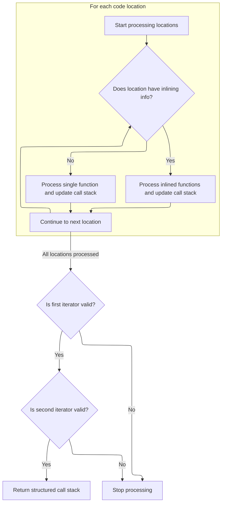

This document explains how callsite and stack frame data are converted into a structured mapping of code locations, supporting both inlined and single-function frames. This enables accurate profiling and trace analysis by transforming raw trace data into a format ready for further analysis.

# Mapping Callsites to Locations

<SwmSnippet path="/src/traceconv/pprof_builder.cc" line="302">

---

In <SwmToken path="src/traceconv/pprof_builder.cc" pos="302:2:2" line-data="LocationTracker PreprocessLocations(trace_processor::TraceProcessor* tp,">`PreprocessLocations`</SwmToken> we kick off by building the inlining info map and then grabbing callsite ids in descending order. This sets us up to process the deepest stacks first, so when we fill in locations for a callsite, we also cover its parents. We need to call <SwmToken path="src/traceconv/pprof_builder.cc" pos="316:9:9" line-data="  Iterator cid_it = tp-&gt;ExecuteQuery(">`ExecuteQuery`</SwmToken> in <SwmPath>[src/trace_processor/trace_processor_impl.cc](src/trace_processor/trace_processor_impl.cc)</SwmPath> next to actually fetch the callsite ids from the trace processor database, since that's where the stack and frame data lives.

```c++
LocationTracker PreprocessLocations(trace_processor::TraceProcessor* tp,
                                    trace_processor::StringPool* interner,
                                    bool annotate_frames) {
  LocationTracker tracker;

  // Keyed by symbol_set_id, discarded once this function converts the inlines
  // into Line and Function entries.
  std::unordered_map<int64_t, std::vector<PreprocessedInline>> inlining_info =
      PreprocessInliningInfo(tp, interner);

  // Higher callsite ids most likely correspond to the deepest stacks, so we'll
  // fill more of the overall callsite->location map by visiting the callsited
  // in decreasing id order. Since processing a callstack also fills in the data
  // for all parent callsites.
  Iterator cid_it = tp->ExecuteQuery(
      "select id from stack_profile_callsite order by id desc;");
  while (cid_it.Next()) {
    int64_t query_cid = cid_it.Get(0).AsLong();

    // If the leaf has been processed, the rest of the stack is already known.
    if (tracker.IsCallsiteProcessed(query_cid))
      continue;

    std::string annotated_query =
        "select sp.id, sp.annotation, spf.mapping, spf.name, "
        "coalesce(spf.deobfuscated_name, demangle(spf.name), spf.name), "
        "spf.symbol_set_id from "
        "experimental_annotated_callstack(" +
        std::to_string(query_cid) +
        ") sp join stack_profile_frame spf on (sp.frame_id == spf.id) "
        "order by depth asc";
    Iterator c_it = tp->ExecuteQuery(annotated_query);

```

---

</SwmSnippet>

## Running SQL Queries and Tracing

<SwmSnippet path="/src/trace_processor/trace_processor_impl.cc" line="672">

---

In <SwmToken path="src/trace_processor/trace_processor_impl.cc" pos="672:4:4" line-data="Iterator TraceProcessorImpl::ExecuteQuery(const std::string&amp; sql) {">`ExecuteQuery`</SwmToken> we start by tracing the query execution for profiling, then record the start time for stats, and sanitize the SQL string to avoid weird Unicode issues. We then call into the SQL engine (<SwmPath>[src/…/engine/perfetto_sql_engine.cc](src/trace_processor/perfetto_sql/engine/perfetto_sql_engine.cc)</SwmPath>) to actually run the query, since that's where the execution logic lives.

```c++
Iterator TraceProcessorImpl::ExecuteQuery(const std::string& sql) {
  PERFETTO_TP_TRACE(metatrace::Category::API_TIMELINE, "EXECUTE_QUERY",
                    [&](metatrace::Record* r) { r->AddArg("query", sql); });

  uint32_t sql_stats_row =
      context()->storage->mutable_sql_stats()->RecordQueryBegin(
          sql, base::GetWallTimeNs().count());
  std::string non_breaking_sql = base::ReplaceAll(sql, "\u00A0", " ");
  base::StatusOr<PerfettoSqlEngine::ExecutionResult> result =
      engine_->ExecuteUntilLastStatement(
          SqlSource::FromExecuteQuery(std::move(non_breaking_sql)));
```

---

</SwmSnippet>

### Executing SQL Statements

See <SwmLink doc-title="Executing a sequence of SQL statements">[Executing a sequence of SQL statements](/.swm/executing-a-sequence-of-sql-statements.n4n6kiol.sw.md)</SwmLink>

### Wrapping Query Results

<SwmSnippet path="/src/trace_processor/trace_processor_impl.cc" line="683">

---

Back in <SwmToken path="src/traceconv/pprof_builder.cc" pos="316:9:9" line-data="  Iterator cid_it = tp-&gt;ExecuteQuery(">`ExecuteQuery`</SwmToken>, after getting the result from the SQL engine, we wrap it in an <SwmToken path="src/trace_processor/trace_processor_impl.cc" pos="683:5:5" line-data="  std::unique_ptr&lt;IteratorImpl&gt; impl(">`IteratorImpl`</SwmToken> and return it as an Iterator. This lets callers walk through the results without caring about the engine internals.

```c++
  std::unique_ptr<IteratorImpl> impl(
      new IteratorImpl(this, std::move(result), sql_stats_row));
  return Iterator(std::move(impl));
}
```

---

</SwmSnippet>

## Building Locations from Callstack Frames



<SwmSnippet path="/src/traceconv/pprof_builder.cc" line="335">

---

After returning from <SwmToken path="src/traceconv/pprof_builder.cc" pos="316:9:9" line-data="  Iterator cid_it = tp-&gt;ExecuteQuery(">`ExecuteQuery`</SwmToken> in <SwmToken path="src/traceconv/pprof_builder.cc" pos="302:2:2" line-data="LocationTracker PreprocessLocations(trace_processor::TraceProcessor* tp,">`PreprocessLocations`</SwmToken>, we walk through the callstack frames from the query results. For each frame, we use a lambda to intern functions, optionally tagging names with annotations. If inlining info is present, we build up inlined functions for the location; otherwise, we just set a single function. We rely on the trace processor schema and bail out if expected data is missing.

```c++
    std::vector<int64_t> callstack_loc_ids;
    while (c_it.Next()) {
      int64_t cid = c_it.Get(0).AsLong();
      auto annotation = c_it.Get(1).is_null() ? "" : c_it.Get(1).AsString();
      int64_t mapping_id = c_it.Get(2).AsLong();
      auto func_sysname = c_it.Get(3).is_null() ? "" : c_it.Get(3).AsString();
      auto func_name = c_it.Get(4).is_null() ? "" : c_it.Get(4).AsString();
      std::optional<int64_t> symbol_set_id =
          c_it.Get(5).is_null() ? std::nullopt
                                : std::make_optional(c_it.Get(5).AsLong());

      Location loc(mapping_id, /*single_function_id=*/-1, {});

      auto intern_function = [interner, &tracker, annotate_frames](
                                 StringId func_sysname_id,
                                 StringId original_func_name_id,
                                 StringId filename_id,
                                 const std::string& anno) {
        std::string fname = interner->Get(original_func_name_id).ToStdString();
        if (annotate_frames && !anno.empty() && !fname.empty())
          fname = fname + " [" + anno + "]";
        StringId func_name_id = interner->InternString(base::StringView(fname));
        Function func(func_name_id, func_sysname_id, filename_id);
        return tracker.InternFunction(func);
      };

      // Inlining information available
      if (symbol_set_id.has_value()) {
        auto it = inlining_info.find(*symbol_set_id);
        if (it == inlining_info.end()) {
          PERFETTO_DFATAL_OR_ELOG(
              "Failed to find stack_profile_symbol entry for symbol_set_id "
              "%" PRIi64 "",
              *symbol_set_id);
          return {};
        }

        // N inlined functions
        // The symbolised packets currently assume pre-demangled data (as that's
        // the default of llvm-symbolizer), so we don't have a system name for
        // each deinlined frame. Set the human-readable name for both fields. We
        // can change this, but there's no demand for accurate system names in
        // pprofs.
        for (const auto& line : it->second) {
          int64_t func_id = intern_function(line.name_id, line.name_id,
                                            line.filename_id, annotation);

          loc.inlined_functions.emplace_back(func_id, line.line_no);
        }
      } else {
        // Otherwise - single function
        int64_t func_id =
            intern_function(interner->InternString(func_sysname),
                            interner->InternString(func_name),
                            /*filename_id=*/StringId::Null(), annotation);
        loc.single_function_id = func_id;
      }

      int64_t loc_id = tracker.InternLocation(std::move(loc));

      // Update the tracker with the locations so far (for example, at depth 2,
      // we'll have 3 root-most locations in |callstack_loc_ids|).
      callstack_loc_ids.push_back(loc_id);
      tracker.MaybeSetCallsiteLocations(cid, callstack_loc_ids);
    }
```

---

</SwmSnippet>

<SwmSnippet path="/src/traceconv/pprof_builder.cc" line="401">

---

Finally, <SwmToken path="src/traceconv/pprof_builder.cc" pos="302:2:2" line-data="LocationTracker PreprocessLocations(trace_processor::TraceProcessor* tp,">`PreprocessLocations`</SwmToken> returns the <SwmToken path="src/traceconv/pprof_builder.cc" pos="302:0:0" line-data="LocationTracker PreprocessLocations(trace_processor::TraceProcessor* tp,">`LocationTracker`</SwmToken>, which has the full mapping from callsites to locations, with all the function and location info interned and ready for use.

```c++
    if (!c_it.Status().ok()) {
      PERFETTO_DFATAL_OR_ELOG("Invalid iterator: %s",
                              c_it.Status().message().c_str());
      return {};
    }
  }

  if (!cid_it.Status().ok()) {
    PERFETTO_DFATAL_OR_ELOG("Invalid iterator: %s",
                            cid_it.Status().message().c_str());
    return {};
  }

  return tracker;
}
```

---

</SwmSnippet>

&nbsp;

*This is an auto-generated document by Swimm 🌊 and has not yet been verified by a human*

<SwmMeta version="3.0.0" repo-id="Z2l0aHViJTNBJTNBY3BsdXNwbHVzLXBlcmZldHRvJTNBJTNBcmljYXJkb2xvcGV6Zw==" repo-name="cplusplus-perfetto"><sup>Powered by [Swimm](https://app.swimm.io/)</sup></SwmMeta>
