This document describes how a memory flamegraph panel is set up to support interactive analysis. The flow starts with trace data and profile type, selects relevant metrics, attaches user actions for deeper exploration, and creates the panel's initial state for interactive memory analysis.

# Panel Initialization and Metric Setup

<SwmSnippet path="/ui/src/plugins/dev.perfetto.HeapProfile/heap_profile_details_panel.ts" line="99">

---

In `HeapProfileFlamegraphDetailsPanel.constructor`, we start by setting up the props and initializing the flamegraph object. Right after, we call <SwmToken path="ui/src/plugins/dev.perfetto.HeapProfile/heap_profile_details_panel.ts" pos="110:7:7" line-data="    this.metrics = flamegraphMetrics(">`flamegraphMetrics`</SwmToken> to fetch the relevant metrics for the current trace and profile type. This is necessary because the metrics determine what data the flamegraph will show and how the panel will behave next.

```typescript
  constructor(
    private readonly trace: Trace,
    private readonly heapGraphIncomplete: boolean,
    private readonly upid: number,
    private readonly profileType: ProfileType,
    private readonly ts: time,
    private state: FlamegraphState | undefined,
    private readonly onStateChange: (state: FlamegraphState) => void,
  ) {
    this.props = {ts, type: profileType};
    this.flamegraph = new QueryFlamegraph(trace);
    this.metrics = flamegraphMetrics(
      this.trace,
      this.profileType,
      this.ts,
      this.upid,
    );
```

---

</SwmSnippet>

## Metric Selection and Action Attachment

```mermaid
%%{init: {"flowchart": {"defaultRenderer": "elk"}} }%%
flowchart TD
  node1["Choose metrics for memory flamegraph"] --> node2{"Which profile type?"}
  click node1 openCode "ui/src/plugins/dev.perfetto.HeapProfile/heap_profile_details_panel.ts:223:452"
  node2 -->|"Native Heap"| node3["Return memory and allocation metrics for native heap"]
  click node3 openCode "ui/src/plugins/dev.perfetto.HeapProfile/heap_profile_details_panel.ts:230:252"
  node2 -->|"Heap"| node4["Return memory and allocation metrics for heap"]
  click node4 openCode "ui/src/plugins/dev.perfetto.HeapProfile/heap_profile_details_panel.ts:253:275"
  node2 -->|"Java Heap Samples"| node5["Return allocation metrics for Java heap samples"]
  click node5 openCode "ui/src/plugins/dev.perfetto.HeapProfile/heap_profile_details_panel.ts:276:288"
  node2 -->|"Mixed Heap"| node6["Return allocation metrics for mixed heap"]
  click node6 openCode "ui/src/plugins/dev.perfetto.HeapProfile/heap_profile_details_panel.ts:289:301"
  node2 -->|"Java Heap Graph"| node7["Return object and domination metrics with advanced analysis"]
  click node7 openCode "ui/src/plugins/dev.perfetto.HeapProfile/heap_profile_details_panel.ts:302:446"
  node2 -->|"Perf Sample"| node8["Not supported"]
  click node8 openCode "ui/src/plugins/dev.perfetto.HeapProfile/heap_profile_details_panel.ts:447:448"
  node2 -->|"Instruments Sample"| node9["Not supported"]
  click node9 openCode "ui/src/plugins/dev.perfetto.HeapProfile/heap_profile_details_panel.ts:449:450"
classDef HeadingStyle fill:#777777,stroke:#333,stroke-width:2px;

%% Swimm:
%% %%{init: {"flowchart": {"defaultRenderer": "elk"}} }%%
%% flowchart TD
%%   node1["Choose metrics for memory flamegraph"] --> node2{"Which profile type?"}
%%   click node1 openCode "<SwmPath>[ui/…/dev.perfetto.HeapProfile/heap_profile_details_panel.ts](ui/src/plugins/dev.perfetto.HeapProfile/heap_profile_details_panel.ts)</SwmPath>:223:452"
%%   node2 -->|"Native Heap"| node3["Return memory and allocation metrics for native heap"]
%%   click node3 openCode "<SwmPath>[ui/…/dev.perfetto.HeapProfile/heap_profile_details_panel.ts](ui/src/plugins/dev.perfetto.HeapProfile/heap_profile_details_panel.ts)</SwmPath>:230:252"
%%   node2 -->|"Heap"| node4["Return memory and allocation metrics for heap"]
%%   click node4 openCode "<SwmPath>[ui/…/dev.perfetto.HeapProfile/heap_profile_details_panel.ts](ui/src/plugins/dev.perfetto.HeapProfile/heap_profile_details_panel.ts)</SwmPath>:253:275"
%%   node2 -->|"Java Heap Samples"| node5["Return allocation metrics for Java heap samples"]
%%   click node5 openCode "<SwmPath>[ui/…/dev.perfetto.HeapProfile/heap_profile_details_panel.ts](ui/src/plugins/dev.perfetto.HeapProfile/heap_profile_details_panel.ts)</SwmPath>:276:288"
%%   node2 -->|"Mixed Heap"| node6["Return allocation metrics for mixed heap"]
%%   click node6 openCode "<SwmPath>[ui/…/dev.perfetto.HeapProfile/heap_profile_details_panel.ts](ui/src/plugins/dev.perfetto.HeapProfile/heap_profile_details_panel.ts)</SwmPath>:289:301"
%%   node2 -->|"Java Heap Graph"| node7["Return object and domination metrics with advanced analysis"]
%%   click node7 openCode "<SwmPath>[ui/…/dev.perfetto.HeapProfile/heap_profile_details_panel.ts](ui/src/plugins/dev.perfetto.HeapProfile/heap_profile_details_panel.ts)</SwmPath>:302:446"
%%   node2 -->|"Perf Sample"| node8["Not supported"]
%%   click node8 openCode "<SwmPath>[ui/…/dev.perfetto.HeapProfile/heap_profile_details_panel.ts](ui/src/plugins/dev.perfetto.HeapProfile/heap_profile_details_panel.ts)</SwmPath>:447:448"
%%   node2 -->|"Instruments Sample"| node9["Not supported"]
%%   click node9 openCode "<SwmPath>[ui/…/dev.perfetto.HeapProfile/heap_profile_details_panel.ts](ui/src/plugins/dev.perfetto.HeapProfile/heap_profile_details_panel.ts)</SwmPath>:449:450"
%% classDef HeadingStyle fill:#777777,stroke:#333,stroke-width:2px;
```



<SwmSnippet path="/ui/src/plugins/dev.perfetto.HeapProfile/heap_profile_details_panel.ts" line="223">

---

<SwmToken path="ui/src/plugins/dev.perfetto.HeapProfile/heap_profile_details_panel.ts" pos="223:2:2" line-data="function flamegraphMetrics(">`flamegraphMetrics`</SwmToken> picks which metrics to use based on the profile type, and for heap graph profiles, it attaches optional actions to each metric. These actions let users run extra queries or open new views from the flamegraph, so we call <SwmToken path="ui/src/plugins/dev.perfetto.HeapProfile/heap_profile_details_panel.ts" pos="339:4:4" line-data="          optionalNodeActions: getHeapGraphNodeOptionalActions(trace, false),">`getHeapGraphNodeOptionalActions`</SwmToken> to generate those actions for each metric.

```typescript
function flamegraphMetrics(
  trace: Trace,
  type: ProfileType,
  ts: time,
  upid: number,
): ReadonlyArray<QueryFlamegraphMetric> {
  switch (type) {
    case ProfileType.NATIVE_HEAP_PROFILE:
      return flamegraphMetricsForHeapProfile(ts, upid, [
        {
          name: 'Unreleased Malloc Size',
          unit: 'B',
          columnName: 'self_size',
        },
        {
          name: 'Unreleased Malloc Count',
          unit: '',
          columnName: 'self_count',
        },
        {
          name: 'Total Malloc Size',
          unit: 'B',
          columnName: 'self_alloc_size',
        },
        {
          name: 'Total Malloc Count',
          unit: '',
          columnName: 'self_alloc_count',
        },
      ]);
    case ProfileType.HEAP_PROFILE:
      return flamegraphMetricsForHeapProfile(ts, upid, [
        {
          name: 'Unreleased Size',
          unit: 'B',
          columnName: 'self_size',
        },
        {
          name: 'Unreleased Count',
          unit: '',
          columnName: 'self_count',
        },
        {
          name: 'Total Size',
          unit: 'B',
          columnName: 'self_alloc_size',
        },
        {
          name: 'Total Count',
          unit: '',
          columnName: 'self_alloc_count',
        },
      ]);
    case ProfileType.JAVA_HEAP_SAMPLES:
      return flamegraphMetricsForHeapProfile(ts, upid, [
        {
          name: 'Total Allocation Size',
          unit: 'B',
          columnName: 'self_size',
        },
        {
          name: 'Total Allocation Count',
          unit: '',
          columnName: 'self_count',
        },
      ]);
    case ProfileType.MIXED_HEAP_PROFILE:
      return flamegraphMetricsForHeapProfile(ts, upid, [
        {
          name: 'Allocation Size (malloc + java)',
          unit: 'B',
          columnName: 'self_size',
        },
        {
          name: 'Allocation Count (malloc + java)',
          unit: '',
          columnName: 'self_count',
        },
      ]);
    case ProfileType.JAVA_HEAP_GRAPH:
      return [
        {
          name: 'Object Size',
          unit: 'B',
          dependencySql:
            'include perfetto module android.memory.heap_graph.class_tree;',
          statement: `
            select
              id,
              parent_id as parentId,
              ifnull(name, '[Unknown]') as name,
              root_type,
              heap_type,
              self_size as value,
              self_count,
              path_hash_stable
            from _heap_graph_class_tree
            where graph_sample_ts = ${ts} and upid = ${upid}
          `,
          unaggregatableProperties: [
            {name: 'root_type', displayName: 'Root Type'},
            {name: 'heap_type', displayName: 'Heap Type'},
          ],
          aggregatableProperties: [
            {
              name: 'self_count',
              displayName: 'Self Count',
              mergeAggregation: 'SUM',
            },
            {
              name: 'path_hash_stable',
              displayName: 'Path Hash',
              mergeAggregation: 'CONCAT_WITH_COMMA',
              isVisible: (_) => false,
            },
          ],
          optionalNodeActions: getHeapGraphNodeOptionalActions(trace, false),
          optionalRootActions: getHeapGraphRootOptionalActions(trace, false),
        },
        {
          name: 'Object Count',
          unit: '',
          dependencySql:
            'include perfetto module android.memory.heap_graph.class_tree;',
          statement: `
            select
              id,
              parent_id as parentId,
              ifnull(name, '[Unknown]') as name,
              root_type,
              heap_type,
              self_size,
              self_count as value,
              path_hash_stable
            from _heap_graph_class_tree
            where graph_sample_ts = ${ts} and upid = ${upid}
          `,
          unaggregatableProperties: [
            {name: 'root_type', displayName: 'Root Type'},
            {name: 'heap_type', displayName: 'Heap Type'},
          ],
          aggregatableProperties: [
            {
              name: 'path_hash_stable',
              displayName: 'Path Hash',
              mergeAggregation: 'CONCAT_WITH_COMMA',
              isVisible: (_) => false,
            },
          ],
          optionalNodeActions: getHeapGraphNodeOptionalActions(trace, false),
          optionalRootActions: getHeapGraphRootOptionalActions(trace, false),
        },
        {
          name: 'Dominated Object Size',
          unit: 'B',
          dependencySql:
            'include perfetto module android.memory.heap_graph.dominator_class_tree;',
          statement: `
            select
              id,
              parent_id as parentId,
              ifnull(name, '[Unknown]') as name,
              root_type,
              heap_type,
              self_size as value,
              self_count,
              path_hash_stable
            from _heap_graph_dominator_class_tree
            where graph_sample_ts = ${ts} and upid = ${upid}
          `,
          unaggregatableProperties: [
            {name: 'root_type', displayName: 'Root Type'},
            {name: 'heap_type', displayName: 'Heap Type'},
          ],
          aggregatableProperties: [
            {
              name: 'self_count',
              displayName: 'Self Count',
              mergeAggregation: 'SUM',
            },
            {
              name: 'path_hash_stable',
              displayName: 'Path Hash',
              mergeAggregation: 'CONCAT_WITH_COMMA',
              isVisible: (_) => false,
            },
          ],
          optionalNodeActions: getHeapGraphNodeOptionalActions(trace, true),
          optionalRootActions: getHeapGraphRootOptionalActions(trace, true),
        },
        {
          name: 'Dominated Object Count',
          unit: '',
          dependencySql:
            'include perfetto module android.memory.heap_graph.dominator_class_tree;',
          statement: `
            select
              id,
              parent_id as parentId,
              ifnull(name, '[Unknown]') as name,
              root_type,
              heap_type,
              self_size,
              self_count as value,
              path_hash_stable
            from _heap_graph_dominator_class_tree
            where graph_sample_ts = ${ts} and upid = ${upid}
          `,
          unaggregatableProperties: [
            {name: 'root_type', displayName: 'Root Type'},
            {name: 'heap_type', displayName: 'Heap Type'},
          ],
          aggregatableProperties: [
            {
              name: 'path_hash_stable',
              displayName: 'Path Hash',
              mergeAggregation: 'CONCAT_WITH_COMMA',
              isVisible: (_) => false,
            },
          ],
          optionalNodeActions: getHeapGraphNodeOptionalActions(trace, true),
          optionalRootActions: getHeapGraphRootOptionalActions(trace, true),
        },
      ];
    case ProfileType.PERF_SAMPLE:
      throw new Error('Perf sample not supported');
    case ProfileType.INSTRUMENTS_SAMPLE:
      throw new Error('Instruments sample not supported');
  }
}
```

---

</SwmSnippet>

<SwmSnippet path="/ui/src/plugins/dev.perfetto.HeapProfile/heap_profile_details_panel.ts" line="638">

---

<SwmToken path="ui/src/plugins/dev.perfetto.HeapProfile/heap_profile_details_panel.ts" pos="638:2:2" line-data="function getHeapGraphNodeOptionalActions(">`getHeapGraphNodeOptionalActions`</SwmToken> builds out the set of actions users can trigger from a flamegraph node. Each action (and sub-action) runs SQL queries and creates tables in the trace engine, with table names and macros adjusted by the <SwmToken path="ui/src/plugins/dev.perfetto.HeapProfile/heap_profile_details_panel.ts" pos="640:1:1" line-data="  isDominator: boolean,">`isDominator`</SwmToken> flag. The actions are grouped for clarity in the UI, and each relies on having a <SwmToken path="ui/src/plugins/dev.perfetto.HeapProfile/heap_profile_details_panel.ts" pos="646:12:12" line-data="        const value = kv.get(&#39;path_hash_stable&#39;);">`path_hash_stable`</SwmToken> value to filter the data. Utilities like <SwmToken path="ui/src/plugins/dev.perfetto.HeapProfile/heap_profile_details_panel.ts" pos="648:7:7" line-data="          const uuid = uuidv4Sql();">`uuidv4Sql`</SwmToken> and <SwmToken path="ui/src/plugins/dev.perfetto.HeapProfile/heap_profile_details_panel.ts" pos="650:3:3" line-data="          await createPerfettoTable({">`createPerfettoTable`</SwmToken> keep table names unique and handle table creation.

```typescript
function getHeapGraphNodeOptionalActions(
  trace: Trace,
  isDominator: boolean,
): ReadonlyArray<FlamegraphOptionalAction> {
  return [
    {
      name: 'Objects',
      execute: async (kv: ReadonlyMap<string, string>) => {
        const value = kv.get('path_hash_stable');
        if (value !== undefined) {
          const uuid = uuidv4Sql();
          const pathHashTableName = `_heap_graph_filtered_path_hashes_${uuid}`;
          await createPerfettoTable({
            engine: trace.engine,
            name: pathHashTableName,
            as: pathHashesToTableStatement(value),
          });

          const tableName = `_heap_graph${tableModifier(isDominator)}object_references`;
          const macroArgs = `_heap_graph${tableModifier(isDominator)}path_hashes, ${pathHashTableName}`;
          const macroExpr = `_heap_graph_object_references_agg!(${macroArgs})`;
          const statement = `CREATE OR REPLACE PERFETTO TABLE ${tableName} AS SELECT * FROM ${macroExpr};`;

          // Create view to be returned
          await trace.engine.query(statement);
          extensions.addLegacySqlTableTab(trace, {
            table: getHeapGraphObjectReferencesView(isDominator),
          });
        }
      },
    },

    // Group for Direct References
    {
      name: 'Direct References',
      // No execute function for parent menu items
      subActions: [
        {
          name: 'Incoming references',
          execute: async (kv: ReadonlyMap<string, string>) => {
            const value = kv.get('path_hash_stable');
            if (value !== undefined) {
              const uuid = uuidv4Sql();
              const pathHashTableName = `_heap_graph_filtered_path_hashes_${uuid}`;
              await createPerfettoTable({
                engine: trace.engine,
                name: pathHashTableName,
                as: pathHashesToTableStatement(value),
              });

              const tableName = `_heap_graph${tableModifier(isDominator)}incoming_references`;
              const macroArgs = `_heap_graph${tableModifier(isDominator)}path_hashes, ${pathHashTableName}`;
              const macroExpr = `_heap_graph_incoming_references_agg!(${macroArgs})`;
              const statement = `CREATE OR REPLACE PERFETTO TABLE ${tableName} AS SELECT * FROM ${macroExpr};`;

              // Create view to be returned
              await trace.engine.query(statement);
              extensions.addLegacySqlTableTab(trace, {
                table: getHeapGraphIncomingReferencesView(isDominator),
              });
            }
          },
        },
        {
          name: 'Outgoing references',
          execute: async (kv: ReadonlyMap<string, string>) => {
            const value = kv.get('path_hash_stable');
            if (value !== undefined) {
              const uuid = uuidv4Sql();
              const pathHashTableName = `_heap_graph_filtered_path_hashes_${uuid}`;
              await createPerfettoTable({
                engine: trace.engine,
                name: pathHashTableName,
                as: pathHashesToTableStatement(value),
              });

              const tableName = `_heap_graph${tableModifier(isDominator)}outgoing_references`;
              const macroArgs = `_heap_graph${tableModifier(isDominator)}path_hashes, ${pathHashTableName}`;
              const macroExpr = `_heap_graph_outgoing_references_agg!(${macroArgs})`;
              const statement = `CREATE OR REPLACE PERFETTO TABLE ${tableName} AS SELECT * FROM ${macroExpr};`;

              // Create view to be returned
              await trace.engine.query(statement);
              extensions.addLegacySqlTableTab(trace, {
                table: getHeapGraphOutgoingReferencesView(isDominator),
              });
            }
          },
        },
      ],
    },

    // Group for Indirect References
    {
      name: 'Indirect References',
      // No execute function for parent menu items
      subActions: [
        {
          name: 'Retained objects',
          execute: async (kv: ReadonlyMap<string, string>) => {
            const value = kv.get('path_hash_stable');
            if (value !== undefined) {
              const uuid = uuidv4Sql();
              const pathHashTableName = `_heap_graph_filtered_path_hashes_${uuid}`;
              await createPerfettoTable({
                engine: trace.engine,
                name: pathHashTableName,
                as: pathHashesToTableStatement(value),
              });

              const tableName = `_heap_graph${tableModifier(isDominator)}retained_object_counts`;
              const macroArgs = `_heap_graph${tableModifier(isDominator)}path_hashes, ${pathHashTableName}`;
              const macroExpr = `_heap_graph_retained_object_count_agg!(${macroArgs})`;
              const statement = `CREATE OR REPLACE PERFETTO TABLE ${tableName} AS SELECT * FROM ${macroExpr};`;

              // Create view to be returned
              await trace.engine.query(statement);
              extensions.addLegacySqlTableTab(trace, {
                table: getHeapGraphRetainedObjectCountsView(isDominator),
              });
            }
          },
        },
        {
          name: 'Retaining objects',
          execute: async (kv: ReadonlyMap<string, string>) => {
            const value = kv.get('path_hash_stable');
            if (value !== undefined) {
              const uuid = uuidv4Sql();
              const pathHashTableName = `_heap_graph_filtered_path_hashes_${uuid}`;
              await createPerfettoTable({
                engine: trace.engine,
                name: pathHashTableName,
                as: pathHashesToTableStatement(value),
              });

              const tableName = `_heap_graph${tableModifier(isDominator)}retaining_object_counts`;
              const macroArgs = `_heap_graph${tableModifier(isDominator)}path_hashes, ${pathHashTableName}`;
              const macroExpr = `_heap_graph_retaining_object_count_agg!(${macroArgs})`;
              const statement = `CREATE OR REPLACE PERFETTO TABLE ${tableName} AS SELECT * FROM ${macroExpr};`;

              // Create view to be returned
              await trace.engine.query(statement);
              extensions.addLegacySqlTableTab(trace, {
                table: getHeapGraphRetainingObjectCountsView(isDominator),
              });
            }
          },
        },
      ],
    },
  ];
}
```

---

</SwmSnippet>

## Default State Creation and Change Notification

<SwmSnippet path="/ui/src/plugins/dev.perfetto.HeapProfile/heap_profile_details_panel.ts" line="116">

---

Back in HeapProfileFlamegraphDetailsPanel.constructor, after getting the metrics, we check if the state is unset. If so, we create a default flamegraph state using those metrics and notify the rest of the system via <SwmToken path="ui/src/plugins/dev.perfetto.HeapProfile/heap_profile_details_panel.ts" pos="118:1:1" line-data="      onStateChange(this.state);">`onStateChange`</SwmToken>. This ties the metrics directly to the initial panel state.

```typescript
    if (this.state === undefined) {
      this.state = Flamegraph.createDefaultState(this.metrics);
      onStateChange(this.state);
    }
  }
```

---

</SwmSnippet>

&nbsp;

*This is an auto-generated document by Swimm 🌊 and has not yet been verified by a human*

<SwmMeta version="3.0.0" repo-id="Z2l0aHViJTNBJTNBY3BsdXNwbHVzLXBlcmZldHRvJTNBJTNBcmljYXJkb2xvcGV6Zw==" repo-name="cplusplus-perfetto"><sup>Powered by [Swimm](https://app.swimm.io/)</sup></SwmMeta>
