This document describes how user interactions with the navigation menu are handled. When a user clicks the menu icon, the system expands or collapses the sidebar or header and updates sidebar sections to reflect the current page, ensuring a consistent and intuitive navigation experience.

# Handling menu click and navigation state

<SwmSnippet path="/infra/perfetto.dev/src/assets/script.js" line="31">

---

In <SwmToken path="infra/perfetto.dev/src/assets/script.js" pos="31:2:2" line-data="function setupSandwichMenu() {">`setupSandwichMenu`</SwmToken>, we start by wiring up the menu click handler. If the <SwmToken path="infra/perfetto.dev/src/assets/script.js" pos="33:3:3" line-data="  const docsNav = document.querySelector(&quot;.nav&quot;);">`docsNav`</SwmToken> element exists, we add the <SwmToken path="infra/perfetto.dev/src/assets/script.js" pos="40:4:4" line-data="      // |after_first_click| is to avoid spurious transitions on page load.">`after_first_click`</SwmToken> class to prevent unwanted CSS transitions, then call <SwmToken path="infra/perfetto.dev/src/assets/script.js" pos="42:1:1" line-data="      updateNav();">`updateNav`</SwmToken> to refresh navigation logic before toggling the menu. If <SwmToken path="infra/perfetto.dev/src/assets/script.js" pos="33:3:3" line-data="  const docsNav = document.querySelector(&quot;.nav&quot;);">`docsNav`</SwmToken> isn't present, we toggle the header's expanded state instead. This setup assumes a specific DOM structure and handles both docs and non-docs pages.

```javascript
function setupSandwichMenu() {
  const header = document.querySelector(".site-header");
  const docsNav = document.querySelector(".nav");
  const menu = header.querySelector(".menu");
  menu.addEventListener("click", (e) => {
    e.preventDefault();

    // If we are displaying any /docs, toggle the navbar instead (the TOC).
    if (docsNav) {
      // |after_first_click| is to avoid spurious transitions on page load.
      docsNav.classList.add("after_first_click");
      updateNav();
```

---

</SwmSnippet>

## Making sidebar sections collapsible and managing service worker bypass

```mermaid
%%{init: {"flowchart": {"defaultRenderer": "elk"}} }%%
flowchart TD
  node1["Start navigation update"]
  click node1 openCode "infra/perfetto.dev/src/assets/script.js:146:147"
  node1 --> node2["Identify current page"]
  click node2 openCode "infra/perfetto.dev/src/assets/script.js:147:150"

  subgraph loop1["For each top-level navigation section"]
    node2 --> node3{"Has child menu?"}
    click node3 openCode "infra/perfetto.dev/src/assets/script.js:155:157"
    node3 -->|"No"| node4["Leave as is"]
    click node4 openCode "infra/perfetto.dev/src/assets/script.js:158:161"
    node3 -->|"Yes"| node5{"Is link a non-leaf menu?"}
    click node5 openCode "infra/perfetto.dev/src/assets/script.js:166:167"
    node5 -->|"No"| node4
    node5 -->|"Yes"| node6["Make section expandable/collapsible"]
    click node6 openCode "infra/perfetto.dev/src/assets/script.js:169:170"
    node6 --> node7{"Previously compressed?"}
    click node7 openCode "infra/perfetto.dev/src/assets/script.js:175:177"
    node7 -->|"Yes"| node8["Show as compressed"]
    click node8 openCode "infra/perfetto.dev/src/assets/script.js:176:177"
    node7 -->|"No"| node9["Show as expanded"]
    click node9 openCode "infra/perfetto.dev/src/assets/script.js:179:180"
    node8 --> node10["Allow user to toggle"]
    click node10 openCode "infra/perfetto.dev/src/assets/script.js:183:191"
    node9 --> node10
    node10 --> node4
  end

  subgraph loop2["For each navigation link"]
    node4 --> node11{"Matches current page?"}
    click node11 openCode "infra/perfetto.dev/src/assets/script.js:197:207"
    node11 -->|"Yes"| node12["Highlight link and expand parents"]
    click node12 openCode "infra/perfetto.dev/src/assets/script.js:208:212"
    node11 -->|"No"| node13["No highlight"]
    click node13 openCode "infra/perfetto.dev/src/assets/script.js:213:214"
  end

classDef HeadingStyle fill:#777777,stroke:#333,stroke-width:2px;

%% Swimm:
%% %%{init: {"flowchart": {"defaultRenderer": "elk"}} }%%
%% flowchart TD
%%   node1["Start navigation update"]
%%   click node1 openCode "<SwmPath>[infra/…/assets/script.js](infra/perfetto.dev/src/assets/script.js)</SwmPath>:146:147"
%%   node1 --> node2["Identify current page"]
%%   click node2 openCode "<SwmPath>[infra/…/assets/script.js](infra/perfetto.dev/src/assets/script.js)</SwmPath>:147:150"
%% 
%%   subgraph loop1["For each <SwmToken path="infra/perfetto.dev/src/assets/script.js" pos="151:11:13" line-data="  // First identify all the top-level nav entries (Quickstart, Data Sources,">`top-level`</SwmToken> navigation section"]
%%     node2 --> node3{"Has child menu?"}
%%     click node3 openCode "<SwmPath>[infra/…/assets/script.js](infra/perfetto.dev/src/assets/script.js)</SwmPath>:155:157"
%%     node3 -->|"No"| node4["Leave as is"]
%%     click node4 openCode "<SwmPath>[infra/…/assets/script.js](infra/perfetto.dev/src/assets/script.js)</SwmPath>:158:161"
%%     node3 -->|"Yes"| node5{"Is link a <SwmToken path="infra/perfetto.dev/src/assets/script.js" pos="203:9:11" line-data="      // This is a non-leaf link to a menu.">`non-leaf`</SwmToken> menu?"}
%%     click node5 openCode "<SwmPath>[infra/…/assets/script.js](infra/perfetto.dev/src/assets/script.js)</SwmPath>:166:167"
%%     node5 -->|"No"| node4
%%     node5 -->|"Yes"| node6["Make section expandable/collapsible"]
%%     click node6 openCode "<SwmPath>[infra/…/assets/script.js](infra/perfetto.dev/src/assets/script.js)</SwmPath>:169:170"
%%     node6 --> node7{"Previously compressed?"}
%%     click node7 openCode "<SwmPath>[infra/…/assets/script.js](infra/perfetto.dev/src/assets/script.js)</SwmPath>:175:177"
%%     node7 -->|"Yes"| node8["Show as compressed"]
%%     click node8 openCode "<SwmPath>[infra/…/assets/script.js](infra/perfetto.dev/src/assets/script.js)</SwmPath>:176:177"
%%     node7 -->|"No"| node9["Show as expanded"]
%%     click node9 openCode "<SwmPath>[infra/…/assets/script.js](infra/perfetto.dev/src/assets/script.js)</SwmPath>:179:180"
%%     node8 --> node10["Allow user to toggle"]
%%     click node10 openCode "<SwmPath>[infra/…/assets/script.js](infra/perfetto.dev/src/assets/script.js)</SwmPath>:183:191"
%%     node9 --> node10
%%     node10 --> node4
%%   end
%% 
%%   subgraph loop2["For each navigation link"]
%%     node4 --> node11{"Matches current page?"}
%%     click node11 openCode "<SwmPath>[infra/…/assets/script.js](infra/perfetto.dev/src/assets/script.js)</SwmPath>:197:207"
%%     node11 -->|"Yes"| node12["Highlight link and expand parents"]
%%     click node12 openCode "<SwmPath>[infra/…/assets/script.js](infra/perfetto.dev/src/assets/script.js)</SwmPath>:208:212"
%%     node11 -->|"No"| node13["No highlight"]
%%     click node13 openCode "<SwmPath>[infra/…/assets/script.js](infra/perfetto.dev/src/assets/script.js)</SwmPath>:213:214"
%%   end
%% 
%% classDef HeadingStyle fill:#777777,stroke:#333,stroke-width:2px;
```



<SwmSnippet path="/infra/perfetto.dev/src/assets/script.js" line="146">

---

In <SwmToken path="infra/perfetto.dev/src/assets/script.js" pos="146:2:2" line-data="function updateNav() {">`updateNav`</SwmToken>, we scan sidebar sections, mark those with child menus and no navigation target as compressible, and persist their collapsed state in <SwmToken path="infra/perfetto.dev/src/assets/script.js" pos="175:4:4" line-data="    if (sessionStorage.getItem(memoKey) === &quot;1&quot;) {">`sessionStorage`</SwmToken>. We also set their <SwmToken path="infra/perfetto.dev/src/assets/script.js" pos="179:5:5" line-data="      childMenu.style.maxHeight = `${childMenu.scrollHeight + 40}px`;">`maxHeight`</SwmToken> for smooth expansion. This sets up the sidebar for interactive toggling, which is handled next in <SwmPath>[ui/…/frontend/sidebar.ts](ui/src/frontend/sidebar.ts)</SwmPath>.

```javascript
function updateNav() {
  const curDoc = document.querySelector(".doc");
  let curFileName = "";
  if (curDoc) curFileName = curDoc.dataset["mdFile"];

  // First identify all the top-level nav entries (Quickstart, Data Sources,
  // ...) and make them compressible.
  const toplevelSections = document.querySelectorAll('.docs .nav > ul > li > ul > li');
  const toplevelLinks = [];
  for (const sec of toplevelSections) {
    const childMenu = sec.querySelector("ul");
    if (!childMenu) {
      // Don't make it compressible if it has no children (e.g. the very
      // first 'Introduction' link).
      continue;
    }

    // Don't make it compressible if the entry has an actual link (e.g. the very
    // first 'Introduction' link), because otherwise it become ambiguous whether
    // the link should toggle or open the link.
    const link = sec.querySelector("a");
    if (!link || !link.href.endsWith("#")) continue;

    sec.classList.add("compressible");

    // Remember the compressed status as long as the page is opened, so clicking
    // through links keeps the sidebar in a consistent visual state.
    const memoKey = `docs.nav.compressed[${link.innerHTML}]`;

    if (sessionStorage.getItem(memoKey) === "1") {
      sec.classList.add("compressed");
    }
    doAfterLoadEvent(() => {
      childMenu.style.maxHeight = `${childMenu.scrollHeight + 40}px`;
    });

    toplevelLinks.push(link);
    link.onclick = (evt) => {
      evt.preventDefault();
      sec.classList.toggle("compressed");
      if (sec.classList.contains("compressed")) {
        sessionStorage.setItem(memoKey, "1");
      } else {
        sessionStorage.removeItem(memoKey);
      }
    };
  }

```

---

</SwmSnippet>

<SwmSnippet path="/ui/src/frontend/sidebar.ts" line="272">

---

<SwmToken path="ui/src/frontend/sidebar.ts" pos="272:3:3" line-data="    const toggle = async () =&gt; {">`toggle`</SwmToken> checks if the service worker is bypassed; if not, it pops up a modal for user confirmation before disabling and reloading the UI. This prevents accidental loss of offline features and makes the user explicitly confirm disruptive actions.

```typescript
    const toggle = async () => {
      if (ctl.bypassed) {
        ctl.setBypass(false);
        return;
      }
      showModal({
        title: 'Disable service worker?',
        content: m(
          'div',
          m(
            'p',
            `If you continue the service worker will be disabled until
                      manually re-enabled.`,
          ),
          m(
            'p',
            `All future requests will be served from the network and the
                    UI won't be available offline.`,
          ),
          m(
            'p',
            `You should do this only if you are debugging the UI
                    or if you are experiencing caching-related problems.`,
          ),
          m(
            'p',
            `Disabling will cause a refresh of the UI, the current state
                    will be lost.`,
          ),
        ),
        buttons: [
          {
            text: 'Disable and reload',
            primary: true,
            action: () => ctl.setBypass(true).then(() => location.reload()),
          },
          {text: 'Cancel'},
        ],
      });
    };
```

---

</SwmSnippet>

<SwmSnippet path="/infra/perfetto.dev/src/assets/script.js" line="194">

---

Back in <SwmToken path="infra/perfetto.dev/src/assets/script.js" pos="42:1:1" line-data="      updateNav();">`updateNav`</SwmToken> after <SwmPath>[ui/…/frontend/sidebar.ts](ui/src/frontend/sidebar.ts)</SwmPath>, we loop through navigation links, highlight the one matching the current page, and scroll it into view if needed. Non-leaf links lose their href to prevent confusion. Only the first match gets highlighted for clarity.

```javascript
  const nav = document.querySelector(".docs .nav");
  const exps = document.querySelectorAll(".docs .nav ul a");
  let found = false;
  for (const x of exps) {
    // If the url of the entry matches the url of the page, mark the item as
    // highlighted and expand all its parents.
    if (!x.href) continue;
    const url = new URL(x.href);
    if (x.href.endsWith("#")) {
      // This is a non-leaf link to a menu.
      if (toplevelLinks.indexOf(x) < 0) {
        x.removeAttribute("href");
      }
    } else if ((url.pathname === curFileName || url.pathname + 'index.html' === curFileName) && !found) {
      x.classList.add('selected');
      if (!onloadFired) {
        scrollIntoViewIfNeeded(x, nav);
      }
      found = true;  // Highlight only the first occurrence.
    }
  }
```

---

</SwmSnippet>

## Finalizing menu expansion and handling UI transitions

<SwmSnippet path="/infra/perfetto.dev/src/assets/script.js" line="43">

---

Just returned from <SwmToken path="infra/perfetto.dev/src/assets/script.js" pos="42:1:1" line-data="      updateNav();">`updateNav`</SwmToken> in <SwmToken path="infra/perfetto.dev/src/assets/script.js" pos="31:2:2" line-data="function setupSandwichMenu() {">`setupSandwichMenu`</SwmToken>. We use <SwmToken path="infra/perfetto.dev/src/assets/script.js" pos="43:1:1" line-data="      setTimeout(() =&gt; docsNav.classList.toggle(&quot;expanded&quot;), 0);">`setTimeout`</SwmToken> to defer toggling the 'expanded' class, making sure CSS transitions work right. If <SwmToken path="infra/perfetto.dev/src/assets/script.js" pos="43:8:8" line-data="      setTimeout(() =&gt; docsNav.classList.toggle(&quot;expanded&quot;), 0);">`docsNav`</SwmToken> isn't present, we toggle the header instead. This wraps up the menu logic before <SwmPath>[ui/…/frontend/sidebar.ts](ui/src/frontend/sidebar.ts)</SwmPath> handles further UI state.

```javascript
      setTimeout(() => docsNav.classList.toggle("expanded"), 0);
    } else {
      header.classList.toggle("expanded");
    }
  });
}
```

---

</SwmSnippet>

&nbsp;

*This is an auto-generated document by Swimm 🌊 and has not yet been verified by a human*

<SwmMeta version="3.0.0" repo-id="Z2l0aHViJTNBJTNBY3BsdXNwbHVzLXBlcmZldHRvJTNBJTNBcmljYXJkb2xvcGV6Zw==" repo-name="cplusplus-perfetto"><sup>Powered by [Swimm](https://app.swimm.io/)</sup></SwmMeta>
