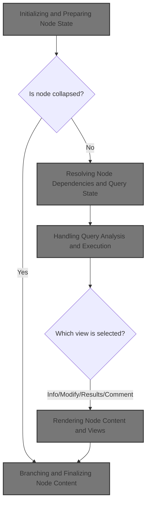

This document describes the flow that powers the node explorer in the query builder UI. Users can interact with nodes to inspect their state, configure settings, resolve dependencies, analyze queries, and view results. The UI updates dynamically to reflect changes, allowing users to switch between informational, modification, results, and comment views for each node.



# Initializing and Preparing Node State

<SwmSnippet path="/ui/src/plugins/dev.perfetto.ExplorePage/query_builder/node_explorer.ts" line="206">

---

In <SwmToken path="ui/src/plugins/dev.perfetto.ExplorePage/query_builder/node_explorer.ts" pos="206:1:1" line-data="  view({attrs}: m.CVnode&lt;NodeExplorerAttrs&gt;) {">`view`</SwmToken>, we set up the node's onchange callback so UI changes propagate correctly, pick a default view if none is set, and check if the node is collapsed to decide what to render. We call <SwmToken path="ui/src/plugins/dev.perfetto.ExplorePage/query_builder/node_explorer.ts" pos="218:3:3" line-data="    this.updateQuery(node, attrs);">`updateQuery`</SwmToken> right away to make sure the query object is fresh, which is needed for things like enabling the Run button. This keeps the UI and state in sync before rendering anything else.

```typescript
  view({attrs}: m.CVnode<NodeExplorerAttrs>) {
    const {node, isCollapsed, selectedView = SelectedView.kInfo} = attrs;
    if (!node) {
      return null;
    }

    // Update the node's onchange callback to point to our attrs.onchange
    // This ensures that changes in the node's UI components trigger the callback chain
    node.state.onchange = attrs.onchange;

    // Always analyze to generate the query object (needed to enable Run button)
    // The autoExecute flag only controls whether we automatically execute after analysis
    this.updateQuery(node, attrs);

    if (isCollapsed) {
      return m('.pf-exp-node-explorer.collapsed');
    }

```

---

</SwmSnippet>

## Resolving Node Dependencies and Query State

```mermaid
%%{init: {"flowchart": {"defaultRenderer": "elk"}} }%%
flowchart TD
    node1["Start: Update query node"] --> node2{"Is node a SQL source node with SQL?"}
    click node1 openCode "ui/src/plugins/dev.perfetto.ExplorePage/query_builder/node_explorer.ts:68:69"
    node2 -->|"No"| node3["No update performed"]
    click node2 openCode "ui/src/plugins/dev.perfetto.ExplorePage/query_builder/node_explorer.ts:69:69"
    click node3 openCode "ui/src/plugins/dev.perfetto.ExplorePage/query_builder/node_explorer.ts:69:69"
    node2 -->|"Yes"| loop1
    subgraph loop1["Loop: Remove previous node connections"]
      node4["Clean previous node connections"]
      click node4 openCode "ui/src/plugins/dev.perfetto.ExplorePage/query_builder/node_explorer.ts:71:73"
      node4 --> loop2
    end
    subgraph loop2["Loop: Resolve dependencies"]
      node5["Resolve dependencies"]
      click node5 openCode "ui/src/plugins/dev.perfetto.ExplorePage/query_builder/node_explorer.ts:75:90"
      node5 --> node6{"Does node depend on itself?"}
      click node6 openCode "ui/src/plugins/dev.perfetto.ExplorePage/query_builder/node_explorer.ts:78:84"
    end
    node6 -->|"Yes"| node7["Report error: Node cannot depend on itself"]
    click node7 openCode "ui/src/plugins/dev.perfetto.ExplorePage/query_builder/node_explorer.ts:79:83"
    node6 -->|"No"| loop3
    subgraph loop3["Loop: Add connections to dependencies"]
      node8["Add connections to dependencies"]
      click node8 openCode "ui/src/plugins/dev.perfetto.ExplorePage/query_builder/node_explorer.ts:92:97"
      node8 --> node9{"Can structured query be generated?"}
      click node9 openCode "ui/src/plugins/dev.perfetto.ExplorePage/query_builder/node_explorer.ts:100:101"
    end
    node9 -->|"No"| node10["Report error: Invalid query structure"]
    click node10 openCode "ui/src/plugins/dev.perfetto.ExplorePage/query_builder/node_explorer.ts:103:111"
    node9 -->|"Yes"| node11{"Has operation changed or query updated?"}
    click node11 openCode "ui/src/plugins/dev.perfetto.ExplorePage/query_builder/node_explorer.ts:116:148"
    node11 -->|"No"| node12["Query unchanged"]
    click node12 openCode "ui/src/plugins/dev.perfetto.ExplorePage/query_builder/node_explorer.ts:116:148"
    node11 -->|"Yes"| node13["Analyze query and update feedback"]
    click node13 openCode "ui/src/plugins/dev.perfetto.ExplorePage/query_builder/node_explorer.ts:121:147"

classDef HeadingStyle fill:#777777,stroke:#333,stroke-width:2px;

%% Swimm:
%% %%{init: {"flowchart": {"defaultRenderer": "elk"}} }%%
%% flowchart TD
%%     node1["Start: Update query node"] --> node2{"Is node a SQL source node with SQL?"}
%%     click node1 openCode "<SwmPath>[ui/…/query_builder/node_explorer.ts](ui/src/plugins/dev.perfetto.ExplorePage/query_builder/node_explorer.ts)</SwmPath>:68:69"
%%     node2 -->|"No"| node3["No update performed"]
%%     click node2 openCode "<SwmPath>[ui/…/query_builder/node_explorer.ts](ui/src/plugins/dev.perfetto.ExplorePage/query_builder/node_explorer.ts)</SwmPath>:69:69"
%%     click node3 openCode "<SwmPath>[ui/…/query_builder/node_explorer.ts](ui/src/plugins/dev.perfetto.ExplorePage/query_builder/node_explorer.ts)</SwmPath>:69:69"
%%     node2 -->|"Yes"| loop1
%%     subgraph loop1["Loop: Remove previous node connections"]
%%       node4["Clean previous node connections"]
%%       click node4 openCode "<SwmPath>[ui/…/query_builder/node_explorer.ts](ui/src/plugins/dev.perfetto.ExplorePage/query_builder/node_explorer.ts)</SwmPath>:71:73"
%%       node4 --> loop2
%%     end
%%     subgraph loop2["Loop: Resolve dependencies"]
%%       node5["Resolve dependencies"]
%%       click node5 openCode "<SwmPath>[ui/…/query_builder/node_explorer.ts](ui/src/plugins/dev.perfetto.ExplorePage/query_builder/node_explorer.ts)</SwmPath>:75:90"
%%       node5 --> node6{"Does node depend on itself?"}
%%       click node6 openCode "<SwmPath>[ui/…/query_builder/node_explorer.ts](ui/src/plugins/dev.perfetto.ExplorePage/query_builder/node_explorer.ts)</SwmPath>:78:84"
%%     end
%%     node6 -->|"Yes"| node7["Report error: Node cannot depend on itself"]
%%     click node7 openCode "<SwmPath>[ui/…/query_builder/node_explorer.ts](ui/src/plugins/dev.perfetto.ExplorePage/query_builder/node_explorer.ts)</SwmPath>:79:83"
%%     node6 -->|"No"| loop3
%%     subgraph loop3["Loop: Add connections to dependencies"]
%%       node8["Add connections to dependencies"]
%%       click node8 openCode "<SwmPath>[ui/…/query_builder/node_explorer.ts](ui/src/plugins/dev.perfetto.ExplorePage/query_builder/node_explorer.ts)</SwmPath>:92:97"
%%       node8 --> node9{"Can structured query be generated?"}
%%       click node9 openCode "<SwmPath>[ui/…/query_builder/node_explorer.ts](ui/src/plugins/dev.perfetto.ExplorePage/query_builder/node_explorer.ts)</SwmPath>:100:101"
%%     end
%%     node9 -->|"No"| node10["Report error: Invalid query structure"]
%%     click node10 openCode "<SwmPath>[ui/…/query_builder/node_explorer.ts](ui/src/plugins/dev.perfetto.ExplorePage/query_builder/node_explorer.ts)</SwmPath>:103:111"
%%     node9 -->|"Yes"| node11{"Has operation changed or query updated?"}
%%     click node11 openCode "<SwmPath>[ui/…/query_builder/node_explorer.ts](ui/src/plugins/dev.perfetto.ExplorePage/query_builder/node_explorer.ts)</SwmPath>:116:148"
%%     node11 -->|"No"| node12["Query unchanged"]
%%     click node12 openCode "<SwmPath>[ui/…/query_builder/node_explorer.ts](ui/src/plugins/dev.perfetto.ExplorePage/query_builder/node_explorer.ts)</SwmPath>:116:148"
%%     node11 -->|"Yes"| node13["Analyze query and update feedback"]
%%     click node13 openCode "<SwmPath>[ui/…/query_builder/node_explorer.ts](ui/src/plugins/dev.perfetto.ExplorePage/query_builder/node_explorer.ts)</SwmPath>:121:147"
%% 
%% classDef HeadingStyle fill:#777777,stroke:#333,stroke-width:2px;
```



<SwmSnippet path="/ui/src/plugins/dev.perfetto.ExplorePage/query_builder/node_explorer.ts" line="68">

---

In <SwmToken path="ui/src/plugins/dev.perfetto.ExplorePage/query_builder/node_explorer.ts" pos="68:3:3" line-data="  private updateQuery(node: QueryNode, attrs: NodeExplorerAttrs) {">`updateQuery`</SwmToken>, we start by removing the node from the <SwmToken path="ui/src/plugins/dev.perfetto.ExplorePage/query_builder/node_explorer.ts" pos="72:3:3" line-data="        prevNode.nextNodes = prevNode.nextNodes.filter((n) =&gt; n !== node);">`nextNodes`</SwmToken> of its previous nodes, cleaning up any old connections. Then we get the new dependencies by calling <SwmToken path="ui/src/plugins/dev.perfetto.ExplorePage/query_builder/node_explorer.ts" pos="75:9:9" line-data="      const nodeIds = node.findDependencies();">`findDependencies`</SwmToken> and resolve them, making sure the node's dependency graph is up-to-date. If a node tries to depend on itself, we catch that and set an error.

```typescript
  private updateQuery(node: QueryNode, attrs: NodeExplorerAttrs) {
    if (node instanceof SqlSourceNode && node.state.sql) {
      // Clear this node from the prevNodes
      for (const prevNode of node.prevNodes) {
        prevNode.nextNodes = prevNode.nextNodes.filter((n) => n !== node);
      }
```

---

</SwmSnippet>

<SwmSnippet path="/ui/src/plugins/dev.perfetto.ExplorePage/query_builder/node_explorer.ts" line="75">

---

After clearing old connections, we loop through the new dependency ids, check for self-dependency (and error out if found), and resolve each id to a <SwmToken path="ui/src/plugins/dev.perfetto.ExplorePage/query_builder/node_explorer.ts" pos="76:6:6" line-data="      const dependencies: QueryNode[] = [];">`QueryNode`</SwmToken>. Only valid nodes get added to the dependencies list for the next step.

```typescript
      const nodeIds = node.findDependencies();
      const dependencies: QueryNode[] = [];
      for (const nodeId of nodeIds) {
        if (nodeId === node.nodeId) {
          node.state.issues = new NodeIssues();
          node.state.issues.queryError = new Error(
            'Node cannot depend on itself',
          );
          return;
        }

        const dependencyNode = attrs.resolveNode(nodeId);
        if (dependencyNode) {
          dependencies.push(dependencyNode);
        }
      }
```

---

</SwmSnippet>

<SwmSnippet path="/ui/src/plugins/dev.perfetto.ExplorePage/query_builder/node_explorer.ts" line="91">

---

Now we update <SwmToken path="ui/src/plugins/dev.perfetto.ExplorePage/query_builder/node_explorer.ts" pos="91:3:3" line-data="      node.prevNodes = dependencies;">`prevNodes`</SwmToken> with the resolved dependencies and call <SwmToken path="ui/src/plugins/dev.perfetto.ExplorePage/query_builder/node_explorer.ts" pos="95:1:1" line-data="          addConnection(prevNode, node, i);">`addConnection`</SwmToken> for each one, wiring up the dependency graph so downstream nodes are aware of the new setup.

```typescript
      node.prevNodes = dependencies;
      for (let i = 0; i < node.prevNodes.length; i++) {
        const prevNode = node.prevNodes[i];
        if (prevNode !== undefined) {
          addConnection(prevNode, node, i);
        }
      }
```

---

</SwmSnippet>

<SwmSnippet path="/ui/src/plugins/dev.perfetto.ExplorePage/query_builder/node_explorer.ts" line="100">

---

After wiring up dependencies, we try to generate a structured query. If that fails, we set an error and notify the UI. If the query changed or the node's operation changed, we schedule an async analysis, which updates the query state, triggers callbacks, and updates group-by columns if needed. This sets up the next step, where the builder handles the analyzed query.

```typescript
    const sq = node.getStructuredQuery();
    if (sq === undefined) {
      // Report error instead of silently returning
      const error = new Error(
        'Cannot generate structured query. This usually means:\n' +
          '• Multi-source nodes (Union/Merge/Intersect) need at least 2 connected inputs\n' +
          '• All input ports must be connected\n' +
          '• Previous nodes must be valid',
      );
      this.currentQuery = error;
      attrs.onQueryAnalyzed(error);
      return;
    }

    const curSqString = JSON.stringify(sq.toJSON(), null, 2);

    if (curSqString !== this.prevSqString || node.state.hasOperationChanged) {
      if (node.state.hasOperationChanged) {
        node.state.hasOperationChanged = false;
      }
      attrs.onAnalysisStateChange?.(true);
      this.tableAsyncLimiter.schedule(async () => {
        try {
          this.currentQuery = await analyzeNode(node, attrs.trace.engine);
          if (!isAQuery(this.currentQuery)) {
            attrs.onAnalysisStateChange?.(false);
            return;
          }
          if (node instanceof AggregationNode) {
            node.updateGroupByColumns();
          }
          attrs.onQueryAnalyzed(this.currentQuery);
          this.prevSqString = curSqString;
          attrs.onAnalysisStateChange?.(false);
        } catch (e) {
          // Silently handle "Already analyzing" errors - the AsyncLimiter
          // will retry when the current analysis completes
          if (e instanceof Error && e.message.includes('Already analyzing')) {
            // Keep isAnalyzing = true, will retry automatically
            return;
          }
          // For other errors, set them as the current query and stop analyzing
          const error = e instanceof Error ? e : new Error(String(e));
          this.currentQuery = error;
          attrs.onQueryAnalyzed(error);
          attrs.onAnalysisStateChange?.(false);
        }
      });
    }
  }
```

---

</SwmSnippet>

## Handling Query Analysis and Execution

```mermaid
%%{init: {"flowchart": {"defaultRenderer": "elk"}} }%%
flowchart TD
  node1["Query is analyzed"]
  click node1 openCode "ui/src/plugins/dev.perfetto.ExplorePage/query_builder/builder.ts:232:249"
  node1 --> node2{"Is this a valid query?"}
  click node2 openCode "ui/src/plugins/dev.perfetto.ExplorePage/query_builder/builder.ts:235:248"
  node2 -->|"No"| node5["No action taken"]
  click node5 openCode "ui/src/plugins/dev.perfetto.ExplorePage/query_builder/builder.ts:249:249"
  node2 -->|"Yes"| node3{"Reusable results exist or auto-execute is ON?"}
  click node3 openCode "ui/src/plugins/dev.perfetto.ExplorePage/query_builder/builder.ts:237:243"
  node3 -->|"Yes (reuse or auto-execute)"| node4["Execute or reuse query results"]
  click node4 openCode "ui/src/plugins/dev.perfetto.ExplorePage/query_builder/builder.ts:245:246"
  node3 -->|"No"| node5

classDef HeadingStyle fill:#777777,stroke:#333,stroke-width:2px;

%% Swimm:
%% %%{init: {"flowchart": {"defaultRenderer": "elk"}} }%%
%% flowchart TD
%%   node1["Query is analyzed"]
%%   click node1 openCode "<SwmPath>[ui/…/query_builder/builder.ts](ui/src/plugins/dev.perfetto.ExplorePage/query_builder/builder.ts)</SwmPath>:232:249"
%%   node1 --> node2{"Is this a valid query?"}
%%   click node2 openCode "<SwmPath>[ui/…/query_builder/builder.ts](ui/src/plugins/dev.perfetto.ExplorePage/query_builder/builder.ts)</SwmPath>:235:248"
%%   node2 -->|"No"| node5["No action taken"]
%%   click node5 openCode "<SwmPath>[ui/…/query_builder/builder.ts](ui/src/plugins/dev.perfetto.ExplorePage/query_builder/builder.ts)</SwmPath>:249:249"
%%   node2 -->|"Yes"| node3{"Reusable results exist or <SwmToken path="ui/src/plugins/dev.perfetto.ExplorePage/query_builder/builder.ts" pos="244:20:22" line-data="                // Either we have materialized data to reuse, or auto-execute is on">`auto-execute`</SwmToken> is ON?"}
%%   click node3 openCode "<SwmPath>[ui/…/query_builder/builder.ts](ui/src/plugins/dev.perfetto.ExplorePage/query_builder/builder.ts)</SwmPath>:237:243"
%%   node3 -->|"Yes (reuse or <SwmToken path="ui/src/plugins/dev.perfetto.ExplorePage/query_builder/builder.ts" pos="244:20:22" line-data="                // Either we have materialized data to reuse, or auto-execute is on">`auto-execute`</SwmToken>)"| node4["Execute or reuse query results"]
%%   click node4 openCode "<SwmPath>[ui/…/query_builder/builder.ts](ui/src/plugins/dev.perfetto.ExplorePage/query_builder/builder.ts)</SwmPath>:245:246"
%%   node3 -->|"No"| node5
%% 
%% classDef HeadingStyle fill:#777777,stroke:#333,stroke-width:2px;
```



<SwmSnippet path="/ui/src/plugins/dev.perfetto.ExplorePage/query_builder/builder.ts" line="232">

---

We store the query, check if we need to run it, and only execute if needed.

```typescript
          onQueryAnalyzed: (query: Query | Error) => {
            this.query = query;
            const shouldAutoExecute = selectedNode.state.autoExecute ?? true;
            if (isAQuery(this.query)) {
              // Check if we have an existing materialized table for this exact query
              const currentQueryHash = hashNodeQuery(selectedNode);
              const hasMatchingMaterialization = this.canReuseMaterialization(
                selectedNode,
                currentQueryHash,
              );

              if (hasMatchingMaterialization || shouldAutoExecute) {
                // Either we have materialized data to reuse, or auto-execute is on
                this.queryExecuted = false;
                this.runQuery(selectedNode);
              }
            }
          },
```

---

</SwmSnippet>

<SwmSnippet path="/ui/src/plugins/dev.perfetto.ExplorePage/query_builder/builder.ts" line="516">

---

<SwmToken path="ui/src/plugins/dev.perfetto.ExplorePage/query_builder/builder.ts" pos="516:5:5" line-data="  private async runQuery(node: QueryNode) {">`runQuery`</SwmToken> checks if the query hash matches an existing materialization. If yes, it reuses the table; if not, it drops the old one and materializes the new query. Then it fetches row count and schema for the UI, sets up a data source for pagination, and updates downstream nodes if needed. Errors during materialization are cleaned up, and the UI is redrawn at the end.

```typescript
  private async runQuery(node: QueryNode) {
    if (
      this.query === undefined ||
      this.query instanceof Error ||
      this.queryExecuted
    ) {
      return;
    }

    this.isQueryRunning = true;
    const queryStartMs = performance.now();
    let tableName: string | undefined;
    let createdNewMaterialization = false;
    const currentQueryHash = hashNodeQuery(node);

    // If we can't get a hash, something is wrong with the node
    if (currentQueryHash === undefined) {
      this.handleQueryError(
        node,
        new Error('Cannot generate query hash - invalid node structure'),
      );
      this.isQueryRunning = false;
      return;
    }

    try {
      const engine = this.materializationService.getEngine();

      // Check if we can reuse existing materialization
      if (this.canReuseMaterialization(node, currentQueryHash)) {
        // Query hasn't changed, reuse existing materialized table
        tableName = node.state.materializationTableName!;
        console.log(
          `Reusing materialized table ${tableName} for node ${node.nodeId}`,
        );
      } else {
        // Query changed - drop old materialization if it exists
        if (node.state.materialized) {
          await this.materializationService.dropMaterialization(node);
        }

        // Materialize the new query
        tableName = await this.materializationService.materializeNode(
          node,
          this.query,
          currentQueryHash,
        );
        createdNewMaterialization = true;
      }

      // Fetch metadata: count and columns (we need both for the UI)
      // If these fail, we want to clean up the materialized table
      const [countQueryResult, schemaQueryResult] = await Promise.all([
        engine.query(`SELECT COUNT(*) as count FROM ${tableName}`),
        engine.query(`SELECT * FROM ${tableName} LIMIT 1`),
      ]);

      // Build response object with metadata
      const response: QueryResponse = {
        query: queryToRun(this.query),
        totalRowCount: Number(countQueryResult.firstRow({count: NUM}).count),
        durationMs: performance.now() - queryStartMs,
        columns: schemaQueryResult.columns(),
        rows: [], // SQLDataSource fetches rows on-demand
        statementCount: 1,
        statementWithOutputCount: 1,
        lastStatementSql: this.query.sql,
      };
      this.response = response;

      // Create data source for server-side pagination/filtering/sorting
      this.dataSource = new SQLDataSource(engine, `SELECT * FROM ${tableName}`);

      // Handle errors and warnings
      this.queryExecuted = true;
      this.setNodeIssuesFromResponse(node, this.query, this.response);

      // Update columns for SQL source nodes
      if (node instanceof SqlSourceNode && this.response !== undefined) {
        node.onQueryExecuted(this.response.columns);
        // Note: onQueryExecuted() calls notifyNextNodes() which triggers
        // re-analysis for downstream nodes without marking this node as changed.
        // We don't need to resetQueryState() here as that would clear the results display.
      }
    } catch (e) {
      // If we created a new materialization and it failed, clean it up
      if (createdNewMaterialization && tableName !== undefined) {
        try {
          await this.materializationService.dropMaterialization(node);
        } catch (dropError) {
          console.error('Failed to clean up materialized table:', dropError);
        }
      }
      this.handleQueryError(node, e);
    } finally {
      this.isQueryRunning = false;
      m.redraw();
    }
  }
```

---

</SwmSnippet>

## Rendering Node UI and Content

```mermaid
%%{init: {"flowchart": {"defaultRenderer": "elk"}} }%%
flowchart TD
  node1["Start rendering node explorer"]
  click node1 openCode "ui/src/plugins/dev.perfetto.ExplorePage/query_builder/node_explorer.ts:224:231"
  node1 --> node2{"Is node a SQL source node?"}
  click node2 openCode "ui/src/plugins/dev.perfetto.ExplorePage/query_builder/node_explorer.ts:226:227"
  node2 -->|"Yes"| node3["Apply SQL source styling"]
  node2 -->|"No"| node4["Apply standard styling"]
  node3 --> node5["Render header and content for node and selected view"]
  node4 --> node5
  click node5 openCode "ui/src/plugins/dev.perfetto.ExplorePage/query_builder/node_explorer.ts:228:230"
classDef HeadingStyle fill:#777777,stroke:#333,stroke-width:2px;

%% Swimm:
%% %%{init: {"flowchart": {"defaultRenderer": "elk"}} }%%
%% flowchart TD
%%   node1["Start rendering node explorer"]
%%   click node1 openCode "<SwmPath>[ui/…/query_builder/node_explorer.ts](ui/src/plugins/dev.perfetto.ExplorePage/query_builder/node_explorer.ts)</SwmPath>:224:231"
%%   node1 --> node2{"Is node a SQL source node?"}
%%   click node2 openCode "<SwmPath>[ui/…/query_builder/node_explorer.ts](ui/src/plugins/dev.perfetto.ExplorePage/query_builder/node_explorer.ts)</SwmPath>:226:227"
%%   node2 -->|"Yes"| node3["Apply SQL source styling"]
%%   node2 -->|"No"| node4["Apply standard styling"]
%%   node3 --> node5["Render header and content for node and selected view"]
%%   node4 --> node5
%%   click node5 openCode "<SwmPath>[ui/…/query_builder/node_explorer.ts](ui/src/plugins/dev.perfetto.ExplorePage/query_builder/node_explorer.ts)</SwmPath>:228:230"
%% classDef HeadingStyle fill:#777777,stroke:#333,stroke-width:2px;
```



<SwmSnippet path="/ui/src/plugins/dev.perfetto.ExplorePage/query_builder/node_explorer.ts" line="224">

---

Back in NodeExplorer.view, after <SwmToken path="ui/src/plugins/dev.perfetto.ExplorePage/query_builder/node_explorer.ts" pos="68:3:3" line-data="  private updateQuery(node: QueryNode, attrs: NodeExplorerAttrs) {">`updateQuery`</SwmToken> returns, we render the main UI. The class name changes if the node is a <SwmToken path="ui/src/plugins/dev.perfetto.ExplorePage/query_builder/node_explorer.ts" pos="226:5:5" line-data="        node instanceof SqlSourceNode ? &#39;.pf-exp-node-explorer-sql-source&#39; : &#39;&#39;">`SqlSourceNode`</SwmToken>, affecting styling. We render the header and then call <SwmToken path="ui/src/plugins/dev.perfetto.ExplorePage/query_builder/node_explorer.ts" pos="229:3:3" line-data="      this.renderContent(node, selectedView),">`renderContent`</SwmToken> to show the right content for the node and selected view.

```typescript
    return m(
      `.pf-exp-node-explorer${
        node instanceof SqlSourceNode ? '.pf-exp-node-explorer-sql-source' : ''
      }`,
      m('.pf-exp-node-explorer__header', this.renderTitleRow(node)),
      this.renderContent(node, selectedView),
    );
  }
```

---

</SwmSnippet>

# Rendering Node Content and Views

<SwmSnippet path="/ui/src/plugins/dev.perfetto.ExplorePage/query_builder/node_explorer.ts" line="151">

---

In <SwmToken path="ui/src/plugins/dev.perfetto.ExplorePage/query_builder/node_explorer.ts" pos="151:3:3" line-data="  private renderContent(node: QueryNode, selectedView: number): m.Child {">`renderContent`</SwmToken>, we check <SwmToken path="ui/src/plugins/dev.perfetto.ExplorePage/query_builder/node_explorer.ts" pos="151:11:11" line-data="  private renderContent(node: QueryNode, selectedView: number): m.Child {">`selectedView`</SwmToken> and render node info, modification UI, query results (with <SwmPath>[src/…/importers/proto/](src/trace_processor/importers/proto/)</SwmPath> tabs), or a comment box. For modification, we call <SwmToken path="ui/src/plugins/dev.perfetto.ExplorePage/query_builder/node_explorer.ts" pos="166:13:13" line-data="      selectedView === SelectedView.kModify &amp;&amp; node.nodeSpecificModify(),">`nodeSpecificModify`</SwmToken>, which is node-specific and handled in the next step. This setup lets us show the right UI for each node and view.

```typescript
  private renderContent(node: QueryNode, selectedView: number): m.Child {
    const sql: string =
      this.sqlForDisplay ??
      (isAQuery(this.currentQuery)
        ? queryToRun(this.currentQuery)
        : 'SQL not available.');
    const textproto: string = isAQuery(this.currentQuery)
      ? this.currentQuery.textproto
      : this.currentQuery instanceof Error
        ? this.currentQuery.message
        : 'Proto not available.';

    return m(
      'article',
      selectedView === SelectedView.kInfo && node.nodeInfo(),
      selectedView === SelectedView.kModify && node.nodeSpecificModify(),
      selectedView === SelectedView.kResult &&
        m('.', [
          m(TabStrip, {
            tabs: [
              {key: 'sql', title: 'SQL'},
              {key: 'proto', title: 'Proto'},
            ],
            currentTabKey: this.resultTabMode,
            onTabChange: (key: string) => {
```

---

</SwmSnippet>

## Customizing Interval Node Inputs

```mermaid
%%{init: {"flowchart": {"defaultRenderer": "elk"}} }%%
flowchart TD
  node1{"Are there connected inputs?"}
  click node1 openCode "ui/src/plugins/dev.perfetto.ExplorePage/query_builder/nodes/interval_intersect_node.ts:456:458"
  node1 -->|"No"| node2["Show 'No inputs connected' message"]
  click node2 openCode "ui/src/plugins/dev.perfetto.ExplorePage/query_builder/nodes/interval_intersect_node.ts:457:458"
  node1 -->|"Yes"| node3{"Are there errors or duplicate column warnings?"}
  click node3 openCode "ui/src/plugins/dev.perfetto.ExplorePage/query_builder/nodes/interval_intersect_node.ts:462:473"
  node3 -->|"Yes"| node4["Display error and/or duplicate column warnings"]
  click node4 openCode "ui/src/plugins/dev.perfetto.ExplorePage/query_builder/nodes/interval_intersect_node.ts:462:473"
  node3 -->|"No"| node5["Show partition selector"]
  click node5 openCode "ui/src/plugins/dev.perfetto.ExplorePage/query_builder/nodes/interval_intersect_node.ts:474:474"
  node4 --> node5
  node5 --> node6["Configure each input"]
  click node6 openCode "ui/src/plugins/dev.perfetto.ExplorePage/query_builder/nodes/interval_intersect_node.ts:479:518"
  subgraph loop1["For each connected input"]
    node6 --> node7["Show input label"]
    click node7 openCode "ui/src/plugins/dev.perfetto.ExplorePage/query_builder/nodes/interval_intersect_node.ts:494:494"
    node7 --> node8["Allow filtering unfinished intervals"]
    click node8 openCode "ui/src/plugins/dev.perfetto.ExplorePage/query_builder/nodes/interval_intersect_node.ts:495:506"
    node8 --> node9["Allow column selection"]
    click node9 openCode "ui/src/plugins/dev.perfetto.ExplorePage/query_builder/nodes/interval_intersect_node.ts:507:516"
  end
classDef HeadingStyle fill:#777777,stroke:#333,stroke-width:2px;

%% Swimm:
%% %%{init: {"flowchart": {"defaultRenderer": "elk"}} }%%
%% flowchart TD
%%   node1{"Are there connected inputs?"}
%%   click node1 openCode "<SwmPath>[ui/…/nodes/interval_intersect_node.ts](ui/src/plugins/dev.perfetto.ExplorePage/query_builder/nodes/interval_intersect_node.ts)</SwmPath>:456:458"
%%   node1 -->|"No"| node2["Show 'No inputs connected' message"]
%%   click node2 openCode "<SwmPath>[ui/…/nodes/interval_intersect_node.ts](ui/src/plugins/dev.perfetto.ExplorePage/query_builder/nodes/interval_intersect_node.ts)</SwmPath>:457:458"
%%   node1 -->|"Yes"| node3{"Are there errors or duplicate column warnings?"}
%%   click node3 openCode "<SwmPath>[ui/…/nodes/interval_intersect_node.ts](ui/src/plugins/dev.perfetto.ExplorePage/query_builder/nodes/interval_intersect_node.ts)</SwmPath>:462:473"
%%   node3 -->|"Yes"| node4["Display error and/or duplicate column warnings"]
%%   click node4 openCode "<SwmPath>[ui/…/nodes/interval_intersect_node.ts](ui/src/plugins/dev.perfetto.ExplorePage/query_builder/nodes/interval_intersect_node.ts)</SwmPath>:462:473"
%%   node3 -->|"No"| node5["Show partition selector"]
%%   click node5 openCode "<SwmPath>[ui/…/nodes/interval_intersect_node.ts](ui/src/plugins/dev.perfetto.ExplorePage/query_builder/nodes/interval_intersect_node.ts)</SwmPath>:474:474"
%%   node4 --> node5
%%   node5 --> node6["Configure each input"]
%%   click node6 openCode "<SwmPath>[ui/…/nodes/interval_intersect_node.ts](ui/src/plugins/dev.perfetto.ExplorePage/query_builder/nodes/interval_intersect_node.ts)</SwmPath>:479:518"
%%   subgraph loop1["For each connected input"]
%%     node6 --> node7["Show input label"]
%%     click node7 openCode "<SwmPath>[ui/…/nodes/interval_intersect_node.ts](ui/src/plugins/dev.perfetto.ExplorePage/query_builder/nodes/interval_intersect_node.ts)</SwmPath>:494:494"
%%     node7 --> node8["Allow filtering unfinished intervals"]
%%     click node8 openCode "<SwmPath>[ui/…/nodes/interval_intersect_node.ts](ui/src/plugins/dev.perfetto.ExplorePage/query_builder/nodes/interval_intersect_node.ts)</SwmPath>:495:506"
%%     node8 --> node9["Allow column selection"]
%%     click node9 openCode "<SwmPath>[ui/…/nodes/interval_intersect_node.ts](ui/src/plugins/dev.perfetto.ExplorePage/query_builder/nodes/interval_intersect_node.ts)</SwmPath>:507:516"
%%   end
%% classDef HeadingStyle fill:#777777,stroke:#333,stroke-width:2px;
```



<SwmSnippet path="/ui/src/plugins/dev.perfetto.ExplorePage/query_builder/nodes/interval_intersect_node.ts" line="441">

---

<SwmToken path="ui/src/plugins/dev.perfetto.ExplorePage/query_builder/nodes/interval_intersect_node.ts" pos="512:10:10" line-data="                  if (this.state.actions?.onInsertModifyColumnsNode) {">`onInsertModifyColumnsNode`</SwmToken> just calls <SwmToken path="ui/src/plugins/dev.perfetto.ExplorePage/explore_page.ts" pos="85:3:3" line-data="        this.handleInsertModifyColumnsNode(attrs, node, portIndex);">`handleInsertModifyColumnsNode`</SwmToken> with attrs, node, and <SwmToken path="ui/src/plugins/dev.perfetto.ExplorePage/explore_page.ts" pos="84:5:5" line-data="      onInsertModifyColumnsNode: (portIndex: number) =&gt; {">`portIndex`</SwmToken>, even though only <SwmToken path="ui/src/plugins/dev.perfetto.ExplorePage/explore_page.ts" pos="84:5:5" line-data="      onInsertModifyColumnsNode: (portIndex: number) =&gt; {">`portIndex`</SwmToken> is in the signature. attrs and node are pulled from the outer scope, which isn't obvious and could trip people up.

```typescript
  nodeSpecificModify(): m.Child {
    this.validate();
    const error = this.state.issues?.queryError;
    const duplicateWarnings = this.checkDuplicateColumns();

    // Initialize filterNegativeDur array if needed
    if (!this.state.filterNegativeDur) {
      this.state.filterNegativeDur = [];
    }

    // Map prevNodes to UI elements with their indices
    const connectedInputs: Array<{node: QueryNode; index: number}> =
      this.prevNodes.map((node, index) => ({node, index}));

    // If no inputs connected, show a message
    if (connectedInputs.length === 0) {
      return m('.pf-exp-query-operations', 'No inputs connected');
    }

    return m(
      '.pf-exp-query-operations',
      error && m(Callout, {icon: 'error'}, error.message),
      duplicateWarnings.length > 0 &&
        m(
          Callout,
          {icon: 'warning'},
          m('div', 'Duplicate columns found:'),
          m(
            'ul',
            {style: {marginTop: '4px', marginBottom: '0', paddingLeft: '20px'}},
            duplicateWarnings.map((warning) => m('li', warning)),
          ),
        ),
      this.renderPartitionSelector(false),
      m(
        '.pf-exp-section',
        m(
          '.pf-exp-operations-container',
          connectedInputs.map(({node, index}) => {
            const label = `Input ${index + 1}`;
            const filterEnabled = this.state.filterNegativeDur?.[index] ?? true;

            return m(
              '.pf-exp-interval-node',
              {
                key: node.nodeId,
                style: {
                  display: 'flex',
                  gap: '8px',
                  alignItems: 'center',
                  marginBottom: '8px',
                },
              },
              m('span', {style: {flex: 1}}, `${label}: ${node.getTitle()}`),
              m(Button, {
                label: 'Filter unfinished intervals',
                icon: filterEnabled ? 'check_box' : 'check_box_outline_blank',
                title: 'Filter out intervals with negative duration',
                onclick: () => {
                  if (!this.state.filterNegativeDur) {
                    this.state.filterNegativeDur = [];
                  }
                  this.state.filterNegativeDur[index] = !filterEnabled;
                  this.state.onchange?.();
                },
              }),
              m(Button, {
                icon: 'view_column',
                title: 'Pick columns',
                compact: true,
                onclick: () => {
                  if (this.state.actions?.onInsertModifyColumnsNode) {
                    this.state.actions.onInsertModifyColumnsNode(index);
                  }
                },
              }),
            );
          }),
        ),
      ),
    );
  }
```

---

</SwmSnippet>

<SwmSnippet path="/ui/src/plugins/dev.perfetto.ExplorePage/explore_page.ts" line="84">

---

In <SwmToken path="ui/src/plugins/dev.perfetto.ExplorePage/explore_page.ts" pos="84:1:1" line-data="      onInsertModifyColumnsNode: (portIndex: number) =&gt; {">`onInsertModifyColumnsNode`</SwmToken>, we call <SwmToken path="ui/src/plugins/dev.perfetto.ExplorePage/explore_page.ts" pos="85:3:3" line-data="        this.handleInsertModifyColumnsNode(attrs, node, portIndex);">`handleInsertModifyColumnsNode`</SwmToken> with attrs, node, and <SwmToken path="ui/src/plugins/dev.perfetto.ExplorePage/explore_page.ts" pos="84:5:5" line-data="      onInsertModifyColumnsNode: (portIndex: number) =&gt; {">`portIndex`</SwmToken>, even though only <SwmToken path="ui/src/plugins/dev.perfetto.ExplorePage/explore_page.ts" pos="84:5:5" line-data="      onInsertModifyColumnsNode: (portIndex: number) =&gt; {">`portIndex`</SwmToken> is in the signature. attrs and node are assumed to be available in the outer scope, which isn't obvious and can make the code harder to follow.

```typescript
      onInsertModifyColumnsNode: (portIndex: number) => {
        this.handleInsertModifyColumnsNode(attrs, node, portIndex);
      },
```

---

</SwmSnippet>

## Branching and Finalizing Node Content

```mermaid
%%{init: {"flowchart": {"defaultRenderer": "elk"}} }%%
flowchart TD
  node1["User opens node explorer"]
  click node1 openCode "ui/src/plugins/dev.perfetto.ExplorePage/query_builder/node_explorer.ts:176:204"
  node1 --> node2{"Which result tab is selected?"}
  node2 -->|"SQL"| node3{"Is current query valid?"}
  node2 -->|"Proto"| node4{"Is current query valid?"}
  node3 -->|"Yes"| node5["Show SQL code snippet"]
  click node5 openCode "ui/src/plugins/dev.perfetto.ExplorePage/query_builder/node_explorer.ts:185:187"
  node3 -->|"No"| node6["Show SQL as plain text"]
  click node6 openCode "ui/src/plugins/dev.perfetto.ExplorePage/query_builder/node_explorer.ts:188:188"
  node4 -->|"Yes"| node7["Show textproto code snippet"]
  click node7 openCode "ui/src/plugins/dev.perfetto.ExplorePage/query_builder/node_explorer.ts:190:190"
  node4 -->|"No"| node8["Show textproto as plain text"]
  click node8 openCode "ui/src/plugins/dev.perfetto.ExplorePage/query_builder/node_explorer.ts:191:191"
  node1 --> node9{"Is comment view selected?"}
  node9 -->|"Yes"| node10["Show comment box"]
  click node10 openCode "ui/src/plugins/dev.perfetto.ExplorePage/query_builder/node_explorer.ts:193:202"

classDef HeadingStyle fill:#777777,stroke:#333,stroke-width:2px;

%% Swimm:
%% %%{init: {"flowchart": {"defaultRenderer": "elk"}} }%%
%% flowchart TD
%%   node1["User opens node explorer"]
%%   click node1 openCode "<SwmPath>[ui/…/query_builder/node_explorer.ts](ui/src/plugins/dev.perfetto.ExplorePage/query_builder/node_explorer.ts)</SwmPath>:176:204"
%%   node1 --> node2{"Which result tab is selected?"}
%%   node2 -->|"SQL"| node3{"Is current query valid?"}
%%   node2 -->|"Proto"| node4{"Is current query valid?"}
%%   node3 -->|"Yes"| node5["Show SQL code snippet"]
%%   click node5 openCode "<SwmPath>[ui/…/query_builder/node_explorer.ts](ui/src/plugins/dev.perfetto.ExplorePage/query_builder/node_explorer.ts)</SwmPath>:185:187"
%%   node3 -->|"No"| node6["Show SQL as plain text"]
%%   click node6 openCode "<SwmPath>[ui/…/query_builder/node_explorer.ts](ui/src/plugins/dev.perfetto.ExplorePage/query_builder/node_explorer.ts)</SwmPath>:188:188"
%%   node4 -->|"Yes"| node7["Show textproto code snippet"]
%%   click node7 openCode "<SwmPath>[ui/…/query_builder/node_explorer.ts](ui/src/plugins/dev.perfetto.ExplorePage/query_builder/node_explorer.ts)</SwmPath>:190:190"
%%   node4 -->|"No"| node8["Show textproto as plain text"]
%%   click node8 openCode "<SwmPath>[ui/…/query_builder/node_explorer.ts](ui/src/plugins/dev.perfetto.ExplorePage/query_builder/node_explorer.ts)</SwmPath>:191:191"
%%   node1 --> node9{"Is comment view selected?"}
%%   node9 -->|"Yes"| node10["Show comment box"]
%%   click node10 openCode "<SwmPath>[ui/…/query_builder/node_explorer.ts](ui/src/plugins/dev.perfetto.ExplorePage/query_builder/node_explorer.ts)</SwmPath>:193:202"
%% 
%% classDef HeadingStyle fill:#777777,stroke:#333,stroke-width:2px;
```



<SwmSnippet path="/ui/src/plugins/dev.perfetto.ExplorePage/query_builder/node_explorer.ts" line="176">

---

After coming back from <SwmToken path="ui/src/plugins/dev.perfetto.ExplorePage/query_builder/node_explorer.ts" pos="166:13:13" line-data="      selectedView === SelectedView.kModify &amp;&amp; node.nodeSpecificModify(),">`nodeSpecificModify`</SwmToken>, NodeExplorer.renderContent keeps branching on <SwmToken path="ui/src/plugins/dev.perfetto.ExplorePage/query_builder/node_explorer.ts" pos="193:1:1" line-data="      selectedView === SelectedView.kComment &amp;&amp;">`selectedView`</SwmToken>. For the result view, it shows a tabbed interface for SQL and Proto, switching content based on the selected tab. For the comment view, it binds the textarea to <SwmToken path="ui/src/plugins/dev.perfetto.ExplorePage/query_builder/node_explorer.ts" pos="199:1:5" line-data="            node.state.comment = (e.target as HTMLTextAreaElement).value;">`node.state.comment`</SwmToken>. This keeps the UI in sync with user actions and node state.

```typescript
              this.resultTabMode = key as 'sql' | 'proto';
            },
          }),
          m('hr', {
            style: {
              margin: '0',
              borderTop: '1px solid var(--separator-color)',
            },
          }),
          this.resultTabMode === 'sql'
            ? isAQuery(this.currentQuery)
              ? m(CodeSnippet, {language: 'SQL', text: sql})
              : m('div', sql)
            : isAQuery(this.currentQuery)
              ? m(CodeSnippet, {text: textproto, language: 'textproto'})
              : m('div', textproto),
        ]),
      selectedView === SelectedView.kComment &&
        m('textarea.pf-exp-node-explorer__comment', {
          'aria-label': 'Comment',
          'placeholder': 'Add a comment...',
          'oninput': (e: InputEvent) => {
            if (!e.target) return;
            node.state.comment = (e.target as HTMLTextAreaElement).value;
          },
          'value': node.state.comment,
        }),
    );
  }
```

---

</SwmSnippet>

&nbsp;

*This is an auto-generated document by Swimm 🌊 and has not yet been verified by a human*

<SwmMeta version="3.0.0" repo-id="Z2l0aHViJTNBJTNBY3BsdXNwbHVzLXBlcmZldHRvJTNBJTNBcmljYXJkb2xvcGV6Zw==" repo-name="cplusplus-perfetto"><sup>Powered by [Swimm](https://app.swimm.io/)</sup></SwmMeta>
