This document explains how users interact with nodes in the query builder graph. Users can view node details, perform actions such as duplicating or deleting nodes, and see the graph update to reflect these changes.

# Rendering the node box UI

```mermaid
%%{init: {"flowchart": {"defaultRenderer": "elk"}} }%%
flowchart TD
  node1["Prepare node for display"]
  click node1 openCode "ui/src/plugins/dev.perfetto.ExplorePage/query_builder/graph/node_box.ts:102:124"
  node1 --> node2{"Should show title?"}
  node2 -->|"Yes"| node3["Include node title in content"]
  click node3 openCode "ui/src/plugins/dev.perfetto.ExplorePage/query_builder/graph/node_box.ts:104:112"
  node2 -->|"No"| node4["Skip title"]
  click node4 openCode "ui/src/plugins/dev.perfetto.ExplorePage/query_builder/graph/node_box.ts:104:112"
  node3 --> node5{"Does node have a comment?"}
  node4 --> node5
  node5 -->|"Yes"| node6["Include comment in content"]
  click node6 openCode "ui/src/plugins/dev.perfetto.ExplorePage/query_builder/graph/node_box.ts:113:114"
  node5 -->|"No"| node7["Skip comment"]
  click node7 openCode "ui/src/plugins/dev.perfetto.ExplorePage/query_builder/graph/node_box.ts:113:114"
  node6 --> node8["Show node details"]
  node7 --> node8
  click node8 openCode "ui/src/plugins/dev.perfetto.ExplorePage/query_builder/graph/node_box.ts:115:115"
  node8 --> node9["Show node actions (add, warning, menu)"]
  click node9 openCode "ui/src/plugins/dev.perfetto.ExplorePage/query_builder/graph/node_box.ts:117:122"
classDef HeadingStyle fill:#777777,stroke:#333,stroke-width:2px;

%% Swimm:
%% %%{init: {"flowchart": {"defaultRenderer": "elk"}} }%%
%% flowchart TD
%%   node1["Prepare node for display"]
%%   click node1 openCode "<SwmPath>[ui/…/graph/node_box.ts](ui/src/plugins/dev.perfetto.ExplorePage/query_builder/graph/node_box.ts)</SwmPath>:102:124"
%%   node1 --> node2{"Should show title?"}
%%   node2 -->|"Yes"| node3["Include node title in content"]
%%   click node3 openCode "<SwmPath>[ui/…/graph/node_box.ts](ui/src/plugins/dev.perfetto.ExplorePage/query_builder/graph/node_box.ts)</SwmPath>:104:112"
%%   node2 -->|"No"| node4["Skip title"]
%%   click node4 openCode "<SwmPath>[ui/…/graph/node_box.ts](ui/src/plugins/dev.perfetto.ExplorePage/query_builder/graph/node_box.ts)</SwmPath>:104:112"
%%   node3 --> node5{"Does node have a comment?"}
%%   node4 --> node5
%%   node5 -->|"Yes"| node6["Include comment in content"]
%%   click node6 openCode "<SwmPath>[ui/…/graph/node_box.ts](ui/src/plugins/dev.perfetto.ExplorePage/query_builder/graph/node_box.ts)</SwmPath>:113:114"
%%   node5 -->|"No"| node7["Skip comment"]
%%   click node7 openCode "<SwmPath>[ui/…/graph/node_box.ts](ui/src/plugins/dev.perfetto.ExplorePage/query_builder/graph/node_box.ts)</SwmPath>:113:114"
%%   node6 --> node8["Show node details"]
%%   node7 --> node8
%%   click node8 openCode "<SwmPath>[ui/…/graph/node_box.ts](ui/src/plugins/dev.perfetto.ExplorePage/query_builder/graph/node_box.ts)</SwmPath>:115:115"
%%   node8 --> node9["Show node actions (add, warning, menu)"]
%%   click node9 openCode "<SwmPath>[ui/…/graph/node_box.ts](ui/src/plugins/dev.perfetto.ExplorePage/query_builder/graph/node_box.ts)</SwmPath>:117:122"
%% classDef HeadingStyle fill:#777777,stroke:#333,stroke-width:2px;
```



<SwmSnippet path="/ui/src/plugins/dev.perfetto.ExplorePage/query_builder/graph/node_box.ts" line="102">

---

View is where the node box UI gets built. It checks if the node type is a single node operation to decide if the title should show, assigns CSS classes based on node type, and conditionally renders the title, comment, and details. The action buttons and context menu are set up here, with <SwmToken path="ui/src/plugins/dev.perfetto.ExplorePage/query_builder/graph/node_box.ts" pos="121:1:1" line-data="        renderContextMenu(attrs),">`renderContextMenu`</SwmToken> providing node-specific actions like duplicate and delete.

```typescript
  view({attrs}) {
    const {node} = attrs;
    const shouldShowTitle = !singleNodeOperation(node.type);

    return [
      m(
        '.pf-exp-node-box__content',
        {
          class: classNames(NodeType[node.type]),
        },
        shouldShowTitle && m('span.pf-exp-node-box__title', node.getTitle()),
        node.state.comment &&
          m(Callout, {intent: Intent.None}, node.state.comment),
        m('.pf-exp-node-box__details', node.nodeDetails?.()),
      ),
      m(
        '.pf-exp-node-box__actions',
        renderAddButton(attrs),
        renderWarningIcon(node),
        renderContextMenu(attrs),
      ),
    ];
  },
```

---

</SwmSnippet>

# Building the node context menu

<SwmSnippet path="/ui/src/plugins/dev.perfetto.ExplorePage/query_builder/graph/node_box.ts" line="50">

---

RenderContextMenu sets up the context menu for each node, giving users 'Duplicate' and 'Delete' options. When 'Delete' is clicked, it calls the <SwmToken path="ui/src/plugins/dev.perfetto.ExplorePage/query_builder/graph/node_box.ts" pos="51:10:10" line-data="  const {node, onDuplicateNode, onDeleteNode} = attrs;">`onDeleteNode`</SwmToken> callback, which is handled in the parent <SwmToken path="ui/src/plugins/dev.perfetto.ExplorePage/explore_page.ts" pos="57:4:4" line-data="export class ExplorePage implements m.ClassComponent&lt;ExplorePageAttrs&gt; {">`ExplorePage`</SwmToken> logic next.

```typescript
export function renderContextMenu(attrs: NodeBoxAttrs): m.Child {
  const {node, onDuplicateNode, onDeleteNode} = attrs;
  const menuItems: m.Child[] = [
    m(MenuItem, {
      label: 'Duplicate',
      onclick: () => onDuplicateNode(node),
    }),
    m(MenuItem, {
      label: 'Delete',
      onclick: () => onDeleteNode(node),
    }),
  ];

  return m(
    PopupMenu,
    {
      trigger: m(Button, {
        iconFilled: true,
        icon: Icons.ContextMenu,
      }),
    },
    ...menuItems,
  );
}
```

---

</SwmSnippet>

# Triggering node deletion

<SwmSnippet path="/ui/src/plugins/dev.perfetto.ExplorePage/explore_page.ts" line="806">

---

OnDeleteNode checks if there's a selected node and, if so, calls <SwmToken path="ui/src/plugins/dev.perfetto.ExplorePage/explore_page.ts" pos="808:3:3" line-data="            this.handleDeleteNode(wrappedAttrs, state.selectedNode);">`handleDeleteNode`</SwmToken> to actually remove it. This hands off to the main deletion logic next.

```typescript
        onDeleteNode: () => {
          if (state.selectedNode) {
            this.handleDeleteNode(wrappedAttrs, state.selectedNode);
          }
        },
```

---

</SwmSnippet>

# Removing the node and updating the graph

```mermaid
%%{init: {"flowchart": {"defaultRenderer": "elk"}} }%%
flowchart TD
    node1["Start node deletion"]
    click node1 openCode "ui/src/plugins/dev.perfetto.ExplorePage/explore_page.ts:475:476"
    node1 --> node2{"Is node materialized?"}
    click node2 openCode "ui/src/plugins/dev.perfetto.ExplorePage/explore_page.ts:479:482"
    node2 -->|"Yes"| node3["Clean up materialized resources"]
    click node3 openCode "ui/src/plugins/dev.perfetto.ExplorePage/explore_page.ts:483:491"
    node2 -->|"No"| node4
    node3 --> node4
    node4 --> node5{"Is node a root node with children?"}
    click node5 openCode "ui/src/plugins/dev.perfetto.ExplorePage/explore_page.ts:495:497"
    node5 -->|"Yes"| node6["Promote children to root nodes"]
    click node6 openCode "ui/src/plugins/dev.perfetto.ExplorePage/explore_page.ts:496:497"
    node5 -->|"No - skip promotion"| node7
    node6 --> node7
    subgraph loop1["Collect parent nodes from prevNode, prevNodes, inputNodes"]
      node7 --> node8["Add parent nodes to list"]
      click node8 openCode "ui/src/plugins/dev.perfetto.ExplorePage/explore_page.ts:500:513"
    end
    node8 --> node9["Collect child nodes"]
    click node9 openCode "ui/src/plugins/dev.perfetto.ExplorePage/explore_page.ts:517:517"
    subgraph loop2["Remove connections to/from node"]
      node9 --> node10["Remove connections from parents"]
      click node10 openCode "ui/src/plugins/dev.perfetto.ExplorePage/explore_page.ts:520:522"
      node10 --> node11["Remove connections from children"]
      click node11 openCode "ui/src/plugins/dev.perfetto.ExplorePage/explore_page.ts:523:525"
    end
    subgraph loop3["Reconnect parents to children"]
      node11 --> node12["Reconnect parents to children"]
      click node12 openCode "ui/src/plugins/dev.perfetto.ExplorePage/explore_page.ts:528:531"
    end
    node12 --> node13{"Was node selected?"}
    click node13 openCode "ui/src/plugins/dev.perfetto.ExplorePage/explore_page.ts:535:536"
    node13 -->|"Yes"| node14["Deselect node"]
    click node14 openCode "ui/src/plugins/dev.perfetto.ExplorePage/explore_page.ts:535:536"
    node13 -->|"No - keep selection"| node15["Keep selection"]
    node14 --> node16["Update UI state"]
    node15 --> node16
    click node16 openCode "ui/src/plugins/dev.perfetto.ExplorePage/explore_page.ts:538:542"

classDef HeadingStyle fill:#777777,stroke:#333,stroke-width:2px;

%% Swimm:
%% %%{init: {"flowchart": {"defaultRenderer": "elk"}} }%%
%% flowchart TD
%%     node1["Start node deletion"]
%%     click node1 openCode "<SwmPath>[ui/…/dev.perfetto.ExplorePage/explore_page.ts](ui/src/plugins/dev.perfetto.ExplorePage/explore_page.ts)</SwmPath>:475:476"
%%     node1 --> node2{"Is node materialized?"}
%%     click node2 openCode "<SwmPath>[ui/…/dev.perfetto.ExplorePage/explore_page.ts](ui/src/plugins/dev.perfetto.ExplorePage/explore_page.ts)</SwmPath>:479:482"
%%     node2 -->|"Yes"| node3["Clean up materialized resources"]
%%     click node3 openCode "<SwmPath>[ui/…/dev.perfetto.ExplorePage/explore_page.ts](ui/src/plugins/dev.perfetto.ExplorePage/explore_page.ts)</SwmPath>:483:491"
%%     node2 -->|"No"| node4
%%     node3 --> node4
%%     node4 --> node5{"Is node a root node with children?"}
%%     click node5 openCode "<SwmPath>[ui/…/dev.perfetto.ExplorePage/explore_page.ts](ui/src/plugins/dev.perfetto.ExplorePage/explore_page.ts)</SwmPath>:495:497"
%%     node5 -->|"Yes"| node6["Promote children to root nodes"]
%%     click node6 openCode "<SwmPath>[ui/…/dev.perfetto.ExplorePage/explore_page.ts](ui/src/plugins/dev.perfetto.ExplorePage/explore_page.ts)</SwmPath>:496:497"
%%     node5 -->|"No - skip promotion"| node7
%%     node6 --> node7
%%     subgraph loop1["Collect parent nodes from <SwmToken path="ui/src/plugins/dev.perfetto.ExplorePage/explore_page.ts" pos="501:5:5" line-data="    if (&#39;prevNode&#39; in node &amp;&amp; node.prevNode) {">`prevNode`</SwmToken>, <SwmToken path="ui/src/plugins/dev.perfetto.ExplorePage/explore_page.ts" pos="503:9:9" line-data="    } else if (&#39;prevNodes&#39; in node) {">`prevNodes`</SwmToken>, <SwmToken path="ui/src/plugins/dev.perfetto.ExplorePage/explore_page.ts" pos="509:11:11" line-data="    // Also collect nodes from inputNodes (side ports)">`inputNodes`</SwmToken>"]
%%       node7 --> node8["Add parent nodes to list"]
%%       click node8 openCode "<SwmPath>[ui/…/dev.perfetto.ExplorePage/explore_page.ts](ui/src/plugins/dev.perfetto.ExplorePage/explore_page.ts)</SwmPath>:500:513"
%%     end
%%     node8 --> node9["Collect child nodes"]
%%     click node9 openCode "<SwmPath>[ui/…/dev.perfetto.ExplorePage/explore_page.ts](ui/src/plugins/dev.perfetto.ExplorePage/explore_page.ts)</SwmPath>:517:517"
%%     subgraph loop2["Remove connections <SwmToken path="ui/src/plugins/dev.perfetto.ExplorePage/explore_page.ts" pos="519:9:11" line-data="    // Remove all connections to/from the deleted node">`to/from`</SwmToken> node"]
%%       node9 --> node10["Remove connections from parents"]
%%       click node10 openCode "<SwmPath>[ui/…/dev.perfetto.ExplorePage/explore_page.ts](ui/src/plugins/dev.perfetto.ExplorePage/explore_page.ts)</SwmPath>:520:522"
%%       node10 --> node11["Remove connections from children"]
%%       click node11 openCode "<SwmPath>[ui/…/dev.perfetto.ExplorePage/explore_page.ts](ui/src/plugins/dev.perfetto.ExplorePage/explore_page.ts)</SwmPath>:523:525"
%%     end
%%     subgraph loop3["Reconnect parents to children"]
%%       node11 --> node12["Reconnect parents to children"]
%%       click node12 openCode "<SwmPath>[ui/…/dev.perfetto.ExplorePage/explore_page.ts](ui/src/plugins/dev.perfetto.ExplorePage/explore_page.ts)</SwmPath>:528:531"
%%     end
%%     node12 --> node13{"Was node selected?"}
%%     click node13 openCode "<SwmPath>[ui/…/dev.perfetto.ExplorePage/explore_page.ts](ui/src/plugins/dev.perfetto.ExplorePage/explore_page.ts)</SwmPath>:535:536"
%%     node13 -->|"Yes"| node14["Deselect node"]
%%     click node14 openCode "<SwmPath>[ui/…/dev.perfetto.ExplorePage/explore_page.ts](ui/src/plugins/dev.perfetto.ExplorePage/explore_page.ts)</SwmPath>:535:536"
%%     node13 -->|"No - keep selection"| node15["Keep selection"]
%%     node14 --> node16["Update UI state"]
%%     node15 --> node16
%%     click node16 openCode "<SwmPath>[ui/…/dev.perfetto.ExplorePage/explore_page.ts](ui/src/plugins/dev.perfetto.ExplorePage/explore_page.ts)</SwmPath>:538:542"
%% 
%% classDef HeadingStyle fill:#777777,stroke:#333,stroke-width:2px;
```



<SwmSnippet path="/ui/src/plugins/dev.perfetto.ExplorePage/explore_page.ts" line="475">

---

In <SwmToken path="ui/src/plugins/dev.perfetto.ExplorePage/explore_page.ts" pos="475:3:3" line-data="  async handleDeleteNode(attrs: ExplorePageAttrs, node: QueryNode) {">`handleDeleteNode`</SwmToken>, we clean up any materialized tables tied to the node, update <SwmToken path="ui/src/plugins/dev.perfetto.ExplorePage/explore_page.ts" pos="494:9:9" line-data="    let newRootNodes = state.rootNodes.filter((n) =&gt; n !== node);">`rootNodes`</SwmToken> if the node was a root, and collect all parent nodes from <SwmToken path="ui/src/plugins/dev.perfetto.ExplorePage/explore_page.ts" pos="501:5:5" line-data="    if (&#39;prevNode&#39; in node &amp;&amp; node.prevNode) {">`prevNode`</SwmToken>, <SwmToken path="ui/src/plugins/dev.perfetto.ExplorePage/explore_page.ts" pos="503:9:9" line-data="    } else if (&#39;prevNodes&#39; in node) {">`prevNodes`</SwmToken>, and <SwmToken path="ui/src/plugins/dev.perfetto.ExplorePage/explore_page.ts" pos="509:11:11" line-data="    // Also collect nodes from inputNodes (side ports)">`inputNodes`</SwmToken> to prep for connection removal.

```typescript
  async handleDeleteNode(attrs: ExplorePageAttrs, node: QueryNode) {
    const {state, onStateUpdate} = attrs;

    // Clean up materialized table if it exists
    if (
      this.materializationService !== undefined &&
      node.state.materialized === true
    ) {
      try {
        await this.materializationService.dropMaterialization(node);
      } catch (e) {
        console.error(
          `Failed to drop materialization for node ${node.nodeId}:`,
          e,
        );
        // Continue with node deletion even if materialization cleanup fails
      }
    }

    let newRootNodes = state.rootNodes.filter((n) => n !== node);
    if (state.rootNodes.includes(node) && node.nextNodes.length > 0) {
      newRootNodes = [...newRootNodes, ...node.nextNodes];
    }

    // Get parent nodes before removing connections
    const parentNodes: QueryNode[] = [];
    if ('prevNode' in node && node.prevNode) {
      parentNodes.push(node.prevNode);
    } else if ('prevNodes' in node) {
      for (const prevNode of node.prevNodes) {
        if (prevNode !== undefined) parentNodes.push(prevNode);
      }
```

---

</SwmSnippet>

<SwmSnippet path="/ui/src/plugins/dev.perfetto.ExplorePage/explore_page.ts" line="509">

---

Here we add <SwmToken path="ui/src/plugins/dev.perfetto.ExplorePage/explore_page.ts" pos="509:11:11" line-data="    // Also collect nodes from inputNodes (side ports)">`inputNodes`</SwmToken> to the <SwmToken path="ui/src/plugins/dev.perfetto.ExplorePage/explore_page.ts" pos="512:11:11" line-data="        if (inputNode !== undefined) parentNodes.push(inputNode);">`parentNodes`</SwmToken> list, making sure all incoming connections are tracked before we start removing and reconnecting nodes.

```typescript
    // Also collect nodes from inputNodes (side ports)
    if ('inputNodes' in node && node.inputNodes) {
      for (const inputNode of node.inputNodes) {
        if (inputNode !== undefined) parentNodes.push(inputNode);
      }
```

---

</SwmSnippet>

<SwmSnippet path="/ui/src/plugins/dev.perfetto.ExplorePage/explore_page.ts" line="516">

---

Now we loop through all parent nodes and remove their connections to the node we're deleting, prepping for the next step where we clean up child connections and reconnect the graph.

```typescript
    // Get child nodes
    const childNodes = [...node.nextNodes];

    // Remove all connections to/from the deleted node
    for (const parent of parentNodes) {
      removeConnection(parent, node);
    }
```

---

</SwmSnippet>

<SwmSnippet path="/ui/src/plugins/dev.perfetto.ExplorePage/explore_page.ts" line="523">

---

Here we remove all outgoing connections from the node to its child nodes, making sure it's fully disconnected before we reconnect parents to children.

```typescript
    for (const child of childNodes) {
      removeConnection(node, child);
    }
```

---

</SwmSnippet>

<SwmSnippet path="/ui/src/plugins/dev.perfetto.ExplorePage/explore_page.ts" line="527">

---

Now we reconnect each parent node directly to each child node, bypassing the deleted node so the graph stays connected and functional.

```typescript
    // Reconnect parents to children (bypass the deleted node)
    for (const parent of parentNodes) {
      for (const child of childNodes) {
        addConnection(parent, child);
      }
    }
```

---

</SwmSnippet>

<SwmSnippet path="/ui/src/plugins/dev.perfetto.ExplorePage/explore_page.ts" line="534">

---

Finally we update the state with the new <SwmToken path="ui/src/plugins/dev.perfetto.ExplorePage/explore_page.ts" pos="540:1:1" line-data="      rootNodes: newRootNodes,">`rootNodes`</SwmToken> and <SwmToken path="ui/src/plugins/dev.perfetto.ExplorePage/explore_page.ts" pos="536:3:3" line-data="      state.selectedNode === node ? undefined : state.selectedNode;">`selectedNode`</SwmToken>, which refreshes the UI to show the updated graph after deletion.

```typescript
    // If the deleted node was selected, deselect it.
    const newSelectedNode =
      state.selectedNode === node ? undefined : state.selectedNode;

    onStateUpdate((currentState) => ({
      ...currentState,
      rootNodes: newRootNodes,
      selectedNode: newSelectedNode,
    }));
  }
```

---

</SwmSnippet>

&nbsp;

*This is an auto-generated document by Swimm 🌊 and has not yet been verified by a human*

<SwmMeta version="3.0.0" repo-id="Z2l0aHViJTNBJTNBY3BsdXNwbHVzLXBlcmZldHRvJTNBJTNBcmljYXJkb2xvcGV6Zw==" repo-name="cplusplus-perfetto"><sup>Powered by [Swimm](https://app.swimm.io/)</sup></SwmMeta>
