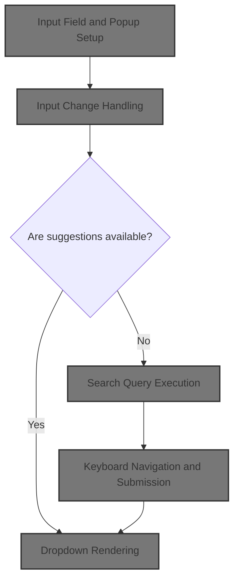

This document describes how users interact with the omnibox search input to find and navigate to relevant tracks or events. Users type queries, receive real-time suggestions, and use keyboard navigation to select or submit options. The system processes these actions to update search results and display matching options in the UI.



# Input Field and Popup Setup

```mermaid
%%{init: {"flowchart": {"defaultRenderer": "elk"}} }%%
flowchart TD
  node1["User interacts with omnibox input"]
  click node1 openCode "ui/src/frontend/omnibox.ts:458:473"
  node1 --> node2{"Are suggestions available?"}
  click node2 openCode "ui/src/frontend/omnibox.ts:478:478"
  node2 -->|"Yes"| node3["Dropdown Rendering"]
  
  node2 -->|"No"| node4["Show input only"]
  click node4 openCode "ui/src/frontend/omnibox.ts:473:541"
  node3 --> node5{"User presses key"}
  
  node4 --> node5
  node5 -->|"Enter & suggestion selected"| node6["Submission Handling"]
  
  node5 -->|"Enter & no suggestion"| node7["Submission Handling"]
  
  node5 -->|"ArrowUp/ArrowDown"| node3
  node5 -->|"Backspace & input empty"| node4
  node5 -->|"Escape"| node4

classDef HeadingStyle fill:#777777,stroke:#333,stroke-width:2px;
click node3 goToHeading "Dropdown Rendering"
node3:::HeadingStyle
click node5 goToHeading "Keyboard Navigation and Submission"
node5:::HeadingStyle
click node6 goToHeading "Submission Handling"
node6:::HeadingStyle
click node7 goToHeading "Submission Handling"
node7:::HeadingStyle

%% Swimm:
%% %%{init: {"flowchart": {"defaultRenderer": "elk"}} }%%
%% flowchart TD
%%   node1["User interacts with omnibox input"]
%%   click node1 openCode "<SwmPath>[ui/…/frontend/omnibox.ts](ui/src/frontend/omnibox.ts)</SwmPath>:458:473"
%%   node1 --> node2{"Are suggestions available?"}
%%   click node2 openCode "<SwmPath>[ui/…/frontend/omnibox.ts](ui/src/frontend/omnibox.ts)</SwmPath>:478:478"
%%   node2 -->|"Yes"| node3["Dropdown Rendering"]
%%   
%%   node2 -->|"No"| node4["Show input only"]
%%   click node4 openCode "<SwmPath>[ui/…/frontend/omnibox.ts](ui/src/frontend/omnibox.ts)</SwmPath>:473:541"
%%   node3 --> node5{"User presses key"}
%%   
%%   node4 --> node5
%%   node5 -->|"Enter & suggestion selected"| node6["Submission Handling"]
%%   
%%   node5 -->|"Enter & no suggestion"| node7["Submission Handling"]
%%   
%%   node5 -->|"ArrowUp/ArrowDown"| node3
%%   node5 -->|"Backspace & input empty"| node4
%%   node5 -->|"Escape"| node4
%% 
%% classDef HeadingStyle fill:#777777,stroke:#333,stroke-width:2px;
%% click node3 goToHeading "Dropdown Rendering"
%% node3:::HeadingStyle
%% click node5 goToHeading "Keyboard Navigation and Submission"
%% node5:::HeadingStyle
%% click node6 goToHeading "Submission Handling"
%% node6:::HeadingStyle
%% click node7 goToHeading "Submission Handling"
%% node7:::HeadingStyle
```



<SwmSnippet path="/ui/src/frontend/omnibox.ts" line="458">

---

In `OmniboxWidget.view`, we set up the input field and popup, wiring up event handlers for input and keyboard navigation. Calling <SwmToken path="ui/src/frontend/omnibox.ts" pos="462:1:1" line-data="      onInput = () =&gt; {},">`onInput`</SwmToken> next lets us react to user typing, update the search state, and potentially show new options.

```typescript
  view({attrs}: m.Vnode<OmniboxWidgetAttrs>): m.Children {
    const {
      value,
      placeholder,
      onInput = () => {},
      onSubmit = () => {},
      onGoBack = () => {},
      inputRef = 'omnibox',
      options,
      closeOnSubmit = false,
      rightContent,
      selectedOptionIndex = 0,
      ...htmlAttrs
    } = attrs;

    return m(
      Popup,
      {
        onPopupMount: (dom: HTMLElement) => (this.popupElement = dom),
        onPopupUnMount: (_dom: HTMLElement) => (this.popupElement = undefined),
        isOpen: exists(options),
        showArrow: false,
        matchWidth: true,
        offset: 2,
        trigger: m(
          '.pf-omnibox',
          htmlAttrs,
          m('input', {
            spellcheck: false,
            ref: inputRef,
            value,
            placeholder,
            oninput: (e: Event) => {
              onInput((e.target as HTMLInputElement).value, value);
            },
            onkeydown: (e: KeyboardEvent) => {
```

---

</SwmSnippet>

## Input Change Handling

```mermaid
%%{init: {"flowchart": {"defaultRenderer": "elk"}} }%%
flowchart TD
  node1{"Is input '>'?"}
  click node1 openCode "ui/src/frontend/omnibox.ts:233:236"
  node1 -->|"Yes"| node2["Switch to command mode"]
  click node2 openCode "ui/src/frontend/omnibox.ts:234:235"
  node2 --> node10["Function returns"]
  click node10 openCode "ui/src/frontend/omnibox.ts:235:236"
  node1 -->|"No"| node3{"Is input ':'?"}
  click node3 openCode "ui/src/frontend/omnibox.ts:236:239"
  node3 -->|"Yes"| node4["Switch to query mode"]
  click node4 openCode "ui/src/frontend/omnibox.ts:237:238"
  node4 --> node10
  node3 -->|"No"| node5["Update omnibox text"]
  click node5 openCode "ui/src/frontend/omnibox.ts:240:240"
  node5 --> node6{"Is trace loaded?"}
  click node6 openCode "ui/src/frontend/omnibox.ts:241:241"
  node6 -->|"No"| node10
  node6 -->|"Yes"| node7{"Is input length >= 4?"}
  click node7 openCode "ui/src/frontend/omnibox.ts:242:246"
  node7 -->|"Yes"| node8["Perform search"]
  click node8 openCode "ui/src/frontend/omnibox.ts:243:243"
  node8 --> node10
  node7 -->|"No"| node9["Reset search"]
  click node9 openCode "ui/src/frontend/omnibox.ts:245:245"
  node9 --> node10
classDef HeadingStyle fill:#777777,stroke:#333,stroke-width:2px;

%% Swimm:
%% %%{init: {"flowchart": {"defaultRenderer": "elk"}} }%%
%% flowchart TD
%%   node1{"Is input '>'?"}
%%   click node1 openCode "<SwmPath>[ui/…/frontend/omnibox.ts](ui/src/frontend/omnibox.ts)</SwmPath>:233:236"
%%   node1 -->|"Yes"| node2["Switch to command mode"]
%%   click node2 openCode "<SwmPath>[ui/…/frontend/omnibox.ts](ui/src/frontend/omnibox.ts)</SwmPath>:234:235"
%%   node2 --> node10["Function returns"]
%%   click node10 openCode "<SwmPath>[ui/…/frontend/omnibox.ts](ui/src/frontend/omnibox.ts)</SwmPath>:235:236"
%%   node1 -->|"No"| node3{"Is input ':'?"}
%%   click node3 openCode "<SwmPath>[ui/…/frontend/omnibox.ts](ui/src/frontend/omnibox.ts)</SwmPath>:236:239"
%%   node3 -->|"Yes"| node4["Switch to query mode"]
%%   click node4 openCode "<SwmPath>[ui/…/frontend/omnibox.ts](ui/src/frontend/omnibox.ts)</SwmPath>:237:238"
%%   node4 --> node10
%%   node3 -->|"No"| node5["Update omnibox text"]
%%   click node5 openCode "<SwmPath>[ui/…/frontend/omnibox.ts](ui/src/frontend/omnibox.ts)</SwmPath>:240:240"
%%   node5 --> node6{"Is trace loaded?"}
%%   click node6 openCode "<SwmPath>[ui/…/frontend/omnibox.ts](ui/src/frontend/omnibox.ts)</SwmPath>:241:241"
%%   node6 -->|"No"| node10
%%   node6 -->|"Yes"| node7{"Is input length >= 4?"}
%%   click node7 openCode "<SwmPath>[ui/…/frontend/omnibox.ts](ui/src/frontend/omnibox.ts)</SwmPath>:242:246"
%%   node7 -->|"Yes"| node8["Perform search"]
%%   click node8 openCode "<SwmPath>[ui/…/frontend/omnibox.ts](ui/src/frontend/omnibox.ts)</SwmPath>:243:243"
%%   node8 --> node10
%%   node7 -->|"No"| node9["Reset search"]
%%   click node9 openCode "<SwmPath>[ui/…/frontend/omnibox.ts](ui/src/frontend/omnibox.ts)</SwmPath>:245:245"
%%   node9 --> node10
%% classDef HeadingStyle fill:#777777,stroke:#333,stroke-width:2px;
```



<SwmSnippet path="/ui/src/frontend/omnibox.ts" line="232">

---

<SwmToken path="ui/src/frontend/omnibox.ts" pos="232:1:1" line-data="      onInput: (value, _prev) =&gt; {">`onInput`</SwmToken> handles changes to the input value, switches modes for special characters, updates the omnibox text, and triggers a search if the input is long enough. Next, we call the search manager to actually perform the search.

```typescript
      onInput: (value, _prev) => {
        if (value === '>') {
          AppImpl.instance.omnibox.setMode(OmniboxMode.Command);
          return;
        } else if (value === ':') {
          AppImpl.instance.omnibox.setMode(OmniboxMode.Query);
          return;
        }
        AppImpl.instance.omnibox.setText(value);
        if (trace === undefined) return; // No trace loaded.
        if (value.length >= 4) {
          trace.search.search(value);
        } else {
          trace.search.reset();
        }
      },
```

---

</SwmSnippet>

## Search Trigger and Scheduling

```mermaid
%%{init: {"flowchart": {"defaultRenderer": "elk"}} }%%
flowchart TD
  node1["User enters search text"]
  click node1 openCode "ui/src/core/search_manager.ts:92:113"
  node1 --> node2{"Is new search text same as previous?"}
  click node2 openCode "ui/src/core/search_manager.ts:93:95"
  node2 -->|"Yes"| node3["No action taken"]
  click node3 openCode "ui/src/core/search_manager.ts:94:95"
  node2 -->|"No"| node4["Reset search state (clear results, reset index, mark not in progress)"]
  click node4 openCode "ui/src/core/search_manager.ts:96:100"
  node4 --> node5{"Is search text empty?"}
  click node5 openCode "ui/src/core/search_manager.ts:101:112"
  node5 -->|"Yes"| node12["End - waiting for user input"]
  click node12 openCode "ui/src/core/search_manager.ts:112:113"
  node5 -->|"No"| node6["Mark search as in progress"]
  click node6 openCode "ui/src/core/search_manager.ts:102:102"
  node6 --> node7["Schedule search operation"]
  click node7 openCode "ui/src/core/search_manager.ts:103:111"
  node7 --> node8{"Is dataset search enabled?"}
  click node8 openCode "ui/src/core/search_manager.ts:104:108"
  node8 -->|"Yes"| node9["Perform dataset search"]
  click node9 openCode "ui/src/core/search_manager.ts:105:106"
  node8 -->|"No"| node10["Perform general search"]
  click node10 openCode "ui/src/core/search_manager.ts:107:108"
  node9 --> node11["Mark search as complete and update UI"]
  click node11 openCode "ui/src/core/search_manager.ts:109:111"
  node10 --> node11
classDef HeadingStyle fill:#777777,stroke:#333,stroke-width:2px;

%% Swimm:
%% %%{init: {"flowchart": {"defaultRenderer": "elk"}} }%%
%% flowchart TD
%%   node1["User enters search text"]
%%   click node1 openCode "<SwmPath>[ui/…/core/search_manager.ts](ui/src/core/search_manager.ts)</SwmPath>:92:113"
%%   node1 --> node2{"Is new search text same as previous?"}
%%   click node2 openCode "<SwmPath>[ui/…/core/search_manager.ts](ui/src/core/search_manager.ts)</SwmPath>:93:95"
%%   node2 -->|"Yes"| node3["No action taken"]
%%   click node3 openCode "<SwmPath>[ui/…/core/search_manager.ts](ui/src/core/search_manager.ts)</SwmPath>:94:95"
%%   node2 -->|"No"| node4["Reset search state (clear results, reset index, mark not in progress)"]
%%   click node4 openCode "<SwmPath>[ui/…/core/search_manager.ts](ui/src/core/search_manager.ts)</SwmPath>:96:100"
%%   node4 --> node5{"Is search text empty?"}
%%   click node5 openCode "<SwmPath>[ui/…/core/search_manager.ts](ui/src/core/search_manager.ts)</SwmPath>:101:112"
%%   node5 -->|"Yes"| node12["End - waiting for user input"]
%%   click node12 openCode "<SwmPath>[ui/…/core/search_manager.ts](ui/src/core/search_manager.ts)</SwmPath>:112:113"
%%   node5 -->|"No"| node6["Mark search as in progress"]
%%   click node6 openCode "<SwmPath>[ui/…/core/search_manager.ts](ui/src/core/search_manager.ts)</SwmPath>:102:102"
%%   node6 --> node7["Schedule search operation"]
%%   click node7 openCode "<SwmPath>[ui/…/core/search_manager.ts](ui/src/core/search_manager.ts)</SwmPath>:103:111"
%%   node7 --> node8{"Is dataset search enabled?"}
%%   click node8 openCode "<SwmPath>[ui/…/core/search_manager.ts](ui/src/core/search_manager.ts)</SwmPath>:104:108"
%%   node8 -->|"Yes"| node9["Perform dataset search"]
%%   click node9 openCode "<SwmPath>[ui/…/core/search_manager.ts](ui/src/core/search_manager.ts)</SwmPath>:105:106"
%%   node8 -->|"No"| node10["Perform general search"]
%%   click node10 openCode "<SwmPath>[ui/…/core/search_manager.ts](ui/src/core/search_manager.ts)</SwmPath>:107:108"
%%   node9 --> node11["Mark search as complete and update UI"]
%%   click node11 openCode "<SwmPath>[ui/…/core/search_manager.ts](ui/src/core/search_manager.ts)</SwmPath>:109:111"
%%   node10 --> node11
%% classDef HeadingStyle fill:#777777,stroke:#333,stroke-width:2px;
```



<SwmSnippet path="/ui/src/core/search_manager.ts" line="92">

---

<SwmToken path="ui/src/core/search_manager.ts" pos="92:1:1" line-data="  search(text: string) {">`search`</SwmToken> checks if the search text has changed, updates internal state, and schedules the actual search execution using a limiter. Next, we call <SwmToken path="ui/src/core/search_manager.ts" pos="107:5:5" line-data="          await this.executeSearch();">`executeSearch`</SwmToken> or <SwmToken path="ui/src/core/search_manager.ts" pos="105:5:5" line-data="          await this.executeDatasetSearch();">`executeDatasetSearch`</SwmToken> to run the query.

```typescript
  search(text: string) {
    if (text === this._searchText) {
      return;
    }
    this._searchText = text;
    this._searchGeneration++;
    this._results = undefined;
    this._resultIndex = -1;
    this._searchInProgress = false;
    if (text !== '') {
      this._searchInProgress = true;
      this._limiter.schedule(async () => {
        if (DATASET_SEARCH.get()) {
          await this.executeDatasetSearch();
        } else {
          await this.executeSearch();
        }
        this._searchInProgress = false;
        raf.scheduleFullRedraw();
      });
    }
  }
```

---

</SwmSnippet>

## Search Query Execution

```mermaid
%%{init: {"flowchart": {"defaultRenderer": "elk"}} }%%
flowchart TD
  node1{"Are engine, track manager, and workspace available?"}
  click node1 openCode "ui/src/core/search_manager.ts:187:189"
  node1 -->|"Yes"| node2["Search tracks for matching names"]
  node1 -->|"No"| node11["Stop search"]
  click node11 openCode "ui/src/core/search_manager.ts:188:189"
  subgraph loop1["For each track in workspace"]
    node2 --> node3{"Does track name contain search text?"}
    click node2 openCode "ui/src/core/search_manager.ts:273:282"
    click node3 openCode "ui/src/core/search_manager.ts:276:278"
    node3 -->|"Yes"| node4["Add track to results"]
    click node4 openCode "ui/src/core/search_manager.ts:279:281"
    node3 -->|"No"| node2
  end
  node4 --> node5["Search events for matching criteria"]
  click node5 openCode "ui/src/core/search_manager.ts:296:326"
  subgraph loop2["For each event row"]
    node5 --> node6{"Is event source cpu, slice, or log?"}
    click node6 openCode "ui/src/core/search_manager.ts:306:311"
    node6 -->|"Yes"| node7{"Is track URI available?"}
    click node7 openCode "ui/src/core/search_manager.ts:316:318"
    node7 -->|"Yes"| node8["Add event to results"]
    click node8 openCode "ui/src/core/search_manager.ts:320:325"
    node7 -->|"No"| node5
    node6 -->|"No"| node5
  end
  node8 --> node9["Aggregate and update search results for UI"]
  click node9 openCode "ui/src/core/search_manager.ts:333:351"

classDef HeadingStyle fill:#777777,stroke:#333,stroke-width:2px;

%% Swimm:
%% %%{init: {"flowchart": {"defaultRenderer": "elk"}} }%%
%% flowchart TD
%%   node1{"Are engine, track manager, and workspace available?"}
%%   click node1 openCode "<SwmPath>[ui/…/core/search_manager.ts](ui/src/core/search_manager.ts)</SwmPath>:187:189"
%%   node1 -->|"Yes"| node2["Search tracks for matching names"]
%%   node1 -->|"No"| node11["Stop search"]
%%   click node11 openCode "<SwmPath>[ui/…/core/search_manager.ts](ui/src/core/search_manager.ts)</SwmPath>:188:189"
%%   subgraph loop1["For each track in workspace"]
%%     node2 --> node3{"Does track name contain search text?"}
%%     click node2 openCode "<SwmPath>[ui/…/core/search_manager.ts](ui/src/core/search_manager.ts)</SwmPath>:273:282"
%%     click node3 openCode "<SwmPath>[ui/…/core/search_manager.ts](ui/src/core/search_manager.ts)</SwmPath>:276:278"
%%     node3 -->|"Yes"| node4["Add track to results"]
%%     click node4 openCode "<SwmPath>[ui/…/core/search_manager.ts](ui/src/core/search_manager.ts)</SwmPath>:279:281"
%%     node3 -->|"No"| node2
%%   end
%%   node4 --> node5["Search events for matching criteria"]
%%   click node5 openCode "<SwmPath>[ui/…/core/search_manager.ts](ui/src/core/search_manager.ts)</SwmPath>:296:326"
%%   subgraph loop2["For each event row"]
%%     node5 --> node6{"Is event source cpu, slice, or log?"}
%%     click node6 openCode "<SwmPath>[ui/…/core/search_manager.ts](ui/src/core/search_manager.ts)</SwmPath>:306:311"
%%     node6 -->|"Yes"| node7{"Is track URI available?"}
%%     click node7 openCode "<SwmPath>[ui/…/core/search_manager.ts](ui/src/core/search_manager.ts)</SwmPath>:316:318"
%%     node7 -->|"Yes"| node8["Add event to results"]
%%     click node8 openCode "<SwmPath>[ui/…/core/search_manager.ts](ui/src/core/search_manager.ts)</SwmPath>:320:325"
%%     node7 -->|"No"| node5
%%     node6 -->|"No"| node5
%%   end
%%   node8 --> node9["Aggregate and update search results for UI"]
%%   click node9 openCode "<SwmPath>[ui/…/core/search_manager.ts](ui/src/core/search_manager.ts)</SwmPath>:333:351"
%% 
%% classDef HeadingStyle fill:#777777,stroke:#333,stroke-width:2px;
```



<SwmSnippet path="/ui/src/core/search_manager.ts" line="179">

---

In <SwmToken path="ui/src/core/search_manager.ts" pos="179:5:5" line-data="  private async executeSearch() {">`executeSearch`</SwmToken>, we prep the search query, build lookup maps for tracks, and start querying the engine for matching threads, processes, slices, and logs. This sets up the data needed for result mapping and UI updates.

```typescript
  private async executeSearch() {
    const search = this._searchText;
    const searchLiteral = escapeSearchQuery(this._searchText);
    const generation = this._searchGeneration;

    const engine = this._engine;
    const trackManager = this._trackManager;
    const workspace = this._workspace;
    if (!engine || !trackManager || !workspace) {
      return;
    }

    // TODO(stevegolton): Avoid recomputing these indexes each time.
    const trackUrisByCpu = new Map<number, string>();
    const allTracks = trackManager.getAllTracks();
    allTracks.forEach((td) => {
      const tags = td?.tags;
      const cpu = tags?.cpu;
      const kind = tags?.kind;
      exists(cpu) &&
        kind === CPU_SLICE_TRACK_KIND &&
        trackUrisByCpu.set(cpu, td.uri);
    });

    const trackUrisByTrackId = new Map<number, string>();
    allTracks.forEach((td) => {
      const trackIds = td?.tags?.trackIds ?? [];
      trackIds.forEach((trackId) => trackUrisByTrackId.set(trackId, td.uri));
    });

    const utidRes = await engine.query(`select utid from thread join process
    using(upid) where
      thread.name glob ${searchLiteral} or
      process.name glob ${searchLiteral}`);
    const utids = [];
    for (const it = utidRes.iter({utid: NUM}); it.valid(); it.next()) {
      utids.push(it.utid);
    }
```

---

</SwmSnippet>

<SwmSnippet path="/ui/src/core/search_manager.ts" line="263">

---

Here we scan workspace tracks for name matches and add them to the <SwmToken path="ui/src/core/search_manager.ts" pos="263:3:3" line-data="    const searchResults: SearchResults = {">`searchResults`</SwmToken> object, prepping for event allocation and result mapping.

```typescript
    const searchResults: SearchResults = {
      eventIds: new Float64Array(0),
      tses: new BigInt64Array(0),
      utids: new Float64Array(0),
      sources: [],
      trackUris: [],
      totalResults: 0,
    };

    const lowerSearch = search.toLowerCase();
    for (const track of workspace.flatTracksOrdered) {
      // We don't support searching for tracks that don't have a URI.
      if (!track.uri) continue;
      if (track.name.toLowerCase().indexOf(lowerSearch) === -1) {
        continue;
      }
      searchResults.totalResults++;
      searchResults.sources.push('track');
      searchResults.trackUris.push(track.uri);
    }
```

---

</SwmSnippet>

<SwmSnippet path="/ui/src/core/search_manager.ts" line="284">

---

Next we allocate arrays in <SwmToken path="ui/src/core/search_manager.ts" pos="285:1:1" line-data="    searchResults.eventIds = new Float64Array(">`searchResults`</SwmToken> for events and initialize them, so we can fill them with actual data in the next step.

```typescript
    const rows = res.numRows();
    searchResults.eventIds = new Float64Array(
      searchResults.totalResults + rows,
    );
    searchResults.tses = new BigInt64Array(searchResults.totalResults + rows);
    searchResults.utids = new Float64Array(searchResults.totalResults + rows);
    for (let i = 0; i < searchResults.totalResults; ++i) {
      searchResults.eventIds[i] = -1;
      searchResults.tses[i] = -1n;
      searchResults.utids[i] = -1;
    }
```

---

</SwmSnippet>

<SwmSnippet path="/ui/src/core/search_manager.ts" line="296">

---

Here we iterate over engine query results, map each to a track URI using repository-specific logic, and fill the event arrays with the relevant data.

```typescript
    const it = res.iter({
      sliceId: NUM,
      ts: LONG,
      source: STR,
      sourceId: NUM,
      utid: NUM,
    });
    for (; it.valid(); it.next()) {
      let track: string | undefined = undefined;

      if (it.source === 'cpu') {
        track = trackUrisByCpu.get(it.sourceId);
      } else if (it.source === 'slice') {
        track = trackUrisByTrackId.get(it.sourceId);
      } else if (it.source === 'log') {
        track = trackManager
          .getAllTracks()
          .find((td) => td.tags?.kind === ANDROID_LOGS_TRACK_KIND)?.uri;
      }
      // The .get() calls above could return undefined, this isn't just an else.
      if (track === undefined) {
        continue;
      }

      const i = searchResults.totalResults++;
      searchResults.trackUris.push(track);
      searchResults.sources.push(it.source as SearchSource);
      searchResults.eventIds[i] = it.sliceId;
      searchResults.tses[i] = it.ts;
      searchResults.utids[i] = it.utid;
    }
```

---

</SwmSnippet>

<SwmSnippet path="/ui/src/core/search_manager.ts" line="333">

---

Finally we update the internal results and set the initial navigation index based on the visible timeline window, so the UI can show and jump to relevant results.

```typescript
    this._results = searchResults;

    // We have changed the search results - try and find the first result that's
    // after the start of this visible window.
    const visibleWindow = this._timeline?.visibleWindow.toTimeSpan();
    if (visibleWindow) {
      const foundIndex = this._results.tses.findIndex(
        (ts) => ts >= visibleWindow.start,
      );
      if (foundIndex === -1) {
        this._resultIndex = -1;
      } else {
        // Store the value before the found one, so that when the user presses
        // enter we navigate to the correct one.
        this._resultIndex = foundIndex - 1;
      }
    } else {
      this._resultIndex = -1;
    }
  }
```

---

</SwmSnippet>

## Keyboard Navigation and Submission

```mermaid
%%{init: {"flowchart": {"defaultRenderer": "elk"}} }%%
flowchart TD
  node1{"Which key did the user press?"}
  click node1 openCode "ui/src/frontend/omnibox.ts:494:541"
  node1 -->|"Backspace & input empty"| node2["Go back"]
  click node2 openCode "ui/src/frontend/omnibox.ts:495:495"
  node1 -->|"Escape"| node3["Close omnibox"]
  click node3 openCode "ui/src/frontend/omnibox.ts:498:499"
  node1 -->|"Other"| node4{"Are options available?"}
  click node4 openCode "ui/src/frontend/omnibox.ts:501:526"
  node4 -->|"Yes"| node5{"Which key?"}
  click node5 openCode "ui/src/frontend/omnibox.ts:502:525"
  node5 -->|ArrowUp| node6["Highlight previous option"]
  click node6 openCode "ui/src/frontend/omnibox.ts:504:504"
  node5 -->|ArrowDown| node7["Highlight next option"]
  click node7 openCode "ui/src/frontend/omnibox.ts:507:507"
  node5 -->|"Enter & option selected"| node8["Submit selected option"]
  click node8 openCode "ui/src/frontend/omnibox.ts:523:523"
  node8 -->|closeOnSubmit| node3
  node4 -->|"No"| node9{"Enter pressed?"}
  click node9 openCode "ui/src/frontend/omnibox.ts:527:535"
  node9 -->|"Yes"| node10["Submit input value"]
  click node10 openCode "ui/src/frontend/omnibox.ts:534:534"
  node10 -->|closeOnSubmit| node3

classDef HeadingStyle fill:#777777,stroke:#333,stroke-width:2px;

%% Swimm:
%% %%{init: {"flowchart": {"defaultRenderer": "elk"}} }%%
%% flowchart TD
%%   node1{"Which key did the user press?"}
%%   click node1 openCode "<SwmPath>[ui/…/frontend/omnibox.ts](ui/src/frontend/omnibox.ts)</SwmPath>:494:541"
%%   node1 -->|"Backspace & input empty"| node2["Go back"]
%%   click node2 openCode "<SwmPath>[ui/…/frontend/omnibox.ts](ui/src/frontend/omnibox.ts)</SwmPath>:495:495"
%%   node1 -->|"Escape"| node3["Close omnibox"]
%%   click node3 openCode "<SwmPath>[ui/…/frontend/omnibox.ts](ui/src/frontend/omnibox.ts)</SwmPath>:498:499"
%%   node1 -->|"Other"| node4{"Are options available?"}
%%   click node4 openCode "<SwmPath>[ui/…/frontend/omnibox.ts](ui/src/frontend/omnibox.ts)</SwmPath>:501:526"
%%   node4 -->|"Yes"| node5{"Which key?"}
%%   click node5 openCode "<SwmPath>[ui/…/frontend/omnibox.ts](ui/src/frontend/omnibox.ts)</SwmPath>:502:525"
%%   node5 -->|<SwmToken path="ui/src/frontend/omnibox.ts" pos="502:11:11" line-data="                if (e.key === &#39;ArrowUp&#39;) {">`ArrowUp`</SwmToken>| node6["Highlight previous option"]
%%   click node6 openCode "<SwmPath>[ui/…/frontend/omnibox.ts](ui/src/frontend/omnibox.ts)</SwmPath>:504:504"
%%   node5 -->|<SwmToken path="ui/src/frontend/omnibox.ts" pos="505:15:15" line-data="                } else if (e.key === &#39;ArrowDown&#39;) {">`ArrowDown`</SwmToken>| node7["Highlight next option"]
%%   click node7 openCode "<SwmPath>[ui/…/frontend/omnibox.ts](ui/src/frontend/omnibox.ts)</SwmPath>:507:507"
%%   node5 -->|"Enter & option selected"| node8["Submit selected option"]
%%   click node8 openCode "<SwmPath>[ui/…/frontend/omnibox.ts](ui/src/frontend/omnibox.ts)</SwmPath>:523:523"
%%   node8 -->|<SwmToken path="ui/src/frontend/omnibox.ts" pos="467:1:1" line-data="      closeOnSubmit = false,">`closeOnSubmit`</SwmToken>| node3
%%   node4 -->|"No"| node9{"Enter pressed?"}
%%   click node9 openCode "<SwmPath>[ui/…/frontend/omnibox.ts](ui/src/frontend/omnibox.ts)</SwmPath>:527:535"
%%   node9 -->|"Yes"| node10["Submit input value"]
%%   click node10 openCode "<SwmPath>[ui/…/frontend/omnibox.ts](ui/src/frontend/omnibox.ts)</SwmPath>:534:534"
%%   node10 -->|<SwmToken path="ui/src/frontend/omnibox.ts" pos="467:1:1" line-data="      closeOnSubmit = false,">`closeOnSubmit`</SwmToken>| node3
%% 
%% classDef HeadingStyle fill:#777777,stroke:#333,stroke-width:2px;
```



<SwmSnippet path="/ui/src/frontend/omnibox.ts" line="494">

---

Back in OmniboxWidget.view, after handling input, we process keyboard events for navigation and submission. Calling <SwmToken path="ui/src/frontend/omnibox.ts" pos="523:1:1" line-data="                    onSubmit(option.key, mod, shift);">`onSubmit`</SwmToken> next lets us act on the user's selection or input, updating the search or UI state.

```typescript
              if (e.key === 'Backspace' && value === '') {
                onGoBack();
              } else if (e.key === 'Escape') {
                e.preventDefault();
                this.close(attrs);
              }

              if (options) {
                if (e.key === 'ArrowUp') {
                  e.preventDefault();
                  this.highlightPreviousOption(attrs);
                } else if (e.key === 'ArrowDown') {
                  e.preventDefault();
                  this.highlightNextOption(attrs);
                } else if (e.key === 'Enter') {
                  e.preventDefault();

                  const option = options[selectedOptionIndex];
                  // Return values from indexing arrays can be undefined.
                  // We should enable noUncheckedIndexedAccess in
                  // tsconfig.json.
                  /* eslint-disable
                      @typescript-eslint/strict-boolean-expressions */
                  if (option) {
                    /* eslint-enable */
                    closeOnSubmit && this.close(attrs);

                    const mod = e.metaKey || e.ctrlKey;
                    const shift = e.shiftKey;
                    onSubmit(option.key, mod, shift);
                  }
                }
              } else {
                if (e.key === 'Enter') {
                  e.preventDefault();

                  closeOnSubmit && this.close(attrs);

                  const mod = e.metaKey || e.ctrlKey;
                  const shift = e.shiftKey;
                  onSubmit(value, mod, shift);
                }
              }
            },
          }),
          rightContent,
        ),
      },
```

---

</SwmSnippet>

## Submission Handling

```mermaid
%%{init: {"flowchart": {"defaultRenderer": "elk"}} }%%
flowchart TD
  node1["User submits search in omnibox"]
  click node1 openCode "ui/src/frontend/omnibox.ts:253:264"
  node1 --> node2{"Is a trace loaded? (trace)"}
  click node2 openCode "ui/src/frontend/omnibox.ts:254:254"
  node2 -->|"No"| node3["No action taken"]
  click node3 openCode "ui/src/frontend/omnibox.ts:254:254"
  node2 -->|"Yes"| node4["Perform search for entered value"]
  click node4 openCode "ui/src/frontend/omnibox.ts:255:255"
  node4 --> node5{"Was shift key pressed? (shift)"}
  click node5 openCode "ui/src/frontend/omnibox.ts:256:260"
  node5 -->|"Yes"| node6["Go to previous search result"]
  click node6 openCode "ui/src/frontend/omnibox.ts:257:257"
  node5 -->|"No"| node7["Go to next search result"]
  click node7 openCode "ui/src/frontend/omnibox.ts:259:259"
  node6 --> node8["Remove focus from input"]
  click node8 openCode "ui/src/frontend/omnibox.ts:261:262"
  node7 --> node8
classDef HeadingStyle fill:#777777,stroke:#333,stroke-width:2px;

%% Swimm:
%% %%{init: {"flowchart": {"defaultRenderer": "elk"}} }%%
%% flowchart TD
%%   node1["User submits search in omnibox"]
%%   click node1 openCode "<SwmPath>[ui/…/frontend/omnibox.ts](ui/src/frontend/omnibox.ts)</SwmPath>:253:264"
%%   node1 --> node2{"Is a trace loaded? (trace)"}
%%   click node2 openCode "<SwmPath>[ui/…/frontend/omnibox.ts](ui/src/frontend/omnibox.ts)</SwmPath>:254:254"
%%   node2 -->|"No"| node3["No action taken"]
%%   click node3 openCode "<SwmPath>[ui/…/frontend/omnibox.ts](ui/src/frontend/omnibox.ts)</SwmPath>:254:254"
%%   node2 -->|"Yes"| node4["Perform search for entered value"]
%%   click node4 openCode "<SwmPath>[ui/…/frontend/omnibox.ts](ui/src/frontend/omnibox.ts)</SwmPath>:255:255"
%%   node4 --> node5{"Was shift key pressed? (shift)"}
%%   click node5 openCode "<SwmPath>[ui/…/frontend/omnibox.ts](ui/src/frontend/omnibox.ts)</SwmPath>:256:260"
%%   node5 -->|"Yes"| node6["Go to previous search result"]
%%   click node6 openCode "<SwmPath>[ui/…/frontend/omnibox.ts](ui/src/frontend/omnibox.ts)</SwmPath>:257:257"
%%   node5 -->|"No"| node7["Go to next search result"]
%%   click node7 openCode "<SwmPath>[ui/…/frontend/omnibox.ts](ui/src/frontend/omnibox.ts)</SwmPath>:259:259"
%%   node6 --> node8["Remove focus from input"]
%%   click node8 openCode "<SwmPath>[ui/…/frontend/omnibox.ts](ui/src/frontend/omnibox.ts)</SwmPath>:261:262"
%%   node7 --> node8
%% classDef HeadingStyle fill:#777777,stroke:#333,stroke-width:2px;
```



<SwmSnippet path="/ui/src/frontend/omnibox.ts" line="253">

---

In <SwmToken path="ui/src/frontend/omnibox.ts" pos="253:1:1" line-data="      onSubmit: (value, _mod, shift) =&gt; {">`onSubmit`</SwmToken>, we check for a loaded trace and kick off a new search with the submitted value, so the results reflect the user's action.

```typescript
      onSubmit: (value, _mod, shift) => {
        if (trace === undefined) return; // No trace loaded.
        trace.search.search(value);
```

---

</SwmSnippet>

<SwmSnippet path="/ui/src/frontend/omnibox.ts" line="256">

---

After returning from search_manager, <SwmToken path="ui/src/frontend/omnibox.ts" pos="253:1:1" line-data="      onSubmit: (value, _mod, shift) =&gt; {">`onSubmit`</SwmToken> moves the result index forward or backward based on shift, and blurs the input to finalize the action.

```typescript
        if (shift) {
          trace.search.stepBackwards();
        } else {
          trace.search.stepForward();
        }
        if (this.omniboxInputEl) {
          this.omniboxInputEl.blur();
        }
      },
```

---

</SwmSnippet>

## Dropdown Rendering

<SwmSnippet path="/ui/src/frontend/omnibox.ts" line="542">

---

After <SwmToken path="ui/src/frontend/omnibox.ts" pos="253:1:1" line-data="      onSubmit: (value, _mod, shift) =&gt; {">`onSubmit`</SwmToken> in OmniboxWidget.view, we conditionally render the dropdown if options are present, so users see available choices or feedback.

```typescript
      options && this.renderDropdown(attrs),
    );
  }
```

---

</SwmSnippet>

# Dropdown and Options Rendering

```mermaid
%%{init: {"flowchart": {"defaultRenderer": "elk"}} }%%
flowchart TD
  node1{"Are options provided?"}
  click node1 openCode "ui/src/frontend/omnibox.ts:549:549"
  node1 -->|"No"| node2["Show nothing"]
  click node2 openCode "ui/src/frontend/omnibox.ts:549:549"
  node1 -->|"Yes"| node3{"Is options list empty?"}
  click node3 openCode "ui/src/frontend/omnibox.ts:551:551"
  node3 -->|"Yes"| node4["Show message: 'No matching options'"]
  click node4 openCode "ui/src/frontend/omnibox.ts:552:552"
  node3 -->|"No"| node5["Show dropdown with options"]
  click node5 openCode "ui/src/frontend/omnibox.ts:554:558"

classDef HeadingStyle fill:#777777,stroke:#333,stroke-width:2px;

%% Swimm:
%% %%{init: {"flowchart": {"defaultRenderer": "elk"}} }%%
%% flowchart TD
%%   node1{"Are options provided?"}
%%   click node1 openCode "<SwmPath>[ui/…/frontend/omnibox.ts](ui/src/frontend/omnibox.ts)</SwmPath>:549:549"
%%   node1 -->|"No"| node2["Show nothing"]
%%   click node2 openCode "<SwmPath>[ui/…/frontend/omnibox.ts](ui/src/frontend/omnibox.ts)</SwmPath>:549:549"
%%   node1 -->|"Yes"| node3{"Is options list empty?"}
%%   click node3 openCode "<SwmPath>[ui/…/frontend/omnibox.ts](ui/src/frontend/omnibox.ts)</SwmPath>:551:551"
%%   node3 -->|"Yes"| node4["Show message: 'No matching options'"]
%%   click node4 openCode "<SwmPath>[ui/…/frontend/omnibox.ts](ui/src/frontend/omnibox.ts)</SwmPath>:552:552"
%%   node3 -->|"No"| node5["Show dropdown with options"]
%%   click node5 openCode "<SwmPath>[ui/…/frontend/omnibox.ts](ui/src/frontend/omnibox.ts)</SwmPath>:554:558"
%% 
%% classDef HeadingStyle fill:#777777,stroke:#333,stroke-width:2px;
```



<SwmSnippet path="/ui/src/frontend/omnibox.ts" line="546">

---

<SwmToken path="ui/src/frontend/omnibox.ts" pos="546:3:3" line-data="  private renderDropdown(attrs: OmniboxWidgetAttrs): m.Children {">`renderDropdown`</SwmToken> checks for options and either shows an empty state or calls <SwmToken path="ui/src/frontend/omnibox.ts" pos="556:3:3" line-data="        this.renderOptionsContainer(attrs, options),">`renderOptionsContainer`</SwmToken> to display the list of choices.

```typescript
  private renderDropdown(attrs: OmniboxWidgetAttrs): m.Children {
    const {options} = attrs;

    if (!options) return null;

    if (options.length === 0) {
      return m(EmptyState, {title: 'No matching options...'});
    } else {
      return m(
        '.pf-omnibox-dropdown',
        this.renderOptionsContainer(attrs, options),
        this.renderFooter(),
      );
    }
  }
```

---

</SwmSnippet>

<SwmSnippet path="/ui/src/frontend/omnibox.ts" line="576">

---

<SwmToken path="ui/src/frontend/omnibox.ts" pos="576:3:3" line-data="  private renderOptionsContainer(">`renderOptionsContainer`</SwmToken> maps options to rows, wiring up click handlers to call <SwmToken path="ui/src/frontend/omnibox.ts" pos="582:1:1" line-data="      onSubmit = () =&gt; {},">`onSubmit`</SwmToken> and close the dropdown if needed.

```typescript
  private renderOptionsContainer(
    attrs: OmniboxWidgetAttrs,
    options: OmniboxOption[],
  ): m.Children {
    const {
      onClose = () => {},
      onSubmit = () => {},
      closeOnSubmit = false,
      selectedOptionIndex,
    } = attrs;

    const opts = options.map(({displayName, key, rightContent, tag}, index) => {
      return m(OmniboxOptionRow, {
        key,
        label: tag,
        displayName: displayName,
        highlighted: index === selectedOptionIndex,
        onclick: () => {
          closeOnSubmit && onClose();
          onSubmit(key, false, false);
        },
        rightContent,
      });
    });

    return m('ul.pf-omnibox-options-container', opts);
  }
```

---

</SwmSnippet>

&nbsp;

*This is an auto-generated document by Swimm 🌊 and has not yet been verified by a human*

<SwmMeta version="3.0.0" repo-id="Z2l0aHViJTNBJTNBY3BsdXNwbHVzLXBlcmZldHRvJTNBJTNBcmljYXJkb2xvcGV6Zw==" repo-name="cplusplus-perfetto"><sup>Powered by [Swimm](https://app.swimm.io/)</sup></SwmMeta>
