This document describes how user input in the omnibox is routed to the appropriate mode, how search requests are handled, and how results are presented for navigation. The omnibox supports multiple modes, adapting its UI to the user's intent and enabling efficient search and navigation.

# Routing user input to the correct omnibox mode

```mermaid
%%{init: {"flowchart": {"defaultRenderer": "elk"}} }%%
flowchart TD
  node2{"Is statusMessage present?"}
  click node2 openCode "ui/src/frontend/omnibox.ts:56:64"
  node2 -->|"Yes"| node3["Display status message in omnibox"]
  click node3 openCode "ui/src/frontend/omnibox.ts:57:63"
  node2 -->|"No"| node4{"omniboxMode?"}
  click node4 openCode "ui/src/frontend/omnibox.ts:64:74"
  node4 -->|"Command"| node5["Show command input interface"]
  click node5 openCode "ui/src/frontend/omnibox.ts:65:65"
  node4 -->|"Prompt"| node6["Show prompt input interface"]
  click node6 openCode "ui/src/frontend/omnibox.ts:67:67"
  node4 -->|"Query"| node7["Show query input interface"]
  click node7 openCode "ui/src/frontend/omnibox.ts:69:69"
  node4 -->|"Search"| node8["Show search input interface"]
  click node8 openCode "ui/src/frontend/omnibox.ts:71:71"
  node4 -->|"Unrecognized"| node9["Error: Unrecognized mode"]
  click node9 openCode "ui/src/frontend/omnibox.ts:73:74"

classDef HeadingStyle fill:#777777,stroke:#333,stroke-width:2px;

%% Swimm:
%% %%{init: {"flowchart": {"defaultRenderer": "elk"}} }%%
%% flowchart TD
%%   node2{"Is <SwmToken path="ui/src/frontend/omnibox.ts" pos="55:3:3" line-data="    const statusMessage = omnibox.statusMessage;">`statusMessage`</SwmToken> present?"}
%%   click node2 openCode "<SwmPath>[ui/…/frontend/omnibox.ts](ui/src/frontend/omnibox.ts)</SwmPath>:56:64"
%%   node2 -->|"Yes"| node3["Display status message in omnibox"]
%%   click node3 openCode "<SwmPath>[ui/…/frontend/omnibox.ts](ui/src/frontend/omnibox.ts)</SwmPath>:57:63"
%%   node2 -->|"No"| node4{"<SwmToken path="ui/src/frontend/omnibox.ts" pos="54:3:3" line-data="    const omniboxMode = omnibox.mode;">`omniboxMode`</SwmToken>?"}
%%   click node4 openCode "<SwmPath>[ui/…/frontend/omnibox.ts](ui/src/frontend/omnibox.ts)</SwmPath>:64:74"
%%   node4 -->|"Command"| node5["Show command input interface"]
%%   click node5 openCode "<SwmPath>[ui/…/frontend/omnibox.ts](ui/src/frontend/omnibox.ts)</SwmPath>:65:65"
%%   node4 -->|"Prompt"| node6["Show prompt input interface"]
%%   click node6 openCode "<SwmPath>[ui/…/frontend/omnibox.ts](ui/src/frontend/omnibox.ts)</SwmPath>:67:67"
%%   node4 -->|"Query"| node7["Show query input interface"]
%%   click node7 openCode "<SwmPath>[ui/…/frontend/omnibox.ts](ui/src/frontend/omnibox.ts)</SwmPath>:69:69"
%%   node4 -->|"Search"| node8["Show search input interface"]
%%   click node8 openCode "<SwmPath>[ui/…/frontend/omnibox.ts](ui/src/frontend/omnibox.ts)</SwmPath>:71:71"
%%   node4 -->|"Unrecognized"| node9["Error: Unrecognized mode"]
%%   click node9 openCode "<SwmPath>[ui/…/frontend/omnibox.ts](ui/src/frontend/omnibox.ts)</SwmPath>:73:74"
%% 
%% classDef HeadingStyle fill:#777777,stroke:#333,stroke-width:2px;
```



<SwmSnippet path="/ui/src/frontend/omnibox.ts" line="50">

---

<SwmToken path="ui/src/frontend/omnibox.ts" pos="50:1:1" line-data="  view({attrs}: m.Vnode&lt;OmniboxAttrs&gt;): m.Children {">`view`</SwmToken> decides which omnibox UI to show based on the current mode and status. If the mode is Search, it calls <SwmToken path="ui/src/frontend/omnibox.ts" pos="71:5:5" line-data="      return this.renderSearchOmnibox(trace);">`renderSearchOmnibox`</SwmToken> to display the search input and hook up search logic. This is the entry point for handling user input and routing it to the right UI and logic.

```typescript
  view({attrs}: m.Vnode<OmniboxAttrs>): m.Children {
    const {trace} = attrs;
    const app = AppImpl.instance;
    const omnibox = app.omnibox;
    const omniboxMode = omnibox.mode;
    const statusMessage = omnibox.statusMessage;
    if (statusMessage !== undefined) {
      return m(
        `.pf-omnibox.pf-omnibox--message-mode`,
        m(`input[readonly][disabled][ref=omnibox]`, {
          value: '',
          placeholder: statusMessage,
        }),
      );
    } else if (omniboxMode === OmniboxMode.Command) {
      return this.renderCommandOmnibox();
    } else if (omniboxMode === OmniboxMode.Prompt) {
      return this.renderPromptOmnibox();
    } else if (omniboxMode === OmniboxMode.Query) {
      return this.renderQueryOmnibox(trace);
    } else if (omniboxMode === OmniboxMode.Search) {
      return this.renderSearchOmnibox(trace);
    } else {
      assertUnreachable(omniboxMode);
    }
  }
```

---

</SwmSnippet>

# Handling search input and dispatching search requests

<SwmSnippet path="/ui/src/frontend/omnibox.ts" line="227">

---

In <SwmToken path="ui/src/frontend/omnibox.ts" pos="227:3:3" line-data="  private renderSearchOmnibox(trace: TraceImpl | undefined): m.Children {">`renderSearchOmnibox`</SwmToken>, we set up the search input and wire up handlers for user input. When the user types at least 4 characters and a trace is loaded, we call <SwmToken path="ui/src/frontend/omnibox.ts" pos="243:1:5" line-data="          trace.search.search(value);">`trace.search.search`</SwmToken> to kick off the actual search logic in the core search manager. This connects the UI to the backend search.

```typescript
  private renderSearchOmnibox(trace: TraceImpl | undefined): m.Children {
    return m(OmniboxWidget, {
      value: AppImpl.instance.omnibox.text,
      placeholder: "Search or type '>' for commands or ':' for SQL mode",
      inputRef: OMNIBOX_INPUT_REF,
      onInput: (value, _prev) => {
        if (value === '>') {
          AppImpl.instance.omnibox.setMode(OmniboxMode.Command);
          return;
        } else if (value === ':') {
          AppImpl.instance.omnibox.setMode(OmniboxMode.Query);
          return;
        }
        AppImpl.instance.omnibox.setText(value);
        if (trace === undefined) return; // No trace loaded.
        if (value.length >= 4) {
          trace.search.search(value);
        } else {
          trace.search.reset();
        }
      },
      onClose: () => {
        if (this.omniboxInputEl) {
          this.omniboxInputEl.blur();
        }
      },
      onSubmit: (value, _mod, shift) => {
        if (trace === undefined) return; // No trace loaded.
        trace.search.search(value);
```

---

</SwmSnippet>

## Preparing and scheduling the search operation

```mermaid
%%{init: {"flowchart": {"defaultRenderer": "elk"}} }%%
flowchart TD
    node1["User enters search text"] --> node2{"Is search text same as previous?"}
    click node1 openCode "ui/src/core/search_manager.ts:92:93"
    node2 -->|"Yes"| node3["No new search needed"]
    click node2 openCode "ui/src/core/search_manager.ts:93:94"
    node2 -->|"No"| node4["Prepare for new search"]
    click node4 openCode "ui/src/core/search_manager.ts:96:100"
    node4 --> node5{"Is search text empty?"}
    click node5 openCode "ui/src/core/search_manager.ts:101:102"
    node5 -->|"Yes"| node9["Finish"]
    click node9 openCode "ui/src/core/search_manager.ts:112:113"
    node5 -->|"No"| node6["Mark search as in progress"]
    click node6 openCode "ui/src/core/search_manager.ts:102:103"
    node6 --> node7{"Is dataset search enabled?"}
    click node7 openCode "ui/src/core/search_manager.ts:104:105"
    node7 -->|"Yes"| node8["Perform dataset search"]
    click node8 openCode "ui/src/core/search_manager.ts:105:106"
    node7 -->|"No"| node10["Perform standard search"]
    click node10 openCode "ui/src/core/search_manager.ts:107:108"
    node8 --> node12["Mark search as complete and update UI"]
    click node12 openCode "ui/src/core/search_manager.ts:109:111"
    node10 --> node12
    node12 -->|"Search complete"| node9["Finish"]
    click node9 openCode "ui/src/core/search_manager.ts:112:113"
classDef HeadingStyle fill:#777777,stroke:#333,stroke-width:2px;

%% Swimm:
%% %%{init: {"flowchart": {"defaultRenderer": "elk"}} }%%
%% flowchart TD
%%     node1["User enters search text"] --> node2{"Is search text same as previous?"}
%%     click node1 openCode "<SwmPath>[ui/…/core/search_manager.ts](ui/src/core/search_manager.ts)</SwmPath>:92:93"
%%     node2 -->|"Yes"| node3["No new search needed"]
%%     click node2 openCode "<SwmPath>[ui/…/core/search_manager.ts](ui/src/core/search_manager.ts)</SwmPath>:93:94"
%%     node2 -->|"No"| node4["Prepare for new search"]
%%     click node4 openCode "<SwmPath>[ui/…/core/search_manager.ts](ui/src/core/search_manager.ts)</SwmPath>:96:100"
%%     node4 --> node5{"Is search text empty?"}
%%     click node5 openCode "<SwmPath>[ui/…/core/search_manager.ts](ui/src/core/search_manager.ts)</SwmPath>:101:102"
%%     node5 -->|"Yes"| node9["Finish"]
%%     click node9 openCode "<SwmPath>[ui/…/core/search_manager.ts](ui/src/core/search_manager.ts)</SwmPath>:112:113"
%%     node5 -->|"No"| node6["Mark search as in progress"]
%%     click node6 openCode "<SwmPath>[ui/…/core/search_manager.ts](ui/src/core/search_manager.ts)</SwmPath>:102:103"
%%     node6 --> node7{"Is dataset search enabled?"}
%%     click node7 openCode "<SwmPath>[ui/…/core/search_manager.ts](ui/src/core/search_manager.ts)</SwmPath>:104:105"
%%     node7 -->|"Yes"| node8["Perform dataset search"]
%%     click node8 openCode "<SwmPath>[ui/…/core/search_manager.ts](ui/src/core/search_manager.ts)</SwmPath>:105:106"
%%     node7 -->|"No"| node10["Perform standard search"]
%%     click node10 openCode "<SwmPath>[ui/…/core/search_manager.ts](ui/src/core/search_manager.ts)</SwmPath>:107:108"
%%     node8 --> node12["Mark search as complete and update UI"]
%%     click node12 openCode "<SwmPath>[ui/…/core/search_manager.ts](ui/src/core/search_manager.ts)</SwmPath>:109:111"
%%     node10 --> node12
%%     node12 -->|"Search complete"| node9["Finish"]
%%     click node9 openCode "<SwmPath>[ui/…/core/search_manager.ts](ui/src/core/search_manager.ts)</SwmPath>:112:113"
%% classDef HeadingStyle fill:#777777,stroke:#333,stroke-width:2px;
```



<SwmSnippet path="/ui/src/core/search_manager.ts" line="92">

---

<SwmToken path="ui/src/core/search_manager.ts" pos="92:1:1" line-data="  search(text: string) {">`search`</SwmToken> checks if the search text is new, updates internal state, and schedules the actual search logic (either dataset or regular search) using a limiter. This sets up everything needed before running the heavy search operation.

```typescript
  search(text: string) {
    if (text === this._searchText) {
      return;
    }
    this._searchText = text;
    this._searchGeneration++;
    this._results = undefined;
    this._resultIndex = -1;
    this._searchInProgress = false;
    if (text !== '') {
      this._searchInProgress = true;
      this._limiter.schedule(async () => {
        if (DATASET_SEARCH.get()) {
          await this.executeDatasetSearch();
        } else {
          await this.executeSearch();
        }
        this._searchInProgress = false;
        raf.scheduleFullRedraw();
      });
    }
  }
```

---

</SwmSnippet>

## Running the search query and aggregating results

```mermaid
%%{init: {"flowchart": {"defaultRenderer": "elk"}} }%%
flowchart TD
  node1{"Are all required components available?"}
  click node1 openCode "ui/src/core/search_manager.ts:187:189"
  node1 -->|"No"| node2["Exit search"]
  click node2 openCode "ui/src/core/search_manager.ts:188:189"
  node1 -->|"Yes"| node3["Begin search with user query"]
  click node3 openCode "ui/src/core/search_manager.ts:180:183"

  subgraph loop1["For each track in workspace"]
    node3 --> node4{"Does track name contain search text?"}
    click node4 openCode "ui/src/core/search_manager.ts:273:278"
    node4 -->|"Yes"| node5["Add track to results (totalResults++)"]
    click node5 openCode "ui/src/core/search_manager.ts:279:282"
    node4 -->|"No"| node6["Skip track"]
    click node6 openCode "ui/src/core/search_manager.ts:277:278"
  end

  subgraph loop2["For each event in query results"]
    node5 --> node7{"Event source type?"}
    click node7 openCode "ui/src/core/search_manager.ts:306:311"
    node7 -->|"CPU"| node8["Map to CPU track"]
    click node8 openCode "ui/src/core/search_manager.ts:307:308"
    node7 -->|"Slice"| node9["Map to slice track"]
    click node9 openCode "ui/src/core/search_manager.ts:309:310"
    node7 -->|"Log"| node10["Map to log track"]
    click node10 openCode "ui/src/core/search_manager.ts:311:314"
    node8 --> node11["Add event to results"]
    click node11 openCode "ui/src/core/search_manager.ts:320:325"
    node9 --> node11
    node10 --> node11
  end

  node11 --> node12{"Is there a visible window?"}
  click node12 openCode "ui/src/core/search_manager.ts:338:349"
  node12 -->|"Yes"| node13["Set first relevant result"]
  click node13 openCode "ui/src/core/search_manager.ts:339:348"
  node12 -->|"No"| node14["Set result index to -1"]
  click node14 openCode "ui/src/core/search_manager.ts:350:351"

classDef HeadingStyle fill:#777777,stroke:#333,stroke-width:2px;

%% Swimm:
%% %%{init: {"flowchart": {"defaultRenderer": "elk"}} }%%
%% flowchart TD
%%   node1{"Are all required components available?"}
%%   click node1 openCode "<SwmPath>[ui/…/core/search_manager.ts](ui/src/core/search_manager.ts)</SwmPath>:187:189"
%%   node1 -->|"No"| node2["Exit search"]
%%   click node2 openCode "<SwmPath>[ui/…/core/search_manager.ts](ui/src/core/search_manager.ts)</SwmPath>:188:189"
%%   node1 -->|"Yes"| node3["Begin search with user query"]
%%   click node3 openCode "<SwmPath>[ui/…/core/search_manager.ts](ui/src/core/search_manager.ts)</SwmPath>:180:183"
%% 
%%   subgraph loop1["For each track in workspace"]
%%     node3 --> node4{"Does track name contain search text?"}
%%     click node4 openCode "<SwmPath>[ui/…/core/search_manager.ts](ui/src/core/search_manager.ts)</SwmPath>:273:278"
%%     node4 -->|"Yes"| node5["Add track to results (<SwmToken path="ui/src/core/search_manager.ts" pos="269:1:1" line-data="      totalResults: 0,">`totalResults`</SwmToken>++)"]
%%     click node5 openCode "<SwmPath>[ui/…/core/search_manager.ts](ui/src/core/search_manager.ts)</SwmPath>:279:282"
%%     node4 -->|"No"| node6["Skip track"]
%%     click node6 openCode "<SwmPath>[ui/…/core/search_manager.ts](ui/src/core/search_manager.ts)</SwmPath>:277:278"
%%   end
%% 
%%   subgraph loop2["For each event in query results"]
%%     node5 --> node7{"Event source type?"}
%%     click node7 openCode "<SwmPath>[ui/…/core/search_manager.ts](ui/src/core/search_manager.ts)</SwmPath>:306:311"
%%     node7 -->|"CPU"| node8["Map to CPU track"]
%%     click node8 openCode "<SwmPath>[ui/…/core/search_manager.ts](ui/src/core/search_manager.ts)</SwmPath>:307:308"
%%     node7 -->|"Slice"| node9["Map to slice track"]
%%     click node9 openCode "<SwmPath>[ui/…/core/search_manager.ts](ui/src/core/search_manager.ts)</SwmPath>:309:310"
%%     node7 -->|"Log"| node10["Map to log track"]
%%     click node10 openCode "<SwmPath>[ui/…/core/search_manager.ts](ui/src/core/search_manager.ts)</SwmPath>:311:314"
%%     node8 --> node11["Add event to results"]
%%     click node11 openCode "<SwmPath>[ui/…/core/search_manager.ts](ui/src/core/search_manager.ts)</SwmPath>:320:325"
%%     node9 --> node11
%%     node10 --> node11
%%   end
%% 
%%   node11 --> node12{"Is there a visible window?"}
%%   click node12 openCode "<SwmPath>[ui/…/core/search_manager.ts](ui/src/core/search_manager.ts)</SwmPath>:338:349"
%%   node12 -->|"Yes"| node13["Set first relevant result"]
%%   click node13 openCode "<SwmPath>[ui/…/core/search_manager.ts](ui/src/core/search_manager.ts)</SwmPath>:339:348"
%%   node12 -->|"No"| node14["Set result index to -1"]
%%   click node14 openCode "<SwmPath>[ui/…/core/search_manager.ts](ui/src/core/search_manager.ts)</SwmPath>:350:351"
%% 
%% classDef HeadingStyle fill:#777777,stroke:#333,stroke-width:2px;
```



<SwmSnippet path="/ui/src/core/search_manager.ts" line="179">

---

In <SwmToken path="ui/src/core/search_manager.ts" pos="179:5:5" line-data="  private async executeSearch() {">`executeSearch`</SwmToken>, we gather track URIs, run SQL queries to find threads and events matching the search, and aggregate results from tracks and events. We use a <SwmToken path="ui/src/core/search_manager.ts" pos="171:3:3" line-data="  get searchGeneration() {">`searchGeneration`</SwmToken> counter to make sure only the latest search updates the results, avoiding race conditions.

```typescript
  private async executeSearch() {
    const search = this._searchText;
    const searchLiteral = escapeSearchQuery(this._searchText);
    const generation = this._searchGeneration;

    const engine = this._engine;
    const trackManager = this._trackManager;
    const workspace = this._workspace;
    if (!engine || !trackManager || !workspace) {
      return;
    }

    // TODO(stevegolton): Avoid recomputing these indexes each time.
    const trackUrisByCpu = new Map<number, string>();
    const allTracks = trackManager.getAllTracks();
    allTracks.forEach((td) => {
      const tags = td?.tags;
      const cpu = tags?.cpu;
      const kind = tags?.kind;
      exists(cpu) &&
        kind === CPU_SLICE_TRACK_KIND &&
        trackUrisByCpu.set(cpu, td.uri);
    });

    const trackUrisByTrackId = new Map<number, string>();
    allTracks.forEach((td) => {
      const trackIds = td?.tags?.trackIds ?? [];
      trackIds.forEach((trackId) => trackUrisByTrackId.set(trackId, td.uri));
    });

    const utidRes = await engine.query(`select utid from thread join process
    using(upid) where
      thread.name glob ${searchLiteral} or
      process.name glob ${searchLiteral}`);
    const utids = [];
    for (const it = utidRes.iter({utid: NUM}); it.valid(); it.next()) {
      utids.push(it.utid);
    }
```

---

</SwmSnippet>

<SwmSnippet path="/ui/src/core/search_manager.ts" line="263">

---

Here we set up the <SwmToken path="ui/src/core/search_manager.ts" pos="263:3:3" line-data="    const searchResults: SearchResults = {">`searchResults`</SwmToken> structure and add tracks whose names match the search text, but only if they have a URI. This builds up the initial set of results before adding event matches.

```typescript
    const searchResults: SearchResults = {
      eventIds: new Float64Array(0),
      tses: new BigInt64Array(0),
      utids: new Float64Array(0),
      sources: [],
      trackUris: [],
      totalResults: 0,
    };

    const lowerSearch = search.toLowerCase();
    for (const track of workspace.flatTracksOrdered) {
      // We don't support searching for tracks that don't have a URI.
      if (!track.uri) continue;
      if (track.name.toLowerCase().indexOf(lowerSearch) === -1) {
        continue;
      }
      searchResults.totalResults++;
      searchResults.sources.push('track');
      searchResults.trackUris.push(track.uri);
    }
```

---

</SwmSnippet>

<SwmSnippet path="/ui/src/core/search_manager.ts" line="284">

---

We set up arrays to hold both track and event results, using -1 for tracks that don't have event data.

```typescript
    const rows = res.numRows();
    searchResults.eventIds = new Float64Array(
      searchResults.totalResults + rows,
    );
    searchResults.tses = new BigInt64Array(searchResults.totalResults + rows);
    searchResults.utids = new Float64Array(searchResults.totalResults + rows);
    for (let i = 0; i < searchResults.totalResults; ++i) {
      searchResults.eventIds[i] = -1;
      searchResults.tses[i] = -1n;
      searchResults.utids[i] = -1;
    }
```

---

</SwmSnippet>

<SwmSnippet path="/ui/src/core/search_manager.ts" line="296">

---

Here we loop through event matches from the SQL query, map each event to its track URI using repository-specific logic, and add them to the results arrays. We skip events if we can't find a matching track URI.

```typescript
    const it = res.iter({
      sliceId: NUM,
      ts: LONG,
      source: STR,
      sourceId: NUM,
      utid: NUM,
    });
    for (; it.valid(); it.next()) {
      let track: string | undefined = undefined;

      if (it.source === 'cpu') {
        track = trackUrisByCpu.get(it.sourceId);
      } else if (it.source === 'slice') {
        track = trackUrisByTrackId.get(it.sourceId);
      } else if (it.source === 'log') {
        track = trackManager
          .getAllTracks()
          .find((td) => td.tags?.kind === ANDROID_LOGS_TRACK_KIND)?.uri;
      }
      // The .get() calls above could return undefined, this isn't just an else.
      if (track === undefined) {
        continue;
      }

      const i = searchResults.totalResults++;
      searchResults.trackUris.push(track);
      searchResults.sources.push(it.source as SearchSource);
      searchResults.eventIds[i] = it.sliceId;
      searchResults.tses[i] = it.ts;
      searchResults.utids[i] = it.utid;
    }
```

---

</SwmSnippet>

<SwmSnippet path="/ui/src/core/search_manager.ts" line="333">

---

Finally we store the aggregated results and set the current result index to the first match after the visible window start. This makes sure navigation starts at a relevant search result.

```typescript
    this._results = searchResults;

    // We have changed the search results - try and find the first result that's
    // after the start of this visible window.
    const visibleWindow = this._timeline?.visibleWindow.toTimeSpan();
    if (visibleWindow) {
      const foundIndex = this._results.tses.findIndex(
        (ts) => ts >= visibleWindow.start,
      );
      if (foundIndex === -1) {
        this._resultIndex = -1;
      } else {
        // Store the value before the found one, so that when the user presses
        // enter we navigate to the correct one.
        this._resultIndex = foundIndex - 1;
      }
    } else {
      this._resultIndex = -1;
    }
  }
```

---

</SwmSnippet>

## Navigating through search results and updating UI

```mermaid
%%{init: {"flowchart": {"defaultRenderer": "elk"}} }%%
flowchart TD
  node1{"Is shift key pressed?"}
  click node1 openCode "ui/src/frontend/omnibox.ts:256:258"
  node1 -->|"Shift pressed"| node2["Step backward in search results"]
  click node2 openCode "ui/src/frontend/omnibox.ts:257:258"
  node1 -->|"Shift not pressed"| node3["Step forward in search results"]
  click node3 openCode "ui/src/frontend/omnibox.ts:259:260"
  node2 --> node4{"Is omnibox input present?"}
  node3 --> node4
  click node4 openCode "ui/src/frontend/omnibox.ts:261:263"
  node4 -->|"Yes"| node5["Blur omnibox input"]
  click node5 openCode "ui/src/frontend/omnibox.ts:262:263"
  node4 -->|"No"| node6["Done"]
  click node6 openCode "ui/src/frontend/omnibox.ts:264:267"

classDef HeadingStyle fill:#777777,stroke:#333,stroke-width:2px;

%% Swimm:
%% %%{init: {"flowchart": {"defaultRenderer": "elk"}} }%%
%% flowchart TD
%%   node1{"Is shift key pressed?"}
%%   click node1 openCode "<SwmPath>[ui/…/frontend/omnibox.ts](ui/src/frontend/omnibox.ts)</SwmPath>:256:258"
%%   node1 -->|"Shift pressed"| node2["Step backward in search results"]
%%   click node2 openCode "<SwmPath>[ui/…/frontend/omnibox.ts](ui/src/frontend/omnibox.ts)</SwmPath>:257:258"
%%   node1 -->|"Shift not pressed"| node3["Step forward in search results"]
%%   click node3 openCode "<SwmPath>[ui/…/frontend/omnibox.ts](ui/src/frontend/omnibox.ts)</SwmPath>:259:260"
%%   node2 --> node4{"Is omnibox input present?"}
%%   node3 --> node4
%%   click node4 openCode "<SwmPath>[ui/…/frontend/omnibox.ts](ui/src/frontend/omnibox.ts)</SwmPath>:261:263"
%%   node4 -->|"Yes"| node5["Blur omnibox input"]
%%   click node5 openCode "<SwmPath>[ui/…/frontend/omnibox.ts](ui/src/frontend/omnibox.ts)</SwmPath>:262:263"
%%   node4 -->|"No"| node6["Done"]
%%   click node6 openCode "<SwmPath>[ui/…/frontend/omnibox.ts](ui/src/frontend/omnibox.ts)</SwmPath>:264:267"
%% 
%% classDef HeadingStyle fill:#777777,stroke:#333,stroke-width:2px;
```



<SwmSnippet path="/ui/src/frontend/omnibox.ts" line="256">

---

We just got updated search results from the search manager, so Omnibox.renderSearchOmnibox now lets the user step through matches and updates the UI to show the current selection. Blurring the input finalizes navigation.

```typescript
        if (shift) {
          trace.search.stepBackwards();
        } else {
          trace.search.stepForward();
        }
        if (this.omniboxInputEl) {
          this.omniboxInputEl.blur();
        }
      },
      rightContent: trace && this.renderStepThrough(trace),
    });
  }
```

---

</SwmSnippet>

&nbsp;

*This is an auto-generated document by Swimm 🌊 and has not yet been verified by a human*

<SwmMeta version="3.0.0" repo-id="Z2l0aHViJTNBJTNBY3BsdXNwbHVzLXBlcmZldHRvJTNBJTNBcmljYXJkb2xvcGV6Zw==" repo-name="cplusplus-perfetto"><sup>Powered by [Swimm](https://app.swimm.io/)</sup></SwmMeta>
