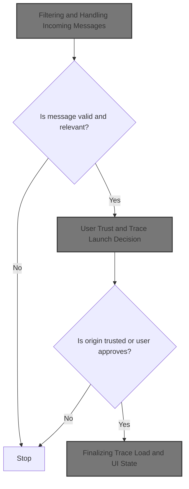

This document describes how the application processes requests to open trace files sent via messages. Incoming messages are validated and checked for trust. If needed, the user is prompted to approve the request. Once approved, the trace data is loaded and made available for analysis in the UI, supporting workflows where traces are shared or opened programmatically.



# Filtering and Handling Incoming Messages

```mermaid
%%{init: {"flowchart": {"defaultRenderer": "elk"}} }%%
flowchart TD
  node1["Receive message to open trace"] --> node2{"Is message valid and relevant?"}
  click node1 openCode "ui/src/frontend/post_message_handler.ts:131:296"
  node2 -->|"No"| node4["Do not open trace"]
  click node2 openCode "ui/src/frontend/post_message_handler.ts:131:296"
  node2 -->|"Yes"| node3{"Is origin trusted?"}
  click node3 openCode "ui/src/frontend/post_message_handler.ts:261:265"
  node3 -->|"Yes"| node5["Serializing Trace Loading and State Preparation"]
  
  node3 -->|"No"| node6["Prompt user: Approve opening trace from this origin?"]
  click node6 openCode "ui/src/frontend/post_message_handler.ts:274:295"
  node6 -->|"User approves"| node5
  node6 -->|"User rejects"| node4
  click node4 openCode "ui/src/frontend/post_message_handler.ts:131:296"
classDef HeadingStyle fill:#777777,stroke:#333,stroke-width:2px;
click node5 goToHeading "Preparing Trace Data for Loading"
node5:::HeadingStyle
click node5 goToHeading "Serializing Trace Loading and State Preparation"
node5:::HeadingStyle

%% Swimm:
%% %%{init: {"flowchart": {"defaultRenderer": "elk"}} }%%
%% flowchart TD
%%   node1["Receive message to open trace"] --> node2{"Is message valid and relevant?"}
%%   click node1 openCode "<SwmPath>[ui/…/frontend/post_message_handler.ts](ui/src/frontend/post_message_handler.ts)</SwmPath>:131:296"
%%   node2 -->|"No"| node4["Do not open trace"]
%%   click node2 openCode "<SwmPath>[ui/…/frontend/post_message_handler.ts](ui/src/frontend/post_message_handler.ts)</SwmPath>:131:296"
%%   node2 -->|"Yes"| node3{"Is origin trusted?"}
%%   click node3 openCode "<SwmPath>[ui/…/frontend/post_message_handler.ts](ui/src/frontend/post_message_handler.ts)</SwmPath>:261:265"
%%   node3 -->|"Yes"| node5["Serializing Trace Loading and State Preparation"]
%%   
%%   node3 -->|"No"| node6["Prompt user: Approve opening trace from this origin?"]
%%   click node6 openCode "<SwmPath>[ui/…/frontend/post_message_handler.ts](ui/src/frontend/post_message_handler.ts)</SwmPath>:274:295"
%%   node6 -->|"User approves"| node5
%%   node6 -->|"User rejects"| node4
%%   click node4 openCode "<SwmPath>[ui/…/frontend/post_message_handler.ts](ui/src/frontend/post_message_handler.ts)</SwmPath>:131:296"
%% classDef HeadingStyle fill:#777777,stroke:#333,stroke-width:2px;
%% click node5 goToHeading "Preparing Trace Data for Loading"
%% node5:::HeadingStyle
%% click node5 goToHeading "Serializing Trace Loading and State Preparation"
%% node5:::HeadingStyle
```



<SwmSnippet path="/ui/src/frontend/post_message_handler.ts" line="131">

---

In <SwmToken path="ui/src/frontend/post_message_handler.ts" pos="131:4:4" line-data="export function postMessageHandler(messageEvent: MessageEvent) {">`postMessageHandler`</SwmToken> we start by filtering incoming messages based on their origin and source window, ignoring ones from known irrelevant sources or those not coming from trusted windows. We handle control commands like 'PING', <SwmToken path="ui/src/frontend/post_message_handler.ts" pos="185:11:13" line-data="  if (messageEvent.data === &#39;SHOW-HELP&#39;) {">`SHOW-HELP`</SwmToken>, and <SwmToken path="ui/src/frontend/post_message_handler.ts" pos="190:11:15" line-data="  if (messageEvent.data === &#39;RELOAD-CSS-CONSTANTS&#39;) {">`RELOAD-CSS-CONSTANTS`</SwmToken> directly, and for trace data, we sanitize and validate it before proceeding. If a trace is posted, we remove the event listener to avoid duplicate loads and then move on to opening the trace, which requires calling into <SwmToken path="ui/src/frontend/post_message_handler.ts" pos="253:1:1" line-data="    AppImpl.instance.openTraceFromBuffer(postedTrace, appState);">`AppImpl`</SwmToken> logic next to actually process and display the trace.

```typescript
export function postMessageHandler(messageEvent: MessageEvent) {
  if (shouldGracefullyIgnoreMessage(messageEvent)) {
    // This message should not be handled in this handler,
    // because it will be handled elsewhere.
    return;
  }

  if (messageEvent.origin === 'https://tagassistant.google.com') {
    // The GA debugger, does a window.open() and sends messages to the GA
    // script. Ignore them.
    return;
  }

  if (document.readyState !== 'complete') {
    console.error('Ignoring message - document not ready yet.');
    return;
  }

  const fromOpener = messageEvent.source === window.opener;
  const fromIframeHost = messageEvent.source === window.parent;
  // This adds support for the folowing flow:
  // * A (page that whats to open a trace in perfetto) opens B
  // * B (does something to get the traceBuffer)
  // * A is navigated to Perfetto UI
  // * B sends the traceBuffer to A
  // * closes itself
  const fromOpenee = (messageEvent.source as WindowProxy).opener === window;

  if (
    messageEvent.source === null ||
    !(fromOpener || fromIframeHost || fromOpenee)
  ) {
    // This can happen if an extension tries to postMessage.
    return;
  }

  if (!('data' in messageEvent)) {
    throw new Error('Incoming message has no data property');
  }

  if (messageEvent.data === 'PING') {
    // Cross-origin messaging means we can't read |messageEvent.source|, but
    // it still needs to be of the correct type to be able to invoke the
    // correct version of postMessage(...).
    const windowSource = messageEvent.source as Window;

    // Use '*' for the reply because in cases of cross-domain isolation, we
    // see the messageEvent.origin as 'null'. PONG doen't disclose any
    // interesting information, so there is no harm sending that to the wrong
    // origin in the worst case.
    windowSource.postMessage('PONG', '*');
    return;
  }

  if (messageEvent.data === 'SHOW-HELP') {
    toggleHelp();
    return;
  }

  if (messageEvent.data === 'RELOAD-CSS-CONSTANTS') {
    initCssConstants();
    return;
  }

  let postedScrollToRange: PostedScrollToRange;
  if (isPostedScrollToRange(messageEvent.data)) {
    postedScrollToRange = messageEvent.data.perfetto;
    scrollToTimeRange(postedScrollToRange);
    return;
  }

  let postedTrace: PostedTrace;
  let keepApiOpen = false;
  if (isPostedTraceWrapped(messageEvent.data)) {
    postedTrace = sanitizePostedTrace(messageEvent.data.perfetto);
    if (postedTrace.keepApiOpen) {
      keepApiOpen = true;
    }
  } else if (messageEvent.data instanceof ArrayBuffer) {
    postedTrace = {title: 'External trace', buffer: messageEvent.data};
  } else {
    console.warn(
      'Unknown postMessage() event received. If you are trying to open a ' +
        'trace via postMessage(), this is a bug in your code. If not, this ' +
        'could be due to some Chrome extension.',
    );
    console.log('origin:', messageEvent.origin, 'data:', messageEvent.data);
    return;
  }

  if (postedTrace.buffer.byteLength === 0) {
    throw new Error('Incoming message trace buffer is empty');
  }

  if (!keepApiOpen) {
    /* Removing this event listener to avoid callers posting the trace multiple
     * times. If the callers add an event listener which upon receiving 'PONG'
     * posts the trace to ui.perfetto.dev, the callers can receive multiple
     * 'PONG' messages and accidentally post the trace multiple times. This was
     * part of the cause of b/182502595.
     */
    window.removeEventListener('message', postMessageHandler);
  }

  const openTrace = async () => {
    // Maybe load the app state from the URL.
    let appState: SerializedAppState | undefined;
    if (postedTrace.appStateHash) {
      const url = `https://storage.googleapis.com/${BUCKET_NAME}/${postedTrace.appStateHash}`;
      const response = await fetch(url);
      if (!response.ok) {
        throw new Error(
          `Failed to fetch app state from ${url}: ` +
            `${response.status} ${response.statusText}`,
        );
      }
      const json = (await response.json()).appState;
      const parsedState = parseAppState(json);
      if (parsedState.ok) {
        appState = parsedState.value;
      }
    }
    AppImpl.instance.openTraceFromBuffer(postedTrace, appState);
  };

```

---

</SwmSnippet>

## Preparing Trace Data for Loading

<SwmSnippet path="/ui/src/core/app_impl.ts" line="216">

---

<SwmToken path="ui/src/core/app_impl.ts" pos="216:1:1" line-data="  openTraceFromBuffer(">`openTraceFromBuffer`</SwmToken> packages the trace and state, then hands off to the main loader to start the actual trace loading.

```typescript
  openTraceFromBuffer(
    args: OpenTraceArrayBufArgs,
    serializedAppState?: SerializedAppState,
  ) {
    return this.openTrace({...args, type: 'ARRAY_BUFFER', serializedAppState});
  }
```

---

</SwmSnippet>

## Serializing Trace Loading and State Preparation

<SwmSnippet path="/ui/src/core/app_impl.ts" line="227">

---

In <SwmToken path="ui/src/core/app_impl.ts" pos="227:5:5" line-data="  private async openTrace(src: TraceSource): Promise&lt;TraceImpl&gt; {">`openTrace`</SwmToken>, we prep the buffer, serialize the loading, and then call into the trace loader to start parsing and state setup.

```typescript
  private async openTrace(src: TraceSource): Promise<TraceImpl> {
    if (src.type === 'ARRAY_BUFFER' && src.buffer instanceof Uint8Array) {
      // Even though the type of `buffer` is ArrayBuffer, it's possible to
      // accidentally pass a Uint8Array here, because the interface of
      // Uint8Array is compatible with ArrayBuffer. That can cause subtle bugs
      // in TraceStream when creating chunks out of it (see b/390473162).
      // So if we get a Uint8Array in input, convert it into an actual
      // ArrayBuffer, as various parts of the codebase assume that this is a
      // pure ArrayBuffer, and not a logical view of it with a byteOffset > 0.
      if (
        src.buffer.byteOffset === 0 &&
        src.buffer.byteLength === src.buffer.buffer.byteLength
      ) {
        src = {...src, buffer: src.buffer.buffer};
      } else {
        src = {...src, buffer: src.buffer.slice().buffer};
      }
    }

    const result = defer<TraceImpl>();

    // Rationale for asyncLimiter: openTrace takes several seconds and involves
    // a long sequence of async tasks (e.g. invoking plugins' onLoad()). These
    // tasks cannot overlap if the user opens traces in rapid succession, as
    // they will mess up the state of registries. So once we start, we must
    // complete trace loading (we don't bother supporting cancellations. If the
    // user is too bothered, they can reload the tab).
    await this.openTraceAsyncLimiter.schedule(async () => {
      // Wait for extras parsing descriptors to be loaded
      // via is_internal_user.js. This prevents a race condition where
      // trace loading would otherwise begin before this data is available.
      await this.extraLoadingPromise;
      this.closeCurrentTrace();
      this.isLoadingTrace = true;
      try {
        // loadTrace() in trace_loader.ts will do the following:
        // - Create a new engine.
        // - Pump the data from the TraceSource into the engine.
        // - Do the initial queries to build the TraceImpl object
        // - Call AppImpl.setActiveTrace(TraceImpl)
        // - Continue with the trace loading logic (track decider, plugins, etc)
        // - Resolve the promise when everything is done.
        const trace = await loadTrace(this, src);
```

---

</SwmSnippet>

### Engine Creation and Trace Loading Entry

<SwmSnippet path="/ui/src/core/load_trace.ts" line="126">

---

<SwmToken path="ui/src/core/load_trace.ts" pos="126:6:6" line-data="export async function loadTrace(">`loadTrace`</SwmToken> sets up a new engine instance for the trace, updates the UI status, and then hands off to <SwmToken path="ui/src/core/load_trace.ts" pos="133:5:5" line-data="  return await loadTraceIntoEngine(app, traceSource, engine);">`loadTraceIntoEngine`</SwmToken> to actually stream and parse the trace data.

```typescript
export async function loadTrace(
  app: AppImpl,
  traceSource: TraceSource,
): Promise<TraceImpl> {
  updateStatus(app, 'Opening trace');
  const engineId = `${++lastEngineId}`;
  const engine = await createEngine(app, engineId);
  return await loadTraceIntoEngine(app, traceSource, engine);
}
```

---

</SwmSnippet>

### Streaming and Parsing Trace Data

```mermaid
%%{init: {"flowchart": {"defaultRenderer": "elk"}} }%%
flowchart TD
  node1["Begin trace loading"] --> node2{"What is the trace source type?"}
  click node1 openCode "ui/src/core/load_trace.ts:177:182"
  node2 -->|"File/Buffer/URL/Stream/Multiple Files"| node3["Create trace stream"]
  click node2 openCode "ui/src/core/load_trace.ts:184:198"
  node2 -->|"HTTP RPC"| node4["Restore engine state"]
  click node3 openCode "ui/src/core/load_trace.ts:184:198"
  click node4 openCode "ui/src/core/load_trace.ts:224:225"
  node3 --> node5{"Is trace stream available?"}
  node5 -->|"Yes"| node6["Load and parse trace data"]
  click node5 openCode "ui/src/core/load_trace.ts:205:221"
  click node6 openCode "ui/src/core/load_trace.ts:207:221"
  node5 -->|"No"| node4
  node6 --> node7["Notify engine of end of trace"]
  click node7 openCode "ui/src/core/load_trace.ts:222"
  node7 --> node8["Register extra SQL packages"]
  node4 --> node8
  subgraph loop1["For each extra SQL package"]
    node8 --> node9["Register SQL package"]
    click node9 openCode "ui/src/core/load_trace.ts:227:229"
    node9 --> node8
  end
  node8 --> node10["Get trace details and create trace object"]
  click node10 openCode "ui/src/core/load_trace.ts:231:232"
  node10 --> node11["Set active trace in app"]
  click node11 openCode "ui/src/core/load_trace.ts:233"
  node11 --> node12["Compute and update visible time"]
  click node12 openCode "ui/src/core/load_trace.ts:235:242"
  node12 --> node13{"Is there saved app state?"}
  node13 -->|"Yes"| node14["Restore saved state (phase 1)"]
  click node14 openCode "ui/src/core/load_trace.ts:269:270"
  node13 -->|"No"| node15["Continue loading"]
  node14 --> node15
  node15 --> node16["Run plugins on trace load"]
  click node16 openCode "ui/src/core/load_trace.ts:272:274"
  node16 --> node17["Decide which tabs to show"]
  click node17 openCode "ui/src/core/load_trace.ts:276"
  node17 --> node18["Load minimap"]
  click node18 openCode "ui/src/core/load_trace.ts:279"
  node18 --> node19{"Is trace type JSON and reliable range enabled?"}
  node19 -->|"No"| node20["Continue"]
  node19 -->|"Yes"| node21["Add reliable range note"]
  click node21 openCode "ui/src/core/load_trace.ts:287:294"
  node21 --> node20
  node20 --> node22["Notify trace ready"]
  click node22 openCode "ui/src/core/load_trace.ts:298"
  node22 --> node23{"Is there saved app state (phase 2)?"}
  node23 -->|"Yes"| node24["Restore saved state (phase 2)"]
  click node24 openCode "ui/src/core/load_trace.ts:305"
  node23 -->|"No"| node25["Continue"]
  node24 --> node25
  node25 --> node26["Execute startup commands"]
  subgraph loop2["For each startup command"]
    node26 --> node27["Run startup command"]
    click node27 openCode "ui/src/core/load_trace.ts:344:356"
    node27 --> node26
  end
  node26 --> node28["Finish loading and enable user interaction"]
  click node28 openCode "ui/src/core/load_trace.ts:363"

classDef HeadingStyle fill:#777777,stroke:#333,stroke-width:2px;

%% Swimm:
%% %%{init: {"flowchart": {"defaultRenderer": "elk"}} }%%
%% flowchart TD
%%   node1["Begin trace loading"] --> node2{"What is the trace source type?"}
%%   click node1 openCode "<SwmPath>[ui/…/core/load_trace.ts](ui/src/core/load_trace.ts)</SwmPath>:177:182"
%%   node2 -->|"File/Buffer/URL/Stream/Multiple Files"| node3["Create trace stream"]
%%   click node2 openCode "<SwmPath>[ui/…/core/load_trace.ts](ui/src/core/load_trace.ts)</SwmPath>:184:198"
%%   node2 -->|"HTTP RPC"| node4["Restore engine state"]
%%   click node3 openCode "<SwmPath>[ui/…/core/load_trace.ts](ui/src/core/load_trace.ts)</SwmPath>:184:198"
%%   click node4 openCode "<SwmPath>[ui/…/core/load_trace.ts](ui/src/core/load_trace.ts)</SwmPath>:224:225"
%%   node3 --> node5{"Is trace stream available?"}
%%   node5 -->|"Yes"| node6["Load and parse trace data"]
%%   click node5 openCode "<SwmPath>[ui/…/core/load_trace.ts](ui/src/core/load_trace.ts)</SwmPath>:205:221"
%%   click node6 openCode "<SwmPath>[ui/…/core/load_trace.ts](ui/src/core/load_trace.ts)</SwmPath>:207:221"
%%   node5 -->|"No"| node4
%%   node6 --> node7["Notify engine of end of trace"]
%%   click node7 openCode "<SwmPath>[ui/…/core/load_trace.ts](ui/src/core/load_trace.ts)</SwmPath>:222"
%%   node7 --> node8["Register extra SQL packages"]
%%   node4 --> node8
%%   subgraph loop1["For each extra SQL package"]
%%     node8 --> node9["Register SQL package"]
%%     click node9 openCode "<SwmPath>[ui/…/core/load_trace.ts](ui/src/core/load_trace.ts)</SwmPath>:227:229"
%%     node9 --> node8
%%   end
%%   node8 --> node10["Get trace details and create trace object"]
%%   click node10 openCode "<SwmPath>[ui/…/core/load_trace.ts](ui/src/core/load_trace.ts)</SwmPath>:231:232"
%%   node10 --> node11["Set active trace in app"]
%%   click node11 openCode "<SwmPath>[ui/…/core/load_trace.ts](ui/src/core/load_trace.ts)</SwmPath>:233"
%%   node11 --> node12["Compute and update visible time"]
%%   click node12 openCode "<SwmPath>[ui/…/core/load_trace.ts](ui/src/core/load_trace.ts)</SwmPath>:235:242"
%%   node12 --> node13{"Is there saved app state?"}
%%   node13 -->|"Yes"| node14["Restore saved state (phase 1)"]
%%   click node14 openCode "<SwmPath>[ui/…/core/load_trace.ts](ui/src/core/load_trace.ts)</SwmPath>:269:270"
%%   node13 -->|"No"| node15["Continue loading"]
%%   node14 --> node15
%%   node15 --> node16["Run plugins on trace load"]
%%   click node16 openCode "<SwmPath>[ui/…/core/load_trace.ts](ui/src/core/load_trace.ts)</SwmPath>:272:274"
%%   node16 --> node17["Decide which tabs to show"]
%%   click node17 openCode "<SwmPath>[ui/…/core/load_trace.ts](ui/src/core/load_trace.ts)</SwmPath>:276"
%%   node17 --> node18["Load minimap"]
%%   click node18 openCode "<SwmPath>[ui/…/core/load_trace.ts](ui/src/core/load_trace.ts)</SwmPath>:279"
%%   node18 --> node19{"Is trace type JSON and reliable range enabled?"}
%%   node19 -->|"No"| node20["Continue"]
%%   node19 -->|"Yes"| node21["Add reliable range note"]
%%   click node21 openCode "<SwmPath>[ui/…/core/load_trace.ts](ui/src/core/load_trace.ts)</SwmPath>:287:294"
%%   node21 --> node20
%%   node20 --> node22["Notify trace ready"]
%%   click node22 openCode "<SwmPath>[ui/…/core/load_trace.ts](ui/src/core/load_trace.ts)</SwmPath>:298"
%%   node22 --> node23{"Is there saved app state (phase 2)?"}
%%   node23 -->|"Yes"| node24["Restore saved state (phase 2)"]
%%   click node24 openCode "<SwmPath>[ui/…/core/load_trace.ts](ui/src/core/load_trace.ts)</SwmPath>:305"
%%   node23 -->|"No"| node25["Continue"]
%%   node24 --> node25
%%   node25 --> node26["Execute startup commands"]
%%   subgraph loop2["For each startup command"]
%%     node26 --> node27["Run startup command"]
%%     click node27 openCode "<SwmPath>[ui/…/core/load_trace.ts](ui/src/core/load_trace.ts)</SwmPath>:344:356"
%%     node27 --> node26
%%   end
%%   node26 --> node28["Finish loading and enable user interaction"]
%%   click node28 openCode "<SwmPath>[ui/…/core/load_trace.ts](ui/src/core/load_trace.ts)</SwmPath>:363"
%% 
%% classDef HeadingStyle fill:#777777,stroke:#333,stroke-width:2px;
```



<SwmSnippet path="/ui/src/core/load_trace.ts" line="177">

---

In <SwmToken path="ui/src/core/load_trace.ts" pos="177:4:4" line-data="async function loadTraceIntoEngine(">`loadTraceIntoEngine`</SwmToken>, we pick the right <SwmToken path="ui/src/core/load_trace.ts" pos="182:6:6" line-data="  let traceStream: TraceStream | undefined;">`TraceStream`</SwmToken> based on the source type, then start reading and parsing chunks with the engine, updating progress as we go. For <SwmToken path="ui/src/core/load_trace.ts" pos="192:15:15" line-data="  } else if (traceSource.type === &#39;HTTP_RPC&#39;) {">`HTTP_RPC`</SwmToken>, we skip streaming and just restore tables since the trace is already loaded.

```typescript
async function loadTraceIntoEngine(
  app: AppImpl,
  traceSource: TraceSource,
  engine: EngineBase,
): Promise<TraceImpl> {
  let traceStream: TraceStream | undefined;
  const serializedAppState = traceSource.serializedAppState;
  if (traceSource.type === 'FILE') {
    traceStream = new TraceFileStream(traceSource.file);
  } else if (traceSource.type === 'ARRAY_BUFFER') {
    traceStream = new TraceBufferStream(traceSource.buffer);
  } else if (traceSource.type === 'URL') {
    traceStream = new TraceHttpStream(traceSource.url);
  } else if (traceSource.type === 'STREAM') {
    traceStream = traceSource.stream;
  } else if (traceSource.type === 'HTTP_RPC') {
    traceStream = undefined;
  } else if (traceSource.type === 'MULTIPLE_FILES') {
    traceStream = new TraceMultipleFilesStream(traceSource.files);
  } else {
    throw new Error(`Unknown source: ${JSON.stringify(traceSource)}`);
  }

  // |traceStream| can be undefined in the case when we are using the external
  // HTTP+RPC endpoint and the trace processor instance has already loaded
  // a trace (because it was passed as a cmdline argument to
  // trace_processor_shell). In this case we don't want the UI to load any
  // file/stream and we just want to jump to the loading phase.
  if (traceStream !== undefined) {
    const tStart = performance.now();
    for (;;) {
      const res = await traceStream.readChunk();
      await engine.parse(res.data);
      const elapsed = (performance.now() - tStart) / 1000;
      let status = 'Loading trace ';
      if (res.bytesTotal > 0) {
        const progress = Math.round((res.bytesRead / res.bytesTotal) * 100);
        status += `${progress}%`;
      } else {
        status += `${Math.round(res.bytesRead / 1e6)} MB`;
      }
      status += ` - ${Math.ceil(res.bytesRead / elapsed / 1e6)} MB/s`;
      updateStatus(app, status);
      if (res.eof) break;
    }
```

---

</SwmSnippet>

<SwmSnippet path="/ui/src/core/load_trace.ts" line="222">

---

After parsing all chunks, we notify the engine of EOF to wrap up parsing. For <SwmToken path="ui/src/core/load_trace.ts" pos="192:15:15" line-data="  } else if (traceSource.type === &#39;HTTP_RPC&#39;) {">`HTTP_RPC`</SwmToken>, we restore tables instead. Then we register any extra SQL packages needed for plugins or UI features.

```typescript
    await engine.notifyEof();
  } else {
    assertTrue(engine instanceof HttpRpcEngine);
    await engine.restoreInitialTables();
  }
  for (const p of app.extraSqlPackages) {
    await engine.registerSqlPackages(p);
  }
```

---

</SwmSnippet>

<SwmSnippet path="/ui/src/core/load_trace.ts" line="231">

---

After trace parsing, we set up the active trace, update the UI route to preserve navigation, restore app state in two steps, run plugins, and finally execute startup commands from both URL and user settings, enforcing an allowlist if needed. Errors in commands are logged but don't block the flow.

```typescript
  const traceDetails = await getTraceInfo(engine, app, traceSource);
  const trace = new TraceImpl(app, engine, traceDetails);
  app.setActiveTrace(trace);

  const visibleTimeSpan = await computeVisibleTime(
    traceDetails.start,
    traceDetails.end,
    trace.traceInfo.traceType === 'json',
    engine,
  );

  trace.timeline.updateVisibleTime(visibleTimeSpan);

  const cacheUuid = traceDetails.cached ? traceDetails.uuid : '';

  // Attempt to preserve the existing page, only add/change the local_cache_key.
  //
  // This is so that if the user opens a trace from a URL or has navigated to a
  // page before opening a trace, we stay on that page. This allows links to
  // e.g. #!/explore to work as expected.
  //
  // Only navigate to the timeline page if we are currently on the home page.
  const route = Router.parseUrl(window.location.href);

  let nextPage = route.page;
  if (route.page === '/' || route.page === '') {
    // Currently on the home page, navigate to the timeline page.
    nextPage = '/viewer';
  }

  Router.navigate(`#!${nextPage}${route.subpage}?local_cache_key=${cacheUuid}`);

  // Make sure the helper views are available before we start adding tracks.
  await includeSummaryTables(trace);

  await defineMaxLayoutDepthSqlFunction(engine);

  if (serializedAppState !== undefined) {
    deserializeAppStatePhase1(serializedAppState, trace);
  }

  await app.plugins.onTraceLoad(trace, (id) => {
    updateStatus(app, `Running plugin: ${id}`);
  });

  decideTabs(trace);

  updateStatus(app, `Loading minimap`);
  await trace.minimap.load(traceDetails.start, traceDetails.end);

  // Trace Processor doesn't support the reliable range feature for JSON
  // traces.
  if (
    trace.traceInfo.traceType !== 'json' &&
    ENABLE_CHROME_RELIABLE_RANGE_ANNOTATION_FLAG.get()
  ) {
    const reliableRangeStart = await computeTraceReliableRangeStart(engine);
    if (reliableRangeStart > 0) {
      trace.notes.addNote({
        timestamp: reliableRangeStart,
        color: '#ff0000',
        text: 'Reliable Range Start',
      });
    }
  }

  // notify() will await that all listeners' promises have resolved.
  await trace.onTraceReady.notify();

  if (serializedAppState !== undefined) {
    // Wait that plugins have completed their actions and then proceed with
    // the final phase of app state restore.
    // TODO(primiano): this can probably be removed once we refactor tracks
    // to be URI based and can deal with non-existing URIs.
    deserializeAppStatePhase2(serializedAppState, trace);
  }

  // Execute startup commands as the final step - simulates user actions
  // after the trace is fully loaded and any saved state has been restored.
  // This ensures startup commands see the complete, final state of the trace.

  // CRITICAL ORDER: URL commands MUST execute before settings commands!
  // This ordering has subtle but important implications:
  // - URL commands are trace-specific and should establish initial state
  // - Settings commands are user preferences that should override URL defaults
  // - Changing this order could break trace sharing and user customization
  // DO NOT REORDER without understanding the full impact!
  const urlCommands =
    parseUrlCommands(app.initialRouteArgs.startupCommands) ?? [];
  const settingsCommands = app.startupCommandsSetting.get();

  // Combine URL and settings commands - runtime allowlist checking will handle filtering
  const allStartupCommands = [...urlCommands, ...settingsCommands];
  const enforceAllowlist = app.enforceStartupCommandAllowlistSetting.get();

  if (allStartupCommands.length > 0) {
    updateStatus(app, 'Running startup commands');
    using _ = trace.omnibox.disablePrompts();

    // Execute startup commands in trace context after everything is ready.
    // This simulates user actions taken after trace load is complete,
    // including any saved app state restoration. At this point:
    // - All plugins have loaded and registered their commands
    // - Trace data is fully accessible
    // - UI state has been restored from any saved workspace
    // - Commands can safely query trace data and modify UI state

    // Set allowlist checking during startup if enforcement enabled
    if (enforceAllowlist) {
      app.commands.setAllowlistCheck(isStartupCommandAllowed);
    }

    try {
      for (const command of allStartupCommands) {
        try {
          // Execute through proxy to access both global and trace-specific
          // commands.
          await app.commands.runCommand(command.id, ...command.args);
        } catch (error) {
          // TODO(stevegolton): Add a mechanism to notify users of startup
          // command errors. This will involve creating a notification UX
          // similar to VSCode where there are popups on the bottom right
          // of the UI.
          console.warn(`Startup command ${command.id} failed:`, error);
        }
      }
```

---

</SwmSnippet>

<SwmSnippet path="/ui/src/core/load_trace.ts" line="357">

---

After all startup commands finish (with errors logged but not blocking), we return the <SwmToken path="ui/src/core/app_impl.ts" pos="227:16:16" line-data="  private async openTrace(src: TraceSource): Promise&lt;TraceImpl&gt; {">`TraceImpl`</SwmToken> object, which is now ready for use in the app.

```typescript
    } finally {
      // Always restore default (allow all) behavior when done
      app.commands.setAllowlistCheck(() => true);
    }
  }

  return trace;
}
```

---

</SwmSnippet>

### Finalizing Trace Load and UI State

```mermaid
%%{init: {"flowchart": {"defaultRenderer": "elk"}} }%%
flowchart TD
  node1["Reset search box in UI (no focus)"] --> node2["Load and set active trace"]
  click node1 openCode "ui/src/core/app_impl.ts:270:270"
  click node2 openCode "ui/src/core/app_impl.ts:271:275"
  node2 --> node3{"Did loading succeed?"}
  click node3 openCode "ui/src/core/app_impl.ts:277:279"
  node3 -->|"Yes"| node4["Resolve with loaded trace"]
  click node4 openCode "ui/src/core/app_impl.ts:277:277"
  node3 -->|"No"| node5["Reject with error"]
  click node5 openCode "ui/src/core/app_impl.ts:279:279"
  node4 --> node6["Set isLoadingTrace to false and redraw UI"]
  node5 --> node6
  click node6 openCode "ui/src/core/app_impl.ts:281:283"

classDef HeadingStyle fill:#777777,stroke:#333,stroke-width:2px;

%% Swimm:
%% %%{init: {"flowchart": {"defaultRenderer": "elk"}} }%%
%% flowchart TD
%%   node1["Reset search box in UI (no focus)"] --> node2["Load and set active trace"]
%%   click node1 openCode "<SwmPath>[ui/…/core/app_impl.ts](ui/src/core/app_impl.ts)</SwmPath>:270:270"
%%   click node2 openCode "<SwmPath>[ui/…/core/app_impl.ts](ui/src/core/app_impl.ts)</SwmPath>:271:275"
%%   node2 --> node3{"Did loading succeed?"}
%%   click node3 openCode "<SwmPath>[ui/…/core/app_impl.ts](ui/src/core/app_impl.ts)</SwmPath>:277:279"
%%   node3 -->|"Yes"| node4["Resolve with loaded trace"]
%%   click node4 openCode "<SwmPath>[ui/…/core/app_impl.ts](ui/src/core/app_impl.ts)</SwmPath>:277:277"
%%   node3 -->|"No"| node5["Reject with error"]
%%   click node5 openCode "<SwmPath>[ui/…/core/app_impl.ts](ui/src/core/app_impl.ts)</SwmPath>:279:279"
%%   node4 --> node6["Set <SwmToken path="ui/src/core/app_impl.ts" pos="260:3:3" line-data="      this.isLoadingTrace = true;">`isLoadingTrace`</SwmToken> to false and redraw UI"]
%%   node5 --> node6
%%   click node6 openCode "<SwmPath>[ui/…/core/app_impl.ts](ui/src/core/app_impl.ts)</SwmPath>:281:283"
%% 
%% classDef HeadingStyle fill:#777777,stroke:#333,stroke-width:2px;
```



<SwmSnippet path="/ui/src/core/app_impl.ts" line="270">

---

After loading, we reset UI state, resolve the result, and redraw so the user sees the new trace.

```typescript
        this.omnibox.reset(/* focus= */ false);
        // loadTrace() internally will call setActiveTrace() and change our
        // _currentTrace in the middle of its ececution. We cannot wait for
        // loadTrace to be finished before setting it because some internal
        // implementation details of loadTrace() rely on that trace to be current
        // to work properly (mainly the router hash uuid).

        result.resolve(trace);
      } catch (error) {
        result.reject(error);
      } finally {
        this.isLoadingTrace = false;
        raf.scheduleFullRedraw();
      }
    });

    return result;
  }
```

---

</SwmSnippet>

## User Trust and Trace Launch Decision

```mermaid
%%{init: {"flowchart": {"defaultRenderer": "elk"}} }%%
flowchart TD
    node1["Receive trace open request"] --> node2{"Is origin trusted?"}
    click node1 openCode "ui/src/frontend/post_message_handler.ts:256:296"
    node2 -->|"Yes"| node3["Open trace immediately"]
    click node2 openCode "ui/src/frontend/post_message_handler.ts:262:265"
    click node3 openCode "ui/src/frontend/post_message_handler.ts:263:263"
    node2 -->|"No"| node4{"Is origin unknown ('null')?"}
    click node4 openCode "ui/src/frontend/post_message_handler.ts:270:273"
    node4 -->|"Yes"| node5["Prompt user: Unknown origin"]
    node4 -->|"No"| node6["Prompt user: Known origin"]
    click node5 openCode "ui/src/frontend/post_message_handler.ts:274:295"
    click node6 openCode "ui/src/frontend/post_message_handler.ts:274:295"
    node5 --> node7{"User choice"}
    node6 --> node8{"User choice"}
    node7 -->|"No"| node9["Cancel"]
    node7 -->|"Yes"| node10["Open trace"]
    click node9 openCode "ui/src/frontend/post_message_handler.ts:282:282"
    click node10 openCode "ui/src/frontend/post_message_handler.ts:287:287"
    node8 -->|"No"| node9
    node8 -->|"Yes"| node10
    node8 -->|"Always trust"| node11["Save origin as trusted and open trace"]
    click node11 openCode "ui/src/frontend/post_message_handler.ts:257:258"

classDef HeadingStyle fill:#777777,stroke:#333,stroke-width:2px;

%% Swimm:
%% %%{init: {"flowchart": {"defaultRenderer": "elk"}} }%%
%% flowchart TD
%%     node1["Receive trace open request"] --> node2{"Is origin trusted?"}
%%     click node1 openCode "<SwmPath>[ui/…/frontend/post_message_handler.ts](ui/src/frontend/post_message_handler.ts)</SwmPath>:256:296"
%%     node2 -->|"Yes"| node3["Open trace immediately"]
%%     click node2 openCode "<SwmPath>[ui/…/frontend/post_message_handler.ts](ui/src/frontend/post_message_handler.ts)</SwmPath>:262:265"
%%     click node3 openCode "<SwmPath>[ui/…/frontend/post_message_handler.ts](ui/src/frontend/post_message_handler.ts)</SwmPath>:263:263"
%%     node2 -->|"No"| node4{"Is origin unknown ('null')?"}
%%     click node4 openCode "<SwmPath>[ui/…/frontend/post_message_handler.ts](ui/src/frontend/post_message_handler.ts)</SwmPath>:270:273"
%%     node4 -->|"Yes"| node5["Prompt user: Unknown origin"]
%%     node4 -->|"No"| node6["Prompt user: Known origin"]
%%     click node5 openCode "<SwmPath>[ui/…/frontend/post_message_handler.ts](ui/src/frontend/post_message_handler.ts)</SwmPath>:274:295"
%%     click node6 openCode "<SwmPath>[ui/…/frontend/post_message_handler.ts](ui/src/frontend/post_message_handler.ts)</SwmPath>:274:295"
%%     node5 --> node7{"User choice"}
%%     node6 --> node8{"User choice"}
%%     node7 -->|"No"| node9["Cancel"]
%%     node7 -->|"Yes"| node10["Open trace"]
%%     click node9 openCode "<SwmPath>[ui/…/frontend/post_message_handler.ts](ui/src/frontend/post_message_handler.ts)</SwmPath>:282:282"
%%     click node10 openCode "<SwmPath>[ui/…/frontend/post_message_handler.ts](ui/src/frontend/post_message_handler.ts)</SwmPath>:287:287"
%%     node8 -->|"No"| node9
%%     node8 -->|"Yes"| node10
%%     node8 -->|"Always trust"| node11["Save origin as trusted and open trace"]
%%     click node11 openCode "<SwmPath>[ui/…/frontend/post_message_handler.ts](ui/src/frontend/post_message_handler.ts)</SwmPath>:257:258"
%% 
%% classDef HeadingStyle fill:#777777,stroke:#333,stroke-width:2px;
```



<SwmSnippet path="/ui/src/frontend/post_message_handler.ts" line="256">

---

In <SwmToken path="ui/src/frontend/post_message_handler.ts" pos="258:1:1" line-data="    openTrace();">`openTrace`</SwmToken>, we optionally fetch and parse app state from a remote bucket if a hash is provided, then call the global <SwmToken path="ui/src/frontend/post_message_handler.ts" pos="253:1:1" line-data="    AppImpl.instance.openTraceFromBuffer(postedTrace, appState);">`AppImpl`</SwmToken> instance to open the trace with this state. This ties the posted trace data to the main app logic for display and interaction.

```typescript
  const trustAndOpenTrace = () => {
    saveUserTrustedOrigin(messageEvent.origin);
    openTrace();
  };

  // If the origin is trusted open the trace directly.
  if (isTrustedOrigin(messageEvent.origin)) {
    openTrace();
    return;
  }

  // If not ask the user if they expect this and trust the origin.
  let originTxt = messageEvent.origin;
  let originUnknown = false;
  if (originTxt === 'null') {
    originTxt = 'An unknown origin';
    originUnknown = true;
  }
  showModal({
    title: 'Open trace?',
    content: m(
      'div',
      m('div', `${originTxt} is trying to open a trace file.`),
      m('div', 'Do you trust the origin and want to proceed?'),
    ),
    buttons: [
      {text: 'No', primary: true},
      {
        text: 'Yes',
        primary: false,
        action: () => {
          openTrace();
        },
      },
    ].concat(
      originUnknown
        ? []
        : {text: 'Always trust', primary: false, action: trustAndOpenTrace},
    ),
  });
}
```

---

</SwmSnippet>

<SwmSnippet path="/ui/src/frontend/post_message_handler.ts" line="235">

---

In <SwmToken path="ui/src/frontend/post_message_handler.ts" pos="235:3:3" line-data="  const openTrace = async () =&gt; {">`openTrace`</SwmToken>, we optionally fetch and parse app state from a remote bucket if a hash is provided, then call the global <SwmToken path="ui/src/frontend/post_message_handler.ts" pos="253:1:1" line-data="    AppImpl.instance.openTraceFromBuffer(postedTrace, appState);">`AppImpl`</SwmToken> instance to open the trace with this state. This ties the posted trace data to the main app logic for display and interaction.

```typescript
  const openTrace = async () => {
    // Maybe load the app state from the URL.
    let appState: SerializedAppState | undefined;
    if (postedTrace.appStateHash) {
      const url = `https://storage.googleapis.com/${BUCKET_NAME}/${postedTrace.appStateHash}`;
      const response = await fetch(url);
      if (!response.ok) {
        throw new Error(
          `Failed to fetch app state from ${url}: ` +
            `${response.status} ${response.statusText}`,
        );
      }
      const json = (await response.json()).appState;
      const parsedState = parseAppState(json);
      if (parsedState.ok) {
        appState = parsedState.value;
      }
    }
    AppImpl.instance.openTraceFromBuffer(postedTrace, appState);
  };
```

---

</SwmSnippet>

&nbsp;

*This is an auto-generated document by Swimm 🌊 and has not yet been verified by a human*

<SwmMeta version="3.0.0" repo-id="Z2l0aHViJTNBJTNBY3BsdXNwbHVzLXBlcmZldHRvJTNBJTNBcmljYXJkb2xvcGV6Zw==" repo-name="cplusplus-perfetto"><sup>Powered by [Swimm](https://app.swimm.io/)</sup></SwmMeta>
