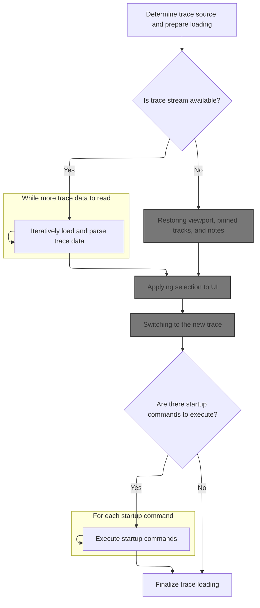
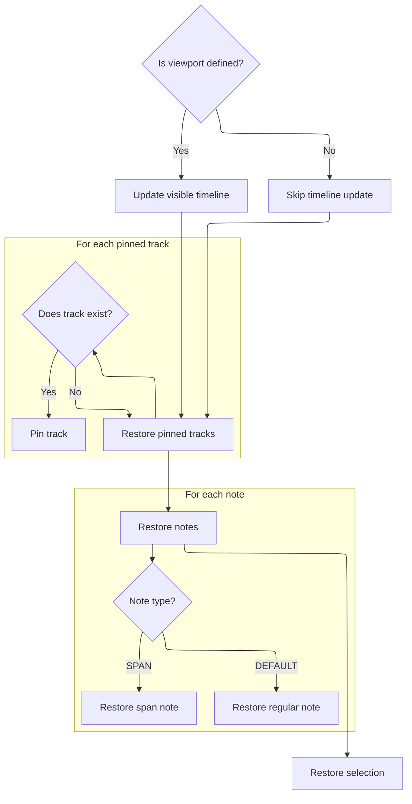

This document describes how the application loads and initializes a new trace for analysis. When a trace is opened from a file, buffer, URL, or stream, the system prepares the input, resets the UI and previous state, loads and parses the trace data, restores saved state, executes startup commands, and updates the UI. The result is a fully initialized trace ready for user interaction.

# Where is this flow used?

This flow is used multiple times in the codebase as represented in the following diagram:

(Note - these are only some of the entry points of this flow)

```mermaid
graph TD;
      47a009bb28468bd248715ec917e8837b1a126907e2ff752f89d3e6e278078226(ui/…/bigtrace/index.ts::main) --> 9da801899ca38d8b30d5a1c08b2d8a45ef97466770974636e7d91ac9692e14f5(ui/…/bigtrace/index.ts::onCssLoaded)

9da801899ca38d8b30d5a1c08b2d8a45ef97466770974636e7d91ac9692e14f5(ui/…/bigtrace/index.ts::onCssLoaded) --> d6a1751f4520c969334266976c264e13155eead8051bbc6b9a56dc7d44df9330(ui/…/bigtrace/index.ts::routeChange)

9da801899ca38d8b30d5a1c08b2d8a45ef97466770974636e7d91ac9692e14f5(ui/…/bigtrace/index.ts::onCssLoaded) --> 44db15a568163e0104544225e5ad572d43d80cea5a874b23ee18b845a0659a31(ui/…/frontend/rpc_http_dialog.ts::checkHttpRpcConnection)

d6a1751f4520c969334266976c264e13155eead8051bbc6b9a56dc7d44df9330(ui/…/bigtrace/index.ts::routeChange) --> 62f31ae162641250ca8ec850093254a04eef8fe489545ec815bad98247976306(ui/…/frontend/trace_url_handler.ts::maybeOpenTraceFromRoute)

62f31ae162641250ca8ec850093254a04eef8fe489545ec815bad98247976306(ui/…/frontend/trace_url_handler.ts::maybeOpenTraceFromRoute) --> 6f37504e78a178dc65bc1392e79a5a654928ae8edb1e0b94ddf571824243e3d9(ui/…/frontend/permalink.ts::loadPermalink)

6f37504e78a178dc65bc1392e79a5a654928ae8edb1e0b94ddf571824243e3d9(ui/…/frontend/permalink.ts::loadPermalink) --> 609cb59a249be327f15be34c29f0308ef395d9f5d0c303e7ad384868a5558017(ui/…/core/app_impl.ts::AppImpl.openTraceFromUrl)

609cb59a249be327f15be34c29f0308ef395d9f5d0c303e7ad384868a5558017(ui/…/core/app_impl.ts::AppImpl.openTraceFromUrl) --> e47fa8fc91587c08ac0c3bb2d6ffbc8207b333b8d2a76e6dc3b240ac39f686e9(ui/…/core/app_impl.ts::AppImpl.openTrace)

44db15a568163e0104544225e5ad572d43d80cea5a874b23ee18b845a0659a31(ui/…/frontend/rpc_http_dialog.ts::checkHttpRpcConnection) --> e9477adb21c1214b2b92e61c40e2a66b6e853907768a158707e2912a62efe942(ui/…/core/app_impl.ts::AppImpl.openTraceFromHttpRpc)

e9477adb21c1214b2b92e61c40e2a66b6e853907768a158707e2912a62efe942(ui/…/core/app_impl.ts::AppImpl.openTraceFromHttpRpc) --> e47fa8fc91587c08ac0c3bb2d6ffbc8207b333b8d2a76e6dc3b240ac39f686e9(ui/…/core/app_impl.ts::AppImpl.openTrace)

348c9442d30a0321e4c3b3d93e2a1cfc0a9acf45ba27cede8a6fbd51ed345a57(ui/…/frontend/post_message_handler.ts::postMessageHandler) --> 10d630be7f61b80334c99a55f76ece4b0acbdef3175963a4f83fe7fb118a8759(ui/…/core/app_impl.ts::AppImpl.openTraceFromBuffer)

348c9442d30a0321e4c3b3d93e2a1cfc0a9acf45ba27cede8a6fbd51ed345a57(ui/…/frontend/post_message_handler.ts::postMessageHandler) --> fe66a8909ca5436d7a79816b194bdb036dce242cb5918c6e77effc893fb0dda7(ui/…/frontend/post_message_handler.ts::openTrace)

10d630be7f61b80334c99a55f76ece4b0acbdef3175963a4f83fe7fb118a8759(ui/…/core/app_impl.ts::AppImpl.openTraceFromBuffer) --> e47fa8fc91587c08ac0c3bb2d6ffbc8207b333b8d2a76e6dc3b240ac39f686e9(ui/…/core/app_impl.ts::AppImpl.openTrace)

fe66a8909ca5436d7a79816b194bdb036dce242cb5918c6e77effc893fb0dda7(ui/…/frontend/post_message_handler.ts::openTrace) --> 10d630be7f61b80334c99a55f76ece4b0acbdef3175963a4f83fe7fb118a8759(ui/…/core/app_impl.ts::AppImpl.openTraceFromBuffer)

b6e2f1dfb23e4d05c9aca9250ac5bbbd6e38a8bfa4aeaf7027de481b5059b093(ui/…/dev.perfetto.MultiTraceOpen/multi_trace_modal.ts::MultiTraceModalShell.view) --> 9c8b1fd7c7f5868de6050594d9788e0a58ee6df5a484a8581e17394dbcefafec(ui/…/dev.perfetto.MultiTraceOpen/multi_trace_modal.ts::MultiTraceModalShell.renderActions)

9c8b1fd7c7f5868de6050594d9788e0a58ee6df5a484a8581e17394dbcefafec(ui/…/dev.perfetto.MultiTraceOpen/multi_trace_modal.ts::MultiTraceModalShell.renderActions) --> f72ca928779f8cb8a5b1cdce1fbf6792470599c4682fe545a7bddee664236476(ui/…/dev.perfetto.MultiTraceOpen/multi_trace_modal.ts::MultiTraceModalShell.openTraces)

f72ca928779f8cb8a5b1cdce1fbf6792470599c4682fe545a7bddee664236476(ui/…/dev.perfetto.MultiTraceOpen/multi_trace_modal.ts::MultiTraceModalShell.openTraces) --> 4f19786a72e5f73ac101216d9bb9613aa796fe640699fed90a3c809547a57658(ui/…/core/app_impl.ts::AppImpl.openTraceFromMultipleFiles)

4f19786a72e5f73ac101216d9bb9613aa796fe640699fed90a3c809547a57658(ui/…/core/app_impl.ts::AppImpl.openTraceFromMultipleFiles) --> e47fa8fc91587c08ac0c3bb2d6ffbc8207b333b8d2a76e6dc3b240ac39f686e9(ui/…/core/app_impl.ts::AppImpl.openTrace)

20be23f3ae2f3927f2a3ff5197032efd25f952e6e27dcde702e053db9e89097c(ui/…/frontend/post_message_handler.ts::trustAndOpenTrace) --> fe66a8909ca5436d7a79816b194bdb036dce242cb5918c6e77effc893fb0dda7(ui/…/frontend/post_message_handler.ts::openTrace)

e4bfe87e719ceef75a1b2f8960932ca34cecea4c96e1283c127321631c0fd23b(ui/…/frontend/post_message_handler.ts::action) --> fe66a8909ca5436d7a79816b194bdb036dce242cb5918c6e77effc893fb0dda7(ui/…/frontend/post_message_handler.ts::openTrace)


classDef mainFlowStyle color:#000000,fill:#7CB9F4
classDef rootsStyle color:#000000,fill:#00FFF4
classDef Style1 color:#000000,fill:#00FFAA
classDef Style2 color:#000000,fill:#FFFF00
classDef Style3 color:#000000,fill:#AA7CB9

%% Swimm:
%% graph TD;
%%       47a009bb28468bd248715ec917e8837b1a126907e2ff752f89d3e6e278078226(<SwmPath>[ui/…/bigtrace/index.ts](ui/src/bigtrace/index.ts)</SwmPath>::main) --> 9da801899ca38d8b30d5a1c08b2d8a45ef97466770974636e7d91ac9692e14f5(<SwmPath>[ui/…/bigtrace/index.ts](ui/src/bigtrace/index.ts)</SwmPath>::onCssLoaded)
%% 
%% 9da801899ca38d8b30d5a1c08b2d8a45ef97466770974636e7d91ac9692e14f5(<SwmPath>[ui/…/bigtrace/index.ts](ui/src/bigtrace/index.ts)</SwmPath>::onCssLoaded) --> d6a1751f4520c969334266976c264e13155eead8051bbc6b9a56dc7d44df9330(<SwmPath>[ui/…/bigtrace/index.ts](ui/src/bigtrace/index.ts)</SwmPath>::routeChange)
%% 
%% 9da801899ca38d8b30d5a1c08b2d8a45ef97466770974636e7d91ac9692e14f5(<SwmPath>[ui/…/bigtrace/index.ts](ui/src/bigtrace/index.ts)</SwmPath>::onCssLoaded) --> 44db15a568163e0104544225e5ad572d43d80cea5a874b23ee18b845a0659a31(<SwmPath>[ui/…/frontend/rpc_http_dialog.ts](ui/src/frontend/rpc_http_dialog.ts)</SwmPath>::checkHttpRpcConnection)
%% 
%% d6a1751f4520c969334266976c264e13155eead8051bbc6b9a56dc7d44df9330(<SwmPath>[ui/…/bigtrace/index.ts](ui/src/bigtrace/index.ts)</SwmPath>::routeChange) --> 62f31ae162641250ca8ec850093254a04eef8fe489545ec815bad98247976306(<SwmPath>[ui/…/frontend/trace_url_handler.ts](ui/src/frontend/trace_url_handler.ts)</SwmPath>::maybeOpenTraceFromRoute)
%% 
%% 62f31ae162641250ca8ec850093254a04eef8fe489545ec815bad98247976306(<SwmPath>[ui/…/frontend/trace_url_handler.ts](ui/src/frontend/trace_url_handler.ts)</SwmPath>::maybeOpenTraceFromRoute) --> 6f37504e78a178dc65bc1392e79a5a654928ae8edb1e0b94ddf571824243e3d9(<SwmPath>[ui/…/frontend/permalink.ts](ui/src/frontend/permalink.ts)</SwmPath>::loadPermalink)
%% 
%% 6f37504e78a178dc65bc1392e79a5a654928ae8edb1e0b94ddf571824243e3d9(<SwmPath>[ui/…/frontend/permalink.ts](ui/src/frontend/permalink.ts)</SwmPath>::loadPermalink) --> 609cb59a249be327f15be34c29f0308ef395d9f5d0c303e7ad384868a5558017(<SwmPath>[ui/…/core/app_impl.ts](ui/src/core/app_impl.ts)</SwmPath>::AppImpl.openTraceFromUrl)
%% 
%% 609cb59a249be327f15be34c29f0308ef395d9f5d0c303e7ad384868a5558017(<SwmPath>[ui/…/core/app_impl.ts](ui/src/core/app_impl.ts)</SwmPath>::AppImpl.openTraceFromUrl) --> e47fa8fc91587c08ac0c3bb2d6ffbc8207b333b8d2a76e6dc3b240ac39f686e9(<SwmPath>[ui/…/core/app_impl.ts](ui/src/core/app_impl.ts)</SwmPath>::AppImpl.openTrace)
%% 
%% 44db15a568163e0104544225e5ad572d43d80cea5a874b23ee18b845a0659a31(<SwmPath>[ui/…/frontend/rpc_http_dialog.ts](ui/src/frontend/rpc_http_dialog.ts)</SwmPath>::checkHttpRpcConnection) --> e9477adb21c1214b2b92e61c40e2a66b6e853907768a158707e2912a62efe942(<SwmPath>[ui/…/core/app_impl.ts](ui/src/core/app_impl.ts)</SwmPath>::AppImpl.openTraceFromHttpRpc)
%% 
%% e9477adb21c1214b2b92e61c40e2a66b6e853907768a158707e2912a62efe942(<SwmPath>[ui/…/core/app_impl.ts](ui/src/core/app_impl.ts)</SwmPath>::AppImpl.openTraceFromHttpRpc) --> e47fa8fc91587c08ac0c3bb2d6ffbc8207b333b8d2a76e6dc3b240ac39f686e9(<SwmPath>[ui/…/core/app_impl.ts](ui/src/core/app_impl.ts)</SwmPath>::AppImpl.openTrace)
%% 
%% 348c9442d30a0321e4c3b3d93e2a1cfc0a9acf45ba27cede8a6fbd51ed345a57(<SwmPath>[ui/…/frontend/post_message_handler.ts](ui/src/frontend/post_message_handler.ts)</SwmPath>::postMessageHandler) --> 10d630be7f61b80334c99a55f76ece4b0acbdef3175963a4f83fe7fb118a8759(<SwmPath>[ui/…/core/app_impl.ts](ui/src/core/app_impl.ts)</SwmPath>::AppImpl.openTraceFromBuffer)
%% 
%% 348c9442d30a0321e4c3b3d93e2a1cfc0a9acf45ba27cede8a6fbd51ed345a57(<SwmPath>[ui/…/frontend/post_message_handler.ts](ui/src/frontend/post_message_handler.ts)</SwmPath>::postMessageHandler) --> fe66a8909ca5436d7a79816b194bdb036dce242cb5918c6e77effc893fb0dda7(<SwmPath>[ui/…/frontend/post_message_handler.ts](ui/src/frontend/post_message_handler.ts)</SwmPath>::<SwmToken path="ui/src/core/app_impl.ts" pos="227:5:5" line-data="  private async openTrace(src: TraceSource): Promise&lt;TraceImpl&gt; {">`openTrace`</SwmToken>)
%% 
%% 10d630be7f61b80334c99a55f76ece4b0acbdef3175963a4f83fe7fb118a8759(<SwmPath>[ui/…/core/app_impl.ts](ui/src/core/app_impl.ts)</SwmPath>::AppImpl.openTraceFromBuffer) --> e47fa8fc91587c08ac0c3bb2d6ffbc8207b333b8d2a76e6dc3b240ac39f686e9(<SwmPath>[ui/…/core/app_impl.ts](ui/src/core/app_impl.ts)</SwmPath>::AppImpl.openTrace)
%% 
%% fe66a8909ca5436d7a79816b194bdb036dce242cb5918c6e77effc893fb0dda7(<SwmPath>[ui/…/frontend/post_message_handler.ts](ui/src/frontend/post_message_handler.ts)</SwmPath>::<SwmToken path="ui/src/core/app_impl.ts" pos="227:5:5" line-data="  private async openTrace(src: TraceSource): Promise&lt;TraceImpl&gt; {">`openTrace`</SwmToken>) --> 10d630be7f61b80334c99a55f76ece4b0acbdef3175963a4f83fe7fb118a8759(<SwmPath>[ui/…/core/app_impl.ts](ui/src/core/app_impl.ts)</SwmPath>::AppImpl.openTraceFromBuffer)
%% 
%% b6e2f1dfb23e4d05c9aca9250ac5bbbd6e38a8bfa4aeaf7027de481b5059b093(<SwmPath>[ui/…/dev.perfetto.MultiTraceOpen/multi_trace_modal.ts](ui/src/core_plugins/dev.perfetto.MultiTraceOpen/multi_trace_modal.ts)</SwmPath>::MultiTraceModalShell.view) --> 9c8b1fd7c7f5868de6050594d9788e0a58ee6df5a484a8581e17394dbcefafec(<SwmPath>[ui/…/dev.perfetto.MultiTraceOpen/multi_trace_modal.ts](ui/src/core_plugins/dev.perfetto.MultiTraceOpen/multi_trace_modal.ts)</SwmPath>::MultiTraceModalShell.renderActions)
%% 
%% 9c8b1fd7c7f5868de6050594d9788e0a58ee6df5a484a8581e17394dbcefafec(<SwmPath>[ui/…/dev.perfetto.MultiTraceOpen/multi_trace_modal.ts](ui/src/core_plugins/dev.perfetto.MultiTraceOpen/multi_trace_modal.ts)</SwmPath>::MultiTraceModalShell.renderActions) --> f72ca928779f8cb8a5b1cdce1fbf6792470599c4682fe545a7bddee664236476(<SwmPath>[ui/…/dev.perfetto.MultiTraceOpen/multi_trace_modal.ts](ui/src/core_plugins/dev.perfetto.MultiTraceOpen/multi_trace_modal.ts)</SwmPath>::MultiTraceModalShell.openTraces)
%% 
%% f72ca928779f8cb8a5b1cdce1fbf6792470599c4682fe545a7bddee664236476(<SwmPath>[ui/…/dev.perfetto.MultiTraceOpen/multi_trace_modal.ts](ui/src/core_plugins/dev.perfetto.MultiTraceOpen/multi_trace_modal.ts)</SwmPath>::MultiTraceModalShell.openTraces) --> 4f19786a72e5f73ac101216d9bb9613aa796fe640699fed90a3c809547a57658(<SwmPath>[ui/…/core/app_impl.ts](ui/src/core/app_impl.ts)</SwmPath>::AppImpl.openTraceFromMultipleFiles)
%% 
%% 4f19786a72e5f73ac101216d9bb9613aa796fe640699fed90a3c809547a57658(<SwmPath>[ui/…/core/app_impl.ts](ui/src/core/app_impl.ts)</SwmPath>::AppImpl.openTraceFromMultipleFiles) --> e47fa8fc91587c08ac0c3bb2d6ffbc8207b333b8d2a76e6dc3b240ac39f686e9(<SwmPath>[ui/…/core/app_impl.ts](ui/src/core/app_impl.ts)</SwmPath>::AppImpl.openTrace)
%% 
%% 20be23f3ae2f3927f2a3ff5197032efd25f952e6e27dcde702e053db9e89097c(<SwmPath>[ui/…/frontend/post_message_handler.ts](ui/src/frontend/post_message_handler.ts)</SwmPath>::trustAndOpenTrace) --> fe66a8909ca5436d7a79816b194bdb036dce242cb5918c6e77effc893fb0dda7(<SwmPath>[ui/…/frontend/post_message_handler.ts](ui/src/frontend/post_message_handler.ts)</SwmPath>::<SwmToken path="ui/src/core/app_impl.ts" pos="227:5:5" line-data="  private async openTrace(src: TraceSource): Promise&lt;TraceImpl&gt; {">`openTrace`</SwmToken>)
%% 
%% e4bfe87e719ceef75a1b2f8960932ca34cecea4c96e1283c127321631c0fd23b(<SwmPath>[ui/…/frontend/post_message_handler.ts](ui/src/frontend/post_message_handler.ts)</SwmPath>::action) --> fe66a8909ca5436d7a79816b194bdb036dce242cb5918c6e77effc893fb0dda7(<SwmPath>[ui/…/frontend/post_message_handler.ts](ui/src/frontend/post_message_handler.ts)</SwmPath>::<SwmToken path="ui/src/core/app_impl.ts" pos="227:5:5" line-data="  private async openTrace(src: TraceSource): Promise&lt;TraceImpl&gt; {">`openTrace`</SwmToken>)
%% 
%% 
%% classDef mainFlowStyle color:#000000,fill:#7CB9F4
%% classDef rootsStyle color:#000000,fill:#00FFF4
%% classDef Style1 color:#000000,fill:#00FFAA
%% classDef Style2 color:#000000,fill:#FFFF00
%% classDef Style3 color:#000000,fill:#AA7CB9
```



# Starting trace load and preparing input

```mermaid
%%{init: {"flowchart": {"defaultRenderer": "elk"}} }%%
flowchart TD
  node1["User requests to open a trace"]
  click node1 openCode "ui/src/core/app_impl.ts:227:245"
  node1 --> node2{"Is trace source a Uint8Array?"}
  click node2 openCode "ui/src/core/app_impl.ts:228:244"
  node2 -->|"Yes"| node3["Convert to ArrayBuffer"]
  click node3 openCode "ui/src/core/app_impl.ts:240:243"
  node2 -->|"No"| node4["Resetting UI and clearing previous trace"]
  node3 --> node4
  
  node4 --> node5["Initializing engine and starting trace ingestion"]
  
  node5 --> node6["Trace ready for analysis"]
  click node6 openCode "ui/src/core/app_impl.ts:270:287"
classDef HeadingStyle fill:#777777,stroke:#333,stroke-width:2px;
click node4 goToHeading "Resetting UI and clearing previous trace"
node4:::HeadingStyle
click node5 goToHeading "Initializing engine and starting trace ingestion"
node5:::HeadingStyle

%% Swimm:
%% %%{init: {"flowchart": {"defaultRenderer": "elk"}} }%%
%% flowchart TD
%%   node1["User requests to open a trace"]
%%   click node1 openCode "<SwmPath>[ui/…/core/app_impl.ts](ui/src/core/app_impl.ts)</SwmPath>:227:245"
%%   node1 --> node2{"Is trace source a <SwmToken path="ui/src/core/app_impl.ts" pos="228:22:22" line-data="    if (src.type === &#39;ARRAY_BUFFER&#39; &amp;&amp; src.buffer instanceof Uint8Array) {">`Uint8Array`</SwmToken>?"}
%%   click node2 openCode "<SwmPath>[ui/…/core/app_impl.ts](ui/src/core/app_impl.ts)</SwmPath>:228:244"
%%   node2 -->|"Yes"| node3["Convert to <SwmToken path="ui/src/core/app_impl.ts" pos="229:19:19" line-data="      // Even though the type of `buffer` is ArrayBuffer, it&#39;s possible to">`ArrayBuffer`</SwmToken>"]
%%   click node3 openCode "<SwmPath>[ui/…/core/app_impl.ts](ui/src/core/app_impl.ts)</SwmPath>:240:243"
%%   node2 -->|"No"| node4["Resetting UI and clearing previous trace"]
%%   node3 --> node4
%%   
%%   node4 --> node5["Initializing engine and starting trace ingestion"]
%%   
%%   node5 --> node6["Trace ready for analysis"]
%%   click node6 openCode "<SwmPath>[ui/…/core/app_impl.ts](ui/src/core/app_impl.ts)</SwmPath>:270:287"
%% classDef HeadingStyle fill:#777777,stroke:#333,stroke-width:2px;
%% click node4 goToHeading "Resetting UI and clearing previous trace"
%% node4:::HeadingStyle
%% click node5 goToHeading "Initializing engine and starting trace ingestion"
%% node5:::HeadingStyle
```



<SwmSnippet path="/ui/src/core/app_impl.ts" line="227">

---

In <SwmToken path="ui/src/core/app_impl.ts" pos="227:5:5" line-data="  private async openTrace(src: TraceSource): Promise&lt;TraceImpl&gt; {">`openTrace`</SwmToken>, we sanitize the input buffer, serialize trace loading, wait for required data, and close any previous trace to keep the state clean before loading a new one.

```typescript
  private async openTrace(src: TraceSource): Promise<TraceImpl> {
    if (src.type === 'ARRAY_BUFFER' && src.buffer instanceof Uint8Array) {
      // Even though the type of `buffer` is ArrayBuffer, it's possible to
      // accidentally pass a Uint8Array here, because the interface of
      // Uint8Array is compatible with ArrayBuffer. That can cause subtle bugs
      // in TraceStream when creating chunks out of it (see b/390473162).
      // So if we get a Uint8Array in input, convert it into an actual
      // ArrayBuffer, as various parts of the codebase assume that this is a
      // pure ArrayBuffer, and not a logical view of it with a byteOffset > 0.
      if (
        src.buffer.byteOffset === 0 &&
        src.buffer.byteLength === src.buffer.buffer.byteLength
      ) {
        src = {...src, buffer: src.buffer.buffer};
      } else {
        src = {...src, buffer: src.buffer.slice().buffer};
      }
    }

    const result = defer<TraceImpl>();

    // Rationale for asyncLimiter: openTrace takes several seconds and involves
    // a long sequence of async tasks (e.g. invoking plugins' onLoad()). These
    // tasks cannot overlap if the user opens traces in rapid succession, as
    // they will mess up the state of registries. So once we start, we must
    // complete trace loading (we don't bother supporting cancellations. If the
    // user is too bothered, they can reload the tab).
    await this.openTraceAsyncLimiter.schedule(async () => {
      // Wait for extras parsing descriptors to be loaded
      // via is_internal_user.js. This prevents a race condition where
      // trace loading would otherwise begin before this data is available.
      await this.extraLoadingPromise;
      this.closeCurrentTrace();
```

---

</SwmSnippet>

## Resetting UI and clearing previous trace

<SwmSnippet path="/ui/src/core/app_impl.ts" line="162">

---

In <SwmToken path="ui/src/core/app_impl.ts" pos="162:1:1" line-data="  closeCurrentTrace() {">`closeCurrentTrace`</SwmToken>, we reset the omnibox to clear any search state from the previous trace. Next, we need to reset the search manager to make sure no old search results or queries linger after closing the trace.

```typescript
  closeCurrentTrace() {
    this.omnibox.reset(/* focus= */ false);

```

---

</SwmSnippet>

### Clearing search state

<SwmSnippet path="/ui/src/core/search_manager.ts" line="115">

---

<SwmToken path="ui/src/core/search_manager.ts" pos="115:1:1" line-data="  reset() {">`reset`</SwmToken> triggers a blank search to clear everything out.

```typescript
  reset() {
    this.search('');
  }
```

---

</SwmSnippet>

<SwmSnippet path="/ui/src/core/search_manager.ts" line="92">

---

<SwmToken path="ui/src/core/search_manager.ts" pos="92:1:1" line-data="  search(text: string) {">`search`</SwmToken> manages all the internal state for searching: it updates the search text, bumps the generation, clears results, and handles whether a search is running. If the search text isn't empty, it schedules an async search (debounced), picks the right search method, and triggers a UI redraw when done.

```typescript
  search(text: string) {
    if (text === this._searchText) {
      return;
    }
    this._searchText = text;
    this._searchGeneration++;
    this._results = undefined;
    this._resultIndex = -1;
    this._searchInProgress = false;
    if (text !== '') {
      this._searchInProgress = true;
      this._limiter.schedule(async () => {
        if (DATASET_SEARCH.get()) {
          await this.executeDatasetSearch();
        } else {
          await this.executeSearch();
        }
        this._searchInProgress = false;
        raf.scheduleFullRedraw();
      });
    }
  }
```

---

</SwmSnippet>

### Disposing previous trace and cleaning up

<SwmSnippet path="/ui/src/core/app_impl.ts" line="165">

---

Back in <SwmToken path="ui/src/core/app_impl.ts" pos="158:3:3" line-data="    this.closeCurrentTrace();">`closeCurrentTrace`</SwmToken>, after resetting the search manager, we dispose of the active trace to unregister any <SwmToken path="ui/src/core/load_trace.ts" pos="314:11:13" line-data="  // - URL commands are trace-specific and should establish initial state">`trace-specific`</SwmToken> commands and UI elements, then clear the reference to make sure nothing from the old trace lingers.

```typescript
    if (this._activeTrace) {
      // This will trigger the unregistration of trace-scoped commands and
      // sidebar menuitems (and few similar things).
      this._activeTrace[Symbol.dispose]();
      this._activeTrace = undefined;
    }
  }
```

---

</SwmSnippet>

## Loading new trace data

<SwmSnippet path="/ui/src/core/app_impl.ts" line="260">

---

Back in <SwmToken path="ui/src/core/app_impl.ts" pos="227:5:5" line-data="  private async openTrace(src: TraceSource): Promise&lt;TraceImpl&gt; {">`openTrace`</SwmToken>, after closing the previous trace, we set a loading flag and call <SwmToken path="ui/src/core/app_impl.ts" pos="262:3:3" line-data="        // loadTrace() in trace_loader.ts will do the following:">`loadTrace`</SwmToken> to start ingesting the new trace data. This step is where the actual heavy lifting of loading and parsing the trace happens.

```typescript
      this.isLoadingTrace = true;
      try {
        // loadTrace() in trace_loader.ts will do the following:
        // - Create a new engine.
        // - Pump the data from the TraceSource into the engine.
        // - Do the initial queries to build the TraceImpl object
        // - Call AppImpl.setActiveTrace(TraceImpl)
        // - Continue with the trace loading logic (track decider, plugins, etc)
        // - Resolve the promise when everything is done.
        const trace = await loadTrace(this, src);
```

---

</SwmSnippet>

## Initializing engine and starting trace ingestion

<SwmSnippet path="/ui/src/core/load_trace.ts" line="126">

---

<SwmToken path="ui/src/core/load_trace.ts" pos="126:6:6" line-data="export async function loadTrace(">`loadTrace`</SwmToken> updates the UI status, creates a new engine for the trace, and then hands off to <SwmToken path="ui/src/core/load_trace.ts" pos="133:5:5" line-data="  return await loadTraceIntoEngine(app, traceSource, engine);">`loadTraceIntoEngine`</SwmToken> to actually load the data. This sets up everything needed for trace parsing and analysis.

```typescript
export async function loadTrace(
  app: AppImpl,
  traceSource: TraceSource,
): Promise<TraceImpl> {
  updateStatus(app, 'Opening trace');
  const engineId = `${++lastEngineId}`;
  const engine = await createEngine(app, engineId);
  return await loadTraceIntoEngine(app, traceSource, engine);
}
```

---

</SwmSnippet>

## Streaming and parsing trace data



<SwmSnippet path="/ui/src/core/load_trace.ts" line="177">

---

In <SwmToken path="ui/src/core/load_trace.ts" pos="177:4:4" line-data="async function loadTraceIntoEngine(">`loadTraceIntoEngine`</SwmToken>, we pick the right trace stream based on the source type (file, buffer, URL, etc). If a stream is present, we read and parse chunks into the engine, updating the UI with progress. If the source is <SwmToken path="ui/src/core/load_trace.ts" pos="192:15:15" line-data="  } else if (traceSource.type === &#39;HTTP_RPC&#39;) {">`HTTP_RPC`</SwmToken>, we skip streaming and just restore tables since the trace is already loaded remotely.

```typescript
async function loadTraceIntoEngine(
  app: AppImpl,
  traceSource: TraceSource,
  engine: EngineBase,
): Promise<TraceImpl> {
  let traceStream: TraceStream | undefined;
  const serializedAppState = traceSource.serializedAppState;
  if (traceSource.type === 'FILE') {
    traceStream = new TraceFileStream(traceSource.file);
  } else if (traceSource.type === 'ARRAY_BUFFER') {
    traceStream = new TraceBufferStream(traceSource.buffer);
  } else if (traceSource.type === 'URL') {
    traceStream = new TraceHttpStream(traceSource.url);
  } else if (traceSource.type === 'STREAM') {
    traceStream = traceSource.stream;
  } else if (traceSource.type === 'HTTP_RPC') {
    traceStream = undefined;
  } else if (traceSource.type === 'MULTIPLE_FILES') {
    traceStream = new TraceMultipleFilesStream(traceSource.files);
  } else {
    throw new Error(`Unknown source: ${JSON.stringify(traceSource)}`);
  }

  // |traceStream| can be undefined in the case when we are using the external
  // HTTP+RPC endpoint and the trace processor instance has already loaded
  // a trace (because it was passed as a cmdline argument to
  // trace_processor_shell). In this case we don't want the UI to load any
  // file/stream and we just want to jump to the loading phase.
  if (traceStream !== undefined) {
    const tStart = performance.now();
    for (;;) {
      const res = await traceStream.readChunk();
      await engine.parse(res.data);
      const elapsed = (performance.now() - tStart) / 1000;
      let status = 'Loading trace ';
      if (res.bytesTotal > 0) {
        const progress = Math.round((res.bytesRead / res.bytesTotal) * 100);
        status += `${progress}%`;
      } else {
        status += `${Math.round(res.bytesRead / 1e6)} MB`;
      }
      status += ` - ${Math.ceil(res.bytesRead / elapsed / 1e6)} MB/s`;
      updateStatus(app, status);
      if (res.eof) break;
    }
```

---

</SwmSnippet>

<SwmSnippet path="/ui/src/core/load_trace.ts" line="222">

---

After loading all the trace data (or restoring state for remote traces), we notify the engine that loading is done, then register any extra SQL packages needed for analysis. This sets up the engine for the next steps like getting trace info and updating the UI.

```typescript
    await engine.notifyEof();
  } else {
    assertTrue(engine instanceof HttpRpcEngine);
    await engine.restoreInitialTables();
  }
  for (const p of app.extraSqlPackages) {
    await engine.registerSqlPackages(p);
  }
```

---

</SwmSnippet>

<SwmSnippet path="/ui/src/core/load_trace.ts" line="231">

---

After getting trace details and creating the <SwmToken path="ui/src/core/load_trace.ts" pos="232:9:9" line-data="  const trace = new TraceImpl(app, engine, traceDetails);">`TraceImpl`</SwmToken> object, we call <SwmToken path="ui/src/core/load_trace.ts" pos="233:3:3" line-data="  app.setActiveTrace(trace);">`setActiveTrace`</SwmToken> to make this trace the current one in the app. This is needed so the rest of the app and plugins can access the new trace.

```typescript
  const traceDetails = await getTraceInfo(engine, app, traceSource);
  const trace = new TraceImpl(app, engine, traceDetails);
  app.setActiveTrace(trace);

```

---

</SwmSnippet>

### Switching to the new trace

<SwmSnippet path="/ui/src/core/app_impl.ts" line="157">

---

In <SwmToken path="ui/src/core/app_impl.ts" pos="157:1:1" line-data="  setActiveTrace(trace: TraceImpl) {">`setActiveTrace`</SwmToken>, we close any existing trace before setting the new one. This guarantees a clean switch and avoids mixing up state between traces.

```typescript
  setActiveTrace(trace: TraceImpl) {
    this.closeCurrentTrace();
```

---

</SwmSnippet>

<SwmSnippet path="/ui/src/core/app_impl.ts" line="159">

---

Back in <SwmToken path="ui/src/core/app_impl.ts" pos="157:1:1" line-data="  setActiveTrace(trace: TraceImpl) {">`setActiveTrace`</SwmToken>, after cleanup, we set the new trace as active so the rest of the app and UI can use it.

```typescript
    this._activeTrace = trace;
  }
```

---

</SwmSnippet>

### Finalizing trace load and restoring state

```mermaid
%%{init: {"flowchart": {"defaultRenderer": "elk"}} }%%
flowchart TD
  node1["Compute and update visible time span"] --> node2{"Is current page home?"}
  click node1 openCode "ui/src/core/load_trace.ts:235:242"
  node2 -->|"Yes"| node3["Switch to timeline page"]
  node2 -->|"No"| node4["Stay on current page"]
  click node2 openCode "ui/src/core/load_trace.ts:253:259"
  click node3 openCode "ui/src/core/load_trace.ts:258:259"
  click node4 openCode "ui/src/core/load_trace.ts:255:257"
  node3 --> node5["Update navigation with cache key (if cached)"]
  node4 --> node5
  click node5 openCode "ui/src/core/load_trace.ts:261:261"
  node5 --> node6{"Is previous app state available?"}
  click node6 openCode "ui/src/core/load_trace.ts:268:270"
  node6 -->|"Yes"| node7["Restore previous app state (phase 1)"]
  node6 -->|"No"| node8["Load plugins and minimap"]
  click node7 openCode "ui/src/core/load_trace.ts:269:270"
  node7 --> node8
  click node8 openCode "ui/src/core/load_trace.ts:272:279"
  node8 --> node9{"Non-JSON trace and reliable range annotation enabled?"}
  click node9 openCode "ui/src/core/load_trace.ts:283:295"
  node9 -->|"Yes"| node10["Add reliable range annotation"]
  node9 -->|"No"| node11["Notify trace ready"]
  click node10 openCode "ui/src/core/load_trace.ts:287:294"
  node10 --> node11
  click node11 openCode "ui/src/core/load_trace.ts:298:298"
  node11 --> node12{"Is previous app state available?"}
  click node12 openCode "ui/src/core/load_trace.ts:300:305"
  node12 -->|"Yes"| node13["Restore previous app state (phase 2)"]
  node12 -->|"No"| node14["Trace loaded"]
  click node13 openCode "ui/src/core/load_trace.ts:305:305"
  click node14 openCode "ui/src/core/load_trace.ts:306:306"

classDef HeadingStyle fill:#777777,stroke:#333,stroke-width:2px;

%% Swimm:
%% %%{init: {"flowchart": {"defaultRenderer": "elk"}} }%%
%% flowchart TD
%%   node1["Compute and update visible time span"] --> node2{"Is current page home?"}
%%   click node1 openCode "<SwmPath>[ui/…/core/load_trace.ts](ui/src/core/load_trace.ts)</SwmPath>:235:242"
%%   node2 -->|"Yes"| node3["Switch to timeline page"]
%%   node2 -->|"No"| node4["Stay on current page"]
%%   click node2 openCode "<SwmPath>[ui/…/core/load_trace.ts](ui/src/core/load_trace.ts)</SwmPath>:253:259"
%%   click node3 openCode "<SwmPath>[ui/…/core/load_trace.ts](ui/src/core/load_trace.ts)</SwmPath>:258:259"
%%   click node4 openCode "<SwmPath>[ui/…/core/load_trace.ts](ui/src/core/load_trace.ts)</SwmPath>:255:257"
%%   node3 --> node5["Update navigation with cache key (if cached)"]
%%   node4 --> node5
%%   click node5 openCode "<SwmPath>[ui/…/core/load_trace.ts](ui/src/core/load_trace.ts)</SwmPath>:261:261"
%%   node5 --> node6{"Is previous app state available?"}
%%   click node6 openCode "<SwmPath>[ui/…/core/load_trace.ts](ui/src/core/load_trace.ts)</SwmPath>:268:270"
%%   node6 -->|"Yes"| node7["Restore previous app state (phase 1)"]
%%   node6 -->|"No"| node8["Load plugins and minimap"]
%%   click node7 openCode "<SwmPath>[ui/…/core/load_trace.ts](ui/src/core/load_trace.ts)</SwmPath>:269:270"
%%   node7 --> node8
%%   click node8 openCode "<SwmPath>[ui/…/core/load_trace.ts](ui/src/core/load_trace.ts)</SwmPath>:272:279"
%%   node8 --> node9{"Non-JSON trace and reliable range annotation enabled?"}
%%   click node9 openCode "<SwmPath>[ui/…/core/load_trace.ts](ui/src/core/load_trace.ts)</SwmPath>:283:295"
%%   node9 -->|"Yes"| node10["Add reliable range annotation"]
%%   node9 -->|"No"| node11["Notify trace ready"]
%%   click node10 openCode "<SwmPath>[ui/…/core/load_trace.ts](ui/src/core/load_trace.ts)</SwmPath>:287:294"
%%   node10 --> node11
%%   click node11 openCode "<SwmPath>[ui/…/core/load_trace.ts](ui/src/core/load_trace.ts)</SwmPath>:298:298"
%%   node11 --> node12{"Is previous app state available?"}
%%   click node12 openCode "<SwmPath>[ui/…/core/load_trace.ts](ui/src/core/load_trace.ts)</SwmPath>:300:305"
%%   node12 -->|"Yes"| node13["Restore previous app state (phase 2)"]
%%   node12 -->|"No"| node14["Trace loaded"]
%%   click node13 openCode "<SwmPath>[ui/…/core/load_trace.ts](ui/src/core/load_trace.ts)</SwmPath>:305:305"
%%   click node14 openCode "<SwmPath>[ui/…/core/load_trace.ts](ui/src/core/load_trace.ts)</SwmPath>:306:306"
%% 
%% classDef HeadingStyle fill:#777777,stroke:#333,stroke-width:2px;
```



<SwmSnippet path="/ui/src/core/load_trace.ts" line="235">

---

Back in <SwmToken path="ui/src/core/load_trace.ts" pos="133:5:5" line-data="  return await loadTraceIntoEngine(app, traceSource, engine);">`loadTraceIntoEngine`</SwmToken>, after setting the active trace, we update the timeline, route, and load summary tables and minimap. If there's saved app state, we deserialize it in two phases—before and after plugins—to make sure everything is restored in the right order.

```typescript
  const visibleTimeSpan = await computeVisibleTime(
    traceDetails.start,
    traceDetails.end,
    trace.traceInfo.traceType === 'json',
    engine,
  );

  trace.timeline.updateVisibleTime(visibleTimeSpan);

  const cacheUuid = traceDetails.cached ? traceDetails.uuid : '';

  // Attempt to preserve the existing page, only add/change the local_cache_key.
  //
  // This is so that if the user opens a trace from a URL or has navigated to a
  // page before opening a trace, we stay on that page. This allows links to
  // e.g. #!/explore to work as expected.
  //
  // Only navigate to the timeline page if we are currently on the home page.
  const route = Router.parseUrl(window.location.href);

  let nextPage = route.page;
  if (route.page === '/' || route.page === '') {
    // Currently on the home page, navigate to the timeline page.
    nextPage = '/viewer';
  }

  Router.navigate(`#!${nextPage}${route.subpage}?local_cache_key=${cacheUuid}`);

  // Make sure the helper views are available before we start adding tracks.
  await includeSummaryTables(trace);

  await defineMaxLayoutDepthSqlFunction(engine);

  if (serializedAppState !== undefined) {
    deserializeAppStatePhase1(serializedAppState, trace);
  }

  await app.plugins.onTraceLoad(trace, (id) => {
    updateStatus(app, `Running plugin: ${id}`);
  });

  decideTabs(trace);

  updateStatus(app, `Loading minimap`);
  await trace.minimap.load(traceDetails.start, traceDetails.end);

  // Trace Processor doesn't support the reliable range feature for JSON
  // traces.
  if (
    trace.traceInfo.traceType !== 'json' &&
    ENABLE_CHROME_RELIABLE_RANGE_ANNOTATION_FLAG.get()
  ) {
    const reliableRangeStart = await computeTraceReliableRangeStart(engine);
    if (reliableRangeStart > 0) {
      trace.notes.addNote({
        timestamp: reliableRangeStart,
        color: '#ff0000',
        text: 'Reliable Range Start',
      });
    }
  }

  // notify() will await that all listeners' promises have resolved.
  await trace.onTraceReady.notify();

  if (serializedAppState !== undefined) {
    // Wait that plugins have completed their actions and then proceed with
    // the final phase of app state restore.
    // TODO(primiano): this can probably be removed once we refactor tracks
    // to be URI based and can deal with non-existing URIs.
    deserializeAppStatePhase2(serializedAppState, trace);
  }

```

---

</SwmSnippet>

### Restoring viewport, pinned tracks, and notes



<SwmSnippet path="/ui/src/core/state_serialization.ts" line="167">

---

In <SwmToken path="ui/src/core/state_serialization.ts" pos="167:4:4" line-data="export function deserializeAppStatePhase2(">`deserializeAppStatePhase2`</SwmToken>, we restore the timeline viewport, re-pin tracks in the workspace, and prep to restore notes. This brings the UI back to where the user left off.

```typescript
export function deserializeAppStatePhase2(
  appState: SerializedAppState,
  trace: TraceImpl,
): void {
  if (appState.viewport !== undefined) {
    trace.timeline.updateVisibleTime(
      new TimeSpan(appState.viewport.start, appState.viewport.end),
    );
  }

  // Restore the pinned tracks for the default workspace, if they exist.
  for (const uri of appState.pinnedTracks) {
    const track = trace.defaultWorkspace.getTrackByUri(uri);
    if (track) {
      track.pin();
    }
  }
```

---

</SwmSnippet>

<SwmSnippet path="/ui/src/core/state_serialization.ts" line="185">

---

After restoring viewport and pinned tracks, we loop through notes in the saved state and add them back—either as point notes or span notes, depending on their type.

```typescript
  // Restore notes.
  for (const note of appState.notes) {
    const commonArgs = {
      id: note.id,
      timestamp: note.start,
      color: note.color,
      text: note.text,
    };
    if (note.noteType === 'DEFAULT') {
      trace.notes.addNote({...commonArgs});
    } else if (note.noteType === 'SPAN') {
      trace.notes.addSpanNote({
        ...commonArgs,
        start: commonArgs.timestamp,
        end: note.end,
      });
    }
  }
```

---

</SwmSnippet>

<SwmSnippet path="/ui/src/core/state_serialization.ts" line="204">

---

After restoring notes, we finish up by restoring the user's selection. This step needs to come last since it might reference tracks or notes that were just restored.

```typescript
  // Restore the selection
  trace.selection.deserialize(appState.selection[0]);
}
```

---

</SwmSnippet>

### Restoring selection state

<SwmSnippet path="/ui/src/core/selection_manager.ts" line="122">

---

<SwmToken path="ui/src/core/selection_manager.ts" pos="122:1:1" line-data="  deserialize(serialized: SerializedSelection | undefined) {">`deserialize`</SwmToken> checks if there's a selection to restore. If so, it passes it to <SwmToken path="ui/src/core/selection_manager.ts" pos="126:3:3" line-data="    this.deserializeInternal(serialized);">`deserializeInternal`</SwmToken> to actually apply it. This brings back the user's last selected item or area.

```typescript
  deserialize(serialized: SerializedSelection | undefined) {
    if (serialized === undefined) {
      return;
    }
    this.deserializeInternal(serialized);
  }
```

---

</SwmSnippet>

### Applying selection to UI

See <SwmLink doc-title="Restoring Previous Selection in the Trace UI">[Restoring Previous Selection in the Trace UI](/.swm/restoring-previous-selection-in-the-trace-ui.rx5xwqry.sw.md)</SwmLink>

### Running startup commands and finishing setup

```mermaid
%%{init: {"flowchart": {"defaultRenderer": "elk"}} }%%
flowchart TD
    node1["Load trace into engine"] --> node2{"Are there startup commands to run?"}
    click node1 openCode "ui/src/core/load_trace.ts:308:312"
    node2 -->|"No"| node7["Return loaded trace"]
    click node2 openCode "ui/src/core/load_trace.ts:326:327"
    click node7 openCode "ui/src/core/load_trace.ts:363:364"
    node2 -->|"Yes"| node3["Update status: Running startup commands"]
    click node3 openCode "ui/src/core/load_trace.ts:327:328"
    node3 --> node4{"Is allowlist enforcement enabled?"}
    click node4 openCode "ui/src/core/load_trace.ts:339:341"
    node4 -->|"Yes"| node5["Enable allowlist enforcement"]
    click node5 openCode "ui/src/core/load_trace.ts:340:341"
    node4 -->|"No"| node8
    node5 --> node8
    subgraph loop1["For each startup command"]
        node8["Run each startup command to set up trace and UI"]
        click node8 openCode "ui/src/core/load_trace.ts:344:348"
    end
    node8 --> node10["Restore default command behavior"]
    click node10 openCode "ui/src/core/load_trace.ts:359:360"
    node10 --> node7
classDef HeadingStyle fill:#777777,stroke:#333,stroke-width:2px;

%% Swimm:
%% %%{init: {"flowchart": {"defaultRenderer": "elk"}} }%%
%% flowchart TD
%%     node1["Load trace into engine"] --> node2{"Are there startup commands to run?"}
%%     click node1 openCode "<SwmPath>[ui/…/core/load_trace.ts](ui/src/core/load_trace.ts)</SwmPath>:308:312"
%%     node2 -->|"No"| node7["Return loaded trace"]
%%     click node2 openCode "<SwmPath>[ui/…/core/load_trace.ts](ui/src/core/load_trace.ts)</SwmPath>:326:327"
%%     click node7 openCode "<SwmPath>[ui/…/core/load_trace.ts](ui/src/core/load_trace.ts)</SwmPath>:363:364"
%%     node2 -->|"Yes"| node3["Update status: Running startup commands"]
%%     click node3 openCode "<SwmPath>[ui/…/core/load_trace.ts](ui/src/core/load_trace.ts)</SwmPath>:327:328"
%%     node3 --> node4{"Is allowlist enforcement enabled?"}
%%     click node4 openCode "<SwmPath>[ui/…/core/load_trace.ts](ui/src/core/load_trace.ts)</SwmPath>:339:341"
%%     node4 -->|"Yes"| node5["Enable allowlist enforcement"]
%%     click node5 openCode "<SwmPath>[ui/…/core/load_trace.ts](ui/src/core/load_trace.ts)</SwmPath>:340:341"
%%     node4 -->|"No"| node8
%%     node5 --> node8
%%     subgraph loop1["For each startup command"]
%%         node8["Run each startup command to set up trace and UI"]
%%         click node8 openCode "<SwmPath>[ui/…/core/load_trace.ts](ui/src/core/load_trace.ts)</SwmPath>:344:348"
%%     end
%%     node8 --> node10["Restore default command behavior"]
%%     click node10 openCode "<SwmPath>[ui/…/core/load_trace.ts](ui/src/core/load_trace.ts)</SwmPath>:359:360"
%%     node10 --> node7
%% classDef HeadingStyle fill:#777777,stroke:#333,stroke-width:2px;
```



<SwmSnippet path="/ui/src/core/load_trace.ts" line="308">

---

Back in <SwmToken path="ui/src/core/load_trace.ts" pos="133:5:5" line-data="  return await loadTraceIntoEngine(app, traceSource, engine);">`loadTraceIntoEngine`</SwmToken>, after restoring all state, we run startup commands from the URL and settings. These are executed with prompts disabled and optional allowlist enforcement. Errors are logged but don't stop the flow, so the app always finishes loading.

```typescript
  // Execute startup commands as the final step - simulates user actions
  // after the trace is fully loaded and any saved state has been restored.
  // This ensures startup commands see the complete, final state of the trace.

  // CRITICAL ORDER: URL commands MUST execute before settings commands!
  // This ordering has subtle but important implications:
  // - URL commands are trace-specific and should establish initial state
  // - Settings commands are user preferences that should override URL defaults
  // - Changing this order could break trace sharing and user customization
  // DO NOT REORDER without understanding the full impact!
  const urlCommands =
    parseUrlCommands(app.initialRouteArgs.startupCommands) ?? [];
  const settingsCommands = app.startupCommandsSetting.get();

  // Combine URL and settings commands - runtime allowlist checking will handle filtering
  const allStartupCommands = [...urlCommands, ...settingsCommands];
  const enforceAllowlist = app.enforceStartupCommandAllowlistSetting.get();

  if (allStartupCommands.length > 0) {
    updateStatus(app, 'Running startup commands');
    using _ = trace.omnibox.disablePrompts();

    // Execute startup commands in trace context after everything is ready.
    // This simulates user actions taken after trace load is complete,
    // including any saved app state restoration. At this point:
    // - All plugins have loaded and registered their commands
    // - Trace data is fully accessible
    // - UI state has been restored from any saved workspace
    // - Commands can safely query trace data and modify UI state

    // Set allowlist checking during startup if enforcement enabled
    if (enforceAllowlist) {
      app.commands.setAllowlistCheck(isStartupCommandAllowed);
    }

    try {
      for (const command of allStartupCommands) {
        try {
          // Execute through proxy to access both global and trace-specific
          // commands.
          await app.commands.runCommand(command.id, ...command.args);
        } catch (error) {
          // TODO(stevegolton): Add a mechanism to notify users of startup
          // command errors. This will involve creating a notification UX
          // similar to VSCode where there are popups on the bottom right
          // of the UI.
          console.warn(`Startup command ${command.id} failed:`, error);
        }
      }
```

---

</SwmSnippet>

<SwmSnippet path="/ui/src/core/load_trace.ts" line="357">

---

At the end of <SwmToken path="ui/src/core/load_trace.ts" pos="133:5:5" line-data="  return await loadTraceIntoEngine(app, traceSource, engine);">`loadTraceIntoEngine`</SwmToken>, we return the fully loaded and initialized trace object, ready for the rest of the app to use.

```typescript
    } finally {
      // Always restore default (allow all) behavior when done
      app.commands.setAllowlistCheck(() => true);
    }
  }

  return trace;
}
```

---

</SwmSnippet>

## Resetting UI after trace load

<SwmSnippet path="/ui/src/core/app_impl.ts" line="270">

---

Back in <SwmToken path="ui/src/core/app_impl.ts" pos="227:5:5" line-data="  private async openTrace(src: TraceSource): Promise&lt;TraceImpl&gt; {">`openTrace`</SwmToken>, after loading the trace, we reset the omnibox again to clear any old input or state, making sure the UI is fresh for the new trace. Next, we need to trigger a full UI redraw to reflect the new state.

```typescript
        this.omnibox.reset(/* focus= */ false);
```

---

</SwmSnippet>

<SwmSnippet path="/ui/src/core/app_impl.ts" line="271">

---

Back in <SwmToken path="ui/src/core/app_impl.ts" pos="227:5:5" line-data="  private async openTrace(src: TraceSource): Promise&lt;TraceImpl&gt; {">`openTrace`</SwmToken>, after resetting the omnibox, we resolve the result, handle any errors, and always reset the loading flag. Finally, we trigger a full UI redraw to make sure everything is up to date after the trace load.

```typescript
        // loadTrace() internally will call setActiveTrace() and change our
        // _currentTrace in the middle of its ececution. We cannot wait for
        // loadTrace to be finished before setting it because some internal
        // implementation details of loadTrace() rely on that trace to be current
        // to work properly (mainly the router hash uuid).

        result.resolve(trace);
      } catch (error) {
        result.reject(error);
      } finally {
        this.isLoadingTrace = false;
        raf.scheduleFullRedraw();
      }
    });

    return result;
  }
```

---

</SwmSnippet>

&nbsp;

*This is an auto-generated document by Swimm 🌊 and has not yet been verified by a human*

<SwmMeta version="3.0.0" repo-id="Z2l0aHViJTNBJTNBY3BsdXNwbHVzLXBlcmZldHRvJTNBJTNBcmljYXJkb2xvcGV6Zw==" repo-name="cplusplus-perfetto"><sup>Powered by [Swimm](https://app.swimm.io/)</sup></SwmMeta>
