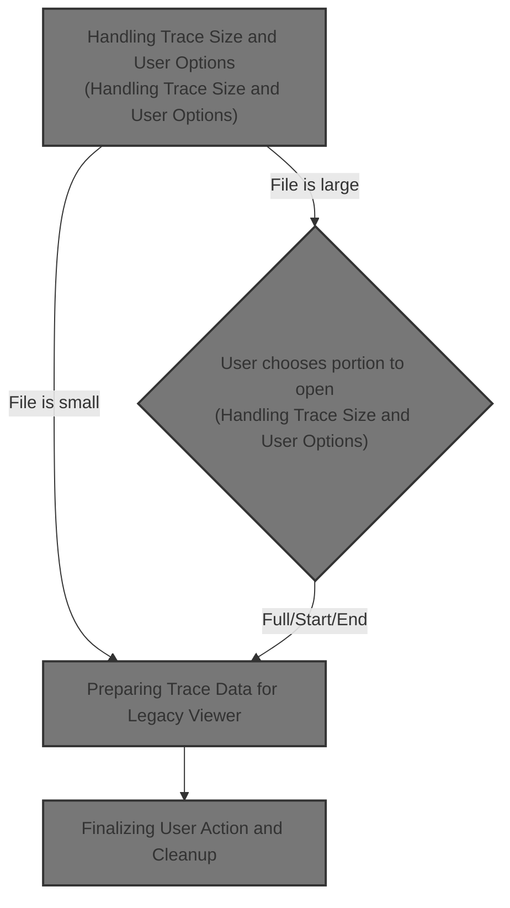

This document outlines how users can open trace files in the legacy viewer. Depending on the file size, users may be prompted to select whether to open the entire trace or just a portion. The chosen data is converted and displayed in the legacy viewer, ensuring accessibility for both small and large files.



# Handling Trace Size and User Options

<SwmSnippet path="/ui/src/frontend/legacy_trace_viewer.ts" line="177">

---

In <SwmToken path="ui/src/frontend/legacy_trace_viewer.ts" pos="177:6:6" line-data="export async function openInOldUIWithSizeCheck(trace: Blob): Promise&lt;void&gt; {">`openInOldUIWithSizeCheck`</SwmToken>, we first check if the trace is small enough to open directly; if so, we convert and open it. If it's too big, we prompt the user with options to open the full trace or just the start/end, and then call <SwmToken path="ui/src/frontend/legacy_trace_viewer.ts" pos="180:5:5" line-data="    return await convertToJson(trace, openBufferWithLegacyTraceViewer);">`convertToJson`</SwmToken> based on their choice. This hands off the actual conversion and opening logic to the next step, which is handled in <SwmPath>[ui/…/frontend/trace_converter.ts](ui/src/frontend/trace_converter.ts)</SwmPath>.

```typescript
export async function openInOldUIWithSizeCheck(trace: Blob): Promise<void> {
  // Perfetto traces smaller than 50mb can be safely opened in the legacy UI.
  if (trace.size < 1024 * 1024 * 50) {
    return await convertToJson(trace, openBufferWithLegacyTraceViewer);
  }

  // Give the user the option to truncate larger perfetto traces.
  const size = Math.round(trace.size / (1024 * 1024));

  // If the user presses one of the buttons below, remember the promise that
  // they trigger, so we await for it before returning.
  let nextPromise: Promise<void> | undefined;
  const setNextPromise = (p: Promise<void>) => (nextPromise = p);

  await showModal({
    title: 'Legacy UI may fail to open this trace',
    content: m(
      'div',
      m(
        'p',
        `This trace is ${size}mb, opening it in the legacy UI ` + `may fail.`,
      ),
      m(
        'p',
        'More options can be found at ',
        m(
          Anchor,
          {
            href: 'https://goto.google.com/opening-large-traces',
            target: '_blank',
            icon: Icons.ExternalLink,
          },
          'go/opening-large-traces',
        ),
        '.',
      ),
    ),
    buttons: [
      {
        text: 'Open full trace (not recommended)',
        action: () =>
          setNextPromise(convertToJson(trace, openBufferWithLegacyTraceViewer)),
      },
      {
        text: 'Open beginning of trace',
        action: () =>
          setNextPromise(
            convertToJson(
              trace,
              openBufferWithLegacyTraceViewer,
              /* truncate*/ 'start',
            ),
          ),
      },
      {
        text: 'Open end of trace',
        primary: true,
        action: () =>
          setNextPromise(
            convertToJson(
              trace,
              openBufferWithLegacyTraceViewer,
              /* truncate*/ 'end',
            ),
          ),
      },
    ],
  });
```

---

</SwmSnippet>

## Preparing Trace Data for Legacy Viewer

<SwmSnippet path="/ui/src/frontend/trace_converter.ts" line="111">

---

<SwmToken path="ui/src/frontend/trace_converter.ts" pos="111:4:4" line-data="export function convertToJson(">`convertToJson`</SwmToken> takes the trace (and possibly a truncation option), then sends it to a worker for conversion. It also passes a callback so the converted trace can be opened in the legacy viewer when ready. This offloads the heavy work and keeps the UI responsive.

```typescript
export function convertToJson(
  trace: Blob,
  openTraceInLegacy: OpenTraceInLegacyCallback,
  truncate?: 'start' | 'end',
): Promise<void> {
  return makeWorkerAndPost(
    {
      kind: 'ConvertTraceAndOpenInLegacy',
      trace,
      truncate,
    },
    openTraceInLegacy,
  );
}
```

---

</SwmSnippet>

## Worker Communication and Error Handling

```mermaid
%%{init: {"flowchart": {"defaultRenderer": "elk"}} }%%
flowchart TD
  node1["Create background worker"] --> node2["Post task to worker"]
  node2 --> node3["Return promise to caller"]
  node1 --> node4{"Message received from worker"}
  node4 -->|"Status update"| node5["Show status message to user"]
  click node5 openCode "ui/src/frontend/trace_converter.ts:71:71"
  node4 -->|"Job completed"| node6["Mark task as complete"]
  click node6 openCode "ui/src/frontend/trace_converter.ts:73:73"
  node4 -->|"Download file"| node7["Download file for user"]
  click node7 openCode "ui/src/frontend/trace_converter.ts:75:78"
  node4 -->|"Open trace"| node8["Open trace in legacy viewer"]
  click node8 openCode "ui/src/frontend/trace_converter.ts:80:81"
  node4 -->|"Error"| node9["Show error dialog"]
  click node9 openCode "ui/src/frontend/trace_converter.ts:83:83"
  node4 -->|"Other"| node10["Show unhandled message error"]
  click node10 openCode "ui/src/frontend/trace_converter.ts:85:86"
  click node1 openCode "ui/src/frontend/trace_converter.ts:89:89"
  click node2 openCode "ui/src/frontend/trace_converter.ts:91:91"
  click node3 openCode "ui/src/frontend/trace_converter.ts:92:92"
  click node4 openCode "ui/src/frontend/trace_converter.ts:68:87"

classDef HeadingStyle fill:#777777,stroke:#333,stroke-width:2px;

%% Swimm:
%% %%{init: {"flowchart": {"defaultRenderer": "elk"}} }%%
%% flowchart TD
%%   node1["Create background worker"] --> node2["Post task to worker"]
%%   node2 --> node3["Return promise to caller"]
%%   node1 --> node4{"Message received from worker"}
%%   node4 -->|"Status update"| node5["Show status message to user"]
%%   click node5 openCode "<SwmPath>[ui/…/frontend/trace_converter.ts](ui/src/frontend/trace_converter.ts)</SwmPath>:71:71"
%%   node4 -->|"Job completed"| node6["Mark task as complete"]
%%   click node6 openCode "<SwmPath>[ui/…/frontend/trace_converter.ts](ui/src/frontend/trace_converter.ts)</SwmPath>:73:73"
%%   node4 -->|"Download file"| node7["Download file for user"]
%%   click node7 openCode "<SwmPath>[ui/…/frontend/trace_converter.ts](ui/src/frontend/trace_converter.ts)</SwmPath>:75:78"
%%   node4 -->|"Open trace"| node8["Open trace in legacy viewer"]
%%   click node8 openCode "<SwmPath>[ui/…/frontend/trace_converter.ts](ui/src/frontend/trace_converter.ts)</SwmPath>:80:81"
%%   node4 -->|"Error"| node9["Show error dialog"]
%%   click node9 openCode "<SwmPath>[ui/…/frontend/trace_converter.ts](ui/src/frontend/trace_converter.ts)</SwmPath>:83:83"
%%   node4 -->|"Other"| node10["Show unhandled message error"]
%%   click node10 openCode "<SwmPath>[ui/…/frontend/trace_converter.ts](ui/src/frontend/trace_converter.ts)</SwmPath>:85:86"
%%   click node1 openCode "<SwmPath>[ui/…/frontend/trace_converter.ts](ui/src/frontend/trace_converter.ts)</SwmPath>:89:89"
%%   click node2 openCode "<SwmPath>[ui/…/frontend/trace_converter.ts](ui/src/frontend/trace_converter.ts)</SwmPath>:91:91"
%%   click node3 openCode "<SwmPath>[ui/…/frontend/trace_converter.ts](ui/src/frontend/trace_converter.ts)</SwmPath>:92:92"
%%   click node4 openCode "<SwmPath>[ui/…/frontend/trace_converter.ts](ui/src/frontend/trace_converter.ts)</SwmPath>:68:87"
%% 
%% classDef HeadingStyle fill:#777777,stroke:#333,stroke-width:2px;
```



<SwmSnippet path="/ui/src/frontend/trace_converter.ts" line="62">

---

In <SwmToken path="ui/src/frontend/trace_converter.ts" pos="62:4:4" line-data="async function makeWorkerAndPost(">`makeWorkerAndPost`</SwmToken>, we set up a message handler for the worker. It listens for status updates, job completion, file downloads, legacy trace opening, and errors. If an error comes in, we call <SwmToken path="ui/src/frontend/trace_converter.ts" pos="83:1:1" line-data="      maybeShowErrorDialog(args.error);">`maybeShowErrorDialog`</SwmToken> to show the right dialog based on the error details. This keeps the UI and user in sync with what's happening in the worker.

```typescript
async function makeWorkerAndPost(
  msg: unknown,
  openTraceInLegacy?: OpenTraceInLegacyCallback,
) {
  const promise = defer<void>();

  function handleOnMessage(msg: MessageEvent): void {
    const args: Args = msg.data;
    if (args.kind === 'updateStatus') {
      AppImpl.instance.omnibox.showStatusMessage(args.status);
    } else if (args.kind === 'jobCompleted') {
      promise.resolve();
    } else if (args.kind === 'downloadFile') {
      download({
        content: args.buffer,
        fileName: args.name,
      });
    } else if (args.kind === 'openTraceInLegacy') {
      const str = utf8Decode(args.buffer);
      openTraceInLegacy?.('trace.json', str, 0);
    } else if (args.kind === 'error') {
      maybeShowErrorDialog(args.error);
    } else {
      throw new Error(`Unhandled message ${JSON.stringify(args)}`);
    }
  }

```

---

</SwmSnippet>

<SwmSnippet path="/ui/src/frontend/error_dialog.ts" line="36">

---

<SwmToken path="ui/src/frontend/error_dialog.ts" pos="36:4:4" line-data="export function maybeShowErrorDialog(err: ErrorDetails) {">`maybeShowErrorDialog`</SwmToken> inspects the error message and stack trace for known issues and shows a specific dialog for each case. It also rate-limits dialogs and avoids overwriting an existing crash dialog. If nothing matches, it maps the stack trace for readability and shows a generic error dialog.

```typescript
export function maybeShowErrorDialog(err: ErrorDetails) {
  const now = performance.now();

  // Here we rely on the exception message from onCannotGrowMemory function
  if (
    err.message.includes('Cannot enlarge memory') ||
    err.stack.some((entry) => entry.name.includes('base::AlignedAlloc')) ||
    err.stack.some((entry) => entry.name.includes('OutOfMemoryHandler')) ||
    err.stack.some((entry) => entry.name.includes('_emscripten_resize_heap')) ||
    err.stack.some((entry) => entry.name.includes('sbrk')) ||
    /^out of memory$/m.exec(err.message)
  ) {
    showOutOfMemoryDialog();
    // Refresh timeLastReport to prevent a different error showing a dialog
    timeLastReport = now;
    return;
  }

  if (err.message.includes('Unable to claim interface')) {
    showWebUSBError();
    timeLastReport = now;
    return;
  }

  if (err.message.includes('ABT: Got no attachments from extension')) {
    showABTError();
    timeLastReport = now;
    return;
  }

  if (
    err.message.includes('A transfer error has occurred') ||
    err.message.includes('The device was disconnected') ||
    err.message.includes('The transfer was cancelled')
  ) {
    showConnectionLostError();
    timeLastReport = now;
    return;
  }

  if (err.message.includes('(ERR:fmt)')) {
    showUnknownFileError();
    return;
  }

  if (err.message.includes('(ERR:rpc_seq)')) {
    showRpcSequencingError();
    return;
  }

  if (err.message.includes('(ERR:ws)')) {
    showWebsocketConnectionIssue(err.message);
    return;
  }

  // This is only for older version of the UI and for ease of tracking across
  // cherry-picks. Newer versions don't have this exception anymore.
  if (err.message.includes('State hash does not match')) {
    showNewerStateError();
    return;
  }

  if (timeLastReport > 0 && now - timeLastReport <= MIN_REPORT_PERIOD_MS) {
    console.log('Suppressing crash dialog, last error notified too soon.');
    return;
  }
  timeLastReport = now;

  // If we are already showing a crash dialog, don't overwrite it with a newer
  // crash. Usually the first crash matters, the rest avalanching effects.
  if (getCurrentModalKey() === MODAL_KEY) {
    return;
  }

  err.stack = mapStackTraceWithMinifiedSourceMap(err.stack);

  showModal({
    key: MODAL_KEY,
    title: 'Oops, something went wrong. Please file a bug.',
    content: () => m(ErrorDialogComponent, err),
  });
}
```

---

</SwmSnippet>

<SwmSnippet path="/ui/src/frontend/trace_converter.ts" line="89">

---

We just came back from <SwmToken path="ui/src/frontend/trace_converter.ts" pos="83:1:1" line-data="      maybeShowErrorDialog(args.error);">`maybeShowErrorDialog`</SwmToken> if there was an error. Here, in <SwmToken path="ui/src/frontend/trace_converter.ts" pos="62:4:4" line-data="async function makeWorkerAndPost(">`makeWorkerAndPost`</SwmToken>, we spin up a worker with <SwmToken path="ui/src/frontend/trace_converter.ts" pos="89:14:16" line-data="  const worker = new Worker(assetSrc(&#39;traceconv_bundle.js&#39;));">`traceconv_bundle.js`</SwmToken>, hook up the message handler, and kick off the conversion by posting the message. This keeps heavy work off the main thread.

```typescript
  const worker = new Worker(assetSrc('traceconv_bundle.js'));
  worker.onmessage = handleOnMessage;
  worker.postMessage(msg);
  return promise;
}
```

---

</SwmSnippet>

## Finalizing User Action and Cleanup

<SwmSnippet path="/ui/src/frontend/legacy_trace_viewer.ts" line="245">

---

We just got back from <SwmToken path="ui/src/frontend/legacy_trace_viewer.ts" pos="180:5:5" line-data="    return await convertToJson(trace, openBufferWithLegacyTraceViewer);">`convertToJson`</SwmToken> in <SwmToken path="ui/src/frontend/legacy_trace_viewer.ts" pos="177:6:6" line-data="export async function openInOldUIWithSizeCheck(trace: Blob): Promise&lt;void&gt; {">`openInOldUIWithSizeCheck`</SwmToken>. Here, we wait for the user's chosen action (if any) to finish before returning, so the trace is only opened after conversion completes.

```typescript
  // nextPromise is undefined if the user just dimisses the dialog with ESC.
  if (nextPromise !== undefined) {
    await nextPromise;
  }
}
```

---

</SwmSnippet>

&nbsp;

*This is an auto-generated document by Swimm 🌊 and has not yet been verified by a human*

<SwmMeta version="3.0.0" repo-id="Z2l0aHViJTNBJTNBY3BsdXNwbHVzLXBlcmZldHRvJTNBJTNBcmljYXJkb2xvcGV6Zw==" repo-name="cplusplus-perfetto"><sup>Powered by [Swimm](https://app.swimm.io/)</sup></SwmMeta>
