This document outlines the process for opening trace files in the legacy UI. Users select a trace file, and if it is large, they are presented with options to open the full file or just a portion. The system processes the file according to the user's choice, helping prevent UI failures and ensuring a smoother experience.

# Where is this flow used?

This flow is used multiple times in the codebase as represented in the following diagram:

```mermaid
graph TD;
      f49ca3d79ea1bcd2f8b264bc7a08d171fc09b3a9c816e441058749d63889befd(ui/…/bigtrace/index.ts::openWithLegacyUi) --> a0a090a4e3073e021735a7475d4fbe16ce2057ee5c8ad8fab0b4225c20eadd73(ui/…/frontend/legacy_trace_viewer.ts::openInOldUIWithSizeCheck):::mainFlowStyle

100fd5fbdf00607d31e673d88772b0aa3fd9c9d132a78b4fbc9baf00d9fadce2(ui/…/bigtrace/index.ts::onInputElementFileSelectionChanged) --> f49ca3d79ea1bcd2f8b264bc7a08d171fc09b3a9c816e441058749d63889befd(ui/…/bigtrace/index.ts::openWithLegacyUi)

98c50f3b3ce6bc3b2fa6acac6581fda77f558cafd8c799e877251371eb7627ca(ui/…/frontend/sidebar.ts::openCurrentTraceWithOldUI) --> a0a090a4e3073e021735a7475d4fbe16ce2057ee5c8ad8fab0b4225c20eadd73(ui/…/frontend/legacy_trace_viewer.ts::openInOldUIWithSizeCheck):::mainFlowStyle

13662759489b891c8414f2f8ce21113abfb80f5d2fe2ad649811f83727da20a8(ui/…/frontend/sidebar.ts::getConvertTraceItems) --> 98c50f3b3ce6bc3b2fa6acac6581fda77f558cafd8c799e877251371eb7627ca(ui/…/frontend/sidebar.ts::openCurrentTraceWithOldUI)

ca73cf8f77015d030a8f82bd045ae78f2fe47826ddca82876063d8d5645bf394(ui/…/frontend/sidebar.ts::Sidebar.renderSection) --> 13662759489b891c8414f2f8ce21113abfb80f5d2fe2ad649811f83727da20a8(ui/…/frontend/sidebar.ts::getConvertTraceItems)

2d71d0bd3c3f17cb12379e7cbabc2285f1584d060f51ffffd68a125d363ed69f(ui/…/frontend/sidebar.ts::Sidebar.view) --> ca73cf8f77015d030a8f82bd045ae78f2fe47826ddca82876063d8d5645bf394(ui/…/frontend/sidebar.ts::Sidebar.renderSection)

f537a7ddd8eb985353ab1756eb9b73972429fb97271fb542b10ee450a6688e98(ui/…/frontend/sidebar.ts::action) --> 98c50f3b3ce6bc3b2fa6acac6581fda77f558cafd8c799e877251371eb7627ca(ui/…/frontend/sidebar.ts::openCurrentTraceWithOldUI)


classDef mainFlowStyle color:#000000,fill:#7CB9F4
classDef rootsStyle color:#000000,fill:#00FFF4
classDef Style1 color:#000000,fill:#00FFAA
classDef Style2 color:#000000,fill:#FFFF00
classDef Style3 color:#000000,fill:#AA7CB9

%% Swimm:
%% graph TD;
%%       f49ca3d79ea1bcd2f8b264bc7a08d171fc09b3a9c816e441058749d63889befd(<SwmPath>[ui/…/bigtrace/index.ts](ui/src/bigtrace/index.ts)</SwmPath>::openWithLegacyUi) --> a0a090a4e3073e021735a7475d4fbe16ce2057ee5c8ad8fab0b4225c20eadd73(<SwmPath>[ui/…/frontend/legacy_trace_viewer.ts](ui/src/frontend/legacy_trace_viewer.ts)</SwmPath>::<SwmToken path="ui/src/frontend/legacy_trace_viewer.ts" pos="177:6:6" line-data="export async function openInOldUIWithSizeCheck(trace: Blob): Promise&lt;void&gt; {">`openInOldUIWithSizeCheck`</SwmToken>):::mainFlowStyle
%% 
%% 100fd5fbdf00607d31e673d88772b0aa3fd9c9d132a78b4fbc9baf00d9fadce2(<SwmPath>[ui/…/bigtrace/index.ts](ui/src/bigtrace/index.ts)</SwmPath>::onInputElementFileSelectionChanged) --> f49ca3d79ea1bcd2f8b264bc7a08d171fc09b3a9c816e441058749d63889befd(<SwmPath>[ui/…/bigtrace/index.ts](ui/src/bigtrace/index.ts)</SwmPath>::openWithLegacyUi)
%% 
%% 98c50f3b3ce6bc3b2fa6acac6581fda77f558cafd8c799e877251371eb7627ca(<SwmPath>[ui/…/frontend/sidebar.ts](ui/src/frontend/sidebar.ts)</SwmPath>::openCurrentTraceWithOldUI) --> a0a090a4e3073e021735a7475d4fbe16ce2057ee5c8ad8fab0b4225c20eadd73(<SwmPath>[ui/…/frontend/legacy_trace_viewer.ts](ui/src/frontend/legacy_trace_viewer.ts)</SwmPath>::<SwmToken path="ui/src/frontend/legacy_trace_viewer.ts" pos="177:6:6" line-data="export async function openInOldUIWithSizeCheck(trace: Blob): Promise&lt;void&gt; {">`openInOldUIWithSizeCheck`</SwmToken>):::mainFlowStyle
%% 
%% 13662759489b891c8414f2f8ce21113abfb80f5d2fe2ad649811f83727da20a8(<SwmPath>[ui/…/frontend/sidebar.ts](ui/src/frontend/sidebar.ts)</SwmPath>::getConvertTraceItems) --> 98c50f3b3ce6bc3b2fa6acac6581fda77f558cafd8c799e877251371eb7627ca(<SwmPath>[ui/…/frontend/sidebar.ts](ui/src/frontend/sidebar.ts)</SwmPath>::openCurrentTraceWithOldUI)
%% 
%% ca73cf8f77015d030a8f82bd045ae78f2fe47826ddca82876063d8d5645bf394(<SwmPath>[ui/…/frontend/sidebar.ts](ui/src/frontend/sidebar.ts)</SwmPath>::Sidebar.renderSection) --> 13662759489b891c8414f2f8ce21113abfb80f5d2fe2ad649811f83727da20a8(<SwmPath>[ui/…/frontend/sidebar.ts](ui/src/frontend/sidebar.ts)</SwmPath>::getConvertTraceItems)
%% 
%% 2d71d0bd3c3f17cb12379e7cbabc2285f1584d060f51ffffd68a125d363ed69f(<SwmPath>[ui/…/frontend/sidebar.ts](ui/src/frontend/sidebar.ts)</SwmPath>::Sidebar.view) --> ca73cf8f77015d030a8f82bd045ae78f2fe47826ddca82876063d8d5645bf394(<SwmPath>[ui/…/frontend/sidebar.ts](ui/src/frontend/sidebar.ts)</SwmPath>::Sidebar.renderSection)
%% 
%% f537a7ddd8eb985353ab1756eb9b73972429fb97271fb542b10ee450a6688e98(<SwmPath>[ui/…/frontend/sidebar.ts](ui/src/frontend/sidebar.ts)</SwmPath>::action) --> 98c50f3b3ce6bc3b2fa6acac6581fda77f558cafd8c799e877251371eb7627ca(<SwmPath>[ui/…/frontend/sidebar.ts](ui/src/frontend/sidebar.ts)</SwmPath>::openCurrentTraceWithOldUI)
%% 
%% 
%% classDef mainFlowStyle color:#000000,fill:#7CB9F4
%% classDef rootsStyle color:#000000,fill:#00FFF4
%% classDef Style1 color:#000000,fill:#00FFAA
%% classDef Style2 color:#000000,fill:#FFFF00
%% classDef Style3 color:#000000,fill:#AA7CB9
```



# Handling trace size and user options

<SwmSnippet path="/ui/src/frontend/legacy_trace_viewer.ts" line="177">

---

In <SwmToken path="ui/src/frontend/legacy_trace_viewer.ts" pos="177:6:6" line-data="export async function openInOldUIWithSizeCheck(trace: Blob): Promise&lt;void&gt; {">`openInOldUIWithSizeCheck`</SwmToken>, we first check if the trace is under 50MB. If it is, we send it straight to the converter for the legacy UI. If it's bigger, we pop up a modal dialog warning the user and offering three choices: open the whole trace (not recommended), just the start, or just the end. Each choice sets up a promise to handle the user's selection, and we only proceed after the user picks or dismisses. The next step is calling the converter, which actually processes the trace for the legacy UI, and that's why we need to call <SwmPath>[ui/…/frontend/trace_converter.ts](ui/src/frontend/trace_converter.ts)</SwmPath> next.

```typescript
export async function openInOldUIWithSizeCheck(trace: Blob): Promise<void> {
  // Perfetto traces smaller than 50mb can be safely opened in the legacy UI.
  if (trace.size < 1024 * 1024 * 50) {
    return await convertToJson(trace, openBufferWithLegacyTraceViewer);
  }

  // Give the user the option to truncate larger perfetto traces.
  const size = Math.round(trace.size / (1024 * 1024));

  // If the user presses one of the buttons below, remember the promise that
  // they trigger, so we await for it before returning.
  let nextPromise: Promise<void> | undefined;
  const setNextPromise = (p: Promise<void>) => (nextPromise = p);

  await showModal({
    title: 'Legacy UI may fail to open this trace',
    content: m(
      'div',
      m(
        'p',
        `This trace is ${size}mb, opening it in the legacy UI ` + `may fail.`,
      ),
      m(
        'p',
        'More options can be found at ',
        m(
          Anchor,
          {
            href: 'https://goto.google.com/opening-large-traces',
            target: '_blank',
            icon: Icons.ExternalLink,
          },
          'go/opening-large-traces',
        ),
        '.',
      ),
    ),
    buttons: [
      {
        text: 'Open full trace (not recommended)',
        action: () =>
          setNextPromise(convertToJson(trace, openBufferWithLegacyTraceViewer)),
      },
      {
        text: 'Open beginning of trace',
        action: () =>
          setNextPromise(
            convertToJson(
              trace,
              openBufferWithLegacyTraceViewer,
              /* truncate*/ 'start',
            ),
          ),
      },
      {
        text: 'Open end of trace',
        primary: true,
        action: () =>
          setNextPromise(
            convertToJson(
              trace,
              openBufferWithLegacyTraceViewer,
              /* truncate*/ 'end',
            ),
          ),
      },
    ],
  });
```

---

</SwmSnippet>

## Converting and preparing trace data

<SwmSnippet path="/ui/src/frontend/trace_converter.ts" line="111">

---

<SwmToken path="ui/src/frontend/trace_converter.ts" pos="111:4:4" line-data="export function convertToJson(">`convertToJson`</SwmToken> sends the trace and options to a worker, which does the conversion and calls back to open the trace in the legacy UI.

```typescript
export function convertToJson(
  trace: Blob,
  openTraceInLegacy: OpenTraceInLegacyCallback,
  truncate?: 'start' | 'end',
): Promise<void> {
  return makeWorkerAndPost(
    {
      kind: 'ConvertTraceAndOpenInLegacy',
      trace,
      truncate,
    },
    openTraceInLegacy,
  );
}
```

---

</SwmSnippet>

## Processing trace in worker and handling errors


<SwmSnippet path="/ui/src/frontend/trace_converter.ts" line="62">

---

In <SwmToken path="ui/src/frontend/trace_converter.ts" pos="62:4:4" line-data="async function makeWorkerAndPost(">`makeWorkerAndPost`</SwmToken>, we set up a message handler for the worker to process status updates, job completion, downloads, legacy trace opening, and errors. If an error message comes in, we call the error dialog logic next to show the user what went wrong.

```typescript
async function makeWorkerAndPost(
  msg: unknown,
  openTraceInLegacy?: OpenTraceInLegacyCallback,
) {
  const promise = defer<void>();

  function handleOnMessage(msg: MessageEvent): void {
    const args: Args = msg.data;
    if (args.kind === 'updateStatus') {
      AppImpl.instance.omnibox.showStatusMessage(args.status);
    } else if (args.kind === 'jobCompleted') {
      promise.resolve();
    } else if (args.kind === 'downloadFile') {
      download({
        content: args.buffer,
        fileName: args.name,
      });
    } else if (args.kind === 'openTraceInLegacy') {
      const str = utf8Decode(args.buffer);
      openTraceInLegacy?.('trace.json', str, 0);
    } else if (args.kind === 'error') {
      maybeShowErrorDialog(args.error);
    } else {
      throw new Error(`Unhandled message ${JSON.stringify(args)}`);
    }
  }

```

---

</SwmSnippet>

<SwmSnippet path="/ui/src/frontend/error_dialog.ts" line="36">

---

<SwmToken path="ui/src/frontend/error_dialog.ts" pos="36:4:4" line-data="export function maybeShowErrorDialog(err: ErrorDetails) {">`maybeShowErrorDialog`</SwmToken> checks error messages and stack traces for known patterns, shows the right dialog for each case, and avoids spamming the user with repeated dialogs. It also maps stack traces for readability before showing generic errors.

```typescript
export function maybeShowErrorDialog(err: ErrorDetails) {
  const now = performance.now();

  // Here we rely on the exception message from onCannotGrowMemory function
  if (
    err.message.includes('Cannot enlarge memory') ||
    err.stack.some((entry) => entry.name.includes('base::AlignedAlloc')) ||
    err.stack.some((entry) => entry.name.includes('OutOfMemoryHandler')) ||
    err.stack.some((entry) => entry.name.includes('_emscripten_resize_heap')) ||
    err.stack.some((entry) => entry.name.includes('sbrk')) ||
    /^out of memory$/m.exec(err.message)
  ) {
    showOutOfMemoryDialog();
    // Refresh timeLastReport to prevent a different error showing a dialog
    timeLastReport = now;
    return;
  }

  if (err.message.includes('Unable to claim interface')) {
    showWebUSBError();
    timeLastReport = now;
    return;
  }

  if (err.message.includes('ABT: Got no attachments from extension')) {
    showABTError();
    timeLastReport = now;
    return;
  }

  if (
    err.message.includes('A transfer error has occurred') ||
    err.message.includes('The device was disconnected') ||
    err.message.includes('The transfer was cancelled')
  ) {
    showConnectionLostError();
    timeLastReport = now;
    return;
  }

  if (err.message.includes('(ERR:fmt)')) {
    showUnknownFileError();
    return;
  }

  if (err.message.includes('(ERR:rpc_seq)')) {
    showRpcSequencingError();
    return;
  }

  if (err.message.includes('(ERR:ws)')) {
    showWebsocketConnectionIssue(err.message);
    return;
  }

  // This is only for older version of the UI and for ease of tracking across
  // cherry-picks. Newer versions don't have this exception anymore.
  if (err.message.includes('State hash does not match')) {
    showNewerStateError();
    return;
  }

  if (timeLastReport > 0 && now - timeLastReport <= MIN_REPORT_PERIOD_MS) {
    console.log('Suppressing crash dialog, last error notified too soon.');
    return;
  }
  timeLastReport = now;

  // If we are already showing a crash dialog, don't overwrite it with a newer
  // crash. Usually the first crash matters, the rest avalanching effects.
  if (getCurrentModalKey() === MODAL_KEY) {
    return;
  }

  err.stack = mapStackTraceWithMinifiedSourceMap(err.stack);

  showModal({
    key: MODAL_KEY,
    title: 'Oops, something went wrong. Please file a bug.',
    content: () => m(ErrorDialogComponent, err),
  });
}
```

---

</SwmSnippet>

<SwmSnippet path="/ui/src/frontend/trace_converter.ts" line="89">

---

After error handling, <SwmToken path="ui/src/frontend/trace_converter.ts" pos="62:4:4" line-data="async function makeWorkerAndPost(">`makeWorkerAndPost`</SwmToken> starts the worker and returns a promise that resolves when processing is complete.

```typescript
  const worker = new Worker(assetSrc('traceconv_bundle.js'));
  worker.onmessage = handleOnMessage;
  worker.postMessage(msg);
  return promise;
}
```

---

</SwmSnippet>

## Finalizing trace opening after user choice

<SwmSnippet path="/ui/src/frontend/legacy_trace_viewer.ts" line="245">

---

We just got back from <SwmToken path="ui/src/frontend/legacy_trace_viewer.ts" pos="180:5:5" line-data="    return await convertToJson(trace, openBufferWithLegacyTraceViewer);">`convertToJson`</SwmToken>. At the end of <SwmToken path="ui/src/frontend/legacy_trace_viewer.ts" pos="177:6:6" line-data="export async function openInOldUIWithSizeCheck(trace: Blob): Promise&lt;void&gt; {">`openInOldUIWithSizeCheck`</SwmToken>, we check if the user picked an option in the modal. If they did, we await the promise to finish opening the trace. If not, we just exit without doing anything.

```typescript
  // nextPromise is undefined if the user just dimisses the dialog with ESC.
  if (nextPromise !== undefined) {
    await nextPromise;
  }
}
```

---

</SwmSnippet>

&nbsp;

*This is an auto-generated document by Swimm 🌊 and has not yet been verified by a human*

<SwmMeta version="3.0.0" repo-id="Z2l0aHViJTNBJTNBY3BsdXNwbHVzLXBlcmZldHRvJTNBJTNBcmljYXJkb2xvcGV6Zw==" repo-name="cplusplus-perfetto"><sup>Powered by [Swimm](https://app.swimm.io/)</sup></SwmMeta>
