This document describes how CPU idle state information from trace data is loaded and organized into summary and per-CPU groups for display. This allows users to analyze CPU idle patterns and performance in a structured and accessible way.

# Loading and Grouping CPU Idle State Tracks

```mermaid
%%{init: {"flowchart": {"defaultRenderer": "elk"}} }%%
flowchart TD
  node1["Create summary group for CPU idle time"]
  click node1 openCode "ui/src/plugins/dev.perfetto.CpuidleTimeInState/index.ts:95:98"
  node1 --> node2["Query distinct idle states"]
  click node2 openCode "ui/src/plugins/dev.perfetto.CpuidleTimeInState/index.ts:101:104"
  subgraph loop1["For each idle state in trace"]
    node2 --> node3["Add summary track for idle state"]
    click node3 openCode "ui/src/plugins/dev.perfetto.CpuidleTimeInState/index.ts:106:108"
  end
  loop1 --> node4{"Does summary group have children?"}
  click node4 openCode "ui/src/plugins/dev.perfetto.CpuidleTimeInState/index.ts:110:115"
  node4 -->|"Yes"| node5["Add summary group to CPU group"]
  click node5 openCode "ui/src/plugins/dev.perfetto.CpuidleTimeInState/index.ts:111:115"
  node4 -->|"No"| node7["Create per-CPU group"]
  node5 --> node7
  node7["Create per-CPU group"]
  click node7 openCode "ui/src/plugins/dev.perfetto.CpuidleTimeInState/index.ts:117:120"
  node7 --> node8["Query distinct state/CPU pairs"]
  click node8 openCode "ui/src/plugins/dev.perfetto.CpuidleTimeInState/index.ts:122:125"
  subgraph loop2["For each state/CPU pair in trace"]
    node8 --> node9["Add per-CPU track for state/CPU"]
    click node9 openCode "ui/src/plugins/dev.perfetto.CpuidleTimeInState/index.ts:127:129"
  end
  loop2 --> node10{"Does per-CPU group have children?"}
  click node10 openCode "ui/src/plugins/dev.perfetto.CpuidleTimeInState/index.ts:131:136"
  node10 -->|"Yes"| node11["Add per-CPU group to CPU group"]
  click node11 openCode "ui/src/plugins/dev.perfetto.CpuidleTimeInState/index.ts:132:136"
  node10 -->|"No"| node12["End"]
  node11 --> node12
classDef HeadingStyle fill:#777777,stroke:#333,stroke-width:2px;

%% Swimm:
%% %%{init: {"flowchart": {"defaultRenderer": "elk"}} }%%
%% flowchart TD
%%   node1["Create summary group for CPU idle time"]
%%   click node1 openCode "<SwmPath>[ui/…/dev.perfetto.CpuidleTimeInState/index.ts](ui/src/plugins/dev.perfetto.CpuidleTimeInState/index.ts)</SwmPath>:95:98"
%%   node1 --> node2["Query distinct idle states"]
%%   click node2 openCode "<SwmPath>[ui/…/dev.perfetto.CpuidleTimeInState/index.ts](ui/src/plugins/dev.perfetto.CpuidleTimeInState/index.ts)</SwmPath>:101:104"
%%   subgraph loop1["For each idle state in trace"]
%%     node2 --> node3["Add summary track for idle state"]
%%     click node3 openCode "<SwmPath>[ui/…/dev.perfetto.CpuidleTimeInState/index.ts](ui/src/plugins/dev.perfetto.CpuidleTimeInState/index.ts)</SwmPath>:106:108"
%%   end
%%   loop1 --> node4{"Does summary group have children?"}
%%   click node4 openCode "<SwmPath>[ui/…/dev.perfetto.CpuidleTimeInState/index.ts](ui/src/plugins/dev.perfetto.CpuidleTimeInState/index.ts)</SwmPath>:110:115"
%%   node4 -->|"Yes"| node5["Add summary group to CPU group"]
%%   click node5 openCode "<SwmPath>[ui/…/dev.perfetto.CpuidleTimeInState/index.ts](ui/src/plugins/dev.perfetto.CpuidleTimeInState/index.ts)</SwmPath>:111:115"
%%   node4 -->|"No"| node7["Create per-CPU group"]
%%   node5 --> node7
%%   node7["Create per-CPU group"]
%%   click node7 openCode "<SwmPath>[ui/…/dev.perfetto.CpuidleTimeInState/index.ts](ui/src/plugins/dev.perfetto.CpuidleTimeInState/index.ts)</SwmPath>:117:120"
%%   node7 --> node8["Query distinct state/CPU pairs"]
%%   click node8 openCode "<SwmPath>[ui/…/dev.perfetto.CpuidleTimeInState/index.ts](ui/src/plugins/dev.perfetto.CpuidleTimeInState/index.ts)</SwmPath>:122:125"
%%   subgraph loop2["For each state/CPU pair in trace"]
%%     node8 --> node9["Add per-CPU track for state/CPU"]
%%     click node9 openCode "<SwmPath>[ui/…/dev.perfetto.CpuidleTimeInState/index.ts](ui/src/plugins/dev.perfetto.CpuidleTimeInState/index.ts)</SwmPath>:127:129"
%%   end
%%   loop2 --> node10{"Does per-CPU group have children?"}
%%   click node10 openCode "<SwmPath>[ui/…/dev.perfetto.CpuidleTimeInState/index.ts](ui/src/plugins/dev.perfetto.CpuidleTimeInState/index.ts)</SwmPath>:131:136"
%%   node10 -->|"Yes"| node11["Add per-CPU group to CPU group"]
%%   click node11 openCode "<SwmPath>[ui/…/dev.perfetto.CpuidleTimeInState/index.ts](ui/src/plugins/dev.perfetto.CpuidleTimeInState/index.ts)</SwmPath>:132:136"
%%   node10 -->|"No"| node12["End"]
%%   node11 --> node12
%% classDef HeadingStyle fill:#777777,stroke:#333,stroke-width:2px;
```



<SwmSnippet path="/ui/src/plugins/dev.perfetto.CpuidleTimeInState/index.ts" line="94">

---

In <SwmToken path="ui/src/plugins/dev.perfetto.CpuidleTimeInState/index.ts" pos="94:3:3" line-data="  async onTraceLoad(ctx: Trace): Promise&lt;void&gt; {">`onTraceLoad`</SwmToken>, we start by setting up a summary group for CPU idle time states and making sure the trace engine has the right module loaded. We then query for all distinct idle states and loop through them, calling <SwmToken path="ui/src/plugins/dev.perfetto.CpuidleTimeInState/index.ts" pos="107:5:5" line-data="      await this.addIdleStateTrack(ctx, it.state, group);">`addIdleStateTrack`</SwmToken> for each. This step is needed to populate the group with tracks for each state, so we have something to organize and display later.

```typescript
  async onTraceLoad(ctx: Trace): Promise<void> {
    const group = new TrackNode({
      name: 'CPU Idle Time In State',
      isSummary: true,
    });

    const e = ctx.engine;
    await e.query(`INCLUDE PERFETTO MODULE linux.cpu.idle_time_in_state;`);
    const states = await e.query(
      `select distinct state from linux_cpu_idle_time_in_state_counters`,
    );
    const it = states.iter({state: STR});
    for (; it.valid(); it.next()) {
      await this.addIdleStateTrack(ctx, it.state, group);
    }

```

---

</SwmSnippet>

<SwmSnippet path="/ui/src/plugins/dev.perfetto.CpuidleTimeInState/index.ts" line="53">

---

<SwmToken path="ui/src/plugins/dev.perfetto.CpuidleTimeInState/index.ts" pos="53:3:3" line-data="  async addIdleStateTrack(">`addIdleStateTrack`</SwmToken> builds a SQL query to get idle percentages for a specific state and passes it to <SwmToken path="ui/src/plugins/dev.perfetto.CpuidleTimeInState/index.ts" pos="58:5:5" line-data="    await this.addCounterTrack(">`addCounterTrack`</SwmToken>, making sure the track is displayed as a percent from 0 to 100. This step adds the actual data track to the group for each state found earlier.

```typescript
  async addIdleStateTrack(
    ctx: Trace,
    state: string,
    group: TrackNode,
  ): Promise<void> {
    await this.addCounterTrack(
      ctx,
      `cpuidle.${state}`,
      `
        select
          ts,
          idle_percentage as value
        from linux_cpu_idle_time_in_state_counters
        where state = '${state}'
      `,
      group,
      {unit: 'percent', yOverrideMaximum: 100, yOverrideMinimum: 0},
    );
  }
```

---

</SwmSnippet>

<SwmSnippet path="/ui/src/plugins/dev.perfetto.CpuidleTimeInState/index.ts" line="110">

---

Back in <SwmToken path="ui/src/plugins/dev.perfetto.CpuidleTimeInState/index.ts" pos="94:3:3" line-data="  async onTraceLoad(ctx: Trace): Promise&lt;void&gt; {">`onTraceLoad`</SwmToken>, after adding tracks for each idle state, we check if the group has any children. If it does, we fetch the standard CPU group and add our populated group to it. Then we repeat a similar process for per-CPU idle states, creating another group and adding tracks for each state-CPU pair.

```typescript
    if (group.hasChildren) {
      const cpuGroup = ctx.plugins
        .getPlugin(StandardGroupsPlugin)
        .getOrCreateStandardGroup(ctx.defaultWorkspace, 'CPU');
      cpuGroup.addChildInOrder(group);
    }

    const perCpuGroup = new TrackNode({
      name: 'CPU Idle Per Cpu Time In State',
      isSummary: true,
    });

    const perCpuStates = await e.query(
      `select distinct state, cpu from linux_per_cpu_idle_time_in_state_counters`,
    );
    const pIt = perCpuStates.iter({state: STR, cpu: NUM});

    for (; pIt.valid(); pIt.next()) {
      await this.addPerCpuIdleStateTrack(ctx, pIt.state, pIt.cpu, perCpuGroup);
    }
```

---

</SwmSnippet>

<SwmSnippet path="/ui/src/plugins/dev.perfetto.CpuidleTimeInState/index.ts" line="131">

---

Finally in <SwmToken path="ui/src/plugins/dev.perfetto.CpuidleTimeInState/index.ts" pos="94:3:3" line-data="  async onTraceLoad(ctx: Trace): Promise&lt;void&gt; {">`onTraceLoad`</SwmToken>, after adding per-CPU idle state tracks, we check if the <SwmToken path="ui/src/plugins/dev.perfetto.CpuidleTimeInState/index.ts" pos="131:4:4" line-data="    if (perCpuGroup.hasChildren) {">`perCpuGroup`</SwmToken> has children and add it to the standard CPU group using <SwmToken path="ui/src/plugins/dev.perfetto.CpuidleTimeInState/index.ts" pos="133:4:4" line-data="        .getPlugin(StandardGroupsPlugin)">`StandardGroupsPlugin`</SwmToken>. This step keeps all CPU idle state tracks organized under the same UI hierarchy.

```typescript
    if (perCpuGroup.hasChildren) {
      const cpuGroup = ctx.plugins
        .getPlugin(StandardGroupsPlugin)
        .getOrCreateStandardGroup(ctx.defaultWorkspace, 'CPU');
      cpuGroup.addChildInOrder(perCpuGroup);
    }
  }
```

---

</SwmSnippet>

<SwmSnippet path="/ui/src/plugins/dev.perfetto.StandardGroups/index.ts" line="61">

---

<SwmToken path="ui/src/plugins/dev.perfetto.StandardGroups/index.ts" pos="61:1:1" line-data="  getOrCreateStandardGroup(">`getOrCreateStandardGroup`</SwmToken> fetches the group node and adds it to the workspace if needed, but never creates new nodes.

```typescript
  getOrCreateStandardGroup(
    workspace: Workspace,
    group: StandardGroup,
  ): TrackNode {
    const node = this.groups[group];

    // Only add the group if it's not already been added
    if (node.parent === undefined) {
      workspace.addChildInOrder(node);
    }

    return node;
  }
```

---

</SwmSnippet>

&nbsp;

*This is an auto-generated document by Swimm 🌊 and has not yet been verified by a human*

<SwmMeta version="3.0.0" repo-id="Z2l0aHViJTNBJTNBY3BsdXNwbHVzLXBlcmZldHRvJTNBJTNBcmljYXJkb2xvcGV6Zw==" repo-name="cplusplus-perfetto"><sup>Powered by [Swimm](https://app.swimm.io/)</sup></SwmMeta>
