This document describes how entity state residency data is loaded and organized for display in the UI. The flow receives trace data and outputs a structured hierarchy of tracks grouped by category, entity, and state, enabling users to analyze residency patterns in an organized interface.

# Loading Entity State Data and Organizing Power Groups

```mermaid
%%{init: {"flowchart": {"defaultRenderer": "elk"}} }%%
flowchart TD
  node1["Register entity state residency aggregation tab"]
  click node1 openCode "ui/src/plugins/dev.perfetto.EntityStateResidency/index.ts:33:39"
  node1 --> node2["Query trace for entity-state-track data"]
  click node2 openCode "ui/src/plugins/dev.perfetto.EntityStateResidency/index.ts:41:52"
  node2 --> node3["Iterate over each entity-state-track"]
  click node3 openCode "ui/src/plugins/dev.perfetto.EntityStateResidency/index.ts:56:108"
  subgraph loop1["For each entity-state-track (entity, state, trackId)"]
    node3 --> node4{"Is this the first group?"}
    click node4 openCode "ui/src/plugins/dev.perfetto.EntityStateResidency/index.ts:58:63"
    node4 -->|"Yes"| node5["Create main entity residency group"]
    click node5 openCode "ui/src/plugins/dev.perfetto.EntityStateResidency/index.ts:62:63"
    node5 --> node6{"Is this a new entity?"}
    click node6 openCode "ui/src/plugins/dev.perfetto.EntityStateResidency/index.ts:68:71"
    node4 -->|"No"| node6
    node6 -->|"Yes"| node7["Create new entity group for entity"]
    click node7 openCode "ui/src/plugins/dev.perfetto.EntityStateResidency/index.ts:69:71"
    node6 -->|"No"| node8["Use existing entity group"]
    click node8 openCode "ui/src/plugins/dev.perfetto.EntityStateResidency/index.ts:68:71"
    node7 --> node9["Create and register track for state"]
    click node9 openCode "ui/src/plugins/dev.perfetto.EntityStateResidency/index.ts:74:105"
    node8 --> node9
    node9 --> node3
  end
  node3 --> node10["Entity state residency tracks are now organized and visible in the UI"]
  click node10 openCode "ui/src/plugins/dev.perfetto.EntityStateResidency/index.ts:108:108"
classDef HeadingStyle fill:#777777,stroke:#333,stroke-width:2px;

%% Swimm:
%% %%{init: {"flowchart": {"defaultRenderer": "elk"}} }%%
%% flowchart TD
%%   node1["Register entity state residency aggregation tab"]
%%   click node1 openCode "<SwmPath>[ui/…/dev.perfetto.EntityStateResidency/index.ts](ui/src/plugins/dev.perfetto.EntityStateResidency/index.ts)</SwmPath>:33:39"
%%   node1 --> node2["Query trace for entity-state-track data"]
%%   click node2 openCode "<SwmPath>[ui/…/dev.perfetto.EntityStateResidency/index.ts](ui/src/plugins/dev.perfetto.EntityStateResidency/index.ts)</SwmPath>:41:52"
%%   node2 --> node3["Iterate over each entity-state-track"]
%%   click node3 openCode "<SwmPath>[ui/…/dev.perfetto.EntityStateResidency/index.ts](ui/src/plugins/dev.perfetto.EntityStateResidency/index.ts)</SwmPath>:56:108"
%%   subgraph loop1["For each entity-state-track (entity, state, <SwmToken path="ui/src/plugins/dev.perfetto.EntityStateResidency/index.ts" pos="46:5:5" line-data="            track_id AS trackId">`trackId`</SwmToken>)"]
%%     node3 --> node4{"Is this the first group?"}
%%     click node4 openCode "<SwmPath>[ui/…/dev.perfetto.EntityStateResidency/index.ts](ui/src/plugins/dev.perfetto.EntityStateResidency/index.ts)</SwmPath>:58:63"
%%     node4 -->|"Yes"| node5["Create main entity residency group"]
%%     click node5 openCode "<SwmPath>[ui/…/dev.perfetto.EntityStateResidency/index.ts](ui/src/plugins/dev.perfetto.EntityStateResidency/index.ts)</SwmPath>:62:63"
%%     node5 --> node6{"Is this a new entity?"}
%%     click node6 openCode "<SwmPath>[ui/…/dev.perfetto.EntityStateResidency/index.ts](ui/src/plugins/dev.perfetto.EntityStateResidency/index.ts)</SwmPath>:68:71"
%%     node4 -->|"No"| node6
%%     node6 -->|"Yes"| node7["Create new entity group for entity"]
%%     click node7 openCode "<SwmPath>[ui/…/dev.perfetto.EntityStateResidency/index.ts](ui/src/plugins/dev.perfetto.EntityStateResidency/index.ts)</SwmPath>:69:71"
%%     node6 -->|"No"| node8["Use existing entity group"]
%%     click node8 openCode "<SwmPath>[ui/…/dev.perfetto.EntityStateResidency/index.ts](ui/src/plugins/dev.perfetto.EntityStateResidency/index.ts)</SwmPath>:68:71"
%%     node7 --> node9["Create and register track for state"]
%%     click node9 openCode "<SwmPath>[ui/…/dev.perfetto.EntityStateResidency/index.ts](ui/src/plugins/dev.perfetto.EntityStateResidency/index.ts)</SwmPath>:74:105"
%%     node8 --> node9
%%     node9 --> node3
%%   end
%%   node3 --> node10["Entity state residency tracks are now organized and visible in the UI"]
%%   click node10 openCode "<SwmPath>[ui/…/dev.perfetto.EntityStateResidency/index.ts](ui/src/plugins/dev.perfetto.EntityStateResidency/index.ts)</SwmPath>:108:108"
%% classDef HeadingStyle fill:#777777,stroke:#333,stroke-width:2px;
```



<SwmSnippet path="/ui/src/plugins/dev.perfetto.EntityStateResidency/index.ts" line="32">

---

In <SwmToken path="ui/src/plugins/dev.perfetto.EntityStateResidency/index.ts" pos="32:3:3" line-data="  async onTraceLoad(ctx: Trace): Promise&lt;void&gt; {">`onTraceLoad`</SwmToken>, we kick off by registering a tab for aggregated entity state residency data and fetching relevant rows from the trace database. Next, we need to organize these tracks under a standard group ('POWER'), so we call into <SwmToken path="ui/src/plugins/dev.perfetto.EntityStateResidency/index.ts" pos="60:4:4" line-data="          .getPlugin(StandardGroupsPlugin)">`StandardGroupsPlugin`</SwmToken> to get the right group node for this purpose.

```typescript
  async onTraceLoad(ctx: Trace): Promise<void> {
    ctx.selection.registerAreaSelectionTab(
      createAggregationTab(
        ctx,
        new EntityStateResidencySelectionAggregator(),
        200,
      ),
    );

    const result = await ctx.engine.query(`
          INCLUDE PERFETTO MODULE android.entity_state_residency;
          SELECT
            entity_name AS entity,
            state_name AS state,
            track_id AS trackId
          FROM android_entity_state_residency
          GROUP BY
            entity_name, state_name, track_id
          ORDER BY
            entity_name, state_name
        `);

    let entityResidencyGroup: TrackNode | undefined;
    let currentGroup: TrackNode | undefined;
    const it = result.iter({entity: STR, state: STR, trackId: NUM});
    for (; it.valid(); it.next()) {
      if (!entityResidencyGroup) {
        const powerGroup = ctx.plugins
          .getPlugin(StandardGroupsPlugin)
          .getOrCreateStandardGroup(ctx.defaultWorkspace, 'POWER');
```

---

</SwmSnippet>

<SwmSnippet path="/ui/src/plugins/dev.perfetto.StandardGroups/index.ts" line="61">

---

<SwmToken path="ui/src/plugins/dev.perfetto.StandardGroups/index.ts" pos="61:1:1" line-data="  getOrCreateStandardGroup(">`getOrCreateStandardGroup`</SwmToken> just grabs a group node from its internal map and, if it's not already attached to a workspace, adds it in order. There's no creation logic here, so the name is misleading. It assumes the group exists and quietly mutates the workspace if needed.

```typescript
  getOrCreateStandardGroup(
    workspace: Workspace,
    group: StandardGroup,
  ): TrackNode {
    const node = this.groups[group];

    // Only add the group if it's not already been added
    if (node.parent === undefined) {
      workspace.addChildInOrder(node);
    }

    return node;
  }
```

---

</SwmSnippet>

<SwmSnippet path="/ui/src/plugins/dev.perfetto.EntityStateResidency/index.ts" line="62">

---

Back in <SwmToken path="ui/src/plugins/dev.perfetto.EntityStateResidency/index.ts" pos="32:3:3" line-data="  async onTraceLoad(ctx: Trace): Promise&lt;void&gt; {">`onTraceLoad`</SwmToken>, after getting the group node, we build out the hierarchy by creating nodes for each entity and state, and attach them as children. We call workspace logic next to make sure these nodes are inserted in the right order for the UI.

```typescript
        entityResidencyGroup = new TrackNode({name: 'Entity Residency'});
        powerGroup.addChildInOrder(entityResidencyGroup);
      }

      // Create a track group for the current entity if it does not already
      // exist.
      if (currentGroup?.name !== it.entity) {
        currentGroup = new TrackNode({name: it.entity, isSummary: true});
        entityResidencyGroup.addChildInOrder(currentGroup);
      }

      // Create and register a track for the state residency.
      const uri = `/entity_state_residency_${it.entity}_${it.state}`;
      const name = it.state;
      const track = await createQueryCounterTrack({
        trace: ctx,
        uri,
        data: {
          sqlSource: `
              SELECT
                ts,
                state_time_since_boot / 1e9 AS value
              FROM android_entity_state_residency
              WHERE track_id = ${it.trackId}
            `,
          columns: ['ts', 'value'],
        },
        columns: {ts: 'ts', value: 'value'},
        options: {
          yMode: 'rate',
          yRangeSharingKey: `entity_state_residency_${it.entity}`,
          unit: 's',
        },
      });

      ctx.tracks.registerTrack({
        uri,
        tags: {
          kinds: [COUNTER_TRACK_KIND],
          trackIds: [it.trackId],
          type: 'entity_state',
        },
        renderer: track,
      });
      currentGroup.addChildInOrder(new TrackNode({uri, name}));
    }
  }
```

---

</SwmSnippet>

# Ordered Insertion of Track Nodes in Workspace

<SwmSnippet path="/ui/src/public/workspace.ts" line="330">

---

<SwmToken path="ui/src/public/workspace.ts" pos="330:1:1" line-data="  addChildInOrder(child: TrackNode): Result {">`addChildInOrder`</SwmToken> figures out where to place a new child node based on <SwmToken path="ui/src/public/workspace.ts" pos="332:10:10" line-data="      (n) =&gt; (n.sortOrder ?? 0) &gt; (child.sortOrder ?? 0),">`sortOrder`</SwmToken>, either before the first node with a higher value or at the end. This keeps the workspace's node list sorted for consistent UI display.

```typescript
  addChildInOrder(child: TrackNode): Result {
    const insertPoint = this._children.find(
      (n) => (n.sortOrder ?? 0) > (child.sortOrder ?? 0),
    );
    if (insertPoint) {
      return this.addChildBefore(child, insertPoint);
    } else {
      return this.addChildLast(child);
    }
  }
```

---

</SwmSnippet>

<SwmSnippet path="/ui/src/public/workspace.ts" line="372">

---

<SwmToken path="ui/src/public/workspace.ts" pos="372:1:1" line-data="  addChildBefore(child: TrackNode, referenceNode: TrackNode): Result {">`addChildBefore`</SwmToken> makes sure the reference node is already a child, then uses adopt to set up the parent-child link, and inserts the new child right before the reference node in the list. This keeps the tree structure correct for UI rendering.

```typescript
  addChildBefore(child: TrackNode, referenceNode: TrackNode): Result {
    // Nodes are the same, nothing to do.
    if (child === referenceNode) return okResult();

    assertTrue(this.children.includes(referenceNode));

    const result = this.adopt(child);
    if (!result.ok) return result;

    const indexOfReference = this.children.indexOf(referenceNode);
    this._children.splice(indexOfReference, 0, child);

    return okResult();
  }
```

---

</SwmSnippet>

&nbsp;

*This is an auto-generated document by Swimm 🌊 and has not yet been verified by a human*

<SwmMeta version="3.0.0" repo-id="Z2l0aHViJTNBJTNBY3BsdXNwbHVzLXBlcmZldHRvJTNBJTNBcmljYXJkb2xvcGV6Zw==" repo-name="cplusplus-perfetto"><sup>Powered by [Swimm](https://app.swimm.io/)</sup></SwmMeta>
