This document describes how trace data is organized for display. When a trace is loaded, kernel threads, processes, and threads are grouped to provide a clear and structured view in the UI, supporting effective trace analysis.

# Grouping and Organizing Kernel, Process, and Thread Tracks

```mermaid
%%{init: {"flowchart": {"defaultRenderer": "elk"}} }%%
flowchart TD
    node1["Trace is loaded"] --> node2{"Is this a Linux system trace?"}
    click node1 openCode "ui/src/plugins/dev.perfetto.ProcessThreadGroups/index.ts:58:85"
    node2 -->|"Yes"| node3["Group kernel threads"]
    click node2 openCode "ui/src/plugins/dev.perfetto.ProcessThreadGroups/index.ts:59:65"
    click node3 openCode "ui/src/plugins/dev.perfetto.ProcessThreadGroups/index.ts:87:148"
    node2 -->|"No"| node5["Create process and thread groups"]
    node3 --> node5
    click node5 openCode "ui/src/plugins/dev.perfetto.ProcessThreadGroups/index.ts:67:367"
    node5 --> node6["After trace loads, clean up empty groups"]
    click node6 openCode "ui/src/plugins/dev.perfetto.ProcessThreadGroups/index.ts:74:84"
    subgraph loop1["For each group"]
      node6 --> node7{"Does group have children?"}
      click node7 openCode "ui/src/plugins/dev.perfetto.ProcessThreadGroups/index.ts:77:81"
      node7 -->|"No"| node8["Remove group"]
      click node8 openCode "ui/src/plugins/dev.perfetto.ProcessThreadGroups/index.ts:79:80"
      node7 -->|"Yes"| node6
    end
classDef HeadingStyle fill:#777777,stroke:#333,stroke-width:2px;

%% Swimm:
%% %%{init: {"flowchart": {"defaultRenderer": "elk"}} }%%
%% flowchart TD
%%     node1["Trace is loaded"] --> node2{"Is this a Linux system trace?"}
%%     click node1 openCode "<SwmPath>[ui/…/dev.perfetto.ProcessThreadGroups/index.ts](ui/src/plugins/dev.perfetto.ProcessThreadGroups/index.ts)</SwmPath>:58:85"
%%     node2 -->|"Yes"| node3["Group kernel threads"]
%%     click node2 openCode "<SwmPath>[ui/…/dev.perfetto.ProcessThreadGroups/index.ts](ui/src/plugins/dev.perfetto.ProcessThreadGroups/index.ts)</SwmPath>:59:65"
%%     click node3 openCode "<SwmPath>[ui/…/dev.perfetto.ProcessThreadGroups/index.ts](ui/src/plugins/dev.perfetto.ProcessThreadGroups/index.ts)</SwmPath>:87:148"
%%     node2 -->|"No"| node5["Create process and thread groups"]
%%     node3 --> node5
%%     click node5 openCode "<SwmPath>[ui/…/dev.perfetto.ProcessThreadGroups/index.ts](ui/src/plugins/dev.perfetto.ProcessThreadGroups/index.ts)</SwmPath>:67:367"
%%     node5 --> node6["After trace loads, clean up empty groups"]
%%     click node6 openCode "<SwmPath>[ui/…/dev.perfetto.ProcessThreadGroups/index.ts](ui/src/plugins/dev.perfetto.ProcessThreadGroups/index.ts)</SwmPath>:74:84"
%%     subgraph loop1["For each group"]
%%       node6 --> node7{"Does group have children?"}
%%       click node7 openCode "<SwmPath>[ui/…/dev.perfetto.ProcessThreadGroups/index.ts](ui/src/plugins/dev.perfetto.ProcessThreadGroups/index.ts)</SwmPath>:77:81"
%%       node7 -->|"No"| node8["Remove group"]
%%       click node8 openCode "<SwmPath>[ui/…/dev.perfetto.ProcessThreadGroups/index.ts](ui/src/plugins/dev.perfetto.ProcessThreadGroups/index.ts)</SwmPath>:79:80"
%%       node7 -->|"Yes"| node6
%%     end
%% classDef HeadingStyle fill:#777777,stroke:#333,stroke-width:2px;
```



<SwmSnippet path="/ui/src/plugins/dev.perfetto.ProcessThreadGroups/index.ts" line="58">

---

In <SwmToken path="ui/src/plugins/dev.perfetto.ProcessThreadGroups/index.ts" pos="58:3:3" line-data="  async onTraceLoad(ctx: Trace): Promise&lt;void&gt; {">`onTraceLoad`</SwmToken>, we start by grouping kernel threads for Linux traces so they're displayed separately and don't clutter the user thread view.

```typescript
  async onTraceLoad(ctx: Trace): Promise<void> {
    // Pre-group all kernel "threads" (actually processes) if this is a linux
    // system trace. Below, addProcessTrackGroups will skip them due to an
    // existing group uuid, and addThreadStateTracks will fill in the
    // per-thread tracks. Quirk: since all threads will appear to be
    // TrackKindPriority.MAIN_THREAD, any process-level tracks will end up
    // pushed to the bottom of the group in the UI.
    await this.addKernelThreadGrouping();

```

---

</SwmSnippet>

<SwmSnippet path="/ui/src/plugins/dev.perfetto.ProcessThreadGroups/index.ts" line="87">

---

<SwmToken path="ui/src/plugins/dev.perfetto.ProcessThreadGroups/index.ts" pos="87:5:5" line-data="  private async addKernelThreadGrouping(): Promise&lt;void&gt; {">`addKernelThreadGrouping`</SwmToken> identifies kernel threads by querying for processes with pid 2 (kthreadd) or its children, making sure we're on Linux. If any are found, it creates a kernel thread group node in the workspace and adds each kernel thread as a child node, marking them as summary and headless. This sets up the UI to display kernel threads as a separate group.

```typescript
  private async addKernelThreadGrouping(): Promise<void> {
    // Identify kernel threads if this is a linux system trace, and sufficient
    // process information is available. Kernel threads are identified by being
    // children of kthreadd (always pid 2).
    // The query will return the kthreadd process row first, which must exist
    // for any other kthreads to be returned by the query.
    // TODO(rsavitski): figure out how to handle the idle process (swapper),
    // which has pid 0 but appears as a distinct process (with its own comm) on
    // each cpu. It'd make sense to exclude its thread state track, but still
    // put process-scoped tracks in this group.
    const result = await this.ctx.engine.query(`
      select
        t.utid, p.upid, (case p.pid when 2 then 1 else 0 end) isKthreadd
      from
        thread t
        join process p using (upid)
        left join process parent on (p.parent_upid = parent.upid)
        join
          (select true from metadata m
             where (m.name = 'system_name' and m.str_value = 'Linux')
           union
           select 1 from (select true from sched limit 1))
      where
        p.pid = 2 or parent.pid = 2
      order by isKthreadd desc
    `);

    const it = result.iter({
      utid: NUM,
      upid: NUM,
    });

    // Not applying kernel thread grouping.
    if (!it.valid()) {
      return;
    }

    // Create the track group. Use kthreadd's PROCESS_SUMMARY_TRACK for the
    // main track. It doesn't summarise the kernel threads within the group,
    // but creating a dedicated track type is out of scope at the time of
    // writing.
    const kernelThreadsGroup = new TrackNode({
      name: 'Kernel threads',
      uri: '/kernel',
      sortOrder: 50,
      isSummary: true,
    });
    this.ctx.defaultWorkspace.addChildInOrder(kernelThreadsGroup);

    // Set the group for all kernel threads (including kthreadd itself).
    for (; it.valid(); it.next()) {
      const {utid} = it;

      const threadGroup = new TrackNode({
        uri: `thread${utid}`,
        name: `Thread ${utid}`,
        isSummary: true,
        headless: true,
      });
      kernelThreadsGroup.addChildInOrder(threadGroup);
      this.threadGroups.set(utid, threadGroup);
    }
```

---

</SwmSnippet>

<SwmSnippet path="/ui/src/plugins/dev.perfetto.ProcessThreadGroups/index.ts" line="67">

---

Back in <SwmToken path="ui/src/plugins/dev.perfetto.ProcessThreadGroups/index.ts" pos="58:3:3" line-data="  async onTraceLoad(ctx: Trace): Promise&lt;void&gt; {">`onTraceLoad`</SwmToken>, after grouping kernel threads, we move on to creating process groups. This step organizes active user-space processes into their own track groups, skipping any that have been completely idle. It also sets up actions for these groups, likely for UI interaction.

```typescript
    // Create the per-process track groups. Note that this won't necessarily
    // create a track per process. If a process has been completely idle and has
    // no sched events, no track group will be emitted.
    // Will populate this.addTrackGroupActions
    await this.addProcessGroups();
```

---

</SwmSnippet>

<SwmSnippet path="/ui/src/plugins/dev.perfetto.ProcessThreadGroups/index.ts" line="153">

---

<SwmToken path="ui/src/plugins/dev.perfetto.ProcessThreadGroups/index.ts" pos="153:5:5" line-data="  private async addProcessGroups(): Promise&lt;void&gt; {">`addProcessGroups`</SwmToken> runs a SQL query with CTEs to collect process and thread info, ranks processes using hardcoded values (Browser=3, Gpu=2, Renderer=1), and sorts them by several fields to control UI order. For each result, it creates a <SwmToken path="ui/src/plugins/dev.perfetto.ProcessThreadGroups/index.ts" pos="273:9:9" line-data="        const group = new TrackNode({">`TrackNode`</SwmToken> for either a process or thread group, sets up display names, and inserts them into the workspace and tracking maps, skipping duplicates.

```typescript
  private async addProcessGroups(): Promise<void> {
    const result = await this.ctx.engine.query(`
      with processGroups as (
        select
          upid,
          process.pid as pid,
          process.name as processName,
          sum_running_dur as sumRunningDur,
          thread_slice_count + process_slice_count as sliceCount,
          perf_sample_count as perfSampleCount,
          instruments_sample_count as instrumentsSampleCount,
          allocation_count as heapProfileAllocationCount,
          graph_object_count as heapGraphObjectCount,
          (
            select group_concat(string_value)
            from args
            where
              process.arg_set_id is not null and
              arg_set_id = process.arg_set_id and
              flat_key = 'chrome.process_label'
          ) chromeProcessLabels,
          ifnull(extract_arg(process.arg_set_id, 'process_sort_index_hint'), 0) as processSortIndexHint,
          case process.name
            when 'Browser' then 3
            when 'Gpu' then 2
            when 'Renderer' then 1
            else 0
          end as chromeProcessRank,
          ifnull(machine_id, 0) as machine
        from _process_available_info_summary
        join process using(upid)
      ),
      threadGroups as (
        select
          utid,
          tid,
          thread.name as threadName,
          sum_running_dur as sumRunningDur,
          slice_count as sliceCount,
          perf_sample_count as perfSampleCount,
          instruments_sample_count as instrumentsSampleCount,
          ifnull(extract_arg(thread.arg_set_id, 'thread_sort_index_hint'), 0) as threadSortIndexHint,
          ifnull(machine_id, 0) as machine
        from _thread_available_info_summary
        join thread using (utid)
        where upid is null
      )
      select *
      from (
        select
          'process' as kind,
          upid as uid,
          pid as id,
          processName as name,
          machine
        from processGroups
        order by
          processSortIndexHint asc,
          chromeProcessRank desc,
          heapProfileAllocationCount desc,
          heapGraphObjectCount desc,
          perfSampleCount desc,
          instrumentsSampleCount desc,
          sumRunningDur desc,
          sliceCount desc,
          processName asc,
          upid asc
      )
      union all
      select *
      from (
        select
          'thread' as kind,
          utid as uid,
          tid as id,
          threadName as name,
          machine
        from threadGroups
        order by
          threadSortIndexHint asc,
          perfSampleCount desc,
          instrumentsSampleCount desc,
          sumRunningDur desc,
          sliceCount desc,
          threadName asc,
          utid asc
      )
  `);

    const it = result.iter({
      kind: STR,
      uid: NUM,
      id: NUM,
      name: STR_NULL,
      machine: NUM,
    });
    for (; it.valid(); it.next()) {
      const {kind, uid, id, name} = it;

      if (kind === 'process') {
        // Ignore kernel process groups
        if (this.processGroups.has(uid)) {
          continue;
        }

        const machineLabel = maybeMachineLabel(it.machine);
        function getProcessDisplayName(
          processName: string | undefined,
          pid: number,
        ) {
          if (processName) {
            return `${stripPathFromExecutable(processName)} ${pid}${
              machineLabel
            }`;
          } else {
            return `Process ${pid}${machineLabel}`;
          }
        }

        const displayName = getProcessDisplayName(name ?? undefined, id);
        const group = new TrackNode({
          uri: `/process_${uid}`,
          name: displayName,
          isSummary: true,
          sortOrder: 50,
        });

        // Re-insert the child node to sort it
        this.ctx.defaultWorkspace.addChildInOrder(group);
        this.processGroups.set(uid, group);
      } else {
        // Ignore kernel process groups
        if (this.threadGroups.has(uid)) {
          continue;
        }

        const displayName = getThreadDisplayName(name ?? undefined, id);
        const group = new TrackNode({
          uri: `/thread_${uid}`,
          name: displayName,
          isSummary: true,
          sortOrder: 50,
        });

        // Re-insert the child node to sort it
        this.ctx.defaultWorkspace.addChildInOrder(group);
        this.threadGroups.set(uid, group);
      }
    }
```

---

</SwmSnippet>

<SwmSnippet path="/ui/src/plugins/dev.perfetto.ProcessThreadGroups/index.ts" line="72">

---

Back in <SwmToken path="ui/src/plugins/dev.perfetto.ProcessThreadGroups/index.ts" pos="58:3:3" line-data="  async onTraceLoad(ctx: Trace): Promise&lt;void&gt; {">`onTraceLoad`</SwmToken>, after process groups are set up, we move on to creating thread groups. This step organizes threads within each process, so the UI shows the full hierarchy and only includes threads with activity.

```typescript
    await this.addThreadGroups();

```

---

</SwmSnippet>

<SwmSnippet path="/ui/src/plugins/dev.perfetto.ProcessThreadGroups/index.ts" line="306">

---

<SwmToken path="ui/src/plugins/dev.perfetto.ProcessThreadGroups/index.ts" pos="306:5:5" line-data="  private async addThreadGroups(): Promise&lt;void&gt; {">`addThreadGroups`</SwmToken> ranks threads by priority, then creates and links group nodes for each thread to their parent process group.

```typescript
  private async addThreadGroups(): Promise<void> {
    const result = await this.ctx.engine.query(`
      with threadGroups as (
        select
          utid,
          upid,
          tid,
          thread.name as threadName,
          CASE
            WHEN thread.is_main_thread = 1 THEN 10
            WHEN thread.name = 'CrBrowserMain' THEN 10
            WHEN thread.name = 'CrRendererMain' THEN 10
            WHEN thread.name = 'CrGpuMain' THEN 10
            WHEN thread.name glob '*RenderThread*' THEN 9
            WHEN thread.name glob '*GPU completion*' THEN 8
            WHEN thread.name = 'Chrome_ChildIOThread' THEN 7
            WHEN thread.name = 'Chrome_IOThread' THEN 7
            WHEN thread.name = 'Compositor' THEN 6
            WHEN thread.name = 'VizCompositorThread' THEN 6
            ELSE 5
          END as priority
        from _thread_available_info_summary
        join thread using (utid)
        where upid is not null
      )
      select *
      from (
        select
          utid,
          upid,
          tid,
          threadName
        from threadGroups
        order by
          priority desc,
          tid asc
      )
  `);

    const it = result.iter({
      utid: NUM,
      tid: LONG,
      upid: NUM,
      threadName: STR_NULL,
    });
    for (; it.valid(); it.next()) {
      const {utid, tid, upid, threadName} = it;

      // Ignore kernel thread groups
      if (this.threadGroups.has(utid)) {
        continue;
      }

      const group = new TrackNode({
        uri: `/thread_${utid}`,
        name: getThreadDisplayName(threadName ?? undefined, tid),
        isSummary: true,
        headless: true,
      });
      this.threadGroups.set(utid, group);
      this.processGroups.get(upid)?.addChildInOrder(group);
    }
```

---

</SwmSnippet>

<SwmSnippet path="/ui/src/plugins/dev.perfetto.ProcessThreadGroups/index.ts" line="74">

---

After returning from <SwmToken path="ui/src/plugins/dev.perfetto.ProcessThreadGroups/index.ts" pos="72:5:5" line-data="    await this.addThreadGroups();">`addThreadGroups`</SwmToken>, <SwmToken path="ui/src/plugins/dev.perfetto.ProcessThreadGroups/index.ts" pos="58:3:3" line-data="  async onTraceLoad(ctx: Trace): Promise&lt;void&gt; {">`onTraceLoad`</SwmToken> sets up a listener for when the trace is ready. It goes through all process and thread groups, removing any that have no children, so the UI doesn't show empty groups.

```typescript
    ctx.onTraceReady.addListener(() => {
      // If, by the time the trace has finished loading, some of the process or
      // thread group tracks nodes have no children, just remove them.
      const removeIfEmpty = (g: TrackNode) => {
        if (!g.hasChildren) {
          g.remove();
        }
      };
      this.processGroups.forEach(removeIfEmpty);
      this.threadGroups.forEach(removeIfEmpty);
    });
  }
```

---

</SwmSnippet>

&nbsp;

*This is an auto-generated document by Swimm 🌊 and has not yet been verified by a human*

<SwmMeta version="3.0.0" repo-id="Z2l0aHViJTNBJTNBY3BsdXNwbHVzLXBlcmZldHRvJTNBJTNBcmljYXJkb2xvcGV6Zw==" repo-name="cplusplus-perfetto"><sup>Powered by [Swimm](https://app.swimm.io/)</sup></SwmMeta>
