This document describes how, when a trace is loaded, tracks with hierarchical naming patterns are grouped together. This results in a structured hierarchy that makes trace analysis and navigation more intuitive.

# Triggering Track Hierarchy Construction

<SwmSnippet path="/ui/src/plugins/com.android.CreateTrackHierarchyFromNames/index.ts" line="46">

---

OnTraceLoad is where the flow starts. It just hands off the loaded trace context to <SwmToken path="ui/src/plugins/com.android.CreateTrackHierarchyFromNames/index.ts" pos="47:3:3" line-data="    this.createTrackHierarchyFromNames(ctx);">`createTrackHierarchyFromNames`</SwmToken>, which is responsible for actually building the track hierarchy. This delegation is necessary because all the logic for organizing tracks is in the next function.

```typescript
  async onTraceLoad(ctx: Trace): Promise<void> {
    this.createTrackHierarchyFromNames(ctx);
  }
```

---

</SwmSnippet>

# Filtering and Preparing Tracks for Hierarchy

```mermaid
%%{init: {"flowchart": {"defaultRenderer": "elk"}} }%%
flowchart TD
    node1["Start with all tracks"]
    click node1 openCode "ui/src/plugins/com.android.CreateTrackHierarchyFromNames/index.ts:51:52"
    node1 --> node2{"Does track name contain nesting separator?"}
    click node2 openCode "ui/src/plugins/com.android.CreateTrackHierarchyFromNames/index.ts:52:52"
    node2 -->|"Yes"| node3["Organize track into hierarchy"]
    click node3 openCode "ui/src/plugins/com.android.CreateTrackHierarchyFromNames/index.ts:53:79"
    node2 -->|"No"| node4["Do not organize"]
    click node4 openCode "ui/src/plugins/com.android.CreateTrackHierarchyFromNames/index.ts:52:52"
    node3 --> node5["Tracks are now grouped hierarchically"]
    click node5 openCode "ui/src/plugins/com.android.CreateTrackHierarchyFromNames/index.ts:54:54"

    %% Loop subgraph for business clarity
    subgraph loop1["For each track in the list"]
      node1 --> node2
    end

classDef HeadingStyle fill:#777777,stroke:#333,stroke-width:2px;

%% Swimm:
%% %%{init: {"flowchart": {"defaultRenderer": "elk"}} }%%
%% flowchart TD
%%     node1["Start with all tracks"]
%%     click node1 openCode "<SwmPath>[ui/…/com.android.CreateTrackHierarchyFromNames/index.ts](ui/src/plugins/com.android.CreateTrackHierarchyFromNames/index.ts)</SwmPath>:51:52"
%%     node1 --> node2{"Does track name contain nesting separator?"}
%%     click node2 openCode "<SwmPath>[ui/…/com.android.CreateTrackHierarchyFromNames/index.ts](ui/src/plugins/com.android.CreateTrackHierarchyFromNames/index.ts)</SwmPath>:52:52"
%%     node2 -->|"Yes"| node3["Organize track into hierarchy"]
%%     click node3 openCode "<SwmPath>[ui/…/com.android.CreateTrackHierarchyFromNames/index.ts](ui/src/plugins/com.android.CreateTrackHierarchyFromNames/index.ts)</SwmPath>:53:79"
%%     node2 -->|"No"| node4["Do not organize"]
%%     click node4 openCode "<SwmPath>[ui/…/com.android.CreateTrackHierarchyFromNames/index.ts](ui/src/plugins/com.android.CreateTrackHierarchyFromNames/index.ts)</SwmPath>:52:52"
%%     node3 --> node5["Tracks are now grouped hierarchically"]
%%     click node5 openCode "<SwmPath>[ui/…/com.android.CreateTrackHierarchyFromNames/index.ts](ui/src/plugins/com.android.CreateTrackHierarchyFromNames/index.ts)</SwmPath>:54:54"
%% 
%%     %% Loop subgraph for business clarity
%%     subgraph loop1["For each track in the list"]
%%       node1 --> node2
%%     end
%% 
%% classDef HeadingStyle fill:#777777,stroke:#333,stroke-width:2px;
```



<SwmSnippet path="/ui/src/plugins/com.android.CreateTrackHierarchyFromNames/index.ts" line="50">

---

<SwmToken path="ui/src/plugins/com.android.CreateTrackHierarchyFromNames/index.ts" pos="40:14:14" line-data="  static readonly id = &#39;com.android.CreateTrackHierarchyFromNames&#39;;">`CreateTrackHierarchyFromNames`</SwmToken> filters tracks that have the <SwmToken path="ui/src/plugins/com.android.CreateTrackHierarchyFromNames/index.ts" pos="52:16:16" line-data="      .filter((track) =&gt; track.name.includes(NESTING_SEPARATOR))">`NESTING_SEPARATOR`</SwmToken> in their name, then calls <SwmToken path="ui/src/plugins/com.android.CreateTrackHierarchyFromNames/index.ts" pos="53:12:12" line-data="      .forEach((track) =&gt; this.organizeTrack(track));">`organizeTrack`</SwmToken> on each of them. This step is needed because only those tracks are meant to be reorganized into a hierarchy based on their names.

```typescript
  private createTrackHierarchyFromNames(ctx: Trace) {
    ctx.defaultWorkspace.flatTracks
      .filter((track) => track.name.includes(NESTING_SEPARATOR))
      .forEach((track) => this.organizeTrack(track));
  }
```

---

</SwmSnippet>

<SwmSnippet path="/ui/src/plugins/com.android.CreateTrackHierarchyFromNames/index.ts" line="56">

---

OrganizeTrack takes a track with a hierarchical name, splits it by the separator, and if it's not a root track, finds or creates the right parent node in the hierarchy. It then clones the track with a new name (the last part of the path) and attaches it as a child to that parent. This restructures the track tree based on naming conventions.

```typescript
  private organizeTrack(track: TrackNode) {
    const name = track.name;
    const path = name.split(NESTING_SEPARATOR);

    // No path found, no need to organize
    if (path.length <= 1) return;

    // Root tracks not supported
    if (!track.parent) return;

    const startFrom = track.parent;

    const parentPath = path.slice(0, -1);
    const parentNode = this.lookupTrackGroupOrCreate(startFrom, parentPath);

    const newName = path.at(-1);
    const cloned = new TrackNode({
      uri: track.uri,
      name: newName,
      removable: track.removable,
    });

    parentNode.addChildLast(cloned);
  }
```

---

</SwmSnippet>

&nbsp;

*This is an auto-generated document by Swimm 🌊 and has not yet been verified by a human*

<SwmMeta version="3.0.0" repo-id="Z2l0aHViJTNBJTNBY3BsdXNwbHVzLXBlcmZldHRvJTNBJTNBcmljYXJkb2xvcGV6Zw==" repo-name="cplusplus-perfetto"><sup>Powered by [Swimm](https://app.swimm.io/)</sup></SwmMeta>
