When a trace is loaded for exploration, it is populated with demonstration data and a variety of tracks. These tracks are organized, grouped, and supplemented with help text to create an informative and user-friendly workspace for users.

# Loading and Structuring Tracks

```mermaid
%%{init: {"flowchart": {"defaultRenderer": "elk"}} }%%
flowchart TD
    node1["Prepare demonstration data for the trace"]
    click node1 openCode "ui/src/plugins/com.example.Tracks/index.ts:31:31"
    node1 --> node2["Add basic time slice track for exploration"]
    click node2 openCode "ui/src/plugins/com.example.Tracks/index.ts:32:32"
    node2 --> node3["Add filtered time slice track for exploration"]
    click node3 openCode "ui/src/plugins/com.example.Tracks/index.ts:33:33"
    node3 --> node4["Add slice track with custom coloring for exploration"]
    click node4 openCode "ui/src/plugins/com.example.Tracks/index.ts:34:34"
    node4 --> node5["Add instant event track for exploration"]
    click node5 openCode "ui/src/plugins/com.example.Tracks/index.ts:35:35"
    node5 --> node6["Add flat slice track for exploration"]
    click node6 openCode "ui/src/plugins/com.example.Tracks/index.ts:36:36"
    node6 --> node7["Add fixed color slice track for exploration"]
    click node7 openCode "ui/src/plugins/com.example.Tracks/index.ts:37:37"
    node7 --> node8["Add nested group of tracks for exploration"]
    click node8 openCode "ui/src/plugins/com.example.Tracks/index.ts:38:310"
    node8 --> node9["Add tracks with help text for user guidance"]
    click node9 openCode "ui/src/plugins/com.example.Tracks/index.ts:39:39"

classDef HeadingStyle fill:#777777,stroke:#333,stroke-width:2px;

%% Swimm:
%% %%{init: {"flowchart": {"defaultRenderer": "elk"}} }%%
%% flowchart TD
%%     node1["Prepare demonstration data for the trace"]
%%     click node1 openCode "<SwmPath>[ui/…/com.example.Tracks/index.ts](ui/src/plugins/com.example.Tracks/index.ts)</SwmPath>:31:31"
%%     node1 --> node2["Add basic time slice track for exploration"]
%%     click node2 openCode "<SwmPath>[ui/…/com.example.Tracks/index.ts](ui/src/plugins/com.example.Tracks/index.ts)</SwmPath>:32:32"
%%     node2 --> node3["Add filtered time slice track for exploration"]
%%     click node3 openCode "<SwmPath>[ui/…/com.example.Tracks/index.ts](ui/src/plugins/com.example.Tracks/index.ts)</SwmPath>:33:33"
%%     node3 --> node4["Add slice track with custom coloring for exploration"]
%%     click node4 openCode "<SwmPath>[ui/…/com.example.Tracks/index.ts](ui/src/plugins/com.example.Tracks/index.ts)</SwmPath>:34:34"
%%     node4 --> node5["Add instant event track for exploration"]
%%     click node5 openCode "<SwmPath>[ui/…/com.example.Tracks/index.ts](ui/src/plugins/com.example.Tracks/index.ts)</SwmPath>:35:35"
%%     node5 --> node6["Add flat slice track for exploration"]
%%     click node6 openCode "<SwmPath>[ui/…/com.example.Tracks/index.ts](ui/src/plugins/com.example.Tracks/index.ts)</SwmPath>:36:36"
%%     node6 --> node7["Add fixed color slice track for exploration"]
%%     click node7 openCode "<SwmPath>[ui/…/com.example.Tracks/index.ts](ui/src/plugins/com.example.Tracks/index.ts)</SwmPath>:37:37"
%%     node7 --> node8["Add nested group of tracks for exploration"]
%%     click node8 openCode "<SwmPath>[ui/…/com.example.Tracks/index.ts](ui/src/plugins/com.example.Tracks/index.ts)</SwmPath>:38:310"
%%     node8 --> node9["Add tracks with help text for user guidance"]
%%     click node9 openCode "<SwmPath>[ui/…/com.example.Tracks/index.ts](ui/src/plugins/com.example.Tracks/index.ts)</SwmPath>:39:39"
%% 
%% classDef HeadingStyle fill:#777777,stroke:#333,stroke-width:2px;
```



<SwmSnippet path="/ui/src/plugins/com.example.Tracks/index.ts" line="30">

---

In <SwmToken path="ui/src/plugins/com.example.Tracks/index.ts" pos="30:3:3" line-data="  async onTraceLoad(trace: Trace): Promise&lt;void&gt; {">`onTraceLoad`</SwmToken>, we kick off the flow by sequentially adding dummy data and several types of tracks to the trace using async/await. Each function call sets up a different track type, and after those are done, we call <SwmToken path="ui/src/plugins/com.example.Tracks/index.ts" pos="38:3:3" line-data="    await addNestedTrackGroup(trace);">`addNestedTrackGroup`</SwmToken> to introduce a nested track hierarchy. This step is needed to support more advanced grouping and workspace features that aren't covered by the previous flat track additions.

```typescript
  async onTraceLoad(trace: Trace): Promise<void> {
    await createDummyData(trace);
    await addBasicSliceTrack(trace);
    await addFilteredSliceTrack(trace);
    await addSliceTrackWithCustomColorizer(trace);
    await addInstantTrack(trace);
    await addFlatSliceTrack(trace);
    await addFixedColorSliceTrack(trace);
    await addNestedTrackGroup(trace);
```

---

</SwmSnippet>

<SwmSnippet path="/ui/src/plugins/com.example.Tracks/index.ts" line="246">

---

<SwmToken path="ui/src/plugins/com.example.Tracks/index.ts" pos="246:4:4" line-data="async function addNestedTrackGroup(trace: Trace): Promise&lt;void&gt; {">`addNestedTrackGroup`</SwmToken> sets up a tree of <SwmToken path="ui/src/plugins/com.example.Tracks/index.ts" pos="251:9:9" line-data="  const trackRoot = new TrackNode({">`TrackNode`</SwmToken> objects to create a nested group of tracks in the workspace. It also registers commands so users can clone this group into new workspaces, either shallow or deep, which helps with workspace management and reusability.

```typescript
async function addNestedTrackGroup(trace: Trace): Promise<void> {
  // Borrow an existing track URI for our nested tracks example.
  const trackUri = `com.example.Tracks#BasicSliceTrack`;

  // Create track nodes for the hierarchy
  const trackRoot = new TrackNode({
    name: 'Nested Track Group',
  });
  const track1 = new TrackNode({
    uri: trackUri,
    name: 'Nested 1',
  });
  const track2 = new TrackNode({
    uri: trackUri,
    name: 'Nested 2',
  });
  const track11 = new TrackNode({
    uri: trackUri,
    name: 'Nested 1.1',
  });
  const track12 = new TrackNode({
    uri: trackUri,
    name: 'Nested 1.2',
  });
  const track121 = new TrackNode({
    uri: trackUri,
    name: 'Nested 1.2.1',
  });
  const track21 = new TrackNode({
    uri: trackUri,
    name: 'Nested 2.1',
  });

  // Build the hierarchy
  trace.defaultWorkspace.addChildInOrder(trackRoot);
  trackRoot.addChildLast(track1);
  trackRoot.addChildLast(track2);
  track1.addChildLast(track11);
  track1.addChildLast(track12);
  track12.addChildLast(track121);
  track2.addChildLast(track21);

  // Example commands demonstrating workspace manipulation with nested tracks
  trace.commands.registerCommand({
    id: 'com.example.CloneNestedGroupToNewWorkspace',
    name: 'Clone nested group to new workspace',
    callback: () => {
      const ws = trace.workspaces.createEmptyWorkspace('New workspace');
      // Clone only the group node (shallow clone)
      ws.addChildLast(trackRoot.clone());
      trace.workspaces.switchWorkspace(ws);
    },
  });

  trace.commands.registerCommand({
    id: 'com.example.DeepCloneNestedGroupToNewWorkspace',
    name: 'Clone nested group and children to new workspace',
    callback: () => {
      const ws = trace.workspaces.createEmptyWorkspace('Deep workspace');
      // Clone the group node and all its descendants (deep clone)
      ws.addChildLast(trackRoot.clone(true));
      trace.workspaces.switchWorkspace(ws);
    },
  });
}
```

---

</SwmSnippet>

<SwmSnippet path="/ui/src/plugins/com.example.Tracks/index.ts" line="39">

---

Back in <SwmToken path="ui/src/plugins/com.example.Tracks/index.ts" pos="30:3:3" line-data="  async onTraceLoad(trace: Trace): Promise&lt;void&gt; {">`onTraceLoad`</SwmToken>, after setting up all the tracks and nested groups asynchronously, we call <SwmToken path="ui/src/plugins/com.example.Tracks/index.ts" pos="39:1:1" line-data="    addTracksWithHelpText(trace);">`addTracksWithHelpText`</SwmToken> to add tracks that include help text and formatted descriptions. This step gives users extra guidance and context in the UI.

```typescript
    addTracksWithHelpText(trace);
  }
```

---

</SwmSnippet>

# Adding Tracks with Help and Grouping

<SwmSnippet path="/ui/src/plugins/com.example.Tracks/index.ts" line="312">

---

In <SwmToken path="ui/src/plugins/com.example.Tracks/index.ts" pos="312:2:2" line-data="function addTracksWithHelpText(trace: Trace) {">`addTracksWithHelpText`</SwmToken>, we register a track with a dataset and a formatted help text using Mithril vnodes. Next, we call <SwmToken path="ui/src/plugins/com.example.Tracks/index.ts" pos="337:7:7" line-data="  const groupNode = addGroupWithHelpText(trace);">`addGroupWithHelpText`</SwmToken> to get a group node for organizing this track in the workspace, so the help text is grouped and easy to find.

```typescript
function addTracksWithHelpText(trace: Trace) {
  const uri = `com.example.Tracks#TrackWithHelpText`;

  trace.tracks.registerTrack({
    uri,
    renderer: SliceTrack.create({
      trace: trace,
      uri,
      dataset: new SourceDataset({
        src: 'example_events', // Use the whole dummy table
        schema: {
          id: NUM,
          ts: LONG,
          dur: LONG,
          name: STR,
        },
      }),
    }),
    description: () => [
      'This track demonstrates how to add help text.',
      m('br'),
      'Use Mithril vnodes for formatting.',
    ],
  });

  const groupNode = addGroupWithHelpText(trace);

```

---

</SwmSnippet>

<SwmSnippet path="/ui/src/plugins/com.example.Tracks/index.ts" line="343">

---

<SwmToken path="ui/src/plugins/com.example.Tracks/index.ts" pos="343:2:2" line-data="function addGroupWithHelpText(trace: Trace) {">`addGroupWithHelpText`</SwmToken> registers a group track with help text and adds it to the workspace. The help text gives users context for the group, and returning the node lets us attach child tracks to it.

```typescript
function addGroupWithHelpText(trace: Trace) {
  const uri = `com.example.Tracks#GroupWithHelpText`;

  trace.tracks.registerTrack({
    uri,
    renderer: {
      render: () => {},
    },
    description: () => [
      'This is a group track with some help text.',
      m('br'),
      'Use Mithril vnodes for formatting.',
    ],
  });

  // Add to workspace
  const groupNode = new TrackNode({uri, name: 'Group with Help Text'});
  trace.defaultWorkspace.addChildInOrder(groupNode);
  return groupNode;
}
```

---

</SwmSnippet>

<SwmSnippet path="/ui/src/plugins/com.example.Tracks/index.ts" line="339">

---

After returning from <SwmToken path="ui/src/plugins/com.example.Tracks/index.ts" pos="337:7:7" line-data="  const groupNode = addGroupWithHelpText(trace);">`addGroupWithHelpText`</SwmToken> in <SwmToken path="ui/src/plugins/com.example.Tracks/index.ts" pos="39:1:1" line-data="    addTracksWithHelpText(trace);">`addTracksWithHelpText`</SwmToken>, we attach the new track to the group node so it's grouped and the help text is shown together with the track.

```typescript
  // Add to workspace
  groupNode.addChildLast(new TrackNode({uri, name: 'Track with Help Text'}));
}
```

---

</SwmSnippet>

&nbsp;

*This is an auto-generated document by Swimm 🌊 and has not yet been verified by a human*

<SwmMeta version="3.0.0" repo-id="Z2l0aHViJTNBJTNBY3BsdXNwbHVzLXBlcmZldHRvJTNBJTNBcmljYXJkb2xvcGV6Zw==" repo-name="cplusplus-perfetto"><sup>Powered by [Swimm](https://app.swimm.io/)</sup></SwmMeta>
