This document describes how trace data from perf script is transformed into structured events with normalized timestamps, enabling accurate analysis. The process involves parsing each sample, extracting stack frames and metadata, normalizing timestamps, and storing the results for further analysis.

# Parsing and Normalizing Perf Script Timestamps

```mermaid
%%{init: {"flowchart": {"defaultRenderer": "elk"}} }%%
flowchart TD
    node1["Begin parsing trace data"] --> node2["Assume all timestamps use MONOTONIC clock"]
    click node1 openCode "src/trace_processor/importers/perf_text/perf_text_trace_tokenizer.cc:70:71"
    click node2 openCode "src/trace_processor/importers/perf_text/perf_text_trace_tokenizer.cc:76:78"
    node2 --> node3["Process each sample"]
    click node3 openCode "src/trace_processor/importers/perf_text/perf_text_trace_tokenizer.cc:83:181"
    subgraph loop1["For each sample in trace data"]
      node3 --> node4{"Is sample line valid?"}
      click node4 openCode "src/trace_processor/importers/perf_text/perf_text_trace_tokenizer.cc:95:100"
      node4 -->|"No"| node5["Skip sample"]
      click node5 openCode "src/trace_processor/importers/perf_text/perf_text_trace_tokenizer.cc:87:88"
      node4 -->|"Yes"| node6["Extract stack frames"]
      click node6 openCode "src/trace_processor/importers/perf_text/perf_text_trace_tokenizer.cc:103:150"
      subgraph loop2["For each frame in sample"]
        node6 --> node7{"Is frame line valid?"}
        click node7 openCode "src/trace_processor/importers/perf_text/perf_text_trace_tokenizer.cc:104:128"
        node7 -->|"No (Invalid frame)"| node5
        node7 -->|"Yes"| node8["Frame extracted"]
        click node8 openCode "src/trace_processor/importers/perf_text/perf_text_trace_tokenizer.cc:130:149"
        node8 --> node6
      end
      node6 --> node9{"Does sample have frames?"}
      click node9 openCode "src/trace_processor/importers/perf_text/perf_text_trace_tokenizer.cc:151:156"
      node9 -->|"No"| node10["Update stats: sample with no frames"]
      click node10 openCode "src/trace_processor/importers/perf_text/perf_text_trace_tokenizer.cc:152:155"
      node10 --> node3
      node9 -->|"Yes"| node11["Create structured event"]
      click node11 openCode "src/trace_processor/importers/perf_text/perf_text_trace_tokenizer.cc:158:173"
      node11 --> node12{"Is timestamp convertible?"}
      click node12 openCode "src/trace_processor/importers/perf_text/perf_text_trace_tokenizer.cc:175:179"
      node12 -->|"No (Timestamp not convertible)"| node5
      node12 -->|"Yes"| node13["Store event for analysis"]
      click node13 openCode "src/trace_processor/importers/perf_text/perf_text_trace_tokenizer.cc:178:179"
      node13 --> node3
    end

classDef HeadingStyle fill:#777777,stroke:#333,stroke-width:2px;

%% Swimm:
%% %%{init: {"flowchart": {"defaultRenderer": "elk"}} }%%
%% flowchart TD
%%     node1["Begin parsing trace data"] --> node2["Assume all timestamps use MONOTONIC clock"]
%%     click node1 openCode "<SwmPath>[src/…/perf_text/perf_text_trace_tokenizer.cc](src/trace_processor/importers/perf_text/perf_text_trace_tokenizer.cc)</SwmPath>:70:71"
%%     click node2 openCode "<SwmPath>[src/…/perf_text/perf_text_trace_tokenizer.cc](src/trace_processor/importers/perf_text/perf_text_trace_tokenizer.cc)</SwmPath>:76:78"
%%     node2 --> node3["Process each sample"]
%%     click node3 openCode "<SwmPath>[src/…/perf_text/perf_text_trace_tokenizer.cc](src/trace_processor/importers/perf_text/perf_text_trace_tokenizer.cc)</SwmPath>:83:181"
%%     subgraph loop1["For each sample in trace data"]
%%       node3 --> node4{"Is sample line valid?"}
%%       click node4 openCode "<SwmPath>[src/…/perf_text/perf_text_trace_tokenizer.cc](src/trace_processor/importers/perf_text/perf_text_trace_tokenizer.cc)</SwmPath>:95:100"
%%       node4 -->|"No"| node5["Skip sample"]
%%       click node5 openCode "<SwmPath>[src/…/perf_text/perf_text_trace_tokenizer.cc](src/trace_processor/importers/perf_text/perf_text_trace_tokenizer.cc)</SwmPath>:87:88"
%%       node4 -->|"Yes"| node6["Extract stack frames"]
%%       click node6 openCode "<SwmPath>[src/…/perf_text/perf_text_trace_tokenizer.cc](src/trace_processor/importers/perf_text/perf_text_trace_tokenizer.cc)</SwmPath>:103:150"
%%       subgraph loop2["For each frame in sample"]
%%         node6 --> node7{"Is frame line valid?"}
%%         click node7 openCode "<SwmPath>[src/…/perf_text/perf_text_trace_tokenizer.cc](src/trace_processor/importers/perf_text/perf_text_trace_tokenizer.cc)</SwmPath>:104:128"
%%         node7 -->|"No (Invalid frame)"| node5
%%         node7 -->|"Yes"| node8["Frame extracted"]
%%         click node8 openCode "<SwmPath>[src/…/perf_text/perf_text_trace_tokenizer.cc](src/trace_processor/importers/perf_text/perf_text_trace_tokenizer.cc)</SwmPath>:130:149"
%%         node8 --> node6
%%       end
%%       node6 --> node9{"Does sample have frames?"}
%%       click node9 openCode "<SwmPath>[src/…/perf_text/perf_text_trace_tokenizer.cc](src/trace_processor/importers/perf_text/perf_text_trace_tokenizer.cc)</SwmPath>:151:156"
%%       node9 -->|"No"| node10["Update stats: sample with no frames"]
%%       click node10 openCode "<SwmPath>[src/…/perf_text/perf_text_trace_tokenizer.cc](src/trace_processor/importers/perf_text/perf_text_trace_tokenizer.cc)</SwmPath>:152:155"
%%       node10 --> node3
%%       node9 -->|"Yes"| node11["Create structured event"]
%%       click node11 openCode "<SwmPath>[src/…/perf_text/perf_text_trace_tokenizer.cc](src/trace_processor/importers/perf_text/perf_text_trace_tokenizer.cc)</SwmPath>:158:173"
%%       node11 --> node12{"Is timestamp convertible?"}
%%       click node12 openCode "<SwmPath>[src/…/perf_text/perf_text_trace_tokenizer.cc](src/trace_processor/importers/perf_text/perf_text_trace_tokenizer.cc)</SwmPath>:175:179"
%%       node12 -->|"No (Timestamp not convertible)"| node5
%%       node12 -->|"Yes"| node13["Store event for analysis"]
%%       click node13 openCode "<SwmPath>[src/…/perf_text/perf_text_trace_tokenizer.cc](src/trace_processor/importers/perf_text/perf_text_trace_tokenizer.cc)</SwmPath>:178:179"
%%       node13 --> node3
%%     end
%% 
%% classDef HeadingStyle fill:#777777,stroke:#333,stroke-width:2px;
```



<SwmSnippet path="/src/trace_processor/importers/perf_text/perf_text_trace_tokenizer.cc" line="70">

---

In <SwmToken path="src/trace_processor/importers/perf_text/perf_text_trace_tokenizer.cc" pos="70:6:6" line-data="base::Status PerfTextTraceTokenizer::Parse(TraceBlobView blob) {">`Parse`</SwmToken>, we kick things off by setting the clock type to MONOTONIC using the clock tracker. This is a workaround for missing or unsupported clock info in perf script output, so all timestamps are treated as MONOTONIC. We do this before parsing any data, since all subsequent timestamp conversions depend on this normalization. The context object provides access to the clock tracker and other repo-specific infrastructure needed for parsing and storage. Next, we call into the clock synchronizer to actually set this clock type, which is required before we can safely interpret any timestamps from the input.

```c++
base::Status PerfTextTraceTokenizer::Parse(TraceBlobView blob) {
  // Guess the clock used for timestamps, which would normally be described in
  // `perf script --header`, which we don't expect to be included.
  // Further, if the recording was using the default perf_clock (typically
  // equivalent to sched_clock), the latter doesn't have a representation in
  // perfetto at the time of writing.
  // Therefore, approximate all clocks as MONOTONIC.
  context_->clock_tracker->SetTraceTimeClock(
      protos::pbzero::ClockSnapshot::Clock::MONOTONIC);

```

---

</SwmSnippet>

<SwmSnippet path="/src/trace_processor/util/clock_synchronizer.h" line="388">

---

<SwmToken path="src/trace_processor/util/clock_synchronizer.h" pos="388:5:5" line-data="  base::Status SetTraceTimeClock(ClockId clock_id) {">`SetTraceTimeClock`</SwmToken> enforces that the clock type can't be changed after timestamps have started being converted. If you try to set a new clock after conversion has begun, it errors out to avoid mixing timestamps from different clock domains. It also checks that the clock isn't a sequence clock, which isn't supported here. If all checks pass, it updates the clock and notifies any listeners.

```c
  base::Status SetTraceTimeClock(ClockId clock_id) {
    PERFETTO_DCHECK(!IsSequenceClock(clock_id));
    if (trace_time_clock_id_used_for_conversion_ &&
        trace_time_clock_id_ != clock_id) {
      return base::ErrStatus(
          "Not updating trace time clock from %" PRId64 " to %" PRId64
          " because the old clock was already used for timestamp "
          "conversion - ClockSnapshot too late in trace?",
          trace_time_clock_id_, clock_id);
    }
    trace_time_clock_id_ = clock_id;
    clock_event_listener_->OnSetTraceTimeClock(clock_id);

    return base::OkStatus();
  }
```

---

</SwmSnippet>

<SwmSnippet path="/src/trace_processor/importers/perf_text/perf_text_trace_tokenizer.cc" line="80">

---

Back in <SwmToken path="src/trace_processor/importers/perf_text/perf_text_trace_tokenizer.cc" pos="70:6:6" line-data="base::Status PerfTextTraceTokenizer::Parse(TraceBlobView blob) {">`Parse`</SwmToken>, after setting the clock, we process the input blob line-by-line. Each sample starts with a header, followed by stack frames, which are parsed for symbols and mappings. We build up frames for each sample, intern callsites in reverse (leaf to root), and push events to the stream. The context objects handle mapping, stack, and string interning, and stats. If the input format is off, we bail out early for that sample.

```c++
  reader_.PushBack(std::move(blob));
  std::vector<FrameId> frames;
  // Loop over each sample.
  for (;;) {
    auto it = reader_.GetIterator();
    auto r = it.MaybeFindAndRead('\n');
    if (!r) {
      return base::OkStatus();
    }
    // The start line of a sample. An example:
    // trace_processor 3962131 303057.417513:          1 cpu_atom/cycles/Pu:
    //
    // Note that perf script output is fully configurable so we have to be
    // parse all the optionality carefully.
    std::string_view first_line = ToStringView(*r);
    std::optional<SampleLine> sample = ParseSampleLine(first_line);
    if (!sample) {
      return base::ErrStatus(
          "Perf text parser: unable to parse sample line (context: '%s')",
          std::string(first_line).c_str());
    }

    // Loop over the frames in the sample.
    for (;;) {
      auto raw_frame = it.MaybeFindAndRead('\n');
      // If we don't manage to parse the full stack, we should bail out.
      if (!raw_frame) {
        return base::OkStatus();
      }
      // An empty line indicates that we have reached the end of this sample.
      std::string frame =
          base::TrimWhitespace(std::string(ToStringView(*raw_frame)));
      if (frame.size() == 0) {
        break;
      }

      size_t symbol_end = frame.find(' ');
      if (symbol_end == std::string::npos) {
        return base::ErrStatus(
            "Perf text parser: unable to find symbol in frame (context: '%s')",
            frame.c_str());
      }

      size_t mapping_start = frame.rfind('(');
      if (mapping_start == std::string::npos || frame.back() != ')') {
        return base::ErrStatus(
            "Perf text parser: unable to find mapping in frame (context: '%s')",
            frame.c_str());
      }

      std::string mapping_name =
          Slice(frame, mapping_start + 1, frame.size() - 1);
      DummyMemoryMapping* mapping;
      if (DummyMemoryMapping** mapping_ptr = mappings_.Find(mapping_name);
          mapping_ptr) {
        mapping = *mapping_ptr;
      } else {
        mapping = &context_->mapping_tracker->CreateDummyMapping(mapping_name);
        PERFETTO_CHECK(mappings_.Insert(mapping_name, mapping).second);
      }

      std::string symbol_name_with_offset =
          base::TrimWhitespace(Slice(frame, symbol_end, mapping_start));
      size_t offset = symbol_name_with_offset.rfind('+');
      base::StringView symbol_name(symbol_name_with_offset);
      if (offset != std::string::npos) {
        symbol_name = symbol_name.substr(0, offset);
      }
      frames.emplace_back(
          mapping->InternDummyFrame(symbol_name, base::StringView()));
    }
    if (frames.empty()) {
      context_->storage->IncrementStats(
          stats::perf_text_importer_sample_no_frames);
      reader_.PopFrontUntil(it.file_offset());
      continue;
    }

    std::optional<CallsiteId> parent_callsite;
    uint32_t depth = 0;
    for (auto rit = frames.rbegin(); rit != frames.rend(); ++rit) {
      parent_callsite = context_->stack_profile_tracker->InternCallsite(
          parent_callsite, *rit, ++depth);
    }
    frames.clear();

    PerfTextEvent evt;
    if (!sample->comm.empty()) {
      evt.comm = context_->storage->InternString(
          base::StringView(sample->comm.data(), sample->comm.size()));
    }
    evt.tid = sample->tid;
    evt.pid = sample->pid;
    evt.callsite_id = *parent_callsite;

    std::optional<int64_t> trace_ts = context_->clock_tracker->ToTraceTime(
        protos::pbzero::ClockSnapshot::Clock::MONOTONIC, sample->ts);
    if (trace_ts) {
      stream_->Push(*trace_ts, evt);
    }
    reader_.PopFrontUntil(it.file_offset());
  }
```

---

</SwmSnippet>

&nbsp;

*This is an auto-generated document by Swimm 🌊 and has not yet been verified by a human*

<SwmMeta version="3.0.0" repo-id="Z2l0aHViJTNBJTNBY3BsdXNwbHVzLXBlcmZldHRvJTNBJTNBcmljYXJkb2xvcGV6Zw==" repo-name="cplusplus-perfetto"><sup>Powered by [Swimm](https://app.swimm.io/)</sup></SwmMeta>
