This document describes how Gecko trace data is parsed and clocks are synchronized to prepare trace events for analysis. The flow receives Gecko trace data in JSON format, validates its structure, sets up consistent timing, and processes thread and sample information for accurate analysis.

# Parsing Gecko Trace and Synchronizing Clocks

```mermaid
%%{init: {"flowchart": {"defaultRenderer": "elk"}} }%%
flowchart TD
  node1["Parse pending JSON data"]
  click node1 openCode "src/trace_processor/importers/gecko/gecko_trace_tokenizer.cc:66:67"
  node1 --> node2{"Is JSON valid?"}
  click node2 openCode "src/trace_processor/importers/gecko/gecko_trace_tokenizer.cc:68:72"
  node2 -->|"No"| node3["Return error: Invalid trace data"]
  click node3 openCode "src/trace_processor/importers/gecko/gecko_trace_tokenizer.cc:69:72"
  node2 -->|"Yes"| node4["Set trace time clock"]
  click node4 openCode "src/trace_processor/importers/gecko/gecko_trace_tokenizer.cc:73:74"
  node4 --> node5["Process threads"]
  click node5 openCode "src/trace_processor/importers/gecko/gecko_trace_tokenizer.cc:82:166"

  subgraph loop1["For each thread in trace"]
    node5 --> node6["Process frames"]
    click node6 openCode "src/trace_processor/importers/gecko/gecko_trace_tokenizer.cc:92:122"
    subgraph loop2["For each frame in thread"]
      node6 --> node7{"Does frame name indicate memory mapping?"}
      click node7 openCode "src/trace_processor/importers/gecko/gecko_trace_tokenizer.cc:98:107"
      node7 -->|"Yes"| node8["Map dummy frame"]
      click node8 openCode "src/trace_processor/importers/gecko/gecko_trace_tokenizer.cc:100:106"
      node7 -->|"No"| node9["Map memory frame"]
      click node9 openCode "src/trace_processor/importers/gecko/gecko_trace_tokenizer.cc:109:121"
    end
    node6 --> node10["Process stacks"]
    click node10 openCode "src/trace_processor/importers/gecko/gecko_trace_tokenizer.cc:128:140"
    subgraph loop3["For each stack in thread"]
      node10 --> node11["Build callsite"]
      click node11 openCode "src/trace_processor/importers/gecko/gecko_trace_tokenizer.cc:132:139"
    end
    node10 --> node12["Process samples"]
    click node12 openCode "src/trace_processor/importers/gecko/gecko_trace_tokenizer.cc:147:165"
    subgraph loop4["For each sample in thread"]
      node12 --> node13{"Has thread metadata been added?"}
      click node13 openCode "src/trace_processor/importers/gecko/gecko_trace_tokenizer.cc:151:156"
      node13 -->|"No"| node14["Push thread metadata"]
      click node14 openCode "src/trace_processor/importers/gecko/gecko_trace_tokenizer.cc:152:156"
      node14 --> node15{"Is timestamp convertible?"}
      click node15 openCode "src/trace_processor/importers/gecko/gecko_trace_tokenizer.cc:158:164"
      node13 -->|"Yes"| node15
      node15 -->|"Yes"| node16["Push stack sample"]
      click node16 openCode "src/trace_processor/importers/gecko/gecko_trace_tokenizer.cc:161:163"
      node15 -->|"No"| node17["Skip sample"]
      click node17 openCode "src/trace_processor/importers/gecko/gecko_trace_tokenizer.cc:164:164"
    end
  end

classDef HeadingStyle fill:#777777,stroke:#333,stroke-width:2px;

%% Swimm:
%% %%{init: {"flowchart": {"defaultRenderer": "elk"}} }%%
%% flowchart TD
%%   node1["Parse pending JSON data"]
%%   click node1 openCode "<SwmPath>[src/…/gecko/gecko_trace_tokenizer.cc](src/trace_processor/importers/gecko/gecko_trace_tokenizer.cc)</SwmPath>:66:67"
%%   node1 --> node2{"Is JSON valid?"}
%%   click node2 openCode "<SwmPath>[src/…/gecko/gecko_trace_tokenizer.cc](src/trace_processor/importers/gecko/gecko_trace_tokenizer.cc)</SwmPath>:68:72"
%%   node2 -->|"No"| node3["Return error: Invalid trace data"]
%%   click node3 openCode "<SwmPath>[src/…/gecko/gecko_trace_tokenizer.cc](src/trace_processor/importers/gecko/gecko_trace_tokenizer.cc)</SwmPath>:69:72"
%%   node2 -->|"Yes"| node4["Set trace time clock"]
%%   click node4 openCode "<SwmPath>[src/…/gecko/gecko_trace_tokenizer.cc](src/trace_processor/importers/gecko/gecko_trace_tokenizer.cc)</SwmPath>:73:74"
%%   node4 --> node5["Process threads"]
%%   click node5 openCode "<SwmPath>[src/…/gecko/gecko_trace_tokenizer.cc](src/trace_processor/importers/gecko/gecko_trace_tokenizer.cc)</SwmPath>:82:166"
%% 
%%   subgraph loop1["For each thread in trace"]
%%     node5 --> node6["Process frames"]
%%     click node6 openCode "<SwmPath>[src/…/gecko/gecko_trace_tokenizer.cc](src/trace_processor/importers/gecko/gecko_trace_tokenizer.cc)</SwmPath>:92:122"
%%     subgraph loop2["For each frame in thread"]
%%       node6 --> node7{"Does frame name indicate memory mapping?"}
%%       click node7 openCode "<SwmPath>[src/…/gecko/gecko_trace_tokenizer.cc](src/trace_processor/importers/gecko/gecko_trace_tokenizer.cc)</SwmPath>:98:107"
%%       node7 -->|"Yes"| node8["Map dummy frame"]
%%       click node8 openCode "<SwmPath>[src/…/gecko/gecko_trace_tokenizer.cc](src/trace_processor/importers/gecko/gecko_trace_tokenizer.cc)</SwmPath>:100:106"
%%       node7 -->|"No"| node9["Map memory frame"]
%%       click node9 openCode "<SwmPath>[src/…/gecko/gecko_trace_tokenizer.cc](src/trace_processor/importers/gecko/gecko_trace_tokenizer.cc)</SwmPath>:109:121"
%%     end
%%     node6 --> node10["Process stacks"]
%%     click node10 openCode "<SwmPath>[src/…/gecko/gecko_trace_tokenizer.cc](src/trace_processor/importers/gecko/gecko_trace_tokenizer.cc)</SwmPath>:128:140"
%%     subgraph loop3["For each stack in thread"]
%%       node10 --> node11["Build callsite"]
%%       click node11 openCode "<SwmPath>[src/…/gecko/gecko_trace_tokenizer.cc](src/trace_processor/importers/gecko/gecko_trace_tokenizer.cc)</SwmPath>:132:139"
%%     end
%%     node10 --> node12["Process samples"]
%%     click node12 openCode "<SwmPath>[src/…/gecko/gecko_trace_tokenizer.cc](src/trace_processor/importers/gecko/gecko_trace_tokenizer.cc)</SwmPath>:147:165"
%%     subgraph loop4["For each sample in thread"]
%%       node12 --> node13{"Has thread metadata been added?"}
%%       click node13 openCode "<SwmPath>[src/…/gecko/gecko_trace_tokenizer.cc](src/trace_processor/importers/gecko/gecko_trace_tokenizer.cc)</SwmPath>:151:156"
%%       node13 -->|"No"| node14["Push thread metadata"]
%%       click node14 openCode "<SwmPath>[src/…/gecko/gecko_trace_tokenizer.cc](src/trace_processor/importers/gecko/gecko_trace_tokenizer.cc)</SwmPath>:152:156"
%%       node14 --> node15{"Is timestamp convertible?"}
%%       click node15 openCode "<SwmPath>[src/…/gecko/gecko_trace_tokenizer.cc](src/trace_processor/importers/gecko/gecko_trace_tokenizer.cc)</SwmPath>:158:164"
%%       node13 -->|"Yes"| node15
%%       node15 -->|"Yes"| node16["Push stack sample"]
%%       click node16 openCode "<SwmPath>[src/…/gecko/gecko_trace_tokenizer.cc](src/trace_processor/importers/gecko/gecko_trace_tokenizer.cc)</SwmPath>:161:163"
%%       node15 -->|"No"| node17["Skip sample"]
%%       click node17 openCode "<SwmPath>[src/…/gecko/gecko_trace_tokenizer.cc](src/trace_processor/importers/gecko/gecko_trace_tokenizer.cc)</SwmPath>:164:164"
%%     end
%%   end
%% 
%% classDef HeadingStyle fill:#777777,stroke:#333,stroke-width:2px;
```



<SwmSnippet path="/src/trace_processor/importers/gecko/gecko_trace_tokenizer.cc" line="65">

---

We parse the Gecko trace JSON and set up the clock so all timestamps are handled consistently before processing thread data.

```c++
base::Status GeckoTraceTokenizer::NotifyEndOfFile() {
  std::optional<Json::Value> opt_value =
      json::ParseJsonString(base::StringView(pending_json_));
  if (!opt_value) {
    return base::ErrStatus(
        "Syntactic error while Gecko trace; please use an external JSON tool "
        "(e.g. jq) to understand the source of the error.");
  }
  context_->clock_tracker->SetTraceTimeClock(
      protos::pbzero::ClockSnapshot::Clock::MONOTONIC);

```

---

</SwmSnippet>

<SwmSnippet path="/src/trace_processor/util/clock_synchronizer.h" line="388">

---

<SwmToken path="src/trace_processor/util/clock_synchronizer.h" pos="388:5:5" line-data="  base::Status SetTraceTimeClock(ClockId clock_id) {">`SetTraceTimeClock`</SwmToken> enforces that the clock type is valid and hasn't already been used for timestamp conversion. If you try to change the clock after conversion, it blocks the update to prevent trace inconsistencies. It also notifies a listener about the clock change for downstream synchronization.

```c
  base::Status SetTraceTimeClock(ClockId clock_id) {
    PERFETTO_DCHECK(!IsSequenceClock(clock_id));
    if (trace_time_clock_id_used_for_conversion_ &&
        trace_time_clock_id_ != clock_id) {
      return base::ErrStatus(
          "Not updating trace time clock from %" PRId64 " to %" PRId64
          " because the old clock was already used for timestamp "
          "conversion - ClockSnapshot too late in trace?",
          trace_time_clock_id_, clock_id);
    }
    trace_time_clock_id_ = clock_id;
    clock_event_listener_->OnSetTraceTimeClock(clock_id);

    return base::OkStatus();
  }
```

---

</SwmSnippet>

<SwmSnippet path="/src/trace_processor/importers/gecko/gecko_trace_tokenizer.cc" line="76">

---

Back in <SwmToken path="src/trace_processor/importers/gecko/gecko_trace_tokenizer.cc" pos="65:6:6" line-data="base::Status GeckoTraceTokenizer::NotifyEndOfFile() {">`NotifyEndOfFile`</SwmToken>, after setting up the clock, we process each thread in the Gecko trace JSON. We use repository-specific structures like <SwmToken path="src/trace_processor/importers/gecko/gecko_trace_tokenizer.cc" pos="76:1:1" line-data="  DummyMemoryMapping* dummy_mapping = nullptr;">`DummyMemoryMapping`</SwmToken> and <SwmToken path="src/trace_processor/importers/gecko/gecko_trace_tokenizer.cc" pos="102:4:4" line-data="              &amp;context_-&gt;mapping_tracker-&gt;CreateDummyMapping(&quot;gecko&quot;);">`mapping_tracker`</SwmToken> to handle frames, and <SwmToken path="src/trace_processor/importers/gecko/gecko_trace_tokenizer.cc" pos="137:9:9" line-data="      CallsiteId cid = context_-&gt;stack_profile_tracker-&gt;InternCallsite(">`stack_profile_tracker`</SwmToken> to intern callsites. The code relies on string patterns to extract mapping info from frame names and converts sample times to microseconds before pushing events. The JSON schema assumptions drive how we parse and interpret all thread, frame, stack, and sample data.

```c++
  DummyMemoryMapping* dummy_mapping = nullptr;
  base::FlatHashMap<std::string, DummyMemoryMapping*> mappings;

  const Json::Value& value = *opt_value;
  std::vector<FrameId> frame_ids;
  std::vector<Callsite> callsites;
  for (const auto& t : value["threads"]) {
    // The trace uses per-thread indices, we reuse the vector for perf reasons
    // to prevent reallocs on every thread.
    frame_ids.clear();
    callsites.clear();

    const auto& strings = t["stringTable"];
    const auto& frames = t["frameTable"];
    const auto& frames_schema = frames["schema"];
    uint32_t location_idx = frames_schema["location"].asUInt();
    for (const auto& frame : frames["data"]) {
      base::StringView name = strings[frame[location_idx].asUInt()].asCString();

      constexpr std::string_view kMappingStart = " (in ";
      size_t mapping_meta_start = name.find(
          base::StringView(kMappingStart.data(), kMappingStart.size()));
      if (mapping_meta_start == base::StringView::npos &&
          name.data()[name.size() - 1] == ')') {
        if (!dummy_mapping) {
          dummy_mapping =
              &context_->mapping_tracker->CreateDummyMapping("gecko");
        }
        frame_ids.push_back(
            dummy_mapping->InternDummyFrame(name, base::StringView()));
        continue;
      }

      DummyMemoryMapping* mapping;
      size_t mapping_start = mapping_meta_start + kMappingStart.size();
      size_t mapping_end = name.find(')', mapping_start);
      std::string mapping_name =
          name.substr(mapping_start, mapping_end - mapping_start).ToStdString();
      if (auto* mapping_ptr = mappings.Find(mapping_name); mapping_ptr) {
        mapping = *mapping_ptr;
      } else {
        mapping = &context_->mapping_tracker->CreateDummyMapping(mapping_name);
        mappings.Insert(mapping_name, mapping);
      }
      frame_ids.push_back(mapping->InternDummyFrame(
          name.substr(0, mapping_meta_start), base::StringView()));
    }

    const auto& stacks = t["stackTable"];
    const auto& stacks_schema = stacks["schema"];
    uint32_t prefix_index = stacks_schema["prefix"].asUInt();
    uint32_t frame_index = stacks_schema["frame"].asUInt();
    for (const auto& frame : stacks["data"]) {
      const auto& prefix = frame[prefix_index];
      std::optional<CallsiteId> prefix_id;
      uint32_t depth = 0;
      if (!prefix.isNull()) {
        const auto& c = callsites[prefix.asUInt()];
        prefix_id = c.id;
        depth = c.depth + 1;
      }
      CallsiteId cid = context_->stack_profile_tracker->InternCallsite(
          prefix_id, frame_ids[frame[frame_index].asUInt()], depth);
      callsites.push_back({cid, depth});
    }

    const auto& samples = t["samples"];
    const auto& samples_schema = samples["schema"];
    uint32_t stack_index = samples_schema["stack"].asUInt();
    uint32_t time_index = samples_schema["time"].asUInt();
    bool added_metadata = false;
    for (const auto& sample : samples["data"]) {
      uint32_t stack_idx = sample[stack_index].asUInt();
      auto ts =
          static_cast<int64_t>(sample[time_index].asDouble() * 1000 * 1000);
      if (!added_metadata) {
        stream_->Push(
            ts, GeckoEvent{GeckoEvent::ThreadMetadata{
                    t["tid"].asUInt(), t["pid"].asUInt(),
                    context_->storage->InternString(t["name"].asCString())}});
        added_metadata = true;
      }
      std::optional<int64_t> converted = context_->clock_tracker->ToTraceTime(
          protos::pbzero::ClockSnapshot::Clock::MONOTONIC, ts);
      if (converted) {
        stream_->Push(*converted,
                      GeckoEvent{GeckoEvent::StackSample{
                          t["tid"].asUInt(), callsites[stack_idx].id}});
      }
    }
  }
```

---

</SwmSnippet>

&nbsp;

*This is an auto-generated document by Swimm 🌊 and has not yet been verified by a human*

<SwmMeta version="3.0.0" repo-id="Z2l0aHViJTNBJTNBY3BsdXNwbHVzLXBlcmZldHRvJTNBJTNBcmljYXJkb2xvcGV6Zw==" repo-name="cplusplus-perfetto"><sup>Powered by [Swimm](https://app.swimm.io/)</sup></SwmMeta>
