This document describes how trace argument metadata is parsed to extract a list of arguments, each with its name and value. Encoded trace argument data is processed to determine how each argument's name and value are stored, extract them, and return a structured list for further trace analysis.

# Where is this flow used?

This flow is used multiple times in the codebase as represented in the following diagram:

```mermaid
graph TD;
      8e22a1ebd7c49013e82f59a480bf4f2340b475310ef2cfc4fe29c22e150347fd(src/…/fuchsia/fuchsia_trace_parser.cc::Parse) --> 60d3b75a729633040c11efca068aba7485f42393014791ca7bed1b9cd8b63954(src/…/fuchsia/fuchsia_trace_parser.cc::ParseArgs):::mainFlowStyle

f2d93d3ba04b1863b453efbace0f1d0115260c630db52968f71cc2b435b12cca(src/…/fuchsia/fuchsia_trace_tokenizer.cc::ParseRecord) --> 60d3b75a729633040c11efca068aba7485f42393014791ca7bed1b9cd8b63954(src/…/fuchsia/fuchsia_trace_parser.cc::ParseArgs):::mainFlowStyle


classDef mainFlowStyle color:#000000,fill:#7CB9F4
classDef rootsStyle color:#000000,fill:#00FFF4
classDef Style1 color:#000000,fill:#00FFAA
classDef Style2 color:#000000,fill:#FFFF00
classDef Style3 color:#000000,fill:#AA7CB9

%% Swimm:
%% graph TD;
%%       8e22a1ebd7c49013e82f59a480bf4f2340b475310ef2cfc4fe29c22e150347fd(<SwmPath>[src/…/fuchsia/fuchsia_trace_parser.cc](src/trace_processor/importers/fuchsia/fuchsia_trace_parser.cc)</SwmPath>::Parse) --> 60d3b75a729633040c11efca068aba7485f42393014791ca7bed1b9cd8b63954(<SwmPath>[src/…/fuchsia/fuchsia_trace_parser.cc](src/trace_processor/importers/fuchsia/fuchsia_trace_parser.cc)</SwmPath>::<SwmToken path="src/trace_processor/importers/fuchsia/fuchsia_trace_parser.cc" pos="118:2:2" line-data="FuchsiaTraceParser::ParseArgs(">`ParseArgs`</SwmToken>):::mainFlowStyle
%% 
%% f2d93d3ba04b1863b453efbace0f1d0115260c630db52968f71cc2b435b12cca(<SwmPath>[src/…/fuchsia/fuchsia_trace_tokenizer.cc](src/trace_processor/importers/fuchsia/fuchsia_trace_tokenizer.cc)</SwmPath>::ParseRecord) --> 60d3b75a729633040c11efca068aba7485f42393014791ca7bed1b9cd8b63954(<SwmPath>[src/…/fuchsia/fuchsia_trace_parser.cc](src/trace_processor/importers/fuchsia/fuchsia_trace_parser.cc)</SwmPath>::<SwmToken path="src/trace_processor/importers/fuchsia/fuchsia_trace_parser.cc" pos="118:2:2" line-data="FuchsiaTraceParser::ParseArgs(">`ParseArgs`</SwmToken>):::mainFlowStyle
%% 
%% 
%% classDef mainFlowStyle color:#000000,fill:#7CB9F4
%% classDef rootsStyle color:#000000,fill:#00FFF4
%% classDef Style1 color:#000000,fill:#00FFAA
%% classDef Style2 color:#000000,fill:#FFFF00
%% classDef Style3 color:#000000,fill:#AA7CB9
```



# Parsing and Interpreting Trace Argument Metadata


<SwmSnippet path="/src/trace_processor/importers/fuchsia/fuchsia_trace_parser.cc" line="118">

---

In <SwmToken path="src/trace_processor/importers/fuchsia/fuchsia_trace_parser.cc" pos="118:2:2" line-data="FuchsiaTraceParser::ParseArgs(">`ParseArgs`</SwmToken>, we start by looping over the number of arguments and reading each 64-bit <SwmToken path="src/trace_processor/importers/fuchsia/fuchsia_trace_parser.cc" pos="126:3:3" line-data="    uint64_t arg_header;">`arg_header`</SwmToken> from the cursor. We use bitfield extraction to pull out the argument type, size, and name reference, since the trace format packs these into specific bit ranges. Next, we need to call <SwmPath>[src/…/fuchsia/fuchsia_trace_utils.h](src/trace_processor/importers/fuchsia/fuchsia_trace_utils.h)</SwmPath> for <SwmToken path="src/trace_processor/importers/fuchsia/fuchsia_trace_parser.cc" pos="131:3:3" line-data="        fuchsia_trace_utils::ReadField&lt;uint32_t&gt;(arg_header, 0, 3);">`ReadField`</SwmToken> and <SwmToken path="src/trace_processor/importers/fuchsia/fuchsia_trace_parser.cc" pos="137:6:6" line-data="    if (fuchsia_trace_utils::IsInlineString(arg_name_ref)) {">`IsInlineString`</SwmToken> to decode these fields and handle string retrieval, because the trace format can encode strings either inline or as references. This setup lets us interpret the trace data correctly and decide how to read each argument's name and value.

```c++
FuchsiaTraceParser::ParseArgs(
    fuchsia_trace_utils::RecordCursor& cursor,
    uint32_t n_args,
    std::function<StringId(base::StringView string)> intern_string,
    std::function<StringId(uint32_t index)> get_string) {
  std::vector<Arg> args;
  for (uint32_t i = 0; i < n_args; i++) {
    size_t arg_base = cursor.WordIndex();
    uint64_t arg_header;
    if (!cursor.ReadUint64(&arg_header)) {
      return std::nullopt;
    }
    uint32_t arg_type =
        fuchsia_trace_utils::ReadField<uint32_t>(arg_header, 0, 3);
    uint32_t arg_size_words =
        fuchsia_trace_utils::ReadField<uint32_t>(arg_header, 4, 15);
    uint32_t arg_name_ref =
        fuchsia_trace_utils::ReadField<uint32_t>(arg_header, 16, 31);
    Arg arg;
    if (fuchsia_trace_utils::IsInlineString(arg_name_ref)) {
      base::StringView arg_name_view;
      if (!cursor.ReadInlineString(arg_name_ref, &arg_name_view)) {
        return std::nullopt;
      }
      arg.name = intern_string(arg_name_view);
    } else {
      arg.name = get_string(arg_name_ref);
    }

    switch (arg_type) {
      case kNull:
        arg.value = fuchsia_trace_utils::ArgValue::Null();
        break;
      case kInt32:
        arg.value = fuchsia_trace_utils::ArgValue::Int32(
            fuchsia_trace_utils::ReadField<int32_t>(arg_header, 32, 63));
        break;
      case kUint32:
        arg.value = fuchsia_trace_utils::ArgValue::Uint32(
            fuchsia_trace_utils::ReadField<uint32_t>(arg_header, 32, 63));
        break;
      case kInt64: {
        int64_t value;
        if (!cursor.ReadInt64(&value)) {
          return std::nullopt;
        }
        arg.value = fuchsia_trace_utils::ArgValue::Int64(value);
        break;
      }
      case kUint64: {
        uint64_t value;
        if (!cursor.ReadUint64(&value)) {
          return std::nullopt;
        }
        arg.value = fuchsia_trace_utils::ArgValue::Uint64(value);
        break;
      }
      case kDouble: {
        double value;
        if (!cursor.ReadDouble(&value)) {
          return std::nullopt;
        }
        arg.value = fuchsia_trace_utils::ArgValue::Double(value);
        break;
      }
      case kString: {
        uint32_t arg_value_ref =
            fuchsia_trace_utils::ReadField<uint32_t>(arg_header, 32, 47);
        StringId value;
        if (fuchsia_trace_utils::IsInlineString(arg_value_ref)) {
          base::StringView arg_value_view;
          if (!cursor.ReadInlineString(arg_value_ref, &arg_value_view)) {
            return std::nullopt;
          }
          value = intern_string(arg_value_view);
        } else {
          value = get_string(arg_value_ref);
        }
        arg.value = fuchsia_trace_utils::ArgValue::String(value);
        break;
      }
      case kPointer: {
        uint64_t value;
        if (!cursor.ReadUint64(&value)) {
          return std::nullopt;
        }
        arg.value = fuchsia_trace_utils::ArgValue::Pointer(value);
        break;
      }
      case kKoid: {
        uint64_t value;
        if (!cursor.ReadUint64(&value)) {
          return std::nullopt;
        }
        arg.value = fuchsia_trace_utils::ArgValue::Koid(value);
        break;
      }
      case kBool: {
        arg.value = fuchsia_trace_utils::ArgValue::Bool(
            fuchsia_trace_utils::ReadField<bool>(arg_header, 32, 63));
        break;
      }
      default:
        arg.value = fuchsia_trace_utils::ArgValue::Unknown();
        break;
    }

```

---

</SwmSnippet>

<SwmSnippet path="/src/trace_processor/importers/fuchsia/fuchsia_trace_utils.h" line="32">

---

<SwmToken path="src/trace_processor/importers/fuchsia/fuchsia_trace_utils.h" pos="32:2:2" line-data="T ReadField(uint64_t word, size_t begin, size_t end) {">`ReadField`</SwmToken> extracts a range of bits from a 64-bit word by shifting and masking, so we can pull out fields like type, size, or references from packed trace data. This is a standard way to decode bit-packed formats and is needed because the trace format doesn't use structs.

```c
T ReadField(uint64_t word, size_t begin, size_t end) {
  return static_cast<T>((word >> begin) &
                        ((uint64_t(1) << (end - begin + 1)) - 1));
}
```

---

</SwmSnippet>

<SwmSnippet path="/src/trace_processor/importers/fuchsia/fuchsia_trace_parser.cc" line="225">

---

Back in <SwmToken path="src/trace_processor/importers/fuchsia/fuchsia_trace_parser.cc" pos="118:2:2" line-data="FuchsiaTraceParser::ParseArgs(">`ParseArgs`</SwmToken>, after using <SwmToken path="src/trace_processor/importers/fuchsia/fuchsia_trace_parser.cc" pos="131:3:3" line-data="        fuchsia_trace_utils::ReadField&lt;uint32_t&gt;(arg_header, 0, 3);">`ReadField`</SwmToken> from <SwmPath>[src/…/fuchsia/fuchsia_trace_utils.h](src/trace_processor/importers/fuchsia/fuchsia_trace_utils.h)</SwmPath> to extract metadata, we finish parsing each argument, push it to the args vector, and advance the cursor by the argument's size. This keeps the cursor aligned for the next argument. If any read fails, we bail out with std::nullopt. At the end, we return the vector of parsed arguments.

```c++
    args.push_back(arg);
    cursor.SetWordIndex(arg_base + arg_size_words);
  }

  return {std::move(args)};
}
```

---

</SwmSnippet>

&nbsp;

*This is an auto-generated document by Swimm 🌊 and has not yet been verified by a human*

<SwmMeta version="3.0.0" repo-id="Z2l0aHViJTNBJTNBY3BsdXNwbHVzLXBlcmZldHRvJTNBJTNBcmljYXJkb2xvcGV6Zw==" repo-name="cplusplus-perfetto"><sup>Powered by [Swimm](https://app.swimm.io/)</sup></SwmMeta>
