This document describes the flow for initializing the Perfetto UI when a user opens it in a browser. The system sets up core settings, loads assets and styles, checks backend connectivity, handles routing and trace loading, and activates plugins as needed. The result is a fully interactive application ready for trace analysis.

# App Startup and Core Initialization

<SwmSnippet path="/ui/src/frontend/index.ts" line="201">

---

In <SwmToken path="ui/src/frontend/index.ts" pos="201:2:2" line-data="function main() {">`main`</SwmToken>, we kick off the app by setting up security policies, loading assets, and registering all the core settings with validation and defaults. We initialize the main app instance with these settings and parse the URL for initial routing. CSS is loaded asynchronously, and we track when it's ready, along with fonts, to avoid unstyled content. We also load a script to detect internal users for analytics, set up error handlers, debug globals, and block pinch zoom. We call <SwmToken path="ui/src/frontend/index.ts" pos="356:10:10" line-data="  cssLoadPromise.then(() =&gt; onCssLoaded());">`onCssLoaded`</SwmToken> next because the UI and routing setup depend on styles being fully loaded—otherwise, the app could render incorrectly or look broken to the user.

```typescript
function main() {
  // Setup content security policy before anything else.
  setupContentSecurityPolicy();
  initAssets();

  // Create settings Manager
  const settingsManager = new SettingsManagerImpl(
    new LocalStorage(PERFETTO_SETTINGS_STORAGE_KEY),
  );

  // Initialize core settings...
  const timestampFormatSetting = settingsManager.register({
    id: 'timestampFormat',
    name: 'Timestamp format',
    description: 'The format of timestamps throughout Perfetto.',
    schema: z.nativeEnum(TimestampFormat),
    defaultValue: TimestampFormat.Timecode,
  });

  const timezoneOverrideSetting = settingsManager.register({
    id: 'timezoneOverride',
    name: 'Timezone Override',
    description:
      "When 'Timestamp Format' is set to 'CustomTimezone', this setting controls which timezone is used.",
    schema: z.enum(Object.keys(timezoneOffsetMap) as [string, ...string[]]),
    defaultValue: '(UTC+00:00) London, Dublin, Lisbon, Casablanca', // UTC by default.
  });

  const durationPrecisionSetting = settingsManager.register({
    id: 'durationPrecision',
    name: 'Duration precision',
    description: 'The precision of durations throughout Perfetto.',
    schema: z.nativeEnum(DurationPrecision),
    defaultValue: DurationPrecision.Full,
  });

  const analyticsSetting = settingsManager.register({
    id: 'analyticsEnable',
    name: 'Enable UI telemetry',
    description: `
      This setting controls whether the Perfetto UI logs coarse-grained
      information about your usage of the UI and any errors encountered. This
      information helps us understand how the UI is being used and allows us to
      better prioritise features and fix bugs. If this option is disabled,
      no information will be logged.

      Note: even if this option is enabled, information about the *contents* of
      traces is *not* logged.

      Note: this setting only has an effect on the ui.perfetto.dev and localhost
      origins: all other origins do not log telemetry even if this option is
      enabled.
    `,
    schema: z.boolean(),
    defaultValue: true,
    requiresReload: true,
  });

  const startupCommandsEditor = new JsonSettingsEditor<CommandInvocation[]>({
    schema: commandInvocationArraySchema,
  });

  const startupCommandsSetting = settingsManager.register({
    id: 'startupCommands',
    name: 'Startup Commands',
    description: `
      Commands to run automatically after a trace loads and any saved state is
      restored. These commands execute as if a user manually invoked them after
      the trace is fully ready, making them ideal for automating common
      post-load actions like running queries, expanding tracks, or setting up
      custom views.
    `,
    schema: commandInvocationArraySchema,
    defaultValue: [],
    render: (setting) => startupCommandsEditor.render(setting),
  });

  const enforceStartupCommandAllowlistSetting = settingsManager.register({
    id: 'enforceStartupCommandAllowlist',
    name: 'Enforce Startup Command Allowlist',
    description: `
      When enabled, only commands in the predefined allowlist can be executed
      as startup commands. When disabled, all startup commands will be
      executed without filtering.

      The command allowlist encodes the set of commands which Perfetto UI
      maintainers expect to maintain backwards compatibility for the forseeable\
      future.

      WARNING: if this setting is disabled, any command outside the allowlist
      has *no* backwards compatibility guarantees and is can change without
      warning at any time.
    `,
    schema: z.boolean(),
    defaultValue: true,
  });

  AppImpl.initialize({
    initialRouteArgs: Router.parseUrl(window.location.href).args,
    settingsManager,
    timestampFormatSetting,
    durationPrecisionSetting,
    timezoneOverrideSetting,
    analyticsSetting,
    startupCommandsSetting,
    enforceStartupCommandAllowlistSetting,
  });

  // Load the css. The load is asynchronous and the CSS is not ready by the time
  // appendChild returns.
  const cssLoadPromise = defer<void>();
  const css = document.createElement('link');
  css.rel = 'stylesheet';
  css.href = assetSrc('perfetto.css');
  css.onload = () => cssLoadPromise.resolve();
  css.onerror = (err) => cssLoadPromise.reject(err);
  const favicon = document.head.querySelector('#favicon');
  if (favicon instanceof HTMLLinkElement) {
    favicon.href = assetSrc('assets/favicon.png');
  }
  document.body.classList.add('pf-fonts-loading');
  document.head.append(css);

  Promise.race([document.fonts.ready, sleepMs(15000)]).then(() => {
    document.body.classList.remove('pf-fonts-loading');
  });

  // Load the script to detect if this is a Googler (see comments on globals.ts)
  // and initialize GA after that (or after a timeout if something goes wrong).
  const app = AppImpl.instance;
  tryLoadIsInternalUserScript(app).then(() => {
    app.analytics.initialize(app.isInternalUser);
    app.notifyOnExtrasLoadingCompleted();
  });

  // Route errors to both the UI bugreport dialog and Analytics (if enabled).
  addErrorHandler(maybeShowErrorDialog);
  addErrorHandler((e) => AppImpl.instance.analytics.logError(e));

  // Add Error handlers for JS error and for uncaught exceptions in promises.
  window.addEventListener('error', (e) => reportError(e));
  window.addEventListener('unhandledrejection', (e) => reportError(e));

  // Put debug variables in the global scope for better debugging.
  registerDebugGlobals();

  // Prevent pinch zoom.
  document.body.addEventListener(
    'wheel',
    (e: MouseEvent) => {
      if (e.ctrlKey) e.preventDefault();
    },
    {passive: false},
  );

  cssLoadPromise.then(() => onCssLoaded());

```

---

</SwmSnippet>

## SPA UI Setup and Routing

```mermaid
%%{init: {"flowchart": {"defaultRenderer": "elk"}} }%%
flowchart TD
  node1["Initialize UI, routing, and theme (light/dark)"] --> node2["RPC Backend Availability Check"]
  click node1 openCode "ui/src/frontend/index.ts:370:476"
  
  node2 --> node3{"Is trace source type HTTP_RPC?"}
  node3 -->|"No"| node4["Install file drop handler and enable trace opening"]
  node3 -->|"Yes"| node5["Skip trace opening"]
  click node4 openCode "ui/src/frontend/index.ts:477:496"
  click node5 openCode "ui/src/frontend/index.ts:477:488"
  node4 --> node6["Trace Loading from Route"]
  
  node5 --> node6
  node6 --> node7["Register and activate plugins (based on route overrides)"]
  subgraph loop1["For each plugin"]
    node7 --> node8["Register plugin (core/non-core, enabled/disabled)"]
    click node8 openCode "ui/src/frontend/index.ts:498:504"
    node8 --> node7
  end
  node7 --> node9["UI ready for user interaction"]
  click node9 openCode "ui/src/frontend/index.ts:505:505"
classDef HeadingStyle fill:#777777,stroke:#333,stroke-width:2px;
click node2 goToHeading "RPC Backend Availability Check"
node2:::HeadingStyle
click node6 goToHeading "Route Handling and Trace Opening"
node6:::HeadingStyle
click node6 goToHeading "Trace Loading from Route"
node6:::HeadingStyle

%% Swimm:
%% %%{init: {"flowchart": {"defaultRenderer": "elk"}} }%%
%% flowchart TD
%%   node1["Initialize UI, routing, and theme (light/dark)"] --> node2["RPC Backend Availability Check"]
%%   click node1 openCode "<SwmPath>[ui/…/frontend/index.ts](ui/src/frontend/index.ts)</SwmPath>:370:476"
%%   
%%   node2 --> node3{"Is trace source type <SwmToken path="ui/src/frontend/index.ts" pos="486:15:15" line-data="    if (traceSource &amp;&amp; traceSource.type === &#39;HTTP_RPC&#39;) {">`HTTP_RPC`</SwmToken>?"}
%%   node3 -->|"No"| node4["Install file drop handler and enable trace opening"]
%%   node3 -->|"Yes"| node5["Skip trace opening"]
%%   click node4 openCode "<SwmPath>[ui/…/frontend/index.ts](ui/src/frontend/index.ts)</SwmPath>:477:496"
%%   click node5 openCode "<SwmPath>[ui/…/frontend/index.ts](ui/src/frontend/index.ts)</SwmPath>:477:488"
%%   node4 --> node6["Trace Loading from Route"]
%%   
%%   node5 --> node6
%%   node6 --> node7["Register and activate plugins (based on route overrides)"]
%%   subgraph loop1["For each plugin"]
%%     node7 --> node8["Register plugin (core/non-core, enabled/disabled)"]
%%     click node8 openCode "<SwmPath>[ui/…/frontend/index.ts](ui/src/frontend/index.ts)</SwmPath>:498:504"
%%     node8 --> node7
%%   end
%%   node7 --> node9["UI ready for user interaction"]
%%   click node9 openCode "<SwmPath>[ui/…/frontend/index.ts](ui/src/frontend/index.ts)</SwmPath>:505:505"
%% classDef HeadingStyle fill:#777777,stroke:#333,stroke-width:2px;
%% click node2 goToHeading "RPC Backend Availability Check"
%% node2:::HeadingStyle
%% click node6 goToHeading "Route Handling and Trace Opening"
%% node6:::HeadingStyle
%% click node6 goToHeading "Trace Loading from Route"
%% node6:::HeadingStyle
```



<SwmSnippet path="/ui/src/frontend/index.ts" line="370">

---

In <SwmToken path="ui/src/frontend/index.ts" pos="370:2:2" line-data="function onCssLoaded() {">`onCssLoaded`</SwmToken>, we wipe the initial page content and set up the main SPA structure: register routes, add theme and track height settings, and register a command to toggle the theme. We then mount the Mithril UI, wiring up hotkeys and making sure the UI remounts if the trace or theme changes. This sets up the interactive part of the app after styles are loaded.

```typescript
function onCssLoaded() {
  // Clear all the contents of the initial page (e.g. the <pre> error message)
  // And replace it with the root <main> element which will be used by mithril.
  document.body.innerHTML = '';

  const pages = AppImpl.instance.pages;
  pages.registerPage({route: '/', render: () => m(HomePage)});
  pages.registerPage({route: '/viewer', render: () => renderTimelinePage()});
  const router = new Router();
  router.onRouteChanged = routeChange;

  const themeSetting = AppImpl.instance.settings.register({
    id: 'theme',
    name: 'UI Theme',
    description: 'Changes the color palette used throughout the UI.',
    schema: z.enum(['dark', 'light']),
    defaultValue: 'light',
  } as const);

  AppImpl.instance.settings.register({
    id: TRACK_MIN_HEIGHT_SETTING,
    name: 'Track Height',
    description:
      'Minimum height of tracks in the trace viewer page, in pixels.',
    schema: z.number().int().min(MINIMUM_TRACK_MIN_HEIGHT_PX),
    defaultValue: DEFAULT_TRACK_MIN_HEIGHT_PX,
  });

  // Add command to toggle the theme.
  AppImpl.instance.commands.registerCommand({
    id: 'dev.perfetto.ToggleTheme',
    name: 'Toggle UI Theme (Dark/Light)',
    callback: () => {
      const currentTheme = themeSetting.get();
      themeSetting.set(currentTheme === 'dark' ? 'light' : 'dark');
    },
  });

  // Mount the main mithril component. This also forces a sync render pass.
  raf.mount(document.body, {
    view: () => {
      const app = AppImpl.instance;
      const commands = app.commands;
      const hotkeys: HotkeyConfig[] = [];
      for (const {id, defaultHotkey} of commands.commands) {
        if (defaultHotkey) {
          hotkeys.push({
            callback: () => commands.runCommand(id),
            hotkey: defaultHotkey,
          });
        }
      }
```

---

</SwmSnippet>

<SwmSnippet path="/ui/src/frontend/index.ts" line="423">

---

After mounting the UI and setting up hotkeys, we check if we're running locally to enable live reload for development. Then, we handle RPC port changes and check the RPC connection before moving on. We need to call into the RPC dialog logic next to make sure the backend is up before we start handling routes, file drops, or messages—otherwise, we could end up in a broken state if the backend isn't ready.

```typescript
      // Add a dummy binding to prevent Mod+P from opening the print dialog.
      // Firstly, there is no reason to print the UI. Secondly, plugins might
      // register a Mod+P hotkey later at trace load time. It would be confusing
      // if this hotkey sometimes does what you want, but sometimes shows the
      // print dialog.
      hotkeys.push({
        hotkey: 'Mod+P',
        callback: () => {},
      });

      const currentTraceId = app.trace?.engine.engineId ?? 'no-trace';

      // Trace data is cached inside many components on the tree. To avoid
      // issues with stale data when reloading a trace, we force-remount the
      // entire tree whenever the trace changes by using the trace ID as part of
      // the key. We also know that UIMain reloads the theme CSS variables on
      // mount, so include the theme in the key so that changing the theme also
      // forces a remount.
      const uiMainKey = `${currentTraceId}-${themeSetting.get()}`;

      return m(ThemeProvider, {theme: themeSetting.get()}, [
        m(
          HotkeyContext,
          {
            hotkeys,
            fillHeight: true,
            // When embedded, hotkeys should be scoped to the context element to
            // avoid interfering with the parent page. In standalone mode,
            // document-level binding provides better UX (e.g., PGUP/PGDN scroll
            // behavior).
            focusable: false,
          },
          m(OverlayContainer, {fillHeight: true}, m(UiMain, {key: uiMainKey})),
        ),
      ]);
    },
  });

  if (
    (location.origin.startsWith('http://localhost:') ||
      location.origin.startsWith('http://127.0.0.1:')) &&
    !AppImpl.instance.embeddedMode &&
    !AppImpl.instance.testingMode
  ) {
    initLiveReload();
  }

  // Will update the chip on the sidebar footer that notifies that the RPC is
  // connected. Has no effect on the controller (which will repeat this check
  // before creating a new engine).
  // Don't auto-open any trace URLs until we get a response here because we may
  // accidentially clober the state of an open trace processor instance
  // otherwise.
  maybeChangeRpcPortFromFragment();
  checkHttpRpcConnection().then(() => {
```

---

</SwmSnippet>

### RPC Backend Availability Check

See <SwmLink doc-title="Connecting to HTTP RPC Backend and Loading Traces">[Connecting to HTTP RPC Backend and Loading Traces](/.swm/connecting-to-http-rpc-backend-and-loading-traces.xux5nyab.sw.md)</SwmLink>

### Initial Route Handling and File Drop Setup

```mermaid
%%{init: {"flowchart": {"defaultRenderer": "elk"}} }%%
flowchart TD
  node1["Start frontend initialization"] --> node2["Check backend connection"]
  click node1 openCode "ui/src/frontend/index.ts:477:496"
  click node2 openCode "ui/src/frontend/index.ts:477:496"
  node2 --> node3["Parse initial route from URL"]
  click node3 openCode "ui/src/frontend/index.ts:478:478"
  node3 --> node4{"Is app running embedded in another context?"}
  click node4 openCode "ui/src/frontend/index.ts:479:481"
  node4 -->|"No"| node5["Enable drag-and-drop file support"]
  click node5 openCode "ui/src/frontend/index.ts:480:480"
  node4 -->|"Yes"| node7{"Is trace source type HTTP_RPC?"}
  node5 --> node7
  click node7 openCode "ui/src/frontend/index.ts:485:487"
  node7 -->|"Yes"| node8["Reuse already loaded trace, skip further trace loading"]
  click node8 openCode "ui/src/frontend/index.ts:487:487"
  node7 -->|"No"| node9["Enable trace loading via messages"]
  click node9 openCode "ui/src/frontend/index.ts:491:491"
  node9 --> node10["Handle initial route and trace loading"]
  click node10 openCode "ui/src/frontend/index.ts:495:495"
classDef HeadingStyle fill:#777777,stroke:#333,stroke-width:2px;

%% Swimm:
%% %%{init: {"flowchart": {"defaultRenderer": "elk"}} }%%
%% flowchart TD
%%   node1["Start frontend initialization"] --> node2["Check backend connection"]
%%   click node1 openCode "<SwmPath>[ui/…/frontend/index.ts](ui/src/frontend/index.ts)</SwmPath>:477:496"
%%   click node2 openCode "<SwmPath>[ui/…/frontend/index.ts](ui/src/frontend/index.ts)</SwmPath>:477:496"
%%   node2 --> node3["Parse initial route from URL"]
%%   click node3 openCode "<SwmPath>[ui/…/frontend/index.ts](ui/src/frontend/index.ts)</SwmPath>:478:478"
%%   node3 --> node4{"Is app running embedded in another context?"}
%%   click node4 openCode "<SwmPath>[ui/…/frontend/index.ts](ui/src/frontend/index.ts)</SwmPath>:479:481"
%%   node4 -->|"No"| node5["Enable drag-and-drop file support"]
%%   click node5 openCode "<SwmPath>[ui/…/frontend/index.ts](ui/src/frontend/index.ts)</SwmPath>:480:480"
%%   node4 -->|"Yes"| node7{"Is trace source type <SwmToken path="ui/src/frontend/index.ts" pos="486:15:15" line-data="    if (traceSource &amp;&amp; traceSource.type === &#39;HTTP_RPC&#39;) {">`HTTP_RPC`</SwmToken>?"}
%%   node5 --> node7
%%   click node7 openCode "<SwmPath>[ui/…/frontend/index.ts](ui/src/frontend/index.ts)</SwmPath>:485:487"
%%   node7 -->|"Yes"| node8["Reuse already loaded trace, skip further trace loading"]
%%   click node8 openCode "<SwmPath>[ui/…/frontend/index.ts](ui/src/frontend/index.ts)</SwmPath>:487:487"
%%   node7 -->|"No"| node9["Enable trace loading via messages"]
%%   click node9 openCode "<SwmPath>[ui/…/frontend/index.ts](ui/src/frontend/index.ts)</SwmPath>:491:491"
%%   node9 --> node10["Handle initial route and trace loading"]
%%   click node10 openCode "<SwmPath>[ui/…/frontend/index.ts](ui/src/frontend/index.ts)</SwmPath>:495:495"
%% classDef HeadingStyle fill:#777777,stroke:#333,stroke-width:2px;
```



<SwmSnippet path="/ui/src/frontend/index.ts" line="477">

---

Back in <SwmToken path="ui/src/frontend/index.ts" pos="356:10:10" line-data="  cssLoadPromise.then(() =&gt; onCssLoaded());">`onCssLoaded`</SwmToken>, after confirming the RPC backend is up, we parse the current route, install file drop handlers if we're not embedded, and set up a <SwmToken path="ui/src/frontend/index.ts" pos="483:9:9" line-data="    // Don&#39;t allow postMessage or opening trace from route when the user says">`postMessage`</SwmToken> listener for opening traces. We call <SwmToken path="ui/src/frontend/index.ts" pos="495:1:1" line-data="    routeChange(route);">`routeChange`</SwmToken> next to handle any initial route parameters (like loading a trace or permalink) now that the app is ready to process them.

```typescript
  checkHttpRpcConnection().then(() => {
    const route = Router.parseUrl(window.location.href);
    if (!AppImpl.instance.embeddedMode) {
      installFileDropHandler();
    }

    // Don't allow postMessage or opening trace from route when the user says
    // that they want to reuse the already loaded trace in trace processor.
    const traceSource = AppImpl.instance.trace?.traceInfo.source;
    if (traceSource && traceSource.type === 'HTTP_RPC') {
      return;
    }

    // Add support for opening traces from postMessage().
    window.addEventListener('message', postMessageHandler, {passive: true});

    // Handles the initial ?local_cache_key=123 or ?s=permalink or ?url=...
    // cases.
    routeChange(route);
  });

```

---

</SwmSnippet>

### Route Handling and Trace Opening

```mermaid
%%{init: {"flowchart": {"defaultRenderer": "elk"}} }%%
flowchart TD
  node1["Schedule full UI redraw"]
  click node1 openCode "ui/src/frontend/index.ts:125:135"
  node1 --> node2{"Is route.fragment present?"}
  click node2 openCode "ui/src/frontend/index.ts:126:134"
  node2 -->|"Fragment present"| node3{"Is fragment element found?"}
  click node3 openCode "ui/src/frontend/index.ts:130:133"
  node3 -->|"Element found"| node4["Scroll to section"]
  click node4 openCode "ui/src/frontend/index.ts:132:133"
  node3 -->|"Element not found"| node5["Continue"]
  click node5 openCode "ui/src/frontend/index.ts:134:134"
  node2 -->|"No fragment"| node5
  node4 --> node6["Open trace data if needed"]
  click node6 openCode "ui/src/frontend/index.ts:136:137"
  node5 --> node6
classDef HeadingStyle fill:#777777,stroke:#333,stroke-width:2px;

%% Swimm:
%% %%{init: {"flowchart": {"defaultRenderer": "elk"}} }%%
%% flowchart TD
%%   node1["Schedule full UI redraw"]
%%   click node1 openCode "<SwmPath>[ui/…/frontend/index.ts](ui/src/frontend/index.ts)</SwmPath>:125:135"
%%   node1 --> node2{"Is <SwmToken path="ui/src/frontend/index.ts" pos="126:4:6" line-data="    if (route.fragment) {">`route.fragment`</SwmToken> present?"}
%%   click node2 openCode "<SwmPath>[ui/…/frontend/index.ts](ui/src/frontend/index.ts)</SwmPath>:126:134"
%%   node2 -->|"Fragment present"| node3{"Is fragment element found?"}
%%   click node3 openCode "<SwmPath>[ui/…/frontend/index.ts](ui/src/frontend/index.ts)</SwmPath>:130:133"
%%   node3 -->|"Element found"| node4["Scroll to section"]
%%   click node4 openCode "<SwmPath>[ui/…/frontend/index.ts](ui/src/frontend/index.ts)</SwmPath>:132:133"
%%   node3 -->|"Element not found"| node5["Continue"]
%%   click node5 openCode "<SwmPath>[ui/…/frontend/index.ts](ui/src/frontend/index.ts)</SwmPath>:134:134"
%%   node2 -->|"No fragment"| node5
%%   node4 --> node6["Open trace data if needed"]
%%   click node6 openCode "<SwmPath>[ui/…/frontend/index.ts](ui/src/frontend/index.ts)</SwmPath>:136:137"
%%   node5 --> node6
%% classDef HeadingStyle fill:#777777,stroke:#333,stroke-width:2px;
```



<SwmSnippet path="/ui/src/frontend/index.ts" line="124">

---

<SwmToken path="ui/src/frontend/index.ts" pos="124:2:2" line-data="function routeChange(route: Route) {">`routeChange`</SwmToken> schedules a redraw and scrolls to any anchor fragment if present, then calls <SwmToken path="ui/src/frontend/index.ts" pos="136:1:1" line-data="  maybeOpenTraceFromRoute(route);">`maybeOpenTraceFromRoute`</SwmToken> to check if the route should trigger loading a trace or permalink. This hands off to the trace URL handler to actually process and load the trace if needed.

```typescript
function routeChange(route: Route) {
  raf.scheduleFullRedraw(() => {
    if (route.fragment) {
      // This needs to happen after the next redraw call. It's not enough
      // to use setTimeout(..., 0); since that may occur before the
      // redraw scheduled above.
      const e = document.getElementById(route.fragment);
      if (e) {
        e.scrollIntoView();
      }
    }
  });
  maybeOpenTraceFromRoute(route);
}
```

---

</SwmSnippet>

### Trace Loading from Route

See <SwmLink doc-title="Loading a Trace from Multiple Sources">[Loading a Trace from Multiple Sources](/.swm/loading-a-trace-from-multiple-sources.yupwcvpu.sw.md)</SwmLink>

### Plugin Initialization and Activation

<SwmSnippet path="/ui/src/frontend/index.ts" line="498">

---

After <SwmToken path="ui/src/frontend/index.ts" pos="124:2:2" line-data="function routeChange(route: Route) {">`routeChange`</SwmToken> in <SwmToken path="ui/src/frontend/index.ts" pos="356:10:10" line-data="  cssLoadPromise.then(() =&gt; onCssLoaded());">`onCssLoaded`</SwmToken>, we register all core and non-core plugins, parse the route for any plugin enable overrides, and activate plugins accordingly. This lets the app load extra features or tools based on the current URL or user context.

```typescript
  // Initialize plugins, now that we are ready to go.
  const pluginManager = AppImpl.instance.plugins;
  CORE_PLUGINS.forEach((p) => pluginManager.registerPlugin(p, true));
  NON_CORE_PLUGINS.forEach((p) => pluginManager.registerPlugin(p, false));
  const route = Router.parseUrl(window.location.href);
  const overrides = (route.args.enablePlugins ?? '').split(',');
  pluginManager.activatePlugins(AppImpl.instance, overrides);
}
```

---

</SwmSnippet>

## Window Load Handling and Final Initialization

<SwmSnippet path="/ui/src/frontend/index.ts" line="358">

---

After <SwmToken path="ui/src/frontend/index.ts" pos="356:10:10" line-data="  cssLoadPromise.then(() =&gt; onCssLoaded());">`onCssLoaded`</SwmToken> finishes, <SwmToken path="ui/src/frontend/index.ts" pos="201:2:2" line-data="function main() {">`main`</SwmToken> checks if the page is already fully loaded. If it is, it calls <SwmToken path="ui/src/frontend/index.ts" pos="362:27:27" line-data="  // Keep at the end. Potentially it calls into the next stage (onWindowLoaded).">`onWindowLoaded`</SwmToken> right away; otherwise, it sets up a listener to call it when the load event fires. This makes sure any final initialization only happens after everything is loaded.

```typescript
  (window as {} as IdleDetectorWindow).waitForPerfettoIdle = (ms?: number) => {
    return new IdleDetector().waitForPerfettoIdle(ms);
  };

  // Keep at the end. Potentially it calls into the next stage (onWindowLoaded).
  if (document.readyState === 'complete') {
    onWindowLoaded();
  } else {
    window.addEventListener('load', () => onWindowLoaded());
  }
}
```

---

</SwmSnippet>

&nbsp;

*This is an auto-generated document by Swimm 🌊 and has not yet been verified by a human*

<SwmMeta version="3.0.0" repo-id="Z2l0aHViJTNBJTNBY3BsdXNwbHVzLXBlcmZldHRvJTNBJTNBcmljYXJkb2xvcGV6Zw==" repo-name="cplusplus-perfetto"><sup>Powered by [Swimm](https://app.swimm.io/)</sup></SwmMeta>
