This document describes how Jank CUJ debug tracks are pinned to the workspace to support trace analysis. When a trace with user journey data is loaded, the system queries for Jank CUJ slices and adds visually enhanced debug tracks to the workspace, enabling users to analyze performance issues related to critical user journeys.


# Where is this flow used?

This flow is used multiple times in the codebase as represented in the following diagram:

```mermaid
graph TD;
      880011133ccea4284a774831bd3d71213679beb9c264e1e6805eb22959cbfae4(ui/…/com.android.AndroidCujs/index.ts::onTraceLoad) --> a0c84f6a4d5fff303556c58ab8eafc8e46993ad51b7e8c9bfdb33c1d6e013213(ui/…/com.android.AndroidCujs/index.ts::pinJankCujs):::mainFlowStyle

dd916299b23437d866139ba43838bfd4b8c02b49cb0c6342fc157dd8493c7452(ui/…/com.android.AndroidCujs/index.ts::callback) --> a0c84f6a4d5fff303556c58ab8eafc8e46993ad51b7e8c9bfdb33c1d6e013213(ui/…/com.android.AndroidCujs/index.ts::pinJankCujs):::mainFlowStyle

a07c9128be4da0c9c0e2c0b69ab47930d3b6c675819b994309cd382c2ac2f1c2(ui/…/com.android.AndroidCujs/index.ts::onTraceLoad) --> a0c84f6a4d5fff303556c58ab8eafc8e46993ad51b7e8c9bfdb33c1d6e013213(ui/…/com.android.AndroidCujs/index.ts::pinJankCujs):::mainFlowStyle

c3ddaa5826dfda7d778d73b417be027d11bbe8e263cf735338d198087320f8cb(ui/…/com.android.AndroidCujs/index.ts::callback) --> a0c84f6a4d5fff303556c58ab8eafc8e46993ad51b7e8c9bfdb33c1d6e013213(ui/…/com.android.AndroidCujs/index.ts::pinJankCujs):::mainFlowStyle

fa3441f1a26daf91071e9633a92825cfac16bff0f5042bd47821c40f17e5cddf(ui/…/com.android.AndroidCujs/index.ts::onTraceLoad) --> a0c84f6a4d5fff303556c58ab8eafc8e46993ad51b7e8c9bfdb33c1d6e013213(ui/…/com.android.AndroidCujs/index.ts::pinJankCujs):::mainFlowStyle


classDef mainFlowStyle color:#000000,fill:#7CB9F4
classDef rootsStyle color:#000000,fill:#00FFF4
classDef Style1 color:#000000,fill:#00FFAA
classDef Style2 color:#000000,fill:#FFFF00
classDef Style3 color:#000000,fill:#AA7CB9

%% Swimm:
%% graph TD;
%%       880011133ccea4284a774831bd3d71213679beb9c264e1e6805eb22959cbfae4(<SwmPath>[ui/…/com.android.AndroidCujs/index.ts](ui/src/plugins/com.android.AndroidCujs/index.ts)</SwmPath>::<SwmToken path="ui/src/plugins/com.android.AndroidCujs/index.ts" pos="275:3:3" line-data="  async onTraceLoad(ctx: Trace): Promise&lt;void&gt; {">`onTraceLoad`</SwmToken>) --> a0c84f6a4d5fff303556c58ab8eafc8e46993ad51b7e8c9bfdb33c1d6e013213(<SwmPath>[ui/…/com.android.AndroidCujs/index.ts](ui/src/plugins/com.android.AndroidCujs/index.ts)</SwmPath>::<SwmToken path="ui/src/plugins/com.android.AndroidCujs/index.ts" pos="333:3:3" line-data="  async pinJankCujs(ctx: Trace) {">`pinJankCujs`</SwmToken>):::mainFlowStyle
%% 
%% dd916299b23437d866139ba43838bfd4b8c02b49cb0c6342fc157dd8493c7452(<SwmPath>[ui/…/com.android.AndroidCujs/index.ts](ui/src/plugins/com.android.AndroidCujs/index.ts)</SwmPath>::callback) --> a0c84f6a4d5fff303556c58ab8eafc8e46993ad51b7e8c9bfdb33c1d6e013213(<SwmPath>[ui/…/com.android.AndroidCujs/index.ts](ui/src/plugins/com.android.AndroidCujs/index.ts)</SwmPath>::<SwmToken path="ui/src/plugins/com.android.AndroidCujs/index.ts" pos="333:3:3" line-data="  async pinJankCujs(ctx: Trace) {">`pinJankCujs`</SwmToken>):::mainFlowStyle
%% 
%% a07c9128be4da0c9c0e2c0b69ab47930d3b6c675819b994309cd382c2ac2f1c2(<SwmPath>[ui/…/com.android.AndroidCujs/index.ts](ui/src/plugins/com.android.AndroidCujs/index.ts)</SwmPath>::<SwmToken path="ui/src/plugins/com.android.AndroidCujs/index.ts" pos="275:3:3" line-data="  async onTraceLoad(ctx: Trace): Promise&lt;void&gt; {">`onTraceLoad`</SwmToken>) --> a0c84f6a4d5fff303556c58ab8eafc8e46993ad51b7e8c9bfdb33c1d6e013213(<SwmPath>[ui/…/com.android.AndroidCujs/index.ts](ui/src/plugins/com.android.AndroidCujs/index.ts)</SwmPath>::<SwmToken path="ui/src/plugins/com.android.AndroidCujs/index.ts" pos="333:3:3" line-data="  async pinJankCujs(ctx: Trace) {">`pinJankCujs`</SwmToken>):::mainFlowStyle
%% 
%% c3ddaa5826dfda7d778d73b417be027d11bbe8e263cf735338d198087320f8cb(<SwmPath>[ui/…/com.android.AndroidCujs/index.ts](ui/src/plugins/com.android.AndroidCujs/index.ts)</SwmPath>::callback) --> a0c84f6a4d5fff303556c58ab8eafc8e46993ad51b7e8c9bfdb33c1d6e013213(<SwmPath>[ui/…/com.android.AndroidCujs/index.ts](ui/src/plugins/com.android.AndroidCujs/index.ts)</SwmPath>::<SwmToken path="ui/src/plugins/com.android.AndroidCujs/index.ts" pos="333:3:3" line-data="  async pinJankCujs(ctx: Trace) {">`pinJankCujs`</SwmToken>):::mainFlowStyle
%% 
%% fa3441f1a26daf91071e9633a92825cfac16bff0f5042bd47821c40f17e5cddf(<SwmPath>[ui/…/com.android.AndroidCujs/index.ts](ui/src/plugins/com.android.AndroidCujs/index.ts)</SwmPath>::<SwmToken path="ui/src/plugins/com.android.AndroidCujs/index.ts" pos="275:3:3" line-data="  async onTraceLoad(ctx: Trace): Promise&lt;void&gt; {">`onTraceLoad`</SwmToken>) --> a0c84f6a4d5fff303556c58ab8eafc8e46993ad51b7e8c9bfdb33c1d6e013213(<SwmPath>[ui/…/com.android.AndroidCujs/index.ts](ui/src/plugins/com.android.AndroidCujs/index.ts)</SwmPath>::<SwmToken path="ui/src/plugins/com.android.AndroidCujs/index.ts" pos="333:3:3" line-data="  async pinJankCujs(ctx: Trace) {">`pinJankCujs`</SwmToken>):::mainFlowStyle
%% 
%% 
%% classDef mainFlowStyle color:#000000,fill:#7CB9F4
%% classDef rootsStyle color:#000000,fill:#00FFF4
%% classDef Style1 color:#000000,fill:#00FFAA
%% classDef Style2 color:#000000,fill:#FFFF00
%% classDef Style3 color:#000000,fill:#AA7CB9
```



# Triggering Jank CUJ Pinning

<SwmSnippet path="/ui/src/plugins/com.android.AndroidCujs/index.ts" line="333">

---

<SwmToken path="ui/src/plugins/com.android.AndroidCujs/index.ts" pos="333:3:3" line-data="  async pinJankCujs(ctx: Trace) {">`pinJankCujs`</SwmToken> kicks off the flow by running a precondition query and then delegates to <SwmToken path="ui/src/plugins/com.android.AndroidCujs/index.ts" pos="335:3:3" line-data="    await addJankCUJDebugTrack(ctx, &#39;Jank CUJs&#39;);">`addJankCUJDebugTrack`</SwmToken> to actually set up the debug track for Jank <SwmToken path="ui/src/plugins/com.android.AndroidCujs/index.ts" pos="335:11:11" line-data="    await addJankCUJDebugTrack(ctx, &#39;Jank CUJs&#39;);">`CUJs`</SwmToken>. We call <SwmToken path="ui/src/plugins/com.android.AndroidCujs/index.ts" pos="335:3:3" line-data="    await addJankCUJDebugTrack(ctx, &#39;Jank CUJs&#39;);">`addJankCUJDebugTrack`</SwmToken> next because that's where the logic for configuring and displaying the track lives; this function just sets up the context and hands off control.

```typescript
  async pinJankCujs(ctx: Trace) {
    await ctx.engine.query(JANK_CUJ_QUERY_PRECONDITIONS);
    await addJankCUJDebugTrack(ctx, 'Jank CUJs');
  }
```

---

</SwmSnippet>

# Preparing the Debug Track Config

<SwmSnippet path="/ui/src/plugins/com.android.AndroidCujs/index.ts" line="28">

---

In <SwmToken path="ui/src/plugins/com.android.AndroidCujs/index.ts" pos="28:6:6" line-data="export async function addJankCUJDebugTrack(">`addJankCUJDebugTrack`</SwmToken>, we start by generating a config for the debug track using <SwmToken path="ui/src/plugins/com.android.AndroidCujs/index.ts" pos="33:7:7" line-data="  const jankCujTrackConfig = generateJankCujTrackConfig(cujNames);">`generateJankCujTrackConfig`</SwmToken>. This config tells us what SQL to run and which columns to expect, so we need it before we can query for any data.

```typescript
export async function addJankCUJDebugTrack(
  ctx: Trace,
  trackName: string,
  cujNames?: string | string[],
) {
  const jankCujTrackConfig = generateJankCujTrackConfig(cujNames);
```

---

</SwmSnippet>

## Building the CUJ Track Query

<SwmSnippet path="/ui/src/plugins/com.android.AndroidCujs/index.ts" line="55">

---

<SwmToken path="ui/src/plugins/com.android.AndroidCujs/index.ts" pos="55:2:2" line-data="function generateJankCujTrackConfig(cujNames: string | string[] = []) {">`generateJankCujTrackConfig`</SwmToken> just wraps up the call to <SwmToken path="ui/src/plugins/com.android.AndroidCujs/index.ts" pos="58:3:3" line-data="  return generateCujTrackConfig(cujNames, JANK_CUJ_QUERY, JANK_COLUMNS);">`generateCujTrackConfig`</SwmToken> with the right query and columns for Jank <SwmToken path="ui/src/plugins/com.android.AndroidCujs/index.ts" pos="335:11:11" line-data="    await addJankCUJDebugTrack(ctx, &#39;Jank CUJs&#39;);">`CUJs`</SwmToken>. We call <SwmToken path="ui/src/plugins/com.android.AndroidCujs/index.ts" pos="58:3:3" line-data="  return generateCujTrackConfig(cujNames, JANK_CUJ_QUERY, JANK_COLUMNS);">`generateCujTrackConfig`</SwmToken> next because that's where the actual SQL and filter logic gets built.

```typescript
function generateJankCujTrackConfig(cujNames: string | string[] = []) {
  // This method expects the caller to have run JANK_CUJ_QUERY_PRECONDITIONS
  // Not running the precondition query here to save time in case already run
  return generateCujTrackConfig(cujNames, JANK_CUJ_QUERY, JANK_COLUMNS);
}
```

---

</SwmSnippet>

<SwmSnippet path="/ui/src/plugins/com.android.AndroidCujs/index.ts" line="249">

---

<SwmToken path="ui/src/plugins/com.android.AndroidCujs/index.ts" pos="249:2:2" line-data="function generateCujTrackConfig(">`generateCujTrackConfig`</SwmToken> builds the SQL config for the debug track. It normalizes <SwmToken path="ui/src/plugins/com.android.AndroidCujs/index.ts" pos="250:1:1" line-data="  cujNames: string | string[] = [],">`cujNames`</SwmToken> to an array, then, if any names are given, it creates a filter that matches both 'L<' and 'J<' prefixed CUJ names in the SQL. The function assumes the precondition query was already run, so it doesn't check that here.

```typescript
function generateCujTrackConfig(
  cujNames: string | string[] = [],
  cujQuery: string,
  cujColumns: string[],
) {
  // This method expects the caller to have run JANK_CUJ_QUERY_PRECONDITIONS
  // Not running the precondition query here to save time in case already run
  const cujNamesList = typeof cujNames === 'string' ? [cujNames] : cujNames;
  const filterCuj =
    cujNamesList?.length > 0
      ? ` AND cuj.name IN (${cujNamesList
          .map((name) => `'L<${name}>','J<${name}>'`)
          .join(',')})`
      : '';

  return {
    data: {
      sqlSource: `${cujQuery}${filterCuj}`,
      columns: cujColumns,
    },
    rawColumns: cujColumns,
  };
}
```

---

</SwmSnippet>

## Querying and Registering the Debug Track


<SwmSnippet path="/ui/src/plugins/com.android.AndroidCujs/index.ts" line="34">

---

Back in <SwmToken path="ui/src/plugins/com.android.AndroidCujs/index.ts" pos="28:6:6" line-data="export async function addJankCUJDebugTrack(">`addJankCUJDebugTrack`</SwmToken>, after getting the config, we run the query and only add the debug track if there are results. We call <SwmToken path="ui/src/plugins/com.android.AndroidCujs/index.ts" pos="38:1:1" line-data="    addDebugSliceTrack({trace: ctx, title: trackName, ...jankCujTrackConfig});">`addDebugSliceTrack`</SwmToken> next to actually register the track in the UI with the queried data.

```typescript
  const result = await ctx.engine.query(jankCujTrackConfig.data.sqlSource);

  // Check if query produces any results to prevent pinning an empty track
  if (result.numRows() !== 0) {
    addDebugSliceTrack({trace: ctx, title: trackName, ...jankCujTrackConfig});
    return true;
  }
  return false;
}
```

---

</SwmSnippet>

# Creating the Debug Slice Track

<SwmSnippet path="/ui/src/components/tracks/debug_tracks.ts" line="99">

---

In <SwmToken path="ui/src/components/tracks/debug_tracks.ts" pos="99:6:6" line-data="export async function addDebugSliceTrack(args: DebugSliceTrackArgs) {">`addDebugSliceTrack`</SwmToken>, we set up a unique table for the debug track and then branch to either add pivoted tracks or a single track depending on the config. The next step is to call <SwmToken path="ui/src/components/tracks/debug_tracks.ts" pos="118:3:3" line-data="    await addPivotedSliceTracks(">`addPivotedSliceTracks`</SwmToken> if pivoting is needed.

```typescript
export async function addDebugSliceTrack(args: DebugSliceTrackArgs) {
  const tableId = getUniqueTrackCounter();
  const tableName = `__debug_track_${tableId}`;
  const titleBase = args.title?.trim() || `Debug Slice Track ${tableId}`;
  const uriBase = `debug.track${tableId}`;

  // Create a table for this query before doing anything
  await createTableForSliceTrack(
    args.trace.engine,
    tableName,
    args.data,
    args.columns,
    args.rawColumns,
    args.pivotOn,
    args.argSetIdColumn,
    args.colorColumn,
  );

  if (args.pivotOn) {
    await addPivotedSliceTracks(
      args.trace,
      tableName,
      titleBase,
      uriBase,
      args.pivotOn,
      args.colorColumn,
    );
  } else {
```

---

</SwmSnippet>

## Adding Pivoted Tracks

<SwmSnippet path="/ui/src/components/tracks/debug_tracks.ts" line="205">

---

In <SwmToken path="ui/src/components/tracks/debug_tracks.ts" pos="205:4:4" line-data="async function addPivotedSliceTracks(">`addPivotedSliceTracks`</SwmToken>, we query for all distinct pivot values and create a separate track for each one, using the hardcoded 'pivot' column. For each track, we set up a colorizer using <SwmToken path="ui/src/components/tracks/debug_tracks.ts" pos="247:1:1" line-data="          getColorForSlice(sqlValueToReadableString(row.color) ?? row.name),">`getColorForSlice`</SwmToken> to assign colors to slices.

```typescript
async function addPivotedSliceTracks(
  trace: Trace,
  tableName: string,
  titleBase: string,
  uriBase: string,
  pivotColName: string,
  colorCol?: string,
) {
  const result = await trace.engine.query(`
    SELECT DISTINCT pivot
    FROM ${tableName}
    ORDER BY pivot
  `);

  let trackCount = 0;
  for (const iter = result.iter({}); iter.valid(); iter.next()) {
    const uri = `${uriBase}_${trackCount++}`;
    const pivotValue = iter.get('pivot');
    const name = `${titleBase}: ${pivotColName} = ${sqlValueToReadableString(pivotValue)}`;

    const schema = {
      id: NUM,
      ts: LONG,
      dur: LONG,
      name: STR,
      ...(colorCol && {color: UNKNOWN}),
    };

    trace.tracks.registerTrack({
      uri,
      renderer: SliceTrack.create({
        trace,
        uri,
        dataset: new SourceDataset({
          schema,
          src: tableName,
          filter: {
            col: 'pivot',
            eq: pivotValue,
          },
        }),
        colorizer: (row) =>
          getColorForSlice(sqlValueToReadableString(row.color) ?? row.name),
        detailsPanel: (row) => {
          return new DebugSliceTrackDetailsPanel(trace, tableName, row.id);
        },
      }),
    });

```

---

</SwmSnippet>

### Assigning Colors to Slices

See <SwmLink doc-title="Assigning Color Schemes to Slices">[Assigning Color Schemes to Slices](/.swm/assigning-color-schemes-to-slices.psnx63ik.sw.md)</SwmLink>

### Registering Pivoted Tracks in the Workspace

<SwmSnippet path="/ui/src/components/tracks/debug_tracks.ts" line="254">

---

After setting up each pivoted track, we create a <SwmToken path="ui/src/components/tracks/debug_tracks.ts" pos="254:9:9" line-data="    const trackNode = new TrackNode({uri, name, removable: true});">`TrackNode`</SwmToken> and add it to the pinned tracks in the current workspace. This makes the new tracks show up in the UI for the user.

```typescript
    const trackNode = new TrackNode({uri, name, removable: true});
    trace.currentWorkspace.pinnedTracksNode.addChildLast(trackNode);
  }
}
```

---

</SwmSnippet>

## Adding Tracks to the Workspace Tree

<SwmSnippet path="/ui/src/public/workspace.ts" line="346">

---

<SwmToken path="ui/src/public/workspace.ts" pos="346:1:1" line-data="  addChildLast(child: TrackNode): Result {">`addChildLast`</SwmToken> calls adopt to prep the node, then adds it if everything checks out.

```typescript
  addChildLast(child: TrackNode): Result {
    const result = this.adopt(child);
    if (!result.ok) return result;
```

---

</SwmSnippet>

### Validating Track Node Adoption

See <SwmLink doc-title="Adopting a Track Node">[Adopting a Track Node](/.swm/adopting-a-track-node.xqf9dk8e.sw.md)</SwmLink>

### Finalizing Track Addition

<SwmSnippet path="/ui/src/public/workspace.ts" line="349">

---

After adopt succeeds in <SwmToken path="ui/src/components/tracks/debug_tracks.ts" pos="255:7:7" line-data="    trace.currentWorkspace.pinnedTracksNode.addChildLast(trackNode);">`addChildLast`</SwmToken>, we push the child node into the workspace's children array, so it becomes part of the workspace tree.

```typescript
    this._children.push(child);
    return result;
  }
```

---

</SwmSnippet>

## Fallback: Adding a Single Track

<SwmSnippet path="/ui/src/components/tracks/debug_tracks.ts" line="127">

---

If there's no pivoting needed, we call <SwmToken path="ui/src/components/tracks/debug_tracks.ts" pos="127:1:1" line-data="    addSingleSliceTrack(">`addSingleSliceTrack`</SwmToken> to register a single debug track for the data. This is the fallback path in <SwmToken path="ui/src/plugins/com.android.AndroidCujs/index.ts" pos="38:1:1" line-data="    addDebugSliceTrack({trace: ctx, title: trackName, ...jankCujTrackConfig});">`addDebugSliceTrack`</SwmToken>.

```typescript
    addSingleSliceTrack(
      args.trace,
      tableName,
      titleBase,
      uriBase,
      args.argSetIdColumn,
      args.colorColumn,
    );
  }
}
```

---

</SwmSnippet>

# Registering a Single Debug Track


<SwmSnippet path="/ui/src/components/tracks/debug_tracks.ts" line="259">

---

In <SwmToken path="ui/src/components/tracks/debug_tracks.ts" pos="259:2:2" line-data="function addSingleSliceTrack(">`addSingleSliceTrack`</SwmToken>, we register a single track with the trace, set up the dataset, and use <SwmToken path="ui/src/components/tracks/debug_tracks.ts" pos="285:1:1" line-data="        getColorForSlice(sqlValueToReadableString(row.color) ?? row.name),">`getColorForSlice`</SwmToken> to color the slices. Each row also gets a details panel for inspection.

```typescript
function addSingleSliceTrack(
  trace: Trace,
  tableName: string,
  name: string,
  uri: string,
  argSetIdCol?: string,
  colorCol?: string,
) {
  const schema = {
    id: NUM,
    ts: LONG,
    dur: LONG,
    name: STR,
    ...(colorCol && {color: UNKNOWN}),
  };

  trace.tracks.registerTrack({
    uri,
    renderer: SliceTrack.create({
      trace,
      uri,
      dataset: new SourceDataset({
        schema,
        src: tableName,
      }),
      colorizer: (row) =>
        getColorForSlice(sqlValueToReadableString(row.color) ?? row.name),
      detailsPanel: (row) => {
        return new DebugSliceTrackDetailsPanel(
          trace,
          tableName,
          row.id,
          argSetIdCol,
        );
      },
    }),
  });

```

---

</SwmSnippet>

<SwmSnippet path="/ui/src/components/tracks/debug_tracks.ts" line="297">

---

After setting up the single track, we create a <SwmToken path="ui/src/components/tracks/debug_tracks.ts" pos="297:9:9" line-data="  const trackNode = new TrackNode({uri, name, removable: true});">`TrackNode`</SwmToken> and add it to the pinned tracks in the workspace, so it shows up for the user.

```typescript
  const trackNode = new TrackNode({uri, name, removable: true});
  trace.currentWorkspace.pinnedTracksNode.addChildLast(trackNode);
}
```

---

</SwmSnippet>

&nbsp;

*This is an auto-generated document by Swimm 🌊 and has not yet been verified by a human*

<SwmMeta version="3.0.0" repo-id="Z2l0aHViJTNBJTNBY3BsdXNwbHVzLXBlcmZldHRvJTNBJTNBcmljYXJkb2xvcGV6Zw==" repo-name="cplusplus-perfetto"><sup>Powered by [Swimm](https://app.swimm.io/)</sup></SwmMeta>
