This document describes the flow for managing the pivot table view, enabling users to flexibly analyze data by customizing pivot and aggregation columns. Users can add, remove, sort, and reorder columns through interactive menus, and the table updates immediately to reflect these changes.

# Rendering Pivot Table Columns

<SwmSnippet path="/ui/src/components/widgets/sql/pivot_table/pivot_table.ts" line="46">

---

In <SwmToken path="ui/src/components/widgets/sql/pivot_table/pivot_table.ts" pos="46:1:1" line-data="  view({attrs}: m.CVnode&lt;PivotTableAttrs&gt;) {">`view`</SwmToken>, we start by building the grid columns for the pivot table. Each pivot column gets a header with sorting and menu actions by calling <SwmToken path="ui/src/components/widgets/sql/pivot_table/pivot_table.ts" pos="69:6:6" line-data="              menuItems: this.renderPivotColumnMenu(attrs, pivot, index),">`renderPivotColumnMenu`</SwmToken>. This sets up the interactive controls for each pivot column, so users can manipulate pivots right from the header.

```typescript
  view({attrs}: m.CVnode<PivotTableAttrs>) {
    const state = attrs.state;
    const data = state.getData();
    const pivots = state.getPivots();
    const aggregations = state.getAggregations();
    const extraRowButton = attrs.extraRowButton;

    // Expand the tree to a list of rows to show
    const nodes: PivotTreeNode[] = data ? [...data.listDescendants()] : [];

    // Build VirtualGrid columns
    const columns: GridColumn[] = [
      ...pivots.map((pivot, index) => {
        const sorted = state.isSortedByPivot(pivot);
        const columnKey = `pivot-${pivotId(pivot)}`;
        const gridColumn: GridColumn = {
          key: columnKey,
          header: m(
            GridHeaderCell,
            {
              sort: sorted,
              onSort: (direction: SortDirection) =>
                state.sortByPivot(pivot, direction),
              menuItems: this.renderPivotColumnMenu(attrs, pivot, index),
            },
            pivotId(pivot),
          ),
          reorderable: {handle: 'pivot'},
          thickRightBorder: index === pivots.length - 1,
        };
        return gridColumn;
      }),
```

---

</SwmSnippet>

## Pivot Column Menu Actions

<SwmSnippet path="/ui/src/components/widgets/sql/pivot_table/pivot_table.ts" line="249">

---

In <SwmToken path="ui/src/components/widgets/sql/pivot_table/pivot_table.ts" pos="249:1:1" line-data="  renderPivotColumnMenu(">`renderPivotColumnMenu`</SwmToken>, we build the menu for each pivot column, including sort actions and an option to add a new pivot. When a column is selected, we call <SwmToken path="ui/src/components/widgets/sql/pivot_table/pivot_table.ts" pos="288:10:12" line-data="          onColumnSelected: (column) =&gt; state.addPivot(column, index),">`state.addPivot`</SwmToken> to insert it, which triggers a state update and reload.

```typescript
  renderPivotColumnMenu(
    attrs: PivotTableAttrs,
    pivot: TableColumn,
    index: number,
  ): m.Children {
    const state = attrs.state;
    const sorted = state.isSortedByPivot(pivot);
    const menuItems: m.Children = [];

    menuItems.push(
      // Sort by pivot.
      renderSortMenuItems(sorted, (direction) =>
        state.sortByPivot(pivot, direction),
      ),

      m(MenuDivider),

      m(
        MenuItem,
        {
          label: 'Add pivot',
          icon: Icons.Add,
        },
        m(SelectColumnMenu, {
          columns: attrs.getSelectableColumns().map((column) => ({
            key: tableColumnId(column),
            column,
          })),
          manager: {
            filters: state.filters,
            trace: state.trace,
            getSqlQuery: (columns: {[key: string]: SqlColumn}) =>
              buildSqlQuery({
                table: state.table.name,
                columns,
                filters: state.filters.get(),
              }),
          },
          existingColumnIds: new Set(state.getPivots().map(pivotId)),
          onColumnSelected: (column) => state.addPivot(column, index),
        }),
      ),

      m(MenuDivider),

```

---

</SwmSnippet>

### Adding a Pivot and Reloading Data

<SwmSnippet path="/ui/src/components/widgets/sql/pivot_table/pivot_table_state.ts" line="129">

---

AddPivot inserts a new pivot into the pivots array right after the given index, then calls reload to update the data and UI.

```typescript
  public addPivot(pivot: TableColumn, index: number) {
    this.pivots.splice(index + 1, 0, pivot);
    this.reload();
  }
```

---

</SwmSnippet>

<SwmSnippet path="/ui/src/components/widgets/sql/pivot_table/pivot_table_state.ts" line="231">

---

Reload schedules the data update using a limiter to avoid too many reloads. It checks if a reload is needed based on errors, filters, and columns, fetches new rows if needed, builds a new pivot tree, copies expanded state from the old tree, sorts, and updates the result.

```typescript
  private async reload() {
    this.oldTree = this.data.result?.tree ?? this.oldTree;

    this.limiter.schedule(async () => {
      const {query, columnIds, aliasToIds} = this.buildQuery();

      // Check if we already have all of the columns (and the filters are the same): in that case
      // we don't need to reload.
      // Note that comparing the queries directly is too sensitive for us: e.g. we don't care about
      // the column ordering, as well as having extra aggregations.
      const needsReload =
        this.data.error !== undefined ||
        !areFiltersEqual(this.filters.get(), this.data.filters) ||
        ![...columnIds].every((id) => this.data.columnIds.has(id));
      // If we don't need to reload, we can keep the old rows.
      let rows = needsReload ? undefined : this.data.result?.rows;

      this.data = {
        columnIds: new Set(aliasToIds.values()),
        filters: [...this.filters.get()],
        query,
      };
      // If we need to reload, fetch the data from the trace processor.
      if (rows === undefined) {
        const queryResult = await this.loadData(query, aliasToIds);
        this.data.error = queryResult.error;
        rows = queryResult.rows;
      }
      if (this.data.error === undefined) {
        // Build the pivot tree from the rows.
        const tree = PivotTreeNode.buildTree(rows, {
          pivots: this.getPivots(),
          aggregations: this.getAggregations(),
        });

        // If we have an old tree, copy the expanded state from it.
        tree.copyExpandedState(this.oldTree);
        this.oldTree = undefined;

        tree.sort(this.orderBy);
        this.data.result = {
          rows,
          tree,
        };
      }
    });
  }
```

---

</SwmSnippet>

### Removing a Pivot from the Menu

```mermaid
%%{init: {"flowchart": {"defaultRenderer": "elk"}} }%%
flowchart TD
    node1["User opens pivot column menu"] --> node2{"Are there more than one pivot column?"}
    click node1 openCode "ui/src/components/widgets/sql/pivot_table/pivot_table.ts:294:304"
    click node2 openCode "ui/src/components/widgets/sql/pivot_table/pivot_table.ts:297:297"
    node2 -->|"Yes"| node3["Show 'Remove' option enabled"]
    click node3 openCode "ui/src/components/widgets/sql/pivot_table/pivot_table.ts:296:301"
    node2 -->|"No"| node4["Show 'Remove' option disabled"]
    click node4 openCode "ui/src/components/widgets/sql/pivot_table/pivot_table.ts:296:301"
    node3 --> node5["User clicks 'Remove' to delete pivot column"]
    click node5 openCode "ui/src/components/widgets/sql/pivot_table/pivot_table_state.ts:139:143"
    node5 --> node6["Menu updates, pivot column removed"]
    click node6 openCode "ui/src/components/widgets/sql/pivot_table/pivot_table.ts:303:304"
    node4 --> node7["User cannot remove last pivot column"]
    click node7 openCode "ui/src/components/widgets/sql/pivot_table/pivot_table.ts:297:297"

classDef HeadingStyle fill:#777777,stroke:#333,stroke-width:2px;

%% Swimm:
%% %%{init: {"flowchart": {"defaultRenderer": "elk"}} }%%
%% flowchart TD
%%     node1["User opens pivot column menu"] --> node2{"Are there more than one pivot column?"}
%%     click node1 openCode "<SwmPath>[ui/…/pivot_table/pivot_table.ts](ui/src/components/widgets/sql/pivot_table/pivot_table.ts)</SwmPath>:294:304"
%%     click node2 openCode "<SwmPath>[ui/…/pivot_table/pivot_table.ts](ui/src/components/widgets/sql/pivot_table/pivot_table.ts)</SwmPath>:297:297"
%%     node2 -->|"Yes"| node3["Show 'Remove' option enabled"]
%%     click node3 openCode "<SwmPath>[ui/…/pivot_table/pivot_table.ts](ui/src/components/widgets/sql/pivot_table/pivot_table.ts)</SwmPath>:296:301"
%%     node2 -->|"No"| node4["Show 'Remove' option disabled"]
%%     click node4 openCode "<SwmPath>[ui/…/pivot_table/pivot_table.ts](ui/src/components/widgets/sql/pivot_table/pivot_table.ts)</SwmPath>:296:301"
%%     node3 --> node5["User clicks 'Remove' to delete pivot column"]
%%     click node5 openCode "<SwmPath>[ui/…/pivot_table/pivot_table_state.ts](ui/src/components/widgets/sql/pivot_table/pivot_table_state.ts)</SwmPath>:139:143"
%%     node5 --> node6["Menu updates, pivot column removed"]
%%     click node6 openCode "<SwmPath>[ui/…/pivot_table/pivot_table.ts](ui/src/components/widgets/sql/pivot_table/pivot_table.ts)</SwmPath>:303:304"
%%     node4 --> node7["User cannot remove last pivot column"]
%%     click node7 openCode "<SwmPath>[ui/…/pivot_table/pivot_table.ts](ui/src/components/widgets/sql/pivot_table/pivot_table.ts)</SwmPath>:297:297"
%% 
%% classDef HeadingStyle fill:#777777,stroke:#333,stroke-width:2px;
```



<SwmSnippet path="/ui/src/components/widgets/sql/pivot_table/pivot_table.ts" line="294">

---

Back in PivotTable.renderPivotColumnMenu, we add a menu item to remove a pivot, but only if there's more than one. Clicking it calls <SwmToken path="ui/src/components/widgets/sql/pivot_table/pivot_table.ts" pos="300:9:11" line-data="        onclick: () =&gt; state.removePivot(index),">`state.removePivot`</SwmToken>, which updates the pivots and reloads the table.

```typescript
      // Remove pivot: show only if there is more than one pivot (to avoid
      // removing the last pivot).
      m(MenuItem, {
        disabled: state.getPivots().length === 1,
        label: 'Remove',
        icon: Icons.Delete,
        onclick: () => state.removePivot(index),
      }),
    );
    return menuItems;
  }
```

---

</SwmSnippet>

<SwmSnippet path="/ui/src/components/widgets/sql/pivot_table/pivot_table_state.ts" line="139">

---

RemovePivot clears sorting for the pivot being removed, deletes it from the pivots array, and reloads to update the table.

```typescript
  public removePivot(index: number) {
    this.sortByPivot(this.pivots[index], undefined);
    this.pivots.splice(index, 1);
    this.reload();
  }
```

---

</SwmSnippet>

## Rendering Aggregation Columns

```mermaid
%%{init: {"flowchart": {"defaultRenderer": "elk"}} }%%
flowchart TD
    node1["Display pivot table view"]
    click node1 openCode "ui/src/components/widgets/sql/pivot_table/pivot_table.ts:78:96"

    subgraph loop1["For each aggregation"]
        node2["Create column with interactive header (sorting, menu)"]
        click node2 openCode "ui/src/components/widgets/sql/pivot_table/pivot_table.ts:78:96"
        node2 --> node3{"Is this column sorted?"}
        click node3 openCode "ui/src/components/widgets/sql/pivot_table/pivot_table.ts:85:86"
        node3 -->|"Yes"| node4["Show sorted state in header"]
        click node4 openCode "ui/src/components/widgets/sql/pivot_table/pivot_table.ts:85:86"
        node3 -->|"No"| node5["Show unsorted state in header"]
        click node5 openCode "ui/src/components/widgets/sql/pivot_table/pivot_table.ts:85:86"
        node4 --> node6["Add menu actions for column"]
        click node6 openCode "ui/src/components/widgets/sql/pivot_table/pivot_table.ts:88:88"
        node5 --> node6
    end
    loop1 --> node7["Show all columns in pivot table view"]
    click node7 openCode "ui/src/components/widgets/sql/pivot_table/pivot_table.ts:78:96"

classDef HeadingStyle fill:#777777,stroke:#333,stroke-width:2px;

%% Swimm:
%% %%{init: {"flowchart": {"defaultRenderer": "elk"}} }%%
%% flowchart TD
%%     node1["Display pivot table view"]
%%     click node1 openCode "<SwmPath>[ui/…/pivot_table/pivot_table.ts](ui/src/components/widgets/sql/pivot_table/pivot_table.ts)</SwmPath>:78:96"
%% 
%%     subgraph loop1["For each aggregation"]
%%         node2["Create column with interactive header (sorting, menu)"]
%%         click node2 openCode "<SwmPath>[ui/…/pivot_table/pivot_table.ts](ui/src/components/widgets/sql/pivot_table/pivot_table.ts)</SwmPath>:78:96"
%%         node2 --> node3{"Is this column sorted?"}
%%         click node3 openCode "<SwmPath>[ui/…/pivot_table/pivot_table.ts](ui/src/components/widgets/sql/pivot_table/pivot_table.ts)</SwmPath>:85:86"
%%         node3 -->|"Yes"| node4["Show sorted state in header"]
%%         click node4 openCode "<SwmPath>[ui/…/pivot_table/pivot_table.ts](ui/src/components/widgets/sql/pivot_table/pivot_table.ts)</SwmPath>:85:86"
%%         node3 -->|"No"| node5["Show unsorted state in header"]
%%         click node5 openCode "<SwmPath>[ui/…/pivot_table/pivot_table.ts](ui/src/components/widgets/sql/pivot_table/pivot_table.ts)</SwmPath>:85:86"
%%         node4 --> node6["Add menu actions for column"]
%%         click node6 openCode "<SwmPath>[ui/…/pivot_table/pivot_table.ts](ui/src/components/widgets/sql/pivot_table/pivot_table.ts)</SwmPath>:88:88"
%%         node5 --> node6
%%     end
%%     loop1 --> node7["Show all columns in pivot table view"]
%%     click node7 openCode "<SwmPath>[ui/…/pivot_table/pivot_table.ts](ui/src/components/widgets/sql/pivot_table/pivot_table.ts)</SwmPath>:78:96"
%% 
%% classDef HeadingStyle fill:#777777,stroke:#333,stroke-width:2px;
```



<SwmSnippet path="/ui/src/components/widgets/sql/pivot_table/pivot_table.ts" line="78">

---

Back in PivotTable.view, we build grid columns for aggregations and call <SwmToken path="ui/src/components/widgets/sql/pivot_table/pivot_table.ts" pos="88:6:6" line-data="              menuItems: this.renderAggregationColumnMenu(attrs, agg, index),">`renderAggregationColumnMenu`</SwmToken> for each one. This adds menu actions to aggregation headers so users can manage aggregations interactively.

```typescript
      ...aggregations.map((agg, index) => {
        const columnKey = `agg-${aggregationId(agg)}`;
        const gridColumn: GridColumn = {
          key: columnKey,
          header: m(
            GridHeaderCell,
            {
              sort: state.isSortedByAggregation(agg),
              onSort: (direction: SortDirection) =>
                state.sortByAggregation(agg, direction),
              menuItems: this.renderAggregationColumnMenu(attrs, agg, index),
            },
            aggregationId(agg),
          ),
          reorderable: {handle: 'aggregation'},
        };
        return gridColumn;
      }),
    ];

```

---

</SwmSnippet>

## Aggregation Column Menu Actions

```mermaid
%%{init: {"flowchart": {"defaultRenderer": "elk"}} }%%
flowchart TD
  node1["Build aggregation column menu"] --> node2{"Is aggregation operation 'count'?"}
  click node1 openCode "ui/src/components/widgets/sql/pivot_table/pivot_table.ts:306:396"
  node2 -->|"Yes"| node3["Show only sort option"]
  click node2 openCode "ui/src/components/widgets/sql/pivot_table/pivot_table.ts:323:323"
  node3 --> node8
  click node3 openCode "ui/src/components/widgets/sql/pivot_table/pivot_table.ts:317:319"
  node2 -->|"No"| node4["Show sort, change, duplicate, remove options"]
  click node4 openCode "ui/src/components/widgets/sql/pivot_table/pivot_table.ts:324:356"

  subgraph loop1["For each available aggregation operation except current"]
    node4 --> node5["Show 'Change aggregation' option for each operation"]
    click node5 openCode "ui/src/components/widgets/sql/pivot_table/pivot_table.ts:331:340"
  end

  node4 --> node6["Show 'Duplicate aggregation' option"]
  click node6 openCode "ui/src/components/widgets/sql/pivot_table/pivot_table.ts:346:350"
  node4 --> node7["Show 'Remove aggregation' option"]
  click node7 openCode "ui/src/components/widgets/sql/pivot_table/pivot_table.ts:351:355"

  node1 --> node8["Show 'Add aggregation' option"]
  click node8 openCode "ui/src/components/widgets/sql/pivot_table/pivot_table.ts:362:393"

  subgraph loop2["For each selectable column and aggregation operation"]
    node8 --> node9["Show option to add aggregation for column/operation"]
    click node9 openCode "ui/src/components/widgets/sql/pivot_table/pivot_table.ts:369:391"
  end
classDef HeadingStyle fill:#777777,stroke:#333,stroke-width:2px;

%% Swimm:
%% %%{init: {"flowchart": {"defaultRenderer": "elk"}} }%%
%% flowchart TD
%%   node1["Build aggregation column menu"] --> node2{"Is aggregation operation 'count'?"}
%%   click node1 openCode "<SwmPath>[ui/…/pivot_table/pivot_table.ts](ui/src/components/widgets/sql/pivot_table/pivot_table.ts)</SwmPath>:306:396"
%%   node2 -->|"Yes"| node3["Show only sort option"]
%%   click node2 openCode "<SwmPath>[ui/…/pivot_table/pivot_table.ts](ui/src/components/widgets/sql/pivot_table/pivot_table.ts)</SwmPath>:323:323"
%%   node3 --> node8
%%   click node3 openCode "<SwmPath>[ui/…/pivot_table/pivot_table.ts](ui/src/components/widgets/sql/pivot_table/pivot_table.ts)</SwmPath>:317:319"
%%   node2 -->|"No"| node4["Show sort, change, duplicate, remove options"]
%%   click node4 openCode "<SwmPath>[ui/…/pivot_table/pivot_table.ts](ui/src/components/widgets/sql/pivot_table/pivot_table.ts)</SwmPath>:324:356"
%% 
%%   subgraph loop1["For each available aggregation operation except current"]
%%     node4 --> node5["Show 'Change aggregation' option for each operation"]
%%     click node5 openCode "<SwmPath>[ui/…/pivot_table/pivot_table.ts](ui/src/components/widgets/sql/pivot_table/pivot_table.ts)</SwmPath>:331:340"
%%   end
%% 
%%   node4 --> node6["Show 'Duplicate aggregation' option"]
%%   click node6 openCode "<SwmPath>[ui/…/pivot_table/pivot_table.ts](ui/src/components/widgets/sql/pivot_table/pivot_table.ts)</SwmPath>:346:350"
%%   node4 --> node7["Show 'Remove aggregation' option"]
%%   click node7 openCode "<SwmPath>[ui/…/pivot_table/pivot_table.ts](ui/src/components/widgets/sql/pivot_table/pivot_table.ts)</SwmPath>:351:355"
%% 
%%   node1 --> node8["Show 'Add aggregation' option"]
%%   click node8 openCode "<SwmPath>[ui/…/pivot_table/pivot_table.ts](ui/src/components/widgets/sql/pivot_table/pivot_table.ts)</SwmPath>:362:393"
%% 
%%   subgraph loop2["For each selectable column and aggregation operation"]
%%     node8 --> node9["Show option to add aggregation for column/operation"]
%%     click node9 openCode "<SwmPath>[ui/…/pivot_table/pivot_table.ts](ui/src/components/widgets/sql/pivot_table/pivot_table.ts)</SwmPath>:369:391"
%%   end
%% classDef HeadingStyle fill:#777777,stroke:#333,stroke-width:2px;
```



<SwmSnippet path="/ui/src/components/widgets/sql/pivot_table/pivot_table.ts" line="306">

---

In <SwmToken path="ui/src/components/widgets/sql/pivot_table/pivot_table.ts" pos="306:1:1" line-data="  renderAggregationColumnMenu(">`renderAggregationColumnMenu`</SwmToken>, we build the menu for each aggregation column, adding sort, change, duplicate, and remove actions. Changing aggregation calls <SwmToken path="ui/src/components/widgets/sql/pivot_table/pivot_table.ts" pos="335:1:3" line-data="                state.replaceAggregation(index, {">`state.replaceAggregation`</SwmToken> to update the aggregation type.

```typescript
  renderAggregationColumnMenu(
    attrs: PivotTableAttrs,
    agg: Aggregation,
    index: number,
  ): m.Children {
    const state = attrs.state;
    const sorted = state.isSortedByAggregation(agg);
    const menuItems: m.Children = [];

    menuItems.push(
      // Sort by aggregation.
      renderSortMenuItems(sorted, (direction) =>
        state.sortByAggregation(agg, direction),
      ),

      // Change aggregation operation, add the same aggregation again, and remove
      // aggregation are not available for the count aggregation.
      agg.op !== 'count' && [
        m(MenuDivider),
        m(
          MenuItem,
          {
            label: 'Change aggregation',
            icon: Icons.Change,
          },
          AGGREGATIONS.filter((a) => a !== agg.op).map((a) =>
            m(MenuItem, {
              label: a,
              onclick: () =>
                state.replaceAggregation(index, {
                  op: a,
                  column: agg.column,
                }),
            }),
          ),
        ),

```

---

</SwmSnippet>

<SwmSnippet path="/ui/src/components/widgets/sql/pivot_table/pivot_table_state.ts" line="161">

---

ReplaceAggregation swaps the aggregation at the given index and reloads to update the table.

```typescript
  public replaceAggregation(index: number, agg: Aggregation) {
    this.aggregations[index] = agg;
    this.reload();
  }
```

---

</SwmSnippet>

<SwmSnippet path="/ui/src/components/widgets/sql/pivot_table/pivot_table.ts" line="343">

---

Back in <SwmToken path="ui/src/components/widgets/sql/pivot_table/pivot_table.ts" pos="88:6:6" line-data="              menuItems: this.renderAggregationColumnMenu(attrs, agg, index),">`renderAggregationColumnMenu`</SwmToken>, we add a menu item to duplicate an aggregation. Clicking it calls <SwmToken path="ui/src/components/widgets/sql/pivot_table/pivot_table.ts" pos="349:9:11" line-data="          onclick: () =&gt; state.addAggregation(agg, index + 1),">`state.addAggregation`</SwmToken> to insert a copy right after the current one and reload.

```typescript
        // Add the same aggregation again.
        // Designed to be used together with "change aggregation" to allow the user to add multiple
        // aggregations on the same column (e.g. MIN / MAX).
        m(MenuItem, {
          label: 'Duplicate',
          icon: Icons.Copy,
          onclick: () => state.addAggregation(agg, index + 1),
        }),
```

---

</SwmSnippet>

<SwmSnippet path="/ui/src/components/widgets/sql/pivot_table/pivot_table_state.ts" line="134">

---

AddAggregation inserts a new aggregation right after the given index and reloads to update the table.

```typescript
  public addAggregation(agg: Aggregation, index: number) {
    this.aggregations.splice(index + 1, 0, agg);
    this.reload();
  }
```

---

</SwmSnippet>

<SwmSnippet path="/ui/src/components/widgets/sql/pivot_table/pivot_table.ts" line="351">

---

Back in <SwmToken path="ui/src/components/widgets/sql/pivot_table/pivot_table.ts" pos="88:6:6" line-data="              menuItems: this.renderAggregationColumnMenu(attrs, agg, index),">`renderAggregationColumnMenu`</SwmToken>, we add a remove option for aggregations. Clicking it calls <SwmToken path="ui/src/components/widgets/sql/pivot_table/pivot_table.ts" pos="354:9:11" line-data="          onclick: () =&gt; state.removeAggregation(index),">`state.removeAggregation`</SwmToken> to delete the aggregation and reload.

```typescript
        m(MenuItem, {
          label: 'Remove',
          icon: Icons.Delete,
          onclick: () => state.removeAggregation(index),
        }),
      ],

```

---

</SwmSnippet>

<SwmSnippet path="/ui/src/components/widgets/sql/pivot_table/pivot_table_state.ts" line="145">

---

RemoveAggregation clears sorting for the aggregation, removes it from the array, and reloads to update the table.

```typescript
  public removeAggregation(index: number) {
    this.sortByAggregation(this.aggregations[index], undefined);
    this.aggregations.splice(index, 1);
    this.reload();
  }
```

---

</SwmSnippet>

<SwmSnippet path="/ui/src/components/widgets/sql/pivot_table/pivot_table.ts" line="358">

---

At the end of <SwmToken path="ui/src/components/widgets/sql/pivot_table/pivot_table.ts" pos="88:6:6" line-data="              menuItems: this.renderAggregationColumnMenu(attrs, agg, index),">`renderAggregationColumnMenu`</SwmToken>, we add a menu item for adding new aggregations. Selecting a column and aggregation type calls <SwmToken path="ui/src/components/widgets/sql/pivot_table/pivot_table.ts" pos="388:9:11" line-data="                onclick: () =&gt; state.addAggregation({op: agg, column}, index),">`state.addAggregation`</SwmToken> to insert it and reload.

```typescript
      // End of "per-pivot" menu items. The following menu items are table-level
      // operations (i.e. "add pivot").
      m(MenuDivider),

      m(
        MenuItem,
        {
          label: 'Add aggregation',
          icon: Icons.Add,
        },
        m(SelectColumnMenu, {
          columns: attrs.getSelectableColumns().map((column) => ({
            key: tableColumnId(column),
            column,
          })),
          manager: {
            filters: state.filters,
            trace: state.trace,
            getSqlQuery: (columns: {[key: string]: SqlColumn}) =>
              buildSqlQuery({
                table: state.table.name,
                columns,
                filters: state.filters.get(),
              }),
          },
          columnMenu: (column) => ({
            rightIcon: Icons.ContextMenuAlt,
            children: AGGREGATIONS.map((agg) =>
              m(MenuItem, {
                label: agg,
                onclick: () => state.addAggregation({op: agg, column}, index),
              }),
            ),
          }),
        }),
      ),
    );
    return menuItems;
  }
```

---

</SwmSnippet>

## Building Table Rows and Handling Actions

```mermaid
%%{init: {"flowchart": {"defaultRenderer": "elk"}} }%%
flowchart TD
    node1["Start building pivot table"]
    click node1 openCode "ui/src/components/widgets/sql/pivot_table/pivot_table.ts:98:247"
    node1 --> node2{"Is extra row button enabled?"}
    click node2 openCode "ui/src/components/widgets/sql/pivot_table/pivot_table.ts:98:104"
    node2 -->|"Yes"| node3["Add action column"]
    click node3 openCode "ui/src/components/widgets/sql/pivot_table/pivot_table.ts:99:103"
    node2 -->|"No"| node4
    node3 --> node5["Build table rows"]
    node4 --> node5
    click node5 openCode "ui/src/components/widgets/sql/pivot_table/pivot_table.ts:107:203"
    subgraph loop1["For each row in the table"]
      node5 --> node6{"Is row a root row?"}
      click node6 openCode "ui/src/components/widgets/sql/pivot_table/pivot_table.ts:111:125"
      node6 -->|"Yes"| node7["Show total values cell"]
      click node7 openCode "ui/src/components/widgets/sql/pivot_table/pivot_table.ts:114:122"
      node6 -->|"No"| node8["For each pivot cell, show content based on display status"]
      click node8 openCode "ui/src/components/widgets/sql/pivot_table/pivot_table.ts:130:173"
      node7 --> node9["Show aggregation cells"]
      node8 --> node9
      click node9 openCode "ui/src/components/widgets/sql/pivot_table/pivot_table.ts:177:195"
      node9 --> node10{"Is extra row button enabled?"}
      click node10 openCode "ui/src/components/widgets/sql/pivot_table/pivot_table.ts:198:200"
      node10 -->|"Yes"| node11["Add extra row button"]
      click node11 openCode "ui/src/components/widgets/sql/pivot_table/pivot_table.ts:199:200"
      node10 -->|"No"| node12
      node11 --> node13["Finish row"]
      node12 --> node13["Finish row"]
      click node13 openCode "ui/src/components/widgets/sql/pivot_table/pivot_table.ts:202:203"
    end
    node13 --> node14{"Are columns reordered?"}
    click node14 openCode "ui/src/components/widgets/sql/pivot_table/pivot_table.ts:214:243"
    node14 -->|"Pivot columns"| node15["Update pivot columns"]
    click node15 openCode "ui/src/components/widgets/sql/pivot_table/pivot_table_state.ts:151:154"
    node14 -->|"Aggregation columns"| node16["Update aggregation columns"]
    click node16 openCode "ui/src/components/widgets/sql/pivot_table/pivot_table_state.ts:156:159"
    node14 -->|"No"| node17["Display table"]
    click node17 openCode "ui/src/components/widgets/sql/pivot_table/pivot_table.ts:205:211"
    node17 --> node18{"Is data loaded?"}
    click node18 openCode "ui/src/components/widgets/sql/pivot_table/pivot_table.ts:245:246"
    node18 -->|"No"| node19["Show loading spinner"]
    click node19 openCode "ui/src/components/widgets/sql/pivot_table/pivot_table.ts:245:246"
    node18 -->|"Yes"| node20["Show pivot table to user"]
    click node20 openCode "ui/src/components/widgets/sql/pivot_table/pivot_table.ts:205:211"

classDef HeadingStyle fill:#777777,stroke:#333,stroke-width:2px;

%% Swimm:
%% %%{init: {"flowchart": {"defaultRenderer": "elk"}} }%%
%% flowchart TD
%%     node1["Start building pivot table"]
%%     click node1 openCode "<SwmPath>[ui/…/pivot_table/pivot_table.ts](ui/src/components/widgets/sql/pivot_table/pivot_table.ts)</SwmPath>:98:247"
%%     node1 --> node2{"Is extra row button enabled?"}
%%     click node2 openCode "<SwmPath>[ui/…/pivot_table/pivot_table.ts](ui/src/components/widgets/sql/pivot_table/pivot_table.ts)</SwmPath>:98:104"
%%     node2 -->|"Yes"| node3["Add action column"]
%%     click node3 openCode "<SwmPath>[ui/…/pivot_table/pivot_table.ts](ui/src/components/widgets/sql/pivot_table/pivot_table.ts)</SwmPath>:99:103"
%%     node2 -->|"No"| node4
%%     node3 --> node5["Build table rows"]
%%     node4 --> node5
%%     click node5 openCode "<SwmPath>[ui/…/pivot_table/pivot_table.ts](ui/src/components/widgets/sql/pivot_table/pivot_table.ts)</SwmPath>:107:203"
%%     subgraph loop1["For each row in the table"]
%%       node5 --> node6{"Is row a root row?"}
%%       click node6 openCode "<SwmPath>[ui/…/pivot_table/pivot_table.ts](ui/src/components/widgets/sql/pivot_table/pivot_table.ts)</SwmPath>:111:125"
%%       node6 -->|"Yes"| node7["Show total values cell"]
%%       click node7 openCode "<SwmPath>[ui/…/pivot_table/pivot_table.ts](ui/src/components/widgets/sql/pivot_table/pivot_table.ts)</SwmPath>:114:122"
%%       node6 -->|"No"| node8["For each pivot cell, show content based on display status"]
%%       click node8 openCode "<SwmPath>[ui/…/pivot_table/pivot_table.ts](ui/src/components/widgets/sql/pivot_table/pivot_table.ts)</SwmPath>:130:173"
%%       node7 --> node9["Show aggregation cells"]
%%       node8 --> node9
%%       click node9 openCode "<SwmPath>[ui/…/pivot_table/pivot_table.ts](ui/src/components/widgets/sql/pivot_table/pivot_table.ts)</SwmPath>:177:195"
%%       node9 --> node10{"Is extra row button enabled?"}
%%       click node10 openCode "<SwmPath>[ui/…/pivot_table/pivot_table.ts](ui/src/components/widgets/sql/pivot_table/pivot_table.ts)</SwmPath>:198:200"
%%       node10 -->|"Yes"| node11["Add extra row button"]
%%       click node11 openCode "<SwmPath>[ui/…/pivot_table/pivot_table.ts](ui/src/components/widgets/sql/pivot_table/pivot_table.ts)</SwmPath>:199:200"
%%       node10 -->|"No"| node12
%%       node11 --> node13["Finish row"]
%%       node12 --> node13["Finish row"]
%%       click node13 openCode "<SwmPath>[ui/…/pivot_table/pivot_table.ts](ui/src/components/widgets/sql/pivot_table/pivot_table.ts)</SwmPath>:202:203"
%%     end
%%     node13 --> node14{"Are columns reordered?"}
%%     click node14 openCode "<SwmPath>[ui/…/pivot_table/pivot_table.ts](ui/src/components/widgets/sql/pivot_table/pivot_table.ts)</SwmPath>:214:243"
%%     node14 -->|"Pivot columns"| node15["Update pivot columns"]
%%     click node15 openCode "<SwmPath>[ui/…/pivot_table/pivot_table_state.ts](ui/src/components/widgets/sql/pivot_table/pivot_table_state.ts)</SwmPath>:151:154"
%%     node14 -->|"Aggregation columns"| node16["Update aggregation columns"]
%%     click node16 openCode "<SwmPath>[ui/…/pivot_table/pivot_table_state.ts](ui/src/components/widgets/sql/pivot_table/pivot_table_state.ts)</SwmPath>:156:159"
%%     node14 -->|"No"| node17["Display table"]
%%     click node17 openCode "<SwmPath>[ui/…/pivot_table/pivot_table.ts](ui/src/components/widgets/sql/pivot_table/pivot_table.ts)</SwmPath>:205:211"
%%     node17 --> node18{"Is data loaded?"}
%%     click node18 openCode "<SwmPath>[ui/…/pivot_table/pivot_table.ts](ui/src/components/widgets/sql/pivot_table/pivot_table.ts)</SwmPath>:245:246"
%%     node18 -->|"No"| node19["Show loading spinner"]
%%     click node19 openCode "<SwmPath>[ui/…/pivot_table/pivot_table.ts](ui/src/components/widgets/sql/pivot_table/pivot_table.ts)</SwmPath>:245:246"
%%     node18 -->|"Yes"| node20["Show pivot table to user"]
%%     click node20 openCode "<SwmPath>[ui/…/pivot_table/pivot_table.ts](ui/src/components/widgets/sql/pivot_table/pivot_table.ts)</SwmPath>:205:211"
%% 
%% classDef HeadingStyle fill:#777777,stroke:#333,stroke-width:2px;
```



<SwmSnippet path="/ui/src/components/widgets/sql/pivot_table/pivot_table.ts" line="98">

---

Back in PivotTable.view, after setting up aggregation columns, we build the rows for the grid. Each row gets pivot cells, aggregation cells, and optionally an extra action button. Aggregation columns add summary cells to each row.

```typescript
    if (extraRowButton) {
      columns.push({
        key: 'action-button',
        minWidth: 0,
        header: m(GridHeaderCell, ''),
      });
    }

    // Build VirtualGrid rows
    const rows = nodes.map((node) => {
      const cellRow: m.Children[] = [];

      // Handle pivot cells
      if (node.isRoot()) {
        // For root node, create a special "Total values" cell that spans all pivot columns
        // We'll just put it in the first pivot column and leave others empty
        cellRow.push(
          m(
            GridCell,
            {
              align: 'right',
            },
            m('.pf-pivot-table__total-values', 'Total values:'),
          ),
        );

        // Leave other pivot columns empty for the root row
        for (let i = 1; i < pivots.length; i++) {
          cellRow.push(m(GridCell));
        }
```

---

</SwmSnippet>

<SwmSnippet path="/ui/src/components/widgets/sql/pivot_table/pivot_table.ts" line="129">

---

Here we build each row's pivot cells, handling display status and value, and adding expand/collapse buttons for interactive tree navigation. We use state methods to get cell content and redraw when nodes are toggled.

```typescript
        // Regular pivot cells
        pivots.forEach((_, index) => {
          const status = node.getPivotDisplayStatus(index);
          const value = node.getPivotValue(index);
          const renderedCell = (function () {
            if (value === undefined) return undefined;
            return state.getPivots()[index].renderCell(value);
          })();
          const content = [
            (status === 'collapsed' || status === 'expanded') &&
              m(Button, {
                icon:
                  status === 'collapsed' ? 'chevron_right' : Icons.ExpandDown,
                onclick: () => {
                  node.collapsed = !node.collapsed;
                  m.redraw();
                },
                compact: true,
              }),
            status === 'auto_expanded' &&
              m(Button, {
                icon: 'chevron_right',
                disabled: true,
                compact: true,
              }),
            status === 'pivoted_value' &&
              m('span.pf-pivot-table__cell--indent'),
            renderedCell && renderedCell.content,
            status === 'hidden_behind_collapsed' && '...',
          ];
          cellRow.push(
            m(
              GridCell,
              {
                align: renderedCell?.isNull
                  ? 'center'
                  : renderedCell?.isNumerical
                    ? 'right'
                    : 'left',
                nullish: renderedCell?.isNull,
              },
              content,
            ),
          );
        });
      }

      // Handle aggregation cells
      aggregations.forEach((agg, index) => {
        const renderedCell = agg.column.renderCell(
          node.getAggregationValue(index),
        );
        cellRow.push(
          m(
            GridCell,
            {
              align: renderedCell?.isNull
                ? 'center'
                : renderedCell?.isNumerical
                  ? 'right'
                  : 'left',
              nullish: renderedCell?.isNull,
            },
            renderedCell.content,
          ),
        );
      });

      // Handle extra row button
      if (extraRowButton) {
        cellRow.push(m(GridCell, {padding: false}, extraRowButton(node)));
      }

      return cellRow;
    });

    return [
      m(Grid, {
        fillHeight: true,
        className: 'pf-pivot-table',
        columns,
        rowData: rows,
        virtualization: {
          rowHeightPx: 25,
        },
        onColumnReorder: (from, to, position) => {
          if (typeof from === 'string' && typeof to === 'string') {
            // Handle pivot column reordering
            if (from.startsWith('pivot-') && to.startsWith('pivot-')) {
              const fromIndex = pivots.findIndex(
                (p) => `pivot-${pivotId(p)}` === from,
              );
              let toIndex = pivots.findIndex(
                (p) => `pivot-${pivotId(p)}` === to,
              );
              if (position === 'after') {
                toIndex++;
              }
              state.movePivot(fromIndex, toIndex);
            }
```

---

</SwmSnippet>

<SwmSnippet path="/ui/src/components/widgets/sql/pivot_table/pivot_table_state.ts" line="151">

---

MovePivot shifts a pivot from one index to another in the pivots array and reloads to update the table. It assumes indices are valid, so bad input could break things.

```typescript
  public movePivot(from: number, to: number) {
    moveArrayItem(this.pivots, from, to);
    this.reload();
  }
```

---

</SwmSnippet>

<SwmSnippet path="/ui/src/components/widgets/sql/pivot_table/pivot_table.ts" line="229">

---

Back in PivotTable.view, we handle aggregation column reordering by calling <SwmToken path="ui/src/components/widgets/sql/pivot_table/pivot_table.ts" pos="240:1:3" line-data="              state.moveAggregation(fromIndex, toIndex);">`state.moveAggregation`</SwmToken> when columns are dragged. This updates the order and reloads the table.

```typescript
            // Handle aggregation column reordering
            else if (from.startsWith('agg-') && to.startsWith('agg-')) {
              const fromIndex = aggregations.findIndex(
                (a) => `agg-${aggregationId(a)}` === from,
              );
              let toIndex = aggregations.findIndex(
                (a) => `agg-${aggregationId(a)}` === to,
              );
              if (position === 'after') {
                toIndex++;
              }
              state.moveAggregation(fromIndex, toIndex);
            }
          }
        },
      }),
      data === undefined && m(Spinner),
    ];
  }
```

---

</SwmSnippet>

<SwmSnippet path="/ui/src/components/widgets/sql/pivot_table/pivot_table_state.ts" line="156">

---

MoveAggregation shifts an aggregation from one index to another in the aggregations array and reloads to update the table. It assumes indices are valid, so bad input could break things.

```typescript
  public moveAggregation(from: number, to: number) {
    moveArrayItem(this.aggregations, from, to);
    this.reload();
  }
```

---

</SwmSnippet>

&nbsp;

*This is an auto-generated document by Swimm 🌊 and has not yet been verified by a human*

<SwmMeta version="3.0.0" repo-id="Z2l0aHViJTNBJTNBY3BsdXNwbHVzLXBlcmZldHRvJTNBJTNBcmljYXJkb2xvcGV6Zw==" repo-name="cplusplus-perfetto"><sup>Powered by [Swimm](https://app.swimm.io/)</sup></SwmMeta>
