This document explains how a new node is positioned on the visual canvas within the node graph interface. When a user adds a node, the system determines the best available spot by considering the current layout and avoiding overlap with existing nodes. The input is a new node to be placed, and the output is its calculated position on the canvas.

```mermaid
flowchart TD
  node1["Node Placement Calculation"]:::HeadingStyle
  click node1 goToHeading "Node Placement Calculation"
  node1 -->|"Canvas not available"| node2["Place at default position"]
  node1 -->|"Canvas available"| node3["Non-Overlapping Position Search"]:::HeadingStyle
  click node3 goToHeading "Non-Overlapping Position Search"
  node3 --> node4["Node Overlap Detection"]:::HeadingStyle
  click node4 goToHeading "Node Overlap Detection"
  node4 -->|"Overlap"| node3
  node4 -->|"No overlap"| node3
classDef HeadingStyle fill:#777777,stroke:#333,stroke-width:2px;

%% Swimm:
%% flowchart TD
%%   <SwmToken path="ui/src/widgets/nodegraph.ts" pos="30:8:8" line-data=" *   {id: &#39;node1&#39;, x: 50, y: 50, outputs: [{direction: &#39;right&#39;}]},">`node1`</SwmToken>["Node Placement Calculation"]:::HeadingStyle
%%   click <SwmToken path="ui/src/widgets/nodegraph.ts" pos="30:8:8" line-data=" *   {id: &#39;node1&#39;, x: 50, y: 50, outputs: [{direction: &#39;right&#39;}]},">`node1`</SwmToken> goToHeading "Node Placement Calculation"
%%   <SwmToken path="ui/src/widgets/nodegraph.ts" pos="30:8:8" line-data=" *   {id: &#39;node1&#39;, x: 50, y: 50, outputs: [{direction: &#39;right&#39;}]},">`node1`</SwmToken> -->|"Canvas not available"| <SwmToken path="ui/src/widgets/nodegraph.ts" pos="31:8:8" line-data=" *   {id: &#39;node2&#39;, x: 250, y: 50, inputs: [{direction: &#39;left&#39;}]},">`node2`</SwmToken>["Place at default position"]
%%   <SwmToken path="ui/src/widgets/nodegraph.ts" pos="30:8:8" line-data=" *   {id: &#39;node1&#39;, x: 50, y: 50, outputs: [{direction: &#39;right&#39;}]},">`node1`</SwmToken> -->|"Canvas available"| node3["Non-Overlapping Position Search"]:::HeadingStyle
%%   click node3 goToHeading "Non-Overlapping Position Search"
%%   node3 --> node4["Node Overlap Detection"]:::HeadingStyle
%%   click node4 goToHeading "Node Overlap Detection"
%%   node4 -->|"Overlap"| node3
%%   node4 -->|"No overlap"| node3
%% classDef HeadingStyle fill:#777777,stroke:#333,stroke-width:2px;
```



# Where is this flow used?

This flow is used multiple times in the codebase as represented in the following diagram:

(Note - these are only some of the entry points of this flow)

```mermaid
graph TD;
      7fffc94f48fbf1ad52d39580f98ee9cab0659060df1c509d537a25a08e6d1137(ui/…/demos/nodegraph_demo.ts::NodeGraphDemo) --> 2a1838d327927d03e3e63042dae2badd407bbedba78436eaeef860f576e9b8fa(ui/…/widgets/nodegraph.ts::findPlacementForNode):::mainFlowStyle

7fffc94f48fbf1ad52d39580f98ee9cab0659060df1c509d537a25a08e6d1137(ui/…/demos/nodegraph_demo.ts::NodeGraphDemo) --> b1ca0a7ed494bed1478b903031cd9d83bd365944c8f9a8bc205029aa2f4c2603(ui/…/demos/nodegraph_demo.ts::addNode)

7fffc94f48fbf1ad52d39580f98ee9cab0659060df1c509d537a25a08e6d1137(ui/…/demos/nodegraph_demo.ts::NodeGraphDemo) --> 988961f3b612a8bb37445f969fd8161a91c7e8fbdb2619b3d4534bc94397b658(ui/…/demos/nodegraph_demo.ts::renderAddNodeMenu)

7fffc94f48fbf1ad52d39580f98ee9cab0659060df1c509d537a25a08e6d1137(ui/…/demos/nodegraph_demo.ts::NodeGraphDemo) --> a6fda4a172c4477a55cd26df8f068a46d18c06ff7ce770b39a61f1b606861617(ui/…/demos/nodegraph_demo.ts::renderNodes)

7fffc94f48fbf1ad52d39580f98ee9cab0659060df1c509d537a25a08e6d1137(ui/…/demos/nodegraph_demo.ts::NodeGraphDemo) --> 23126ae558e3a5da587f3c33aa1325a5654b91b8ed322b87f7e44ed0f76c5550(ui/…/demos/nodegraph_demo.ts::renderNodeChain)

7fffc94f48fbf1ad52d39580f98ee9cab0659060df1c509d537a25a08e6d1137(ui/…/demos/nodegraph_demo.ts::NodeGraphDemo) --> 8a3f330407d0e321e07b3405748b78a7a966d33076261b3f3ff102dee2804e16(ui/…/demos/nodegraph_demo.ts::renderChildNode)

b1ca0a7ed494bed1478b903031cd9d83bd365944c8f9a8bc205029aa2f4c2603(ui/…/demos/nodegraph_demo.ts::addNode) --> 2a1838d327927d03e3e63042dae2badd407bbedba78436eaeef860f576e9b8fa(ui/…/widgets/nodegraph.ts::findPlacementForNode):::mainFlowStyle

b1ca0a7ed494bed1478b903031cd9d83bd365944c8f9a8bc205029aa2f4c2603(ui/…/demos/nodegraph_demo.ts::addNode) --> 988961f3b612a8bb37445f969fd8161a91c7e8fbdb2619b3d4534bc94397b658(ui/…/demos/nodegraph_demo.ts::renderAddNodeMenu)

988961f3b612a8bb37445f969fd8161a91c7e8fbdb2619b3d4534bc94397b658(ui/…/demos/nodegraph_demo.ts::renderAddNodeMenu) --> b1ca0a7ed494bed1478b903031cd9d83bd365944c8f9a8bc205029aa2f4c2603(ui/…/demos/nodegraph_demo.ts::addNode)

a6fda4a172c4477a55cd26df8f068a46d18c06ff7ce770b39a61f1b606861617(ui/…/demos/nodegraph_demo.ts::renderNodes) --> 23126ae558e3a5da587f3c33aa1325a5654b91b8ed322b87f7e44ed0f76c5550(ui/…/demos/nodegraph_demo.ts::renderNodeChain)

23126ae558e3a5da587f3c33aa1325a5654b91b8ed322b87f7e44ed0f76c5550(ui/…/demos/nodegraph_demo.ts::renderNodeChain) --> 988961f3b612a8bb37445f969fd8161a91c7e8fbdb2619b3d4534bc94397b658(ui/…/demos/nodegraph_demo.ts::renderAddNodeMenu)

23126ae558e3a5da587f3c33aa1325a5654b91b8ed322b87f7e44ed0f76c5550(ui/…/demos/nodegraph_demo.ts::renderNodeChain) --> 8a3f330407d0e321e07b3405748b78a7a966d33076261b3f3ff102dee2804e16(ui/…/demos/nodegraph_demo.ts::renderChildNode)

8a3f330407d0e321e07b3405748b78a7a966d33076261b3f3ff102dee2804e16(ui/…/demos/nodegraph_demo.ts::renderChildNode) --> 988961f3b612a8bb37445f969fd8161a91c7e8fbdb2619b3d4534bc94397b658(ui/…/demos/nodegraph_demo.ts::renderAddNodeMenu)

8a3f330407d0e321e07b3405748b78a7a966d33076261b3f3ff102dee2804e16(ui/…/demos/nodegraph_demo.ts::renderChildNode) --> 8a3f330407d0e321e07b3405748b78a7a966d33076261b3f3ff102dee2804e16(ui/…/demos/nodegraph_demo.ts::renderChildNode)

3c0eedb4abf35114eeffd1580a4aed5df559b814c409a2243ba54971d89b79ff(ui/…/demos/nodegraph_demo.ts::view) --> 2a1838d327927d03e3e63042dae2badd407bbedba78436eaeef860f576e9b8fa(ui/…/widgets/nodegraph.ts::findPlacementForNode):::mainFlowStyle

3c0eedb4abf35114eeffd1580a4aed5df559b814c409a2243ba54971d89b79ff(ui/…/demos/nodegraph_demo.ts::view) --> b1ca0a7ed494bed1478b903031cd9d83bd365944c8f9a8bc205029aa2f4c2603(ui/…/demos/nodegraph_demo.ts::addNode)

3c0eedb4abf35114eeffd1580a4aed5df559b814c409a2243ba54971d89b79ff(ui/…/demos/nodegraph_demo.ts::view) --> 988961f3b612a8bb37445f969fd8161a91c7e8fbdb2619b3d4534bc94397b658(ui/…/demos/nodegraph_demo.ts::renderAddNodeMenu)

3c0eedb4abf35114eeffd1580a4aed5df559b814c409a2243ba54971d89b79ff(ui/…/demos/nodegraph_demo.ts::view) --> a6fda4a172c4477a55cd26df8f068a46d18c06ff7ce770b39a61f1b606861617(ui/…/demos/nodegraph_demo.ts::renderNodes)

3c0eedb4abf35114eeffd1580a4aed5df559b814c409a2243ba54971d89b79ff(ui/…/demos/nodegraph_demo.ts::view) --> 23126ae558e3a5da587f3c33aa1325a5654b91b8ed322b87f7e44ed0f76c5550(ui/…/demos/nodegraph_demo.ts::renderNodeChain)

3c0eedb4abf35114eeffd1580a4aed5df559b814c409a2243ba54971d89b79ff(ui/…/demos/nodegraph_demo.ts::view) --> 8a3f330407d0e321e07b3405748b78a7a966d33076261b3f3ff102dee2804e16(ui/…/demos/nodegraph_demo.ts::renderChildNode)

dd25938882f4c2f9f45596a27d680b5d5f7b7a6abacea7c68db08ebccc259c00(ui/…/graph/graph.ts::Graph.view) --> 0175e70f38dea8f84c0ac26fc71b8327fb91e7ea7d388cb031499e4160d49a03(ui/…/graph/graph.ts::renderNodes)

0175e70f38dea8f84c0ac26fc71b8327fb91e7ea7d388cb031499e4160d49a03(ui/…/graph/graph.ts::renderNodes) --> b95f3db1b950eb400113f7fc2c10b1d9271859477081e362e1eba764d09fa00e(ui/…/graph/graph.ts::ensureNodeLayouts)

b95f3db1b950eb400113f7fc2c10b1d9271859477081e362e1eba764d09fa00e(ui/…/graph/graph.ts::ensureNodeLayouts) --> 2a1838d327927d03e3e63042dae2badd407bbedba78436eaeef860f576e9b8fa(ui/…/widgets/nodegraph.ts::findPlacementForNode):::mainFlowStyle

216dfc349c44f52e899ebff3e74728826da296a507cc5ff0a41a7c8719194a0f(ui/…/demos/nodegraph_demo.ts::onclick) --> b1ca0a7ed494bed1478b903031cd9d83bd365944c8f9a8bc205029aa2f4c2603(ui/…/demos/nodegraph_demo.ts::addNode)

216dfc349c44f52e899ebff3e74728826da296a507cc5ff0a41a7c8719194a0f(ui/…/demos/nodegraph_demo.ts::onclick) --> b1ca0a7ed494bed1478b903031cd9d83bd365944c8f9a8bc205029aa2f4c2603(ui/…/demos/nodegraph_demo.ts::addNode)


classDef mainFlowStyle color:#000000,fill:#7CB9F4
classDef rootsStyle color:#000000,fill:#00FFF4
classDef Style1 color:#000000,fill:#00FFAA
classDef Style2 color:#000000,fill:#FFFF00
classDef Style3 color:#000000,fill:#AA7CB9

%% Swimm:
%% graph TD;
%%       7fffc94f48fbf1ad52d39580f98ee9cab0659060df1c509d537a25a08e6d1137(<SwmPath>[ui/…/demos/nodegraph_demo.ts](ui/src/plugins/dev.perfetto.WidgetsPage/demos/nodegraph_demo.ts)</SwmPath>::NodeGraphDemo) --> 2a1838d327927d03e3e63042dae2badd407bbedba78436eaeef860f576e9b8fa(<SwmPath>[ui/…/widgets/nodegraph.ts](ui/src/widgets/nodegraph.ts)</SwmPath>::<SwmToken path="ui/src/widgets/nodegraph.ts" pos="1680:3:3" line-data="      const findPlacementForNode = (">`findPlacementForNode`</SwmToken>):::mainFlowStyle
%% 
%% 7fffc94f48fbf1ad52d39580f98ee9cab0659060df1c509d537a25a08e6d1137(<SwmPath>[ui/…/demos/nodegraph_demo.ts](ui/src/plugins/dev.perfetto.WidgetsPage/demos/nodegraph_demo.ts)</SwmPath>::NodeGraphDemo) --> b1ca0a7ed494bed1478b903031cd9d83bd365944c8f9a8bc205029aa2f4c2603(<SwmPath>[ui/…/demos/nodegraph_demo.ts](ui/src/plugins/dev.perfetto.WidgetsPage/demos/nodegraph_demo.ts)</SwmPath>::addNode)
%% 
%% 7fffc94f48fbf1ad52d39580f98ee9cab0659060df1c509d537a25a08e6d1137(<SwmPath>[ui/…/demos/nodegraph_demo.ts](ui/src/plugins/dev.perfetto.WidgetsPage/demos/nodegraph_demo.ts)</SwmPath>::NodeGraphDemo) --> 988961f3b612a8bb37445f969fd8161a91c7e8fbdb2619b3d4534bc94397b658(<SwmPath>[ui/…/demos/nodegraph_demo.ts](ui/src/plugins/dev.perfetto.WidgetsPage/demos/nodegraph_demo.ts)</SwmPath>::renderAddNodeMenu)
%% 
%% 7fffc94f48fbf1ad52d39580f98ee9cab0659060df1c509d537a25a08e6d1137(<SwmPath>[ui/…/demos/nodegraph_demo.ts](ui/src/plugins/dev.perfetto.WidgetsPage/demos/nodegraph_demo.ts)</SwmPath>::NodeGraphDemo) --> a6fda4a172c4477a55cd26df8f068a46d18c06ff7ce770b39a61f1b606861617(<SwmPath>[ui/…/demos/nodegraph_demo.ts](ui/src/plugins/dev.perfetto.WidgetsPage/demos/nodegraph_demo.ts)</SwmPath>::renderNodes)
%% 
%% 7fffc94f48fbf1ad52d39580f98ee9cab0659060df1c509d537a25a08e6d1137(<SwmPath>[ui/…/demos/nodegraph_demo.ts](ui/src/plugins/dev.perfetto.WidgetsPage/demos/nodegraph_demo.ts)</SwmPath>::NodeGraphDemo) --> 23126ae558e3a5da587f3c33aa1325a5654b91b8ed322b87f7e44ed0f76c5550(<SwmPath>[ui/…/demos/nodegraph_demo.ts](ui/src/plugins/dev.perfetto.WidgetsPage/demos/nodegraph_demo.ts)</SwmPath>::renderNodeChain)
%% 
%% 7fffc94f48fbf1ad52d39580f98ee9cab0659060df1c509d537a25a08e6d1137(<SwmPath>[ui/…/demos/nodegraph_demo.ts](ui/src/plugins/dev.perfetto.WidgetsPage/demos/nodegraph_demo.ts)</SwmPath>::NodeGraphDemo) --> 8a3f330407d0e321e07b3405748b78a7a966d33076261b3f3ff102dee2804e16(<SwmPath>[ui/…/demos/nodegraph_demo.ts](ui/src/plugins/dev.perfetto.WidgetsPage/demos/nodegraph_demo.ts)</SwmPath>::renderChildNode)
%% 
%% b1ca0a7ed494bed1478b903031cd9d83bd365944c8f9a8bc205029aa2f4c2603(<SwmPath>[ui/…/demos/nodegraph_demo.ts](ui/src/plugins/dev.perfetto.WidgetsPage/demos/nodegraph_demo.ts)</SwmPath>::addNode) --> 2a1838d327927d03e3e63042dae2badd407bbedba78436eaeef860f576e9b8fa(<SwmPath>[ui/…/widgets/nodegraph.ts](ui/src/widgets/nodegraph.ts)</SwmPath>::<SwmToken path="ui/src/widgets/nodegraph.ts" pos="1680:3:3" line-data="      const findPlacementForNode = (">`findPlacementForNode`</SwmToken>):::mainFlowStyle
%% 
%% b1ca0a7ed494bed1478b903031cd9d83bd365944c8f9a8bc205029aa2f4c2603(<SwmPath>[ui/…/demos/nodegraph_demo.ts](ui/src/plugins/dev.perfetto.WidgetsPage/demos/nodegraph_demo.ts)</SwmPath>::addNode) --> 988961f3b612a8bb37445f969fd8161a91c7e8fbdb2619b3d4534bc94397b658(<SwmPath>[ui/…/demos/nodegraph_demo.ts](ui/src/plugins/dev.perfetto.WidgetsPage/demos/nodegraph_demo.ts)</SwmPath>::renderAddNodeMenu)
%% 
%% 988961f3b612a8bb37445f969fd8161a91c7e8fbdb2619b3d4534bc94397b658(<SwmPath>[ui/…/demos/nodegraph_demo.ts](ui/src/plugins/dev.perfetto.WidgetsPage/demos/nodegraph_demo.ts)</SwmPath>::renderAddNodeMenu) --> b1ca0a7ed494bed1478b903031cd9d83bd365944c8f9a8bc205029aa2f4c2603(<SwmPath>[ui/…/demos/nodegraph_demo.ts](ui/src/plugins/dev.perfetto.WidgetsPage/demos/nodegraph_demo.ts)</SwmPath>::addNode)
%% 
%% a6fda4a172c4477a55cd26df8f068a46d18c06ff7ce770b39a61f1b606861617(<SwmPath>[ui/…/demos/nodegraph_demo.ts](ui/src/plugins/dev.perfetto.WidgetsPage/demos/nodegraph_demo.ts)</SwmPath>::renderNodes) --> 23126ae558e3a5da587f3c33aa1325a5654b91b8ed322b87f7e44ed0f76c5550(<SwmPath>[ui/…/demos/nodegraph_demo.ts](ui/src/plugins/dev.perfetto.WidgetsPage/demos/nodegraph_demo.ts)</SwmPath>::renderNodeChain)
%% 
%% 23126ae558e3a5da587f3c33aa1325a5654b91b8ed322b87f7e44ed0f76c5550(<SwmPath>[ui/…/demos/nodegraph_demo.ts](ui/src/plugins/dev.perfetto.WidgetsPage/demos/nodegraph_demo.ts)</SwmPath>::renderNodeChain) --> 988961f3b612a8bb37445f969fd8161a91c7e8fbdb2619b3d4534bc94397b658(<SwmPath>[ui/…/demos/nodegraph_demo.ts](ui/src/plugins/dev.perfetto.WidgetsPage/demos/nodegraph_demo.ts)</SwmPath>::renderAddNodeMenu)
%% 
%% 23126ae558e3a5da587f3c33aa1325a5654b91b8ed322b87f7e44ed0f76c5550(<SwmPath>[ui/…/demos/nodegraph_demo.ts](ui/src/plugins/dev.perfetto.WidgetsPage/demos/nodegraph_demo.ts)</SwmPath>::renderNodeChain) --> 8a3f330407d0e321e07b3405748b78a7a966d33076261b3f3ff102dee2804e16(<SwmPath>[ui/…/demos/nodegraph_demo.ts](ui/src/plugins/dev.perfetto.WidgetsPage/demos/nodegraph_demo.ts)</SwmPath>::renderChildNode)
%% 
%% 8a3f330407d0e321e07b3405748b78a7a966d33076261b3f3ff102dee2804e16(<SwmPath>[ui/…/demos/nodegraph_demo.ts](ui/src/plugins/dev.perfetto.WidgetsPage/demos/nodegraph_demo.ts)</SwmPath>::renderChildNode) --> 988961f3b612a8bb37445f969fd8161a91c7e8fbdb2619b3d4534bc94397b658(<SwmPath>[ui/…/demos/nodegraph_demo.ts](ui/src/plugins/dev.perfetto.WidgetsPage/demos/nodegraph_demo.ts)</SwmPath>::renderAddNodeMenu)
%% 
%% 8a3f330407d0e321e07b3405748b78a7a966d33076261b3f3ff102dee2804e16(<SwmPath>[ui/…/demos/nodegraph_demo.ts](ui/src/plugins/dev.perfetto.WidgetsPage/demos/nodegraph_demo.ts)</SwmPath>::renderChildNode) --> 8a3f330407d0e321e07b3405748b78a7a966d33076261b3f3ff102dee2804e16(<SwmPath>[ui/…/demos/nodegraph_demo.ts](ui/src/plugins/dev.perfetto.WidgetsPage/demos/nodegraph_demo.ts)</SwmPath>::renderChildNode)
%% 
%% 3c0eedb4abf35114eeffd1580a4aed5df559b814c409a2243ba54971d89b79ff(<SwmPath>[ui/…/demos/nodegraph_demo.ts](ui/src/plugins/dev.perfetto.WidgetsPage/demos/nodegraph_demo.ts)</SwmPath>::view) --> 2a1838d327927d03e3e63042dae2badd407bbedba78436eaeef860f576e9b8fa(<SwmPath>[ui/…/widgets/nodegraph.ts](ui/src/widgets/nodegraph.ts)</SwmPath>::<SwmToken path="ui/src/widgets/nodegraph.ts" pos="1680:3:3" line-data="      const findPlacementForNode = (">`findPlacementForNode`</SwmToken>):::mainFlowStyle
%% 
%% 3c0eedb4abf35114eeffd1580a4aed5df559b814c409a2243ba54971d89b79ff(<SwmPath>[ui/…/demos/nodegraph_demo.ts](ui/src/plugins/dev.perfetto.WidgetsPage/demos/nodegraph_demo.ts)</SwmPath>::view) --> b1ca0a7ed494bed1478b903031cd9d83bd365944c8f9a8bc205029aa2f4c2603(<SwmPath>[ui/…/demos/nodegraph_demo.ts](ui/src/plugins/dev.perfetto.WidgetsPage/demos/nodegraph_demo.ts)</SwmPath>::addNode)
%% 
%% 3c0eedb4abf35114eeffd1580a4aed5df559b814c409a2243ba54971d89b79ff(<SwmPath>[ui/…/demos/nodegraph_demo.ts](ui/src/plugins/dev.perfetto.WidgetsPage/demos/nodegraph_demo.ts)</SwmPath>::view) --> 988961f3b612a8bb37445f969fd8161a91c7e8fbdb2619b3d4534bc94397b658(<SwmPath>[ui/…/demos/nodegraph_demo.ts](ui/src/plugins/dev.perfetto.WidgetsPage/demos/nodegraph_demo.ts)</SwmPath>::renderAddNodeMenu)
%% 
%% 3c0eedb4abf35114eeffd1580a4aed5df559b814c409a2243ba54971d89b79ff(<SwmPath>[ui/…/demos/nodegraph_demo.ts](ui/src/plugins/dev.perfetto.WidgetsPage/demos/nodegraph_demo.ts)</SwmPath>::view) --> a6fda4a172c4477a55cd26df8f068a46d18c06ff7ce770b39a61f1b606861617(<SwmPath>[ui/…/demos/nodegraph_demo.ts](ui/src/plugins/dev.perfetto.WidgetsPage/demos/nodegraph_demo.ts)</SwmPath>::renderNodes)
%% 
%% 3c0eedb4abf35114eeffd1580a4aed5df559b814c409a2243ba54971d89b79ff(<SwmPath>[ui/…/demos/nodegraph_demo.ts](ui/src/plugins/dev.perfetto.WidgetsPage/demos/nodegraph_demo.ts)</SwmPath>::view) --> 23126ae558e3a5da587f3c33aa1325a5654b91b8ed322b87f7e44ed0f76c5550(<SwmPath>[ui/…/demos/nodegraph_demo.ts](ui/src/plugins/dev.perfetto.WidgetsPage/demos/nodegraph_demo.ts)</SwmPath>::renderNodeChain)
%% 
%% 3c0eedb4abf35114eeffd1580a4aed5df559b814c409a2243ba54971d89b79ff(<SwmPath>[ui/…/demos/nodegraph_demo.ts](ui/src/plugins/dev.perfetto.WidgetsPage/demos/nodegraph_demo.ts)</SwmPath>::view) --> 8a3f330407d0e321e07b3405748b78a7a966d33076261b3f3ff102dee2804e16(<SwmPath>[ui/…/demos/nodegraph_demo.ts](ui/src/plugins/dev.perfetto.WidgetsPage/demos/nodegraph_demo.ts)</SwmPath>::renderChildNode)
%% 
%% dd25938882f4c2f9f45596a27d680b5d5f7b7a6abacea7c68db08ebccc259c00(<SwmPath>[ui/…/graph/graph.ts](ui/src/plugins/dev.perfetto.ExplorePage/query_builder/graph/graph.ts)</SwmPath>::Graph.view) --> 0175e70f38dea8f84c0ac26fc71b8327fb91e7ea7d388cb031499e4160d49a03(<SwmPath>[ui/…/graph/graph.ts](ui/src/plugins/dev.perfetto.ExplorePage/query_builder/graph/graph.ts)</SwmPath>::renderNodes)
%% 
%% 0175e70f38dea8f84c0ac26fc71b8327fb91e7ea7d388cb031499e4160d49a03(<SwmPath>[ui/…/graph/graph.ts](ui/src/plugins/dev.perfetto.ExplorePage/query_builder/graph/graph.ts)</SwmPath>::renderNodes) --> b95f3db1b950eb400113f7fc2c10b1d9271859477081e362e1eba764d09fa00e(<SwmPath>[ui/…/graph/graph.ts](ui/src/plugins/dev.perfetto.ExplorePage/query_builder/graph/graph.ts)</SwmPath>::ensureNodeLayouts)
%% 
%% b95f3db1b950eb400113f7fc2c10b1d9271859477081e362e1eba764d09fa00e(<SwmPath>[ui/…/graph/graph.ts](ui/src/plugins/dev.perfetto.ExplorePage/query_builder/graph/graph.ts)</SwmPath>::ensureNodeLayouts) --> 2a1838d327927d03e3e63042dae2badd407bbedba78436eaeef860f576e9b8fa(<SwmPath>[ui/…/widgets/nodegraph.ts](ui/src/widgets/nodegraph.ts)</SwmPath>::<SwmToken path="ui/src/widgets/nodegraph.ts" pos="1680:3:3" line-data="      const findPlacementForNode = (">`findPlacementForNode`</SwmToken>):::mainFlowStyle
%% 
%% 216dfc349c44f52e899ebff3e74728826da296a507cc5ff0a41a7c8719194a0f(<SwmPath>[ui/…/demos/nodegraph_demo.ts](ui/src/plugins/dev.perfetto.WidgetsPage/demos/nodegraph_demo.ts)</SwmPath>::onclick) --> b1ca0a7ed494bed1478b903031cd9d83bd365944c8f9a8bc205029aa2f4c2603(<SwmPath>[ui/…/demos/nodegraph_demo.ts](ui/src/plugins/dev.perfetto.WidgetsPage/demos/nodegraph_demo.ts)</SwmPath>::addNode)
%% 
%% 216dfc349c44f52e899ebff3e74728826da296a507cc5ff0a41a7c8719194a0f(<SwmPath>[ui/…/demos/nodegraph_demo.ts](ui/src/plugins/dev.perfetto.WidgetsPage/demos/nodegraph_demo.ts)</SwmPath>::onclick) --> b1ca0a7ed494bed1478b903031cd9d83bd365944c8f9a8bc205029aa2f4c2603(<SwmPath>[ui/…/demos/nodegraph_demo.ts](ui/src/plugins/dev.perfetto.WidgetsPage/demos/nodegraph_demo.ts)</SwmPath>::addNode)
%% 
%% 
%% classDef mainFlowStyle color:#000000,fill:#7CB9F4
%% classDef rootsStyle color:#000000,fill:#00FFF4
%% classDef Style1 color:#000000,fill:#00FFAA
%% classDef Style2 color:#000000,fill:#FFFF00
%% classDef Style3 color:#000000,fill:#AA7CB9
```

# Node Placement Calculation

```mermaid
%%{init: {"flowchart": {"defaultRenderer": "elk"}} }%%
flowchart TD
    node1{"Is canvas available?"}
    node1 -->|"No"| node2["Place node at default position"]
    click node1 openCode "ui/src/widgets/nodegraph.ts:1683:1685"
    click node2 openCode "ui/src/widgets/nodegraph.ts:1684:1685"
    node1 -->|"Yes"| node3["Calculate center and node dimensions"]
    click node3 openCode "ui/src/widgets/nodegraph.ts:1691:1754"
    subgraph loop1["For each node in chain"]
      node3 --> node5["Measure node height"]
      click node5 openCode "ui/src/widgets/nodegraph.ts:1757:1762"
      node5 --> node3
    end
    node3 --> node4["Final Node Placement"]
    

classDef HeadingStyle fill:#777777,stroke:#333,stroke-width:2px;
click node4 goToHeading "Final Node Placement"
node4:::HeadingStyle

%% Swimm:
%% %%{init: {"flowchart": {"defaultRenderer": "elk"}} }%%
%% flowchart TD
%%     <SwmToken path="ui/src/widgets/nodegraph.ts" pos="30:8:8" line-data=" *   {id: &#39;node1&#39;, x: 50, y: 50, outputs: [{direction: &#39;right&#39;}]},">`node1`</SwmToken>{"Is canvas available?"}
%%     <SwmToken path="ui/src/widgets/nodegraph.ts" pos="30:8:8" line-data=" *   {id: &#39;node1&#39;, x: 50, y: 50, outputs: [{direction: &#39;right&#39;}]},">`node1`</SwmToken> -->|"No"| <SwmToken path="ui/src/widgets/nodegraph.ts" pos="31:8:8" line-data=" *   {id: &#39;node2&#39;, x: 250, y: 50, inputs: [{direction: &#39;left&#39;}]},">`node2`</SwmToken>["Place node at default position"]
%%     click <SwmToken path="ui/src/widgets/nodegraph.ts" pos="30:8:8" line-data=" *   {id: &#39;node1&#39;, x: 50, y: 50, outputs: [{direction: &#39;right&#39;}]},">`node1`</SwmToken> openCode "<SwmPath>[ui/…/widgets/nodegraph.ts](ui/src/widgets/nodegraph.ts)</SwmPath>:1683:1685"
%%     click <SwmToken path="ui/src/widgets/nodegraph.ts" pos="31:8:8" line-data=" *   {id: &#39;node2&#39;, x: 250, y: 50, inputs: [{direction: &#39;left&#39;}]},">`node2`</SwmToken> openCode "<SwmPath>[ui/…/widgets/nodegraph.ts](ui/src/widgets/nodegraph.ts)</SwmPath>:1684:1685"
%%     <SwmToken path="ui/src/widgets/nodegraph.ts" pos="30:8:8" line-data=" *   {id: &#39;node1&#39;, x: 50, y: 50, outputs: [{direction: &#39;right&#39;}]},">`node1`</SwmToken> -->|"Yes"| node3["Calculate center and node dimensions"]
%%     click node3 openCode "<SwmPath>[ui/…/widgets/nodegraph.ts](ui/src/widgets/nodegraph.ts)</SwmPath>:1691:1754"
%%     subgraph loop1["For each node in chain"]
%%       node3 --> node5["Measure node height"]
%%       click node5 openCode "<SwmPath>[ui/…/widgets/nodegraph.ts](ui/src/widgets/nodegraph.ts)</SwmPath>:1757:1762"
%%       node5 --> node3
%%     end
%%     node3 --> node4["Final Node Placement"]
%%     
%% 
%% classDef HeadingStyle fill:#777777,stroke:#333,stroke-width:2px;
%% click node4 goToHeading "Final Node Placement"
%% node4:::HeadingStyle
```



<SwmSnippet path="/ui/src/widgets/nodegraph.ts" line="1680">

---

We start by finding the center of the canvas and prepping a temporary node for offscreen rendering, so we can measure its actual size before figuring out where to place it.

```typescript
      const findPlacementForNode = (
        newNode: Omit<Node, 'x' | 'y'>,
      ): Position => {
        if (latestVnode === null || canvasElement === null) {
          return {x: 0, y: 0};
        }

        const {nodes = []} = latestVnode.attrs;
        const canvas = canvasElement;

        // Default starting position (center of viewport in canvas space)
        const canvasRect = canvas.getBoundingClientRect();
```

---

</SwmSnippet>

<SwmSnippet path="/ui/src/widgets/popup.ts" line="327">

---

<SwmToken path="ui/src/widgets/popup.ts" pos="327:1:1" line-data="      getBoundingClientRect: () =&gt; {">`getBoundingClientRect`</SwmToken> here fakes a rectangle at a specific point by setting all edges and coordinates to the same value, with zero width and height. It grabs the trigger's rect, adds offsets, and returns a degenerate rect for point-based placement. The empty <SwmToken path="ui/src/widgets/popup.ts" pos="341:1:1" line-data="          toJSON: () =&gt; {},">`toJSON`</SwmToken> is just a stub to avoid serialization issues.

```typescript
      getBoundingClientRect: () => {
        const triggerRect = trigger.getBoundingClientRect();
        const absoluteX = triggerRect.left + relativeX;
        const absoluteY = triggerRect.top + relativeY;

        return {
          width: 0,
          height: 0,
          top: absoluteY,
          right: absoluteX,
          bottom: absoluteY,
          left: absoluteX,
          x: absoluteX,
          y: absoluteY,
          toJSON: () => {},
        };
      },
```

---

</SwmSnippet>

<SwmSnippet path="/ui/src/widgets/nodegraph.ts" line="1692">

---

Back in <SwmToken path="ui/src/widgets/nodegraph.ts" pos="1680:3:3" line-data="      const findPlacementForNode = (">`findPlacementForNode`</SwmToken>, after getting the popup rect, we render the node offscreen in a hidden container. This lets us measure its real dimensions with <SwmToken path="ui/src/widgets/nodegraph.ts" pos="1754:7:7" line-data="        const dims = getNodeDimensions(tempNode.id);">`getNodeDimensions`</SwmToken>, which is needed for overlap checks and placement.

```typescript
        const centerX =
          (canvasRect.width / 2 - canvasState.panOffset.x) / canvasState.zoom;
        const centerY =
          (canvasRect.height / 2 - canvasState.panOffset.y) / canvasState.zoom;

        // Create a temporary node with coordinates to render and measure
        const tempNode: Node = {
          ...newNode,
          x: centerX,
          y: centerY,
        };

        // Create temporary DOM element to measure size
        const tempContainer = document.createElement('div');
        tempContainer.style.position = 'absolute';
        tempContainer.style.left = '-9999px';
        tempContainer.style.visibility = 'hidden';
        canvas.appendChild(tempContainer);

        // Render the node into the temporary container
        m.render(
          tempContainer,
          m(
            '.pf-node',
            {
              'data-node': tempNode.id,
              'style': {
                ...(tempNode.hue !== undefined
                  ? {'--pf-node-hue': `${tempNode.hue}`}
                  : {}),
              },
            },
            [
              tempNode.titleBar &&
                m('.pf-node-header', [
                  m('.pf-node-title', tempNode.titleBar.title),
                ]),
              m('.pf-node-body', [
                tempNode.content !== undefined &&
                  m('.pf-node-content', tempNode.content),
                tempNode.inputs
                  ?.filter((p) => p.direction === 'left')
                  .map((port) =>
                    m('.pf-port-row.pf-port-input', [
                      m('.pf-port'),
                      port.content,
                    ]),
                  ),
                tempNode.outputs
                  ?.filter((p) => p.direction === 'right')
                  .map((port) =>
                    m('.pf-port-row.pf-port-output', [
                      port.content,
                      m('.pf-port'),
                    ]),
                  ),
              ]),
            ],
          ),
        );

        // Get dimensions from the rendered element
        const dims = getNodeDimensions(tempNode.id);

        // Calculate chain height
        const chain = getChain(tempNode);
        let chainHeight = 0;
        chain.forEach((chainNode) => {
          const chainDims = getNodeDimensions(chainNode.id);
          chainHeight += chainDims.height;
        });

```

---

</SwmSnippet>

<SwmSnippet path="/ui/src/widgets/nodegraph.ts" line="1011">

---

We get the node's size in canvas space, or use a default if it's missing, so placement and overlap checks stay accurate.

```typescript
  function getNodeDimensions(nodeId: string): {width: number; height: number} {
    const nodeElement = document.querySelector(`[data-node="${nodeId}"]`);
    if (nodeElement) {
      const rect = nodeElement.getBoundingClientRect();
      // Divide by zoom to get canvas content space dimensions
      return {
        width: rect.width / canvasState.zoom,
        height: rect.height / canvasState.zoom,
      };
    }
    // Fallback if DOM element not found
    return {width: 180, height: 100};
  }
```

---

</SwmSnippet>

<SwmSnippet path="/ui/src/widgets/nodegraph.ts" line="1764">

---

After getting the node dimensions in <SwmToken path="ui/src/widgets/nodegraph.ts" pos="1680:3:3" line-data="      const findPlacementForNode = (">`findPlacementForNode`</SwmToken>, we clean up by removing the temporary container. This keeps the DOM tidy before moving on to workspace logic for further placement checks.

```typescript
        // Clean up temporary element
        canvas.removeChild(tempContainer);

```

---

</SwmSnippet>

## Track Node Removal

<SwmSnippet path="/ui/src/public/workspace.ts" line="414">

---

In <SwmToken path="ui/src/public/workspace.ts" pos="414:1:1" line-data="  removeChild(child: TrackNode): void {">`removeChild`</SwmToken>, we filter the child out of the children array, clear its parent reference, and kick off index removal. This sets up the next step, which is cleaning up all references to the child in the workspace.

```typescript
  removeChild(child: TrackNode): void {
    this._children = this.children.filter((x) => child !== x);
    child._parent = undefined;
    this.removeFromIndex(child);
```

---

</SwmSnippet>

### Index Cleanup

```mermaid
%%{init: {"flowchart": {"defaultRenderer": "elk"}} }%%
flowchart TD
  node1["Remove main track ID from index"]
  click node1 openCode "ui/src/public/workspace.ts:525:525"
  
  node1 --> loop1start
  subgraph loop1["For each child track ID"]
    loop1start --> node2["Remove child track ID from index"]
    click node2 openCode "ui/src/public/workspace.ts:527:527"
    node2 --> loop1end
  end
  loop1end --> node3{"Does the track have a URI?"}
  click node3 openCode "ui/src/public/workspace.ts:530:530"
  node3 -->|"Yes"| node4["Remove main track URI from index"]
  click node4 openCode "ui/src/public/workspace.ts:530:530"
  node4 --> loop2start
  node3 -->|"No"| loop2start
  
  subgraph loop2["For each child track URI"]
    loop2start --> node5["Remove child track URI from index"]
    click node5 openCode "ui/src/public/workspace.ts:532:532"
    node5 --> loop2end
  end
  loop2end --> node6["All references to the track and its children are removed"]
  click node6 openCode "ui/src/public/workspace.ts:534:534"

classDef HeadingStyle fill:#777777,stroke:#333,stroke-width:2px;

%% Swimm:
%% %%{init: {"flowchart": {"defaultRenderer": "elk"}} }%%
%% flowchart TD
%%   <SwmToken path="ui/src/widgets/nodegraph.ts" pos="30:8:8" line-data=" *   {id: &#39;node1&#39;, x: 50, y: 50, outputs: [{direction: &#39;right&#39;}]},">`node1`</SwmToken>["Remove main track ID from index"]
%%   click <SwmToken path="ui/src/widgets/nodegraph.ts" pos="30:8:8" line-data=" *   {id: &#39;node1&#39;, x: 50, y: 50, outputs: [{direction: &#39;right&#39;}]},">`node1`</SwmToken> openCode "<SwmPath>[ui/…/public/workspace.ts](ui/src/public/workspace.ts)</SwmPath>:525:525"
%%   
%%   <SwmToken path="ui/src/widgets/nodegraph.ts" pos="30:8:8" line-data=" *   {id: &#39;node1&#39;, x: 50, y: 50, outputs: [{direction: &#39;right&#39;}]},">`node1`</SwmToken> --> loop1start
%%   subgraph loop1["For each child track ID"]
%%     loop1start --> <SwmToken path="ui/src/widgets/nodegraph.ts" pos="31:8:8" line-data=" *   {id: &#39;node2&#39;, x: 250, y: 50, inputs: [{direction: &#39;left&#39;}]},">`node2`</SwmToken>["Remove child track ID from index"]
%%     click <SwmToken path="ui/src/widgets/nodegraph.ts" pos="31:8:8" line-data=" *   {id: &#39;node2&#39;, x: 250, y: 50, inputs: [{direction: &#39;left&#39;}]},">`node2`</SwmToken> openCode "<SwmPath>[ui/…/public/workspace.ts](ui/src/public/workspace.ts)</SwmPath>:527:527"
%%     <SwmToken path="ui/src/widgets/nodegraph.ts" pos="31:8:8" line-data=" *   {id: &#39;node2&#39;, x: 250, y: 50, inputs: [{direction: &#39;left&#39;}]},">`node2`</SwmToken> --> loop1end
%%   end
%%   loop1end --> node3{"Does the track have a URI?"}
%%   click node3 openCode "<SwmPath>[ui/…/public/workspace.ts](ui/src/public/workspace.ts)</SwmPath>:530:530"
%%   node3 -->|"Yes"| node4["Remove main track URI from index"]
%%   click node4 openCode "<SwmPath>[ui/…/public/workspace.ts](ui/src/public/workspace.ts)</SwmPath>:530:530"
%%   node4 --> loop2start
%%   node3 -->|"No"| loop2start
%%   
%%   subgraph loop2["For each child track URI"]
%%     loop2start --> node5["Remove child track URI from index"]
%%     click node5 openCode "<SwmPath>[ui/…/public/workspace.ts](ui/src/public/workspace.ts)</SwmPath>:532:532"
%%     node5 --> loop2end
%%   end
%%   loop2end --> node6["All references to the track and its children are removed"]
%%   click node6 openCode "<SwmPath>[ui/…/public/workspace.ts](ui/src/public/workspace.ts)</SwmPath>:534:534"
%% 
%% classDef HeadingStyle fill:#777777,stroke:#333,stroke-width:2px;
```



<SwmSnippet path="/ui/src/public/workspace.ts" line="524">

---

In <SwmToken path="ui/src/public/workspace.ts" pos="524:3:3" line-data="  private removeFromIndex(child: TrackNode) {">`removeFromIndex`</SwmToken>, we delete the child's id from <SwmToken path="ui/src/public/workspace.ts" pos="525:3:3" line-data="    this.tracksById.delete(child.id);">`tracksById`</SwmToken>, then loop through all ids in the child's <SwmToken path="ui/src/public/workspace.ts" pos="525:3:3" line-data="    this.tracksById.delete(child.id);">`tracksById`</SwmToken> and remove those too. This wipes out any index references to the child and its related nodes.

```typescript
  private removeFromIndex(child: TrackNode) {
    this.tracksById.delete(child.id);
    for (const [id] of child.tracksById) {
      this.tracksById.delete(id);
    }
```

---

</SwmSnippet>

<SwmSnippet path="/ui/src/public/workspace.ts" line="530">

---

After clearing ids, we do the same for uris—delete the child's uri and all uris in its <SwmToken path="ui/src/public/workspace.ts" pos="530:9:9" line-data="    child.uri &amp;&amp; this.tracksByUri.delete(child.uri);">`tracksByUri`</SwmToken> from the index. This finishes the index cleanup before moving to the generic set logic for actual map deletion.

```typescript
    child.uri && this.tracksByUri.delete(child.uri);
    for (const [uri] of child.tracksByUri) {
      this.tracksByUri.delete(uri);
    }
  }
```

---

</SwmSnippet>

<SwmSnippet path="/ui/src/base/generic_set.ts" line="39">

---

<SwmToken path="ui/src/base/generic_set.ts" pos="39:1:1" line-data="  delete(column: T) {">`delete`</SwmToken> in generic_set transforms the key with interner before deleting from the backing map. This keeps key handling consistent and avoids mismatches.

```typescript
  delete(column: T) {
    this.backingMap.delete(this.interner(column));
  }
```

---

</SwmSnippet>

### Removal Propagation

<SwmSnippet path="/ui/src/public/workspace.ts" line="418">

---

After index cleanup in <SwmToken path="ui/src/widgets/nodegraph.ts" pos="1765:3:3" line-data="        canvas.removeChild(tempContainer);">`removeChild`</SwmToken>, we call <SwmToken path="ui/src/public/workspace.ts" pos="418:3:3" line-data="    this.propagateRemoval(child);">`propagateRemoval`</SwmToken> to make sure parent nodes also drop references to the removed child. This keeps the whole tree clean.

```typescript
    this.propagateRemoval(child);
  }
```

---

</SwmSnippet>

## Parent Cleanup Cascade

```mermaid
%%{init: {"flowchart": {"defaultRenderer": "elk"}} }%%
flowchart TD
    node1["Start removal propagation"]
    click node1 openCode "ui/src/public/workspace.ts:543:544"
    node1 --> node2{"Does parent exist?"}
    click node2 openCode "ui/src/public/workspace.ts:544:547"
    node2 -->|"Yes"| node3["Remove node from parent"]
    click node3 openCode "ui/src/public/workspace.ts:545:545"
    node3 --> node4["Propagate removal to parent (repeat until no parent)"]
    click node4 openCode "ui/src/public/workspace.ts:546:546"
    node2 -->|"No"| node5["Removal propagation complete"]
    click node5 openCode "ui/src/public/workspace.ts:547:548"

classDef HeadingStyle fill:#777777,stroke:#333,stroke-width:2px;

%% Swimm:
%% %%{init: {"flowchart": {"defaultRenderer": "elk"}} }%%
%% flowchart TD
%%     <SwmToken path="ui/src/widgets/nodegraph.ts" pos="30:8:8" line-data=" *   {id: &#39;node1&#39;, x: 50, y: 50, outputs: [{direction: &#39;right&#39;}]},">`node1`</SwmToken>["Start removal propagation"]
%%     click <SwmToken path="ui/src/widgets/nodegraph.ts" pos="30:8:8" line-data=" *   {id: &#39;node1&#39;, x: 50, y: 50, outputs: [{direction: &#39;right&#39;}]},">`node1`</SwmToken> openCode "<SwmPath>[ui/…/public/workspace.ts](ui/src/public/workspace.ts)</SwmPath>:543:544"
%%     <SwmToken path="ui/src/widgets/nodegraph.ts" pos="30:8:8" line-data=" *   {id: &#39;node1&#39;, x: 50, y: 50, outputs: [{direction: &#39;right&#39;}]},">`node1`</SwmToken> --> <SwmToken path="ui/src/widgets/nodegraph.ts" pos="31:8:8" line-data=" *   {id: &#39;node2&#39;, x: 250, y: 50, inputs: [{direction: &#39;left&#39;}]},">`node2`</SwmToken>{"Does parent exist?"}
%%     click <SwmToken path="ui/src/widgets/nodegraph.ts" pos="31:8:8" line-data=" *   {id: &#39;node2&#39;, x: 250, y: 50, inputs: [{direction: &#39;left&#39;}]},">`node2`</SwmToken> openCode "<SwmPath>[ui/…/public/workspace.ts](ui/src/public/workspace.ts)</SwmPath>:544:547"
%%     <SwmToken path="ui/src/widgets/nodegraph.ts" pos="31:8:8" line-data=" *   {id: &#39;node2&#39;, x: 250, y: 50, inputs: [{direction: &#39;left&#39;}]},">`node2`</SwmToken> -->|"Yes"| node3["Remove node from parent"]
%%     click node3 openCode "<SwmPath>[ui/…/public/workspace.ts](ui/src/public/workspace.ts)</SwmPath>:545:545"
%%     node3 --> node4["Propagate removal to parent (repeat until no parent)"]
%%     click node4 openCode "<SwmPath>[ui/…/public/workspace.ts](ui/src/public/workspace.ts)</SwmPath>:546:546"
%%     <SwmToken path="ui/src/widgets/nodegraph.ts" pos="31:8:8" line-data=" *   {id: &#39;node2&#39;, x: 250, y: 50, inputs: [{direction: &#39;left&#39;}]},">`node2`</SwmToken> -->|"No"| node5["Removal propagation complete"]
%%     click node5 openCode "<SwmPath>[ui/…/public/workspace.ts](ui/src/public/workspace.ts)</SwmPath>:547:548"
%% 
%% classDef HeadingStyle fill:#777777,stroke:#333,stroke-width:2px;
```



<SwmSnippet path="/ui/src/public/workspace.ts" line="543">

---

In <SwmToken path="ui/src/public/workspace.ts" pos="543:3:3" line-data="  private propagateRemoval(node: TrackNode): void {">`propagateRemoval`</SwmToken>, we check if there's a parent and, if so, call <SwmToken path="ui/src/public/workspace.ts" pos="545:5:5" line-data="      this.parent.removeFromIndex(node);">`removeFromIndex`</SwmToken> and <SwmToken path="ui/src/public/workspace.ts" pos="543:3:3" line-data="  private propagateRemoval(node: TrackNode): void {">`propagateRemoval`</SwmToken> on it. This cascades the cleanup up the tree.

```typescript
  private propagateRemoval(node: TrackNode): void {
    if (this.parent) {
      this.parent.removeFromIndex(node);
```

---

</SwmSnippet>

<SwmSnippet path="/ui/src/public/workspace.ts" line="546">

---

After each parent cleanup in <SwmToken path="ui/src/public/workspace.ts" pos="546:5:5" line-data="      this.parent.propagateRemoval(node);">`propagateRemoval`</SwmToken>, we stop once there's no more parent, so the cascade ends at the top.

```typescript
      this.parent.propagateRemoval(node);
    }
  }
```

---

</SwmSnippet>

## Final Node Placement

<SwmSnippet path="/ui/src/widgets/nodegraph.ts" line="1767">

---

After workspace cleanup in <SwmToken path="ui/src/widgets/nodegraph.ts" pos="1680:3:3" line-data="      const findPlacementForNode = (">`findPlacementForNode`</SwmToken>, we call <SwmToken path="ui/src/widgets/nodegraph.ts" pos="1768:7:7" line-data="        const finalPos = findNearestNonOverlappingPosition(">`findNearestNonOverlappingPosition`</SwmToken> to look for a spot near the center that doesn't collide with other nodes. This keeps the layout clean.

```typescript
        // Find non-overlapping position starting from center
        const finalPos = findNearestNonOverlappingPosition(
          centerX - dims.width / 2,
          centerY - dims.height / 2,
          tempNode.id,
          nodes,
          dims.width,
          chainHeight,
        );

        return finalPos;
      };
```

---

</SwmSnippet>

# Non-Overlapping Position Search

<SwmSnippet path="/ui/src/widgets/nodegraph.ts" line="1060">

---

<SwmToken path="ui/src/widgets/nodegraph.ts" pos="1060:3:3" line-data="  function findNearestNonOverlappingPosition(">`findNearestNonOverlappingPosition`</SwmToken> checks if the starting spot is free using <SwmToken path="ui/src/widgets/nodegraph.ts" pos="1070:2:2" line-data="      !checkNodeOverlap(startX, startY, nodeId, nodes, nodeWidth, nodeHeight)">`checkNodeOverlap`</SwmToken>. If not, it spirals out, testing positions until it finds one that doesn't overlap. This calls <SwmToken path="ui/src/widgets/nodegraph.ts" pos="1070:2:2" line-data="      !checkNodeOverlap(startX, startY, nodeId, nodes, nodeWidth, nodeHeight)">`checkNodeOverlap`</SwmToken> repeatedly.

```typescript
  function findNearestNonOverlappingPosition(
    startX: number,
    startY: number,
    nodeId: string,
    nodes: ReadonlyArray<Node>,
    nodeWidth: number,
    nodeHeight: number,
  ): Position {
    // If no overlap at current position, return it
    if (
      !checkNodeOverlap(startX, startY, nodeId, nodes, nodeWidth, nodeHeight)
    ) {
      return {x: startX, y: startY};
    }

    // Search in a spiral pattern for a non-overlapping position
    const step = 20; // Step size for searching
    const maxRadius = 500; // Maximum search radius

    for (let radius = step; radius <= maxRadius; radius += step) {
      // Try positions in a circle around the original position
      const numSteps = Math.ceil((2 * Math.PI * radius) / step);

      for (let i = 0; i < numSteps; i++) {
        const angle = (2 * Math.PI * i) / numSteps;
        const x = Math.round(startX + radius * Math.cos(angle));
        const y = Math.round(startY + radius * Math.sin(angle));

        if (!checkNodeOverlap(x, y, nodeId, nodes, nodeWidth, nodeHeight)) {
          return {x, y};
        }
      }
    }

    // Fallback: return original position if no free space found
    return {x: startX, y: startY};
  }
```

---

</SwmSnippet>

# Node Overlap Detection

```mermaid
%%{init: {"flowchart": {"defaultRenderer": "elk"}} }%%
flowchart TD
  node1["Start overlap check for new node position"]
  click node1 openCode "ui/src/widgets/nodegraph.ts:1025:1034"
  subgraph loop1["For each node in the diagram"]
    node1 --> node2{"Is this the same node?"}
    click node2 openCode "ui/src/widgets/nodegraph.ts:1035:1036"
    node2 -->|"Yes"| node7["Skip to next node"]
    click node7 openCode "ui/src/widgets/nodegraph.ts:1036:1036"
    node2 -->|"No"| node3{"Does the new position overlap with this node (considering padding and node size)?"}
    click node3 openCode "ui/src/widgets/nodegraph.ts:1048:1053"
    node3 -->|"Yes"| node4["Return true (overlap found)"]
    click node4 openCode "ui/src/widgets/nodegraph.ts:1055:1055"
    node3 -->|"No"| node7
  end
  node7 --> node6["Return false (no overlap)"]
  click node6 openCode "ui/src/widgets/nodegraph.ts:1057:1058"
classDef HeadingStyle fill:#777777,stroke:#333,stroke-width:2px;

%% Swimm:
%% %%{init: {"flowchart": {"defaultRenderer": "elk"}} }%%
%% flowchart TD
%%   <SwmToken path="ui/src/widgets/nodegraph.ts" pos="30:8:8" line-data=" *   {id: &#39;node1&#39;, x: 50, y: 50, outputs: [{direction: &#39;right&#39;}]},">`node1`</SwmToken>["Start overlap check for new node position"]
%%   click <SwmToken path="ui/src/widgets/nodegraph.ts" pos="30:8:8" line-data=" *   {id: &#39;node1&#39;, x: 50, y: 50, outputs: [{direction: &#39;right&#39;}]},">`node1`</SwmToken> openCode "<SwmPath>[ui/…/widgets/nodegraph.ts](ui/src/widgets/nodegraph.ts)</SwmPath>:1025:1034"
%%   subgraph loop1["For each node in the diagram"]
%%     <SwmToken path="ui/src/widgets/nodegraph.ts" pos="30:8:8" line-data=" *   {id: &#39;node1&#39;, x: 50, y: 50, outputs: [{direction: &#39;right&#39;}]},">`node1`</SwmToken> --> <SwmToken path="ui/src/widgets/nodegraph.ts" pos="31:8:8" line-data=" *   {id: &#39;node2&#39;, x: 250, y: 50, inputs: [{direction: &#39;left&#39;}]},">`node2`</SwmToken>{"Is this the same node?"}
%%     click <SwmToken path="ui/src/widgets/nodegraph.ts" pos="31:8:8" line-data=" *   {id: &#39;node2&#39;, x: 250, y: 50, inputs: [{direction: &#39;left&#39;}]},">`node2`</SwmToken> openCode "<SwmPath>[ui/…/widgets/nodegraph.ts](ui/src/widgets/nodegraph.ts)</SwmPath>:1035:1036"
%%     <SwmToken path="ui/src/widgets/nodegraph.ts" pos="31:8:8" line-data=" *   {id: &#39;node2&#39;, x: 250, y: 50, inputs: [{direction: &#39;left&#39;}]},">`node2`</SwmToken> -->|"Yes"| node7["Skip to next node"]
%%     click node7 openCode "<SwmPath>[ui/…/widgets/nodegraph.ts](ui/src/widgets/nodegraph.ts)</SwmPath>:1036:1036"
%%     <SwmToken path="ui/src/widgets/nodegraph.ts" pos="31:8:8" line-data=" *   {id: &#39;node2&#39;, x: 250, y: 50, inputs: [{direction: &#39;left&#39;}]},">`node2`</SwmToken> -->|"No"| node3{"Does the new position overlap with this node (considering padding and node size)?"}
%%     click node3 openCode "<SwmPath>[ui/…/widgets/nodegraph.ts](ui/src/widgets/nodegraph.ts)</SwmPath>:1048:1053"
%%     node3 -->|"Yes"| node4["Return true (overlap found)"]
%%     click node4 openCode "<SwmPath>[ui/…/widgets/nodegraph.ts](ui/src/widgets/nodegraph.ts)</SwmPath>:1055:1055"
%%     node3 -->|"No"| node7
%%   end
%%   node7 --> node6["Return false (no overlap)"]
%%   click node6 openCode "<SwmPath>[ui/…/widgets/nodegraph.ts](ui/src/widgets/nodegraph.ts)</SwmPath>:1057:1058"
%% classDef HeadingStyle fill:#777777,stroke:#333,stroke-width:2px;
```



<SwmSnippet path="/ui/src/widgets/nodegraph.ts" line="1025">

---

In <SwmToken path="ui/src/widgets/nodegraph.ts" pos="1025:3:3" line-data="  function checkNodeOverlap(">`checkNodeOverlap`</SwmToken>, we loop through all nodes except the one being placed, get their dimensions, and sum up the heights of their chains. This lets us check for overlap using the full vertical space, not just a single node.

```typescript
  function checkNodeOverlap(
    x: number,
    y: number,
    nodeId: string,
    nodes: ReadonlyArray<Node>,
    nodeWidth: number,
    nodeHeight: number,
  ): boolean {
    const padding = 10;

    for (const node of nodes) {
      if (node.id === nodeId) continue; // Don't check against self

      // Get dimensions of the node we're checking against
      const otherDims = getNodeDimensions(node.id);

      // Calculate total height of the other node's chain
      const chain = getChain(node);
      let otherChainHeight = 0;
      chain.forEach((chainNode) => {
        otherChainHeight += getNodeDimensions(chainNode.id).height;
      });

```

---

</SwmSnippet>

<SwmSnippet path="/ui/src/widgets/nodegraph.ts" line="1048">

---

After getting dimensions in <SwmToken path="ui/src/widgets/nodegraph.ts" pos="1025:3:3" line-data="  function checkNodeOverlap(">`checkNodeOverlap`</SwmToken>, we use bounding box math with padding and chain height to see if the new node collides with any others. If so, we return true; otherwise, false.

```typescript
      const overlaps = !(
        x + nodeWidth + padding < node.x ||
        x > node.x + otherDims.width + padding ||
        y + nodeHeight + padding < node.y ||
        y > node.y + otherChainHeight + padding
      );

      if (overlaps) return true;
    }
    return false;
  }
```

---

</SwmSnippet>

&nbsp;

*This is an auto-generated document by Swimm 🌊 and has not yet been verified by a human*

<SwmMeta version="3.0.0" repo-id="Z2l0aHViJTNBJTNBY3BsdXNwbHVzLXBlcmZldHRvJTNBJTNBcmljYXJkb2xvcGV6Zw==" repo-name="cplusplus-perfetto"><sup>Powered by [Swimm](https://app.swimm.io/)</sup></SwmMeta>
