```mermaid
%%{init: {"flowchart": {"defaultRenderer": "elk"}} }%%
flowchart TD
    node1["Start removal propagation"] --> node2{"Does parent exist?"}
    click node1 openCode "ui/src/public/workspace.ts:543:544"
    node2 -->|"Yes"| node3["Update parent records"]
    click node2 openCode "ui/src/public/workspace.ts:544:546"
    node3 --> node4["Propagate removal to parent"]
    click node3 openCode "ui/src/public/workspace.ts:545:546"
    node4 --> node2
    click node4 openCode "ui/src/public/workspace.ts:546:547"
    node2 -->|"No"| node5["End"]
    click node5 openCode "ui/src/public/workspace.ts:547:548"

classDef HeadingStyle fill:#777777,stroke:#333,stroke-width:2px;

%% Swimm:
%% %%{init: {"flowchart": {"defaultRenderer": "elk"}} }%%
%% flowchart TD
%%     <SwmToken path="ui/src/widgets/nodegraph.ts" pos="30:8:8" line-data=" *   {id: &#39;node1&#39;, x: 50, y: 50, outputs: [{direction: &#39;right&#39;}]},">`node1`</SwmToken>["Start removal propagation"] --> <SwmToken path="ui/src/widgets/nodegraph.ts" pos="31:8:8" line-data=" *   {id: &#39;node2&#39;, x: 250, y: 50, inputs: [{direction: &#39;left&#39;}]},">`node2`</SwmToken>{"Does parent exist?"}
%%     click <SwmToken path="ui/src/widgets/nodegraph.ts" pos="30:8:8" line-data=" *   {id: &#39;node1&#39;, x: 50, y: 50, outputs: [{direction: &#39;right&#39;}]},">`node1`</SwmToken> openCode "<SwmPath>[ui/…/public/workspace.ts](ui/src/public/workspace.ts)</SwmPath>:543:544"
%%     <SwmToken path="ui/src/widgets/nodegraph.ts" pos="31:8:8" line-data=" *   {id: &#39;node2&#39;, x: 250, y: 50, inputs: [{direction: &#39;left&#39;}]},">`node2`</SwmToken> -->|"Yes"| node3["Update parent records"]
%%     click <SwmToken path="ui/src/widgets/nodegraph.ts" pos="31:8:8" line-data=" *   {id: &#39;node2&#39;, x: 250, y: 50, inputs: [{direction: &#39;left&#39;}]},">`node2`</SwmToken> openCode "<SwmPath>[ui/…/public/workspace.ts](ui/src/public/workspace.ts)</SwmPath>:544:546"
%%     node3 --> node4["Propagate removal to parent"]
%%     click node3 openCode "<SwmPath>[ui/…/public/workspace.ts](ui/src/public/workspace.ts)</SwmPath>:545:546"
%%     node4 --> <SwmToken path="ui/src/widgets/nodegraph.ts" pos="31:8:8" line-data=" *   {id: &#39;node2&#39;, x: 250, y: 50, inputs: [{direction: &#39;left&#39;}]},">`node2`</SwmToken>
%%     click node4 openCode "<SwmPath>[ui/…/public/workspace.ts](ui/src/public/workspace.ts)</SwmPath>:546:547"
%%     <SwmToken path="ui/src/widgets/nodegraph.ts" pos="31:8:8" line-data=" *   {id: &#39;node2&#39;, x: 250, y: 50, inputs: [{direction: &#39;left&#39;}]},">`node2`</SwmToken> -->|"No"| node5["End"]
%%     click node5 openCode "<SwmPath>[ui/…/public/workspace.ts](ui/src/public/workspace.ts)</SwmPath>:547:548"
%% 
%% classDef HeadingStyle fill:#777777,stroke:#333,stroke-width:2px;
```

This document describes how a new node is positioned on the canvas in the node graph editor. When a user adds a node, its size is measured and the system searches for a <SwmToken path="ui/src/widgets/nodegraph.ts" pos="1075:17:19" line-data="    // Search in a spiral pattern for a non-overlapping position">`non-overlapping`</SwmToken> position, taking into account the height of related chain nodes and avoiding collisions with existing nodes. The input is a new node, and the output is its calculated position.



```mermaid
flowchart TD
  node1["Node Placement Calculation"]:::HeadingStyle
  click node1 goToHeading "Node Placement Calculation"
  node1 --> node2{"Is there overlap with existing nodes?
(Collision Detection)"}:::HeadingStyle
  click node2 goToHeading "Collision Detection"
  node2 -->|"No"| node3["Finalizing Node Placement"]:::HeadingStyle
  click node3 goToHeading "Finalizing Node Placement"
  node2 -->|"Yes"| node4["Searching for Free Space"]:::HeadingStyle
  click node4 goToHeading "Searching for Free Space"
  node4 --> node2
classDef HeadingStyle fill:#777777,stroke:#333,stroke-width:2px;

%% Swimm:
%% flowchart TD
%%   <SwmToken path="ui/src/widgets/nodegraph.ts" pos="30:8:8" line-data=" *   {id: &#39;node1&#39;, x: 50, y: 50, outputs: [{direction: &#39;right&#39;}]},">`node1`</SwmToken>["Node Placement Calculation"]:::HeadingStyle
%%   click <SwmToken path="ui/src/widgets/nodegraph.ts" pos="30:8:8" line-data=" *   {id: &#39;node1&#39;, x: 50, y: 50, outputs: [{direction: &#39;right&#39;}]},">`node1`</SwmToken> goToHeading "Node Placement Calculation"
%%   <SwmToken path="ui/src/widgets/nodegraph.ts" pos="30:8:8" line-data=" *   {id: &#39;node1&#39;, x: 50, y: 50, outputs: [{direction: &#39;right&#39;}]},">`node1`</SwmToken> --> <SwmToken path="ui/src/widgets/nodegraph.ts" pos="31:8:8" line-data=" *   {id: &#39;node2&#39;, x: 250, y: 50, inputs: [{direction: &#39;left&#39;}]},">`node2`</SwmToken>{"Is there overlap with existing nodes?
%% (Collision Detection)"}:::HeadingStyle
%%   click <SwmToken path="ui/src/widgets/nodegraph.ts" pos="31:8:8" line-data=" *   {id: &#39;node2&#39;, x: 250, y: 50, inputs: [{direction: &#39;left&#39;}]},">`node2`</SwmToken> goToHeading "Collision Detection"
%%   <SwmToken path="ui/src/widgets/nodegraph.ts" pos="31:8:8" line-data=" *   {id: &#39;node2&#39;, x: 250, y: 50, inputs: [{direction: &#39;left&#39;}]},">`node2`</SwmToken> -->|"No"| node3["Finalizing Node Placement"]:::HeadingStyle
%%   click node3 goToHeading "Finalizing Node Placement"
%%   <SwmToken path="ui/src/widgets/nodegraph.ts" pos="31:8:8" line-data=" *   {id: &#39;node2&#39;, x: 250, y: 50, inputs: [{direction: &#39;left&#39;}]},">`node2`</SwmToken> -->|"Yes"| node4["Searching for Free Space"]:::HeadingStyle
%%   click node4 goToHeading "Searching for Free Space"
%%   node4 --> <SwmToken path="ui/src/widgets/nodegraph.ts" pos="31:8:8" line-data=" *   {id: &#39;node2&#39;, x: 250, y: 50, inputs: [{direction: &#39;left&#39;}]},">`node2`</SwmToken>
%% classDef HeadingStyle fill:#777777,stroke:#333,stroke-width:2px;
```

# Node Placement Calculation

<SwmSnippet path="/ui/src/widgets/nodegraph.ts" line="1680">

---

We start by figuring out where the center of the canvas is (with pan/zoom), set up a temp node there, and need to measure its real size using DOM methods before we can place it without overlap.

```typescript
      const findPlacementForNode = (
        newNode: Omit<Node, 'x' | 'y'>,
      ): Position => {
        if (latestVnode === null || canvasElement === null) {
          return {x: 0, y: 0};
        }

        const {nodes = []} = latestVnode.attrs;
        const canvas = canvasElement;

        // Default starting position (center of viewport in canvas space)
        const canvasRect = canvas.getBoundingClientRect();
```

---

</SwmSnippet>

<SwmSnippet path="/ui/src/widgets/popup.ts" line="327">

---

<SwmToken path="ui/src/widgets/popup.ts" pos="327:1:1" line-data="      getBoundingClientRect: () =&gt; {">`getBoundingClientRect`</SwmToken> in <SwmPath>[ui/…/widgets/popup.ts](ui/src/widgets/popup.ts)</SwmPath> computes a single absolute point for placement by adding offsets to the trigger element's position, and returns a rectangle with zero size. This is used for pinpointing where to place the node, not for measuring its area.

```typescript
      getBoundingClientRect: () => {
        const triggerRect = trigger.getBoundingClientRect();
        const absoluteX = triggerRect.left + relativeX;
        const absoluteY = triggerRect.top + relativeY;

        return {
          width: 0,
          height: 0,
          top: absoluteY,
          right: absoluteX,
          bottom: absoluteY,
          left: absoluteX,
          x: absoluteX,
          y: absoluteY,
          toJSON: () => {},
        };
      },
```

---

</SwmSnippet>

<SwmSnippet path="/ui/src/widgets/nodegraph.ts" line="1692">

---

Back in <SwmToken path="ui/src/widgets/nodegraph.ts" pos="1680:3:3" line-data="      const findPlacementForNode = (">`findPlacementForNode`</SwmToken>, after getting the placement point, we render the node off-screen in a hidden container so we can measure its real size. Then we use <SwmToken path="ui/src/widgets/nodegraph.ts" pos="1754:7:7" line-data="        const dims = getNodeDimensions(tempNode.id);">`getNodeDimensions`</SwmToken> to get those measurements, and sum up the heights of any related chain nodes for later collision checks.

```typescript
        const centerX =
          (canvasRect.width / 2 - canvasState.panOffset.x) / canvasState.zoom;
        const centerY =
          (canvasRect.height / 2 - canvasState.panOffset.y) / canvasState.zoom;

        // Create a temporary node with coordinates to render and measure
        const tempNode: Node = {
          ...newNode,
          x: centerX,
          y: centerY,
        };

        // Create temporary DOM element to measure size
        const tempContainer = document.createElement('div');
        tempContainer.style.position = 'absolute';
        tempContainer.style.left = '-9999px';
        tempContainer.style.visibility = 'hidden';
        canvas.appendChild(tempContainer);

        // Render the node into the temporary container
        m.render(
          tempContainer,
          m(
            '.pf-node',
            {
              'data-node': tempNode.id,
              'style': {
                ...(tempNode.hue !== undefined
                  ? {'--pf-node-hue': `${tempNode.hue}`}
                  : {}),
              },
            },
            [
              tempNode.titleBar &&
                m('.pf-node-header', [
                  m('.pf-node-title', tempNode.titleBar.title),
                ]),
              m('.pf-node-body', [
                tempNode.content !== undefined &&
                  m('.pf-node-content', tempNode.content),
                tempNode.inputs
                  ?.filter((p) => p.direction === 'left')
                  .map((port) =>
                    m('.pf-port-row.pf-port-input', [
                      m('.pf-port'),
                      port.content,
                    ]),
                  ),
                tempNode.outputs
                  ?.filter((p) => p.direction === 'right')
                  .map((port) =>
                    m('.pf-port-row.pf-port-output', [
                      port.content,
                      m('.pf-port'),
                    ]),
                  ),
              ]),
            ],
          ),
        );

        // Get dimensions from the rendered element
        const dims = getNodeDimensions(tempNode.id);

        // Calculate chain height
        const chain = getChain(tempNode);
        let chainHeight = 0;
        chain.forEach((chainNode) => {
          const chainDims = getNodeDimensions(chainNode.id);
          chainHeight += chainDims.height;
        });

```

---

</SwmSnippet>

<SwmSnippet path="/ui/src/widgets/nodegraph.ts" line="1011">

---

This function gets the node's size in canvas space, using zoom, or falls back to a default if the node isn't in the DOM.

```typescript
  function getNodeDimensions(nodeId: string): {width: number; height: number} {
    const nodeElement = document.querySelector(`[data-node="${nodeId}"]`);
    if (nodeElement) {
      const rect = nodeElement.getBoundingClientRect();
      // Divide by zoom to get canvas content space dimensions
      return {
        width: rect.width / canvasState.zoom,
        height: rect.height / canvasState.zoom,
      };
    }
    // Fallback if DOM element not found
    return {width: 180, height: 100};
  }
```

---

</SwmSnippet>

<SwmSnippet path="/ui/src/widgets/nodegraph.ts" line="1764">

---

After getting the node's dimensions in <SwmToken path="ui/src/widgets/nodegraph.ts" pos="1680:3:3" line-data="      const findPlacementForNode = (">`findPlacementForNode`</SwmToken>, we remove the temporary container from the DOM to keep things clean. Next, we need to call <SwmPath>[ui/…/public/workspace.ts](ui/src/public/workspace.ts)</SwmPath> to update the workspace state after node placement.

```typescript
        // Clean up temporary element
        canvas.removeChild(tempContainer);

```

---

</SwmSnippet>

## Removing a Child <SwmToken path="ui/src/public/workspace.ts" pos="414:6:6" line-data="  removeChild(child: TrackNode): void {">`TrackNode`</SwmToken>

<SwmSnippet path="/ui/src/public/workspace.ts" line="414">

---

In <SwmToken path="ui/src/public/workspace.ts" pos="414:1:1" line-data="  removeChild(child: TrackNode): void {">`removeChild`</SwmToken>, we drop the child from the parent's children array and unset its parent reference. Next, we call <SwmToken path="ui/src/public/workspace.ts" pos="417:3:3" line-data="    this.removeFromIndex(child);">`removeFromIndex`</SwmToken> to clear out any index references to the child and its nested tracks.

```typescript
  removeChild(child: TrackNode): void {
    this._children = this.children.filter((x) => child !== x);
    child._parent = undefined;
    this.removeFromIndex(child);
```

---

</SwmSnippet>

### Removing <SwmToken path="ui/src/public/workspace.ts" pos="414:6:6" line-data="  removeChild(child: TrackNode): void {">`TrackNode`</SwmToken> Index References

```mermaid
%%{init: {"flowchart": {"defaultRenderer": "elk"}} }%%
flowchart TD
  node1["Remove child track ID from index"]
  click node1 openCode "ui/src/public/workspace.ts:525:525"
  subgraph loop1["For each associated track ID"]
    node1 --> node2["Remove track ID from index"]
    click node2 openCode "ui/src/public/workspace.ts:526:528"
  end
  loop1 --> node3{"Does child have a URI?"}
  click node3 openCode "ui/src/public/workspace.ts:530:530"
  node3 -->|"Yes"| node4["Remove child track URI from index"]
  click node4 openCode "ui/src/public/workspace.ts:530:530"
  node4 --> loop2
  node3 -->|"No"| loop2
  subgraph loop2["For each associated track URI"]
    click node5 openCode "ui/src/public/workspace.ts:531:533"
  end

classDef HeadingStyle fill:#777777,stroke:#333,stroke-width:2px;

%% Swimm:
%% %%{init: {"flowchart": {"defaultRenderer": "elk"}} }%%
%% flowchart TD
%%   <SwmToken path="ui/src/widgets/nodegraph.ts" pos="30:8:8" line-data=" *   {id: &#39;node1&#39;, x: 50, y: 50, outputs: [{direction: &#39;right&#39;}]},">`node1`</SwmToken>["Remove child track ID from index"]
%%   click <SwmToken path="ui/src/widgets/nodegraph.ts" pos="30:8:8" line-data=" *   {id: &#39;node1&#39;, x: 50, y: 50, outputs: [{direction: &#39;right&#39;}]},">`node1`</SwmToken> openCode "<SwmPath>[ui/…/public/workspace.ts](ui/src/public/workspace.ts)</SwmPath>:525:525"
%%   subgraph loop1["For each associated track ID"]
%%     <SwmToken path="ui/src/widgets/nodegraph.ts" pos="30:8:8" line-data=" *   {id: &#39;node1&#39;, x: 50, y: 50, outputs: [{direction: &#39;right&#39;}]},">`node1`</SwmToken> --> <SwmToken path="ui/src/widgets/nodegraph.ts" pos="31:8:8" line-data=" *   {id: &#39;node2&#39;, x: 250, y: 50, inputs: [{direction: &#39;left&#39;}]},">`node2`</SwmToken>["Remove track ID from index"]
%%     click <SwmToken path="ui/src/widgets/nodegraph.ts" pos="31:8:8" line-data=" *   {id: &#39;node2&#39;, x: 250, y: 50, inputs: [{direction: &#39;left&#39;}]},">`node2`</SwmToken> openCode "<SwmPath>[ui/…/public/workspace.ts](ui/src/public/workspace.ts)</SwmPath>:526:528"
%%   end
%%   loop1 --> node3{"Does child have a URI?"}
%%   click node3 openCode "<SwmPath>[ui/…/public/workspace.ts](ui/src/public/workspace.ts)</SwmPath>:530:530"
%%   node3 -->|"Yes"| node4["Remove child track URI from index"]
%%   click node4 openCode "<SwmPath>[ui/…/public/workspace.ts](ui/src/public/workspace.ts)</SwmPath>:530:530"
%%   node4 --> loop2
%%   node3 -->|"No"| loop2
%%   subgraph loop2["For each associated track URI"]
%%     click node5 openCode "<SwmPath>[ui/…/public/workspace.ts](ui/src/public/workspace.ts)</SwmPath>:531:533"
%%   end
%% 
%% classDef HeadingStyle fill:#777777,stroke:#333,stroke-width:2px;
```

<SwmSnippet path="/ui/src/public/workspace.ts" line="524">

---

In <SwmToken path="ui/src/public/workspace.ts" pos="524:3:3" line-data="  private removeFromIndex(child: TrackNode) {">`removeFromIndex`</SwmToken>, we clear out the child's id and all nested track ids from the parent's <SwmToken path="ui/src/public/workspace.ts" pos="525:3:3" line-data="    this.tracksById.delete(child.id);">`tracksById`</SwmToken>, and do the same for uris in <SwmToken path="ui/src/public/workspace.ts" pos="530:9:9" line-data="    child.uri &amp;&amp; this.tracksByUri.delete(child.uri);">`tracksByUri`</SwmToken>. This wipes out all references to the child and its nested tracks from the parent's lookup maps.

```typescript
  private removeFromIndex(child: TrackNode) {
    this.tracksById.delete(child.id);
    for (const [id] of child.tracksById) {
      this.tracksById.delete(id);
    }
```

---

</SwmSnippet>

<SwmSnippet path="/ui/src/public/workspace.ts" line="530">

---

After removing all references, we go to <SwmPath>[ui/…/base/generic_set.ts](ui/src/base/generic_set.ts)</SwmPath> for further cleanup.

```typescript
    child.uri && this.tracksByUri.delete(child.uri);
    for (const [uri] of child.tracksByUri) {
      this.tracksByUri.delete(uri);
    }
  }
```

---

</SwmSnippet>

### Propagating <SwmToken path="ui/src/public/workspace.ts" pos="414:6:6" line-data="  removeChild(child: TrackNode): void {">`TrackNode`</SwmToken> Removal

<SwmSnippet path="/ui/src/public/workspace.ts" line="418">

---

After removing the child from indexes, <SwmToken path="ui/src/widgets/nodegraph.ts" pos="1765:3:3" line-data="        canvas.removeChild(tempContainer);">`removeChild`</SwmToken> calls <SwmToken path="ui/src/public/workspace.ts" pos="418:3:3" line-data="    this.propagateRemoval(child);">`propagateRemoval`</SwmToken> to make sure all parent nodes up the chain also clean out references to the removed child and its tracks.

```typescript
    this.propagateRemoval(child);
  }
```

---

</SwmSnippet>

## Recursive <SwmToken path="ui/src/public/workspace.ts" pos="414:6:6" line-data="  removeChild(child: TrackNode): void {">`TrackNode`</SwmToken> Removal



<SwmSnippet path="/ui/src/public/workspace.ts" line="543">

---

In <SwmToken path="ui/src/public/workspace.ts" pos="543:3:3" line-data="  private propagateRemoval(node: TrackNode): void {">`propagateRemoval`</SwmToken>, we check if there's a parent and, if so, tell it to remove the node from its index and keep propagating up. This recursively cleans up all references in the hierarchy.

```typescript
  private propagateRemoval(node: TrackNode): void {
    if (this.parent) {
      this.parent.removeFromIndex(node);
```

---

</SwmSnippet>

<SwmSnippet path="/ui/src/public/workspace.ts" line="546">

---

After <SwmToken path="ui/src/public/workspace.ts" pos="546:5:5" line-data="      this.parent.propagateRemoval(node);">`propagateRemoval`</SwmToken> finishes in <SwmPath>[ui/…/public/workspace.ts](ui/src/public/workspace.ts)</SwmPath>, the hierarchy is clean and all references to the removed node are gone. No further cleanup is needed here.

```typescript
      this.parent.propagateRemoval(node);
    }
  }
```

---

</SwmSnippet>

## Finalizing Node Placement

<SwmSnippet path="/ui/src/widgets/nodegraph.ts" line="1767">

---

After cleaning up and measuring, <SwmToken path="ui/src/widgets/nodegraph.ts" pos="1680:3:3" line-data="      const findPlacementForNode = (">`findPlacementForNode`</SwmToken> calls <SwmToken path="ui/src/widgets/nodegraph.ts" pos="1768:7:7" line-data="        const finalPos = findNearestNonOverlappingPosition(">`findNearestNonOverlappingPosition`</SwmToken> with the node's size and chain height to find a spot that doesn't collide with anything else.

```typescript
        // Find non-overlapping position starting from center
        const finalPos = findNearestNonOverlappingPosition(
          centerX - dims.width / 2,
          centerY - dims.height / 2,
          tempNode.id,
          nodes,
          dims.width,
          chainHeight,
        );

        return finalPos;
      };
```

---

</SwmSnippet>

# Searching for Free Space

```mermaid
%%{init: {"flowchart": {"defaultRenderer": "elk"}} }%%
flowchart TD
  node1["Is the desired position available?"]
  click node1 openCode "ui/src/widgets/nodegraph.ts:1069:1071"
  node1 -->|"Yes"| node2["Place node at desired position"]
  click node2 openCode "ui/src/widgets/nodegraph.ts:1072:1073"
  node1 -->|"No"| node3["Search outward in increasing circles for a free spot"]
  click node3 openCode "ui/src/widgets/nodegraph.ts:1075:1092"
  subgraph loop1["For each search radius up to maximum"]
    node3 --> node4{"Is a free spot found at this radius?"}
    click node4 openCode "ui/src/widgets/nodegraph.ts:1083:1091"
    node4 -->|"Yes"| node5["Place node at nearest free spot"]
    click node5 openCode "ui/src/widgets/nodegraph.ts:1089:1090"
    node4 -->|"No"| node3
  end
  node3 -->|"No free spot found"| node6["Place node at original position"]
  click node6 openCode "ui/src/widgets/nodegraph.ts:1094:1095"
classDef HeadingStyle fill:#777777,stroke:#333,stroke-width:2px;

%% Swimm:
%% %%{init: {"flowchart": {"defaultRenderer": "elk"}} }%%
%% flowchart TD
%%   <SwmToken path="ui/src/widgets/nodegraph.ts" pos="30:8:8" line-data=" *   {id: &#39;node1&#39;, x: 50, y: 50, outputs: [{direction: &#39;right&#39;}]},">`node1`</SwmToken>["Is the desired position available?"]
%%   click <SwmToken path="ui/src/widgets/nodegraph.ts" pos="30:8:8" line-data=" *   {id: &#39;node1&#39;, x: 50, y: 50, outputs: [{direction: &#39;right&#39;}]},">`node1`</SwmToken> openCode "<SwmPath>[ui/…/widgets/nodegraph.ts](ui/src/widgets/nodegraph.ts)</SwmPath>:1069:1071"
%%   <SwmToken path="ui/src/widgets/nodegraph.ts" pos="30:8:8" line-data=" *   {id: &#39;node1&#39;, x: 50, y: 50, outputs: [{direction: &#39;right&#39;}]},">`node1`</SwmToken> -->|"Yes"| <SwmToken path="ui/src/widgets/nodegraph.ts" pos="31:8:8" line-data=" *   {id: &#39;node2&#39;, x: 250, y: 50, inputs: [{direction: &#39;left&#39;}]},">`node2`</SwmToken>["Place node at desired position"]
%%   click <SwmToken path="ui/src/widgets/nodegraph.ts" pos="31:8:8" line-data=" *   {id: &#39;node2&#39;, x: 250, y: 50, inputs: [{direction: &#39;left&#39;}]},">`node2`</SwmToken> openCode "<SwmPath>[ui/…/widgets/nodegraph.ts](ui/src/widgets/nodegraph.ts)</SwmPath>:1072:1073"
%%   <SwmToken path="ui/src/widgets/nodegraph.ts" pos="30:8:8" line-data=" *   {id: &#39;node1&#39;, x: 50, y: 50, outputs: [{direction: &#39;right&#39;}]},">`node1`</SwmToken> -->|"No"| node3["Search outward in increasing circles for a free spot"]
%%   click node3 openCode "<SwmPath>[ui/…/widgets/nodegraph.ts](ui/src/widgets/nodegraph.ts)</SwmPath>:1075:1092"
%%   subgraph loop1["For each search radius up to maximum"]
%%     node3 --> node4{"Is a free spot found at this radius?"}
%%     click node4 openCode "<SwmPath>[ui/…/widgets/nodegraph.ts](ui/src/widgets/nodegraph.ts)</SwmPath>:1083:1091"
%%     node4 -->|"Yes"| node5["Place node at nearest free spot"]
%%     click node5 openCode "<SwmPath>[ui/…/widgets/nodegraph.ts](ui/src/widgets/nodegraph.ts)</SwmPath>:1089:1090"
%%     node4 -->|"No"| node3
%%   end
%%   node3 -->|"No free spot found"| node6["Place node at original position"]
%%   click node6 openCode "<SwmPath>[ui/…/widgets/nodegraph.ts](ui/src/widgets/nodegraph.ts)</SwmPath>:1094:1095"
%% classDef HeadingStyle fill:#777777,stroke:#333,stroke-width:2px;
```



<SwmSnippet path="/ui/src/widgets/nodegraph.ts" line="1060">

---

<SwmToken path="ui/src/widgets/nodegraph.ts" pos="1060:3:3" line-data="  function findNearestNonOverlappingPosition(">`findNearestNonOverlappingPosition`</SwmToken> first checks if the starting spot is free, then spirals outward, calling <SwmToken path="ui/src/widgets/nodegraph.ts" pos="1070:2:2" line-data="      !checkNodeOverlap(startX, startY, nodeId, nodes, nodeWidth, nodeHeight)">`checkNodeOverlap`</SwmToken> at each candidate position until it finds a <SwmToken path="ui/src/widgets/nodegraph.ts" pos="1075:17:19" line-data="    // Search in a spiral pattern for a non-overlapping position">`non-overlapping`</SwmToken> spot or gives up.

```typescript
  function findNearestNonOverlappingPosition(
    startX: number,
    startY: number,
    nodeId: string,
    nodes: ReadonlyArray<Node>,
    nodeWidth: number,
    nodeHeight: number,
  ): Position {
    // If no overlap at current position, return it
    if (
      !checkNodeOverlap(startX, startY, nodeId, nodes, nodeWidth, nodeHeight)
    ) {
      return {x: startX, y: startY};
    }

    // Search in a spiral pattern for a non-overlapping position
    const step = 20; // Step size for searching
    const maxRadius = 500; // Maximum search radius

    for (let radius = step; radius <= maxRadius; radius += step) {
      // Try positions in a circle around the original position
      const numSteps = Math.ceil((2 * Math.PI * radius) / step);

      for (let i = 0; i < numSteps; i++) {
        const angle = (2 * Math.PI * i) / numSteps;
        const x = Math.round(startX + radius * Math.cos(angle));
        const y = Math.round(startY + radius * Math.sin(angle));

        if (!checkNodeOverlap(x, y, nodeId, nodes, nodeWidth, nodeHeight)) {
          return {x, y};
        }
      }
    }

    // Fallback: return original position if no free space found
    return {x: startX, y: startY};
  }
```

---

</SwmSnippet>

# Collision Detection

```mermaid
%%{init: {"flowchart": {"defaultRenderer": "elk"}} }%%
flowchart TD
  node1["Check if placing the node at the new position would overlap any other node"] --> loop1
  click node1 openCode "ui/src/widgets/nodegraph.ts:1025:1058"
  subgraph loop1["For each node in the diagram"]
    node2{"Is this the same node as the one being placed?"}
    click node2 openCode "ui/src/widgets/nodegraph.ts:1035:1036"
    node2 -->|"Yes"| node3["Skip this node"]
    click node3 openCode "ui/src/widgets/nodegraph.ts:1036:1036"
    node2 -->|"No"| node4{"Does proposed position (x, y, width, height, padding, chain height) overlap?"}
    click node4 openCode "ui/src/widgets/nodegraph.ts:1048:1053"
    node4 -->|"Yes"| node5["Return true: Overlap detected"]
    click node5 openCode "ui/src/widgets/nodegraph.ts:1055:1055"
    node4 -->|"No"| node6["Check next node"]
    click node6 openCode "ui/src/widgets/nodegraph.ts:1035:1056"
    node3 --> node6
    node6 --> node2
  end
  loop1 --> node7["Return false: No overlap detected"]
  click node7 openCode "ui/src/widgets/nodegraph.ts:1057:1057"
classDef HeadingStyle fill:#777777,stroke:#333,stroke-width:2px;

%% Swimm:
%% %%{init: {"flowchart": {"defaultRenderer": "elk"}} }%%
%% flowchart TD
%%   <SwmToken path="ui/src/widgets/nodegraph.ts" pos="30:8:8" line-data=" *   {id: &#39;node1&#39;, x: 50, y: 50, outputs: [{direction: &#39;right&#39;}]},">`node1`</SwmToken>["Check if placing the node at the new position would overlap any other node"] --> loop1
%%   click <SwmToken path="ui/src/widgets/nodegraph.ts" pos="30:8:8" line-data=" *   {id: &#39;node1&#39;, x: 50, y: 50, outputs: [{direction: &#39;right&#39;}]},">`node1`</SwmToken> openCode "<SwmPath>[ui/…/widgets/nodegraph.ts](ui/src/widgets/nodegraph.ts)</SwmPath>:1025:1058"
%%   subgraph loop1["For each node in the diagram"]
%%     <SwmToken path="ui/src/widgets/nodegraph.ts" pos="31:8:8" line-data=" *   {id: &#39;node2&#39;, x: 250, y: 50, inputs: [{direction: &#39;left&#39;}]},">`node2`</SwmToken>{"Is this the same node as the one being placed?"}
%%     click <SwmToken path="ui/src/widgets/nodegraph.ts" pos="31:8:8" line-data=" *   {id: &#39;node2&#39;, x: 250, y: 50, inputs: [{direction: &#39;left&#39;}]},">`node2`</SwmToken> openCode "<SwmPath>[ui/…/widgets/nodegraph.ts](ui/src/widgets/nodegraph.ts)</SwmPath>:1035:1036"
%%     <SwmToken path="ui/src/widgets/nodegraph.ts" pos="31:8:8" line-data=" *   {id: &#39;node2&#39;, x: 250, y: 50, inputs: [{direction: &#39;left&#39;}]},">`node2`</SwmToken> -->|"Yes"| node3["Skip this node"]
%%     click node3 openCode "<SwmPath>[ui/…/widgets/nodegraph.ts](ui/src/widgets/nodegraph.ts)</SwmPath>:1036:1036"
%%     <SwmToken path="ui/src/widgets/nodegraph.ts" pos="31:8:8" line-data=" *   {id: &#39;node2&#39;, x: 250, y: 50, inputs: [{direction: &#39;left&#39;}]},">`node2`</SwmToken> -->|"No"| node4{"Does proposed position (x, y, width, height, padding, chain height) overlap?"}
%%     click node4 openCode "<SwmPath>[ui/…/widgets/nodegraph.ts](ui/src/widgets/nodegraph.ts)</SwmPath>:1048:1053"
%%     node4 -->|"Yes"| node5["Return true: Overlap detected"]
%%     click node5 openCode "<SwmPath>[ui/…/widgets/nodegraph.ts](ui/src/widgets/nodegraph.ts)</SwmPath>:1055:1055"
%%     node4 -->|"No"| node6["Check next node"]
%%     click node6 openCode "<SwmPath>[ui/…/widgets/nodegraph.ts](ui/src/widgets/nodegraph.ts)</SwmPath>:1035:1056"
%%     node3 --> node6
%%     node6 --> <SwmToken path="ui/src/widgets/nodegraph.ts" pos="31:8:8" line-data=" *   {id: &#39;node2&#39;, x: 250, y: 50, inputs: [{direction: &#39;left&#39;}]},">`node2`</SwmToken>
%%   end
%%   loop1 --> node7["Return false: No overlap detected"]
%%   click node7 openCode "<SwmPath>[ui/…/widgets/nodegraph.ts](ui/src/widgets/nodegraph.ts)</SwmPath>:1057:1057"
%% classDef HeadingStyle fill:#777777,stroke:#333,stroke-width:2px;
```



<SwmSnippet path="/ui/src/widgets/nodegraph.ts" line="1025">

---

In <SwmToken path="ui/src/widgets/nodegraph.ts" pos="1025:3:3" line-data="  function checkNodeOverlap(">`checkNodeOverlap`</SwmToken>, we loop through all nodes except the one we're placing, get their dimensions, and sum up the heights of their chains using <SwmToken path="ui/src/widgets/nodegraph.ts" pos="1039:7:7" line-data="      const otherDims = getNodeDimensions(node.id);">`getNodeDimensions`</SwmToken>. This gives us the total area to check for overlap.

```typescript
  function checkNodeOverlap(
    x: number,
    y: number,
    nodeId: string,
    nodes: ReadonlyArray<Node>,
    nodeWidth: number,
    nodeHeight: number,
  ): boolean {
    const padding = 10;

    for (const node of nodes) {
      if (node.id === nodeId) continue; // Don't check against self

      // Get dimensions of the node we're checking against
      const otherDims = getNodeDimensions(node.id);

      // Calculate total height of the other node's chain
      const chain = getChain(node);
      let otherChainHeight = 0;
      chain.forEach((chainNode) => {
        otherChainHeight += getNodeDimensions(chainNode.id).height;
      });

```

---

</SwmSnippet>

<SwmSnippet path="/ui/src/widgets/nodegraph.ts" line="1048">

---

After getting all the chain heights in <SwmToken path="ui/src/widgets/nodegraph.ts" pos="1025:3:3" line-data="  function checkNodeOverlap(">`checkNodeOverlap`</SwmToken>, we check if the bounding boxes (with extra padding) overlap. If any overlap is found, we return true right away; otherwise, we finish the loop and return false.

```typescript
      const overlaps = !(
        x + nodeWidth + padding < node.x ||
        x > node.x + otherDims.width + padding ||
        y + nodeHeight + padding < node.y ||
        y > node.y + otherChainHeight + padding
      );

      if (overlaps) return true;
    }
    return false;
  }
```

---

</SwmSnippet>

&nbsp;

*This is an auto-generated document by Swimm 🌊 and has not yet been verified by a human*

<SwmMeta version="3.0.0" repo-id="Z2l0aHViJTNBJTNBY3BsdXNwbHVzLXBlcmZldHRvJTNBJTNBcmljYXJkb2xvcGV6Zw==" repo-name="cplusplus-perfetto"><sup>Powered by [Swimm](https://app.swimm.io/)</sup></SwmMeta>
