This document describes how popups are displayed in the user interface. When a user interacts with a trigger element, the system receives configuration attributes and determines whether to show a popup. The popup is mounted in the appropriate container, positioned relative to the trigger or cursor, and rendered with the correct appearance and interactivity.

# Trigger and Popup Rendering Entry

<SwmSnippet path="/ui/src/widgets/popup.ts" line="137">

---

<SwmToken path="ui/src/widgets/popup.ts" pos="137:1:1" line-data="  view({attrs, children}: m.CVnode&lt;PopupAttrs&gt;): m.Children {">`view`</SwmToken> kicks off the rendering by splitting the trigger and popup content. It checks if the popup should be open, sets up control flags, and then calls <SwmToken path="ui/src/widgets/popup.ts" pos="157:7:7" line-data="      isOpen &amp;&amp; this.renderPopup(attrs, children),">`renderPopup`</SwmToken> only if <SwmToken path="ui/src/widgets/popup.ts" pos="140:1:1" line-data="      isOpen = this.isOpen,">`isOpen`</SwmToken> is true. This hands off the actual popup rendering and event setup to the next function.

```typescript
  view({attrs, children}: m.CVnode<PopupAttrs>): m.Children {
    const {
      trigger,
      isOpen = this.isOpen,
      onChange = () => {},
      closeOnEscape = true,
      closeOnOutsideClick = true,
      isContextMenu = false,
    } = attrs;

    // Detect if we're in controlled mode (parent provides isOpen prop)
    const isControlled = attrs.isOpen !== undefined;

    this.isOpen = isOpen;
    this.onChange = onChange;
    this.closeOnEscape = closeOnEscape;
    this.closeOnOutsideClick = closeOnOutsideClick;

    return [
      this.renderTrigger(trigger, isOpen, isControlled, isContextMenu),
      isOpen && this.renderPopup(attrs, children),
    ];
  }
```

---

</SwmSnippet>

# Popup Mounting, Nesting, and Positioning

```mermaid
%%{init: {"flowchart": {"defaultRenderer": "elk"}} }%%
flowchart TD
  node1{"Where should popup attach?"}
  click node1 openCode "ui/src/widgets/popup.ts:237:256"
  node1 -->|"Inside another popup"| node2["Attach to parent popup container"]
  click node2 openCode "ui/src/widgets/popup.ts:243:246"
  node1 -->|"Inside modal"| node3["Attach to modal container"]
  click node3 openCode "ui/src/widgets/popup.ts:247:250"
  node1 -->|"Inside overlay"| node4["Attach to overlay container"]
  click node4 openCode "ui/src/widgets/popup.ts:251:254"
  node1 -->|"None"| node5["Attach to document body"]
  click node5 openCode "ui/src/widgets/popup.ts:255:256"
  node2 --> node6["Configure popup: showArrow, matchWidth, fitContent"]
  node3 --> node6
  node4 --> node6
  node5 --> node6
  click node6 openCode "ui/src/widgets/popup.ts:292:297"
  node6 --> node7["Render popup with children and handle lifecycle events (mount, update, unmount)"]
  click node7 openCode "ui/src/widgets/popup.ts:286:304"
classDef HeadingStyle fill:#777777,stroke:#333,stroke-width:2px;

%% Swimm:
%% %%{init: {"flowchart": {"defaultRenderer": "elk"}} }%%
%% flowchart TD
%%   node1{"Where should popup attach?"}
%%   click node1 openCode "<SwmPath>[ui/…/widgets/popup.ts](ui/src/widgets/popup.ts)</SwmPath>:237:256"
%%   node1 -->|"Inside another popup"| node2["Attach to parent popup container"]
%%   click node2 openCode "<SwmPath>[ui/…/widgets/popup.ts](ui/src/widgets/popup.ts)</SwmPath>:243:246"
%%   node1 -->|"Inside modal"| node3["Attach to modal container"]
%%   click node3 openCode "<SwmPath>[ui/…/widgets/popup.ts](ui/src/widgets/popup.ts)</SwmPath>:247:250"
%%   node1 -->|"Inside overlay"| node4["Attach to overlay container"]
%%   click node4 openCode "<SwmPath>[ui/…/widgets/popup.ts](ui/src/widgets/popup.ts)</SwmPath>:251:254"
%%   node1 -->|"None"| node5["Attach to document body"]
%%   click node5 openCode "<SwmPath>[ui/…/widgets/popup.ts](ui/src/widgets/popup.ts)</SwmPath>:255:256"
%%   node2 --> node6["Configure popup: <SwmToken path="ui/src/widgets/popup.ts" pos="227:1:1" line-data="      showArrow = true,">`showArrow`</SwmToken>, <SwmToken path="ui/src/widgets/popup.ts" pos="231:1:1" line-data="      matchWidth,">`matchWidth`</SwmToken>, <SwmToken path="ui/src/widgets/popup.ts" pos="232:1:1" line-data="      fitContent,">`fitContent`</SwmToken>"]
%%   node3 --> node6
%%   node4 --> node6
%%   node5 --> node6
%%   click node6 openCode "<SwmPath>[ui/…/widgets/popup.ts](ui/src/widgets/popup.ts)</SwmPath>:292:297"
%%   node6 --> node7["Render popup with children and handle lifecycle events (mount, update, unmount)"]
%%   click node7 openCode "<SwmPath>[ui/…/widgets/popup.ts](ui/src/widgets/popup.ts)</SwmPath>:286:304"
%% classDef HeadingStyle fill:#777777,stroke:#333,stroke-width:2px;
```



<SwmSnippet path="/ui/src/widgets/popup.ts" line="224">

---

In <SwmToken path="ui/src/widgets/popup.ts" pos="224:3:3" line-data="  private renderPopup(attrs: PopupAttrs, children: m.Children): m.Children {">`renderPopup`</SwmToken>, we set up the portal attributes for mounting, updating, and unmounting the popup. We check if the popup should be nested inside another popup or modal, and set up event listeners for mouse and keyboard events. We call <SwmToken path="ui/src/widgets/popup.ts" pos="262:3:3" line-data="        this.createOrUpdatePopper(attrs);">`createOrUpdatePopper`</SwmToken> to handle the popup's positioning and visibility logic right after mounting.

```typescript
  private renderPopup(attrs: PopupAttrs, children: m.Children): m.Children {
    const {
      className,
      showArrow = true,
      createNewGroup = true,
      onPopupMount = () => {},
      onPopupUnMount = () => {},
      matchWidth,
      fitContent,
    } = attrs;

    const portalAttrs: PortalAttrs = {
      className: 'pf-popup-portal',
      onBeforeContentMount: (dom: Element): MountOptions => {
        // Check to see if dom is a descendant of a popup or modal
        // If so, get the popup's "container" and put it in there instead
        // This handles the case where popups are placed inside the other popups
        // we nest outselves in their containers instead of document body which
        // means we become part of their hitbox for mouse events.
        const closestPopup = dom.closest(`[ref=${Popup.POPUP_REF}]`);
        if (closestPopup) {
          return {container: closestPopup};
        }
        const closestModal = dom.closest('.pf-modal-dialog');
        if (closestModal) {
          return {container: closestModal};
        }
        const closestContainer = dom.closest('.pf-overlay-container');
        if (closestContainer) {
          return {container: closestContainer};
        }
        return {container: undefined};
      },
      onContentMount: (dom: HTMLElement) => {
        const popupElement = toHTMLElement(
          assertExists(findRef(dom, Popup.POPUP_REF)),
        );
        this.popupElement = popupElement;
        this.createOrUpdatePopper(attrs);
```

---

</SwmSnippet>

<SwmSnippet path="/ui/src/widgets/popup.ts" line="347">

---

<SwmToken path="ui/src/widgets/popup.ts" pos="347:3:3" line-data="  private createOrUpdatePopper(attrs: PopupAttrs) {">`createOrUpdatePopper`</SwmToken> sets up the popper instance with custom modifiers for width and visibility. It uses a virtual reference at the mouse position for context menus, and hides the popup if the trigger isn't visible. The positioning logic is tightly coupled to repository-specific behaviors like context menus and visibility checks.

```typescript
  private createOrUpdatePopper(attrs: PopupAttrs) {
    const {
      position = PopupPosition.Auto,
      showArrow = true,
      matchWidth = false,
      offset = 0,
      edgeOffset = 0,
      positionAtCursor: explicitPositionAtCursor,
      isContextMenu = false,
    } = attrs;

    // Smart default: context menus default to cursor positioning
    const positionAtCursor = explicitPositionAtCursor ?? isContextMenu;

    let matchWidthModifier: Modifier<'sameWidth', {}>[];
    if (matchWidth) {
      matchWidthModifier = [
        {
          name: 'sameWidth',
          enabled: true,
          phase: 'beforeWrite',
          requires: ['computeStyles'],
          fn: ({state}) => {
            state.styles.popper.width = `${state.rects.reference.width}px`;
          },
          effect: ({state}) => {
            const trigger = state.elements.reference as HTMLElement;
            state.elements.popper.style.width = `${trigger.offsetWidth}px`;
          },
        },
      ];
    } else {
      matchWidthModifier = [];
    }

    // Custom modifier to hide popup when trigger is not visible. This can be
    // due to the trigger or one of its ancestors having display:none.
    const hideOnInvisible: Modifier<'hideOnInvisible', {}> = {
      name: 'hideOnInvisible',
      enabled: true,
      phase: 'main',
      fn({state}) {
        const reference = state.elements.reference;
        if (!(reference instanceof HTMLElement)) {
          return;
        }

        // Check if checkVisibility is supported
        if (typeof reference.checkVisibility === 'function') {
          const isVisible = reference.checkVisibility();

          if (!isVisible) {
            // Hide the popper by setting display to none
            state.elements.popper.style.display = 'none';
          } else {
            // Show the popper
            state.elements.popper.style.display = '';
          }
        } else {
          // Fallback for browsers that don't support checkVisibility()
          // Use intersection observer or other visibility checks
          const rect = reference.getBoundingClientRect();
          const isVisible =
            rect.top >= 0 &&
            rect.left >= 0 &&
            rect.bottom <=
              (window.innerHeight || document.documentElement.clientHeight) &&
            rect.right <=
              (window.innerWidth || document.documentElement.clientWidth) &&
            window.getComputedStyle(reference).visibility !== 'hidden' &&
            window.getComputedStyle(reference).display !== 'none';

          state.elements.popper.style.display = isVisible ? '' : 'none';
        }
      },
    };

    const options: Partial<OptionsGeneric<ExtendedModifiers>> = {
      placement: position,
      modifiers: [
        // Move the popup away from the target allowing room for the arrow
        {
          name: 'offset',
          options: {
            offset: ({placement}) => {
              let skid = 0;
              if (placement.includes('-end')) {
                skid = edgeOffset;
              } else if (placement.includes('-start')) {
                skid = -edgeOffset;
              }
              return [skid, showArrow ? offset + 8 : offset];
            },
          },
        },
        // Don't let the popup touch the edge of the viewport
        {name: 'preventOverflow', options: {padding: 8}},
        // Don't let the arrow reach the end of the popup, which looks odd when
        // the popup has rounded corners
        {name: 'arrow', options: {padding: 2}},
        hideOnInvisible,
        ...matchWidthModifier,
      ],
    };

    if (this.popper) {
      this.popper.setOptions(options);
    } else {
      if (this.popupElement && this.triggerElement) {
        // Use virtual element at relative cursor position if available
        const referenceElement =
          positionAtCursor &&
          this.relativeMouseX !== undefined &&
          this.relativeMouseY !== undefined
            ? this.createRelativeVirtualElement(
                this.triggerElement,
                this.relativeMouseX,
                this.relativeMouseY,
              )
            : this.triggerElement;

        this.popper = createPopper<ExtendedModifiers>(
          referenceElement,
          this.popupElement,
          options,
        );
      }
    }
  }
```

---

</SwmSnippet>

<SwmSnippet path="/ui/src/widgets/popup.ts" line="263">

---

We just returned from <SwmToken path="ui/src/widgets/popup.ts" pos="262:3:3" line-data="        this.createOrUpdatePopper(attrs);">`createOrUpdatePopper`</SwmToken>, so now <SwmToken path="ui/src/widgets/popup.ts" pos="157:7:7" line-data="      isOpen &amp;&amp; this.renderPopup(attrs, children),">`renderPopup`</SwmToken> finishes by attaching event listeners for mouse and keyboard, handling updates and cleanup on unmount, and rendering the popup with repository-specific classes and optional <SwmPath>[protos/…/android/content/](protos/perfetto/trace/android/content/)</SwmPath> elements. The popper instance manages positioning and is updated or destroyed as needed.

```typescript
        document.addEventListener('mousedown', this.handleDocMouseDown);
        document.addEventListener('keydown', this.handleDocKeyPress);
        dom.addEventListener('click', this.handleContentClick);
        onPopupMount(popupElement);
      },
      onContentUpdate: () => {
        // The content inside the portal has updated, so we call popper to
        // recompute the popup's position, in case it has changed size.
        this.popper && this.popper.update();
      },
      onContentUnmount: (dom: HTMLElement) => {
        if (this.popupElement) {
          onPopupUnMount(this.popupElement);
        }
        dom.removeEventListener('click', this.handleContentClick);
        document.removeEventListener('keydown', this.handleDocKeyPress);
        document.removeEventListener('mousedown', this.handleDocMouseDown);
        this.popper && this.popper.destroy();
        this.popper = undefined;
        this.popupElement = undefined;
      },
    };

    return m(
      Portal,
      portalAttrs,
      m(
        '.pf-popup',
        {
          class: classNames(
            className,
            createNewGroup && Popup.POPUP_GROUP_CLASS,
            matchWidth && 'pf-popup--match-width',
            fitContent && 'pf-popup--fit-content',
          ),
          ref: Popup.POPUP_REF,
        },
        showArrow && m('.pf-popup-arrow[data-popper-arrow]'),
        m('.pf-popup-content', children),
      ),
    );
  }
```

---

</SwmSnippet>

&nbsp;

*This is an auto-generated document by Swimm 🌊 and has not yet been verified by a human*

<SwmMeta version="3.0.0" repo-id="Z2l0aHViJTNBJTNBY3BsdXNwbHVzLXBlcmZldHRvJTNBJTNBcmljYXJkb2xvcGV6Zw==" repo-name="cplusplus-perfetto"><sup>Powered by [Swimm](https://app.swimm.io/)</sup></SwmMeta>
