```mermaid
%%{init: {"flowchart": {"defaultRenderer": "elk"}} }%%
flowchart TD
  node1["Analyze performance sample data from trace"]
  click node1 openCode "ui/src/plugins/dev.perfetto.LinuxPerf/index.ts:87:97"
  node1 --> node2["Group counters by process"]
  click node2 openCode "ui/src/plugins/dev.perfetto.LinuxPerf/index.ts:102:116"
  node2 --> loop1
  subgraph loop1["For each process in trace"]
    node3{"Is there only one counter for this process?"}
    click node3 openCode "ui/src/plugins/dev.perfetto.LinuxPerf/index.ts:120:120"
    node3 -->|"Yes"| node4["Create summary track (headless)"]
    click node4 openCode "ui/src/plugins/dev.perfetto.LinuxPerf/index.ts:145:151"
    node3 -->|"No"| node5["Create summary track (visible)"]
    click node5 openCode "ui/src/plugins/dev.perfetto.LinuxPerf/index.ts:145:151"
    node4 --> loop2
    node5 --> loop2
    subgraph loop2["For each counter in process"]
      node6["Create and register detailed track for counter"]
      click node6 openCode "ui/src/plugins/dev.perfetto.LinuxPerf/index.ts:155:178"
    end
    loop2 --> node7["Add tracks to process group"]
    click node7 openCode "ui/src/plugins/dev.perfetto.LinuxPerf/index.ts:152:152"
  end
  loop1 --> node8["Register command to select all perf samples"]
  click node8 openCode "ui/src/plugins/dev.perfetto.LinuxPerf/index.ts:190:200"

classDef HeadingStyle fill:#777777,stroke:#333,stroke-width:2px;

%% Swimm:
%% %%{init: {"flowchart": {"defaultRenderer": "elk"}} }%%
%% flowchart TD
%%   node1["Analyze performance sample data from trace"]
%%   click node1 openCode "<SwmPath>[ui/…/dev.perfetto.LinuxPerf/index.ts](ui/src/plugins/dev.perfetto.LinuxPerf/index.ts)</SwmPath>:87:97"
%%   node1 --> node2["Group counters by process"]
%%   click node2 openCode "<SwmPath>[ui/…/dev.perfetto.LinuxPerf/index.ts](ui/src/plugins/dev.perfetto.LinuxPerf/index.ts)</SwmPath>:102:116"
%%   node2 --> loop1
%%   subgraph loop1["For each process in trace"]
%%     node3{"Is there only one counter for this process?"}
%%     click node3 openCode "<SwmPath>[ui/…/dev.perfetto.LinuxPerf/index.ts](ui/src/plugins/dev.perfetto.LinuxPerf/index.ts)</SwmPath>:120:120"
%%     node3 -->|"Yes"| node4["Create summary track (headless)"]
%%     click node4 openCode "<SwmPath>[ui/…/dev.perfetto.LinuxPerf/index.ts](ui/src/plugins/dev.perfetto.LinuxPerf/index.ts)</SwmPath>:145:151"
%%     node3 -->|"No"| node5["Create summary track (visible)"]
%%     click node5 openCode "<SwmPath>[ui/…/dev.perfetto.LinuxPerf/index.ts](ui/src/plugins/dev.perfetto.LinuxPerf/index.ts)</SwmPath>:145:151"
%%     node4 --> loop2
%%     node5 --> loop2
%%     subgraph loop2["For each counter in process"]
%%       node6["Create and register detailed track for counter"]
%%       click node6 openCode "<SwmPath>[ui/…/dev.perfetto.LinuxPerf/index.ts](ui/src/plugins/dev.perfetto.LinuxPerf/index.ts)</SwmPath>:155:178"
%%     end
%%     loop2 --> node7["Add tracks to process group"]
%%     click node7 openCode "<SwmPath>[ui/…/dev.perfetto.LinuxPerf/index.ts](ui/src/plugins/dev.perfetto.LinuxPerf/index.ts)</SwmPath>:152:152"
%%   end
%%   loop1 --> node8["Register command to select all perf samples"]
%%   click node8 openCode "<SwmPath>[ui/…/dev.perfetto.LinuxPerf/index.ts](ui/src/plugins/dev.perfetto.LinuxPerf/index.ts)</SwmPath>:190:200"
%% 
%% classDef HeadingStyle fill:#777777,stroke:#333,stroke-width:2px;
```

This document describes how a loaded trace is organized for interactive performance analysis. The system groups performance data into process and thread tracks and prepares the UI, allowing users to efficiently explore and analyze the trace.

# Initializing plugin state and starting process sample track registration

```mermaid
%%{init: {"flowchart": {"defaultRenderer": "elk"}} }%%
flowchart TD
  node1["Mount plugin state store for loaded trace"]
  click node1 openCode "ui/src/plugins/dev.perfetto.LinuxPerf/index.ts:69:73"
  node1 --> node2["Registering process-level perf sample tracks"]
  
  node2 --> node3["Grouping and registering thread sample tracks"]
  
  node3 --> node4["Add performance counter tracks for trace"]
  click node4 openCode "ui/src/plugins/dev.perfetto.LinuxPerf/index.ts:76:78"
  node4 --> node5["Prepare UI to display relevant performance data when trace is ready"]
  click node5 openCode "ui/src/plugins/dev.perfetto.LinuxPerf/index.ts:78:81"

classDef HeadingStyle fill:#777777,stroke:#333,stroke-width:2px;
click node2 goToHeading "Registering process-level perf sample tracks"
node2:::HeadingStyle
click node3 goToHeading "Grouping and registering thread sample tracks"
node3:::HeadingStyle

%% Swimm:
%% %%{init: {"flowchart": {"defaultRenderer": "elk"}} }%%
%% flowchart TD
%%   node1["Mount plugin state store for loaded trace"]
%%   click node1 openCode "<SwmPath>[ui/…/dev.perfetto.LinuxPerf/index.ts](ui/src/plugins/dev.perfetto.LinuxPerf/index.ts)</SwmPath>:69:73"
%%   node1 --> node2["Registering <SwmToken path="ui/src/plugins/dev.perfetto.LinuxPerf/index.ts" pos="513:3:5" line-data="    // process-level aggregate tracks have a upid tag but no utid tags">`process-level`</SwmToken> perf sample tracks"]
%%   
%%   node2 --> node3["Grouping and registering thread sample tracks"]
%%   
%%   node3 --> node4["Add performance counter tracks for trace"]
%%   click node4 openCode "<SwmPath>[ui/…/dev.perfetto.LinuxPerf/index.ts](ui/src/plugins/dev.perfetto.LinuxPerf/index.ts)</SwmPath>:76:78"
%%   node4 --> node5["Prepare UI to display relevant performance data when trace is ready"]
%%   click node5 openCode "<SwmPath>[ui/…/dev.perfetto.LinuxPerf/index.ts](ui/src/plugins/dev.perfetto.LinuxPerf/index.ts)</SwmPath>:78:81"
%% 
%% classDef HeadingStyle fill:#777777,stroke:#333,stroke-width:2px;
%% click node2 goToHeading "Registering <SwmToken path="ui/src/plugins/dev.perfetto.LinuxPerf/index.ts" pos="513:3:5" line-data="    // process-level aggregate tracks have a upid tag but no utid tags">`process-level`</SwmToken> perf sample tracks"
%% node2:::HeadingStyle
%% click node3 goToHeading "Grouping and registering thread sample tracks"
%% node3:::HeadingStyle
```



<SwmSnippet path="/ui/src/plugins/dev.perfetto.LinuxPerf/index.ts" line="69">

---

In <SwmToken path="ui/src/plugins/dev.perfetto.LinuxPerf/index.ts" pos="69:3:3" line-data="  async onTraceLoad(trace: Trace): Promise&lt;void&gt; {">`onTraceLoad`</SwmToken>, we mount the plugin-specific store and migrate any legacy state. This sets up the plugin's context for the trace. Next, we call <SwmToken path="ui/src/plugins/dev.perfetto.LinuxPerf/index.ts" pos="74:5:5" line-data="    await this.addProcessPerfSamplesTracks(trace, store);">`addProcessPerfSamplesTracks`</SwmToken> to start registering <SwmToken path="ui/src/plugins/dev.perfetto.LinuxPerf/index.ts" pos="513:3:5" line-data="    // process-level aggregate tracks have a upid tag but no utid tags">`process-level`</SwmToken> performance sample tracks, which is needed to populate the trace with relevant perf data.

```typescript
  async onTraceLoad(trace: Trace): Promise<void> {
    this.store = trace.mountStore(LinuxPerfPlugin.id, (init) =>
      this.migrateLinuxPerfPluginState(init),
    );
    const store = assertExists(this.store);
    await this.addProcessPerfSamplesTracks(trace, store);
```

---

</SwmSnippet>

## Registering <SwmToken path="ui/src/plugins/dev.perfetto.LinuxPerf/index.ts" pos="513:3:5" line-data="    // process-level aggregate tracks have a upid tag but no utid tags">`process-level`</SwmToken> perf sample tracks



<SwmSnippet path="/ui/src/plugins/dev.perfetto.LinuxPerf/index.ts" line="83">

---

In <SwmToken path="ui/src/plugins/dev.perfetto.LinuxPerf/index.ts" pos="83:5:5" line-data="  private async addProcessPerfSamplesTracks(">`addProcessPerfSamplesTracks`</SwmToken>, we query the trace for distinct process/counter pairs and group them by process ID. This prepares the data so we can register tracks for each process and its counters.

```typescript
  private async addProcessPerfSamplesTracks(
    trace: Trace,
    store: Store<LinuxPerfPluginState>,
  ) {
    const pResult = await trace.engine.query(`
      SELECT DISTINCT upid, pct.name AS cntrName, perf_session_id AS sessionId
      FROM perf_sample
      JOIN thread USING (utid)
      JOIN perf_counter_track AS pct USING (perf_session_id)
      WHERE
        callsite_id IS NOT NULL AND
        upid IS NOT NULL AND
        pct.is_timebase
      ORDER BY cntrName, perf_session_id
    `);

    // Remember all the track URIs so we can use them in a command.
    const trackUris: string[] = [];

    const countersByUpid = new Map<
      number,
      {cntrName: string; sessionId: number}[]
    >();
    for (
      const it = pResult.iter({upid: NUM, cntrName: STR, sessionId: NUM});
      it.valid();
      it.next()
    ) {
      const {upid, cntrName, sessionId} = it;
      if (!countersByUpid.has(upid)) {
        countersByUpid.set(upid, []);
      }
      countersByUpid.get(upid)!.push({cntrName, sessionId});
    }
```

---

</SwmSnippet>

<SwmSnippet path="/ui/src/plugins/dev.perfetto.LinuxPerf/index.ts" line="118">

---

Here we loop over each process and its counters, registering a summary track and nested tracks for each counter. We use <SwmToken path="ui/src/plugins/dev.perfetto.LinuxPerf/index.ts" pos="128:4:4" line-data="        renderer: createPerfCallsitesTrack(">`createPerfCallsitesTrack`</SwmToken> to set up the renderer for each track, which handles visualization and details panel state updates.

```typescript
    for (const [upid, counters] of countersByUpid) {
      // Summary track containing all callstacks, hidden if there's only one counter.
      const headless = counters.length == 1;
      const uri = `/process_${upid}/perf_samples_profile`;
      trace.tracks.registerTrack({
        uri,
        tags: {
          kinds: [PERF_SAMPLES_PROFILE_TRACK_KIND],
          upid,
        },
        renderer: createPerfCallsitesTrack(
          trace,
          uri,
          upid,
          undefined,
          undefined,
          store.state.detailsPanelFlamegraphState,
          (state) => {
            store.edit((draft) => {
              draft.detailsPanelFlamegraphState = state;
            });
          },
        ),
      });
      const group = trace.plugins
        .getPlugin(ProcessThreadGroupsPlugin)
        .getGroupForProcess(upid);
      const summaryTrack = new TrackNode({
        uri,
        name: `Process callstacks`,
        isSummary: true,
        headless: headless,
        sortOrder: -40,
      });
      group?.addChildInOrder(summaryTrack);

      // Nested tracks: one per counter being sampled on.
      for (const {cntrName, sessionId} of counters) {
        const uri = makeUriForProc(upid, sessionId);
        trackUris.push(uri);
        trace.tracks.registerTrack({
          uri,
          tags: {
            kinds: [PERF_SAMPLES_PROFILE_TRACK_KIND],
            upid,
            perfSessionId: sessionId,
          },
          renderer: createPerfCallsitesTrack(
            trace,
            uri,
            upid,
            undefined,
            sessionId,
            store.state.detailsPanelFlamegraphState,
            (state) => {
              store.edit((draft) => {
                draft.detailsPanelFlamegraphState = state;
              });
            },
          ),
        });
```

---

</SwmSnippet>

<SwmSnippet path="/ui/src/plugins/dev.perfetto.LinuxPerf/perf_samples_profile_track.ts" line="39">

---

<SwmToken path="ui/src/plugins/dev.perfetto.LinuxPerf/perf_samples_profile_track.ts" pos="39:4:4" line-data="export function createPerfCallsitesTrack(">`createPerfCallsitesTrack`</SwmToken> builds SQL constraints based on provided IDs, sets up a <SwmToken path="ui/src/plugins/dev.perfetto.LinuxPerf/perf_samples_profile_track.ts" pos="63:6:6" line-data="    dataset: new SourceDataset({">`SourceDataset`</SwmToken> for perf samples, and configures the details panel for interactive flamegraph exploration with state management.

```typescript
export function createPerfCallsitesTrack(
  trace: Trace,
  uri: string,
  upid: number | undefined,
  utid: number | undefined,
  sessionId: number | undefined,
  detailsPanelState: FlamegraphState | undefined,
  onDetailsPanelStateChange: (state: FlamegraphState) => void,
) {
  const constraints = [];
  if (upid !== undefined) {
    constraints.push(`(upid = ${upid})`);
  }
  if (utid !== undefined) {
    constraints.push(`(utid = ${utid})`);
  }
  if (sessionId !== undefined) {
    constraints.push(`(perf_session_id = ${sessionId})`);
  }
  const trackConstraints = constraints.join(' AND ');

  return SliceTrack.create({
    trace,
    uri,
    dataset: new SourceDataset({
      schema: {
        id: NUM,
        ts: LONG,
        callsiteId: NUM,
      },
      src: `
       SELECT
          p.id,
          ts,
          callsite_id AS callsiteId,
          upid
        FROM perf_sample AS p
        JOIN thread USING (utid)
        WHERE callsiteId IS NOT NULL
          AND ${trackConstraints}
        ORDER BY ts
      `,
    }),
    sliceName: () => 'Perf sample',
    colorizer: (row) => getColorForSample(row.callsiteId),
    detailsPanel: (row) => {
      // TODO(lalitm): we should be able remove this around the 26Q2 timeframe
      // We moved serialization from being attached to selections to instead being
      // attached to the plugin that loaded the panel.
      const serialization: TrackEventDetailsPanelSerializeArgs<
        FlamegraphState | undefined
      > = {
        schema: FLAMEGRAPH_STATE_SCHEMA.optional(),
        state: undefined,
      };
      const flamegraph = new QueryFlamegraph(trace);
      const metrics: ReadonlyArray<QueryFlamegraphMetric> =
        metricsFromTableOrSubquery(
          `
            (
              select
                id,
                parent_id as parentId,
                name,
                mapping_name,
                source_file || ':' || line_number as source_location,
                self_count
              from _callstacks_for_callsites!((
                select ps.callsite_id
                from perf_sample ps
                join thread t using (utid)
                where ps.ts = ${row.ts}
                  and ${trackConstraints}
              ))
            )
          `,
          [
            {
              name: 'count',
              unit: '',
              columnName: 'self_count',
            },
          ],
          'include perfetto module linux.perf.samples',
          [{name: 'mapping_name', displayName: 'Mapping'}],
          [
            {
              name: 'source_location',
              displayName: 'Source location',
              mergeAggregation: 'ONE_OR_SUMMARY',
            },
          ],
        );
      let state = detailsPanelState ?? Flamegraph.createDefaultState(metrics);

      return {
        load: async () => {
          // If the state in the serialization is not undefined, we should read from
          // it.
          // TODO(lalitm): remove this in 26Q2 - see comment on `serialization`.
          if (serialization.state !== undefined) {
            state = Flamegraph.updateState(serialization.state, metrics);
            onDetailsPanelStateChange(state);
            serialization.state = undefined;
          }
        },
        render: () =>
          renderDetailsPanel(
            trace,
            flamegraph,
            metrics,
            Time.fromRaw(row.ts),
            state,
            (newState) => {
              state = newState;
              onDetailsPanelStateChange(newState);
            },
          ),
        serialization,
      };
    },
  });
}
```

---

</SwmSnippet>

<SwmSnippet path="/ui/src/plugins/dev.perfetto.LinuxPerf/index.ts" line="179">

---

Back in <SwmToken path="ui/src/plugins/dev.perfetto.LinuxPerf/index.ts" pos="74:5:5" line-data="    await this.addProcessPerfSamplesTracks(trace, store);">`addProcessPerfSamplesTracks`</SwmToken>, after setting up the tracks with <SwmToken path="ui/src/plugins/dev.perfetto.LinuxPerf/index.ts" pos="128:4:4" line-data="        renderer: createPerfCallsitesTrack(">`createPerfCallsitesTrack`</SwmToken>, we organize them hierarchically and register a command to select all perf samples at once using the collected track <SwmToken path="ui/src/plugins/dev.perfetto.LinuxPerf/index.ts" pos="99:11:11" line-data="    // Remember all the track URIs so we can use them in a command.">`URIs`</SwmToken>.

```typescript
        const track = new TrackNode({
          uri,
          name: `Process callstacks ${cntrName}`,
          sortOrder: -40,
        });
        summaryTrack.addChildInOrder(track);
      }
    }

    // Add a command to select all the perf samples in the trace - it selects
    // the entirety of each (non-summary) process scoped perf sample track.
    trace.commands.registerCommand({
      id: 'dev.perfetto.SelectAllPerfSamples',
      name: 'Select all perf samples',
      callback: () => {
        trace.selection.selectArea({
          start: trace.traceInfo.start,
          end: trace.traceInfo.end,
          trackUris,
        });
      },
    });
  }
```

---

</SwmSnippet>

## Registering thread-level perf sample tracks

<SwmSnippet path="/ui/src/plugins/dev.perfetto.LinuxPerf/index.ts" line="75">

---

Back in <SwmToken path="ui/src/plugins/dev.perfetto.LinuxPerf/index.ts" pos="69:3:3" line-data="  async onTraceLoad(trace: Trace): Promise&lt;void&gt; {">`onTraceLoad`</SwmToken>, after registering process sample tracks, we move on to <SwmToken path="ui/src/plugins/dev.perfetto.LinuxPerf/index.ts" pos="75:5:5" line-data="    await this.addThreadPerfSamplesTracks(trace, store);">`addThreadPerfSamplesTracks`</SwmToken> to cover thread-level perf data, giving more granular visibility.

```typescript
    await this.addThreadPerfSamplesTracks(trace, store);
```

---

</SwmSnippet>

## Grouping and registering thread sample tracks

```mermaid
%%{init: {"flowchart": {"defaultRenderer": "elk"}} }%%
flowchart TD
    node1["Query trace for thread and counter data"]
    click node1 openCode "ui/src/plugins/dev.perfetto.LinuxPerf/index.ts:207:218"
    node1 --> node2["Group counters by thread"]
    click node2 openCode "ui/src/plugins/dev.perfetto.LinuxPerf/index.ts:220:249"
    subgraph loop1["For each thread"]
      node2 --> node3{"Does thread have only one counter?"}
      click node3 openCode "ui/src/plugins/dev.perfetto.LinuxPerf/index.ts:253:253"
      node3 -->|"Yes"| node4["Create headless summary track (thread name, thread ID)"]
      click node4 openCode "ui/src/plugins/dev.perfetto.LinuxPerf/index.ts:254:288"
      node3 -->|"No"| node5["Create summary track (thread name, thread ID)"]
      click node5 openCode "ui/src/plugins/dev.perfetto.LinuxPerf/index.ts:254:288"
      node4 --> node6["Add summary track to group"]
      node5 --> node6["Add summary track to group"]
      click node6 openCode "ui/src/plugins/dev.perfetto.LinuxPerf/index.ts:289:290"
      subgraph loop2["For each counter in thread"]
        node6 --> node7["Create and register nested track (counter name, session ID)"]
        click node7 openCode "ui/src/plugins/dev.perfetto.LinuxPerf/index.ts:292:315"
        node7 --> node8["Add nested track to summary track"]
        click node8 openCode "ui/src/plugins/dev.perfetto.LinuxPerf/index.ts:316:321"
      end
    end

classDef HeadingStyle fill:#777777,stroke:#333,stroke-width:2px;

%% Swimm:
%% %%{init: {"flowchart": {"defaultRenderer": "elk"}} }%%
%% flowchart TD
%%     node1["Query trace for thread and counter data"]
%%     click node1 openCode "<SwmPath>[ui/…/dev.perfetto.LinuxPerf/index.ts](ui/src/plugins/dev.perfetto.LinuxPerf/index.ts)</SwmPath>:207:218"
%%     node1 --> node2["Group counters by thread"]
%%     click node2 openCode "<SwmPath>[ui/…/dev.perfetto.LinuxPerf/index.ts](ui/src/plugins/dev.perfetto.LinuxPerf/index.ts)</SwmPath>:220:249"
%%     subgraph loop1["For each thread"]
%%       node2 --> node3{"Does thread have only one counter?"}
%%       click node3 openCode "<SwmPath>[ui/…/dev.perfetto.LinuxPerf/index.ts](ui/src/plugins/dev.perfetto.LinuxPerf/index.ts)</SwmPath>:253:253"
%%       node3 -->|"Yes"| node4["Create headless summary track (thread name, thread ID)"]
%%       click node4 openCode "<SwmPath>[ui/…/dev.perfetto.LinuxPerf/index.ts](ui/src/plugins/dev.perfetto.LinuxPerf/index.ts)</SwmPath>:254:288"
%%       node3 -->|"No"| node5["Create summary track (thread name, thread ID)"]
%%       click node5 openCode "<SwmPath>[ui/…/dev.perfetto.LinuxPerf/index.ts](ui/src/plugins/dev.perfetto.LinuxPerf/index.ts)</SwmPath>:254:288"
%%       node4 --> node6["Add summary track to group"]
%%       node5 --> node6["Add summary track to group"]
%%       click node6 openCode "<SwmPath>[ui/…/dev.perfetto.LinuxPerf/index.ts](ui/src/plugins/dev.perfetto.LinuxPerf/index.ts)</SwmPath>:289:290"
%%       subgraph loop2["For each counter in thread"]
%%         node6 --> node7["Create and register nested track (counter name, session ID)"]
%%         click node7 openCode "<SwmPath>[ui/…/dev.perfetto.LinuxPerf/index.ts](ui/src/plugins/dev.perfetto.LinuxPerf/index.ts)</SwmPath>:292:315"
%%         node7 --> node8["Add nested track to summary track"]
%%         click node8 openCode "<SwmPath>[ui/…/dev.perfetto.LinuxPerf/index.ts](ui/src/plugins/dev.perfetto.LinuxPerf/index.ts)</SwmPath>:316:321"
%%       end
%%     end
%% 
%% classDef HeadingStyle fill:#777777,stroke:#333,stroke-width:2px;
```



<SwmSnippet path="/ui/src/plugins/dev.perfetto.LinuxPerf/index.ts" line="203">

---

In <SwmToken path="ui/src/plugins/dev.perfetto.LinuxPerf/index.ts" pos="203:5:5" line-data="  private async addThreadPerfSamplesTracks(">`addThreadPerfSamplesTracks`</SwmToken>, we query for distinct thread/counter pairs, group counters by thread ID, and prep the data for registering thread-specific tracks.

```typescript
  private async addThreadPerfSamplesTracks(
    trace: Trace,
    store: Store<LinuxPerfPluginState>,
  ) {
    const tResult = await trace.engine.query(`
      SELECT DISTINCT
        upid, utid, tid, thread.name AS threadName,
        pct.name AS cntrName, perf_session_id AS sessionId
      FROM perf_sample
      JOIN thread USING (utid)
      JOIN perf_counter_track AS pct USING (perf_session_id)
      WHERE
        callsite_id IS NOT NULL AND
        pct.is_timebase
      ORDER BY cntrName, perf_session_id
    `);

    const countersByUtid = new Map<
      number,
      {
        threadName: string | null;
        tid: bigint;
        upid: number | null;
        cntrName: string;
        sessionId: number;
      }[]
    >();
    for (
      const it = tResult.iter({
        utid: NUM,
        tid: LONG,
        threadName: STR_NULL,
        upid: NUM_NULL,
        cntrName: STR,
        sessionId: NUM,
      });
      it.valid();
      it.next()
    ) {
      const {threadName, utid, tid, upid, cntrName, sessionId} = it;
      if (!countersByUtid.has(utid)) {
        countersByUtid.set(utid, []);
      }
      countersByUtid
        .get(utid)!
        .push({threadName, tid, upid, cntrName, sessionId});
    }
```

---

</SwmSnippet>

<SwmSnippet path="/ui/src/plugins/dev.perfetto.LinuxPerf/index.ts" line="251">

---

Here we register a summary track for each thread and nested tracks for each counter, using <SwmToken path="ui/src/plugins/dev.perfetto.LinuxPerf/index.ts" pos="265:4:4" line-data="        renderer: createPerfCallsitesTrack(">`createPerfCallsitesTrack`</SwmToken> to handle rendering and flamegraph state updates. Tracks are organized hierarchically and added to the thread group.

```typescript
    for (const [utid, counters] of countersByUtid) {
      // Summary track containing all callstacks, hidden if there's only one counter.
      const headless = counters.length == 1;
      const tid = counters[0].tid;
      const threadName = counters[0].threadName;
      const upid = counters[0].upid;
      const uri = `${getThreadUriPrefix(upid, utid)}_perf_samples_profile`;
      trace.tracks.registerTrack({
        uri,
        tags: {
          kinds: [PERF_SAMPLES_PROFILE_TRACK_KIND],
          utid,
          upid: upid ?? undefined,
        },
        renderer: createPerfCallsitesTrack(
          trace,
          uri,
          upid ?? undefined,
          utid,
          undefined,
          store.state.detailsPanelFlamegraphState,
          (state) => {
            store.edit((draft) => {
              draft.detailsPanelFlamegraphState = state;
            });
          },
        ),
      });
      const group = trace.plugins
        .getPlugin(ProcessThreadGroupsPlugin)
        .getGroupForThread(utid);
      const summaryTrack = new TrackNode({
        uri,
        name: `${threadName ?? 'Thread'} ${tid} callstacks`,
        isSummary: true,
        headless: headless,
        sortOrder: -50,
      });
      group?.addChildInOrder(summaryTrack);

      // Nested tracks: one per counter being sampled on.
      for (const {cntrName, sessionId} of counters) {
        const uri = `${getThreadUriPrefix(upid, utid)}_perf_samples_profile_${sessionId}`;
        trace.tracks.registerTrack({
          uri,
          tags: {
            kinds: [PERF_SAMPLES_PROFILE_TRACK_KIND],
            utid,
            upid: upid ?? undefined,
            perfSessionId: sessionId,
          },
          renderer: createPerfCallsitesTrack(
            trace,
            uri,
            upid ?? undefined,
            utid,
            sessionId,
            store.state.detailsPanelFlamegraphState,
            (state) => {
              store.edit((draft) => {
                draft.detailsPanelFlamegraphState = state;
              });
            },
          ),
        });
```

---

</SwmSnippet>

<SwmSnippet path="/ui/src/plugins/dev.perfetto.LinuxPerf/index.ts" line="316">

---

Back in <SwmToken path="ui/src/plugins/dev.perfetto.LinuxPerf/index.ts" pos="75:5:5" line-data="    await this.addThreadPerfSamplesTracks(trace, store);">`addThreadPerfSamplesTracks`</SwmToken>, after setting up the tracks with <SwmToken path="ui/src/plugins/dev.perfetto.LinuxPerf/index.ts" pos="128:4:4" line-data="        renderer: createPerfCallsitesTrack(">`createPerfCallsitesTrack`</SwmToken>, we organize nested tracks under their summary track for each thread, making navigation and analysis more structured.

```typescript
        const track = new TrackNode({
          uri,
          name: `${threadName ?? 'Thread'} ${tid} callstacks ${cntrName}`,
          sortOrder: -50,
        });
        summaryTrack.addChildInOrder(track);
      }
    }
  }
```

---

</SwmSnippet>

## Registering perf counter tracks and finalizing trace setup

<SwmSnippet path="/ui/src/plugins/dev.perfetto.LinuxPerf/index.ts" line="76">

---

Back in <SwmToken path="ui/src/plugins/dev.perfetto.LinuxPerf/index.ts" pos="69:3:3" line-data="  async onTraceLoad(trace: Trace): Promise&lt;void&gt; {">`onTraceLoad`</SwmToken>, after thread track registration, we add perf counter tracks and set up a listener to auto-select tracks if the trace has a single process, making the UI more user-friendly.

```typescript
    await this.addPerfCounterTracks(trace);

    trace.onTraceReady.addListener(async () => {
      await selectPerfTracksIfSingleProcess(trace);
    });
  }
```

---

</SwmSnippet>

&nbsp;

*This is an auto-generated document by Swimm 🌊 and has not yet been verified by a human*

<SwmMeta version="3.0.0" repo-id="Z2l0aHViJTNBJTNBY3BsdXNwbHVzLXBlcmZldHRvJTNBJTNBcmljYXJkb2xvcGV6Zw==" repo-name="cplusplus-perfetto"><sup>Powered by [Swimm](https://app.swimm.io/)</sup></SwmMeta>
