This document describes how a dataset is prepared and optimized for track visualization. By resolving the correct data source and enriching it with all necessary columns, the flow ensures that track visualizations in the UI are both accurate and efficient. The process starts with receiving a dataset and its attributes, and results in an optimized dataset ready for rendering and analysis.

# Where is this flow used?

This flow is used multiple times in the codebase as represented in the following diagram:

(Note - these are only some of the entry points of this flow)

```mermaid
graph TD;
      1c4b6a78549280107034cea525cff78ade61bd1cdf22c04fa4543c5396780076(ui/…/bigtrace/index.ts::onTraceLoad) --> 56bd48e062a99877d63ed2c4dd8f3ba0f4e77402d2f5f2468bb8cec3ab994f84(ui/…/bigtrace/index.ts::addNetworkSummary)

1c4b6a78549280107034cea525cff78ade61bd1cdf22c04fa4543c5396780076(ui/…/bigtrace/index.ts::onTraceLoad) --> 75bde2c82b26f2d46e5c7520e491ec71b2f086a21042228040c344d9b696cb36(ui/…/bigtrace/index.ts::addDeviceState)

1c4b6a78549280107034cea525cff78ade61bd1cdf22c04fa4543c5396780076(ui/…/bigtrace/index.ts::onTraceLoad) --> bda3161d36863754d81d970e5e6d51afe41fcb86f9f05bdd65a8ba1cbbfd91d7(ui/…/bigtrace/index.ts::addHighCpu)

1c4b6a78549280107034cea525cff78ade61bd1cdf22c04fa4543c5396780076(ui/…/bigtrace/index.ts::onTraceLoad) --> 62025d91f6da47d8c1da3d01eb587e78fa2b5c1b91c4b322612d837f9b78852b(ui/…/bigtrace/index.ts::query)

1c4b6a78549280107034cea525cff78ade61bd1cdf22c04fa4543c5396780076(ui/…/bigtrace/index.ts::onTraceLoad) --> cbd75d0cd27c846937eb51087608a25cfb59af15b4cb872a4018155bee70c94f(ui/…/bigtrace/index.ts::addAtomCounters)

1c4b6a78549280107034cea525cff78ade61bd1cdf22c04fa4543c5396780076(ui/…/bigtrace/index.ts::onTraceLoad) --> 8824ae128b64a8cfdcf585e73b0182936397a50ca6de49ba8b36a4f5823eb820(ui/…/bigtrace/index.ts::addAtomSlices)

1c4b6a78549280107034cea525cff78ade61bd1cdf22c04fa4543c5396780076(ui/…/bigtrace/index.ts::onTraceLoad) --> 931a95edf64a2a94205ad333a54f81aba02a72642916c6c8eb4c2f916f76c381(ui/…/bigtrace/index.ts::addModemMintData)

1c4b6a78549280107034cea525cff78ade61bd1cdf22c04fa4543c5396780076(ui/…/bigtrace/index.ts::onTraceLoad) --> b554d4e13f81a5711eabf94baf7204fb3d0384e10884576efefc6dcce8ec8c08(ui/…/bigtrace/index.ts::addKernelWakelocks)

1c4b6a78549280107034cea525cff78ade61bd1cdf22c04fa4543c5396780076(ui/…/bigtrace/index.ts::onTraceLoad) --> 8c3f396c3b197b8a51586f0028985419207cf18e362e7a10476b559f9390f14a(ui/…/bigtrace/index.ts::addKernelWakelocksStatsd)

1c4b6a78549280107034cea525cff78ade61bd1cdf22c04fa4543c5396780076(ui/…/bigtrace/index.ts::onTraceLoad) --> 35ece870e0bd27cf5ef389cba4be5d5cff4c191cbd8483c175f6edf423020991(ui/…/bigtrace/index.ts::addWakeups)

56bd48e062a99877d63ed2c4dd8f3ba0f4e77402d2f5f2468bb8cec3ab994f84(ui/…/bigtrace/index.ts::addNetworkSummary) --> e2e80e4b100e8dcc4fb98fd036ee752172fa1be983fea9645909304414f45dd6(ui/…/bigtrace/index.ts::addBatteryStatsState)

56bd48e062a99877d63ed2c4dd8f3ba0f4e77402d2f5f2468bb8cec3ab994f84(ui/…/bigtrace/index.ts::addNetworkSummary) --> 62025d91f6da47d8c1da3d01eb587e78fa2b5c1b91c4b322612d837f9b78852b(ui/…/bigtrace/index.ts::query)

56bd48e062a99877d63ed2c4dd8f3ba0f4e77402d2f5f2468bb8cec3ab994f84(ui/…/bigtrace/index.ts::addNetworkSummary) --> 860b1baa35c1a4772bdc62a157f94b4820a2343a95822efb7b6951bf3de521e3(ui/…/bigtrace/index.ts::addSliceTrack)

e2e80e4b100e8dcc4fb98fd036ee752172fa1be983fea9645909304414f45dd6(ui/…/bigtrace/index.ts::addBatteryStatsState) --> 860b1baa35c1a4772bdc62a157f94b4820a2343a95822efb7b6951bf3de521e3(ui/…/bigtrace/index.ts::addSliceTrack)

860b1baa35c1a4772bdc62a157f94b4820a2343a95822efb7b6951bf3de521e3(ui/…/bigtrace/index.ts::addSliceTrack) --> 5fa1072d3928c6576978629696aa111ff528da8bbe91056ed881215731d771cd(ui/…/tracks/slice_track.ts::SliceTrack.createMaterialized)

62025d91f6da47d8c1da3d01eb587e78fa2b5c1b91c4b322612d837f9b78852b(ui/…/bigtrace/index.ts::query) --> c9d8b603589d22054ec5eb21b3ee6eed35eeab20f2b0edb56fac29bc392c8fa9(ui/…/bigtrace/index.ts::addBatteryStatsEvent)

c9d8b603589d22054ec5eb21b3ee6eed35eeab20f2b0edb56fac29bc392c8fa9(ui/…/bigtrace/index.ts::addBatteryStatsEvent) --> 860b1baa35c1a4772bdc62a157f94b4820a2343a95822efb7b6951bf3de521e3(ui/…/bigtrace/index.ts::addSliceTrack)

75bde2c82b26f2d46e5c7520e491ec71b2f086a21042228040c344d9b696cb36(ui/…/bigtrace/index.ts::addDeviceState) --> c9d8b603589d22054ec5eb21b3ee6eed35eeab20f2b0edb56fac29bc392c8fa9(ui/…/bigtrace/index.ts::addBatteryStatsEvent)

75bde2c82b26f2d46e5c7520e491ec71b2f086a21042228040c344d9b696cb36(ui/…/bigtrace/index.ts::addDeviceState) --> 62025d91f6da47d8c1da3d01eb587e78fa2b5c1b91c4b322612d837f9b78852b(ui/…/bigtrace/index.ts::query)

75bde2c82b26f2d46e5c7520e491ec71b2f086a21042228040c344d9b696cb36(ui/…/bigtrace/index.ts::addDeviceState) --> 860b1baa35c1a4772bdc62a157f94b4820a2343a95822efb7b6951bf3de521e3(ui/…/bigtrace/index.ts::addSliceTrack)

bda3161d36863754d81d970e5e6d51afe41fcb86f9f05bdd65a8ba1cbbfd91d7(ui/…/bigtrace/index.ts::addHighCpu) --> 62025d91f6da47d8c1da3d01eb587e78fa2b5c1b91c4b322612d837f9b78852b(ui/…/bigtrace/index.ts::query)

cbd75d0cd27c846937eb51087608a25cfb59af15b4cb872a4018155bee70c94f(ui/…/bigtrace/index.ts::addAtomCounters) --> 62025d91f6da47d8c1da3d01eb587e78fa2b5c1b91c4b322612d837f9b78852b(ui/…/bigtrace/index.ts::query)

8824ae128b64a8cfdcf585e73b0182936397a50ca6de49ba8b36a4f5823eb820(ui/…/bigtrace/index.ts::addAtomSlices) --> 62025d91f6da47d8c1da3d01eb587e78fa2b5c1b91c4b322612d837f9b78852b(ui/…/bigtrace/index.ts::query)

8824ae128b64a8cfdcf585e73b0182936397a50ca6de49ba8b36a4f5823eb820(ui/…/bigtrace/index.ts::addAtomSlices) --> 860b1baa35c1a4772bdc62a157f94b4820a2343a95822efb7b6951bf3de521e3(ui/…/bigtrace/index.ts::addSliceTrack)

931a95edf64a2a94205ad333a54f81aba02a72642916c6c8eb4c2f916f76c381(ui/…/bigtrace/index.ts::addModemMintData) --> 62025d91f6da47d8c1da3d01eb587e78fa2b5c1b91c4b322612d837f9b78852b(ui/…/bigtrace/index.ts::query)

931a95edf64a2a94205ad333a54f81aba02a72642916c6c8eb4c2f916f76c381(ui/…/bigtrace/index.ts::addModemMintData) --> 860b1baa35c1a4772bdc62a157f94b4820a2343a95822efb7b6951bf3de521e3(ui/…/bigtrace/index.ts::addSliceTrack)

b554d4e13f81a5711eabf94baf7204fb3d0384e10884576efefc6dcce8ec8c08(ui/…/bigtrace/index.ts::addKernelWakelocks) --> 62025d91f6da47d8c1da3d01eb587e78fa2b5c1b91c4b322612d837f9b78852b(ui/…/bigtrace/index.ts::query)

8c3f396c3b197b8a51586f0028985419207cf18e362e7a10476b559f9390f14a(ui/…/bigtrace/index.ts::addKernelWakelocksStatsd) --> 62025d91f6da47d8c1da3d01eb587e78fa2b5c1b91c4b322612d837f9b78852b(ui/…/bigtrace/index.ts::query)

35ece870e0bd27cf5ef389cba4be5d5cff4c191cbd8483c175f6edf423020991(ui/…/bigtrace/index.ts::addWakeups) --> 62025d91f6da47d8c1da3d01eb587e78fa2b5c1b91c4b322612d837f9b78852b(ui/…/bigtrace/index.ts::query)

35ece870e0bd27cf5ef389cba4be5d5cff4c191cbd8483c175f6edf423020991(ui/…/bigtrace/index.ts::addWakeups) --> 860b1baa35c1a4772bdc62a157f94b4820a2343a95822efb7b6951bf3de521e3(ui/…/bigtrace/index.ts::addSliceTrack)

56998705e7a6fa230a8245393e673fb9abeedae7e63c6c8e1d7550c612ac0985(ui/…/bigtrace/index.ts::onTraceLoad) --> d8c5d347b56b2e1e7c34b64c4bfb740cf75b63cebd997aba6bdbede885ed0c7f(ui/…/bigtrace/index.ts::addVsyncTracks)

d8c5d347b56b2e1e7c34b64c4bfb740cf75b63cebd997aba6bdbede885ed0c7f(ui/…/bigtrace/index.ts::addVsyncTracks) --> 5fa1072d3928c6576978629696aa111ff528da8bbe91056ed881215731d771cd(ui/…/tracks/slice_track.ts::SliceTrack.createMaterialized)

513ea69dbac36cdf7c04370e0c5ed0e614be64ddd9a8df537a631d438279713b(ui/…/bigtrace/index.ts::DayExplorerPlugin.onTraceLoad) --> a12e42b47b49f9f2aab3e17313d88a6a0e816c6cfb8120c9f10102f5403bba0a(ui/…/bigtrace/index.ts::DayExplorerPlugin.addDayExplorerCommand)

a12e42b47b49f9f2aab3e17313d88a6a0e816c6cfb8120c9f10102f5403bba0a(ui/…/bigtrace/index.ts::DayExplorerPlugin.addDayExplorerCommand) --> 28de24968c6cfc4e448f562a319da7a3fad540f95b1dcac217233fd55658ceb5(ui/…/bigtrace/index.ts::DayExplorerPlugin.addDayExplorerUsage)

28de24968c6cfc4e448f562a319da7a3fad540f95b1dcac217233fd55658ceb5(ui/…/bigtrace/index.ts::DayExplorerPlugin.addDayExplorerUsage) --> 860b1baa35c1a4772bdc62a157f94b4820a2343a95822efb7b6951bf3de521e3(ui/…/bigtrace/index.ts::addSliceTrack)

c63b64e3b331112570723e019ebba6ca3de06387e4eaefb5e10793e520dfe562(ui/…/bigtrace/index.ts::onTraceLoad) --> c1033f796c8698c1497ea1121096a3f571f521bedaed01b7d91c95667d282c2b(ui/…/bigtrace/index.ts::addWattsonMarkersElements)

c1033f796c8698c1497ea1121096a3f571f521bedaed01b7d91c95667d282c2b(ui/…/bigtrace/index.ts::addWattsonMarkersElements) --> 5fa1072d3928c6576978629696aa111ff528da8bbe91056ed881215731d771cd(ui/…/tracks/slice_track.ts::SliceTrack.createMaterialized)

403c076169e368ed46b6102ec6ce39edf455eeb426bbfd1004916989876f4d51(ui/…/bigtrace/index.ts::onTraceLoad) --> 860b1baa35c1a4772bdc62a157f94b4820a2343a95822efb7b6951bf3de521e3(ui/…/bigtrace/index.ts::addSliceTrack)


classDef mainFlowStyle color:#000000,fill:#7CB9F4
classDef rootsStyle color:#000000,fill:#00FFF4
classDef Style1 color:#000000,fill:#00FFAA
classDef Style2 color:#000000,fill:#FFFF00
classDef Style3 color:#000000,fill:#AA7CB9

%% Swimm:
%% graph TD;
%%       1c4b6a78549280107034cea525cff78ade61bd1cdf22c04fa4543c5396780076(<SwmPath>[ui/…/bigtrace/index.ts](ui/src/bigtrace/index.ts)</SwmPath>::onTraceLoad) --> 56bd48e062a99877d63ed2c4dd8f3ba0f4e77402d2f5f2468bb8cec3ab994f84(<SwmPath>[ui/…/bigtrace/index.ts](ui/src/bigtrace/index.ts)</SwmPath>::addNetworkSummary)
%% 
%% 1c4b6a78549280107034cea525cff78ade61bd1cdf22c04fa4543c5396780076(<SwmPath>[ui/…/bigtrace/index.ts](ui/src/bigtrace/index.ts)</SwmPath>::onTraceLoad) --> 75bde2c82b26f2d46e5c7520e491ec71b2f086a21042228040c344d9b696cb36(<SwmPath>[ui/…/bigtrace/index.ts](ui/src/bigtrace/index.ts)</SwmPath>::addDeviceState)
%% 
%% 1c4b6a78549280107034cea525cff78ade61bd1cdf22c04fa4543c5396780076(<SwmPath>[ui/…/bigtrace/index.ts](ui/src/bigtrace/index.ts)</SwmPath>::onTraceLoad) --> bda3161d36863754d81d970e5e6d51afe41fcb86f9f05bdd65a8ba1cbbfd91d7(<SwmPath>[ui/…/bigtrace/index.ts](ui/src/bigtrace/index.ts)</SwmPath>::addHighCpu)
%% 
%% 1c4b6a78549280107034cea525cff78ade61bd1cdf22c04fa4543c5396780076(<SwmPath>[ui/…/bigtrace/index.ts](ui/src/bigtrace/index.ts)</SwmPath>::onTraceLoad) --> 62025d91f6da47d8c1da3d01eb587e78fa2b5c1b91c4b322612d837f9b78852b(<SwmPath>[ui/…/bigtrace/index.ts](ui/src/bigtrace/index.ts)</SwmPath>::query)
%% 
%% 1c4b6a78549280107034cea525cff78ade61bd1cdf22c04fa4543c5396780076(<SwmPath>[ui/…/bigtrace/index.ts](ui/src/bigtrace/index.ts)</SwmPath>::onTraceLoad) --> cbd75d0cd27c846937eb51087608a25cfb59af15b4cb872a4018155bee70c94f(<SwmPath>[ui/…/bigtrace/index.ts](ui/src/bigtrace/index.ts)</SwmPath>::addAtomCounters)
%% 
%% 1c4b6a78549280107034cea525cff78ade61bd1cdf22c04fa4543c5396780076(<SwmPath>[ui/…/bigtrace/index.ts](ui/src/bigtrace/index.ts)</SwmPath>::onTraceLoad) --> 8824ae128b64a8cfdcf585e73b0182936397a50ca6de49ba8b36a4f5823eb820(<SwmPath>[ui/…/bigtrace/index.ts](ui/src/bigtrace/index.ts)</SwmPath>::addAtomSlices)
%% 
%% 1c4b6a78549280107034cea525cff78ade61bd1cdf22c04fa4543c5396780076(<SwmPath>[ui/…/bigtrace/index.ts](ui/src/bigtrace/index.ts)</SwmPath>::onTraceLoad) --> 931a95edf64a2a94205ad333a54f81aba02a72642916c6c8eb4c2f916f76c381(<SwmPath>[ui/…/bigtrace/index.ts](ui/src/bigtrace/index.ts)</SwmPath>::addModemMintData)
%% 
%% 1c4b6a78549280107034cea525cff78ade61bd1cdf22c04fa4543c5396780076(<SwmPath>[ui/…/bigtrace/index.ts](ui/src/bigtrace/index.ts)</SwmPath>::onTraceLoad) --> b554d4e13f81a5711eabf94baf7204fb3d0384e10884576efefc6dcce8ec8c08(<SwmPath>[ui/…/bigtrace/index.ts](ui/src/bigtrace/index.ts)</SwmPath>::addKernelWakelocks)
%% 
%% 1c4b6a78549280107034cea525cff78ade61bd1cdf22c04fa4543c5396780076(<SwmPath>[ui/…/bigtrace/index.ts](ui/src/bigtrace/index.ts)</SwmPath>::onTraceLoad) --> 8c3f396c3b197b8a51586f0028985419207cf18e362e7a10476b559f9390f14a(<SwmPath>[ui/…/bigtrace/index.ts](ui/src/bigtrace/index.ts)</SwmPath>::addKernelWakelocksStatsd)
%% 
%% 1c4b6a78549280107034cea525cff78ade61bd1cdf22c04fa4543c5396780076(<SwmPath>[ui/…/bigtrace/index.ts](ui/src/bigtrace/index.ts)</SwmPath>::onTraceLoad) --> 35ece870e0bd27cf5ef389cba4be5d5cff4c191cbd8483c175f6edf423020991(<SwmPath>[ui/…/bigtrace/index.ts](ui/src/bigtrace/index.ts)</SwmPath>::addWakeups)
%% 
%% 56bd48e062a99877d63ed2c4dd8f3ba0f4e77402d2f5f2468bb8cec3ab994f84(<SwmPath>[ui/…/bigtrace/index.ts](ui/src/bigtrace/index.ts)</SwmPath>::addNetworkSummary) --> e2e80e4b100e8dcc4fb98fd036ee752172fa1be983fea9645909304414f45dd6(<SwmPath>[ui/…/bigtrace/index.ts](ui/src/bigtrace/index.ts)</SwmPath>::addBatteryStatsState)
%% 
%% 56bd48e062a99877d63ed2c4dd8f3ba0f4e77402d2f5f2468bb8cec3ab994f84(<SwmPath>[ui/…/bigtrace/index.ts](ui/src/bigtrace/index.ts)</SwmPath>::addNetworkSummary) --> 62025d91f6da47d8c1da3d01eb587e78fa2b5c1b91c4b322612d837f9b78852b(<SwmPath>[ui/…/bigtrace/index.ts](ui/src/bigtrace/index.ts)</SwmPath>::query)
%% 
%% 56bd48e062a99877d63ed2c4dd8f3ba0f4e77402d2f5f2468bb8cec3ab994f84(<SwmPath>[ui/…/bigtrace/index.ts](ui/src/bigtrace/index.ts)</SwmPath>::addNetworkSummary) --> 860b1baa35c1a4772bdc62a157f94b4820a2343a95822efb7b6951bf3de521e3(<SwmPath>[ui/…/bigtrace/index.ts](ui/src/bigtrace/index.ts)</SwmPath>::addSliceTrack)
%% 
%% e2e80e4b100e8dcc4fb98fd036ee752172fa1be983fea9645909304414f45dd6(<SwmPath>[ui/…/bigtrace/index.ts](ui/src/bigtrace/index.ts)</SwmPath>::addBatteryStatsState) --> 860b1baa35c1a4772bdc62a157f94b4820a2343a95822efb7b6951bf3de521e3(<SwmPath>[ui/…/bigtrace/index.ts](ui/src/bigtrace/index.ts)</SwmPath>::addSliceTrack)
%% 
%% 860b1baa35c1a4772bdc62a157f94b4820a2343a95822efb7b6951bf3de521e3(<SwmPath>[ui/…/bigtrace/index.ts](ui/src/bigtrace/index.ts)</SwmPath>::addSliceTrack) --> 5fa1072d3928c6576978629696aa111ff528da8bbe91056ed881215731d771cd(<SwmPath>[ui/…/tracks/slice_track.ts](ui/src/components/tracks/slice_track.ts)</SwmPath>::SliceTrack.createMaterialized)
%% 
%% 62025d91f6da47d8c1da3d01eb587e78fa2b5c1b91c4b322612d837f9b78852b(<SwmPath>[ui/…/bigtrace/index.ts](ui/src/bigtrace/index.ts)</SwmPath>::query) --> c9d8b603589d22054ec5eb21b3ee6eed35eeab20f2b0edb56fac29bc392c8fa9(<SwmPath>[ui/…/bigtrace/index.ts](ui/src/bigtrace/index.ts)</SwmPath>::addBatteryStatsEvent)
%% 
%% c9d8b603589d22054ec5eb21b3ee6eed35eeab20f2b0edb56fac29bc392c8fa9(<SwmPath>[ui/…/bigtrace/index.ts](ui/src/bigtrace/index.ts)</SwmPath>::addBatteryStatsEvent) --> 860b1baa35c1a4772bdc62a157f94b4820a2343a95822efb7b6951bf3de521e3(<SwmPath>[ui/…/bigtrace/index.ts](ui/src/bigtrace/index.ts)</SwmPath>::addSliceTrack)
%% 
%% 75bde2c82b26f2d46e5c7520e491ec71b2f086a21042228040c344d9b696cb36(<SwmPath>[ui/…/bigtrace/index.ts](ui/src/bigtrace/index.ts)</SwmPath>::addDeviceState) --> c9d8b603589d22054ec5eb21b3ee6eed35eeab20f2b0edb56fac29bc392c8fa9(<SwmPath>[ui/…/bigtrace/index.ts](ui/src/bigtrace/index.ts)</SwmPath>::addBatteryStatsEvent)
%% 
%% 75bde2c82b26f2d46e5c7520e491ec71b2f086a21042228040c344d9b696cb36(<SwmPath>[ui/…/bigtrace/index.ts](ui/src/bigtrace/index.ts)</SwmPath>::addDeviceState) --> 62025d91f6da47d8c1da3d01eb587e78fa2b5c1b91c4b322612d837f9b78852b(<SwmPath>[ui/…/bigtrace/index.ts](ui/src/bigtrace/index.ts)</SwmPath>::query)
%% 
%% 75bde2c82b26f2d46e5c7520e491ec71b2f086a21042228040c344d9b696cb36(<SwmPath>[ui/…/bigtrace/index.ts](ui/src/bigtrace/index.ts)</SwmPath>::addDeviceState) --> 860b1baa35c1a4772bdc62a157f94b4820a2343a95822efb7b6951bf3de521e3(<SwmPath>[ui/…/bigtrace/index.ts](ui/src/bigtrace/index.ts)</SwmPath>::addSliceTrack)
%% 
%% bda3161d36863754d81d970e5e6d51afe41fcb86f9f05bdd65a8ba1cbbfd91d7(<SwmPath>[ui/…/bigtrace/index.ts](ui/src/bigtrace/index.ts)</SwmPath>::addHighCpu) --> 62025d91f6da47d8c1da3d01eb587e78fa2b5c1b91c4b322612d837f9b78852b(<SwmPath>[ui/…/bigtrace/index.ts](ui/src/bigtrace/index.ts)</SwmPath>::query)
%% 
%% cbd75d0cd27c846937eb51087608a25cfb59af15b4cb872a4018155bee70c94f(<SwmPath>[ui/…/bigtrace/index.ts](ui/src/bigtrace/index.ts)</SwmPath>::addAtomCounters) --> 62025d91f6da47d8c1da3d01eb587e78fa2b5c1b91c4b322612d837f9b78852b(<SwmPath>[ui/…/bigtrace/index.ts](ui/src/bigtrace/index.ts)</SwmPath>::query)
%% 
%% 8824ae128b64a8cfdcf585e73b0182936397a50ca6de49ba8b36a4f5823eb820(<SwmPath>[ui/…/bigtrace/index.ts](ui/src/bigtrace/index.ts)</SwmPath>::addAtomSlices) --> 62025d91f6da47d8c1da3d01eb587e78fa2b5c1b91c4b322612d837f9b78852b(<SwmPath>[ui/…/bigtrace/index.ts](ui/src/bigtrace/index.ts)</SwmPath>::query)
%% 
%% 8824ae128b64a8cfdcf585e73b0182936397a50ca6de49ba8b36a4f5823eb820(<SwmPath>[ui/…/bigtrace/index.ts](ui/src/bigtrace/index.ts)</SwmPath>::addAtomSlices) --> 860b1baa35c1a4772bdc62a157f94b4820a2343a95822efb7b6951bf3de521e3(<SwmPath>[ui/…/bigtrace/index.ts](ui/src/bigtrace/index.ts)</SwmPath>::addSliceTrack)
%% 
%% 931a95edf64a2a94205ad333a54f81aba02a72642916c6c8eb4c2f916f76c381(<SwmPath>[ui/…/bigtrace/index.ts](ui/src/bigtrace/index.ts)</SwmPath>::addModemMintData) --> 62025d91f6da47d8c1da3d01eb587e78fa2b5c1b91c4b322612d837f9b78852b(<SwmPath>[ui/…/bigtrace/index.ts](ui/src/bigtrace/index.ts)</SwmPath>::query)
%% 
%% 931a95edf64a2a94205ad333a54f81aba02a72642916c6c8eb4c2f916f76c381(<SwmPath>[ui/…/bigtrace/index.ts](ui/src/bigtrace/index.ts)</SwmPath>::addModemMintData) --> 860b1baa35c1a4772bdc62a157f94b4820a2343a95822efb7b6951bf3de521e3(<SwmPath>[ui/…/bigtrace/index.ts](ui/src/bigtrace/index.ts)</SwmPath>::addSliceTrack)
%% 
%% b554d4e13f81a5711eabf94baf7204fb3d0384e10884576efefc6dcce8ec8c08(<SwmPath>[ui/…/bigtrace/index.ts](ui/src/bigtrace/index.ts)</SwmPath>::addKernelWakelocks) --> 62025d91f6da47d8c1da3d01eb587e78fa2b5c1b91c4b322612d837f9b78852b(<SwmPath>[ui/…/bigtrace/index.ts](ui/src/bigtrace/index.ts)</SwmPath>::query)
%% 
%% 8c3f396c3b197b8a51586f0028985419207cf18e362e7a10476b559f9390f14a(<SwmPath>[ui/…/bigtrace/index.ts](ui/src/bigtrace/index.ts)</SwmPath>::addKernelWakelocksStatsd) --> 62025d91f6da47d8c1da3d01eb587e78fa2b5c1b91c4b322612d837f9b78852b(<SwmPath>[ui/…/bigtrace/index.ts](ui/src/bigtrace/index.ts)</SwmPath>::query)
%% 
%% 35ece870e0bd27cf5ef389cba4be5d5cff4c191cbd8483c175f6edf423020991(<SwmPath>[ui/…/bigtrace/index.ts](ui/src/bigtrace/index.ts)</SwmPath>::addWakeups) --> 62025d91f6da47d8c1da3d01eb587e78fa2b5c1b91c4b322612d837f9b78852b(<SwmPath>[ui/…/bigtrace/index.ts](ui/src/bigtrace/index.ts)</SwmPath>::query)
%% 
%% 35ece870e0bd27cf5ef389cba4be5d5cff4c191cbd8483c175f6edf423020991(<SwmPath>[ui/…/bigtrace/index.ts](ui/src/bigtrace/index.ts)</SwmPath>::addWakeups) --> 860b1baa35c1a4772bdc62a157f94b4820a2343a95822efb7b6951bf3de521e3(<SwmPath>[ui/…/bigtrace/index.ts](ui/src/bigtrace/index.ts)</SwmPath>::addSliceTrack)
%% 
%% 56998705e7a6fa230a8245393e673fb9abeedae7e63c6c8e1d7550c612ac0985(<SwmPath>[ui/…/bigtrace/index.ts](ui/src/bigtrace/index.ts)</SwmPath>::onTraceLoad) --> d8c5d347b56b2e1e7c34b64c4bfb740cf75b63cebd997aba6bdbede885ed0c7f(<SwmPath>[ui/…/bigtrace/index.ts](ui/src/bigtrace/index.ts)</SwmPath>::addVsyncTracks)
%% 
%% d8c5d347b56b2e1e7c34b64c4bfb740cf75b63cebd997aba6bdbede885ed0c7f(<SwmPath>[ui/…/bigtrace/index.ts](ui/src/bigtrace/index.ts)</SwmPath>::addVsyncTracks) --> 5fa1072d3928c6576978629696aa111ff528da8bbe91056ed881215731d771cd(<SwmPath>[ui/…/tracks/slice_track.ts](ui/src/components/tracks/slice_track.ts)</SwmPath>::SliceTrack.createMaterialized)
%% 
%% 513ea69dbac36cdf7c04370e0c5ed0e614be64ddd9a8df537a631d438279713b(<SwmPath>[ui/…/bigtrace/index.ts](ui/src/bigtrace/index.ts)</SwmPath>::DayExplorerPlugin.onTraceLoad) --> a12e42b47b49f9f2aab3e17313d88a6a0e816c6cfb8120c9f10102f5403bba0a(<SwmPath>[ui/…/bigtrace/index.ts](ui/src/bigtrace/index.ts)</SwmPath>::DayExplorerPlugin.addDayExplorerCommand)
%% 
%% a12e42b47b49f9f2aab3e17313d88a6a0e816c6cfb8120c9f10102f5403bba0a(<SwmPath>[ui/…/bigtrace/index.ts](ui/src/bigtrace/index.ts)</SwmPath>::DayExplorerPlugin.addDayExplorerCommand) --> 28de24968c6cfc4e448f562a319da7a3fad540f95b1dcac217233fd55658ceb5(<SwmPath>[ui/…/bigtrace/index.ts](ui/src/bigtrace/index.ts)</SwmPath>::DayExplorerPlugin.addDayExplorerUsage)
%% 
%% 28de24968c6cfc4e448f562a319da7a3fad540f95b1dcac217233fd55658ceb5(<SwmPath>[ui/…/bigtrace/index.ts](ui/src/bigtrace/index.ts)</SwmPath>::DayExplorerPlugin.addDayExplorerUsage) --> 860b1baa35c1a4772bdc62a157f94b4820a2343a95822efb7b6951bf3de521e3(<SwmPath>[ui/…/bigtrace/index.ts](ui/src/bigtrace/index.ts)</SwmPath>::addSliceTrack)
%% 
%% c63b64e3b331112570723e019ebba6ca3de06387e4eaefb5e10793e520dfe562(<SwmPath>[ui/…/bigtrace/index.ts](ui/src/bigtrace/index.ts)</SwmPath>::onTraceLoad) --> c1033f796c8698c1497ea1121096a3f571f521bedaed01b7d91c95667d282c2b(<SwmPath>[ui/…/bigtrace/index.ts](ui/src/bigtrace/index.ts)</SwmPath>::addWattsonMarkersElements)
%% 
%% c1033f796c8698c1497ea1121096a3f571f521bedaed01b7d91c95667d282c2b(<SwmPath>[ui/…/bigtrace/index.ts](ui/src/bigtrace/index.ts)</SwmPath>::addWattsonMarkersElements) --> 5fa1072d3928c6576978629696aa111ff528da8bbe91056ed881215731d771cd(<SwmPath>[ui/…/tracks/slice_track.ts](ui/src/components/tracks/slice_track.ts)</SwmPath>::SliceTrack.createMaterialized)
%% 
%% 403c076169e368ed46b6102ec6ce39edf455eeb426bbfd1004916989876f4d51(<SwmPath>[ui/…/bigtrace/index.ts](ui/src/bigtrace/index.ts)</SwmPath>::onTraceLoad) --> 860b1baa35c1a4772bdc62a157f94b4820a2343a95822efb7b6951bf3de521e3(<SwmPath>[ui/…/bigtrace/index.ts](ui/src/bigtrace/index.ts)</SwmPath>::addSliceTrack)
%% 
%% 
%% classDef mainFlowStyle color:#000000,fill:#7CB9F4
%% classDef rootsStyle color:#000000,fill:#00FFF4
%% classDef Style1 color:#000000,fill:#00FFAA
%% classDef Style2 color:#000000,fill:#FFFF00
%% classDef Style3 color:#000000,fill:#AA7CB9
```

# Materializing a Track Dataset

```mermaid
%%{init: {"flowchart": {"defaultRenderer": "elk"}} }%%
flowchart TD
    node1["Resolving the Dataset Source"]
    
    node1 --> node2["Building the Render Query"]
    
    node2 --> node3["Materialize table with required columns"]
    click node3 openCode "ui/src/components/tracks/slice_track.ts:255:261"
    node3 --> node4["Create enriched dataset including id, layer, depth, dur"]
    click node4 openCode "ui/src/components/tracks/slice_track.ts:263:277"
    node4 --> node5["Return new optimized track for visualization"]
    click node5 openCode "ui/src/components/tracks/slice_track.ts:279:283"

classDef HeadingStyle fill:#777777,stroke:#333,stroke-width:2px;
click node1 goToHeading "Resolving the Dataset Source"
node1:::HeadingStyle
click node2 goToHeading "Building the Render Query"
node2:::HeadingStyle

%% Swimm:
%% %%{init: {"flowchart": {"defaultRenderer": "elk"}} }%%
%% flowchart TD
%%     node1["Resolving the Dataset Source"]
%%     
%%     node1 --> node2["Building the Render Query"]
%%     
%%     node2 --> node3["Materialize table with required columns"]
%%     click node3 openCode "<SwmPath>[ui/…/tracks/slice_track.ts](ui/src/components/tracks/slice_track.ts)</SwmPath>:255:261"
%%     node3 --> node4["Create enriched dataset including id, layer, depth, dur"]
%%     click node4 openCode "<SwmPath>[ui/…/tracks/slice_track.ts](ui/src/components/tracks/slice_track.ts)</SwmPath>:263:277"
%%     node4 --> node5["Return new optimized track for visualization"]
%%     click node5 openCode "<SwmPath>[ui/…/tracks/slice_track.ts](ui/src/components/tracks/slice_track.ts)</SwmPath>:279:283"
%% 
%% classDef HeadingStyle fill:#777777,stroke:#333,stroke-width:2px;
%% click node1 goToHeading "Resolving the Dataset Source"
%% node1:::HeadingStyle
%% click node2 goToHeading "Building the Render Query"
%% node2:::HeadingStyle
```



<SwmSnippet path="/ui/src/components/tracks/slice_track.ts" line="251">

---

In `SliceTrack.createMaterialized`, we kick things off by resolving the dataset from the provided attributes. This is necessary because everything else—like building queries and materializing tables—depends on having the actual dataset object, not just a reference or a function. That's why we immediately call <SwmToken path="ui/src/components/tracks/slice_track.ts" pos="254:7:7" line-data="    const originalDataset = getDataset(attrs);">`getDataset`</SwmToken> next: it gives us the resolved dataset, regardless of whether it was passed as a function or a static object.

```typescript
  static async createMaterialized<T extends RowSchema>(
    attrs: SliceTrackAttrs<T>,
  ): Promise<SliceTrack<T>> {
    const originalDataset = getDataset(attrs);
```

---

</SwmSnippet>

## Resolving the Dataset Source

<SwmSnippet path="/ui/src/components/tracks/slice_track.ts" line="207">

---

<SwmToken path="ui/src/components/tracks/slice_track.ts" pos="207:2:2" line-data="function getDataset&lt;T extends DatasetSchema&gt;(">`getDataset`</SwmToken> figures out if the dataset is static or needs to be generated dynamically, and returns the right object for further processing.

```typescript
function getDataset<T extends DatasetSchema>(
  attrs: SliceTrackAttrs<T>,
): SourceDataset<T> {
  const dataset = attrs.dataset;
  return typeof dataset === 'function' ? dataset() : dataset;
}
```

---

</SwmSnippet>

<SwmSnippet path="/ui/src/plugins/dev.perfetto.Ftrace/ftrace_track.ts" line="35">

---

This function creates a new <SwmToken path="ui/src/plugins/dev.perfetto.Ftrace/ftrace_track.ts" pos="40:5:5" line-data="      return new SourceDataset({">`SourceDataset`</SwmToken> on each call, using the latest <SwmToken path="ui/src/plugins/dev.perfetto.Ftrace/ftrace_track.ts" pos="39:3:3" line-data="      const excludeList = store.state.excludeList;">`excludeList`</SwmToken> to filter the SQL query, so the data always matches the current UI state.

```typescript
    dataset: () => {
      // This dataset can change depending on the filter settings, so we pass a
      // function in here instead of a static dataset. This function is called
      // every render cycle by the track to see if the dataset has changed.
      const excludeList = store.state.excludeList;
      return new SourceDataset({
        src: `
          SELECT *
          FROM ftrace_event
          WHERE
            name NOT IN (${excludeList.map((x) => `'${x}'`).join(', ')})
        `,
        schema: {
          id: NUM,
          ts: LONG,
          name: STR,
          cpu: NUM,
        },
        filter: {
          col: 'ucpu',
          eq: ucpu,
        },
      });
    },
```

---

</SwmSnippet>

## Materializing the Table from the Dataset

<SwmSnippet path="/ui/src/components/tracks/slice_track.ts" line="255">

---

After getting the dataset, we generate a SQL query for the materialized table so calculated columns are ready for fast access.

```typescript
    // Create materialized table from the render query - we might as well
    // materialize the calculated columns that are missing from the source
    // dataset while we're here as this will improve performance at runtime.
    const materializedTable = await createPerfettoTable({
      engine: attrs.trace.engine,
      as: generateRenderQuery(originalDataset),
    });

```

---

</SwmSnippet>

## Building the Render Query

```mermaid
%%{init: {"flowchart": {"defaultRenderer": "elk"}} }%%
flowchart TD
  node1["Start: Prepare to generate render query"]
  click node1 openCode "ui/src/components/tracks/slice_track.ts:469:472"
  subgraph loop1["For each field in dataset schema"]
    node1 --> node2["Add field as column"]
    click node2 openCode "ui/src/components/tracks/slice_track.ts:475:477"
  end
  node2 --> node3{"Has 'id'?"}
  click node3 openCode "ui/src/components/tracks/slice_track.ts:472:482"
  node3 -->|"Yes"| node4["Use 'id' column"]
  click node4 openCode "ui/src/components/tracks/slice_track.ts:482:482"
  node3 -->|"No"| node5["Generate row number as id"]
  click node5 openCode "ui/src/components/tracks/slice_track.ts:482:482"
  node4 --> node6{"Has 'layer'?"}
  node5 --> node6
  click node6 openCode "ui/src/components/tracks/slice_track.ts:473:484"
  node6 -->|"Yes"| node7["Use 'layer' column"]
  click node7 openCode "ui/src/components/tracks/slice_track.ts:484:484"
  node6 -->|"No"| node8["Assign default layer value"]
  click node8 openCode "ui/src/components/tracks/slice_track.ts:484:484"
  node7 --> node9["Determine 'depth' column"]
  node8 --> node9
  node9 --> node10["Call getDepthExpression"]
  click node10 openCode "ui/src/components/tracks/slice_track.ts:485:485"
  node10 --> node11{"How to compute 'dur'?"}
  click node11 openCode "ui/src/components/tracks/slice_track.ts:486:486"
  node11 --> node12["Call getDurExpression"]
  click node12 openCode "ui/src/components/tracks/slice_track.ts:486:486"
  node12 --> node13["Build and return SQL query"]
  click node13 openCode "ui/src/components/tracks/slice_track.ts:489:492"

classDef HeadingStyle fill:#777777,stroke:#333,stroke-width:2px;

%% Swimm:
%% %%{init: {"flowchart": {"defaultRenderer": "elk"}} }%%
%% flowchart TD
%%   node1["Start: Prepare to generate render query"]
%%   click node1 openCode "<SwmPath>[ui/…/tracks/slice_track.ts](ui/src/components/tracks/slice_track.ts)</SwmPath>:469:472"
%%   subgraph loop1["For each field in dataset schema"]
%%     node1 --> node2["Add field as column"]
%%     click node2 openCode "<SwmPath>[ui/…/tracks/slice_track.ts](ui/src/components/tracks/slice_track.ts)</SwmPath>:475:477"
%%   end
%%   node2 --> node3{"Has 'id'?"}
%%   click node3 openCode "<SwmPath>[ui/…/tracks/slice_track.ts](ui/src/components/tracks/slice_track.ts)</SwmPath>:472:482"
%%   node3 -->|"Yes"| node4["Use 'id' column"]
%%   click node4 openCode "<SwmPath>[ui/…/tracks/slice_track.ts](ui/src/components/tracks/slice_track.ts)</SwmPath>:482:482"
%%   node3 -->|"No"| node5["Generate row number as id"]
%%   click node5 openCode "<SwmPath>[ui/…/tracks/slice_track.ts](ui/src/components/tracks/slice_track.ts)</SwmPath>:482:482"
%%   node4 --> node6{"Has 'layer'?"}
%%   node5 --> node6
%%   click node6 openCode "<SwmPath>[ui/…/tracks/slice_track.ts](ui/src/components/tracks/slice_track.ts)</SwmPath>:473:484"
%%   node6 -->|"Yes"| node7["Use 'layer' column"]
%%   click node7 openCode "<SwmPath>[ui/…/tracks/slice_track.ts](ui/src/components/tracks/slice_track.ts)</SwmPath>:484:484"
%%   node6 -->|"No"| node8["Assign default layer value"]
%%   click node8 openCode "<SwmPath>[ui/…/tracks/slice_track.ts](ui/src/components/tracks/slice_track.ts)</SwmPath>:484:484"
%%   node7 --> node9["Determine 'depth' column"]
%%   node8 --> node9
%%   node9 --> node10["Call <SwmToken path="ui/src/components/tracks/slice_track.ts" pos="485:4:4" line-data="    depth: getDepthExpression(dataset),">`getDepthExpression`</SwmToken>"]
%%   click node10 openCode "<SwmPath>[ui/…/tracks/slice_track.ts](ui/src/components/tracks/slice_track.ts)</SwmPath>:485:485"
%%   node10 --> node11{"How to compute 'dur'?"}
%%   click node11 openCode "<SwmPath>[ui/…/tracks/slice_track.ts](ui/src/components/tracks/slice_track.ts)</SwmPath>:486:486"
%%   node11 --> node12["Call <SwmToken path="ui/src/components/tracks/slice_track.ts" pos="486:4:4" line-data="    dur: getDurExpression(dataset),">`getDurExpression`</SwmToken>"]
%%   click node12 openCode "<SwmPath>[ui/…/tracks/slice_track.ts](ui/src/components/tracks/slice_track.ts)</SwmPath>:486:486"
%%   node12 --> node13["Build and return SQL query"]
%%   click node13 openCode "<SwmPath>[ui/…/tracks/slice_track.ts](ui/src/components/tracks/slice_track.ts)</SwmPath>:489:492"
%% 
%% classDef HeadingStyle fill:#777777,stroke:#333,stroke-width:2px;
```



<SwmSnippet path="/ui/src/components/tracks/slice_track.ts" line="469">

---

In <SwmToken path="ui/src/components/tracks/slice_track.ts" pos="469:4:4" line-data="export function generateRenderQuery&lt;T extends DatasetSchema&gt;(">`generateRenderQuery`</SwmToken>, we build up the SELECT columns for the render query by checking which columns exist in the dataset and filling in defaults where needed. We call <SwmToken path="ui/src/components/tracks/slice_track.ts" pos="485:4:4" line-data="    depth: getDepthExpression(dataset),">`getDepthExpression`</SwmToken> next to figure out the right SQL for the depth column, since its logic depends on the dataset's schema.

```typescript
export function generateRenderQuery<T extends DatasetSchema>(
  dataset: SourceDataset<T>,
) {
  const hasId = dataset.implements({id: NUM});
  const hasLayer = dataset.implements({layer: NUM});

  const extraCols = Object.fromEntries(
    Object.keys(dataset.schema).map((key) => [key, key]),
  );

  const cols = {
    ...extraCols,
    // If we have no id, automatically generate one using row number.
    id: hasId ? 'id' : 'ROW_NUMBER() OVER (ORDER BY ts)',
    ts: 'ts',
    layer: hasLayer ? 'layer' : 0, // If we have no layer, assume flat layering.
    depth: getDepthExpression(dataset),
```

---

</SwmSnippet>

<SwmSnippet path="/ui/src/components/tracks/slice_track.ts" line="494">

---

<SwmToken path="ui/src/components/tracks/slice_track.ts" pos="494:2:2" line-data="function getDepthExpression&lt;T extends DatasetSchema&gt;(">`getDepthExpression`</SwmToken> picks the right SQL for the depth column based on what fields the dataset has. If depth is present, it uses that; if not, it computes depth using <SwmToken path="ui/src/components/tracks/slice_track.ts" pos="504:4:4" line-data="    return `internal_layout(ts, dur) OVER (ORDER BY ts ROWS BETWEEN UNBOUNDED PRECEDING AND CURRENT ROW)`;">`internal_layout`</SwmToken> and handles null durations by substituting -1. If nothing matches, it just returns 0.

```typescript
function getDepthExpression<T extends DatasetSchema>(
  dataset: SourceDataset<T>,
): string {
  const hasDepth = dataset.implements({depth: NUM});
  const hasDur = dataset.implements({dur: LONG});
  const hasNullableDur = dataset.implements({dur: LONG_NULL});

  if (hasDepth) {
    return 'depth';
  } else if (hasDur) {
    return `internal_layout(ts, dur) OVER (ORDER BY ts ROWS BETWEEN UNBOUNDED PRECEDING AND CURRENT ROW)`;
  } else if (hasNullableDur) {
    return `internal_layout(ts, COALESCE(dur, -1)) OVER (ORDER BY ts ROWS BETWEEN UNBOUNDED PRECEDING AND CURRENT ROW)`;
  } else {
    return '0';
  }
}
```

---

</SwmSnippet>

<SwmSnippet path="/ui/src/components/tracks/slice_track.ts" line="486">

---

After getting the depth expression, <SwmToken path="ui/src/components/tracks/slice_track.ts" pos="260:4:4" line-data="      as: generateRenderQuery(originalDataset),">`generateRenderQuery`</SwmToken> finishes building the SELECT columns by calling <SwmToken path="ui/src/components/tracks/slice_track.ts" pos="486:4:4" line-data="    dur: getDurExpression(dataset),">`getDurExpression`</SwmToken> for the duration logic. It then assembles the final SQL SELECT statement, making sure all required columns are present and mapped from the dataset's query.

```typescript
    dur: getDurExpression(dataset),
  } as const;

  return `SELECT ${Object.entries(cols)
    .map(([key, value]) => `${value} AS ${key}`)
    .join(', ')} FROM (${dataset.query()})`;
}
```

---

</SwmSnippet>

<SwmSnippet path="/ui/src/components/tracks/slice_track.ts" line="512">

---

<SwmToken path="ui/src/components/tracks/slice_track.ts" pos="512:2:2" line-data="function getDurExpression&lt;T extends DatasetSchema&gt;(">`getDurExpression`</SwmToken> checks if the dataset has a duration field and returns the right SQL for it. If the duration is nullable, it uses COALESCE to replace nulls with -1; if there's no duration, it just returns 0, treating the event as an instant.

```typescript
function getDurExpression<T extends DatasetSchema>(
  dataset: SourceDataset<T>,
): string | undefined {
  const hasDur = dataset.implements({dur: LONG});
  const hasNullableDur = dataset.implements({dur: LONG_NULL});

  if (hasDur) {
    return 'dur';
  } else if (hasNullableDur) {
    return 'COALESCE(dur, -1)';
  } else {
    // Assume instants
    return '0';
  }
}
```

---

</SwmSnippet>

## Finalizing the Materialized Track

<SwmSnippet path="/ui/src/components/tracks/slice_track.ts" line="263">

---

After generating the render query and materializing the table, `SliceTrack.createMaterialized` wraps the result in a new <SwmToken path="ui/src/components/tracks/slice_track.ts" pos="264:9:9" line-data="    const materializedDataset = new SourceDataset({">`SourceDataset`</SwmToken> with an updated schema that includes all the columns we know are present. Finally, it returns a new <SwmToken path="ui/src/components/tracks/slice_track.ts" pos="279:5:5" line-data="    return new SliceTrack({">`SliceTrack`</SwmToken> using this materialized dataset.

```typescript
    // Create a new dataset that queries the materialized table
    const materializedDataset = new SourceDataset({
      src: materializedTable.name,
      schema: {
        ...originalDataset.schema,

        // We know we must have these columns now as they are injected in
        // generateRenderQuery(), so we can add them to the schema to avoid the
        // DST from adding them again.
        id: NUM,
        layer: NUM,
        depth: NUM,
        dur: LONG,
      },
    });

    return new SliceTrack({
      ...attrs,
      dataset: materializedDataset,
    });
  }
```

---

</SwmSnippet>

&nbsp;

*This is an auto-generated document by Swimm 🌊 and has not yet been verified by a human*

<SwmMeta version="3.0.0" repo-id="Z2l0aHViJTNBJTNBY3BsdXNwbHVzLXBlcmZldHRvJTNBJTNBcmljYXJkb2xvcGV6Zw==" repo-name="cplusplus-perfetto"><sup>Powered by [Swimm](https://app.swimm.io/)</sup></SwmMeta>
