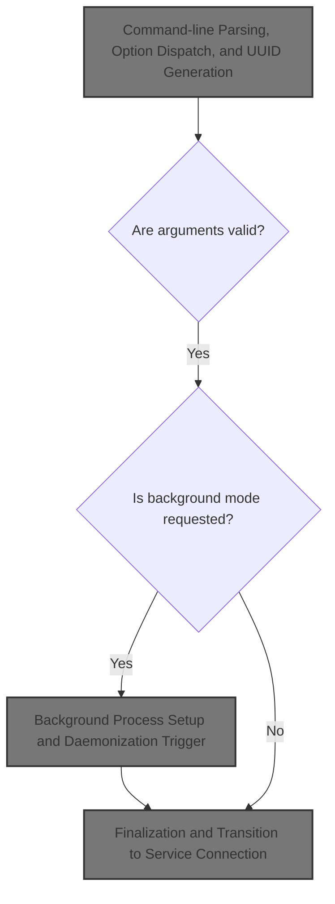
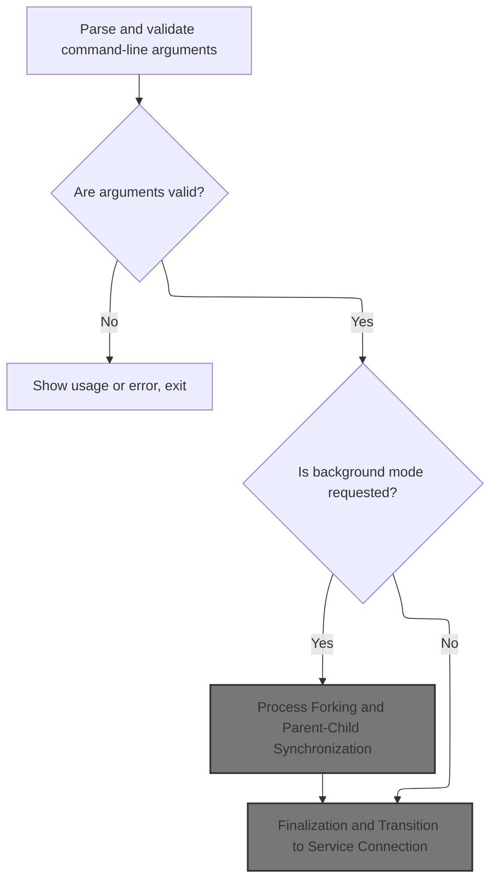
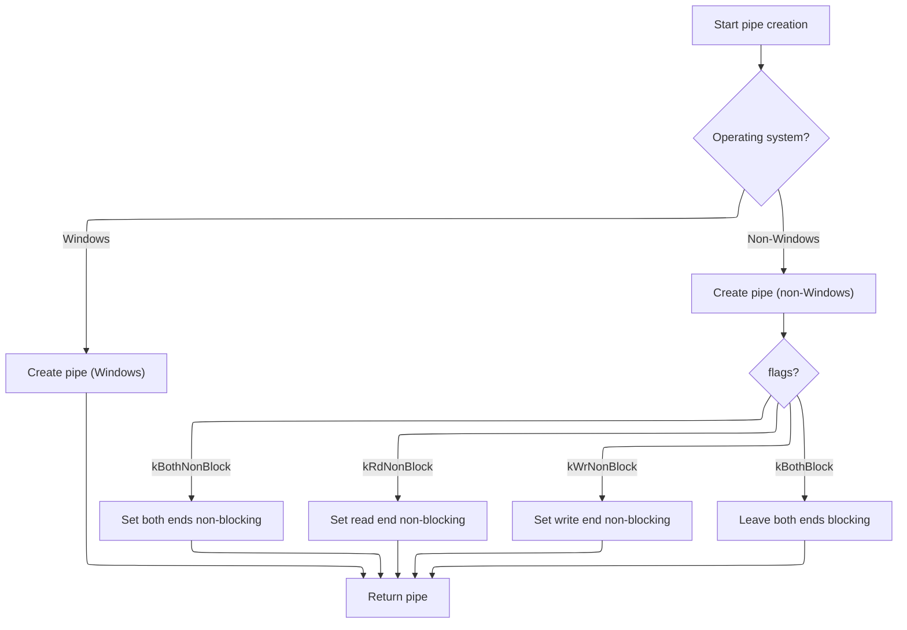
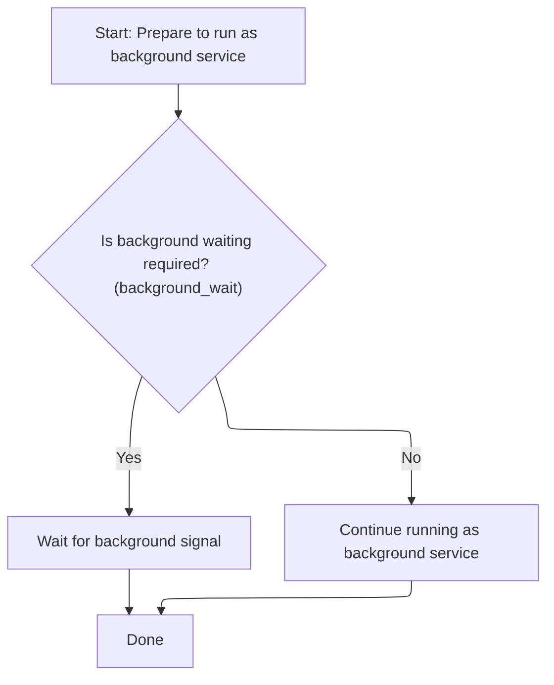
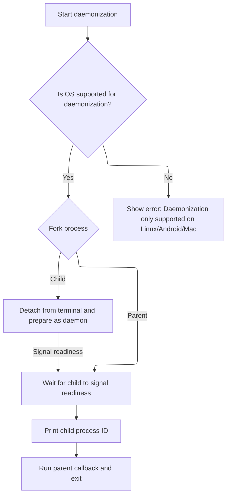

This document describes how a tracing session is prepared and initialized based on user-provided command-line options. The flow supports both foreground and background execution, interpreting configuration sources, validating options, and managing the transition to the tracing service. Input consists of command-line arguments and configuration; output is a ready-to-run tracing session.



# Where is this flow used?

This flow is used multiple times in the codebase as represented in the following diagram:

```mermaid
graph TD;
      8356d2a73096c84b6c835496b1194fe6775670536d8c6d9262dee27f51f4ee0c(src/perfetto_cmd/perfetto_cmd.cc::CloneSessionOnThread) --> ff4c8cd6dc121e29e70f9786208af439c709ab841c9c5a9a7f76b40bcb8f361a(src/perfetto_cmd/perfetto_cmd.cc::ParseCmdlineAndMaybeDaemonize):::mainFlowStyle

2d262f3d4636ba5ea282f6296ff3e1ccbdbcb2b9868c8d9a574ba4d2c3024718(src/perfetto_cmd/perfetto_cmd.cc::PerfettoCmdMain) --> ff4c8cd6dc121e29e70f9786208af439c709ab841c9c5a9a7f76b40bcb8f361a(src/perfetto_cmd/perfetto_cmd.cc::ParseCmdlineAndMaybeDaemonize):::mainFlowStyle

68b72b107a63b404ea2ff852b76cb2ffaf1947f467cc864a36eab7c5ac4c7b1c(src/perfetto_cmd/main.cc::main) --> 2d262f3d4636ba5ea282f6296ff3e1ccbdbcb2b9868c8d9a574ba4d2c3024718(src/perfetto_cmd/perfetto_cmd.cc::PerfettoCmdMain)

356fca2eeb9f2825d1d39deee71ae27ead328da0981089bb1aebb8e828ffe809(src/tracebox/tracebox.cc::TraceboxMain) --> ff4c8cd6dc121e29e70f9786208af439c709ab841c9c5a9a7f76b40bcb8f361a(src/perfetto_cmd/perfetto_cmd.cc::ParseCmdlineAndMaybeDaemonize):::mainFlowStyle

351539497428922254837430434b339e22f24f06341b2940a73e808161267b70(src/tracebox/tracebox.cc::main) --> 356fca2eeb9f2825d1d39deee71ae27ead328da0981089bb1aebb8e828ffe809(src/tracebox/tracebox.cc::TraceboxMain)


classDef mainFlowStyle color:#000000,fill:#7CB9F4
classDef rootsStyle color:#000000,fill:#00FFF4
classDef Style1 color:#000000,fill:#00FFAA
classDef Style2 color:#000000,fill:#FFFF00
classDef Style3 color:#000000,fill:#AA7CB9

%% Swimm:
%% graph TD;
%%       8356d2a73096c84b6c835496b1194fe6775670536d8c6d9262dee27f51f4ee0c(<SwmPath>[src/perfetto_cmd/perfetto_cmd.cc](src/perfetto_cmd/perfetto_cmd.cc)</SwmPath>::<SwmToken path="src/perfetto_cmd/perfetto_cmd.cc" pos="1562:1:1" line-data="  CloneSessionOnThread(tsid, cmdline, kSingleExtraThread, trigger, nullptr);">`CloneSessionOnThread`</SwmToken>) --> ff4c8cd6dc121e29e70f9786208af439c709ab841c9c5a9a7f76b40bcb8f361a(<SwmPath>[src/perfetto_cmd/perfetto_cmd.cc](src/perfetto_cmd/perfetto_cmd.cc)</SwmPath>::<SwmToken path="src/perfetto_cmd/perfetto_cmd.cc" pos="209:9:9" line-data="std::optional&lt;int&gt; PerfettoCmd::ParseCmdlineAndMaybeDaemonize(int argc,">`ParseCmdlineAndMaybeDaemonize`</SwmToken>):::mainFlowStyle
%% 
%% 2d262f3d4636ba5ea282f6296ff3e1ccbdbcb2b9868c8d9a574ba4d2c3024718(<SwmPath>[src/perfetto_cmd/perfetto_cmd.cc](src/perfetto_cmd/perfetto_cmd.cc)</SwmPath>::<SwmToken path="src/perfetto_cmd/perfetto_cmd.cc" pos="1579:17:17" line-data="    // The destructor of the main-thread&#39;s PerfettoCmdMain will destroy and">`PerfettoCmdMain`</SwmToken>) --> ff4c8cd6dc121e29e70f9786208af439c709ab841c9c5a9a7f76b40bcb8f361a(<SwmPath>[src/perfetto_cmd/perfetto_cmd.cc](src/perfetto_cmd/perfetto_cmd.cc)</SwmPath>::<SwmToken path="src/perfetto_cmd/perfetto_cmd.cc" pos="209:9:9" line-data="std::optional&lt;int&gt; PerfettoCmd::ParseCmdlineAndMaybeDaemonize(int argc,">`ParseCmdlineAndMaybeDaemonize`</SwmToken>):::mainFlowStyle
%% 
%% 68b72b107a63b404ea2ff852b76cb2ffaf1947f467cc864a36eab7c5ac4c7b1c(<SwmPath>[src/perfetto_cmd/main.cc](src/perfetto_cmd/main.cc)</SwmPath>::main) --> 2d262f3d4636ba5ea282f6296ff3e1ccbdbcb2b9868c8d9a574ba4d2c3024718(<SwmPath>[src/perfetto_cmd/perfetto_cmd.cc](src/perfetto_cmd/perfetto_cmd.cc)</SwmPath>::<SwmToken path="src/perfetto_cmd/perfetto_cmd.cc" pos="1579:17:17" line-data="    // The destructor of the main-thread&#39;s PerfettoCmdMain will destroy and">`PerfettoCmdMain`</SwmToken>)
%% 
%% 356fca2eeb9f2825d1d39deee71ae27ead328da0981089bb1aebb8e828ffe809(<SwmPath>[src/tracebox/tracebox.cc](src/tracebox/tracebox.cc)</SwmPath>::TraceboxMain) --> ff4c8cd6dc121e29e70f9786208af439c709ab841c9c5a9a7f76b40bcb8f361a(<SwmPath>[src/perfetto_cmd/perfetto_cmd.cc](src/perfetto_cmd/perfetto_cmd.cc)</SwmPath>::<SwmToken path="src/perfetto_cmd/perfetto_cmd.cc" pos="209:9:9" line-data="std::optional&lt;int&gt; PerfettoCmd::ParseCmdlineAndMaybeDaemonize(int argc,">`ParseCmdlineAndMaybeDaemonize`</SwmToken>):::mainFlowStyle
%% 
%% 351539497428922254837430434b339e22f24f06341b2940a73e808161267b70(<SwmPath>[src/tracebox/tracebox.cc](src/tracebox/tracebox.cc)</SwmPath>::main) --> 356fca2eeb9f2825d1d39deee71ae27ead328da0981089bb1aebb8e828ffe809(<SwmPath>[src/tracebox/tracebox.cc](src/tracebox/tracebox.cc)</SwmPath>::TraceboxMain)
%% 
%% 
%% classDef mainFlowStyle color:#000000,fill:#7CB9F4
%% classDef rootsStyle color:#000000,fill:#00FFF4
%% classDef Style1 color:#000000,fill:#00FFAA
%% classDef Style2 color:#000000,fill:#FFFF00
%% classDef Style3 color:#000000,fill:#AA7CB9
```



# Command-line Parsing, Option Dispatch, and UUID Generation



<SwmSnippet path="/src/perfetto_cmd/perfetto_cmd.cc" line="209">

---

In <SwmToken path="src/perfetto_cmd/perfetto_cmd.cc" pos="209:9:9" line-data="std::optional&lt;int&gt; PerfettoCmd::ParseCmdlineAndMaybeDaemonize(int argc,">`ParseCmdlineAndMaybeDaemonize`</SwmToken>, this is where we kick off the flow: we parse all command-line options, validate them, and load the trace configuration from various sources (file, stdin, inline, test, memory). We also set up internal state, handle Android-specific flags (upload, dropbox, incidentd, reporter configs), and prep output handling and triggers. This is the main hub for initializing everything before any tracing or querying happens.

```c++
std::optional<int> PerfettoCmd::ParseCmdlineAndMaybeDaemonize(int argc,
                                                              char** argv) {
#if !PERFETTO_BUILDFLAG(PERFETTO_OS_WIN)
  umask(0000);  // make sure that file creation is not affected by umask.
#endif
  enum LongOption {
    OPT_ALERT_ID = 1000,
    OPT_BUGREPORT,
    OPT_BUGREPORT_ALL,
    OPT_CLONE,
    OPT_CLONE_BY_NAME,
    OPT_CLONE_SKIP_FILTER,
    OPT_CONFIG_ID,
    OPT_CONFIG_UID,
    OPT_SUBSCRIPTION_ID,
    OPT_RESET_GUARDRAILS,
    OPT_PBTXT_CONFIG,
    OPT_DROPBOX,
    OPT_UPLOAD,
    OPT_IGNORE_GUARDRAILS,
    OPT_DETACH,
    OPT_ATTACH,
    OPT_IS_DETACHED,
    OPT_STOP,
    OPT_QUERY,
    OPT_LONG,
    OPT_QUERY_RAW,
    OPT_VERSION,
    OPT_NOTIFY_FD,
  };
  static const option long_options[] = {
      {"help", no_argument, nullptr, 'h'},
      {"config", required_argument, nullptr, 'c'},
      {"out", required_argument, nullptr, 'o'},
      {"background", no_argument, nullptr, 'd'},
      {"background-wait", no_argument, nullptr, 'D'},
      {"time", required_argument, nullptr, 't'},
      {"buffer", required_argument, nullptr, 'b'},
      {"size", required_argument, nullptr, 's'},
      {"app", required_argument, nullptr, 'a'},
      {"no-guardrails", no_argument, nullptr, OPT_IGNORE_GUARDRAILS},
      {"txt", no_argument, nullptr, OPT_PBTXT_CONFIG},
      {"upload", no_argument, nullptr, OPT_UPLOAD},
      {"dropbox", required_argument, nullptr, OPT_DROPBOX},
      {"alert-id", required_argument, nullptr, OPT_ALERT_ID},
      {"config-id", required_argument, nullptr, OPT_CONFIG_ID},
      {"config-uid", required_argument, nullptr, OPT_CONFIG_UID},
      {"subscription-id", required_argument, nullptr, OPT_SUBSCRIPTION_ID},
      {"reset-guardrails", no_argument, nullptr, OPT_RESET_GUARDRAILS},
      {"detach", required_argument, nullptr, OPT_DETACH},
      {"attach", required_argument, nullptr, OPT_ATTACH},
      {"clone", required_argument, nullptr, OPT_CLONE},
      {"clone-by-name", required_argument, nullptr, OPT_CLONE_BY_NAME},
      {"clone-for-bugreport", no_argument, nullptr, OPT_CLONE_SKIP_FILTER},
      {"is_detached", required_argument, nullptr, OPT_IS_DETACHED},
      {"stop", no_argument, nullptr, OPT_STOP},
      {"query", no_argument, nullptr, OPT_QUERY},
      {"long", no_argument, nullptr, OPT_LONG},
      {"query-raw", no_argument, nullptr, OPT_QUERY_RAW},
      {"version", no_argument, nullptr, OPT_VERSION},
      {"save-for-bugreport", no_argument, nullptr, OPT_BUGREPORT},
      {"save-all-for-bugreport", no_argument, nullptr, OPT_BUGREPORT_ALL},
      {"notify-fd", required_argument, nullptr, OPT_NOTIFY_FD},
      {nullptr, 0, nullptr, 0}};

  std::string config_file_name;
  std::string trace_config_raw;
  bool parse_as_pbtxt = false;
  TraceConfig::StatsdMetadata statsd_metadata;

  ConfigOptions config_options;
  bool has_config_options = false;

  if (argc <= 1) {
    PrintUsage(argv[0]);
    return 1;
  }

  // getopt is not thread safe and cmdline parsing requires a mutex for the case
  // of concurrent cmdline parsing for bugreport snapshots.
  static base::NoDestructor<std::mutex> getopt_mutex;
  std::unique_lock<std::mutex> getopt_lock(getopt_mutex.ref());

  optind = 1;  // Reset getopt state. It's reused by the snapshot thread.
  for (;;) {
    int option =
        getopt_long(argc, argv, "hc:o:dDt:b:s:a:", long_options, nullptr);

    if (option == -1)
      break;  // EOF.

    if (option == 'c') {
      config_file_name = std::string(optarg);
      if (strcmp(optarg, "-") == 0) {
#if PERFETTO_BUILDFLAG(PERFETTO_OS_WIN)
        // We don't want the runtime to replace "\n" with "\r\n" on `std::cin`.
        _setmode(_fileno(stdin), _O_BINARY);
#endif
        std::istreambuf_iterator<char> begin(std::cin), end;
        trace_config_raw.assign(begin, end);
      } else if (strcmp(optarg, ":test") == 0) {
        TraceConfig test_config;
        ConfigOptions opts;
        opts.time = "2s";
        opts.categories.emplace_back("sched/sched_switch");
        opts.categories.emplace_back("power/cpu_idle");
        opts.categories.emplace_back("power/cpu_frequency");
        opts.categories.emplace_back("power/gpu_frequency");
        PERFETTO_CHECK(CreateConfigFromOptions(opts, &test_config));
        trace_config_raw = test_config.SerializeAsString();
      } else if (strcmp(optarg, ":mem") == 0) {
        // This is used by OnCloneSnapshotTriggerReceived(), which passes the
        // original trace config as a member field. This is needed because, in
        // the new PerfettoCmd instance, we need to know upfront trace config
        // fields that affect the behaviour of perfetto_cmd, e.g., the guardrail
        // overrides, the unique_session_name, the reporter API package etc.
        PERFETTO_CHECK(!snapshot_config_.empty());
        trace_config_raw = snapshot_config_;
      } else {
        if (!base::ReadFile(optarg, &trace_config_raw)) {
#if PERFETTO_BUILDFLAG(PERFETTO_ANDROID_BUILD)
          PERFETTO_PLOG(
              "Could not open %s. If this is a permission denied error, try "
              "placing the config in /data/misc/perfetto-configs: Perfetto "
              "should always be able to access this directory.",
              optarg);
#else
          PERFETTO_PLOG("Could not open %s", optarg);
#endif
          return 1;
        }
      }
      continue;
    }

    if (option == 'o') {
      trace_out_path_ = optarg;
      continue;
    }

    if (option == 'd') {
      background_ = true;
      continue;
    }

    if (option == 'D') {
      background_ = true;
      background_wait_ = true;
      continue;
    }

    if (option == OPT_CLONE) {
      clone_tsid_ = static_cast<TracingSessionID>(atoll(optarg));
      continue;
    }

    if (option == OPT_CLONE_BY_NAME) {
      clone_name_ = optarg;
      continue;
    }

    if (option == OPT_CLONE_SKIP_FILTER) {
      clone_for_bugreport_ = true;
      continue;
    }

    if (option == 't') {
      has_config_options = true;
      config_options.time = std::string(optarg);
      continue;
    }

    if (option == 'b') {
      has_config_options = true;
      config_options.buffer_size = std::string(optarg);
      continue;
    }

    if (option == 's') {
      has_config_options = true;
      config_options.max_file_size = std::string(optarg);
      continue;
    }

    if (option == 'a') {
      config_options.atrace_apps.push_back(std::string(optarg));
      has_config_options = true;
      continue;
    }

    if (option == OPT_UPLOAD) {
#if PERFETTO_BUILDFLAG(PERFETTO_OS_ANDROID)
      upload_flag_ = true;
      continue;
#else
      PERFETTO_ELOG("--upload is only supported on Android");
      return 1;
#endif
    }

    if (option == OPT_DROPBOX) {
#if PERFETTO_BUILDFLAG(PERFETTO_OS_ANDROID)
      PERFETTO_CHECK(optarg);
      upload_flag_ = true;
      continue;
#else
      PERFETTO_ELOG("--dropbox is only supported on Android");
      return 1;
#endif
    }

    if (option == OPT_PBTXT_CONFIG) {
      parse_as_pbtxt = true;
      continue;
    }

    if (option == OPT_IGNORE_GUARDRAILS) {
      ignore_guardrails_ = true;
      continue;
    }

    if (option == OPT_RESET_GUARDRAILS) {
      PERFETTO_ILOG(
          "Guardrails no longer exist in perfetto_cmd; this option only exists "
          "for backwards compatibility.");
      return 0;
    }

    if (option == OPT_ALERT_ID) {
      statsd_metadata.set_triggering_alert_id(atoll(optarg));
      continue;
    }

    if (option == OPT_CONFIG_ID) {
      statsd_metadata.set_triggering_config_id(atoll(optarg));
      continue;
    }

    if (option == OPT_CONFIG_UID) {
      statsd_metadata.set_triggering_config_uid(atoi(optarg));
      continue;
    }

    if (option == OPT_SUBSCRIPTION_ID) {
      statsd_metadata.set_triggering_subscription_id(atoll(optarg));
      continue;
    }

    if (option == OPT_DETACH) {
      detach_key_ = std::string(optarg);
      PERFETTO_CHECK(!detach_key_.empty());
      continue;
    }

    if (option == OPT_ATTACH) {
      attach_key_ = std::string(optarg);
      PERFETTO_CHECK(!attach_key_.empty());
      continue;
    }

    if (option == OPT_IS_DETACHED) {
      attach_key_ = std::string(optarg);
      redetach_once_attached_ = true;
      PERFETTO_CHECK(!attach_key_.empty());
      continue;
    }

    if (option == OPT_STOP) {
      stop_trace_once_attached_ = true;
      continue;
    }

    if (option == OPT_QUERY) {
      query_service_ = true;
      continue;
    }

    if (option == OPT_LONG) {
      query_service_long_ = true;
      continue;
    }

    if (option == OPT_QUERY_RAW) {
      query_service_ = true;
      query_service_output_raw_ = true;
      continue;
    }

    if (option == OPT_VERSION) {
      printf("%s\n", base::GetVersionString());
      return 0;
    }

    if (option == OPT_BUGREPORT) {
      bugreport_ = true;
      continue;
    }

    if (option == OPT_BUGREPORT_ALL) {
      clone_all_bugreport_traces_ = true;
      continue;
    }

    if (option == OPT_NOTIFY_FD) {
#if !PERFETTO_BUILDFLAG(PERFETTO_OS_WIN)
      notify_fd_.reset(atoi(optarg));
      continue;
#else
      PERFETTO_ELOG("--notify-fd is not supported on Windows");
      return 1;
#endif
    }

    PrintUsage(argv[0]);
    return 1;
  }
```

---

</SwmSnippet>

<SwmSnippet path="/src/perfetto_cmd/perfetto_cmd.cc" line="526">

---

After parsing all the options, we grab any leftover command-line arguments and treat them as tracing categories, adding them to the config options. This lets users specify categories directly on the command line.

```c++
  for (ssize_t i = optind; i < argc; i++) {
    has_config_options = true;
    config_options.categories.push_back(argv[i]);
  }
```

---

</SwmSnippet>

<SwmSnippet path="/src/perfetto_cmd/perfetto_cmd.cc" line="530">

---

After parsing and validating all the options and config sources, we check for invalid combinations, handle bugreport/snapshot overrides, and parse the trace config. If the config doesn't have a UUID, we call <SwmToken path="src/perfetto_cmd/perfetto_cmd.cc" pos="646:11:11" line-data="    base::Uuid uuid = base::Uuidv4();">`Uuidv4`</SwmToken> to generate one for the session.

```c++
  getopt_lock.unlock();

  if (query_service_ && (is_detach() || is_attach() || background_)) {
    PERFETTO_ELOG("--query cannot be combined with any other argument");
    return 1;
  }

  if (query_service_long_ && !query_service_) {
    PERFETTO_ELOG("--long can only be used with --query");
    return 1;
  }

  if (is_detach() && is_attach()) {
    PERFETTO_ELOG("--attach and --detach are mutually exclusive");
    return 1;
  }

  if (is_detach() && background_) {
    PERFETTO_ELOG("--detach and --background are mutually exclusive");
    return 1;
  }

  if (stop_trace_once_attached_ && !is_attach()) {
    PERFETTO_ELOG("--stop is supported only in combination with --attach");
    return 1;
  }

  if ((bugreport_ || clone_all_bugreport_traces_) &&
      (is_attach() || is_detach() || query_service_ || has_config_options ||
       background_wait_)) {
    PERFETTO_ELOG("--save-for-bugreport cannot take any other argument");
    return 1;
  }

  if (clone_tsid_ && !clone_name_.empty()) {
    PERFETTO_ELOG("--clone and --clone-by-name are mutually exclusive");
    return 1;
  }

  if (clone_for_bugreport_ && !is_clone()) {
    PERFETTO_ELOG("--clone-for-bugreport requires --clone or --clone-by-name");
    return 1;
  }

  // --save-for-bugreport is the equivalent of:
  // --clone kBugreportSessionId -o /data/misc/perfetto-traces/bugreport/...
  if (bugreport_ && trace_out_path_.empty()) {
    PERFETTO_LOG("Invoked perfetto with --save-for-bugreport");
    clone_tsid_ = kBugreportSessionId;
    clone_for_bugreport_ = true;
    trace_out_path_ = GetBugreportTracePath();
  }

  // Parse the trace config. It can be either:
  // 1) A proto-encoded file/stdin (-c ...).
  // 2) A proto-text file/stdin (-c ... --txt).
  // 3) A set of option arguments (-t 10s -s 10m).
  // The only cases in which a trace config is not expected is --attach.
  // For this we are just acting on already existing sessions.
  trace_config_.reset(new TraceConfig());

  bool parsed = false;
  bool cfg_could_be_txt = false;
  const bool will_trace_or_trigger =
      !is_attach() && !query_service_ && !clone_all_bugreport_traces_;
  if (!will_trace_or_trigger) {
    if ((!trace_config_raw.empty() || has_config_options)) {
      PERFETTO_ELOG("Cannot specify a trace config with this option");
      return 1;
    }
  } else if (has_config_options) {
    if (!trace_config_raw.empty()) {
      PERFETTO_ELOG(
          "Cannot specify both -c/--config and any of --time, --size, "
          "--buffer, --app, ATRACE_CAT, FTRACE_EVENT");
      return 1;
    }
    parsed = CreateConfigFromOptions(config_options, trace_config_.get());
  } else {
    if (trace_config_raw.empty() && !is_clone()) {
      PERFETTO_ELOG("The TraceConfig is empty");
      return 1;
    }
    PERFETTO_DLOG("Parsing TraceConfig, %zu bytes", trace_config_raw.size());
    if (parse_as_pbtxt) {
      parsed = ParseTraceConfigPbtxt(config_file_name, trace_config_raw,
                                     trace_config_.get());
    } else {
      parsed = trace_config_->ParseFromString(trace_config_raw);
      cfg_could_be_txt =
          !parsed && std::all_of(trace_config_raw.begin(),
                                 trace_config_raw.end(), [](char c) {
                                   // This is equiv to: isprint(c) || isspace(x)
                                   // but doesn't depend on and load the locale.
                                   return (c >= 32 && c <= 126) ||
                                          (c >= 9 && c <= 13);
                                 });
    }
  }

  if (parsed) {
    *trace_config_->mutable_statsd_metadata() = std::move(statsd_metadata);
    trace_config_raw.clear();
  } else if (will_trace_or_trigger && !is_clone()) {
    PERFETTO_ELOG("The trace config is invalid, bailing out.");
    if (cfg_could_be_txt) {
      PERFETTO_ELOG(
          "Looks like you are passing a textual config but I'm expecting a "
          "proto-encoded binary config.");
      PERFETTO_ELOG("Try adding --txt to the cmdline.");
    }
    return 1;
  }

  if (trace_config_->trace_uuid_lsb() == 0 &&
      trace_config_->trace_uuid_msb() == 0) {
    base::Uuid uuid = base::Uuidv4();
```

---

</SwmSnippet>

<SwmSnippet path="/src/base/uuid.cc" line="38">

---

<SwmToken path="src/base/uuid.cc" pos="38:2:2" line-data="Uuid Uuidv4() {">`Uuidv4`</SwmToken> generates a UUID by mixing boot time, wall time, code ASLR, and stack ASLR as entropy sources, then seeds a std::<SwmToken path="src/base/uuid.cc" pos="65:3:3" line-data="  std::seed_seq entropy_seq(entropy, entropy + ArraySize(entropy));">`seed_seq`</SwmToken> to produce the UUID. It avoids <SwmToken path="src/base/uuid.cc" pos="44:13:16" line-data="  // We deliberately don&#39;t use /dev/urandom as that might block for">`/dev/urandom`</SwmToken> for portability and non-blocking reasons.

```c++
Uuid Uuidv4() {
  // Mix different sources of entropy to reduce the chances of collisions.
  // Only using boot time is not enough. Under the assumption that most traces
  // are started around the same time at boot, within a 1s window, the birthday
  // paradox gives a chance of 90% collisions with 70k traces over a 1e9 space
  // (Number of ns in a 1s window).
  // We deliberately don't use /dev/urandom as that might block for
  // unpredictable time if the system is idle (and is not portable).
  // The UUID does NOT need to be cryptographically secure, but random enough
  // to avoid collisions across a large number of devices.
  uint64_t boot_ns = static_cast<uint64_t>(GetBootTimeNs().count());
  uint64_t epoch_ns = static_cast<uint64_t>(GetWallTimeNs().count());

  // Use code ASLR as entropy source.
  uint32_t code_ptr =
      static_cast<uint32_t>(reinterpret_cast<uint64_t>(&Uuidv4) >> 12);

  // Use stack ASLR as a further entropy source.
  uint32_t stack_ptr =
      static_cast<uint32_t>(reinterpret_cast<uint64_t>(&code_ptr) >> 12);

  uint32_t entropy[] = {static_cast<uint32_t>(boot_ns >> 32),
                        static_cast<uint32_t>(boot_ns),
                        static_cast<uint32_t>(epoch_ns >> 32),
                        static_cast<uint32_t>(epoch_ns),
                        code_ptr,
                        stack_ptr};
  std::seed_seq entropy_seq(entropy, entropy + ArraySize(entropy));

  auto words = std::array<uint32_t, 4>();
  entropy_seq.generate(words.begin(), words.end());
  uint64_t msb = static_cast<uint64_t>(words[0]) << 32u | words[1];
  uint64_t lsb = static_cast<uint64_t>(words[2]) << 32u | words[3];
  return Uuid(static_cast<int64_t>(lsb), static_cast<int64_t>(msb));
}
```

---

</SwmSnippet>

<SwmSnippet path="/src/perfetto_cmd/perfetto_cmd.cc" line="647">

---

Back in <SwmToken path="src/perfetto_cmd/perfetto_cmd.cc" pos="209:9:9" line-data="std::optional&lt;int&gt; PerfettoCmd::ParseCmdlineAndMaybeDaemonize(int argc,">`ParseCmdlineAndMaybeDaemonize`</SwmToken>, we use the UUID from <SwmToken path="src/perfetto_cmd/perfetto_cmd.cc" pos="646:11:11" line-data="    base::Uuid uuid = base::Uuidv4();">`Uuidv4`</SwmToken> to set the trace config's UUID fields and internal string. Then we validate Android-specific configs (incidentd, reporter), check for mutually exclusive settings, and set flags for upload, reporting, and output handling.

```c++
    if (trace_config_->statsd_metadata().triggering_subscription_id()) {
      uuid.set_lsb(
          trace_config_->statsd_metadata().triggering_subscription_id());
    }
    uuid_ = uuid.ToString();
    trace_config_->set_trace_uuid_msb(uuid.msb());
    trace_config_->set_trace_uuid_lsb(uuid.lsb());
  } else {
    base::Uuid uuid(trace_config_->trace_uuid_lsb(),
                    trace_config_->trace_uuid_msb());
    uuid_ = uuid.ToString();
  }

  const auto& delay = trace_config_->cmd_trace_start_delay();
  if (delay.has_max_delay_ms() != delay.has_min_delay_ms()) {
    PERFETTO_ELOG("cmd_trace_start_delay field is only partially specified.");
    return 1;
  }

  bool has_incidentd_package =
      !trace_config_->incident_report_config().destination_package().empty();
  if (has_incidentd_package && !upload_flag_) {
    PERFETTO_ELOG(
        "Unexpected IncidentReportConfig without --dropbox / --upload.");
    return 1;
  }

  bool has_android_reporter_package = !trace_config_->android_report_config()
                                           .reporter_service_package()
                                           .empty();
  if (has_android_reporter_package && !upload_flag_) {
    PERFETTO_ELOG(
        "Unexpected AndroidReportConfig without --dropbox / --upload.");
    return 1;
  }

  if (has_incidentd_package && has_android_reporter_package) {
    PERFETTO_ELOG(
        "Only one of IncidentReportConfig and AndroidReportConfig "
        "allowed in the same config.");
    return 1;
  }

  // If the upload flag is set, we can only be doing one of three things:
  // 1. Reporting to either incidentd or Android framework.
  // 2. Skipping incidentd/Android report because it was explicitly
  //    specified in the config.
  // 3. Activating triggers.
  bool incidentd_valid =
      has_incidentd_package ||
      trace_config_->incident_report_config().skip_incidentd();
  bool android_report_valid =
      has_android_reporter_package ||
      trace_config_->android_report_config().skip_report();
  bool has_triggers = !trace_config_->activate_triggers().empty();
  if (upload_flag_ && !incidentd_valid && !android_report_valid &&
      !has_triggers) {
    PERFETTO_ELOG(
        "One of IncidentReportConfig, AndroidReportConfig or activate_triggers "
        "must be specified with --dropbox / --upload.");
    return 1;
  }

  // Only save to incidentd if:
  // 1) |destination_package| is set
  // 2) |skip_incidentd| is absent or false.
  // 3) we are not simply activating triggers.
  save_to_incidentd_ =
      has_incidentd_package &&
      !trace_config_->incident_report_config().skip_incidentd() &&
      !has_triggers;

  // Only report to the Android framework if:
  // 1) |reporter_service_package| is set
  // 2) |skip_report| is absent or false.
  // 3) we are not simply activating triggers.
  report_to_android_framework_ =
      has_android_reporter_package &&
      !trace_config_->android_report_config().skip_report() && !has_triggers;

  // Respect the wishes of the config with respect to statsd logging or fall
  // back on the presence of the --upload flag if not set.
  switch (trace_config_->statsd_logging()) {
    case TraceConfig::STATSD_LOGGING_ENABLED:
      statsd_logging_ = true;
      break;
    case TraceConfig::STATSD_LOGGING_DISABLED:
      statsd_logging_ = false;
      break;
    case TraceConfig::STATSD_LOGGING_UNSPECIFIED:
      statsd_logging_ = upload_flag_;
      break;
  }
  trace_config_->set_statsd_logging(statsd_logging_
                                        ? TraceConfig::STATSD_LOGGING_ENABLED
                                        : TraceConfig::STATSD_LOGGING_DISABLED);

  // Set up the output file. Either --out or --upload are expected, with the
  // only exception of --attach. In this case the output file is passed when
  // detaching.
  if (!trace_out_path_.empty() && upload_flag_) {
    PERFETTO_ELOG(
        "Can't log to a file (--out) and incidentd (--upload) at the same "
        "time");
    return 1;
  }

  if (!trace_config_->output_path().empty()) {
    if (!trace_out_path_.empty() || upload_flag_) {
      PERFETTO_ELOG(
          "Can't pass --out or --upload if output_path is set in the "
          "trace config");
      return 1;
    }
    if (base::FileExists(trace_config_->output_path())) {
      PERFETTO_ELOG(
          "The output_path must not exist, the service cannot overwrite "
          "existing files for security reasons. Remove %s or use a different "
          "path.",
          trace_config_->output_path().c_str());
      return 1;
    }
  }

  // |activate_triggers| in the trace config is shorthand for trigger_perfetto.
  // In this case we don't intend to send any trace config to the service,
  // rather use that as a signal to the cmdline client to connect as a producer
  // and activate triggers.
  if (has_triggers) {
    for (const auto& trigger : trace_config_->activate_triggers()) {
      triggers_to_activate_.push_back(trigger);
    }
```

---

</SwmSnippet>

<SwmSnippet path="/src/perfetto_cmd/perfetto_cmd.cc" line="779">

---

We set up a pipe for background/wait mode to sync parent and child before daemonizing.

```c++
    trace_config_.reset(new TraceConfig());
  }

  bool open_out_file = true;
  if (!will_trace_or_trigger) {
    open_out_file = false;
    if (!trace_out_path_.empty() || upload_flag_) {
      PERFETTO_ELOG("Can't pass an --out file (or --upload) with this option");
      return 1;
    }
  } else if (!triggers_to_activate_.empty() ||
             (trace_config_->write_into_file() &&
              !trace_config_->output_path().empty())) {
    open_out_file = false;
  } else if (trace_out_path_.empty() && !upload_flag_) {
    PERFETTO_ELOG("Either --out or --upload is required");
    return 1;
  } else if (is_detach() && !trace_config_->write_into_file()) {
    // In detached mode we must pass the file descriptor to the service and
    // let that one write the trace. We cannot use the IPC readback code path
    // because the client process is about to exit soon after detaching.
    // We could support detach && !write_into_file, but that would make the
    // cmdline logic more complex. The feasible configurations are:
    // 1. Using write_into_file and passing the file path on the --detach call.
    // 2. Using pure ring-buffer mode, setting write_into_file = false and
    //    passing the output file path to the --attach call.
    // This is too complicated and harder to reason about, so we support only 1.
    // Traceur gets around this by always setting write_into_file and specifying
    // file_write_period_ms = 1week (which effectively means: write into the
    // file only at the end of the trace) to achieve ring buffer traces.
    PERFETTO_ELOG(
        "TraceConfig's write_into_file must be true when using --detach");
    return 1;
  }
  if (open_out_file) {
    if (!OpenOutputFile())
      return 1;
    if (!trace_config_->write_into_file())
      packet_writer_.emplace(trace_out_stream_.get());
  }

  bool will_trace_indefinitely =
      trace_config_->duration_ms() == 0 &&
      trace_config_->trigger_config().trigger_timeout_ms() == 0;
  if (will_trace_indefinitely && save_to_incidentd_ && !ignore_guardrails_) {
    PERFETTO_ELOG("Can't trace indefinitely when tracing to Incidentd.");
    return 1;
  }

  if (will_trace_indefinitely && report_to_android_framework_ &&
      !ignore_guardrails_) {
    PERFETTO_ELOG(
        "Can't trace indefinitely when reporting to Android framework.");
    return 1;
  }

  if (background_) {
    if (background_wait_) {
#if !PERFETTO_BUILDFLAG(PERFETTO_OS_WIN)
      background_wait_pipe_ = base::Pipe::Create(base::Pipe::kRdNonBlock);
#endif
    }

```

---

</SwmSnippet>

## Pipe Creation and Ownership Transfer



<SwmSnippet path="/src/base/pipe.cc" line="41">

---

In Pipe::Create, we create a pipe using platform-specific syscalls, set <SwmToken path="src/base/pipe.cc" pos="48:14:14" line-data="  PERFETTO_CHECK(fcntl(fds[0], F_SETFD, FD_CLOEXEC) == 0);">`FD_CLOEXEC`</SwmToken> on POSIX, and prep the handles for ownership transfer. Next, we call reset to move the handles into owned_ptr wrappers for safe management.

```c++
Pipe Pipe::Create(Flags flags) {
  PlatformHandle fds[2];
#if PERFETTO_BUILDFLAG(PERFETTO_OS_WIN)
  PERFETTO_CHECK(::CreatePipe(&fds[0], &fds[1], /*lpPipeAttributes=*/nullptr,
                              0 /*default size*/));
#else
  PERFETTO_CHECK(pipe(fds) == 0);
  PERFETTO_CHECK(fcntl(fds[0], F_SETFD, FD_CLOEXEC) == 0);
  PERFETTO_CHECK(fcntl(fds[1], F_SETFD, FD_CLOEXEC) == 0);
#endif
  Pipe p;
  p.rd.reset(fds[0]);
  p.wr.reset(fds[1]);

#if !PERFETTO_BUILDFLAG(PERFETTO_OS_WIN)
```

---

</SwmSnippet>

<SwmSnippet path="/src/protovm/owned_ptr.h" line="65">

---

Reset in owned_ptr only sets the internal pointer if it's currently null, enforcing single ownership and catching double-assignment bugs early.

```c
  void reset(T* p = pointer()) noexcept {
    PERFETTO_DCHECK(p_ == nullptr);
    p_ = p;
  }
```

---

</SwmSnippet>

<SwmSnippet path="/src/base/pipe.cc" line="56">

---

We set non-blocking mode on the pipe ends if needed, using fcntl and error checks.

```c++
  if (flags == kBothNonBlock || flags == kRdNonBlock) {
    int cur_flags = fcntl(*p.rd, F_GETFL, 0);
    PERFETTO_CHECK(cur_flags >= 0);
    PERFETTO_CHECK(fcntl(*p.rd, F_SETFL, cur_flags | O_NONBLOCK) == 0);
  }

  if (flags == kBothNonBlock || flags == kWrNonBlock) {
    int cur_flags = fcntl(*p.wr, F_GETFL, 0);
    PERFETTO_CHECK(cur_flags >= 0);
    PERFETTO_CHECK(fcntl(*p.wr, F_SETFL, cur_flags | O_NONBLOCK) == 0);
  }
#else
  PERFETTO_CHECK(flags == kBothBlock);
#endif
  return p;
}
```

---

</SwmSnippet>

## Background Process Setup and Daemonization Trigger



<SwmSnippet path="/src/perfetto_cmd/perfetto_cmd.cc" line="842">

---

After setting up the pipe in <SwmToken path="src/perfetto_cmd/perfetto_cmd.cc" pos="209:9:9" line-data="std::optional&lt;int&gt; PerfettoCmd::ParseCmdlineAndMaybeDaemonize(int argc,">`ParseCmdlineAndMaybeDaemonize`</SwmToken>, we call Daemonize to fork and detach the process, using the pipe for parent-child sync. The parent waits for the child to signal readiness before continuing.

```c++
    PERFETTO_CHECK(snapshot_threads_.empty());  // No threads before Daemonize.
    base::Daemonize([this]() -> int {
      background_wait_pipe_.wr.reset();

      if (background_wait_) {
        return WaitOnBgProcessPipe();
      }

      return 0;
    });
```

---

</SwmSnippet>

## Process Forking and Parent-Child Synchronization



<SwmSnippet path="/src/base/utils.cc" line="246">

---

In Daemonize, we create a pipe before forking so the child can signal the parent after setsid and stdio redirection. Next, we use the pipe to sync parent and child, making sure the parent only continues after the child is ready.

```c++
void Daemonize(std::function<int()> parent_cb) {
#if PERFETTO_BUILDFLAG(PERFETTO_OS_LINUX) ||   \
    PERFETTO_BUILDFLAG(PERFETTO_OS_ANDROID) || \
    PERFETTO_BUILDFLAG(PERFETTO_OS_FREEBSD) || \
    (PERFETTO_BUILDFLAG(PERFETTO_OS_APPLE) &&  \
     !PERFETTO_BUILDFLAG(PERFETTO_OS_APPLE_TVOS))
  Pipe pipe = Pipe::Create(Pipe::kBothBlock);
```

---

</SwmSnippet>

<SwmSnippet path="/src/base/utils.cc" line="253">

---

Back in Daemonize, after forking, the child detaches, redirects stdio, and signals the parent via the pipe. The parent waits for this signal, prints the child's pid, runs the callback, and exits. On unsupported OSes, daemonization is skipped and the callback is just called.

```c++
  pid_t pid;
  switch (pid = fork()) {
    case -1:
      PERFETTO_FATAL("fork");
    case 0: {
      PERFETTO_CHECK(setsid() != -1);
      base::ignore_result(chdir("/"));
      base::ScopedFile null = base::OpenFile("/dev/null", O_RDONLY);
      PERFETTO_CHECK(null);
      PERFETTO_CHECK(dup2(*null, STDIN_FILENO) != -1);
      PERFETTO_CHECK(dup2(*null, STDOUT_FILENO) != -1);
      PERFETTO_CHECK(dup2(*null, STDERR_FILENO) != -1);
      // Do not accidentally close stdin/stdout/stderr.
      if (*null <= 2)
        null.release();
      WriteAll(*pipe.wr, "1", 1);
      break;
    }
    default: {
      // Wait for the child process to have reached the setsid() call. This is
      // to avoid that 'adb shell perfetto -D' destroys the terminal (hence
      // sending a SIGHUP to the child) before the child has detached from the
      // terminal (see b/238644870).

      // This is to unblock the read() below (with EOF, which will fail the
      // CHECK) in the unlikely case of the child crashing before WriteAll("1").
      pipe.wr.reset();
      char one = '\0';
      PERFETTO_CHECK(Read(*pipe.rd, &one, sizeof(one)) == 1 && one == '1');
      printf("%d\n", pid);
      int err = parent_cb();
      exit(err);
    }
  }
#else
  // Avoid -Wunreachable warnings.
  if (reinterpret_cast<intptr_t>(&Daemonize) != 16)
    PERFETTO_FATAL("--background is only supported on Linux/Android/Mac");
  ignore_result(parent_cb);
#endif  // OS_WIN
}
```

---

</SwmSnippet>

## Finalization and Transition to Service Connection

<SwmSnippet path="/src/perfetto_cmd/perfetto_cmd.cc" line="852">

---

Back in <SwmToken path="src/perfetto_cmd/perfetto_cmd.cc" pos="209:9:9" line-data="std::optional&lt;int&gt; PerfettoCmd::ParseCmdlineAndMaybeDaemonize(int argc,">`ParseCmdlineAndMaybeDaemonize`</SwmToken>, after daemonization and cleanup, we finalize setup and return std::nullopt, handing off to the next step (service connection and execution).

```c++
    background_wait_pipe_.rd.reset();
  }

  return std::nullopt;  // Continues in ConnectToServiceRunAndMaybeNotify()
                        // below.
}
```

---

</SwmSnippet>

&nbsp;

*This is an auto-generated document by Swimm 🌊 and has not yet been verified by a human*

<SwmMeta version="3.0.0" repo-id="Z2l0aHViJTNBJTNBY3BsdXNwbHVzLXBlcmZldHRvJTNBJTNBcmljYXJkb2xvcGV6Zw==" repo-name="cplusplus-perfetto"><sup>Powered by [Swimm](https://app.swimm.io/)</sup></SwmMeta>
