This document describes how profile data is used to prepare and update the flamegraph state, which is then reflected in the UI. When new metrics are available, the flamegraph state is updated and the CPU activity is visualized. If no metrics are present, the flamegraph state is reset and the UI is updated accordingly.

# Where is this flow used?

This flow is used multiple times in the codebase as represented in the following diagram:

```mermaid
graph TD;
      b560f96451fe79e5d5327425e7570f362bdd6ec1f7238e9d40140ae87759f473(ui/…/dev.perfetto.PprofProfiles/pprof_page.ts::PprofPage.renderProfileSelector) --> 1f4be92d5abbf1c69a351ced3f6c769d1f8169023ca13fbef0e3ee0e604e4df7(ui/…/dev.perfetto.PprofProfiles/pprof_page.ts::PprofPage.createFlamegraph)

497425bd18d07a5119c7ecaad03430748e8ecc5c3b2fdc98f5240961872e7711(ui/…/dev.perfetto.PprofProfiles/pprof_page.ts::PprofPage.renderControlsRow) --> b560f96451fe79e5d5327425e7570f362bdd6ec1f7238e9d40140ae87759f473(ui/…/dev.perfetto.PprofProfiles/pprof_page.ts::PprofPage.renderProfileSelector)

1f101c481c4a59782cd886cb51397b260e0403dbe56658f832479fd394726836(ui/…/dev.perfetto.PprofProfiles/pprof_page.ts::PprofPage.view) --> 497425bd18d07a5119c7ecaad03430748e8ecc5c3b2fdc98f5240961872e7711(ui/…/dev.perfetto.PprofProfiles/pprof_page.ts::PprofPage.renderControlsRow)

1f101c481c4a59782cd886cb51397b260e0403dbe56658f832479fd394726836(ui/…/dev.perfetto.PprofProfiles/pprof_page.ts::PprofPage.view) --> 1f4be92d5abbf1c69a351ced3f6c769d1f8169023ca13fbef0e3ee0e604e4df7(ui/…/dev.perfetto.PprofProfiles/pprof_page.ts::PprofPage.createFlamegraph)

c4da8b117a89976b503d1439a61fc461cb1601cb3aabbaa0060b63f10d929b5b(ui/…/dev.perfetto.PprofProfiles/pprof_page.ts::oninput) --> 1f4be92d5abbf1c69a351ced3f6c769d1f8169023ca13fbef0e3ee0e604e4df7(ui/…/dev.perfetto.PprofProfiles/pprof_page.ts::PprofPage.createFlamegraph)


classDef mainFlowStyle color:#000000,fill:#7CB9F4
classDef rootsStyle color:#000000,fill:#00FFF4
classDef Style1 color:#000000,fill:#00FFAA
classDef Style2 color:#000000,fill:#FFFF00
classDef Style3 color:#000000,fill:#AA7CB9

%% Swimm:
%% graph TD;
%%       b560f96451fe79e5d5327425e7570f362bdd6ec1f7238e9d40140ae87759f473(<SwmPath>[ui/…/dev.perfetto.PprofProfiles/pprof_page.ts](ui/src/plugins/dev.perfetto.PprofProfiles/pprof_page.ts)</SwmPath>::PprofPage.renderProfileSelector) --> 1f4be92d5abbf1c69a351ced3f6c769d1f8169023ca13fbef0e3ee0e604e4df7(<SwmPath>[ui/…/dev.perfetto.PprofProfiles/pprof_page.ts](ui/src/plugins/dev.perfetto.PprofProfiles/pprof_page.ts)</SwmPath>::PprofPage.createFlamegraph)
%% 
%% 497425bd18d07a5119c7ecaad03430748e8ecc5c3b2fdc98f5240961872e7711(<SwmPath>[ui/…/dev.perfetto.PprofProfiles/pprof_page.ts](ui/src/plugins/dev.perfetto.PprofProfiles/pprof_page.ts)</SwmPath>::PprofPage.renderControlsRow) --> b560f96451fe79e5d5327425e7570f362bdd6ec1f7238e9d40140ae87759f473(<SwmPath>[ui/…/dev.perfetto.PprofProfiles/pprof_page.ts](ui/src/plugins/dev.perfetto.PprofProfiles/pprof_page.ts)</SwmPath>::PprofPage.renderProfileSelector)
%% 
%% 1f101c481c4a59782cd886cb51397b260e0403dbe56658f832479fd394726836(<SwmPath>[ui/…/dev.perfetto.PprofProfiles/pprof_page.ts](ui/src/plugins/dev.perfetto.PprofProfiles/pprof_page.ts)</SwmPath>::PprofPage.view) --> 497425bd18d07a5119c7ecaad03430748e8ecc5c3b2fdc98f5240961872e7711(<SwmPath>[ui/…/dev.perfetto.PprofProfiles/pprof_page.ts](ui/src/plugins/dev.perfetto.PprofProfiles/pprof_page.ts)</SwmPath>::PprofPage.renderControlsRow)
%% 
%% 1f101c481c4a59782cd886cb51397b260e0403dbe56658f832479fd394726836(<SwmPath>[ui/…/dev.perfetto.PprofProfiles/pprof_page.ts](ui/src/plugins/dev.perfetto.PprofProfiles/pprof_page.ts)</SwmPath>::PprofPage.view) --> 1f4be92d5abbf1c69a351ced3f6c769d1f8169023ca13fbef0e3ee0e604e4df7(<SwmPath>[ui/…/dev.perfetto.PprofProfiles/pprof_page.ts](ui/src/plugins/dev.perfetto.PprofProfiles/pprof_page.ts)</SwmPath>::PprofPage.createFlamegraph)
%% 
%% c4da8b117a89976b503d1439a61fc461cb1601cb3aabbaa0060b63f10d929b5b(<SwmPath>[ui/…/dev.perfetto.PprofProfiles/pprof_page.ts](ui/src/plugins/dev.perfetto.PprofProfiles/pprof_page.ts)</SwmPath>::oninput) --> 1f4be92d5abbf1c69a351ced3f6c769d1f8169023ca13fbef0e3ee0e604e4df7(<SwmPath>[ui/…/dev.perfetto.PprofProfiles/pprof_page.ts](ui/src/plugins/dev.perfetto.PprofProfiles/pprof_page.ts)</SwmPath>::PprofPage.createFlamegraph)
%% 
%% 
%% classDef mainFlowStyle color:#000000,fill:#7CB9F4
%% classDef rootsStyle color:#000000,fill:#00FFF4
%% classDef Style1 color:#000000,fill:#00FFAA
%% classDef Style2 color:#000000,fill:#FFFF00
%% classDef Style3 color:#000000,fill:#AA7CB9
```



# Preparing and Updating Flamegraph State

<SwmSnippet path="/ui/src/plugins/dev.perfetto.PprofProfiles/pprof_page.ts" line="104">

---

<SwmToken path="ui/src/plugins/dev.perfetto.PprofProfiles/pprof_page.ts" pos="104:3:3" line-data="  private createFlamegraph(attrs: PprofPageAttrs, profile: PprofProfile): void {">`createFlamegraph`</SwmToken> checks for metrics, resets or updates the flamegraph state, and calls <SwmToken path="ui/src/plugins/dev.perfetto.PprofProfiles/pprof_page.ts" pos="107:3:3" line-data="      attrs.onStateChange({">`onStateChange`</SwmToken> so the UI gets the latest flamegraph info.

```typescript
  private createFlamegraph(attrs: PprofPageAttrs, profile: PprofProfile): void {
    if (profile.metrics.length === 0) {
      this.flamegraphWithMetrics = undefined;
      attrs.onStateChange({
        ...attrs.state,
        flamegraphState: undefined,
      });
      return;
    }
    attrs.onStateChange({
      ...attrs.state,
      flamegraphState: attrs.state.flamegraphState
        ? Flamegraph.updateState(attrs.state.flamegraphState, profile.metrics)
        : Flamegraph.createDefaultState(profile.metrics),
    });
    this.flamegraphWithMetrics = {
      flamegraph: new QueryFlamegraph(attrs.trace),
      metrics: profile.metrics,
    };
  }
```

---

</SwmSnippet>

# Propagating State and Rendering CPU Frequency Graph


<SwmSnippet path="/ui/src/plugins/dev.perfetto.PprofProfiles/pprof_page.ts" line="88">

---

<SwmToken path="ui/src/plugins/dev.perfetto.PprofProfiles/pprof_page.ts" pos="107:3:3" line-data="      attrs.onStateChange({">`onStateChange`</SwmToken> takes the new <SwmToken path="ui/src/plugins/dev.perfetto.PprofProfiles/pprof_page.ts" pos="90:8:8" line-data="              state: attrs.state.flamegraphState,">`flamegraphState`</SwmToken> and updates the UI state. This sets up the next step, where components like <SwmToken path="ui/src/plugins/dev.perfetto.CpuFreq/cpu_freq_track.ts" pos="55:4:4" line-data="export class CpuFreqTrack implements TrackRenderer {">`CpuFreqTrack`</SwmToken> pick up the new state and re-render accordingly.

```typescript
                  flamegraphState: state,
                });
              },
```

---

</SwmSnippet>

<SwmSnippet path="/ui/src/plugins/dev.perfetto.CpuFreq/cpu_freq_track.ts" line="257">

---

<SwmToken path="ui/src/plugins/dev.perfetto.CpuFreq/cpu_freq_track.ts" pos="257:1:1" line-data="  render({">`render`</SwmToken> in <SwmToken path="ui/src/plugins/dev.perfetto.CpuFreq/cpu_freq_track.ts" pos="55:4:4" line-data="export class CpuFreqTrack implements TrackRenderer {">`CpuFreqTrack`</SwmToken> draws the CPU frequency graph, quantizing the Y axis for readable labels, plotting min/max/last frequency values, overlaying idle periods as gray rectangles, and handling hover highlights for frequency changes. This visualizes the CPU activity and state changes based on the latest data.

```typescript
  render({
    ctx,
    size,
    timescale,
    visibleWindow,
    colors,
  }: TrackRenderContext): void {
    // TODO: fonts and colors should come from the CSS and not hardcoded here.
    const data = this.fetcher.data;

    if (data === undefined || data.timestamps.length === 0) {
      // Can't possibly draw anything.
      return;
    }

    assertTrue(data.timestamps.length === data.lastFreqKHz.length);
    assertTrue(data.timestamps.length === data.minFreqKHz.length);
    assertTrue(data.timestamps.length === data.maxFreqKHz.length);
    assertTrue(data.timestamps.length === data.lastIdleValues.length);

    const endPx = size.width;
    const zeroY = MARGIN_TOP + RECT_HEIGHT;

    // Quantize the Y axis to quarters of powers of tens (7.5K, 10K, 12.5K).
    let yMax = this.config.maximumValue;
    const kUnits = ['', 'K', 'M', 'G', 'T', 'E'];
    const exp = Math.ceil(Math.log10(Math.max(yMax, 1)));
    const pow10 = Math.pow(10, exp);
    yMax = Math.ceil(yMax / (pow10 / 4)) * (pow10 / 4);
    const unitGroup = Math.floor(exp / 3);
    const num = yMax / Math.pow(10, unitGroup * 3);
    // The values we have for cpufreq are in kHz so +1 to unitGroup.
    const yLabel = `${num} ${kUnits[unitGroup + 1]}Hz`;

    const color = colorForCpu(this.config.cpu);
    let saturation = 45;
    if (this.trace.timeline.hoveredUtid !== undefined) {
      saturation = 0;
    }

    ctx.fillStyle = color
      .setHSL({s: saturation, l: 50})
      .setAlpha(0.6).cssString;
    ctx.strokeStyle = color.setHSL({s: saturation, l: 50}).cssString;

    const calculateX = (timestamp: time) => {
      return Math.floor(timescale.timeToPx(timestamp));
    };
    const calculateY = (value: number) => {
      return zeroY - Math.round((value / yMax) * RECT_HEIGHT);
    };

    const timespan = visibleWindow.toTimeSpan();
    const start = timespan.start;
    const end = timespan.end;

    const [rawStartIdx] = searchSegment(data.timestamps, start);
    const startIdx = rawStartIdx === -1 ? 0 : rawStartIdx;

    const [, rawEndIdx] = searchSegment(data.timestamps, end);
    const endIdx = rawEndIdx === -1 ? data.timestamps.length : rawEndIdx;

    // Draw the CPU frequency graph.
    {
      ctx.beginPath();
      const timestamp = Time.fromRaw(data.timestamps[startIdx]);
      ctx.moveTo(Math.max(calculateX(timestamp), 0), zeroY);

      let lastDrawnY = zeroY;
      for (let i = startIdx; i < endIdx; i++) {
        const timestamp = Time.fromRaw(data.timestamps[i]);
        const x = Math.max(0, calculateX(timestamp));
        const minY = calculateY(data.minFreqKHz[i]);
        const maxY = calculateY(data.maxFreqKHz[i]);
        const lastY = calculateY(data.lastFreqKHz[i]);

        ctx.lineTo(x, lastDrawnY);
        if (minY === maxY) {
          assertTrue(lastY === minY);
          ctx.lineTo(x, lastY);
        } else {
          ctx.lineTo(x, minY);
          ctx.lineTo(x, maxY);
          ctx.lineTo(x, lastY);
        }
        lastDrawnY = lastY;
      }
      ctx.lineTo(endPx, lastDrawnY);
      ctx.lineTo(endPx, zeroY);
      ctx.closePath();
      ctx.fill();
      ctx.stroke();
    }

    // Draw CPU idle rectangles that overlay the CPU freq graph.
    ctx.fillStyle = `rgba(128,128,128, 0.2)`;
    {
      for (let i = startIdx; i < endIdx; i++) {
        if (data.lastIdleValues[i] < 0) {
          continue;
        }

        // We intentionally don't use the floor function here when computing x
        // coordinates. Instead we use floating point which prevents flickering as
        // we pan and zoom; this relies on the browser anti-aliasing pixels
        // correctly.
        const timestamp = Time.fromRaw(data.timestamps[i]);
        const x = timescale.timeToPx(timestamp);
        const xEnd =
          i === data.lastIdleValues.length - 1
            ? endPx
            : timescale.timeToPx(Time.fromRaw(data.timestamps[i + 1]));

        const width = xEnd - x;
        const height = calculateY(data.lastFreqKHz[i]) - zeroY;

        ctx.clearRect(x, zeroY, width, height);
        ctx.fillRect(x, zeroY, width, height);
      }
    }

    ctx.font = '10px Roboto Condensed';

    if (this.hoveredValue !== undefined && this.hoveredTs !== undefined) {
      ctx.fillStyle = color.setHSL({s: 45, l: 75}).cssString;
      ctx.strokeStyle = color.setHSL({s: 45, l: 45}).cssString;

      const xStart = Math.floor(timescale.timeToPx(this.hoveredTs));
      const xEnd =
        this.hoveredTsEnd === undefined
          ? endPx
          : Math.floor(timescale.timeToPx(this.hoveredTsEnd));
      const y = zeroY - Math.round((this.hoveredValue / yMax) * RECT_HEIGHT);

      // Highlight line.
      ctx.beginPath();
      ctx.moveTo(xStart, y);
      ctx.lineTo(xEnd, y);
      ctx.lineWidth = 3;
      ctx.stroke();
      ctx.lineWidth = 1;

      // Draw change marker.
      ctx.beginPath();
      ctx.arc(
        xStart,
        y,
        3 /* r*/,
        0 /* start angle*/,
        2 * Math.PI /* end angle*/,
      );
      ctx.fill();
      ctx.stroke();
    }

    // Write the Y scale on the top left corner.
    ctx.textBaseline = 'alphabetic';
    ctx.fillStyle = colors.COLOR_BACKGROUND;
    ctx.globalAlpha = 0.6;
    ctx.fillRect(0, 0, 42, 18);
    ctx.globalAlpha = 1;
    ctx.fillStyle = colors.COLOR_TEXT;
    ctx.textAlign = 'left';
    ctx.fillText(`${yLabel}`, 4, 14);

    // If the cached trace slices don't fully cover the visible time range,
    // show a gray rectangle with a "Loading..." label.
    checkerboardExcept(
      ctx,
      this.getHeight(),
      0,
      size.width,
      timescale.timeToPx(data.start),
      timescale.timeToPx(data.end),
    );
  }
```

---

</SwmSnippet>

&nbsp;

*This is an auto-generated document by Swimm 🌊 and has not yet been verified by a human*

<SwmMeta version="3.0.0" repo-id="Z2l0aHViJTNBJTNBY3BsdXNwbHVzLXBlcmZldHRvJTNBJTNBcmljYXJkb2xvcGV6Zw==" repo-name="cplusplus-perfetto"><sup>Powered by [Swimm](https://app.swimm.io/)</sup></SwmMeta>
