This document describes how raw CPU trace data is transformed into a structured and visual format for analysis. CPU usage is summarized by system and app processes across clusters, and both summary and detailed tracks are organized for users to inspect CPU usage patterns in the UI.

# Loading and Preparing CPU Trace Data

<SwmSnippet path="/ui/src/plugins/com.android.CpuPerUid/index.ts" line="60">

---

In <SwmToken path="ui/src/plugins/com.android.CpuPerUid/index.ts" pos="60:3:3" line-data="  async onTraceLoad(ctx: Trace): Promise&lt;void&gt; {">`onTraceLoad`</SwmToken>, we kick things off by loading the CPU per UID module into the SQL engine, making sure all the necessary tables and functions are available. Next, we call <SwmToken path="ui/src/plugins/com.android.CpuPerUid/index.ts" pos="63:5:5" line-data="    await this.addSummaryCpuCounters(ctx);">`addSummaryCpuCounters`</SwmToken> to generate and organize summary tracks for CPU usage, which sets up the structure for the rest of the trace visualization.

```typescript
  async onTraceLoad(ctx: Trace): Promise<void> {
    const e = ctx.engine;
    await e.query(`INCLUDE PERFETTO MODULE android.cpu.cpu_per_uid;`);
    await this.addSummaryCpuCounters(ctx);
```

---

</SwmSnippet>

## Summarizing and Grouping CPU Usage by Type and Cluster

```mermaid
%%{init: {"flowchart": {"defaultRenderer": "elk"}} }%%
flowchart TD
    node1["Summarize CPU usage into 'System' and 'Apps'"]
    click node1 openCode "ui/src/plugins/com.android.CpuPerUid/index.ts:70:80"
    node1 --> node2{"Are there valid summary groups?"}
    click node2 openCode "ui/src/plugins/com.android.CpuPerUid/index.ts:89:109"
    node2 -->|"Yes"| node3["Create summary group in UI"]
    click node3 openCode "ui/src/plugins/com.android.CpuPerUid/index.ts:90:94"
    node2 -->|"No"| node6["No summary tracks created"]
    click node6 openCode "ui/src/plugins/com.android.CpuPerUid/index.ts:109:110"
    node3 --> node4["Create summary tracks"]
    click node4 openCode "ui/src/plugins/com.android.CpuPerUid/index.ts:96:108"
    subgraph loop1["For each (type, cluster) group"]
      node4 --> node5["Add summary track for type and cluster"]
      click node5 openCode "ui/src/plugins/com.android.CpuPerUid/index.ts:97:107"
      node5 -->|"Next group"| node4
    end
    node4 --> node7["Summary tracks ready for analysis"]
    click node7 openCode "ui/src/plugins/com.android.CpuPerUid/index.ts:108:109"

classDef HeadingStyle fill:#777777,stroke:#333,stroke-width:2px;

%% Swimm:
%% %%{init: {"flowchart": {"defaultRenderer": "elk"}} }%%
%% flowchart TD
%%     node1["Summarize CPU usage into 'System' and 'Apps'"]
%%     click node1 openCode "<SwmPath>[ui/…/com.android.CpuPerUid/index.ts](ui/src/plugins/com.android.CpuPerUid/index.ts)</SwmPath>:70:80"
%%     node1 --> node2{"Are there valid summary groups?"}
%%     click node2 openCode "<SwmPath>[ui/…/com.android.CpuPerUid/index.ts](ui/src/plugins/com.android.CpuPerUid/index.ts)</SwmPath>:89:109"
%%     node2 -->|"Yes"| node3["Create summary group in UI"]
%%     click node3 openCode "<SwmPath>[ui/…/com.android.CpuPerUid/index.ts](ui/src/plugins/com.android.CpuPerUid/index.ts)</SwmPath>:90:94"
%%     node2 -->|"No"| node6["No summary tracks created"]
%%     click node6 openCode "<SwmPath>[ui/…/com.android.CpuPerUid/index.ts](ui/src/plugins/com.android.CpuPerUid/index.ts)</SwmPath>:109:110"
%%     node3 --> node4["Create summary tracks"]
%%     click node4 openCode "<SwmPath>[ui/…/com.android.CpuPerUid/index.ts](ui/src/plugins/com.android.CpuPerUid/index.ts)</SwmPath>:96:108"
%%     subgraph loop1["For each (type, cluster) group"]
%%       node4 --> node5["Add summary track for type and cluster"]
%%       click node5 openCode "<SwmPath>[ui/…/com.android.CpuPerUid/index.ts](ui/src/plugins/com.android.CpuPerUid/index.ts)</SwmPath>:97:107"
%%       node5 -->|"Next group"| node4
%%     end
%%     node4 --> node7["Summary tracks ready for analysis"]
%%     click node7 openCode "<SwmPath>[ui/…/com.android.CpuPerUid/index.ts](ui/src/plugins/com.android.CpuPerUid/index.ts)</SwmPath>:108:109"
%% 
%% classDef HeadingStyle fill:#777777,stroke:#333,stroke-width:2px;
```



<SwmSnippet path="/ui/src/plugins/com.android.CpuPerUid/index.ts" line="68">

---

<SwmToken path="ui/src/plugins/com.android.CpuPerUid/index.ts" pos="68:3:3" line-data="  async addSummaryCpuCounters(ctx: Trace): Promise&lt;void&gt; {">`addSummaryCpuCounters`</SwmToken> builds a summary table that groups CPU usage by whether the UID is a system or app process and by CPU cluster. It then creates a summary group in the UI and, for each type/cluster combo, adds a CPU usage track using <SwmToken path="ui/src/plugins/com.android.CpuPerUid/index.ts" pos="98:5:5" line-data="        await this.addCpuPerUidTrack(">`addCpuPerUidTrack`</SwmToken>. This organizes the summary view for quick inspection of system vs app CPU usage across clusters.

```typescript
  async addSummaryCpuCounters(ctx: Trace): Promise<void> {
    const e = ctx.engine;
    await e.query(
      `CREATE PERFETTO TABLE _android_cpu_per_uid_summary AS
      select
        case when t.uid % 100000 < 10000 then 'System' else 'Apps' end as type,
        cluster,
        ts,
        sum(100 * max(0, cpu_ratio)) as value
      from android_cpu_per_uid_track t join android_cpu_per_uid_counter c on t.id = c.track_id
      group by type, cluster, ts
      order by type, cluster, ts;`,
    );

    const tracks = await e.query(
      `select distinct type, cluster
        from _android_cpu_per_uid_summary
        order by type, cluster`,
    );

    const it = tracks.iter({type: STR, cluster: NUM});
    if (it.valid()) {
      const group = new TrackNode({
        name: 'Summary',
        isSummary: true,
      });
      this.topLevelGroup(ctx).addChildInOrder(group);

      for (; it.valid(); it.next()) {
        const name = `${it.type} (${clusterName(it.cluster)})`;
        await this.addCpuPerUidTrack(
          ctx,
          `select ts, value
          from _android_cpu_per_uid_summary
          where type = '${it.type}' and cluster = ${it.cluster}`,
          name,
          `/cpu_per_uid_summary_${it.type}_${it.cluster}`,
          group,
          'cpu-per-uid-summary',
        );
      }
    }
  }
```

---

</SwmSnippet>

<SwmSnippet path="/ui/src/plugins/com.android.CpuPerUid/index.ts" line="28">

---

<SwmToken path="ui/src/plugins/com.android.CpuPerUid/index.ts" pos="28:5:5" line-data="  private async addCpuPerUidTrack(">`addCpuPerUidTrack`</SwmToken> creates a CPU usage track using a SQL query and configures it for percentage display. It registers the track in the trace context so it shows up in the UI, and adds it to the right group for organization.

```typescript
  private async addCpuPerUidTrack(
    ctx: Trace,
    sql: string,
    name: string,
    uri: string,
    group: TrackNode,
    sharing?: string,
  ) {
    const track = await createQueryCounterTrack({
      trace: ctx,
      uri,
      data: {
        sqlSource: sql,
        columns: ['ts', 'value'],
      },
      columns: {ts: 'ts', value: 'value'},
      options: {
        unit: '%',
        yOverrideMaximum: 100,
        yOverrideMinimum: 0,
        yRangeSharingKey: sharing,
      },
      materialize: false,
    });
    ctx.tracks.registerTrack({
      uri,
      renderer: track,
    });
    const node = new TrackNode({uri, name});
    group.addChildInOrder(node);
  }
```

---

</SwmSnippet>

## Adding Detailed CPU Usage Tracks

<SwmSnippet path="/ui/src/plugins/com.android.CpuPerUid/index.ts" line="64">

---

After <SwmToken path="ui/src/plugins/com.android.CpuPerUid/index.ts" pos="63:5:5" line-data="    await this.addSummaryCpuCounters(ctx);">`addSummaryCpuCounters`</SwmToken>, <SwmToken path="ui/src/plugins/com.android.CpuPerUid/index.ts" pos="60:3:3" line-data="  async onTraceLoad(ctx: Trace): Promise&lt;void&gt; {">`onTraceLoad`</SwmToken> adds detailed tracks for both major and all CPU users by calling <SwmToken path="ui/src/plugins/com.android.CpuPerUid/index.ts" pos="64:5:5" line-data="    await this.addCpuCounters(ctx, 50000, &#39;Major users&#39;, &#39;cpu_per_uid&#39;);">`addCpuCounters`</SwmToken> with different filters.

```typescript
    await this.addCpuCounters(ctx, 50000, 'Major users', 'cpu_per_uid');
    await this.addCpuCounters(ctx, 0, 'All', 'cpu_per_uid_all');
  }
```

---

</SwmSnippet>

<SwmSnippet path="/ui/src/plugins/com.android.CpuPerUid/index.ts" line="112">

---

<SwmToken path="ui/src/plugins/com.android.CpuPerUid/index.ts" pos="112:3:3" line-data="  async addCpuCounters(">`addCpuCounters`</SwmToken> queries for UIDs with CPU usage above a threshold, creates a summary group node, and for each result, adds a detailed CPU usage track using <SwmToken path="ui/src/plugins/com.android.CpuPerUid/index.ts" pos="140:5:5" line-data="        await this.addCpuPerUidTrack(">`addCpuPerUidTrack`</SwmToken>. This organizes and displays per-UID CPU usage in the UI.

```typescript
  async addCpuCounters(
    ctx: Trace,
    thresholdMs: number,
    title: string,
    uriPrefix: string,
  ): Promise<void> {
    const e = ctx.engine;
    const tracks = await e.query(
      `select 
          t.id,
          t.cluster,
          ifnull(package_name, 'UID ' || uid) as name,
          sum(diff_ms) as total_cpu_ms
        from android_cpu_per_uid_track t join android_cpu_per_uid_counter c on t.id = c.track_id
        group by t.id, cluster, name
        having total_cpu_ms > ${thresholdMs}
        order by name, cluster`,
    );
    const it = tracks.iter({id: NUM, cluster: NUM, name: STR});
    if (it.valid()) {
      const group = new TrackNode({
        name: title,
        isSummary: true,
      });
      this.topLevelGroup(ctx).addChildInOrder(group);

      for (; it.valid(); it.next()) {
        const name = `${it.name} (${clusterName(it.cluster)})`;
        await this.addCpuPerUidTrack(
          ctx,
          `select
           ts,
           min(100, 100 * cpu_ratio) as value
         from android_cpu_per_uid_counter
         where track_id = ${it.id}`,
          name,
          `/${uriPrefix}_${it.id}`,
          group,
        );
      }
    }
  }
```

---

</SwmSnippet>

&nbsp;

*This is an auto-generated document by Swimm 🌊 and has not yet been verified by a human*

<SwmMeta version="3.0.0" repo-id="Z2l0aHViJTNBJTNBY3BsdXNwbHVzLXBlcmZldHRvJTNBJTNBcmljYXJkb2xvcGV6Zw==" repo-name="cplusplus-perfetto"><sup>Powered by [Swimm](https://app.swimm.io/)</sup></SwmMeta>
