This document outlines the flow that prepares the analysis environment when a trace file is loaded. Users are provided with interactive tools to explore Android system and app events, including visualizations of process and intent starts and customizable event-based counters.

# Registering and Handling App Process Start Tracks

```mermaid
%%{init: {"flowchart": {"defaultRenderer": "elk"}} }%%
flowchart TD
    node1["Register binder graph analysis commands"] --> node2["Register thread cluster and latency analysis commands"]
    click node1 openCode "ui/src/plugins/com.android.AndroidPerf/index.ts:64:84"
    click node2 openCode "ui/src/plugins/com.android.AndroidPerf/index.ts:108:164"
    node2 --> node3{"Is thread id provided?"}
    click node3 openCode "ui/src/plugins/com.android.AndroidPerf/index.ts:111:115"
    node3 -->|"No"| node4["Prompt user for thread id"]
    click node4 openCode "ui/src/plugins/com.android.AndroidPerf/index.ts:113:114"
    node3 -->|"Yes"| node5["Run thread query and show results"]
    click node5 openCode "ui/src/plugins/com.android.AndroidPerf/index.ts:116:138"
    node4 --> node5
    node5 --> node6["Register app process start analysis command"]
    click node6 openCode "ui/src/plugins/com.android.AndroidPerf/index.ts:194:205"
    subgraph loop1["For each start reason (activity, service, broadcast, provider)"]
      node6 --> node7["Add debug track for app process starts"]
      click node7 openCode "ui/src/plugins/com.android.AndroidPerf/index.ts:203:205"
      node7 --> node6
    end
    node5 --> node8["Register app intent start analysis command"]
    click node8 openCode "ui/src/plugins/com.android.AndroidPerf/index.ts:209:220"
    subgraph loop2["For each start reason (activity, service, broadcast)"]
      node8 --> node9["Add debug track for app intent starts"]
      click node9 openCode "ui/src/plugins/com.android.AndroidPerf/index.ts:217:220"
      node9 --> node8
    end
    node5 --> node10["Register custom counter analysis command"]
    click node10 openCode "ui/src/plugins/com.android.AndroidPerf/index.ts:224:295"
    node10 --> node11{"Are event details provided?"}
    click node11 openCode "ui/src/plugins/com.android.AndroidPerf/index.ts:228:279"
    node11 -->|"No"| node12["Prompt user for event, argument, filter, filter value"]
    click node12 openCode "ui/src/plugins/com.android.AndroidPerf/index.ts:237:278"
    node11 -->|"Yes"| node13["Run counter query and show results"]
    click node13 openCode "ui/src/plugins/com.android.AndroidPerf/index.ts:280:294"
    node12 --> node13
classDef HeadingStyle fill:#777777,stroke:#333,stroke-width:2px;

%% Swimm:
%% %%{init: {"flowchart": {"defaultRenderer": "elk"}} }%%
%% flowchart TD
%%     node1["Register binder graph analysis commands"] --> node2["Register thread cluster and latency analysis commands"]
%%     click node1 openCode "<SwmPath>[ui/…/com.android.AndroidPerf/index.ts](ui/src/plugins/com.android.AndroidPerf/index.ts)</SwmPath>:64:84"
%%     click node2 openCode "<SwmPath>[ui/…/com.android.AndroidPerf/index.ts](ui/src/plugins/com.android.AndroidPerf/index.ts)</SwmPath>:108:164"
%%     node2 --> node3{"Is thread id provided?"}
%%     click node3 openCode "<SwmPath>[ui/…/com.android.AndroidPerf/index.ts](ui/src/plugins/com.android.AndroidPerf/index.ts)</SwmPath>:111:115"
%%     node3 -->|"No"| node4["Prompt user for thread id"]
%%     click node4 openCode "<SwmPath>[ui/…/com.android.AndroidPerf/index.ts](ui/src/plugins/com.android.AndroidPerf/index.ts)</SwmPath>:113:114"
%%     node3 -->|"Yes"| node5["Run thread query and show results"]
%%     click node5 openCode "<SwmPath>[ui/…/com.android.AndroidPerf/index.ts](ui/src/plugins/com.android.AndroidPerf/index.ts)</SwmPath>:116:138"
%%     node4 --> node5
%%     node5 --> node6["Register app process start analysis command"]
%%     click node6 openCode "<SwmPath>[ui/…/com.android.AndroidPerf/index.ts](ui/src/plugins/com.android.AndroidPerf/index.ts)</SwmPath>:194:205"
%%     subgraph loop1["For each start reason (activity, service, broadcast, provider)"]
%%       node6 --> node7["Add debug track for app process starts"]
%%       click node7 openCode "<SwmPath>[ui/…/com.android.AndroidPerf/index.ts](ui/src/plugins/com.android.AndroidPerf/index.ts)</SwmPath>:203:205"
%%       node7 --> node6
%%     end
%%     node5 --> node8["Register app intent start analysis command"]
%%     click node8 openCode "<SwmPath>[ui/…/com.android.AndroidPerf/index.ts](ui/src/plugins/com.android.AndroidPerf/index.ts)</SwmPath>:209:220"
%%     subgraph loop2["For each start reason (activity, service, broadcast)"]
%%       node8 --> node9["Add debug track for app intent starts"]
%%       click node9 openCode "<SwmPath>[ui/…/com.android.AndroidPerf/index.ts](ui/src/plugins/com.android.AndroidPerf/index.ts)</SwmPath>:217:220"
%%       node9 --> node8
%%     end
%%     node5 --> node10["Register custom counter analysis command"]
%%     click node10 openCode "<SwmPath>[ui/…/com.android.AndroidPerf/index.ts](ui/src/plugins/com.android.AndroidPerf/index.ts)</SwmPath>:224:295"
%%     node10 --> node11{"Are event details provided?"}
%%     click node11 openCode "<SwmPath>[ui/…/com.android.AndroidPerf/index.ts](ui/src/plugins/com.android.AndroidPerf/index.ts)</SwmPath>:228:279"
%%     node11 -->|"No"| node12["Prompt user for event, argument, filter, filter value"]
%%     click node12 openCode "<SwmPath>[ui/…/com.android.AndroidPerf/index.ts](ui/src/plugins/com.android.AndroidPerf/index.ts)</SwmPath>:237:278"
%%     node11 -->|"Yes"| node13["Run counter query and show results"]
%%     click node13 openCode "<SwmPath>[ui/…/com.android.AndroidPerf/index.ts](ui/src/plugins/com.android.AndroidPerf/index.ts)</SwmPath>:280:294"
%%     node12 --> node13
%% classDef HeadingStyle fill:#777777,stroke:#333,stroke-width:2px;
```



<SwmSnippet path="/ui/src/plugins/com.android.AndroidPerf/index.ts" line="63">

---

In <SwmToken path="ui/src/plugins/com.android.AndroidPerf/index.ts" pos="63:3:3" line-data="  async onTraceLoad(ctx: Trace): Promise&lt;void&gt; {">`onTraceLoad`</SwmToken>, we kick off the flow by registering a bunch of commands that let users run different queries and add tracks for various Android system events. This sets up the UI so users can interact with the trace data right away.

```typescript
  async onTraceLoad(ctx: Trace): Promise<void> {
    ctx.commands.registerCommand({
      id: 'com.android.BinderSystemServerIncoming',
      name: 'Run query: system_server incoming binder graph',
      callback: () =>
        addQueryResultsTab(ctx, {
          query: `INCLUDE PERFETTO MODULE android.binder;
           SELECT * FROM android_binder_incoming_graph((SELECT upid FROM process WHERE name = 'system_server'))`,
          title: 'system_server incoming binder graph',
        }),
    });

    ctx.commands.registerCommand({
      id: 'com.android.BinderSystemServerOutgoing',
      name: 'Run query: system_server outgoing binder graph',
      callback: () =>
        addQueryResultsTab(ctx, {
          query: `INCLUDE PERFETTO MODULE android.binder;
           SELECT * FROM android_binder_outgoing_graph((SELECT upid FROM process WHERE name = 'system_server'))`,
          title: 'system_server outgoing binder graph',
        }),
    });

    ctx.commands.registerCommand({
      id: 'com.android.MonitorContentionSystemServer',
      name: 'Run query: system_server monitor_contention graph',
      callback: () =>
        addQueryResultsTab(ctx, {
          query: `INCLUDE PERFETTO MODULE android.monitor_contention;
           SELECT * FROM android_monitor_contention_graph((SELECT upid FROM process WHERE name = 'system_server'))`,
          title: 'system_server monitor_contention graph',
        }),
    });

    ctx.commands.registerCommand({
      id: 'com.android.BinderAll',
      name: 'Run query: all process binder graph',
      callback: () =>
        addQueryResultsTab(ctx, {
          query: `INCLUDE PERFETTO MODULE android.binder;
           SELECT * FROM android_binder_graph(-1000, 1000, -1000, 1000)`,
          title: 'all process binder graph',
        }),
    });

    ctx.commands.registerCommand({
      id: 'com.android.ThreadClusterDistribution',
      name: 'Run query: runtime cluster distribution for a thread',
      callback: async (tid) => {
        if (tid === undefined) {
          tid = await ctx.omnibox.prompt('Enter a thread tid');
          if (tid === undefined) return;
        }
        addQueryResultsTab(ctx, {
          query: `
          INCLUDE PERFETTO MODULE android.cpu.cluster_type;
          WITH
            total_runtime AS (
              SELECT sum(dur) AS total_runtime
              FROM sched s
              LEFT JOIN thread t
                USING (utid)
              WHERE t.tid = ${tid}
            )
            SELECT
              c.cluster_type AS cluster, sum(dur)/1e6 AS total_dur_ms,
              sum(dur) * 1.0 / (SELECT * FROM total_runtime) AS percentage
            FROM sched s
            LEFT JOIN thread t
              USING (utid)
            LEFT JOIN android_cpu_cluster_mapping c
              USING (cpu)
            WHERE t.tid = ${tid}
            GROUP BY 1`,
          title: `runtime cluster distrubtion for tid ${tid}`,
        });
      },
    });

    ctx.commands.registerCommand({
      id: 'com.android.SchedLatency',
      name: 'Run query: top 50 sched latency for a thread',
      callback: async (tid) => {
        if (tid === undefined) {
          tid = await ctx.omnibox.prompt('Enter a thread tid');
          if (tid === undefined) return;
        }
        addQueryResultsTab(ctx, {
          query: `
          SELECT ts.*, t.tid, t.name, tt.id AS track_id
          FROM thread_state ts
          LEFT JOIN thread_track tt
           USING (utid)
          LEFT JOIN thread t
           USING (utid)
          WHERE ts.state IN ('R', 'R+') AND tid = ${tid}
           ORDER BY dur DESC
          LIMIT 50`,
          title: `top 50 sched latency slice for tid ${tid}`,
        });
      },
    });

    ctx.commands.registerCommand({
      id: 'com.android.SchedLatencyInSelectedWindow',
      name: 'Top 50 sched latency in selected time window',
      callback: async () => {
        const window = await getTimeSpanOfSelectionOrVisibleWindow(ctx);
        addQueryResultsTab(ctx, {
          title: 'top 50 sched latency slice in selcted time window',
          query: `SELECT
            ts.*,
            t.tid,
            t.name AS thread_name,
            tt.id AS track_id,
            p.name AS process_name
          FROM thread_state ts
          LEFT JOIN thread_track tt
           USING (utid)
          LEFT JOIN thread t
           USING (utid)
          LEFT JOIN process p
           USING (upid)
          WHERE ts.state IN ('R', 'R+')
           AND ts.ts >= ${window.start} and ts.ts < ${window.end}
          ORDER BY dur DESC
          LIMIT 50`,
        });
      },
    });

    ctx.commands.registerCommand({
      id: 'com.android.AppProcessStarts',
      name: 'Add tracks: app process starts',
      callback: async () => {
        await ctx.engine.query(
          `INCLUDE PERFETTO MODULE android.app_process_starts;`,
        );

        const startReason = ['activity', 'service', 'broadcast', 'provider'];
        for (const reason of startReason) {
          await this.addAppProcessStartsDebugTrack(ctx, reason, 'process_name');
        }
```

---

</SwmSnippet>

<SwmSnippet path="/ui/src/plugins/com.android.AndroidPerf/index.ts" line="209">

---

Here we register a command to add tracks for app intent starts. For each start reason, we call <SwmToken path="ui/src/plugins/com.android.AndroidPerf/index.ts" pos="219:5:5" line-data="          await this.addAppProcessStartsDebugTrack(ctx, reason, &#39;intent&#39;);">`addAppProcessStartsDebugTrack`</SwmToken> to generate a debug track, so users can see intent-based app starts broken down by reason.

```typescript
    ctx.commands.registerCommand({
      id: 'com.android.AppIntentStarts',
      name: 'Add tracks: app intent starts',
      callback: async () => {
        await ctx.engine.query(
          `INCLUDE PERFETTO MODULE android.app_process_starts;`,
        );

        const startReason = ['activity', 'service', 'broadcast'];
        for (const reason of startReason) {
          await this.addAppProcessStartsDebugTrack(ctx, reason, 'intent');
        }
      },
    });

```

---

</SwmSnippet>

<SwmSnippet path="/ui/src/plugins/com.android.AndroidPerf/index.ts" line="27">

---

<SwmToken path="ui/src/plugins/com.android.AndroidPerf/index.ts" pos="27:3:3" line-data="  async addAppProcessStartsDebugTrack(">`addAppProcessStartsDebugTrack`</SwmToken> builds a SQL query for the <SwmToken path="ui/src/plugins/com.android.AndroidPerf/index.ts" pos="53:3:3" line-data="                    FROM android_app_process_starts">`android_app_process_starts`</SwmToken> table, filters by the given reason, and sets up a debug slice track with the relevant columns and a descriptive title. It assumes the reason is safe to use in the query.

```typescript
  async addAppProcessStartsDebugTrack(
    ctx: Trace,
    reason: string,
    sliceName: string,
  ): Promise<void> {
    const sliceColumns = [
      'id',
      'ts',
      'dur',
      'reason',
      'process_name',
      'intent',
      'table_name',
    ];
    await addDebugSliceTrack({
      trace: ctx,
      data: {
        sqlSource: `
                    SELECT
                      start_id AS id,
                      proc_start_ts AS ts,
                      total_dur AS dur,
                      reason,
                      process_name,
                      intent,
                      'slice' AS table_name
                    FROM android_app_process_starts
                    WHERE reason = '${reason}'
                 `,
        columns: sliceColumns,
      },
      title: 'app_' + sliceName + '_start reason: ' + reason,
      rawColumns: sliceColumns,
    });
  }
```

---

</SwmSnippet>

<SwmSnippet path="/ui/src/plugins/com.android.AndroidPerf/index.ts" line="224">

---

Back in <SwmToken path="ui/src/plugins/com.android.AndroidPerf/index.ts" pos="63:3:3" line-data="  async onTraceLoad(ctx: Trace): Promise&lt;void&gt; {">`onTraceLoad`</SwmToken>, after <SwmToken path="ui/src/plugins/com.android.AndroidPerf/index.ts" pos="27:3:3" line-data="  async addAppProcessStartsDebugTrack(">`addAppProcessStartsDebugTrack`</SwmToken> finishes, we move on to register more commands for other track types. The tracks created earlier are now available for user interaction.

```typescript
    ctx.commands.registerCommand({
      id: 'com.android.CounterByFtraceEventArgs',
      name: 'Add tracks: counter by ftrace event arguments',
      callback: async (event, value, filter, filterValue) => {
        if (event === undefined) {
          const result = await ctx.engine.query(`
            SELECT DISTINCT name FROM ftrace_event
          `);
          const ftraceEvents: string[] = [];
          const it = result.iter({name: STR});
          for (; it.valid(); it.next()) {
            ftraceEvents.push(it.name);
          }
```

---

</SwmSnippet>

<SwmSnippet path="/ui/src/plugins/com.android.AndroidPerf/index.ts" line="237">

---

Here we add another command in <SwmToken path="ui/src/plugins/com.android.AndroidPerf/index.ts" pos="63:3:3" line-data="  async onTraceLoad(ctx: Trace): Promise&lt;void&gt; {">`onTraceLoad`</SwmToken> that lets users create counter tracks from ftrace event arguments. This builds on the previous track registrations, giving users more ways to analyze trace data.

```typescript
          event = await ctx.omnibox.prompt(
            'Choose a ftrace event...',
            ftraceEvents,
          );
          if (event === undefined) {
            return;
          }
        }
        if (value === undefined) {
          const result = await ctx.engine.query(`
            SELECT DISTINCT
              key
            FROM ftrace_event JOIN args USING(arg_set_id)
            WHERE name = '${event}'
          `);
          const args: string[] = [];
          const it = result.iter({key: STR});
          for (; it.valid(); it.next()) {
            args.push(it.key);
          }
```

---

</SwmSnippet>

<SwmSnippet path="/ui/src/plugins/com.android.AndroidPerf/index.ts" line="257">

---

Finally, we wrap up <SwmToken path="ui/src/plugins/com.android.AndroidPerf/index.ts" pos="63:3:3" line-data="  async onTraceLoad(ctx: Trace): Promise&lt;void&gt; {">`onTraceLoad`</SwmToken> by calling <SwmToken path="ui/src/plugins/com.android.AndroidPerf/index.ts" pos="280:3:3" line-data="        await addDebugCounterTrack({">`addDebugCounterTrack`</SwmToken>, which actually creates the counter tracks based on the user's choices. This hands off to the <SwmPath>[ui/…/tracks/debug_tracks.ts](ui/src/components/tracks/debug_tracks.ts)</SwmPath> logic to set up the tracks in the UI.

```typescript
          value = await ctx.omnibox.prompt(
            'Choose a argument as counter value...',
            args,
          );
          if (value === undefined) {
            return;
          }
          filter = await ctx.omnibox.prompt(
            'Choose a argument as pivot key...',
            args,
          );
          if (filter === undefined) {
            return;
          }
        }
        if (filterValue === undefined) {
          filterValue = await ctx.omnibox.prompt(
            'List the target pivot values (separate by comma) to present\n' +
              'ex1: 123,456 \n' +
              'ex2: "task_name1","task_name2"\n',
          );
          if (filterValue === undefined) return;
        }
        await addDebugCounterTrack({
          trace: ctx,
          data: {
            sqlSource: `
              SELECT
                ts,
                EXTRACT_ARG(arg_set_id, '${value}') AS value,
                EXTRACT_ARG(arg_set_id, '${filter}') AS pivot
              FROM ftrace_event
                WHERE name = '${event}' AND pivot IN (${filterValue})`,
          },
          title: event + '#' + value + '@' + filter,
          pivotOn: 'pivot',
        });
      },
    });
  }
```

---

</SwmSnippet>

# Creating and Registering Pivoted Counter Tracks

```mermaid
%%{init: {"flowchart": {"defaultRenderer": "elk"}} }%%
flowchart TD
  node1["Create table for counter track using provided data and title"] --> node2{"Is pivotOn specified?"}
  click node1 openCode "ui/src/components/tracks/debug_tracks.ts:339:345"
  node2 -->|"Yes"| node3["Add multiple counter tracks (one per pivot value)"]
  click node2 openCode "ui/src/components/tracks/debug_tracks.ts:347:355"
  click node3 openCode "ui/src/components/tracks/debug_tracks.ts:348:354"
  node2 -->|"No"| node4["Add a single counter track"]
  click node4 openCode "ui/src/components/tracks/debug_tracks.ts:356:357"
  node3 --> node5["Tracks available for analysis in UI"]
  node4 --> node5
  click node5 openCode "ui/src/components/tracks/debug_tracks.ts:358:358"

classDef HeadingStyle fill:#777777,stroke:#333,stroke-width:2px;

%% Swimm:
%% %%{init: {"flowchart": {"defaultRenderer": "elk"}} }%%
%% flowchart TD
%%   node1["Create table for counter track using provided data and title"] --> node2{"Is <SwmToken path="ui/src/plugins/com.android.AndroidPerf/index.ts" pos="292:1:1" line-data="          pivotOn: &#39;pivot&#39;,">`pivotOn`</SwmToken> specified?"}
%%   click node1 openCode "<SwmPath>[ui/…/tracks/debug_tracks.ts](ui/src/components/tracks/debug_tracks.ts)</SwmPath>:339:345"
%%   node2 -->|"Yes"| node3["Add multiple counter tracks (one per pivot value)"]
%%   click node2 openCode "<SwmPath>[ui/…/tracks/debug_tracks.ts](ui/src/components/tracks/debug_tracks.ts)</SwmPath>:347:355"
%%   click node3 openCode "<SwmPath>[ui/…/tracks/debug_tracks.ts](ui/src/components/tracks/debug_tracks.ts)</SwmPath>:348:354"
%%   node2 -->|"No"| node4["Add a single counter track"]
%%   click node4 openCode "<SwmPath>[ui/…/tracks/debug_tracks.ts](ui/src/components/tracks/debug_tracks.ts)</SwmPath>:356:357"
%%   node3 --> node5["Tracks available for analysis in UI"]
%%   node4 --> node5
%%   click node5 openCode "<SwmPath>[ui/…/tracks/debug_tracks.ts](ui/src/components/tracks/debug_tracks.ts)</SwmPath>:358:358"
%% 
%% classDef HeadingStyle fill:#777777,stroke:#333,stroke-width:2px;
```



<SwmSnippet path="/ui/src/components/tracks/debug_tracks.ts" line="332">

---

<SwmToken path="ui/src/components/tracks/debug_tracks.ts" pos="332:6:6" line-data="export async function addDebugCounterTrack(args: DebugCounterTrackArgs) {">`addDebugCounterTrack`</SwmToken> sets up a new table for the counter data, then decides whether to create multiple pivoted tracks or just one, depending on the <SwmToken path="ui/src/components/tracks/debug_tracks.ts" pos="344:3:3" line-data="    args.pivotOn,">`pivotOn`</SwmToken> parameter. This is where the actual track creation happens after the command registration.

```typescript
export async function addDebugCounterTrack(args: DebugCounterTrackArgs) {
  const tableId = getUniqueTrackCounter();
  const tableName = `__debug_track_${tableId}`;
  const titleBase = args.title?.trim() || `Debug Slice Track ${tableId}`;
  const uriBase = `debug.track${tableId}`;

  // Create a table for this query before doing anything
  await createTableForCounterTrack(
    args.trace.engine,
    tableName,
    args.data,
    args.columns,
    args.pivotOn,
  );

  if (args.pivotOn) {
    await addPivotedCounterTracks(
      args.trace,
      tableName,
      titleBase,
      uriBase,
      args.pivotOn,
    );
  } else {
    addSingleCounterTrack(args.trace, tableName, titleBase, uriBase);
  }
}
```

---

</SwmSnippet>

<SwmSnippet path="/ui/src/components/tracks/debug_tracks.ts" line="389">

---

<SwmToken path="ui/src/components/tracks/debug_tracks.ts" pos="389:4:4" line-data="async function addPivotedCounterTracks(">`addPivotedCounterTracks`</SwmToken> queries for distinct pivot values in the table, then creates a separate track for each value. It assumes the table has a 'pivot' column, and each track gets a unique URI and name. Tracks are added to the workspace and marked as removable.

```typescript
async function addPivotedCounterTracks(
  trace: Trace,
  tableName: string,
  titleBase: string,
  uriBase: string,
  pivotColName: string,
) {
  const result = await trace.engine.query(`
    SELECT DISTINCT pivot
    FROM ${tableName}
    ORDER BY pivot
  `);

  let trackCount = 0;
  for (const iter = result.iter({}); iter.valid(); iter.next()) {
    const uri = `${uriBase}_${trackCount++}`;
    const pivotValue = iter.get('pivot');
    const name = `${titleBase}: ${pivotColName} = ${sqlValueToReadableString(pivotValue)}`;

    trace.tracks.registerTrack({
      uri,
      renderer: new SqlTableCounterTrack(
        trace,
        uri,
        `
          SELECT *
          FROM ${tableName}
          WHERE pivot = ${sqlValueToSqliteString(pivotValue)}
        `,
      ),
    });

    const trackNode = new TrackNode({uri, name, removable: true});
    trace.currentWorkspace.pinnedTracksNode.addChildLast(trackNode);
  }
```

---

</SwmSnippet>

&nbsp;

*This is an auto-generated document by Swimm 🌊 and has not yet been verified by a human*

<SwmMeta version="3.0.0" repo-id="Z2l0aHViJTNBJTNBY3BsdXNwbHVzLXBlcmZldHRvJTNBJTNBcmljYXJkb2xvcGV6Zw==" repo-name="cplusplus-perfetto"><sup>Powered by [Swimm](https://app.swimm.io/)</sup></SwmMeta>
