This document describes how the system prepares data and queries to annotate memory usage for one or more processes in the UI. By aggregating memory data, setting up visualization tracks, and generating annotation queries, the flow enables users to analyze and highlight key memory events during trace analysis.


# Where is this flow used?

This flow is used multiple times in the codebase as represented in the following diagram:

```mermaid
graph TD;
      ad87295f107be9439864958ae3d5a685756bbcd1f37577c198dbb732d02f718c(ui/…/com.google.PixelMemory/index.ts::registerMemoryCommand) --> 2f90633c4b35a841e190ea4d171915e2424ddc61d643b879a55d4e4146534989(ui/…/com.google.PixelMemory/index.ts::prepareAnnotationData):::mainFlowStyle

071eff58cf736cf14605ccb9e47072cc4505dfdd34fabc5820f7d689dc37f588(ui/…/com.google.PixelMemory/index.ts::onTraceLoad) --> ad87295f107be9439864958ae3d5a685756bbcd1f37577c198dbb732d02f718c(ui/…/com.google.PixelMemory/index.ts::registerMemoryCommand)

0854f5c779b21f307490d62754aaf82583aea60d2b7ff953dd750cd881410a22(ui/…/com.google.PixelMemory/index.ts::callback) --> 2f90633c4b35a841e190ea4d171915e2424ddc61d643b879a55d4e4146534989(ui/…/com.google.PixelMemory/index.ts::prepareAnnotationData):::mainFlowStyle


classDef mainFlowStyle color:#000000,fill:#7CB9F4
classDef rootsStyle color:#000000,fill:#00FFF4
classDef Style1 color:#000000,fill:#00FFAA
classDef Style2 color:#000000,fill:#FFFF00
classDef Style3 color:#000000,fill:#AA7CB9

%% Swimm:
%% graph TD;
%%       ad87295f107be9439864958ae3d5a685756bbcd1f37577c198dbb732d02f718c(<SwmPath>[ui/…/com.google.PixelMemory/index.ts](ui/src/plugins/com.google.PixelMemory/index.ts)</SwmPath>::<SwmToken path="ui/src/plugins/com.google.PixelMemory/index.ts" pos="217:3:3" line-data="  private registerMemoryCommand(">`registerMemoryCommand`</SwmToken>) --> 2f90633c4b35a841e190ea4d171915e2424ddc61d643b879a55d4e4146534989(<SwmPath>[ui/…/com.google.PixelMemory/index.ts](ui/src/plugins/com.google.PixelMemory/index.ts)</SwmPath>::<SwmToken path="ui/src/plugins/com.google.PixelMemory/index.ts" pos="171:5:5" line-data="  private async prepareAnnotationData(">`prepareAnnotationData`</SwmToken>):::mainFlowStyle
%% 
%% 071eff58cf736cf14605ccb9e47072cc4505dfdd34fabc5820f7d689dc37f588(<SwmPath>[ui/…/com.google.PixelMemory/index.ts](ui/src/plugins/com.google.PixelMemory/index.ts)</SwmPath>::<SwmToken path="ui/src/plugins/com.google.PixelMemory/index.ts" pos="298:3:3" line-data="  async onTraceLoad(ctx: Trace): Promise&lt;void&gt; {">`onTraceLoad`</SwmToken>) --> ad87295f107be9439864958ae3d5a685756bbcd1f37577c198dbb732d02f718c(<SwmPath>[ui/…/com.google.PixelMemory/index.ts](ui/src/plugins/com.google.PixelMemory/index.ts)</SwmPath>::<SwmToken path="ui/src/plugins/com.google.PixelMemory/index.ts" pos="217:3:3" line-data="  private registerMemoryCommand(">`registerMemoryCommand`</SwmToken>)
%% 
%% 0854f5c779b21f307490d62754aaf82583aea60d2b7ff953dd750cd881410a22(<SwmPath>[ui/…/com.google.PixelMemory/index.ts](ui/src/plugins/com.google.PixelMemory/index.ts)</SwmPath>::callback) --> 2f90633c4b35a841e190ea4d171915e2424ddc61d643b879a55d4e4146534989(<SwmPath>[ui/…/com.google.PixelMemory/index.ts](ui/src/plugins/com.google.PixelMemory/index.ts)</SwmPath>::<SwmToken path="ui/src/plugins/com.google.PixelMemory/index.ts" pos="171:5:5" line-data="  private async prepareAnnotationData(">`prepareAnnotationData`</SwmToken>):::mainFlowStyle
%% 
%% 
%% classDef mainFlowStyle color:#000000,fill:#7CB9F4
%% classDef rootsStyle color:#000000,fill:#00FFF4
%% classDef Style1 color:#000000,fill:#00FFAA
%% classDef Style2 color:#000000,fill:#FFFF00
%% classDef Style3 color:#000000,fill:#AA7CB9
```



# Preparing Annotation Inputs

<SwmSnippet path="/ui/src/plugins/com.google.PixelMemory/index.ts" line="171">

---

In <SwmToken path="ui/src/plugins/com.google.PixelMemory/index.ts" pos="171:5:5" line-data="  private async prepareAnnotationData(">`prepareAnnotationData`</SwmToken>, we start by checking if we're dealing with multiple <SwmToken path="ui/src/plugins/com.google.PixelMemory/index.ts" pos="85:21:21" line-data="  // Helper function to handle the aggregation logic for multiple PIDs.">`PIDs`</SwmToken>. If so, we build identifiers and call <SwmToken path="ui/src/plugins/com.google.PixelMemory/index.ts" pos="182:11:11" line-data="      const aggTableName = await this.createAggregatedTrackAndGetTable(">`createAggregatedTrackAndGetTable`</SwmToken> to set up a combined view of memory data for all those processes. This sets up the context for later SQL queries that need aggregated data.

```typescript
  private async prepareAnnotationData(
    ctx: Trace,
    id: string,
    pidList: string[],
    sqlValueExpr: string,
    titleSuffix: string,
    trash: AsyncDisposableStack,
  ): Promise<{findMaxSql: string; noteTarget: string}> {
    if (pidList.length > 1) {
      const pidsIdentifierForTracks = pidList.join('_');
      const noteTarget = pidList.join('+');
      const aggTableName = await this.createAggregatedTrackAndGetTable(
        ctx,
        id,
        pidList,
        sqlValueExpr,
        titleSuffix,
        pidsIdentifierForTracks,
        trash,
      );

```

---

</SwmSnippet>

## Aggregating Memory Data Across Processes

<SwmSnippet path="/ui/src/plugins/com.google.PixelMemory/index.ts" line="86">

---

In <SwmToken path="ui/src/plugins/com.google.PixelMemory/index.ts" pos="86:5:5" line-data="  private async createAggregatedTrackAndGetTable(">`createAggregatedTrackAndGetTable`</SwmToken>, we start by creating a SQL VIEW for each PID's memory data using the provided SQL expression. This sets up the individual data sources we'll later join and aggregate. We need to call <SwmToken path="ui/src/plugins/com.google.PixelMemory/index.ts" pos="112:9:9" line-data="      const view = await createView({">`createView`</SwmToken> from <SwmToken path="ui/src/plugins/com.google.PixelMemory/index.ts" pos="26:8:8" line-data="} from &#39;../../trace_processor/sql_utils&#39;;">`sql_utils`</SwmToken> to actually create these views in the database.

```typescript
  private async createAggregatedTrackAndGetTable(
    ctx: Trace,
    id: string,
    pidList: string[],
    sqlValueExpr: string,
    titleSuffix: string,
    pidsIdentifier: string,
    trash: AsyncDisposableStack,
  ): Promise<string> {
    const runId = id.replace(/[#\.]/g, '_');
    const valueColNames = pidList.map((pid) => `value_${pid}`);
    const aggTableName = `__agg_${runId}`;

    // 1. Create a separate VIEW for each PID's memory data.
    const pidViews: DisposableSqlEntity[] = [];
    for (let i = 0; i < pidList.length; i++) {
      const pid = pidList[i];
      const viewName = `__view_${runId}_${pid}`;
      const createViewAs = `
        SELECT
            ts,
            dur,
            (${sqlValueExpr}) AS ${valueColNames[i]}
        FROM process_memory_breakdown
        WHERE pid = ${pid};
      `;
      const view = await createView({
        engine: ctx.engine,
        name: viewName,
        as: createViewAs,
      });
      pidViews.push(view);
      trash.use(view);
    }
```

---

</SwmSnippet>

### Creating and Managing SQL Views


<SwmSnippet path="/ui/src/trace_processor/sql_utils.ts" line="230">

---

<SwmToken path="ui/src/trace_processor/sql_utils.ts" pos="230:6:6" line-data="export async function createView(">`createView`</SwmToken> creates a SQL VIEW in the database and wraps it in a disposable object, so we can clean it up later. This is needed for managing temporary views during aggregation.

```typescript
export async function createView(
  args: CreateViewArgs,
): Promise<DisposableSqlEntity> {
  const {engine, as, name = makeTempName()} = args;
  await engine.query(`CREATE VIEW ${name} AS ${as}`);
  return createDisposableSqlEntity(engine, name, 'VIEW');
}
```

---

</SwmSnippet>

<SwmSnippet path="/ui/src/trace_processor/sql_utils.ts" line="141">

---

<SwmToken path="ui/src/trace_processor/sql_utils.ts" pos="141:4:4" line-data="async function createDisposableSqlEntity(">`createDisposableSqlEntity`</SwmToken> gives us an object with an async disposal method, so we can drop the SQL entity (VIEW, TABLE, or INDEX) when we're done. It relies on the caller to provide a safe name for the entity.

```typescript
async function createDisposableSqlEntity(
  engine: Engine,
  name: string,
  entityType: 'TABLE' | 'VIEW' | 'INDEX',
): Promise<DisposableSqlEntity> {
  return {
    name,
    [Symbol.asyncDispose]: async () => {
      await engine.tryQuery(`DROP ${entityType} IF EXISTS ${name}`);
    },
  };
}
```

---

</SwmSnippet>

### Joining Views and Building Aggregated Tables


<SwmSnippet path="/ui/src/plugins/com.google.PixelMemory/index.ts" line="120">

---

Back in <SwmToken path="ui/src/plugins/com.google.PixelMemory/index.ts" pos="86:5:5" line-data="  private async createAggregatedTrackAndGetTable(">`createAggregatedTrackAndGetTable`</SwmToken>, after getting disposable views from <SwmToken path="ui/src/plugins/com.google.PixelMemory/index.ts" pos="26:8:8" line-data="} from &#39;../../trace_processor/sql_utils&#39;;">`sql_utils`</SwmToken>, we join them using <SwmToken path="ui/src/plugins/com.google.PixelMemory/index.ts" pos="122:8:8" line-data="    // 2. Iteratively SPAN_OUTER_JOIN the views together.">`SPAN_OUTER_JOIN`</SwmToken> to merge time series data. This is a Perfetto-specific SQL extension, not standard SQL.

```typescript
    const viewNames = pidViews.map((v) => v.name);

    // 2. Iteratively SPAN_OUTER_JOIN the views together.
    let previousTableName = viewNames[0];
    for (let i = 1; i < pidList.length; i++) {
      const newJoinedTableName = `__joined_${runId}_${i}`;
      const joinUsing = `SPAN_OUTER_JOIN(${previousTableName}, ${viewNames[i]})`;
      const joinedTable = await createVirtualTable({
        engine: ctx.engine,
        name: newJoinedTableName,
        using: joinUsing,
      });
      trash.use(joinedTable);
      previousTableName = joinedTable.name;
    }
```

---

</SwmSnippet>

<SwmSnippet path="/ui/src/plugins/com.google.PixelMemory/index.ts" line="136">

---

Here we build the SQL to sum up values from all joined views, handling missing data with IFNULL. We then call <SwmToken path="ui/src/plugins/com.google.PixelMemory/index.ts" pos="149:9:9" line-data="    const aggTable = await createPerfettoTable({">`createPerfettoTable`</SwmToken> to materialize this aggregation for later use.

```typescript
    const finalSelectTable = previousTableName;
    const sumOfValues = valueColNames
      .map((col) => `IFNULL(${col}, 0)`)
      .join(' + ');

    // 3. Materialize the aggregated sum into a PERFETTO table
    const createAggTableAs = `
      SELECT
        CAST(ts AS BIGINT) AS ts,
        (${sumOfValues}) AS value
      FROM ${finalSelectTable}
      WHERE ts IS NOT NULL;
    `;
    const aggTable = await createPerfettoTable({
      engine: ctx.engine,
      name: aggTableName,
      as: createAggTableAs,
    });
```

---

</SwmSnippet>

<SwmSnippet path="/ui/src/trace_processor/sql_utils.ts" line="170">

---

<SwmToken path="ui/src/trace_processor/sql_utils.ts" pos="170:6:6" line-data="export async function createPerfettoTable(">`createPerfettoTable`</SwmToken> creates a Perfetto-specific table for our aggregated data and wraps it in a disposable entity for cleanup. This is needed for trace analysis workflows.

```typescript
export async function createPerfettoTable(
  args: CreateTableArgs,
): Promise<DisposableSqlEntity> {
  const {engine, as, name = makeTempName()} = args;
  await engine.query(`CREATE PERFETTO TABLE ${name} AS ${as}`);
  return createDisposableSqlEntity(engine, name, 'TABLE');
}
```

---

</SwmSnippet>

<SwmSnippet path="/ui/src/plugins/com.google.PixelMemory/index.ts" line="154">

---

Back in <SwmToken path="ui/src/plugins/com.google.PixelMemory/index.ts" pos="86:5:5" line-data="  private async createAggregatedTrackAndGetTable(">`createAggregatedTrackAndGetTable`</SwmToken>, after materializing the aggregated table, we add a debug track for visualization using <SwmToken path="ui/src/plugins/com.google.PixelMemory/index.ts" pos="157:3:3" line-data="    await addDebugCounterTrack({">`addDebugCounterTrack`</SwmToken>. This makes the aggregated data visible in the UI.

```typescript
    trash.use(aggTable);

    // 4. Add the debug track using the materialized aggregate table
    await addDebugCounterTrack({
      trace: ctx,
      data: {
        sqlSource: `SELECT ts, value FROM ${aggTableName} ORDER BY ts`,
        columns: ['ts', 'value'],
      },
      title: `${pidsIdentifier}${titleSuffix}`,
    });

    // 5. Return the aggregate table name
    return aggTableName;
  }
```

---

</SwmSnippet>

## Setting Up Debug Tracks for Aggregated Data

<SwmSnippet path="/ui/src/components/tracks/debug_tracks.ts" line="332">

---

In <SwmToken path="ui/src/components/tracks/debug_tracks.ts" pos="332:6:6" line-data="export async function addDebugCounterTrack(args: DebugCounterTrackArgs) {">`addDebugCounterTrack`</SwmToken>, we generate a unique name and URI for the debug track, then create a table to hold the data for visualization. This sets up the track for later rendering.

```typescript
export async function addDebugCounterTrack(args: DebugCounterTrackArgs) {
  const tableId = getUniqueTrackCounter();
  const tableName = `__debug_track_${tableId}`;
  const titleBase = args.title?.trim() || `Debug Slice Track ${tableId}`;
  const uriBase = `debug.track${tableId}`;

  // Create a table for this query before doing anything
  await createTableForCounterTrack(
    args.trace.engine,
    tableName,
    args.data,
    args.columns,
    args.pivotOn,
  );

```

---

</SwmSnippet>

<SwmSnippet path="/ui/src/components/tracks/debug_tracks.ts" line="360">

---

<SwmToken path="ui/src/components/tracks/debug_tracks.ts" pos="360:4:4" line-data="async function createTableForCounterTrack(">`createTableForCounterTrack`</SwmToken> builds a query using a WITH clause to shape the data for the track, then calls <SwmToken path="ui/src/components/tracks/debug_tracks.ts" pos="386:5:5" line-data="  return await createPerfettoTable({engine, name: tableName, as: query});">`createPerfettoTable`</SwmToken> to store it. This prepares the data for visualization.

```typescript
async function createTableForCounterTrack(
  engine: Engine,
  tableName: string,
  data: SqlDataSource,
  columnMapping: Partial<CounterColumnMapping> = {},
  pivotCol?: string,
) {
  const {ts = 'ts', value = 'value'} = columnMapping;
  const cols = [
    `${ts} as ts`,
    `${value} as value`,
    pivotCol && `${pivotCol} as pivot`,
  ]
    .flat() // Convert to flattened list
    .filter(Boolean) // Remove falsy values
    .join(',');

  const query = `
    with data as (
      ${data.sqlSource}
    )
    select ${cols}
    from data
    order by ts
  `;

  return await createPerfettoTable({engine, name: tableName, as: query});
}
```

---

</SwmSnippet>

<SwmSnippet path="/ui/src/components/tracks/debug_tracks.ts" line="347">

---

After setting up the table in <SwmToken path="ui/src/plugins/com.google.PixelMemory/index.ts" pos="157:3:3" line-data="    await addDebugCounterTrack({">`addDebugCounterTrack`</SwmToken>, we check if we need to pivot the data. If so, we call <SwmToken path="ui/src/components/tracks/debug_tracks.ts" pos="348:3:3" line-data="    await addPivotedCounterTracks(">`addPivotedCounterTracks`</SwmToken> to create multiple tracks; otherwise, we go with a single track.

```typescript
  if (args.pivotOn) {
    await addPivotedCounterTracks(
      args.trace,
      tableName,
      titleBase,
      uriBase,
      args.pivotOn,
    );
  } else {
```

---

</SwmSnippet>

### Handling Pivoted Counter Tracks

<SwmSnippet path="/ui/src/components/tracks/debug_tracks.ts" line="389">

---

In <SwmToken path="ui/src/components/tracks/debug_tracks.ts" pos="389:4:4" line-data="async function addPivotedCounterTracks(">`addPivotedCounterTracks`</SwmToken>, we query for all unique pivot values, then for each one, we set up a track that filters data by that value. We use <SwmToken path="ui/src/components/tracks/debug_tracks.ts" pos="416:9:9" line-data="          WHERE pivot = ${sqlValueToSqliteString(pivotValue)}">`sqlValueToSqliteString`</SwmToken> to safely embed the value in the SQL.

```typescript
async function addPivotedCounterTracks(
  trace: Trace,
  tableName: string,
  titleBase: string,
  uriBase: string,
  pivotColName: string,
) {
  const result = await trace.engine.query(`
    SELECT DISTINCT pivot
    FROM ${tableName}
    ORDER BY pivot
  `);

  let trackCount = 0;
  for (const iter = result.iter({}); iter.valid(); iter.next()) {
    const uri = `${uriBase}_${trackCount++}`;
    const pivotValue = iter.get('pivot');
    const name = `${titleBase}: ${pivotColName} = ${sqlValueToReadableString(pivotValue)}`;

    trace.tracks.registerTrack({
      uri,
      renderer: new SqlTableCounterTrack(
        trace,
        uri,
        `
          SELECT *
          FROM ${tableName}
          WHERE pivot = ${sqlValueToSqliteString(pivotValue)}
        `,
      ),
    });

```

---

</SwmSnippet>

<SwmSnippet path="/ui/src/trace_processor/sql_utils.ts" line="109">

---

<SwmToken path="ui/src/trace_processor/sql_utils.ts" pos="109:4:4" line-data="export function sqlValueToSqliteString(">`sqlValueToSqliteString`</SwmToken> converts values (including arrays) to safe SQLite strings, rejects blobs, and handles nulls and strings properly. This keeps our SQL queries safe and compatible.

```typescript
export function sqlValueToSqliteString(
  val: SqlValue | ReadonlyArray<SqlValue>,
): string {
  if (Array.isArray(val)) {
    return val.map((v) => sqlValueToSqliteString(v)).join(',');
  }
  if (val instanceof Uint8Array) {
    throw new Error("Can't pass blob back to trace processor as value");
  }
  if (val === null) {
    return 'NULL';
  }
  if (typeof val === 'string') {
    return sqliteString(val);
  }
  return `${val}`;
}
```

---

</SwmSnippet>

<SwmSnippet path="/ui/src/components/tracks/debug_tracks.ts" line="421">

---

After setting up the track in <SwmToken path="ui/src/components/tracks/debug_tracks.ts" pos="348:3:3" line-data="    await addPivotedCounterTracks(">`addPivotedCounterTracks`</SwmToken>, we add it to the workspace's <SwmToken path="ui/src/components/tracks/debug_tracks.ts" pos="422:5:5" line-data="    trace.currentWorkspace.pinnedTracksNode.addChildLast(trackNode);">`pinnedTracksNode`</SwmToken> so it shows up in the UI and can be managed by the user.

```typescript
    const trackNode = new TrackNode({uri, name, removable: true});
    trace.currentWorkspace.pinnedTracksNode.addChildLast(trackNode);
  }
}
```

---

</SwmSnippet>

### Pinning Tracks to the Workspace

See <SwmLink doc-title="Adding a Node as the Last Child">[Adding a Node as the Last Child](/.swm/adding-a-node-as-the-last-child.35x7p4z0.sw.md)</SwmLink>

### Handling Non-Pivoted Counter Tracks

<SwmSnippet path="/ui/src/components/tracks/debug_tracks.ts" line="356">

---

After deciding there's no pivot in <SwmToken path="ui/src/plugins/com.google.PixelMemory/index.ts" pos="157:3:3" line-data="    await addDebugCounterTrack({">`addDebugCounterTrack`</SwmToken>, we call <SwmToken path="ui/src/components/tracks/debug_tracks.ts" pos="356:1:1" line-data="    addSingleCounterTrack(args.trace, tableName, titleBase, uriBase);">`addSingleCounterTrack`</SwmToken> to set up a single track for all the data.

```typescript
    addSingleCounterTrack(args.trace, tableName, titleBase, uriBase);
  }
}
```

---

</SwmSnippet>

<SwmSnippet path="/ui/src/components/tracks/debug_tracks.ts" line="426">

---

<SwmToken path="ui/src/components/tracks/debug_tracks.ts" pos="426:2:2" line-data="function addSingleCounterTrack(">`addSingleCounterTrack`</SwmToken> registers the track for visualization and adds it to the workspace's <SwmToken path="ui/src/components/tracks/debug_tracks.ts" pos="438:5:5" line-data="  trace.currentWorkspace.pinnedTracksNode.addChildLast(trackNode);">`pinnedTracksNode`</SwmToken>, so users can see and manage it.

```typescript
function addSingleCounterTrack(
  trace: Trace,
  tableName: string,
  name: string,
  uri: string,
) {
  trace.tracks.registerTrack({
    uri,
    renderer: new SqlTableCounterTrack(trace, uri, tableName),
  });

  const trackNode = new TrackNode({uri, name, removable: true});
  trace.currentWorkspace.pinnedTracksNode.addChildLast(trackNode);
}
```

---

</SwmSnippet>

## Finalizing Annotation Data


<SwmSnippet path="/ui/src/plugins/com.google.PixelMemory/index.ts" line="192">

---

After getting the aggregated table from <SwmToken path="ui/src/plugins/com.google.PixelMemory/index.ts" pos="86:5:5" line-data="  private async createAggregatedTrackAndGetTable(">`createAggregatedTrackAndGetTable`</SwmToken> in <SwmToken path="ui/src/plugins/com.google.PixelMemory/index.ts" pos="171:5:5" line-data="  private async prepareAnnotationData(">`prepareAnnotationData`</SwmToken>, we build a SQL query to find the max value and set up the note target for annotation. For single <SwmToken path="ui/src/plugins/com.google.PixelMemory/index.ts" pos="85:21:21" line-data="  // Helper function to handle the aggregation logic for multiple PIDs.">`PIDs`</SwmToken>, we skip aggregation and query directly.

```typescript
      const findMaxSql = `
        SELECT ts, value
        FROM ${aggTableName}
        WHERE value IS NOT NULL
        ORDER BY value DESC, ts ASC
        LIMIT 1
      `;
      return {findMaxSql, noteTarget};
    } else {
      // pidList.length === 1
      const noteTarget = pidList[0];
      const findMaxSql = `
        SELECT
          ts,
          (${sqlValueExpr}) AS value
        FROM process_memory_breakdown
        WHERE pid = ${pidList[0]} AND value IS NOT NULL
        ORDER BY value DESC, ts ASC
        LIMIT 1
      `;
      return {findMaxSql, noteTarget};
    }
  }
```

---

</SwmSnippet>

&nbsp;

*This is an auto-generated document by Swimm 🌊 and has not yet been verified by a human*

<SwmMeta version="3.0.0" repo-id="Z2l0aHViJTNBJTNBY3BsdXNwbHVzLXBlcmZldHRvJTNBJTNBcmljYXJkb2xvcGV6Zw==" repo-name="cplusplus-perfetto"><sup>Powered by [Swimm](https://app.swimm.io/)</sup></SwmMeta>
