This document describes how a list of columns and an SQL template are transformed into a prepared SQL statement ready for execution. The process involves building SQL expressions, assembling the statement, validating it, and finalizing it for use in the trace analysis engine.

# Building SQL Column Expressions

```mermaid
%%{init: {"flowchart": {"defaultRenderer": "elk"}} }%%
flowchart TD
    node1["Receive list of columns and SQL template"]
    click node1 openCode "src/trace_processor/perfetto_sql/intrinsics/functions/graph_scan.cc:208:211"
    subgraph loop1["For each column in the list"]
      node2["Create SELECT clause part for column"]
      click node2 openCode "src/trace_processor/perfetto_sql/intrinsics/functions/graph_scan.cc:214:217"
      node3["Create WHERE clause binding for column"]
      click node3 openCode "src/trace_processor/perfetto_sql/intrinsics/functions/graph_scan.cc:218:221"
      node2 --> node3
    end
    node1 --> loop1
    loop1 --> node4["Assemble SQL statement with SELECT and WHERE clauses"]
    click node4 openCode "src/trace_processor/perfetto_sql/intrinsics/functions/graph_scan.cc:226:230"
    node4 --> node5["Return prepared SQL statement"]
    click node5 openCode "src/trace_processor/perfetto_sql/intrinsics/functions/graph_scan.cc:231:233"
classDef HeadingStyle fill:#777777,stroke:#333,stroke-width:2px;

%% Swimm:
%% %%{init: {"flowchart": {"defaultRenderer": "elk"}} }%%
%% flowchart TD
%%     node1["Receive list of columns and SQL template"]
%%     click node1 openCode "<SwmPath>[src/…/functions/graph_scan.cc](src/trace_processor/perfetto_sql/intrinsics/functions/graph_scan.cc)</SwmPath>:208:211"
%%     subgraph loop1["For each column in the list"]
%%       node2["Create SELECT clause part for column"]
%%       click node2 openCode "<SwmPath>[src/…/functions/graph_scan.cc](src/trace_processor/perfetto_sql/intrinsics/functions/graph_scan.cc)</SwmPath>:214:217"
%%       node3["Create WHERE clause binding for column"]
%%       click node3 openCode "<SwmPath>[src/…/functions/graph_scan.cc](src/trace_processor/perfetto_sql/intrinsics/functions/graph_scan.cc)</SwmPath>:218:221"
%%       node2 --> node3
%%     end
%%     node1 --> loop1
%%     loop1 --> node4["Assemble SQL statement with SELECT and WHERE clauses"]
%%     click node4 openCode "<SwmPath>[src/…/functions/graph_scan.cc](src/trace_processor/perfetto_sql/intrinsics/functions/graph_scan.cc)</SwmPath>:226:230"
%%     node4 --> node5["Return prepared SQL statement"]
%%     click node5 openCode "<SwmPath>[src/…/functions/graph_scan.cc](src/trace_processor/perfetto_sql/intrinsics/functions/graph_scan.cc)</SwmPath>:231:233"
%% classDef HeadingStyle fill:#777777,stroke:#333,stroke-width:2px;
```



<SwmSnippet path="/src/trace_processor/perfetto_sql/intrinsics/functions/graph_scan.cc" line="208">

---

In <SwmToken path="src/trace_processor/perfetto_sql/intrinsics/functions/graph_scan.cc" pos="208:9:9" line-data="base::StatusOr&lt;SqliteEngine::PreparedStatement&gt; PrepareStatement(">`PrepareStatement`</SwmToken>, we start by building two vectors: one for the SELECT clause aliases (<SwmToken path="src/trace_processor/perfetto_sql/intrinsics/functions/graph_scan.cc" pos="212:10:10" line-data="  std::vector&lt;std::string&gt; select_cols;">`select_cols`</SwmToken>) and one for binding intrinsic table pointers (<SwmToken path="src/trace_processor/perfetto_sql/intrinsics/functions/graph_scan.cc" pos="213:10:10" line-data="  std::vector&lt;std::string&gt; bind_cols;">`bind_cols`</SwmToken>). Each column name gets formatted into both forms, which are later injected into the SQL template. This setup is specific to how the repo's SQL engine expects to see columns and bindings.

```c++
base::StatusOr<SqliteEngine::PreparedStatement> PrepareStatement(
    PerfettoSqlEngine& engine,
    const std::vector<std::string>& cols,
    const std::string& sql) {
  std::vector<std::string> select_cols;
  std::vector<std::string> bind_cols;
  for (uint32_t i = 0; i < cols.size(); ++i) {
    select_cols.emplace_back(
        base::StackString<1024>("c%" PRIu32 " as %s", i, cols[i].c_str())
            .ToStdString());
    bind_cols.emplace_back(base::StackString<1024>(
                               "__intrinsic_table_ptr_bind(c%" PRIu32 ", '%s')",
                               i, cols[i].c_str())
                               .ToStdString());
  }
```

---

</SwmSnippet>

<SwmSnippet path="/src/trace_processor/perfetto_sql/intrinsics/functions/graph_scan.cc" line="224">

---

After building the column lists, we create a raw SQL subquery by plugging those lists into placeholders for columns and bindings. Then we replace the $table placeholder in the input SQL with this subquery and pass the final SQL to <SwmToken path="src/trace_processor/perfetto_sql/intrinsics/functions/graph_scan.cc" pos="231:3:5" line-data="  return engine.PrepareSqliteStatement(">`engine.PrepareSqliteStatement`</SwmToken>, which moves the flow to the next layer for actual statement preparation.

```c++
  // TODO(lalitm): verify that the init aggregates line up correctly with the
  // aggregation macro.
  std::string raw_sql =
      "(SELECT $cols FROM __intrinsic_table_ptr($var) WHERE $where)";
  raw_sql = base::ReplaceAll(raw_sql, "$cols", base::Join(select_cols, ","));
  raw_sql = base::ReplaceAll(raw_sql, "$where", base::Join(bind_cols, " AND "));
  std::string res = base::ReplaceAll(sql, "$table", raw_sql);
  return engine.PrepareSqliteStatement(
      SqlSource::FromTraceProcessorImplementation("SELECT * FROM " + res));
}
```

---

</SwmSnippet>

# Parsing and Validating SQL Statement

```mermaid
%%{init: {"flowchart": {"defaultRenderer": "elk"}} }%%
flowchart TD
  node1["Receive SQL source"] --> node2{"Is there a statement in the SQL source?"}
  click node1 openCode "src/trace_processor/perfetto_sql/engine/perfetto_sql_engine.cc:457:458"
  node2 -->|"No"| node3["Return error: No statement found to prepare"]
  click node2 openCode "src/trace_processor/perfetto_sql/engine/perfetto_sql_engine.cc:459:461"
  click node3 openCode "src/trace_processor/perfetto_sql/engine/perfetto_sql_engine.cc:460:461"
  node2 -->|"Yes"| node4{"Is the statement a valid SQLite statement?"}
  click node4 openCode "src/trace_processor/perfetto_sql/engine/perfetto_sql_engine.cc:462:466"
  node4 -->|"No"| node5["Return error: Statement not valid SQLite"]
  click node5 openCode "src/trace_processor/perfetto_sql/engine/perfetto_sql_engine.cc:465:466"
  node4 -->|"Yes"| node6["Prepare SQLite statement"]
  click node6 openCode "src/trace_processor/perfetto_sql/engine/perfetto_sql_engine.cc:467:468"
  node6 --> node7{"Is there more than one statement?"}
  click node7 openCode "src/trace_processor/perfetto_sql/engine/perfetto_sql_engine.cc:469:471"
  node7 -->|"Yes"| node8["Return error: Too many statements"]
  click node8 openCode "src/trace_processor/perfetto_sql/engine/perfetto_sql_engine.cc:470:471"
  node7 -->|"No"| node9["Return prepared statement"]
  click node9 openCode "src/trace_processor/perfetto_sql/engine/perfetto_sql_engine.cc:472:473"

classDef HeadingStyle fill:#777777,stroke:#333,stroke-width:2px;

%% Swimm:
%% %%{init: {"flowchart": {"defaultRenderer": "elk"}} }%%
%% flowchart TD
%%   node1["Receive SQL source"] --> node2{"Is there a statement in the SQL source?"}
%%   click node1 openCode "<SwmPath>[src/…/engine/perfetto_sql_engine.cc](src/trace_processor/perfetto_sql/engine/perfetto_sql_engine.cc)</SwmPath>:457:458"
%%   node2 -->|"No"| node3["Return error: No statement found to prepare"]
%%   click node2 openCode "<SwmPath>[src/…/engine/perfetto_sql_engine.cc](src/trace_processor/perfetto_sql/engine/perfetto_sql_engine.cc)</SwmPath>:459:461"
%%   click node3 openCode "<SwmPath>[src/…/engine/perfetto_sql_engine.cc](src/trace_processor/perfetto_sql/engine/perfetto_sql_engine.cc)</SwmPath>:460:461"
%%   node2 -->|"Yes"| node4{"Is the statement a valid <SwmToken path="src/trace_processor/perfetto_sql/engine/perfetto_sql_engine.cc" pos="465:18:18" line-data="    return base::ErrStatus(&quot;Statement was not a valid SQLite statement&quot;);">`SQLite`</SwmToken> statement?"}
%%   click node4 openCode "<SwmPath>[src/…/engine/perfetto_sql_engine.cc](src/trace_processor/perfetto_sql/engine/perfetto_sql_engine.cc)</SwmPath>:462:466"
%%   node4 -->|"No"| node5["Return error: Statement not valid <SwmToken path="src/trace_processor/perfetto_sql/engine/perfetto_sql_engine.cc" pos="465:18:18" line-data="    return base::ErrStatus(&quot;Statement was not a valid SQLite statement&quot;);">`SQLite`</SwmToken>"]
%%   click node5 openCode "<SwmPath>[src/…/engine/perfetto_sql_engine.cc](src/trace_processor/perfetto_sql/engine/perfetto_sql_engine.cc)</SwmPath>:465:466"
%%   node4 -->|"Yes"| node6["Prepare <SwmToken path="src/trace_processor/perfetto_sql/engine/perfetto_sql_engine.cc" pos="465:18:18" line-data="    return base::ErrStatus(&quot;Statement was not a valid SQLite statement&quot;);">`SQLite`</SwmToken> statement"]
%%   click node6 openCode "<SwmPath>[src/…/engine/perfetto_sql_engine.cc](src/trace_processor/perfetto_sql/engine/perfetto_sql_engine.cc)</SwmPath>:467:468"
%%   node6 --> node7{"Is there more than one statement?"}
%%   click node7 openCode "<SwmPath>[src/…/engine/perfetto_sql_engine.cc](src/trace_processor/perfetto_sql/engine/perfetto_sql_engine.cc)</SwmPath>:469:471"
%%   node7 -->|"Yes"| node8["Return error: Too many statements"]
%%   click node8 openCode "<SwmPath>[src/…/engine/perfetto_sql_engine.cc](src/trace_processor/perfetto_sql/engine/perfetto_sql_engine.cc)</SwmPath>:470:471"
%%   node7 -->|"No"| node9["Return prepared statement"]
%%   click node9 openCode "<SwmPath>[src/…/engine/perfetto_sql_engine.cc](src/trace_processor/perfetto_sql/engine/perfetto_sql_engine.cc)</SwmPath>:472:473"
%% 
%% classDef HeadingStyle fill:#777777,stroke:#333,stroke-width:2px;
```



<SwmSnippet path="/src/trace_processor/perfetto_sql/engine/perfetto_sql_engine.cc" line="457">

---

<SwmToken path="src/trace_processor/perfetto_sql/engine/perfetto_sql_engine.cc" pos="457:2:2" line-data="PerfettoSqlEngine::PrepareSqliteStatement(SqlSource sql_source) {">`PrepareSqliteStatement`</SwmToken> runs the SQL through a custom parser to handle repo-specific macros and syntax. It checks that exactly one valid <SwmToken path="src/trace_processor/perfetto_sql/engine/perfetto_sql_engine.cc" pos="465:18:18" line-data="    return base::ErrStatus(&quot;Statement was not a valid SQLite statement&quot;);">`SQLite`</SwmToken> statement is parsed, then prepares it using the underlying <SwmToken path="src/trace_processor/perfetto_sql/engine/perfetto_sql_engine.cc" pos="465:18:18" line-data="    return base::ErrStatus(&quot;Statement was not a valid SQLite statement&quot;);">`SQLite`</SwmToken> engine. If parsing fails or finds extra statements, it returns an error. The next step is to invoke the parser to process the SQL and extract the statement.

```c++
PerfettoSqlEngine::PrepareSqliteStatement(SqlSource sql_source) {
  PerfettoSqlParser parser(std::move(sql_source), macros_);
  if (!parser.Next()) {
    return base::ErrStatus("No statement found to prepare");
  }
  const auto* sqlite =
      std::get_if<PerfettoSqlParser::SqliteSql>(&parser.statement());
  if (!sqlite) {
    return base::ErrStatus("Statement was not a valid SQLite statement");
  }
  SqliteEngine::PreparedStatement stmt =
      engine_->PrepareStatement(parser.statement_sql());
  if (parser.Next()) {
    return base::ErrStatus("Too many statements found to prepare");
  }
  return std::move(stmt);
}
```

---

</SwmSnippet>

# Advancing to the Next SQL Statement

<SwmSnippet path="/src/trace_processor/perfetto_sql/parser/perfetto_sql_parser.cc" line="407">

---

We clear the parser state and ask the preprocessor for the next rewritten SQL statement.

```c++
bool PerfettoSqlParser::Next() {
  PERFETTO_DCHECK(parser_state_->status.ok());

  parser_state_->current_statement = std::nullopt;
  statement_sql_ = std::nullopt;

  if (!parser_state_->preprocessor.NextStatement()) {
    parser_state_->status = parser_state_->preprocessor.status();
    return false;
  }
```

---

</SwmSnippet>

## Fetching and Preprocessing the Next Statement

```mermaid
%%{init: {"flowchart": {"defaultRenderer": "elk"}} }%%
flowchart TD
  subgraph loop1["Skip empty statements"]
    node1["Is current token a semicolon (empty statement)?"]
    click node1 openCode "src/trace_processor/perfetto_sql/preprocessor/perfetto_sql_preprocessor.cc:489:492"
    node1 -->|"Yes"| node1
    node1 -->|"No"| node2{"Is this end of input (EOF)?"}
    click node2 openCode "src/trace_processor/perfetto_sql/preprocessor/perfetto_sql_preprocessor.cc:495:498"
  end
  node2 -->|"Yes"| node3["Return false (no more statements)"]
  click node3 openCode "src/trace_processor/perfetto_sql/preprocessor/perfetto_sql_preprocessor.cc:495:498"
  node2 -->|"No"| node4["Start processing next statement"]
  click node4 openCode "src/trace_processor/perfetto_sql/preprocessor/perfetto_sql_preprocessor.cc:500:505"
  subgraph loop2["Process statement tokens"]
    node4 --> node5{"Has an error occurred during processing?"}
    click node5 openCode "src/trace_processor/perfetto_sql/preprocessor/perfetto_sql_preprocessor.cc:540:543"
    node5 -->|"Yes"| node6["Return false (error in statement)"]
    click node6 openCode "src/trace_processor/perfetto_sql/preprocessor/perfetto_sql_preprocessor.cc:540:543"
    node5 -->|"No"| node7{"Is the statement complete?"}
    click node7 openCode "src/trace_processor/perfetto_sql/preprocessor/perfetto_sql_preprocessor.cc:544:548"
    node7 -->|"Yes"| node8["Return true (statement ready)"]
    click node8 openCode "src/trace_processor/perfetto_sql/preprocessor/perfetto_sql_preprocessor.cc:546:548"
    node7 -->|"No"| node4
  end

classDef HeadingStyle fill:#777777,stroke:#333,stroke-width:2px;

%% Swimm:
%% %%{init: {"flowchart": {"defaultRenderer": "elk"}} }%%
%% flowchart TD
%%   subgraph loop1["Skip empty statements"]
%%     node1["Is current token a semicolon (empty statement)?"]
%%     click node1 openCode "<SwmPath>[src/…/preprocessor/perfetto_sql_preprocessor.cc](src/trace_processor/perfetto_sql/preprocessor/perfetto_sql_preprocessor.cc)</SwmPath>:489:492"
%%     node1 -->|"Yes"| node1
%%     node1 -->|"No"| node2{"Is this end of input (EOF)?"}
%%     click node2 openCode "<SwmPath>[src/…/preprocessor/perfetto_sql_preprocessor.cc](src/trace_processor/perfetto_sql/preprocessor/perfetto_sql_preprocessor.cc)</SwmPath>:495:498"
%%   end
%%   node2 -->|"Yes"| node3["Return false (no more statements)"]
%%   click node3 openCode "<SwmPath>[src/…/preprocessor/perfetto_sql_preprocessor.cc](src/trace_processor/perfetto_sql/preprocessor/perfetto_sql_preprocessor.cc)</SwmPath>:495:498"
%%   node2 -->|"No"| node4["Start processing next statement"]
%%   click node4 openCode "<SwmPath>[src/…/preprocessor/perfetto_sql_preprocessor.cc](src/trace_processor/perfetto_sql/preprocessor/perfetto_sql_preprocessor.cc)</SwmPath>:500:505"
%%   subgraph loop2["Process statement tokens"]
%%     node4 --> node5{"Has an error occurred during processing?"}
%%     click node5 openCode "<SwmPath>[src/…/preprocessor/perfetto_sql_preprocessor.cc](src/trace_processor/perfetto_sql/preprocessor/perfetto_sql_preprocessor.cc)</SwmPath>:540:543"
%%     node5 -->|"Yes"| node6["Return false (error in statement)"]
%%     click node6 openCode "<SwmPath>[src/…/preprocessor/perfetto_sql_preprocessor.cc](src/trace_processor/perfetto_sql/preprocessor/perfetto_sql_preprocessor.cc)</SwmPath>:540:543"
%%     node5 -->|"No"| node7{"Is the statement complete?"}
%%     click node7 openCode "<SwmPath>[src/…/preprocessor/perfetto_sql_preprocessor.cc](src/trace_processor/perfetto_sql/preprocessor/perfetto_sql_preprocessor.cc)</SwmPath>:544:548"
%%     node7 -->|"Yes"| node8["Return true (statement ready)"]
%%     click node8 openCode "<SwmPath>[src/…/preprocessor/perfetto_sql_preprocessor.cc](src/trace_processor/perfetto_sql/preprocessor/perfetto_sql_preprocessor.cc)</SwmPath>:546:548"
%%     node7 -->|"No"| node4
%%   end
%% 
%% classDef HeadingStyle fill:#777777,stroke:#333,stroke-width:2px;
```



<SwmSnippet path="/src/trace_processor/perfetto_sql/preprocessor/perfetto_sql_preprocessor.cc" line="485">

---

We skip empty statements (just semicolons) and move to the next real SQL statement using the repo's tokenizer.

```c++
bool PerfettoSqlPreprocessor::NextStatement() {
  PERFETTO_CHECK(status_.ok());

  // Skip through any number of semi-colons (representing empty statements).
  SqliteTokenizer::Token tok = global_tokenizer_.NextNonWhitespace();
  while (tok.token_type == TK_SEMI) {
    tok = global_tokenizer_.NextNonWhitespace();
  }
```

---

</SwmSnippet>

<SwmSnippet path="/src/trace_processor/perfetto_sql/preprocessor/perfetto_sql_preprocessor.cc" line="494">

---

After skipping empty statements, we use a stack-based state machine to parse the SQL, mapping tokens to custom types and handling macros. When the root frame finishes, we build and return the rewritten statement. If we hit an error or an illegal token, we bail out early. This lets us handle nested constructs and macro expansions cleanly.

```c++
  // If we still see a terminal token at this point, we must have hit EOF.
  if (tok.IsTerminal()) {
    PERFETTO_DCHECK(tok.token_type != TK_SEMI);
    return false;
  }

  SqlSource stmt =
      global_tokenizer_.Substr(tok, global_tokenizer_.NextTerminal(),
                               SqliteTokenizer::EndToken::kExclusive);

  State s{{}, *macros_, {}};
  s.stack.emplace_back(Frame::Root(), Frame::kIgnore, &s, std::move(stmt));
  for (;;) {
    auto* frame = &s.stack.back();
    auto& tk = frame->tokenizer;
    SqliteTokenizer::Token t = tk.NextNonWhitespace();
    int token_type;
    if (t.str.empty()) {
      token_type = frame->seen_semicolon ? 0 : PPTK_SEMI;
      frame->seen_semicolon = true;
    } else if (t.token_type == TK_SEMI) {
      token_type = PPTK_SEMI;
      frame->seen_semicolon = true;
    } else if (t.token_type == TK_ILLEGAL) {
      if (t.str.size() == 1 && t.str[0] == '!') {
        token_type = PPTK_EXCLAIM;
      } else {
        status_ = ErrorAtToken(tk, t, "illegal token");
        return false;
      }
    } else if (t.token_type == TK_ID) {
      token_type = PPTK_ID;
    } else if (t.token_type == TK_LP) {
      token_type = PPTK_LP;
    } else if (t.token_type == TK_RP) {
      token_type = PPTK_RP;
    } else if (t.token_type == TK_COMMA) {
      token_type = PPTK_COMMA;
    } else if (t.token_type == TK_VARIABLE) {
      token_type = PPTK_VARIABLE;
    } else {
      token_type = PPTK_OPAQUE;
    }
    frame->preprocessor.Parse(
        token_type,
        PreprocessorGrammarToken{t.str.data(), t.str.size(), token_type});
    if (s.error) {
      status_ = ErrorAtToken(tk, s.error->token, s.error->message.c_str());
      return false;
    }
    if (token_type == 0) {
      if (s.stack.size() == 1) {
        statement_ = std::move(frame->rewriter).Build();
        return true;
      }
      s.stack.pop_back();
      frame = &s.stack.back();
    }
  }
```

---

</SwmSnippet>

## Tokenizing and Finalizing the Parsed Statement

```mermaid
%%{init: {"flowchart": {"defaultRenderer": "elk"}} }%%
flowchart TD
    node1["Start SQL statement parsing"]
    click node1 openCode "src/trace_processor/perfetto_sql/parser/perfetto_sql_parser.cc:417:418"
    subgraph loop1["For each token in statement"]
      node1 --> node2{"Is parsing status OK?"}
      click node2 openCode "src/trace_processor/perfetto_sql/parser/perfetto_sql_parser.cc:425:427"
      node2 -->|"No"| node3["Return failure"]
      click node3 openCode "src/trace_processor/perfetto_sql/parser/perfetto_sql_parser.cc:426:427"
      node2 -->|"Yes"| node4{"Is token terminal?"}
      click node4 openCode "src/trace_processor/perfetto_sql/parser/perfetto_sql_parser.cc:428:444"
      node4 -->|"No"| node5{"Is token whitespace or comment?"}
      click node5 openCode "src/trace_processor/perfetto_sql/parser/perfetto_sql_parser.cc:445:447"
      node5 -->|"Yes"| node1
      node5 -->|"No"| node6["Continue parsing"]
      click node6 openCode "src/trace_processor/perfetto_sql/parser/perfetto_sql_parser.cc:448:449"
      node4 -->|"Yes"| node7{"Has semicolon been encountered?"}
      click node7 openCode "src/trace_processor/perfetto_sql/parser/perfetto_sql_parser.cc:429:438"
      node7 -->|"No"| node8["Parse semicolon"]
      click node8 openCode "src/trace_processor/perfetto_sql/parser/perfetto_sql_parser.cc:430:432"
      node8 -->|"Semicolon parsed"| node1
      node7 -->|"Yes"| node9["Return success"]
      click node9 openCode "src/trace_processor/perfetto_sql/parser/perfetto_sql_parser.cc:439:444"
    end

classDef HeadingStyle fill:#777777,stroke:#333,stroke-width:2px;

%% Swimm:
%% %%{init: {"flowchart": {"defaultRenderer": "elk"}} }%%
%% flowchart TD
%%     node1["Start SQL statement parsing"]
%%     click node1 openCode "<SwmPath>[src/…/parser/perfetto_sql_parser.cc](src/trace_processor/perfetto_sql/parser/perfetto_sql_parser.cc)</SwmPath>:417:418"
%%     subgraph loop1["For each token in statement"]
%%       node1 --> node2{"Is parsing status OK?"}
%%       click node2 openCode "<SwmPath>[src/…/parser/perfetto_sql_parser.cc](src/trace_processor/perfetto_sql/parser/perfetto_sql_parser.cc)</SwmPath>:425:427"
%%       node2 -->|"No"| node3["Return failure"]
%%       click node3 openCode "<SwmPath>[src/…/parser/perfetto_sql_parser.cc](src/trace_processor/perfetto_sql/parser/perfetto_sql_parser.cc)</SwmPath>:426:427"
%%       node2 -->|"Yes"| node4{"Is token terminal?"}
%%       click node4 openCode "<SwmPath>[src/…/parser/perfetto_sql_parser.cc](src/trace_processor/perfetto_sql/parser/perfetto_sql_parser.cc)</SwmPath>:428:444"
%%       node4 -->|"No"| node5{"Is token whitespace or comment?"}
%%       click node5 openCode "<SwmPath>[src/…/parser/perfetto_sql_parser.cc](src/trace_processor/perfetto_sql/parser/perfetto_sql_parser.cc)</SwmPath>:445:447"
%%       node5 -->|"Yes"| node1
%%       node5 -->|"No"| node6["Continue parsing"]
%%       click node6 openCode "<SwmPath>[src/…/parser/perfetto_sql_parser.cc](src/trace_processor/perfetto_sql/parser/perfetto_sql_parser.cc)</SwmPath>:448:449"
%%       node4 -->|"Yes"| node7{"Has semicolon been encountered?"}
%%       click node7 openCode "<SwmPath>[src/…/parser/perfetto_sql_parser.cc](src/trace_processor/perfetto_sql/parser/perfetto_sql_parser.cc)</SwmPath>:429:438"
%%       node7 -->|"No"| node8["Parse semicolon"]
%%       click node8 openCode "<SwmPath>[src/…/parser/perfetto_sql_parser.cc](src/trace_processor/perfetto_sql/parser/perfetto_sql_parser.cc)</SwmPath>:430:432"
%%       node8 -->|"Semicolon parsed"| node1
%%       node7 -->|"Yes"| node9["Return success"]
%%       click node9 openCode "<SwmPath>[src/…/parser/perfetto_sql_parser.cc](src/trace_processor/perfetto_sql/parser/perfetto_sql_parser.cc)</SwmPath>:439:444"
%%     end
%% 
%% classDef HeadingStyle fill:#777777,stroke:#333,stroke-width:2px;
```



<SwmSnippet path="/src/trace_processor/perfetto_sql/parser/perfetto_sql_parser.cc" line="417">

---

After preprocessing, we tokenize and parse the rewritten SQL, finalizing the statement if parsing succeeds.

```c++
  parser_state_->tokenizer.Reset(parser_state_->preprocessor.statement());

  auto* parser = PerfettoSqlParseAlloc(malloc, parser_state_.get());
  auto guard = base::OnScopeExit([&]() { PerfettoSqlParseFree(parser, free); });

  enum { kEof, kSemicolon, kNone } eof = kNone;
  for (Token token = parser_state_->tokenizer.Next();;
       token = parser_state_->tokenizer.Next()) {
    if (!parser_state_->status.ok()) {
      return false;
    }
    if (token.IsTerminal()) {
      if (eof == kNone) {
        PerfettoSqlParse(parser, TK_SEMI, TokenToPerfettoSqlToken(token));
        eof = kSemicolon;
        continue;
      }
      if (eof == kSemicolon) {
        PerfettoSqlParse(parser, 0, TokenToPerfettoSqlToken(token));
        eof = kEof;
        continue;
      }
      if (!parser_state_->current_statement) {
        parser_state_->current_statement = SqliteSql{};
      }
      statement_sql_ = parser_state_->preprocessor.statement();
      return true;
    }
    if (token.token_type == TK_SPACE || token.token_type == TK_COMMENT) {
      continue;
    }
    PerfettoSqlParse(parser, token.token_type, TokenToPerfettoSqlToken(token));
  }
```

---

</SwmSnippet>

&nbsp;

*This is an auto-generated document by Swimm 🌊 and has not yet been verified by a human*

<SwmMeta version="3.0.0" repo-id="Z2l0aHViJTNBJTNBY3BsdXNwbHVzLXBlcmZldHRvJTNBJTNBcmljYXJkb2xvcGV6Zw==" repo-name="cplusplus-perfetto"><sup>Powered by [Swimm](https://app.swimm.io/)</sup></SwmMeta>
