This document describes how trace event data is prepared for visualization and interactive analysis in the UI. Trace data is organized into tracks, registered for display, and enhanced with features like callstack flamegraph inspection to support user exploration and analysis.

# Loading and Registering Track Event Data

```mermaid
%%{init: {"flowchart": {"defaultRenderer": "elk"}} }%%
flowchart TD
  node1["Materialize track event metadata"]
  click node1 openCode "ui/src/plugins/dev.perfetto.TrackEvent/index.ts:80:113"
  node1 --> node2["Create shared depth table for slice tracks"]
  click node2 openCode "ui/src/plugins/dev.perfetto.TrackEvent/index.ts:115:126"
  node2 --> node3["Process each track event"]
  click node3 openCode "ui/src/plugins/dev.perfetto.TrackEvent/index.ts:153:269"
  subgraph loop1["For each track event"]
    node3 --> node4{"Does track event have data or children?"}
    click node4 openCode "ui/src/plugins/dev.perfetto.TrackEvent/index.ts:177:179"
    node4 -->|"No"| node3
    node4 -->|"Yes"| node5{"Is counter track?"}
    click node5 openCode "ui/src/plugins/dev.perfetto.TrackEvent/index.ts:181:181"
    node5 -->|"Yes"| node6{"Is builtin counter?"}
    click node6 openCode "ui/src/plugins/dev.perfetto.TrackEvent/index.ts:197:199"
    node6 -->|"Yes"| node3
    node6 -->|"No"| node7["Register counter track"]
    click node7 openCode "ui/src/plugins/dev.perfetto.TrackEvent/index.ts:202:227"
    node5 -->|"No"| node8{"Multiple track IDs?"}
    click node8 openCode "ui/src/plugins/dev.perfetto.TrackEvent/index.ts:246:248"
    node8 -->|"Yes"| node9["Register slice track with shared depth"]
    click node9 openCode "ui/src/plugins/dev.perfetto.TrackEvent/index.ts:229:250"
    node8 -->|"No"| node10["Register slice track"]
    click node10 openCode "ui/src/plugins/dev.perfetto.TrackEvent/index.ts:229:250"
    node7 --> node11["Update track node tree"]
    click node11 openCode "ui/src/plugins/dev.perfetto.TrackEvent/index.ts:252:268"
    node9 --> node11
    node10 --> node11
    node11 --> node3
  end
  node3 --> node12["Register callstack flamegraph tab"]
  click node12 openCode "ui/src/plugins/dev.perfetto.TrackEvent/index.ts:271:274"

classDef HeadingStyle fill:#777777,stroke:#333,stroke-width:2px;

%% Swimm:
%% %%{init: {"flowchart": {"defaultRenderer": "elk"}} }%%
%% flowchart TD
%%   node1["Materialize track event metadata"]
%%   click node1 openCode "<SwmPath>[ui/…/dev.perfetto.TrackEvent/index.ts](ui/src/plugins/dev.perfetto.TrackEvent/index.ts)</SwmPath>:80:113"
%%   node1 --> node2["Create shared depth table for slice tracks"]
%%   click node2 openCode "<SwmPath>[ui/…/dev.perfetto.TrackEvent/index.ts](ui/src/plugins/dev.perfetto.TrackEvent/index.ts)</SwmPath>:115:126"
%%   node2 --> node3["Process each track event"]
%%   click node3 openCode "<SwmPath>[ui/…/dev.perfetto.TrackEvent/index.ts](ui/src/plugins/dev.perfetto.TrackEvent/index.ts)</SwmPath>:153:269"
%%   subgraph loop1["For each track event"]
%%     node3 --> node4{"Does track event have data or children?"}
%%     click node4 openCode "<SwmPath>[ui/…/dev.perfetto.TrackEvent/index.ts](ui/src/plugins/dev.perfetto.TrackEvent/index.ts)</SwmPath>:177:179"
%%     node4 -->|"No"| node3
%%     node4 -->|"Yes"| node5{"Is counter track?"}
%%     click node5 openCode "<SwmPath>[ui/…/dev.perfetto.TrackEvent/index.ts](ui/src/plugins/dev.perfetto.TrackEvent/index.ts)</SwmPath>:181:181"
%%     node5 -->|"Yes"| node6{"Is builtin counter?"}
%%     click node6 openCode "<SwmPath>[ui/…/dev.perfetto.TrackEvent/index.ts](ui/src/plugins/dev.perfetto.TrackEvent/index.ts)</SwmPath>:197:199"
%%     node6 -->|"Yes"| node3
%%     node6 -->|"No"| node7["Register counter track"]
%%     click node7 openCode "<SwmPath>[ui/…/dev.perfetto.TrackEvent/index.ts](ui/src/plugins/dev.perfetto.TrackEvent/index.ts)</SwmPath>:202:227"
%%     node5 -->|"No"| node8{"Multiple track IDs?"}
%%     click node8 openCode "<SwmPath>[ui/…/dev.perfetto.TrackEvent/index.ts](ui/src/plugins/dev.perfetto.TrackEvent/index.ts)</SwmPath>:246:248"
%%     node8 -->|"Yes"| node9["Register slice track with shared depth"]
%%     click node9 openCode "<SwmPath>[ui/…/dev.perfetto.TrackEvent/index.ts](ui/src/plugins/dev.perfetto.TrackEvent/index.ts)</SwmPath>:229:250"
%%     node8 -->|"No"| node10["Register slice track"]
%%     click node10 openCode "<SwmPath>[ui/…/dev.perfetto.TrackEvent/index.ts](ui/src/plugins/dev.perfetto.TrackEvent/index.ts)</SwmPath>:229:250"
%%     node7 --> node11["Update track node tree"]
%%     click node11 openCode "<SwmPath>[ui/…/dev.perfetto.TrackEvent/index.ts](ui/src/plugins/dev.perfetto.TrackEvent/index.ts)</SwmPath>:252:268"
%%     node9 --> node11
%%     node10 --> node11
%%     node11 --> node3
%%   end
%%   node3 --> node12["Register callstack flamegraph tab"]
%%   click node12 openCode "<SwmPath>[ui/…/dev.perfetto.TrackEvent/index.ts](ui/src/plugins/dev.perfetto.TrackEvent/index.ts)</SwmPath>:271:274"
%% 
%% classDef HeadingStyle fill:#777777,stroke:#333,stroke-width:2px;
```



<SwmSnippet path="/ui/src/plugins/dev.perfetto.TrackEvent/index.ts" line="73">

---

In <SwmToken path="ui/src/plugins/dev.perfetto.TrackEvent/index.ts" pos="73:3:3" line-data="  async onTraceLoad(ctx: Trace): Promise&lt;void&gt; {">`onTraceLoad`</SwmToken>, we start by setting up the plugin's state store and including the Perfetto track event summary module. Then, we create temporary tables to hold track metadata and layout depth info for slice tracks. After that, we query the track metadata, iterate through each group, and register tracks for visualization—counter tracks if they have data and aren't builtin, slice tracks otherwise. Parent-child relationships are established, and track nodes are mapped for later reference. All this sets up the data and structure needed for rendering track events in the UI.

```typescript
  async onTraceLoad(ctx: Trace): Promise<void> {
    this.store = ctx.mountStore(TrackEventPlugin.id, (init) =>
      this.migrateTrackEventPluginState(init),
    );

    await ctx.engine.query(`include perfetto module viz.summary.track_event;`);

    // Step 1: Materialize track metadata
    // Can be cleaned up at the end of this function as only tables and
    // immediate queries depend on this.
    await using _ = await createPerfettoTable({
      name: '__track_event_tracks',
      engine: ctx.engine,
      as: `
        select
          ifnull(g.upid, t.upid) as upid,
          g.utid,
          g.parent_id as parentId,
          g.is_counter AS isCounter,
          g.name,
          g.description,
          g.unit,
          g.y_axis_share_key as yAxisShareKey,
          g.builtin_counter_type as builtinCounterType,
          g.has_data AS hasData,
          g.has_children AS hasChildren,
          g.has_callstacks AS hasCallstacks,
          g.min_track_id as minTrackId,
          g.track_ids as trackIds,
          g.order_id as orderId,
          t.name as threadName,
          t.tid as tid,
          ifnull(p.pid, tp.pid) as pid,
          ifnull(p.name, tp.name) as processName,
          (length(g.track_ids) - length(replace(g.track_ids, ',', '')) + 1) as trackCount
        from _track_event_tracks_ordered_groups g
        left join process p using (upid)
        left join thread t using (utid)
        left join process tp on tp.upid = t.upid
      `,
    });

    // Step 2: Create shared depth table for slice tracks with multiple trackIds
    await createPerfettoTable({
      name: '__trackevent_track_layout_depth',
      engine: ctx.engine,
      as: `
        select id, t.minTrackId, layout_depth as depth
        from __track_event_tracks t
        join experimental_slice_layout(t.trackIds) s
        where isCounter = 0 and trackCount > 1
        order by s.id
      `,
    });

    const res = await ctx.engine.query('select * from __track_event_tracks');
    const it = res.iter({
      upid: NUM_NULL,
      utid: NUM_NULL,
      parentId: NUM_NULL,
      isCounter: NUM,
      name: STR_NULL,
      description: STR_NULL,
      unit: STR_NULL,
      yAxisShareKey: STR_NULL,
      builtinCounterType: STR_NULL,
      hasData: NUM,
      hasChildren: NUM,
      hasCallstacks: NUM,
      trackIds: STR,
      orderId: NUM,
      threadName: STR_NULL,
      tid: LONG_NULL,
      pid: LONG_NULL,
      processName: STR_NULL,
    });
    const processGroupsPlugin = ctx.plugins.getPlugin(
      ProcessThreadGroupsPlugin,
    );
    const trackIdToTrackNode = new Map<number, TrackNode>();
    for (; it.valid(); it.next()) {
      const {
        upid,
        utid,
        parentId,
        isCounter,
        name,
        description,
        unit,
        yAxisShareKey,
        builtinCounterType,
        hasData,
        hasChildren,
        hasCallstacks,
        trackIds: rawTrackIds,
        orderId,
        threadName,
        tid,
        pid,
        processName,
      } = it;

      // Don't add track_event tracks which don't have any data and don't have
      // any children.
      if (!hasData && !hasChildren) {
        continue;
      }

      const kind = isCounter ? COUNTER_TRACK_KIND : SLICE_TRACK_KIND;
      const trackIds = rawTrackIds.split(',').map((v) => Number(v));
      const trackName = getTrackName({
        name,
        utid,
        upid,
        kind,
        threadTrack: utid !== null,
        threadName,
        processName,
        tid,
        pid,
      });
      const uri = `/track_event_${trackIds[0]}`;
      if (hasData && isCounter) {
        // Don't show any builtin counter.
        if (builtinCounterType !== null) {
          continue;
        }
        assertTrue(trackIds.length === 1);
        const trackId = trackIds[0];
        ctx.tracks.registerTrack({
          uri,
          description: description ?? undefined,
          tags: {
            kinds: [kind],
            trackIds: [trackIds[0]],
            upid: upid ?? undefined,
            utid: utid ?? undefined,
            trackEvent: true,
          },
          renderer: new TraceProcessorCounterTrack(
            ctx,
            uri,
            {
              unit: unit ?? undefined,
              // We combine the yAxisShareKey with the parentId to ensure that
              // only tracks under the same parent are grouped.
              yRangeSharingKey:
                yAxisShareKey === null
                  ? undefined
                  : `trackEvent-${parentId}-${yAxisShareKey}`,
            },
            trackId,
            trackName,
          ),
        });
      } else if (hasData) {
        ctx.tracks.registerTrack({
          uri,
          description: description ?? undefined,
          tags: {
            kinds: [kind],
            trackIds: trackIds,
            upid: upid ?? undefined,
            utid: utid ?? undefined,
            trackEvent: true,
            hasCallstacks: hasCallstacks === 1,
          },
          renderer: await createTraceProcessorSliceTrack({
            trace: ctx,
            uri,
            trackIds,
            detailsPanel: createTrackEventDetailsPanel(ctx),
            depthTableName:
              trackIds.length > 1
                ? '__trackevent_track_layout_depth'
                : undefined,
          }),
        });
      }
      const parent = this.findParentTrackNode(
        ctx,
        processGroupsPlugin,
        trackIdToTrackNode,
        parentId ?? undefined,
        upid ?? undefined,
        utid ?? undefined,
        hasChildren,
      );
      const node = new TrackNode({
        name: trackName,
        sortOrder: orderId,
        isSummary: hasData === 0,
        uri,
      });
      parent.addChildInOrder(node);
      trackIdToTrackNode.set(trackIds[0], node);
    }
```

---

</SwmSnippet>

<SwmSnippet path="/ui/src/plugins/dev.perfetto.TrackEvent/index.ts" line="271">

---

After setting up and registering all the tracks, we finish by adding a tab for callstack flamegraph visualization to the area selection UI. This gives users a way to inspect callstacks interactively, leveraging the track event data we just registered.

```typescript
    // Register area selection tab for callstack flamegraph
    ctx.selection.registerAreaSelectionTab(
      this.createTrackEventCallstackFlamegraphTab(ctx),
    );
  }
```

---

</SwmSnippet>

<SwmSnippet path="/ui/src/plugins/dev.perfetto.TrackEvent/index.ts" line="277">

---

<SwmToken path="ui/src/plugins/dev.perfetto.TrackEvent/index.ts" pos="277:3:3" line-data="  private createTrackEventCallstackFlamegraphTab(trace: Trace) {">`createTrackEventCallstackFlamegraphTab`</SwmToken> builds the tab object for callstack flamegraph visualization. The render function checks if the area selection changed, and only recomputes the flamegraph if needed, caching results for performance. It also manages flamegraph state updates via the plugin store, so UI state stays in sync.

```typescript
  private createTrackEventCallstackFlamegraphTab(trace: Trace) {
    let previousSelection: AreaSelection | undefined;
    let flamegraphWithMetrics: QueryFlamegraphWithMetrics | undefined;
    return {
      id: 'track_event_callstack_flamegraph',
      name: 'Track Event Callstacks',
      render: (selection: AreaSelection) => {
        const changed =
          previousSelection === undefined ||
          !areaSelectionsEqual(previousSelection, selection);
        if (changed) {
          flamegraphWithMetrics = this.computeTrackEventCallstackFlamegraph(
            trace,
            selection,
          );
          previousSelection = selection;
        }
        if (flamegraphWithMetrics === undefined) {
          return undefined;
        }
        const {flamegraph, metrics} = flamegraphWithMetrics;
        const store = assertExists(this.store);
        return {
          isLoading: false,
          content: flamegraph.render({
            metrics,
            state: store.state.areaSelectionFlamegraphState,
            onStateChange: (state) => {
              store.edit((draft) => {
                draft.areaSelectionFlamegraphState = state;
              });
            },
          }),
        };
      },
    };
  }
```

---

</SwmSnippet>

&nbsp;

*This is an auto-generated document by Swimm 🌊 and has not yet been verified by a human*

<SwmMeta version="3.0.0" repo-id="Z2l0aHViJTNBJTNBY3BsdXNwbHVzLXBlcmZldHRvJTNBJTNBcmljYXJkb2xvcGV6Zw==" repo-name="cplusplus-perfetto"><sup>Powered by [Swimm](https://app.swimm.io/)</sup></SwmMeta>
