This document describes how users are presented with detailed information about a trace slice, including its name, category, timing, and related process and thread details. The flow helps users analyze the slice for performance and scheduling insights, with optional details shown when relevant metadata is available.

# Where is this flow used?

This flow is used multiple times in the codebase as represented in the following diagram:

```mermaid
graph TD;
      2fe230bfb1ca986d04b5929824600e28719c1f13007276eb86deb01b20eb7115(ui/…/details/thread_slice_details_tab.ts::ThreadSliceDetailsPanel.render) --> 18e8497387d8c2027fc845a85c265c9f934c7dbd7d341acccf74c5c4b39a13c1(ui/…/details/slice_details.ts::renderDetails):::mainFlowStyle

abe400341dade878b33044fb773f2038c588fbeebad97cca83ce0d1327c64bbf(ui/…/org.chromium.ChromeScrollJank/event_latency_details_panel.ts::EventLatencySliceDetailsPanel.render) --> 18e8497387d8c2027fc845a85c265c9f934c7dbd7d341acccf74c5c4b39a13c1(ui/…/details/slice_details.ts::renderDetails):::mainFlowStyle


classDef mainFlowStyle color:#000000,fill:#7CB9F4
classDef rootsStyle color:#000000,fill:#00FFF4
classDef Style1 color:#000000,fill:#00FFAA
classDef Style2 color:#000000,fill:#FFFF00
classDef Style3 color:#000000,fill:#AA7CB9

%% Swimm:
%% graph TD;
%%       2fe230bfb1ca986d04b5929824600e28719c1f13007276eb86deb01b20eb7115(<SwmPath>[ui/…/details/thread_slice_details_tab.ts](ui/src/components/details/thread_slice_details_tab.ts)</SwmPath>::ThreadSliceDetailsPanel.render) --> 18e8497387d8c2027fc845a85c265c9f934c7dbd7d341acccf74c5c4b39a13c1(<SwmPath>[ui/…/details/slice_details.ts](ui/src/components/details/slice_details.ts)</SwmPath>::<SwmToken path="ui/src/components/details/slice_details.ts" pos="40:4:4" line-data="export function renderDetails(">`renderDetails`</SwmToken>):::mainFlowStyle
%% 
%% abe400341dade878b33044fb773f2038c588fbeebad97cca83ce0d1327c64bbf(<SwmPath>[ui/…/org.chromium.ChromeScrollJank/event_latency_details_panel.ts](ui/src/plugins/org.chromium.ChromeScrollJank/event_latency_details_panel.ts)</SwmPath>::EventLatencySliceDetailsPanel.render) --> 18e8497387d8c2027fc845a85c265c9f934c7dbd7d341acccf74c5c4b39a13c1(<SwmPath>[ui/…/details/slice_details.ts](ui/src/components/details/slice_details.ts)</SwmPath>::<SwmToken path="ui/src/components/details/slice_details.ts" pos="40:4:4" line-data="export function renderDetails(">`renderDetails`</SwmToken>):::mainFlowStyle
%% 
%% 
%% classDef mainFlowStyle color:#000000,fill:#7CB9F4
%% classDef rootsStyle color:#000000,fill:#00FFF4
%% classDef Style1 color:#000000,fill:#00FFAA
%% classDef Style2 color:#000000,fill:#FFFF00
%% classDef Style3 color:#000000,fill:#AA7CB9
```



# Rendering slice metadata and thread timing


<SwmSnippet path="/ui/src/components/details/slice_details.ts" line="40">

---

RenderDetails kicks off the UI for showing all the metadata about a trace slice, including name, category, timing, and process/thread info. It builds up the tree of details, then calls <SwmToken path="ui/src/components/details/slice_details.ts" pos="103:1:1" line-data="      renderThreadDuration(trace, slice),">`renderThreadDuration`</SwmToken> to optionally add thread-specific timing if available. This call is needed to show how much of the slice's time was actually spent running in the thread, which is useful for understanding scheduling delays or CPU usage.

```typescript
export function renderDetails(
  trace: Trace,
  slice: SliceDetails,
  durationBreakdown?: BreakdownByThreadState,
) {
  return m(
    Section,
    {title: 'Details'},
    m(
      Tree,
      m(TreeNode, {
        left: 'Name',
        right: m(
          PopupMenu,
          {
            trigger: m(Anchor, slice.name),
          },
          m(MenuItem, {
            label: 'Slices with the same name',
            onclick: () => {
              extensions.addLegacySqlTableTab(trace, {
                table: assertExists(getSqlTableDescription(trace, 'slice')),
                filters: [
                  {
                    op: (cols) =>
                      slice.name === undefined
                        ? `${cols[0]} IS NULL`
                        : `${cols[0]} = ${sqliteString(slice.name)}`,
                    columns: ['name'],
                  },
                ],
              });
            },
          }),
        ),
      }),
      m(TreeNode, {
        left: 'Category',
        right:
          !slice.category || slice.category === '[NULL]'
            ? 'N/A'
            : slice.category,
      }),
      m(TreeNode, {
        left: 'Start time',
        right: m(Timestamp, {trace, ts: slice.ts}),
      }),
      exists(slice.absTime) &&
        m(TreeNode, {left: 'Absolute Time', right: slice.absTime}),
      m(
        TreeNode,
        {
          left: 'Duration',
          right: m(DurationWidget, {trace, dur: slice.dur}),
        },
        exists(durationBreakdown) &&
          slice.dur > 0 &&
          m(BreakdownByThreadStateTreeNode, {
            trace,
            data: durationBreakdown,
            dur: slice.dur,
          }),
      ),
      renderThreadDuration(trace, slice),
      slice.thread &&
        m(TreeNode, {
          left: 'Thread',
          right: renderThreadRef(trace, slice.thread),
        }),
      slice.process &&
        m(TreeNode, {
          left: 'Process',
          right: renderProcessRef(trace, slice.process),
        }),
      slice.process &&
        exists(slice.process.uid) &&
        m(TreeNode, {
          left: 'User ID',
          right: slice.process.uid,
        }),
      slice.process &&
        slice.process.packageName &&
        m(TreeNode, {
          left: 'Package name',
          right: slice.process.packageName,
        }),
      slice.process &&
        exists(slice.process.versionCode) &&
        m(TreeNode, {
          left: 'Version code',
          right: slice.process.versionCode,
        }),
      m(TreeNode, {
        left: 'SQL ID',
        right: m(SqlRef, {table: 'slice', id: slice.id}),
      }),
    ),
  );
}
```

---

</SwmSnippet>

<SwmSnippet path="/ui/src/components/details/slice_details.ts" line="140">

---

RenderThreadDuration adds a tree node for thread duration if <SwmToken path="ui/src/components/details/slice_details.ts" pos="141:8:8" line-data="  if (exists(sliceInfo.threadTs) &amp;&amp; exists(sliceInfo.threadDur)) {">`threadTs`</SwmToken> and <SwmToken path="ui/src/components/details/slice_details.ts" pos="141:17:17" line-data="  if (exists(sliceInfo.threadTs) &amp;&amp; exists(sliceInfo.threadDur)) {">`threadDur`</SwmToken> are present. It calculates the percentage of <SwmToken path="ui/src/components/details/slice_details.ts" pos="141:17:17" line-data="  if (exists(sliceInfo.threadTs) &amp;&amp; exists(sliceInfo.threadDur)) {">`threadDur`</SwmToken> over the slice's total duration, unless <SwmToken path="ui/src/components/details/slice_details.ts" pos="141:17:17" line-data="  if (exists(sliceInfo.threadTs) &amp;&amp; exists(sliceInfo.threadDur)) {">`threadDur`</SwmToken> is <SwmToken path="ui/src/components/details/slice_details.ts" pos="146:7:8" line-data="      sliceInfo.threadDur === -1n ? &#39;&#39; : ` (${(ratio * 100).toFixed(2)}%)`;">`-1n`</SwmToken> (which means it's not valid), then displays both the raw duration and the percentage. This gives users a quick way to see how much of the slice was actually spent running in the thread.

```typescript
function renderThreadDuration(trace: Trace, sliceInfo: SliceDetails) {
  if (exists(sliceInfo.threadTs) && exists(sliceInfo.threadDur)) {
    // If we have valid thread duration, also display a percentage of
    // |threadDur| compared to |dur|.
    const ratio = BigintMath.ratio(sliceInfo.threadDur, sliceInfo.dur);
    const threadDurFractionSuffix =
      sliceInfo.threadDur === -1n ? '' : ` (${(ratio * 100).toFixed(2)}%)`;
    return m(TreeNode, {
      left: 'Thread duration',
      right: [
        m(DurationWidget, {trace, dur: sliceInfo.threadDur}),
        threadDurFractionSuffix,
      ],
    });
  } else {
    return undefined;
  }
}
```

---

</SwmSnippet>

&nbsp;

*This is an auto-generated document by Swimm 🌊 and has not yet been verified by a human*

<SwmMeta version="3.0.0" repo-id="Z2l0aHViJTNBJTNBY3BsdXNwbHVzLXBlcmZldHRvJTNBJTNBcmljYXJkb2xvcGV6Zw==" repo-name="cplusplus-perfetto"><sup>Powered by [Swimm](https://app.swimm.io/)</sup></SwmMeta>
