This document describes how a batch of SQL statements is processed and executed, supporting both standard SQL and <SwmToken path="src/trace_processor/perfetto_sql/engine/perfetto_sql_engine.cc" pos="576:9:9" line-data="  // can also be PerfettoSQL statements which we need to transpile before">`PerfettoSQL`</SwmToken> extensions. Each statement is parsed, classified, and executed in sequence, with side effects applied in order. The result of the last valid statement is returned, or an error if none are valid.

# Parsing and Dispatching SQL Statements

```mermaid
%%{init: {"flowchart": {"defaultRenderer": "elk"}} }%%
flowchart TD
    node1["Start processing SQL statements"]
    click node1 openCode "src/trace_processor/perfetto_sql/engine/perfetto_sql_engine.cc:573:596"
    subgraph loop1["For each statement in SQL source"]
      node1 --> node2["Advancing to the Next Statement"]
      
    end
    loop1 --> node3{"Is there a valid statement to return?"}
    click node3 openCode "src/trace_processor/perfetto_sql/engine/perfetto_sql_engine.cc:694:700"
    node3 -->|"Yes"| node4["Return result of last valid statement"]
    click node4 openCode "src/trace_processor/perfetto_sql/engine/perfetto_sql_engine.cc:700:701"
    node3 -->|"No"| node5["Return error: No valid SQL to run"]
    click node5 openCode "src/trace_processor/perfetto_sql/engine/perfetto_sql_engine.cc:695:696"

classDef HeadingStyle fill:#777777,stroke:#333,stroke-width:2px;
click node2 goToHeading "Advancing to the Next Statement"
node2:::HeadingStyle

%% Swimm:
%% %%{init: {"flowchart": {"defaultRenderer": "elk"}} }%%
%% flowchart TD
%%     node1["Start processing SQL statements"]
%%     click node1 openCode "<SwmPath>[src/…/engine/perfetto_sql_engine.cc](src/trace_processor/perfetto_sql/engine/perfetto_sql_engine.cc)</SwmPath>:573:596"
%%     subgraph loop1["For each statement in SQL source"]
%%       node1 --> node2["Advancing to the Next Statement"]
%%       
%%     end
%%     loop1 --> node3{"Is there a valid statement to return?"}
%%     click node3 openCode "<SwmPath>[src/…/engine/perfetto_sql_engine.cc](src/trace_processor/perfetto_sql/engine/perfetto_sql_engine.cc)</SwmPath>:694:700"
%%     node3 -->|"Yes"| node4["Return result of last valid statement"]
%%     click node4 openCode "<SwmPath>[src/…/engine/perfetto_sql_engine.cc](src/trace_processor/perfetto_sql/engine/perfetto_sql_engine.cc)</SwmPath>:700:701"
%%     node3 -->|"No"| node5["Return error: No valid SQL to run"]
%%     click node5 openCode "<SwmPath>[src/…/engine/perfetto_sql_engine.cc](src/trace_processor/perfetto_sql/engine/perfetto_sql_engine.cc)</SwmPath>:695:696"
%% 
%% classDef HeadingStyle fill:#777777,stroke:#333,stroke-width:2px;
%% click node2 goToHeading "Advancing to the Next Statement"
%% node2:::HeadingStyle
```



<SwmSnippet path="/src/trace_processor/perfetto_sql/engine/perfetto_sql_engine.cc" line="573">

---

In <SwmToken path="src/trace_processor/perfetto_sql/engine/perfetto_sql_engine.cc" pos="573:2:2" line-data="PerfettoSqlEngine::ExecuteUntilLastStatement(SqlSource sql_source) {">`ExecuteUntilLastStatement`</SwmToken>, we're kicking off the process by setting up the parser to break down the input SQL into individual statements. This is where we decide if each statement is a <SwmToken path="src/trace_processor/perfetto_sql/engine/perfetto_sql_engine.cc" pos="576:9:9" line-data="  // can also be PerfettoSQL statements which we need to transpile before">`PerfettoSQL`</SwmToken> special (like macros or custom <SwmPath>[protos/…/android/view/](protos/perfetto/trace/android/view/)</SwmPath> definitions) or just a regular <SwmToken path="src/trace_processor/perfetto_sql/engine/perfetto_sql_engine.cc" pos="577:15:15" line-data="  // execution or execute without delegating to SQLite.">`SQLite`</SwmToken> statement. We need to call into the parser next because that's what actually splits up the SQL and tells us what kind of statement we're dealing with, so we can handle Perfetto-specific stuff before letting <SwmToken path="src/trace_processor/perfetto_sql/engine/perfetto_sql_engine.cc" pos="577:15:15" line-data="  // execution or execute without delegating to SQLite.">`SQLite`</SwmToken> touch anything.

```c++
PerfettoSqlEngine::ExecuteUntilLastStatement(SqlSource sql_source) {
  // A SQL string can contain several statements. Some of them might be
  // comment only, e.g. "SELECT 1; /* comment */; SELECT 2;". Some statements
  // can also be PerfettoSQL statements which we need to transpile before
  // execution or execute without delegating to SQLite.
  //
  // The logic here is the following:
  //  - We parse the statement as a PerfettoSQL statement.
  //  - If the statement is something we can execute, execute it instantly and
  //    prepare a dummy SQLite statement so the rest of the code continues to
  //    work correctly.
  //  - If the statement is actually an SQLite statement, we invoke
  //  PrepareStmt.
  //  - We step once to make sure side effects take effect (e.g. for CREATE
  //    TABLE statements, tables are created).
  //  - If we encounter a valid statement afterwards, we step internally
  //  through
  //    all rows of the previous one. This ensures that any further side
  //    effects take hold *before* we step into the next statement.
  //  - Once no further statements are encountered, we return the prepared
  //    statement for the last valid statement.
  std::optional<SqliteEngine::PreparedStatement> res;
  ExecutionStats stats;
  PerfettoSqlParser parser(std::move(sql_source), macros_);
  while (parser.Next()) {
```

---

</SwmSnippet>

## Advancing to the Next Statement

<SwmSnippet path="/src/trace_processor/perfetto_sql/parser/perfetto_sql_parser.cc" line="407">

---

In <SwmToken path="src/trace_processor/perfetto_sql/parser/perfetto_sql_parser.cc" pos="407:4:4" line-data="bool PerfettoSqlParser::Next() {">`Next`</SwmToken>, we're clearing out any previous statement and asking the preprocessor for the next real SQL statement. We need to call into the preprocessor here because it handles things like skipping comments and expanding macros, so the parser only works with actual statements.

```c++
bool PerfettoSqlParser::Next() {
  PERFETTO_DCHECK(parser_state_->status.ok());

  parser_state_->current_statement = std::nullopt;
  statement_sql_ = std::nullopt;

  if (!parser_state_->preprocessor.NextStatement()) {
    parser_state_->status = parser_state_->preprocessor.status();
    return false;
  }
```

---

</SwmSnippet>

### Locating the Next Non-Empty Statement

```mermaid
%%{init: {"flowchart": {"defaultRenderer": "elk"}} }%%
flowchart TD
  node1["Start: Find next SQL statement"] --> loop1
  click node1 openCode "src/trace_processor/perfetto_sql/preprocessor/perfetto_sql_preprocessor.cc:485:488"
  subgraph loop1["Skip empty statements"]
    node2{"Is token a semicolon?"}
    click node2 openCode "src/trace_processor/perfetto_sql/preprocessor/perfetto_sql_preprocessor.cc:489:492"
    node2 -->|"Yes"| node3["Skip and read next token"]
    click node3 openCode "src/trace_processor/perfetto_sql/preprocessor/perfetto_sql_preprocessor.cc:491:492"
    node3 --> node2
    node2 -->|"No"| node4["Check for end of input"]
    click node4 openCode "src/trace_processor/perfetto_sql/preprocessor/perfetto_sql_preprocessor.cc:494:495"
  end
  node4 --> node5{"End of input?"}
  click node5 openCode "src/trace_processor/perfetto_sql/preprocessor/perfetto_sql_preprocessor.cc:495:498"
  node5 -->|"Yes"| node6["Return failure (no statement)"]
  click node6 openCode "src/trace_processor/perfetto_sql/preprocessor/perfetto_sql_preprocessor.cc:497:498"
  node5 -->|"No"| node7["Initialize statement"]
  click node7 openCode "src/trace_processor/perfetto_sql/preprocessor/perfetto_sql_preprocessor.cc:500:505"
  node7 --> loop2
  subgraph loop2["Process statement tokens"]
    node8{"Error during processing?"}
    click node8 openCode "src/trace_processor/perfetto_sql/preprocessor/perfetto_sql_preprocessor.cc:540:543"
    node8 -->|"Yes"| node6
    node8 -->|"No"| node9{"Statement complete?"}
    click node9 openCode "src/trace_processor/perfetto_sql/preprocessor/perfetto_sql_preprocessor.cc:544:548"
    node9 -->|"Yes"| node10["Return success (statement ready)"]
    click node10 openCode "src/trace_processor/perfetto_sql/preprocessor/perfetto_sql_preprocessor.cc:546:548"
    node9 -->|"No"| node8
  end

classDef HeadingStyle fill:#777777,stroke:#333,stroke-width:2px;

%% Swimm:
%% %%{init: {"flowchart": {"defaultRenderer": "elk"}} }%%
%% flowchart TD
%%   node1["Start: Find next SQL statement"] --> loop1
%%   click node1 openCode "<SwmPath>[src/…/preprocessor/perfetto_sql_preprocessor.cc](src/trace_processor/perfetto_sql/preprocessor/perfetto_sql_preprocessor.cc)</SwmPath>:485:488"
%%   subgraph loop1["Skip empty statements"]
%%     node2{"Is token a semicolon?"}
%%     click node2 openCode "<SwmPath>[src/…/preprocessor/perfetto_sql_preprocessor.cc](src/trace_processor/perfetto_sql/preprocessor/perfetto_sql_preprocessor.cc)</SwmPath>:489:492"
%%     node2 -->|"Yes"| node3["Skip and read next token"]
%%     click node3 openCode "<SwmPath>[src/…/preprocessor/perfetto_sql_preprocessor.cc](src/trace_processor/perfetto_sql/preprocessor/perfetto_sql_preprocessor.cc)</SwmPath>:491:492"
%%     node3 --> node2
%%     node2 -->|"No"| node4["Check for end of input"]
%%     click node4 openCode "<SwmPath>[src/…/preprocessor/perfetto_sql_preprocessor.cc](src/trace_processor/perfetto_sql/preprocessor/perfetto_sql_preprocessor.cc)</SwmPath>:494:495"
%%   end
%%   node4 --> node5{"End of input?"}
%%   click node5 openCode "<SwmPath>[src/…/preprocessor/perfetto_sql_preprocessor.cc](src/trace_processor/perfetto_sql/preprocessor/perfetto_sql_preprocessor.cc)</SwmPath>:495:498"
%%   node5 -->|"Yes"| node6["Return failure (no statement)"]
%%   click node6 openCode "<SwmPath>[src/…/preprocessor/perfetto_sql_preprocessor.cc](src/trace_processor/perfetto_sql/preprocessor/perfetto_sql_preprocessor.cc)</SwmPath>:497:498"
%%   node5 -->|"No"| node7["Initialize statement"]
%%   click node7 openCode "<SwmPath>[src/…/preprocessor/perfetto_sql_preprocessor.cc](src/trace_processor/perfetto_sql/preprocessor/perfetto_sql_preprocessor.cc)</SwmPath>:500:505"
%%   node7 --> loop2
%%   subgraph loop2["Process statement tokens"]
%%     node8{"Error during processing?"}
%%     click node8 openCode "<SwmPath>[src/…/preprocessor/perfetto_sql_preprocessor.cc](src/trace_processor/perfetto_sql/preprocessor/perfetto_sql_preprocessor.cc)</SwmPath>:540:543"
%%     node8 -->|"Yes"| node6
%%     node8 -->|"No"| node9{"Statement complete?"}
%%     click node9 openCode "<SwmPath>[src/…/preprocessor/perfetto_sql_preprocessor.cc](src/trace_processor/perfetto_sql/preprocessor/perfetto_sql_preprocessor.cc)</SwmPath>:544:548"
%%     node9 -->|"Yes"| node10["Return success (statement ready)"]
%%     click node10 openCode "<SwmPath>[src/…/preprocessor/perfetto_sql_preprocessor.cc](src/trace_processor/perfetto_sql/preprocessor/perfetto_sql_preprocessor.cc)</SwmPath>:546:548"
%%     node9 -->|"No"| node8
%%   end
%% 
%% classDef HeadingStyle fill:#777777,stroke:#333,stroke-width:2px;
```



<SwmSnippet path="/src/trace_processor/perfetto_sql/preprocessor/perfetto_sql_preprocessor.cc" line="485">

---

In <SwmToken path="src/trace_processor/perfetto_sql/preprocessor/perfetto_sql_preprocessor.cc" pos="485:4:4" line-data="bool PerfettoSqlPreprocessor::NextStatement() {">`NextStatement`</SwmToken>, we're skipping over any semicolons that just represent empty statements, so we only start parsing when we hit something that's actually a statement or EOF.

```c++
bool PerfettoSqlPreprocessor::NextStatement() {
  PERFETTO_CHECK(status_.ok());

  // Skip through any number of semi-colons (representing empty statements).
  SqliteTokenizer::Token tok = global_tokenizer_.NextNonWhitespace();
  while (tok.token_type == TK_SEMI) {
    tok = global_tokenizer_.NextNonWhitespace();
  }
```

---

</SwmSnippet>

<SwmSnippet path="/src/trace_processor/perfetto_sql/preprocessor/perfetto_sql_preprocessor.cc" line="494">

---

In <SwmToken path="src/trace_processor/perfetto_sql/parser/perfetto_sql_parser.cc" pos="413:9:9" line-data="  if (!parser_state_-&gt;preprocessor.NextStatement()) {">`NextStatement`</SwmToken>, we parse the next real statement using a stack to handle nested structures, map tokens for the preprocessor, and return the rewritten SQL when done.

```c++
  // If we still see a terminal token at this point, we must have hit EOF.
  if (tok.IsTerminal()) {
    PERFETTO_DCHECK(tok.token_type != TK_SEMI);
    return false;
  }

  SqlSource stmt =
      global_tokenizer_.Substr(tok, global_tokenizer_.NextTerminal(),
                               SqliteTokenizer::EndToken::kExclusive);

  State s{{}, *macros_, {}};
  s.stack.emplace_back(Frame::Root(), Frame::kIgnore, &s, std::move(stmt));
  for (;;) {
    auto* frame = &s.stack.back();
    auto& tk = frame->tokenizer;
    SqliteTokenizer::Token t = tk.NextNonWhitespace();
    int token_type;
    if (t.str.empty()) {
      token_type = frame->seen_semicolon ? 0 : PPTK_SEMI;
      frame->seen_semicolon = true;
    } else if (t.token_type == TK_SEMI) {
      token_type = PPTK_SEMI;
      frame->seen_semicolon = true;
    } else if (t.token_type == TK_ILLEGAL) {
      if (t.str.size() == 1 && t.str[0] == '!') {
        token_type = PPTK_EXCLAIM;
      } else {
        status_ = ErrorAtToken(tk, t, "illegal token");
        return false;
      }
    } else if (t.token_type == TK_ID) {
      token_type = PPTK_ID;
    } else if (t.token_type == TK_LP) {
      token_type = PPTK_LP;
    } else if (t.token_type == TK_RP) {
      token_type = PPTK_RP;
    } else if (t.token_type == TK_COMMA) {
      token_type = PPTK_COMMA;
    } else if (t.token_type == TK_VARIABLE) {
      token_type = PPTK_VARIABLE;
    } else {
      token_type = PPTK_OPAQUE;
    }
    frame->preprocessor.Parse(
        token_type,
        PreprocessorGrammarToken{t.str.data(), t.str.size(), token_type});
    if (s.error) {
      status_ = ErrorAtToken(tk, s.error->token, s.error->message.c_str());
      return false;
    }
    if (token_type == 0) {
      if (s.stack.size() == 1) {
        statement_ = std::move(frame->rewriter).Build();
        return true;
      }
      s.stack.pop_back();
      frame = &s.stack.back();
    }
  }
```

---

</SwmSnippet>

### Parsing and Classifying the Statement

```mermaid
%%{init: {"flowchart": {"defaultRenderer": "elk"}} }%%
flowchart TD
  node1["Reset and begin parsing SQL statement"]
  click node1 openCode "src/trace_processor/perfetto_sql/parser/perfetto_sql_parser.cc:417:418"
  node1 --> node2["Start token processing"]
  click node2 openCode "src/trace_processor/perfetto_sql/parser/perfetto_sql_parser.cc:419:422"
  subgraph loop1["For each token in the SQL statement"]
    node3["Process token"]
    click node3 openCode "src/trace_processor/perfetto_sql/parser/perfetto_sql_parser.cc:423:449"
    node3 --> node4{"Is parsing status OK?"}
    click node4 openCode "src/trace_processor/perfetto_sql/parser/perfetto_sql_parser.cc:425:427"
    node4 -->|"No"| node5["Parsing failed"]
    click node5 openCode "src/trace_processor/perfetto_sql/parser/perfetto_sql_parser.cc:426:427"
    node4 -->|"Yes"| node6{"Is token terminal (end of statement)?"}
    click node6 openCode "src/trace_processor/perfetto_sql/parser/perfetto_sql_parser.cc:428:439"
    node6 -->|"Yes"| node7{"Is statement complete (semicolon or EOF)?"}
    click node7 openCode "src/trace_processor/perfetto_sql/parser/perfetto_sql_parser.cc:429:438"
    node7 -->|"Yes"| node8["Parsing successful"]
    click node8 openCode "src/trace_processor/perfetto_sql/parser/perfetto_sql_parser.cc:442:444"
    node7 -->|"No"| node3
    node6 -->|"No"| node9{"Is token whitespace or comment?"}
    click node9 openCode "src/trace_processor/perfetto_sql/parser/perfetto_sql_parser.cc:445:447"
    node9 -->|"Yes"| node3
    node9 -->|"No"| node3
  end
classDef HeadingStyle fill:#777777,stroke:#333,stroke-width:2px;

%% Swimm:
%% %%{init: {"flowchart": {"defaultRenderer": "elk"}} }%%
%% flowchart TD
%%   node1["Reset and begin parsing SQL statement"]
%%   click node1 openCode "<SwmPath>[src/…/parser/perfetto_sql_parser.cc](src/trace_processor/perfetto_sql/parser/perfetto_sql_parser.cc)</SwmPath>:417:418"
%%   node1 --> node2["Start token processing"]
%%   click node2 openCode "<SwmPath>[src/…/parser/perfetto_sql_parser.cc](src/trace_processor/perfetto_sql/parser/perfetto_sql_parser.cc)</SwmPath>:419:422"
%%   subgraph loop1["For each token in the SQL statement"]
%%     node3["Process token"]
%%     click node3 openCode "<SwmPath>[src/…/parser/perfetto_sql_parser.cc](src/trace_processor/perfetto_sql/parser/perfetto_sql_parser.cc)</SwmPath>:423:449"
%%     node3 --> node4{"Is parsing status OK?"}
%%     click node4 openCode "<SwmPath>[src/…/parser/perfetto_sql_parser.cc](src/trace_processor/perfetto_sql/parser/perfetto_sql_parser.cc)</SwmPath>:425:427"
%%     node4 -->|"No"| node5["Parsing failed"]
%%     click node5 openCode "<SwmPath>[src/…/parser/perfetto_sql_parser.cc](src/trace_processor/perfetto_sql/parser/perfetto_sql_parser.cc)</SwmPath>:426:427"
%%     node4 -->|"Yes"| node6{"Is token terminal (end of statement)?"}
%%     click node6 openCode "<SwmPath>[src/…/parser/perfetto_sql_parser.cc](src/trace_processor/perfetto_sql/parser/perfetto_sql_parser.cc)</SwmPath>:428:439"
%%     node6 -->|"Yes"| node7{"Is statement complete (semicolon or EOF)?"}
%%     click node7 openCode "<SwmPath>[src/…/parser/perfetto_sql_parser.cc](src/trace_processor/perfetto_sql/parser/perfetto_sql_parser.cc)</SwmPath>:429:438"
%%     node7 -->|"Yes"| node8["Parsing successful"]
%%     click node8 openCode "<SwmPath>[src/…/parser/perfetto_sql_parser.cc](src/trace_processor/perfetto_sql/parser/perfetto_sql_parser.cc)</SwmPath>:442:444"
%%     node7 -->|"No"| node3
%%     node6 -->|"No"| node9{"Is token whitespace or comment?"}
%%     click node9 openCode "<SwmPath>[src/…/parser/perfetto_sql_parser.cc](src/trace_processor/perfetto_sql/parser/perfetto_sql_parser.cc)</SwmPath>:445:447"
%%     node9 -->|"Yes"| node3
%%     node9 -->|"No"| node3
%%   end
%% classDef HeadingStyle fill:#777777,stroke:#333,stroke-width:2px;
```



<SwmSnippet path="/src/trace_processor/perfetto_sql/parser/perfetto_sql_parser.cc" line="417">

---

Back in <SwmToken path="src/trace_processor/perfetto_sql/parser/perfetto_sql_parser.cc" pos="407:2:4" line-data="bool PerfettoSqlParser::Next() {">`PerfettoSqlParser::Next`</SwmToken>, after getting the rewritten statement from the preprocessor, we reset the tokenizer to work on this cleaned-up SQL. We then use the <SwmToken path="src/trace_processor/perfetto_sql/parser/perfetto_sql_parser.cc" pos="430:1:1" line-data="        PerfettoSqlParse(parser, TK_SEMI, TokenToPerfettoSqlToken(token));">`PerfettoSqlParse`</SwmToken> parser to classify the statement, handling semicolons and terminal tokens to figure out if it's a <SwmToken path="src/trace_processor/perfetto_sql/engine/perfetto_sql_engine.cc" pos="576:9:9" line-data="  // can also be PerfettoSQL statements which we need to transpile before">`PerfettoSQL`</SwmToken> special or just regular SQL.

```c++
  parser_state_->tokenizer.Reset(parser_state_->preprocessor.statement());

  auto* parser = PerfettoSqlParseAlloc(malloc, parser_state_.get());
  auto guard = base::OnScopeExit([&]() { PerfettoSqlParseFree(parser, free); });

  enum { kEof, kSemicolon, kNone } eof = kNone;
  for (Token token = parser_state_->tokenizer.Next();;
       token = parser_state_->tokenizer.Next()) {
    if (!parser_state_->status.ok()) {
      return false;
    }
    if (token.IsTerminal()) {
      if (eof == kNone) {
        PerfettoSqlParse(parser, TK_SEMI, TokenToPerfettoSqlToken(token));
        eof = kSemicolon;
        continue;
      }
      if (eof == kSemicolon) {
        PerfettoSqlParse(parser, 0, TokenToPerfettoSqlToken(token));
        eof = kEof;
        continue;
      }
      if (!parser_state_->current_statement) {
        parser_state_->current_statement = SqliteSql{};
      }
      statement_sql_ = parser_state_->preprocessor.statement();
      return true;
    }
    if (token.token_type == TK_SPACE || token.token_type == TK_COMMENT) {
      continue;
    }
    PerfettoSqlParse(parser, token.token_type, TokenToPerfettoSqlToken(token));
  }
```

---

</SwmSnippet>

## Executing and Stepping Through Statements

```mermaid
%%{init: {"flowchart": {"defaultRenderer": "elk"}} }%%
flowchart TD
    node1["Receive SQL statement"] --> node2{"What type of SQL statement?"}
    click node1 openCode "src/trace_processor/perfetto_sql/engine/perfetto_sql_engine.cc:598:599"
    node2 -->|"Special (Create/Drop/Include/Macro)"| node3["Rewrite and prepare statement"]
    click node2 openCode "src/trace_processor/perfetto_sql/engine/perfetto_sql_engine.cc:599:641"
    node2 -->|"Standard SQL"| node4["Prepare statement"]
    click node3 openCode "src/trace_processor/perfetto_sql/engine/perfetto_sql_engine.cc:599:641"
    click node4 openCode "src/trace_processor/perfetto_sql/engine/perfetto_sql_engine.cc:637:641"
    node3 --> node5
    node4 --> node5
    subgraph loop1["Finish previous statement if needed"]
        node5{"Is there a previous statement to finish?"}
        click node5 openCode "src/trace_processor/perfetto_sql/engine/perfetto_sql_engine.cc:660:670"
        node5 -->|"Yes"| node6["Step through previous statement until done"]
        click node6 openCode "src/trace_processor/perfetto_sql/engine/perfetto_sql_engine.cc:667:668"
        node6 --> node7["Check previous statement status"]
        click node7 openCode "src/trace_processor/perfetto_sql/engine/perfetto_sql_engine.cc:669:670"
        node5 -->|"No"| node8["Continue"]
    end
    node7 --> node8
    node8 --> node9{"Was a valid SQL statement prepared?"}
    click node9 openCode "src/trace_processor/perfetto_sql/engine/perfetto_sql_engine.cc:694:695"
    node9 -->|"Yes"| node10["Update execution statistics"]
    click node10 openCode "src/trace_processor/perfetto_sql/engine/perfetto_sql_engine.cc:698:699"
    node10 --> node12["Return result"]
    click node12 openCode "src/trace_processor/perfetto_sql/engine/perfetto_sql_engine.cc:700:701"
    node9 -->|"No"| node11["Return error: No valid SQL to run"]
    click node11 openCode "src/trace_processor/perfetto_sql/engine/perfetto_sql_engine.cc:695:696"
classDef HeadingStyle fill:#777777,stroke:#333,stroke-width:2px;

%% Swimm:
%% %%{init: {"flowchart": {"defaultRenderer": "elk"}} }%%
%% flowchart TD
%%     node1["Receive SQL statement"] --> node2{"What type of SQL statement?"}
%%     click node1 openCode "<SwmPath>[src/…/engine/perfetto_sql_engine.cc](src/trace_processor/perfetto_sql/engine/perfetto_sql_engine.cc)</SwmPath>:598:599"
%%     node2 -->|"Special (Create/Drop/Include/Macro)"| node3["Rewrite and prepare statement"]
%%     click node2 openCode "<SwmPath>[src/…/engine/perfetto_sql_engine.cc](src/trace_processor/perfetto_sql/engine/perfetto_sql_engine.cc)</SwmPath>:599:641"
%%     node2 -->|"Standard SQL"| node4["Prepare statement"]
%%     click node3 openCode "<SwmPath>[src/…/engine/perfetto_sql_engine.cc](src/trace_processor/perfetto_sql/engine/perfetto_sql_engine.cc)</SwmPath>:599:641"
%%     click node4 openCode "<SwmPath>[src/…/engine/perfetto_sql_engine.cc](src/trace_processor/perfetto_sql/engine/perfetto_sql_engine.cc)</SwmPath>:637:641"
%%     node3 --> node5
%%     node4 --> node5
%%     subgraph loop1["Finish previous statement if needed"]
%%         node5{"Is there a previous statement to finish?"}
%%         click node5 openCode "<SwmPath>[src/…/engine/perfetto_sql_engine.cc](src/trace_processor/perfetto_sql/engine/perfetto_sql_engine.cc)</SwmPath>:660:670"
%%         node5 -->|"Yes"| node6["Step through previous statement until done"]
%%         click node6 openCode "<SwmPath>[src/…/engine/perfetto_sql_engine.cc](src/trace_processor/perfetto_sql/engine/perfetto_sql_engine.cc)</SwmPath>:667:668"
%%         node6 --> node7["Check previous statement status"]
%%         click node7 openCode "<SwmPath>[src/…/engine/perfetto_sql_engine.cc](src/trace_processor/perfetto_sql/engine/perfetto_sql_engine.cc)</SwmPath>:669:670"
%%         node5 -->|"No"| node8["Continue"]
%%     end
%%     node7 --> node8
%%     node8 --> node9{"Was a valid SQL statement prepared?"}
%%     click node9 openCode "<SwmPath>[src/…/engine/perfetto_sql_engine.cc](src/trace_processor/perfetto_sql/engine/perfetto_sql_engine.cc)</SwmPath>:694:695"
%%     node9 -->|"Yes"| node10["Update execution statistics"]
%%     click node10 openCode "<SwmPath>[src/…/engine/perfetto_sql_engine.cc](src/trace_processor/perfetto_sql/engine/perfetto_sql_engine.cc)</SwmPath>:698:699"
%%     node10 --> node12["Return result"]
%%     click node12 openCode "<SwmPath>[src/…/engine/perfetto_sql_engine.cc](src/trace_processor/perfetto_sql/engine/perfetto_sql_engine.cc)</SwmPath>:700:701"
%%     node9 -->|"No"| node11["Return error: No valid SQL to run"]
%%     click node11 openCode "<SwmPath>[src/…/engine/perfetto_sql_engine.cc](src/trace_processor/perfetto_sql/engine/perfetto_sql_engine.cc)</SwmPath>:695:696"
%% classDef HeadingStyle fill:#777777,stroke:#333,stroke-width:2px;
```



<SwmSnippet path="/src/trace_processor/perfetto_sql/engine/perfetto_sql_engine.cc" line="598">

---

Back in <SwmToken path="src/trace_processor/perfetto_sql/engine/perfetto_sql_engine.cc" pos="573:2:2" line-data="PerfettoSqlEngine::ExecuteUntilLastStatement(SqlSource sql_source) {">`ExecuteUntilLastStatement`</SwmToken>, after getting the parsed statement from the parser, we check if it's a <SwmToken path="src/trace_processor/perfetto_sql/engine/perfetto_sql_engine.cc" pos="653:27:27" line-data="    // statement is if the SQL was a pure comment. However, the PerfettoSQL">`PerfettoSQL`</SwmToken> special and handle it (execute or transpile), then rewrite it to dummy SQL for <SwmToken path="src/trace_processor/perfetto_sql/engine/perfetto_sql_engine.cc" pos="636:9:9" line-data="      // directly executable by SQLite.">`SQLite`</SwmToken>. Regular SQL goes straight to <SwmToken path="src/trace_processor/perfetto_sql/engine/perfetto_sql_engine.cc" pos="636:9:9" line-data="      // directly executable by SQLite.">`SQLite`</SwmToken>. We always finish stepping through the previous statement before starting the next, so side effects are applied in order. At the end, we return the last prepared statement and stats, or an error if nothing was valid.

```c++
    std::optional<SqlSource> source;
    if (const auto* cf = std::get_if<PerfettoSqlParser::CreateFunction>(
            &parser.statement())) {
      RETURN_IF_ERROR(AddTracebackIfNeeded(ExecuteCreateFunction(*cf),
                                           parser.statement_sql()));
      source = RewriteToDummySql(parser.statement_sql());
    } else if (const auto* cst = std::get_if<PerfettoSqlParser::CreateTable>(
                   &parser.statement())) {
      RETURN_IF_ERROR(AddTracebackIfNeeded(ExecuteCreateTable(*cst),
                                           parser.statement_sql()));
      source = RewriteToDummySql(parser.statement_sql());
    } else if (const auto* create_view =
                   std::get_if<PerfettoSqlParser::CreateView>(
                       &parser.statement())) {
      RETURN_IF_ERROR(AddTracebackIfNeeded(ExecuteCreateView(*create_view),
                                           parser.statement_sql()));
      source = RewriteToDummySql(parser.statement_sql());
    } else if (const auto* include = std::get_if<PerfettoSqlParser::Include>(
                   &parser.statement())) {
      RETURN_IF_ERROR(ExecuteInclude(*include, parser));
      source = RewriteToDummySql(parser.statement_sql());
    } else if (const auto* macro = std::get_if<PerfettoSqlParser::CreateMacro>(
                   &parser.statement())) {
      auto sql = macro->sql;
      RETURN_IF_ERROR(ExecuteCreateMacro(*macro));
      source = RewriteToDummySql(sql);
    } else if (const auto* create_index =
                   std::get_if<PerfettoSqlParser::CreateIndex>(
                       &parser.statement())) {
      RETURN_IF_ERROR(ExecuteCreateIndex(*create_index));
      source = RewriteToDummySql(parser.statement_sql());
    } else if (const auto* drop_index =
                   std::get_if<PerfettoSqlParser::DropIndex>(
                       &parser.statement())) {
      RETURN_IF_ERROR(ExecuteDropIndex(*drop_index));
      source = RewriteToDummySql(parser.statement_sql());
    } else {
      // If none of the above matched, this must just be an SQL statement
      // directly executable by SQLite.
      const auto* sql =
          std::get_if<PerfettoSqlParser::SqliteSql>(&parser.statement());
      PERFETTO_CHECK(sql);
      source = parser.statement_sql();
    }

    // Try to get SQLite to prepare the statement.
    std::optional<SqliteEngine::PreparedStatement> cur_stmt;
    {
      PERFETTO_TP_TRACE(metatrace::Category::QUERY_TIMELINE, "QUERY_PREPARE");
      auto stmt = engine_->PrepareStatement(std::move(*source));
      RETURN_IF_ERROR(stmt.status());
      cur_stmt = std::move(stmt);
    }

    // The only situation where we'd have an ok status but also no prepared
    // statement is if the SQL was a pure comment. However, the PerfettoSQL
    // parser should filter out such statements so this should never happen.
    PERFETTO_DCHECK(cur_stmt->sqlite_stmt());

    // Before stepping into |cur_stmt|, we need to finish iterating through
    // the previous statement so we don't have two clashing statements (e.g.
    // SELECT * FROM v and DROP VIEW v) partially stepped into.
    if (res && !res->IsDone()) {
      PERFETTO_TP_TRACE(metatrace::Category::QUERY_TIMELINE,
                        "STMT_STEP_UNTIL_DONE",
                        [&res](metatrace::Record* record) {
                          record->AddArg("Original SQL", res->original_sql());
                          record->AddArg("Executed SQL", res->sql());
                        });
      while (res->Step()) {
      }
      RETURN_IF_ERROR(res->status());
    }

    // Propagate the current statement to the next iteration.
    res = std::move(cur_stmt);

    // Step the newly prepared statement once. This is considered to be
    // "executing" the statement.
    {
      PERFETTO_TP_TRACE(metatrace::Category::QUERY_TIMELINE, "STMT_FIRST_STEP",
                        [&res](metatrace::Record* record) {
                          record->AddArg("Original SQL", res->original_sql());
                          record->AddArg("Executed SQL", res->sql());
                        });
      res->Step();
      RETURN_IF_ERROR(res->status());
    }

    // Increment the neecessary counts for the statement.
    IncrementCountForStmt(*res, &stats);
  }
  RETURN_IF_ERROR(parser.status());

  // If we didn't manage to prepare a single statement, that means everything
  // in the SQL was treated as a comment.
  if (!res)
    return base::ErrStatus("No valid SQL to run");

  // Update the output statement and column count.
  stats.column_count =
      static_cast<uint32_t>(sqlite3_column_count(res->sqlite_stmt()));
  return ExecutionResult{std::move(*res), stats};
}
```

---

</SwmSnippet>

&nbsp;

*This is an auto-generated document by Swimm 🌊 and has not yet been verified by a human*

<SwmMeta version="3.0.0" repo-id="Z2l0aHViJTNBJTNBY3BsdXNwbHVzLXBlcmZldHRvJTNBJTNBcmljYXJkb2xvcGV6Zw==" repo-name="cplusplus-perfetto"><sup>Powered by [Swimm](https://app.swimm.io/)</sup></SwmMeta>
