This document describes the flow for processing and executing a SQL query, returning results in an iterable format. Users and system components can analyze trace data by submitting SQL queries, which may include both standard SQL and PerfettoSQL-specific extensions. The flow receives a query string, parses and executes each statement, and provides the results in a consistent way for further analysis.

# Where is this flow used?

This flow is used multiple times in the codebase as represented in the following diagram:

(Note - these are only some of the entry points of this flow)

```mermaid
graph TD;
      acf756736355c689b8d9a9d59a3fb8b986b8ff3906ccb3a68c5ccc97c008cd5b(src/traceconv/pprof_builder.cc::TraceToPprof) --> bdd8d49a29d074f2dd0d0db4382548e310e1f5fe12069ef3018f9cc013f34e8a(src/traceconv/pprof_builder.cc::TraceToPerfPprof)

acf756736355c689b8d9a9d59a3fb8b986b8ff3906ccb3a68c5ccc97c008cd5b(src/traceconv/pprof_builder.cc::TraceToPprof) --> 2dded146f318785dc6d66b5be8e35fa475268e6847c71f739aba6dbf06595302(src/traceconv/pprof_builder.cc::TraceToHeapPprof)

acf756736355c689b8d9a9d59a3fb8b986b8ff3906ccb3a68c5ccc97c008cd5b(src/traceconv/pprof_builder.cc::TraceToPprof) --> 2dded146f318785dc6d66b5be8e35fa475268e6847c71f739aba6dbf06595302(src/traceconv/pprof_builder.cc::TraceToHeapPprof)

bdd8d49a29d074f2dd0d0db4382548e310e1f5fe12069ef3018f9cc013f34e8a(src/traceconv/pprof_builder.cc::TraceToPerfPprof) --> d9b4450e3e256edbe6bee1df96dfe68985a9ca0476f1f65eb23d689cc43d69f0(src/trace_processor/trace_processor_impl.cc::ExecuteQuery):::mainFlowStyle

2dded146f318785dc6d66b5be8e35fa475268e6847c71f739aba6dbf06595302(src/traceconv/pprof_builder.cc::TraceToHeapPprof) --> d9b4450e3e256edbe6bee1df96dfe68985a9ca0476f1f65eb23d689cc43d69f0(src/trace_processor/trace_processor_impl.cc::ExecuteQuery):::mainFlowStyle

2dded146f318785dc6d66b5be8e35fa475268e6847c71f739aba6dbf06595302(src/traceconv/pprof_builder.cc::TraceToHeapPprof) --> d9b4450e3e256edbe6bee1df96dfe68985a9ca0476f1f65eb23d689cc43d69f0(src/trace_processor/trace_processor_impl.cc::ExecuteQuery):::mainFlowStyle

6616ae71e71f6b29ae3ad92eca36894d852e81b0e06f16df7d8a51411496118a(src/trace_processor/trace_processor_shell.cc::LoadTrace) --> d9b4450e3e256edbe6bee1df96dfe68985a9ca0476f1f65eb23d689cc43d69f0(src/trace_processor/trace_processor_impl.cc::ExecuteQuery):::mainFlowStyle

8ddbcacdfcf6ec723945a932a3d7ba02d6d85320cfca73bd2fc8850094693e54(src/…/orchestrator/orchestrator_impl.cc::ExecuteQueryOnTrace) --> b4a218172a4b60c4e0bb057b0837b41848441351e91c39d91172a47a456a7d37(src/…/worker/worker_impl.cc::QueryTrace)

b4a218172a4b60c4e0bb057b0837b41848441351e91c39d91172a47a456a7d37(src/…/worker/worker_impl.cc::QueryTrace) --> d9b4450e3e256edbe6bee1df96dfe68985a9ca0476f1f65eb23d689cc43d69f0(src/trace_processor/trace_processor_impl.cc::ExecuteQuery):::mainFlowStyle

163bf09ad615f5ec1ab531c9b8595b66fac092cf89dd4ae3523b4d5e742e1dad(src/trace_processor/minimal_shell.cc::main) --> 4f608fa49b6873719e34063ae4986bd998ba301fff2c1b40e8d54a571eb0011e(src/trace_processor/minimal_shell.cc::MinimalMain)

4f608fa49b6873719e34063ae4986bd998ba301fff2c1b40e8d54a571eb0011e(src/trace_processor/minimal_shell.cc::MinimalMain) --> d9b4450e3e256edbe6bee1df96dfe68985a9ca0476f1f65eb23d689cc43d69f0(src/trace_processor/trace_processor_impl.cc::ExecuteQuery):::mainFlowStyle

f22bf967f1fd1e1e98c7498417dc18113876f3847a7366d77d629f296419d6d6(src/…/trace_summary/summary.cc::Summarize) --> d9b4450e3e256edbe6bee1df96dfe68985a9ca0476f1f65eb23d689cc43d69f0(src/trace_processor/trace_processor_impl.cc::ExecuteQuery):::mainFlowStyle


classDef mainFlowStyle color:#000000,fill:#7CB9F4
classDef rootsStyle color:#000000,fill:#00FFF4
classDef Style1 color:#000000,fill:#00FFAA
classDef Style2 color:#000000,fill:#FFFF00
classDef Style3 color:#000000,fill:#AA7CB9

%% Swimm:
%% graph TD;
%%       acf756736355c689b8d9a9d59a3fb8b986b8ff3906ccb3a68c5ccc97c008cd5b(<SwmPath>[src/traceconv/pprof_builder.cc](src/traceconv/pprof_builder.cc)</SwmPath>::TraceToPprof) --> bdd8d49a29d074f2dd0d0db4382548e310e1f5fe12069ef3018f9cc013f34e8a(<SwmPath>[src/traceconv/pprof_builder.cc](src/traceconv/pprof_builder.cc)</SwmPath>::TraceToPerfPprof)
%% 
%% acf756736355c689b8d9a9d59a3fb8b986b8ff3906ccb3a68c5ccc97c008cd5b(<SwmPath>[src/traceconv/pprof_builder.cc](src/traceconv/pprof_builder.cc)</SwmPath>::TraceToPprof) --> 2dded146f318785dc6d66b5be8e35fa475268e6847c71f739aba6dbf06595302(<SwmPath>[src/traceconv/pprof_builder.cc](src/traceconv/pprof_builder.cc)</SwmPath>::TraceToHeapPprof)
%% 
%% acf756736355c689b8d9a9d59a3fb8b986b8ff3906ccb3a68c5ccc97c008cd5b(<SwmPath>[src/traceconv/pprof_builder.cc](src/traceconv/pprof_builder.cc)</SwmPath>::TraceToPprof) --> 2dded146f318785dc6d66b5be8e35fa475268e6847c71f739aba6dbf06595302(<SwmPath>[src/traceconv/pprof_builder.cc](src/traceconv/pprof_builder.cc)</SwmPath>::TraceToHeapPprof)
%% 
%% bdd8d49a29d074f2dd0d0db4382548e310e1f5fe12069ef3018f9cc013f34e8a(<SwmPath>[src/traceconv/pprof_builder.cc](src/traceconv/pprof_builder.cc)</SwmPath>::TraceToPerfPprof) --> d9b4450e3e256edbe6bee1df96dfe68985a9ca0476f1f65eb23d689cc43d69f0(<SwmPath>[src/trace_processor/trace_processor_impl.cc](src/trace_processor/trace_processor_impl.cc)</SwmPath>::<SwmToken path="src/trace_processor/trace_processor_impl.cc" pos="672:4:4" line-data="Iterator TraceProcessorImpl::ExecuteQuery(const std::string&amp; sql) {">`ExecuteQuery`</SwmToken>):::mainFlowStyle
%% 
%% 2dded146f318785dc6d66b5be8e35fa475268e6847c71f739aba6dbf06595302(<SwmPath>[src/traceconv/pprof_builder.cc](src/traceconv/pprof_builder.cc)</SwmPath>::TraceToHeapPprof) --> d9b4450e3e256edbe6bee1df96dfe68985a9ca0476f1f65eb23d689cc43d69f0(<SwmPath>[src/trace_processor/trace_processor_impl.cc](src/trace_processor/trace_processor_impl.cc)</SwmPath>::<SwmToken path="src/trace_processor/trace_processor_impl.cc" pos="672:4:4" line-data="Iterator TraceProcessorImpl::ExecuteQuery(const std::string&amp; sql) {">`ExecuteQuery`</SwmToken>):::mainFlowStyle
%% 
%% 2dded146f318785dc6d66b5be8e35fa475268e6847c71f739aba6dbf06595302(<SwmPath>[src/traceconv/pprof_builder.cc](src/traceconv/pprof_builder.cc)</SwmPath>::TraceToHeapPprof) --> d9b4450e3e256edbe6bee1df96dfe68985a9ca0476f1f65eb23d689cc43d69f0(<SwmPath>[src/trace_processor/trace_processor_impl.cc](src/trace_processor/trace_processor_impl.cc)</SwmPath>::<SwmToken path="src/trace_processor/trace_processor_impl.cc" pos="672:4:4" line-data="Iterator TraceProcessorImpl::ExecuteQuery(const std::string&amp; sql) {">`ExecuteQuery`</SwmToken>):::mainFlowStyle
%% 
%% 6616ae71e71f6b29ae3ad92eca36894d852e81b0e06f16df7d8a51411496118a(<SwmPath>[src/trace_processor/trace_processor_shell.cc](src/trace_processor/trace_processor_shell.cc)</SwmPath>::LoadTrace) --> d9b4450e3e256edbe6bee1df96dfe68985a9ca0476f1f65eb23d689cc43d69f0(<SwmPath>[src/trace_processor/trace_processor_impl.cc](src/trace_processor/trace_processor_impl.cc)</SwmPath>::<SwmToken path="src/trace_processor/trace_processor_impl.cc" pos="672:4:4" line-data="Iterator TraceProcessorImpl::ExecuteQuery(const std::string&amp; sql) {">`ExecuteQuery`</SwmToken>):::mainFlowStyle
%% 
%% 8ddbcacdfcf6ec723945a932a3d7ba02d6d85320cfca73bd2fc8850094693e54(<SwmPath>[src/…/orchestrator/orchestrator_impl.cc](src/bigtrace/orchestrator/orchestrator_impl.cc)</SwmPath>::ExecuteQueryOnTrace) --> b4a218172a4b60c4e0bb057b0837b41848441351e91c39d91172a47a456a7d37(<SwmPath>[src/…/worker/worker_impl.cc](src/bigtrace/worker/worker_impl.cc)</SwmPath>::QueryTrace)
%% 
%% b4a218172a4b60c4e0bb057b0837b41848441351e91c39d91172a47a456a7d37(<SwmPath>[src/…/worker/worker_impl.cc](src/bigtrace/worker/worker_impl.cc)</SwmPath>::QueryTrace) --> d9b4450e3e256edbe6bee1df96dfe68985a9ca0476f1f65eb23d689cc43d69f0(<SwmPath>[src/trace_processor/trace_processor_impl.cc](src/trace_processor/trace_processor_impl.cc)</SwmPath>::<SwmToken path="src/trace_processor/trace_processor_impl.cc" pos="672:4:4" line-data="Iterator TraceProcessorImpl::ExecuteQuery(const std::string&amp; sql) {">`ExecuteQuery`</SwmToken>):::mainFlowStyle
%% 
%% 163bf09ad615f5ec1ab531c9b8595b66fac092cf89dd4ae3523b4d5e742e1dad(<SwmPath>[src/trace_processor/minimal_shell.cc](src/trace_processor/minimal_shell.cc)</SwmPath>::main) --> 4f608fa49b6873719e34063ae4986bd998ba301fff2c1b40e8d54a571eb0011e(<SwmPath>[src/trace_processor/minimal_shell.cc](src/trace_processor/minimal_shell.cc)</SwmPath>::MinimalMain)
%% 
%% 4f608fa49b6873719e34063ae4986bd998ba301fff2c1b40e8d54a571eb0011e(<SwmPath>[src/trace_processor/minimal_shell.cc](src/trace_processor/minimal_shell.cc)</SwmPath>::MinimalMain) --> d9b4450e3e256edbe6bee1df96dfe68985a9ca0476f1f65eb23d689cc43d69f0(<SwmPath>[src/trace_processor/trace_processor_impl.cc](src/trace_processor/trace_processor_impl.cc)</SwmPath>::<SwmToken path="src/trace_processor/trace_processor_impl.cc" pos="672:4:4" line-data="Iterator TraceProcessorImpl::ExecuteQuery(const std::string&amp; sql) {">`ExecuteQuery`</SwmToken>):::mainFlowStyle
%% 
%% f22bf967f1fd1e1e98c7498417dc18113876f3847a7366d77d629f296419d6d6(<SwmPath>[src/…/trace_summary/summary.cc](src/trace_processor/trace_summary/summary.cc)</SwmPath>::Summarize) --> d9b4450e3e256edbe6bee1df96dfe68985a9ca0476f1f65eb23d689cc43d69f0(<SwmPath>[src/trace_processor/trace_processor_impl.cc](src/trace_processor/trace_processor_impl.cc)</SwmPath>::<SwmToken path="src/trace_processor/trace_processor_impl.cc" pos="672:4:4" line-data="Iterator TraceProcessorImpl::ExecuteQuery(const std::string&amp; sql) {">`ExecuteQuery`</SwmToken>):::mainFlowStyle
%% 
%% 
%% classDef mainFlowStyle color:#000000,fill:#7CB9F4
%% classDef rootsStyle color:#000000,fill:#00FFF4
%% classDef Style1 color:#000000,fill:#00FFAA
%% classDef Style2 color:#000000,fill:#FFFF00
%% classDef Style3 color:#000000,fill:#AA7CB9
```



# Query Dispatch and Preprocessing

<SwmSnippet path="/src/trace_processor/trace_processor_impl.cc" line="672">

---

In <SwmToken path="src/trace_processor/trace_processor_impl.cc" pos="672:4:4" line-data="Iterator TraceProcessorImpl::ExecuteQuery(const std::string&amp; sql) {">`ExecuteQuery`</SwmToken> we're kicking things off by tracing the query execution for internal monitoring, recording the start of the query in the stats subsystem, and sanitizing the SQL string by replacing non-breaking spaces. We then call into the SQL engine to actually process and execute the query, since that's where the parsing and execution logic lives.

```c++
Iterator TraceProcessorImpl::ExecuteQuery(const std::string& sql) {
  PERFETTO_TP_TRACE(metatrace::Category::API_TIMELINE, "EXECUTE_QUERY",
                    [&](metatrace::Record* r) { r->AddArg("query", sql); });

  uint32_t sql_stats_row =
      context()->storage->mutable_sql_stats()->RecordQueryBegin(
          sql, base::GetWallTimeNs().count());
  std::string non_breaking_sql = base::ReplaceAll(sql, "\u00A0", " ");
  base::StatusOr<PerfettoSqlEngine::ExecutionResult> result =
      engine_->ExecuteUntilLastStatement(
          SqlSource::FromExecuteQuery(std::move(non_breaking_sql)));
```

---

</SwmSnippet>

## Statement Parsing and Execution Loop

<SwmSnippet path="/src/trace_processor/perfetto_sql/engine/perfetto_sql_engine.cc" line="573">

---

In <SwmToken path="src/trace_processor/perfetto_sql/engine/perfetto_sql_engine.cc" pos="573:2:2" line-data="PerfettoSqlEngine::ExecuteUntilLastStatement(SqlSource sql_source) {">`ExecuteUntilLastStatement`</SwmToken> we set up to parse and execute potentially multiple SQL statements, some of which are PerfettoSQL-specific and need special handling. We use the parser to break down the SQL source and figure out what kind of statement we're dealing with next, so we can either execute it directly or pass it to <SwmToken path="src/trace_processor/perfetto_sql/engine/perfetto_sql_engine.cc" pos="577:15:15" line-data="  // execution or execute without delegating to SQLite.">`SQLite`</SwmToken>. This is why we need to call into the parser next.

```c++
PerfettoSqlEngine::ExecuteUntilLastStatement(SqlSource sql_source) {
  // A SQL string can contain several statements. Some of them might be
  // comment only, e.g. "SELECT 1; /* comment */; SELECT 2;". Some statements
  // can also be PerfettoSQL statements which we need to transpile before
  // execution or execute without delegating to SQLite.
  //
  // The logic here is the following:
  //  - We parse the statement as a PerfettoSQL statement.
  //  - If the statement is something we can execute, execute it instantly and
  //    prepare a dummy SQLite statement so the rest of the code continues to
  //    work correctly.
  //  - If the statement is actually an SQLite statement, we invoke
  //  PrepareStmt.
  //  - We step once to make sure side effects take effect (e.g. for CREATE
  //    TABLE statements, tables are created).
  //  - If we encounter a valid statement afterwards, we step internally
  //  through
  //    all rows of the previous one. This ensures that any further side
  //    effects take hold *before* we step into the next statement.
  //  - Once no further statements are encountered, we return the prepared
  //    statement for the last valid statement.
  std::optional<SqliteEngine::PreparedStatement> res;
  ExecutionStats stats;
  PerfettoSqlParser parser(std::move(sql_source), macros_);
  while (parser.Next()) {
```

---

</SwmSnippet>

### Statement Iteration and Type Detection

See <SwmLink doc-title="Advancing to the Next SQL Statement">[Advancing to the Next SQL Statement](/.swm/advancing-to-the-next-sql-statement.q847ghqp.sw.md)</SwmLink>

### Statement Dispatch, Execution, and Side Effect Handling


<SwmSnippet path="/src/trace_processor/perfetto_sql/engine/perfetto_sql_engine.cc" line="598">

---

After parsing, we execute or prepare each statement, always making sure side effects are finished before moving on.

```c++
    std::optional<SqlSource> source;
    if (const auto* cf = std::get_if<PerfettoSqlParser::CreateFunction>(
            &parser.statement())) {
      RETURN_IF_ERROR(AddTracebackIfNeeded(ExecuteCreateFunction(*cf),
                                           parser.statement_sql()));
      source = RewriteToDummySql(parser.statement_sql());
    } else if (const auto* cst = std::get_if<PerfettoSqlParser::CreateTable>(
                   &parser.statement())) {
      RETURN_IF_ERROR(AddTracebackIfNeeded(ExecuteCreateTable(*cst),
                                           parser.statement_sql()));
      source = RewriteToDummySql(parser.statement_sql());
    } else if (const auto* create_view =
                   std::get_if<PerfettoSqlParser::CreateView>(
                       &parser.statement())) {
      RETURN_IF_ERROR(AddTracebackIfNeeded(ExecuteCreateView(*create_view),
                                           parser.statement_sql()));
      source = RewriteToDummySql(parser.statement_sql());
    } else if (const auto* include = std::get_if<PerfettoSqlParser::Include>(
                   &parser.statement())) {
      RETURN_IF_ERROR(ExecuteInclude(*include, parser));
      source = RewriteToDummySql(parser.statement_sql());
    } else if (const auto* macro = std::get_if<PerfettoSqlParser::CreateMacro>(
                   &parser.statement())) {
      auto sql = macro->sql;
      RETURN_IF_ERROR(ExecuteCreateMacro(*macro));
      source = RewriteToDummySql(sql);
    } else if (const auto* create_index =
                   std::get_if<PerfettoSqlParser::CreateIndex>(
                       &parser.statement())) {
      RETURN_IF_ERROR(ExecuteCreateIndex(*create_index));
      source = RewriteToDummySql(parser.statement_sql());
    } else if (const auto* drop_index =
                   std::get_if<PerfettoSqlParser::DropIndex>(
                       &parser.statement())) {
      RETURN_IF_ERROR(ExecuteDropIndex(*drop_index));
      source = RewriteToDummySql(parser.statement_sql());
    } else {
      // If none of the above matched, this must just be an SQL statement
      // directly executable by SQLite.
      const auto* sql =
          std::get_if<PerfettoSqlParser::SqliteSql>(&parser.statement());
      PERFETTO_CHECK(sql);
      source = parser.statement_sql();
    }

    // Try to get SQLite to prepare the statement.
    std::optional<SqliteEngine::PreparedStatement> cur_stmt;
    {
      PERFETTO_TP_TRACE(metatrace::Category::QUERY_TIMELINE, "QUERY_PREPARE");
      auto stmt = engine_->PrepareStatement(std::move(*source));
      RETURN_IF_ERROR(stmt.status());
      cur_stmt = std::move(stmt);
    }

    // The only situation where we'd have an ok status but also no prepared
    // statement is if the SQL was a pure comment. However, the PerfettoSQL
    // parser should filter out such statements so this should never happen.
    PERFETTO_DCHECK(cur_stmt->sqlite_stmt());

    // Before stepping into |cur_stmt|, we need to finish iterating through
    // the previous statement so we don't have two clashing statements (e.g.
    // SELECT * FROM v and DROP VIEW v) partially stepped into.
    if (res && !res->IsDone()) {
      PERFETTO_TP_TRACE(metatrace::Category::QUERY_TIMELINE,
                        "STMT_STEP_UNTIL_DONE",
                        [&res](metatrace::Record* record) {
                          record->AddArg("Original SQL", res->original_sql());
                          record->AddArg("Executed SQL", res->sql());
                        });
      while (res->Step()) {
      }
      RETURN_IF_ERROR(res->status());
    }

    // Propagate the current statement to the next iteration.
    res = std::move(cur_stmt);

    // Step the newly prepared statement once. This is considered to be
    // "executing" the statement.
    {
      PERFETTO_TP_TRACE(metatrace::Category::QUERY_TIMELINE, "STMT_FIRST_STEP",
                        [&res](metatrace::Record* record) {
                          record->AddArg("Original SQL", res->original_sql());
                          record->AddArg("Executed SQL", res->sql());
                        });
      res->Step();
      RETURN_IF_ERROR(res->status());
    }

    // Increment the neecessary counts for the statement.
    IncrementCountForStmt(*res, &stats);
  }
  RETURN_IF_ERROR(parser.status());

  // If we didn't manage to prepare a single statement, that means everything
  // in the SQL was treated as a comment.
  if (!res)
    return base::ErrStatus("No valid SQL to run");

  // Update the output statement and column count.
  stats.column_count =
      static_cast<uint32_t>(sqlite3_column_count(res->sqlite_stmt()));
  return ExecutionResult{std::move(*res), stats};
}
```

---

</SwmSnippet>

## Result Wrapping and Iterator Return

<SwmSnippet path="/src/trace_processor/trace_processor_impl.cc" line="683">

---

Back in <SwmToken path="src/trace_processor/trace_processor_impl.cc" pos="672:4:4" line-data="Iterator TraceProcessorImpl::ExecuteQuery(const std::string&amp; sql) {">`ExecuteQuery`</SwmToken>, after getting the execution result from the SQL engine, we wrap it in an <SwmToken path="src/trace_processor/trace_processor_impl.cc" pos="683:5:5" line-data="  std::unique_ptr&lt;IteratorImpl&gt; impl(">`IteratorImpl`</SwmToken>. This gives callers a consistent way to iterate over results, no matter what kind of query was run.

```c++
  std::unique_ptr<IteratorImpl> impl(
      new IteratorImpl(this, std::move(result), sql_stats_row));
  return Iterator(std::move(impl));
}
```

---

</SwmSnippet>

&nbsp;

*This is an auto-generated document by Swimm 🌊 and has not yet been verified by a human*

<SwmMeta version="3.0.0" repo-id="Z2l0aHViJTNBJTNBY3BsdXNwbHVzLXBlcmZldHRvJTNBJTNBcmljYXJkb2xvcGV6Zw==" repo-name="cplusplus-perfetto"><sup>Powered by [Swimm](https://app.swimm.io/)</sup></SwmMeta>
