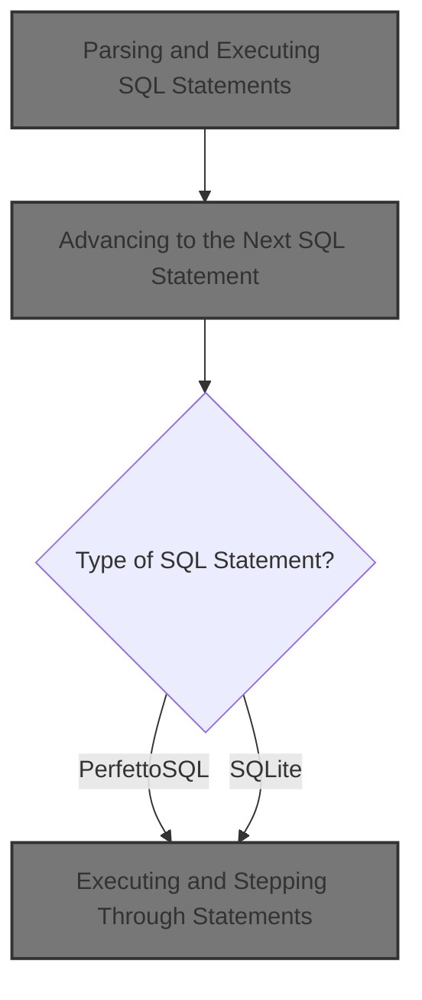

This document describes how a sequence of SQL statements, potentially mixing <SwmToken path="src/trace_processor/perfetto_sql/engine/perfetto_sql_engine.cc" pos="576:9:9" line-data="  // can also be PerfettoSQL statements which we need to transpile before">`PerfettoSQL`</SwmToken> and standard <SwmToken path="src/trace_processor/perfetto_sql/engine/perfetto_sql_engine.cc" pos="577:15:15" line-data="  // execution or execute without delegating to SQLite.">`SQLite`</SwmToken>, is processed and executed. Each statement is handled in order, ensuring all side effects are applied before moving to the next. The input is a SQL script, and the output is the result of the last valid statement and execution statistics.



# Parsing and Executing SQL Statements

<SwmSnippet path="/src/trace_processor/perfetto_sql/engine/perfetto_sql_engine.cc" line="573">

---

In <SwmToken path="src/trace_processor/perfetto_sql/engine/perfetto_sql_engine.cc" pos="573:2:2" line-data="PerfettoSqlEngine::ExecuteUntilLastStatement(SqlSource sql_source) {">`ExecuteUntilLastStatement`</SwmToken>, we kick off by setting up the parser to break the input SQL into statements, handling both PerfettoSQL-specific and standard <SwmToken path="src/trace_processor/perfetto_sql/engine/perfetto_sql_engine.cc" pos="577:15:15" line-data="  // execution or execute without delegating to SQLite.">`SQLite`</SwmToken> statements. We need to call into the parser next because that's where the SQL is split and classified, letting us decide if we execute <SwmToken path="src/trace_processor/perfetto_sql/engine/perfetto_sql_engine.cc" pos="576:9:9" line-data="  // can also be PerfettoSQL statements which we need to transpile before">`PerfettoSQL`</SwmToken> logic or just pass it to <SwmToken path="src/trace_processor/perfetto_sql/engine/perfetto_sql_engine.cc" pos="577:15:15" line-data="  // execution or execute without delegating to SQLite.">`SQLite`</SwmToken>. This setup is what lets us handle mixed SQL sources and manage side effects in the right order.

```c++
PerfettoSqlEngine::ExecuteUntilLastStatement(SqlSource sql_source) {
  // A SQL string can contain several statements. Some of them might be
  // comment only, e.g. "SELECT 1; /* comment */; SELECT 2;". Some statements
  // can also be PerfettoSQL statements which we need to transpile before
  // execution or execute without delegating to SQLite.
  //
  // The logic here is the following:
  //  - We parse the statement as a PerfettoSQL statement.
  //  - If the statement is something we can execute, execute it instantly and
  //    prepare a dummy SQLite statement so the rest of the code continues to
  //    work correctly.
  //  - If the statement is actually an SQLite statement, we invoke
  //  PrepareStmt.
  //  - We step once to make sure side effects take effect (e.g. for CREATE
  //    TABLE statements, tables are created).
  //  - If we encounter a valid statement afterwards, we step internally
  //  through
  //    all rows of the previous one. This ensures that any further side
  //    effects take hold *before* we step into the next statement.
  //  - Once no further statements are encountered, we return the prepared
  //    statement for the last valid statement.
  std::optional<SqliteEngine::PreparedStatement> res;
  ExecutionStats stats;
  PerfettoSqlParser parser(std::move(sql_source), macros_);
  while (parser.Next()) {
```

---

</SwmSnippet>

## Advancing to the Next SQL Statement

<SwmSnippet path="/src/trace_processor/perfetto_sql/parser/perfetto_sql_parser.cc" line="407">

---

In <SwmToken path="src/trace_processor/perfetto_sql/parser/perfetto_sql_parser.cc" pos="407:2:4" line-data="bool PerfettoSqlParser::Next() {">`PerfettoSqlParser::Next`</SwmToken>, we clear out any previous statement state and then call into the preprocessor to get the next SQL statement. The preprocessor is needed here because it handles macro expansion and tokenization, so the parser always works with a clean, well-formed statement.

```c++
bool PerfettoSqlParser::Next() {
  PERFETTO_DCHECK(parser_state_->status.ok());

  parser_state_->current_statement = std::nullopt;
  statement_sql_ = std::nullopt;

  if (!parser_state_->preprocessor.NextStatement()) {
    parser_state_->status = parser_state_->preprocessor.status();
    return false;
  }
```

---

</SwmSnippet>

### Preprocessing and Tokenizing SQL

```mermaid
%%{init: {"flowchart": {"defaultRenderer": "elk"}} }%%
flowchart TD
  subgraph loop1["Skip empty statements"]
    node1["Check next token"]
    click node1 openCode "src/trace_processor/perfetto_sql/preprocessor/perfetto_sql_preprocessor.cc:489:492"
    node1 --> node2{"Is token a semicolon?"}
    click node2 openCode "src/trace_processor/perfetto_sql/preprocessor/perfetto_sql_preprocessor.cc:490:492"
    node2 -->|"Yes"| node1
    node2 -->|"No"| node3["Check for EOF"]
    click node3 openCode "src/trace_processor/perfetto_sql/preprocessor/perfetto_sql_preprocessor.cc:495:497"
  end
  node3 --> node4{"Is token EOF?"}
  click node4 openCode "src/trace_processor/perfetto_sql/preprocessor/perfetto_sql_preprocessor.cc:495:497"
  node4 -->|"Yes"| node5["Return false (no more statements)"]
  click node5 openCode "src/trace_processor/perfetto_sql/preprocessor/perfetto_sql_preprocessor.cc:497:498"
  node4 -->|"No"| node6["Begin statement processing"]
  click node6 openCode "src/trace_processor/perfetto_sql/preprocessor/perfetto_sql_preprocessor.cc:500:552"
  subgraph loop2["Process statement tokens"]
    node6 --> node7{"Is token illegal?"}
    click node7 openCode "src/trace_processor/perfetto_sql/preprocessor/perfetto_sql_preprocessor.cc:517:523"
    node7 -->|"Yes"| node8["Return false (illegal token)"]
    click node8 openCode "src/trace_processor/perfetto_sql/preprocessor/perfetto_sql_preprocessor.cc:521:523"
    node7 -->|"No"| node9{"Is statement complete?"}
    click node9 openCode "src/trace_processor/perfetto_sql/preprocessor/perfetto_sql_preprocessor.cc:544:548"
    node9 -->|"Yes"| node10["Return true (statement processed)"]
    click node10 openCode "src/trace_processor/perfetto_sql/preprocessor/perfetto_sql_preprocessor.cc:546:547"
    node9 -->|"No"| node6
  end

classDef HeadingStyle fill:#777777,stroke:#333,stroke-width:2px;

%% Swimm:
%% %%{init: {"flowchart": {"defaultRenderer": "elk"}} }%%
%% flowchart TD
%%   subgraph loop1["Skip empty statements"]
%%     node1["Check next token"]
%%     click node1 openCode "<SwmPath>[src/…/preprocessor/perfetto_sql_preprocessor.cc](src/trace_processor/perfetto_sql/preprocessor/perfetto_sql_preprocessor.cc)</SwmPath>:489:492"
%%     node1 --> node2{"Is token a semicolon?"}
%%     click node2 openCode "<SwmPath>[src/…/preprocessor/perfetto_sql_preprocessor.cc](src/trace_processor/perfetto_sql/preprocessor/perfetto_sql_preprocessor.cc)</SwmPath>:490:492"
%%     node2 -->|"Yes"| node1
%%     node2 -->|"No"| node3["Check for EOF"]
%%     click node3 openCode "<SwmPath>[src/…/preprocessor/perfetto_sql_preprocessor.cc](src/trace_processor/perfetto_sql/preprocessor/perfetto_sql_preprocessor.cc)</SwmPath>:495:497"
%%   end
%%   node3 --> node4{"Is token EOF?"}
%%   click node4 openCode "<SwmPath>[src/…/preprocessor/perfetto_sql_preprocessor.cc](src/trace_processor/perfetto_sql/preprocessor/perfetto_sql_preprocessor.cc)</SwmPath>:495:497"
%%   node4 -->|"Yes"| node5["Return false (no more statements)"]
%%   click node5 openCode "<SwmPath>[src/…/preprocessor/perfetto_sql_preprocessor.cc](src/trace_processor/perfetto_sql/preprocessor/perfetto_sql_preprocessor.cc)</SwmPath>:497:498"
%%   node4 -->|"No"| node6["Begin statement processing"]
%%   click node6 openCode "<SwmPath>[src/…/preprocessor/perfetto_sql_preprocessor.cc](src/trace_processor/perfetto_sql/preprocessor/perfetto_sql_preprocessor.cc)</SwmPath>:500:552"
%%   subgraph loop2["Process statement tokens"]
%%     node6 --> node7{"Is token illegal?"}
%%     click node7 openCode "<SwmPath>[src/…/preprocessor/perfetto_sql_preprocessor.cc](src/trace_processor/perfetto_sql/preprocessor/perfetto_sql_preprocessor.cc)</SwmPath>:517:523"
%%     node7 -->|"Yes"| node8["Return false (illegal token)"]
%%     click node8 openCode "<SwmPath>[src/…/preprocessor/perfetto_sql_preprocessor.cc](src/trace_processor/perfetto_sql/preprocessor/perfetto_sql_preprocessor.cc)</SwmPath>:521:523"
%%     node7 -->|"No"| node9{"Is statement complete?"}
%%     click node9 openCode "<SwmPath>[src/…/preprocessor/perfetto_sql_preprocessor.cc](src/trace_processor/perfetto_sql/preprocessor/perfetto_sql_preprocessor.cc)</SwmPath>:544:548"
%%     node9 -->|"Yes"| node10["Return true (statement processed)"]
%%     click node10 openCode "<SwmPath>[src/…/preprocessor/perfetto_sql_preprocessor.cc](src/trace_processor/perfetto_sql/preprocessor/perfetto_sql_preprocessor.cc)</SwmPath>:546:547"
%%     node9 -->|"No"| node6
%%   end
%% 
%% classDef HeadingStyle fill:#777777,stroke:#333,stroke-width:2px;
```



<SwmSnippet path="/src/trace_processor/perfetto_sql/preprocessor/perfetto_sql_preprocessor.cc" line="485">

---

We skip empty statements and get ready to process the next real SQL statement by setting up the parsing stack.

```c++
bool PerfettoSqlPreprocessor::NextStatement() {
  PERFETTO_CHECK(status_.ok());

  // Skip through any number of semi-colons (representing empty statements).
  SqliteTokenizer::Token tok = global_tokenizer_.NextNonWhitespace();
  while (tok.token_type == TK_SEMI) {
    tok = global_tokenizer_.NextNonWhitespace();
  }
```

---

</SwmSnippet>

<SwmSnippet path="/src/trace_processor/perfetto_sql/preprocessor/perfetto_sql_preprocessor.cc" line="494">

---

Here the function loops over tokens, feeding them into the preprocessor parser and managing a stack for nested constructs. When it hits a terminal token or the stack unwinds to the root, it finalizes and returns the parsed and possibly rewritten statement. Errors or illegal tokens short-circuit the process.

```c++
  // If we still see a terminal token at this point, we must have hit EOF.
  if (tok.IsTerminal()) {
    PERFETTO_DCHECK(tok.token_type != TK_SEMI);
    return false;
  }

  SqlSource stmt =
      global_tokenizer_.Substr(tok, global_tokenizer_.NextTerminal(),
                               SqliteTokenizer::EndToken::kExclusive);

  State s{{}, *macros_, {}};
  s.stack.emplace_back(Frame::Root(), Frame::kIgnore, &s, std::move(stmt));
  for (;;) {
    auto* frame = &s.stack.back();
    auto& tk = frame->tokenizer;
    SqliteTokenizer::Token t = tk.NextNonWhitespace();
    int token_type;
    if (t.str.empty()) {
      token_type = frame->seen_semicolon ? 0 : PPTK_SEMI;
      frame->seen_semicolon = true;
    } else if (t.token_type == TK_SEMI) {
      token_type = PPTK_SEMI;
      frame->seen_semicolon = true;
    } else if (t.token_type == TK_ILLEGAL) {
      if (t.str.size() == 1 && t.str[0] == '!') {
        token_type = PPTK_EXCLAIM;
      } else {
        status_ = ErrorAtToken(tk, t, "illegal token");
        return false;
      }
    } else if (t.token_type == TK_ID) {
      token_type = PPTK_ID;
    } else if (t.token_type == TK_LP) {
      token_type = PPTK_LP;
    } else if (t.token_type == TK_RP) {
      token_type = PPTK_RP;
    } else if (t.token_type == TK_COMMA) {
      token_type = PPTK_COMMA;
    } else if (t.token_type == TK_VARIABLE) {
      token_type = PPTK_VARIABLE;
    } else {
      token_type = PPTK_OPAQUE;
    }
    frame->preprocessor.Parse(
        token_type,
        PreprocessorGrammarToken{t.str.data(), t.str.size(), token_type});
    if (s.error) {
      status_ = ErrorAtToken(tk, s.error->token, s.error->message.c_str());
      return false;
    }
    if (token_type == 0) {
      if (s.stack.size() == 1) {
        statement_ = std::move(frame->rewriter).Build();
        return true;
      }
      s.stack.pop_back();
      frame = &s.stack.back();
    }
  }
```

---

</SwmSnippet>

### Parsing Tokens into Statement Variants

```mermaid
%%{init: {"flowchart": {"defaultRenderer": "elk"}} }%%
flowchart TD
    node1["Begin SQL statement parsing"]
    click node1 openCode "src/trace_processor/perfetto_sql/parser/perfetto_sql_parser.cc:417:418"
    node1 --> node2["Reset and prepare for parsing"]
    click node2 openCode "src/trace_processor/perfetto_sql/parser/perfetto_sql_parser.cc:417:418"
    node2 --> node3["Start token loop"]
    click node3 openCode "src/trace_processor/perfetto_sql/parser/perfetto_sql_parser.cc:423:449"
    
    subgraph loop1["For each token in SQL statement"]
        node3 --> node4{"Is token space or comment?"}
        click node4 openCode "src/trace_processor/perfetto_sql/parser/perfetto_sql_parser.cc:445:447"
        node4 -->|"Yes"| node3
        node4 -->|"No"| node5{"Is token terminal?"}
        click node5 openCode "src/trace_processor/perfetto_sql/parser/perfetto_sql_parser.cc:428:444"
        node5 -->|"Yes"| node6{"Semicolon previously encountered?"}
        click node6 openCode "src/trace_processor/perfetto_sql/parser/perfetto_sql_parser.cc:429:438"
        node6 -->|"No"| node7["Mark semicolon encountered"]
        click node7 openCode "src/trace_processor/perfetto_sql/parser/perfetto_sql_parser.cc:430:432"
        node7 --> node3
        node6 -->|"Yes"| node8{"Is statement complete?"}
        click node8 openCode "src/trace_processor/perfetto_sql/parser/perfetto_sql_parser.cc:439:443"
        node8 -->|"No"| node3
        node8 -->|"Yes"| node9["Return statement complete (True)"]
        click node9 openCode "src/trace_processor/perfetto_sql/parser/perfetto_sql_parser.cc:443:444"
        node5 -->|"No"| node10["Parse token"]
        click node10 openCode "src/trace_processor/perfetto_sql/parser/perfetto_sql_parser.cc:448:449"
        node10 --> node3
    end
classDef HeadingStyle fill:#777777,stroke:#333,stroke-width:2px;

%% Swimm:
%% %%{init: {"flowchart": {"defaultRenderer": "elk"}} }%%
%% flowchart TD
%%     node1["Begin SQL statement parsing"]
%%     click node1 openCode "<SwmPath>[src/…/parser/perfetto_sql_parser.cc](src/trace_processor/perfetto_sql/parser/perfetto_sql_parser.cc)</SwmPath>:417:418"
%%     node1 --> node2["Reset and prepare for parsing"]
%%     click node2 openCode "<SwmPath>[src/…/parser/perfetto_sql_parser.cc](src/trace_processor/perfetto_sql/parser/perfetto_sql_parser.cc)</SwmPath>:417:418"
%%     node2 --> node3["Start token loop"]
%%     click node3 openCode "<SwmPath>[src/…/parser/perfetto_sql_parser.cc](src/trace_processor/perfetto_sql/parser/perfetto_sql_parser.cc)</SwmPath>:423:449"
%%     
%%     subgraph loop1["For each token in SQL statement"]
%%         node3 --> node4{"Is token space or comment?"}
%%         click node4 openCode "<SwmPath>[src/…/parser/perfetto_sql_parser.cc](src/trace_processor/perfetto_sql/parser/perfetto_sql_parser.cc)</SwmPath>:445:447"
%%         node4 -->|"Yes"| node3
%%         node4 -->|"No"| node5{"Is token terminal?"}
%%         click node5 openCode "<SwmPath>[src/…/parser/perfetto_sql_parser.cc](src/trace_processor/perfetto_sql/parser/perfetto_sql_parser.cc)</SwmPath>:428:444"
%%         node5 -->|"Yes"| node6{"Semicolon previously encountered?"}
%%         click node6 openCode "<SwmPath>[src/…/parser/perfetto_sql_parser.cc](src/trace_processor/perfetto_sql/parser/perfetto_sql_parser.cc)</SwmPath>:429:438"
%%         node6 -->|"No"| node7["Mark semicolon encountered"]
%%         click node7 openCode "<SwmPath>[src/…/parser/perfetto_sql_parser.cc](src/trace_processor/perfetto_sql/parser/perfetto_sql_parser.cc)</SwmPath>:430:432"
%%         node7 --> node3
%%         node6 -->|"Yes"| node8{"Is statement complete?"}
%%         click node8 openCode "<SwmPath>[src/…/parser/perfetto_sql_parser.cc](src/trace_processor/perfetto_sql/parser/perfetto_sql_parser.cc)</SwmPath>:439:443"
%%         node8 -->|"No"| node3
%%         node8 -->|"Yes"| node9["Return statement complete (True)"]
%%         click node9 openCode "<SwmPath>[src/…/parser/perfetto_sql_parser.cc](src/trace_processor/perfetto_sql/parser/perfetto_sql_parser.cc)</SwmPath>:443:444"
%%         node5 -->|"No"| node10["Parse token"]
%%         click node10 openCode "<SwmPath>[src/…/parser/perfetto_sql_parser.cc](src/trace_processor/perfetto_sql/parser/perfetto_sql_parser.cc)</SwmPath>:448:449"
%%         node10 --> node3
%%     end
%% classDef HeadingStyle fill:#777777,stroke:#333,stroke-width:2px;
```



<SwmSnippet path="/src/trace_processor/perfetto_sql/parser/perfetto_sql_parser.cc" line="417">

---

Back in <SwmToken path="src/trace_processor/perfetto_sql/parser/perfetto_sql_parser.cc" pos="407:2:4" line-data="bool PerfettoSqlParser::Next() {">`PerfettoSqlParser::Next`</SwmToken>, after getting the statement from the preprocessor, we reset the tokenizer and parse the statement into its variant (<SwmToken path="src/trace_processor/perfetto_sql/engine/perfetto_sql_engine.cc" pos="576:9:9" line-data="  // can also be PerfettoSQL statements which we need to transpile before">`PerfettoSQL`</SwmToken> or <SwmToken path="src/trace_processor/perfetto_sql/engine/perfetto_sql_engine.cc" pos="577:15:15" line-data="  // execution or execute without delegating to SQLite.">`SQLite`</SwmToken>). This lets the engine know how to handle the statement in the next phase.

```c++
  parser_state_->tokenizer.Reset(parser_state_->preprocessor.statement());

  auto* parser = PerfettoSqlParseAlloc(malloc, parser_state_.get());
  auto guard = base::OnScopeExit([&]() { PerfettoSqlParseFree(parser, free); });

  enum { kEof, kSemicolon, kNone } eof = kNone;
  for (Token token = parser_state_->tokenizer.Next();;
       token = parser_state_->tokenizer.Next()) {
    if (!parser_state_->status.ok()) {
      return false;
    }
    if (token.IsTerminal()) {
      if (eof == kNone) {
        PerfettoSqlParse(parser, TK_SEMI, TokenToPerfettoSqlToken(token));
        eof = kSemicolon;
        continue;
      }
      if (eof == kSemicolon) {
        PerfettoSqlParse(parser, 0, TokenToPerfettoSqlToken(token));
        eof = kEof;
        continue;
      }
      if (!parser_state_->current_statement) {
        parser_state_->current_statement = SqliteSql{};
      }
      statement_sql_ = parser_state_->preprocessor.statement();
      return true;
    }
    if (token.token_type == TK_SPACE || token.token_type == TK_COMMENT) {
      continue;
    }
    PerfettoSqlParse(parser, token.token_type, TokenToPerfettoSqlToken(token));
  }
```

---

</SwmSnippet>

## Executing and Stepping Through Statements

```mermaid
%%{init: {"flowchart": {"defaultRenderer": "elk"}} }%%
flowchart TD
  node1{"What type of SQL statement?"}
  click node1 openCode "src/trace_processor/perfetto_sql/engine/perfetto_sql_engine.cc:599:641"
  node1 -->|"Create function/table/view/macro/index/drop buildtools/expat/include"| node2["Process and rewrite statement"]
  click node2 openCode "src/trace_processor/perfetto_sql/engine/perfetto_sql_engine.cc:601:633"
  node1 -->|"Standard SQL"| node3["Use statement as-is"]
  click node3 openCode "src/trace_processor/perfetto_sql/engine/perfetto_sql_engine.cc:637:641"
  node2 --> node4["Prepare statement for execution"]
  click node4 openCode "src/trace_processor/perfetto_sql/engine/perfetto_sql_engine.cc:647:650"
  node3 --> node4
  node4 --> node5{"Is there a previous statement not finished?"}
  click node5 openCode "src/trace_processor/perfetto_sql/engine/perfetto_sql_engine.cc:660:670"
  
  subgraph loop1["While previous statement is not done"]
    node5 -->|"Yes"| node6["Step through previous statement"]
    click node6 openCode "src/trace_processor/perfetto_sql/engine/perfetto_sql_engine.cc:667:668"
    node6 --> node5
  end
  node5 -->|"No"| node7["Step the new statement once"]
  click node7 openCode "src/trace_processor/perfetto_sql/engine/perfetto_sql_engine.cc:677:685"
  loop1 --> node7
  node7 --> node8{"Was a valid statement prepared?"}
  click node8 openCode "src/trace_processor/perfetto_sql/engine/perfetto_sql_engine.cc:694:695"
  node8 -->|"No"| node9["Return error: No valid SQL to run"]
  click node9 openCode "src/trace_processor/perfetto_sql/engine/perfetto_sql_engine.cc:695:695"
  node8 -->|"Yes"| node10["Update statistics and return result"]
  click node10 openCode "src/trace_processor/perfetto_sql/engine/perfetto_sql_engine.cc:698:700"
classDef HeadingStyle fill:#777777,stroke:#333,stroke-width:2px;

%% Swimm:
%% %%{init: {"flowchart": {"defaultRenderer": "elk"}} }%%
%% flowchart TD
%%   node1{"What type of SQL statement?"}
%%   click node1 openCode "<SwmPath>[src/…/engine/perfetto_sql_engine.cc](src/trace_processor/perfetto_sql/engine/perfetto_sql_engine.cc)</SwmPath>:599:641"
%%   node1 -->|"Create function/table/view/macro/index/drop <SwmPath>[buildtools/expat/include/](buildtools/expat/include/)</SwmPath>"| node2["Process and rewrite statement"]
%%   click node2 openCode "<SwmPath>[src/…/engine/perfetto_sql_engine.cc](src/trace_processor/perfetto_sql/engine/perfetto_sql_engine.cc)</SwmPath>:601:633"
%%   node1 -->|"Standard SQL"| node3["Use statement <SwmToken path="src/trace_processor/perfetto_sql/engine/perfetto_sql_engine.cc" pos="87:4:6" line-data="//   statements as-is for execution by SQLite.">`as-is`</SwmToken>"]
%%   click node3 openCode "<SwmPath>[src/…/engine/perfetto_sql_engine.cc](src/trace_processor/perfetto_sql/engine/perfetto_sql_engine.cc)</SwmPath>:637:641"
%%   node2 --> node4["Prepare statement for execution"]
%%   click node4 openCode "<SwmPath>[src/…/engine/perfetto_sql_engine.cc](src/trace_processor/perfetto_sql/engine/perfetto_sql_engine.cc)</SwmPath>:647:650"
%%   node3 --> node4
%%   node4 --> node5{"Is there a previous statement not finished?"}
%%   click node5 openCode "<SwmPath>[src/…/engine/perfetto_sql_engine.cc](src/trace_processor/perfetto_sql/engine/perfetto_sql_engine.cc)</SwmPath>:660:670"
%%   
%%   subgraph loop1["While previous statement is not done"]
%%     node5 -->|"Yes"| node6["Step through previous statement"]
%%     click node6 openCode "<SwmPath>[src/…/engine/perfetto_sql_engine.cc](src/trace_processor/perfetto_sql/engine/perfetto_sql_engine.cc)</SwmPath>:667:668"
%%     node6 --> node5
%%   end
%%   node5 -->|"No"| node7["Step the new statement once"]
%%   click node7 openCode "<SwmPath>[src/…/engine/perfetto_sql_engine.cc](src/trace_processor/perfetto_sql/engine/perfetto_sql_engine.cc)</SwmPath>:677:685"
%%   loop1 --> node7
%%   node7 --> node8{"Was a valid statement prepared?"}
%%   click node8 openCode "<SwmPath>[src/…/engine/perfetto_sql_engine.cc](src/trace_processor/perfetto_sql/engine/perfetto_sql_engine.cc)</SwmPath>:694:695"
%%   node8 -->|"No"| node9["Return error: No valid SQL to run"]
%%   click node9 openCode "<SwmPath>[src/…/engine/perfetto_sql_engine.cc](src/trace_processor/perfetto_sql/engine/perfetto_sql_engine.cc)</SwmPath>:695:695"
%%   node8 -->|"Yes"| node10["Update statistics and return result"]
%%   click node10 openCode "<SwmPath>[src/…/engine/perfetto_sql_engine.cc](src/trace_processor/perfetto_sql/engine/perfetto_sql_engine.cc)</SwmPath>:698:700"
%% classDef HeadingStyle fill:#777777,stroke:#333,stroke-width:2px;
```



<SwmSnippet path="/src/trace_processor/perfetto_sql/engine/perfetto_sql_engine.cc" line="598">

---

Back in <SwmToken path="src/trace_processor/perfetto_sql/engine/perfetto_sql_engine.cc" pos="573:2:2" line-data="PerfettoSqlEngine::ExecuteUntilLastStatement(SqlSource sql_source) {">`ExecuteUntilLastStatement`</SwmToken>, after parsing the statement, we check its type: <SwmToken path="src/trace_processor/perfetto_sql/engine/perfetto_sql_engine.cc" pos="653:27:27" line-data="    // statement is if the SQL was a pure comment. However, the PerfettoSQL">`PerfettoSQL`</SwmToken> statements are executed and rewritten to dummy SQL, while <SwmToken path="src/trace_processor/perfetto_sql/engine/perfetto_sql_engine.cc" pos="636:9:9" line-data="      // directly executable by SQLite.">`SQLite`</SwmToken> statements are prepared <SwmToken path="src/trace_processor/perfetto_sql/engine/perfetto_sql_engine.cc" pos="87:4:6" line-data="//   statements as-is for execution by SQLite.">`as-is`</SwmToken>. Before running the next statement, we make sure the previous one is fully stepped through to apply all side effects. We then step the new statement once and update stats. At the end, we return the last prepared statement and stats.

```c++
    std::optional<SqlSource> source;
    if (const auto* cf = std::get_if<PerfettoSqlParser::CreateFunction>(
            &parser.statement())) {
      RETURN_IF_ERROR(AddTracebackIfNeeded(ExecuteCreateFunction(*cf),
                                           parser.statement_sql()));
      source = RewriteToDummySql(parser.statement_sql());
    } else if (const auto* cst = std::get_if<PerfettoSqlParser::CreateTable>(
                   &parser.statement())) {
      RETURN_IF_ERROR(AddTracebackIfNeeded(ExecuteCreateTable(*cst),
                                           parser.statement_sql()));
      source = RewriteToDummySql(parser.statement_sql());
    } else if (const auto* create_view =
                   std::get_if<PerfettoSqlParser::CreateView>(
                       &parser.statement())) {
      RETURN_IF_ERROR(AddTracebackIfNeeded(ExecuteCreateView(*create_view),
                                           parser.statement_sql()));
      source = RewriteToDummySql(parser.statement_sql());
    } else if (const auto* include = std::get_if<PerfettoSqlParser::Include>(
                   &parser.statement())) {
      RETURN_IF_ERROR(ExecuteInclude(*include, parser));
      source = RewriteToDummySql(parser.statement_sql());
    } else if (const auto* macro = std::get_if<PerfettoSqlParser::CreateMacro>(
                   &parser.statement())) {
      auto sql = macro->sql;
      RETURN_IF_ERROR(ExecuteCreateMacro(*macro));
      source = RewriteToDummySql(sql);
    } else if (const auto* create_index =
                   std::get_if<PerfettoSqlParser::CreateIndex>(
                       &parser.statement())) {
      RETURN_IF_ERROR(ExecuteCreateIndex(*create_index));
      source = RewriteToDummySql(parser.statement_sql());
    } else if (const auto* drop_index =
                   std::get_if<PerfettoSqlParser::DropIndex>(
                       &parser.statement())) {
      RETURN_IF_ERROR(ExecuteDropIndex(*drop_index));
      source = RewriteToDummySql(parser.statement_sql());
    } else {
      // If none of the above matched, this must just be an SQL statement
      // directly executable by SQLite.
      const auto* sql =
          std::get_if<PerfettoSqlParser::SqliteSql>(&parser.statement());
      PERFETTO_CHECK(sql);
      source = parser.statement_sql();
    }

    // Try to get SQLite to prepare the statement.
    std::optional<SqliteEngine::PreparedStatement> cur_stmt;
    {
      PERFETTO_TP_TRACE(metatrace::Category::QUERY_TIMELINE, "QUERY_PREPARE");
      auto stmt = engine_->PrepareStatement(std::move(*source));
      RETURN_IF_ERROR(stmt.status());
      cur_stmt = std::move(stmt);
    }

    // The only situation where we'd have an ok status but also no prepared
    // statement is if the SQL was a pure comment. However, the PerfettoSQL
    // parser should filter out such statements so this should never happen.
    PERFETTO_DCHECK(cur_stmt->sqlite_stmt());

    // Before stepping into |cur_stmt|, we need to finish iterating through
    // the previous statement so we don't have two clashing statements (e.g.
    // SELECT * FROM v and DROP VIEW v) partially stepped into.
    if (res && !res->IsDone()) {
      PERFETTO_TP_TRACE(metatrace::Category::QUERY_TIMELINE,
                        "STMT_STEP_UNTIL_DONE",
                        [&res](metatrace::Record* record) {
                          record->AddArg("Original SQL", res->original_sql());
                          record->AddArg("Executed SQL", res->sql());
                        });
      while (res->Step()) {
      }
      RETURN_IF_ERROR(res->status());
    }

    // Propagate the current statement to the next iteration.
    res = std::move(cur_stmt);

    // Step the newly prepared statement once. This is considered to be
    // "executing" the statement.
    {
      PERFETTO_TP_TRACE(metatrace::Category::QUERY_TIMELINE, "STMT_FIRST_STEP",
                        [&res](metatrace::Record* record) {
                          record->AddArg("Original SQL", res->original_sql());
                          record->AddArg("Executed SQL", res->sql());
                        });
      res->Step();
      RETURN_IF_ERROR(res->status());
    }

    // Increment the neecessary counts for the statement.
    IncrementCountForStmt(*res, &stats);
  }
  RETURN_IF_ERROR(parser.status());

  // If we didn't manage to prepare a single statement, that means everything
  // in the SQL was treated as a comment.
  if (!res)
    return base::ErrStatus("No valid SQL to run");

  // Update the output statement and column count.
  stats.column_count =
      static_cast<uint32_t>(sqlite3_column_count(res->sqlite_stmt()));
  return ExecutionResult{std::move(*res), stats};
}
```

---

</SwmSnippet>

&nbsp;

*This is an auto-generated document by Swimm 🌊 and has not yet been verified by a human*

<SwmMeta version="3.0.0" repo-id="Z2l0aHViJTNBJTNBY3BsdXNwbHVzLXBlcmZldHRvJTNBJTNBcmljYXJkb2xvcGV6Zw==" repo-name="cplusplus-perfetto"><sup>Powered by [Swimm](https://app.swimm.io/)</sup></SwmMeta>
