This document describes how incoming trace messages are processed and routed to trigger user-facing actions. The flow covers routine events like status updates and file downloads, as well as error scenarios where tailored dialogs are shown to the user depending on the error type and frequency.

# Processing Incoming Trace Messages

```mermaid
%%{init: {"flowchart": {"defaultRenderer": "elk"}} }%%
flowchart TD
  node1{"What is the message type?"}
  click node1 openCode "ui/src/frontend/trace_converter.ts:70:85"
  node1 -->|updateStatus| node2["Show status message to user (status)"]
  click node2 openCode "ui/src/frontend/trace_converter.ts:71:71"
  node1 -->|jobCompleted| node3["Mark job as complete"]
  click node3 openCode "ui/src/frontend/trace_converter.ts:73:73"
  node1 -->|downloadFile| node4["Download file for user (file name)"]
  click node4 openCode "ui/src/frontend/trace_converter.ts:75:78"
  node1 -->|openTraceInLegacy| node5["Open trace in legacy mode"]
  click node5 openCode "ui/src/frontend/trace_converter.ts:80:81"
  node1 -->|"error"| node6["Show error dialog to user (error message)"]
  click node6 openCode "ui/src/frontend/trace_converter.ts:83:83"
  node1 -->|"Other"| node7["Show unhandled message error"]
  click node7 openCode "ui/src/frontend/trace_converter.ts:85:85"
classDef HeadingStyle fill:#777777,stroke:#333,stroke-width:2px;

%% Swimm:
%% %%{init: {"flowchart": {"defaultRenderer": "elk"}} }%%
%% flowchart TD
%%   node1{"What is the message type?"}
%%   click node1 openCode "<SwmPath>[ui/…/frontend/trace_converter.ts](ui/src/frontend/trace_converter.ts)</SwmPath>:70:85"
%%   node1 -->|<SwmToken path="ui/src/frontend/trace_converter.ts" pos="70:11:11" line-data="    if (args.kind === &#39;updateStatus&#39;) {">`updateStatus`</SwmToken>| node2["Show status message to user (status)"]
%%   click node2 openCode "<SwmPath>[ui/…/frontend/trace_converter.ts](ui/src/frontend/trace_converter.ts)</SwmPath>:71:71"
%%   node1 -->|<SwmToken path="ui/src/frontend/trace_converter.ts" pos="72:15:15" line-data="    } else if (args.kind === &#39;jobCompleted&#39;) {">`jobCompleted`</SwmToken>| node3["Mark job as complete"]
%%   click node3 openCode "<SwmPath>[ui/…/frontend/trace_converter.ts](ui/src/frontend/trace_converter.ts)</SwmPath>:73:73"
%%   node1 -->|<SwmToken path="ui/src/frontend/trace_converter.ts" pos="74:15:15" line-data="    } else if (args.kind === &#39;downloadFile&#39;) {">`downloadFile`</SwmToken>| node4["Download file for user (file name)"]
%%   click node4 openCode "<SwmPath>[ui/…/frontend/trace_converter.ts](ui/src/frontend/trace_converter.ts)</SwmPath>:75:78"
%%   node1 -->|<SwmToken path="ui/src/frontend/trace_converter.ts" pos="79:15:15" line-data="    } else if (args.kind === &#39;openTraceInLegacy&#39;) {">`openTraceInLegacy`</SwmToken>| node5["Open trace in legacy mode"]
%%   click node5 openCode "<SwmPath>[ui/…/frontend/trace_converter.ts](ui/src/frontend/trace_converter.ts)</SwmPath>:80:81"
%%   node1 -->|"error"| node6["Show error dialog to user (error message)"]
%%   click node6 openCode "<SwmPath>[ui/…/frontend/trace_converter.ts](ui/src/frontend/trace_converter.ts)</SwmPath>:83:83"
%%   node1 -->|"Other"| node7["Show unhandled message error"]
%%   click node7 openCode "<SwmPath>[ui/…/frontend/trace_converter.ts](ui/src/frontend/trace_converter.ts)</SwmPath>:85:85"
%% classDef HeadingStyle fill:#777777,stroke:#333,stroke-width:2px;
```



<SwmSnippet path="/ui/src/frontend/trace_converter.ts" line="68">

---

HandleOnMessage kicks off the flow by routing incoming messages based on their 'kind'. If the message signals an error, it calls <SwmToken path="ui/src/frontend/trace_converter.ts" pos="83:1:1" line-data="      maybeShowErrorDialog(args.error);">`maybeShowErrorDialog`</SwmToken> to show the user a relevant error dialog. This handoff is necessary to translate backend or system errors into something the user can see and act on, rather than just logging or ignoring them.

```typescript
  function handleOnMessage(msg: MessageEvent): void {
    const args: Args = msg.data;
    if (args.kind === 'updateStatus') {
      AppImpl.instance.omnibox.showStatusMessage(args.status);
    } else if (args.kind === 'jobCompleted') {
      promise.resolve();
    } else if (args.kind === 'downloadFile') {
      download({
        content: args.buffer,
        fileName: args.name,
      });
    } else if (args.kind === 'openTraceInLegacy') {
      const str = utf8Decode(args.buffer);
      openTraceInLegacy?.('trace.json', str, 0);
    } else if (args.kind === 'error') {
      maybeShowErrorDialog(args.error);
    } else {
      throw new Error(`Unhandled message ${JSON.stringify(args)}`);
    }
  }
```

---

</SwmSnippet>

# Deciding and Displaying Error Dialogs

```mermaid
%%{init: {"flowchart": {"defaultRenderer": "elk"}} }%%
flowchart TD
  node1["Receive error"] --> node2{"Is error a known type?"}
  click node1 openCode "ui/src/frontend/error_dialog.ts:36:117"
  node2 -->|"Yes"| node3["Show specific error dialog"]
  click node2 openCode "ui/src/frontend/error_dialog.ts:40:96"
  node3 --> node4["Update last report time"]
  click node3 openCode "ui/src/frontend/error_dialog.ts:48:95"
  click node4 openCode "ui/src/frontend/error_dialog.ts:50:57"
  node2 -->|"No"| node5{"Was a recent error dialog shown?"}
  node5 -->|"Yes"| node6["Do not show dialog"]
  click node5 openCode "ui/src/frontend/error_dialog.ts:98:101"
  click node6 openCode "ui/src/frontend/error_dialog.ts:99:101"
  node5 -->|"No"| node7{"Is crash dialog already displayed?"}
  node7 -->|"Yes"| node8["Do not show dialog"]
  click node7 openCode "ui/src/frontend/error_dialog.ts:106:108"
  click node8 openCode "ui/src/frontend/error_dialog.ts:107:108"
  node7 -->|"No"| node9["Map stack trace"]
  click node9 openCode "ui/src/base/source_map_utils.ts:263:314"
  node9 --> node10["Show generic error dialog"]
  click node10 openCode "ui/src/frontend/error_dialog.ts:112:116"
classDef HeadingStyle fill:#777777,stroke:#333,stroke-width:2px;

%% Swimm:
%% %%{init: {"flowchart": {"defaultRenderer": "elk"}} }%%
%% flowchart TD
%%   node1["Receive error"] --> node2{"Is error a known type?"}
%%   click node1 openCode "<SwmPath>[ui/…/frontend/error_dialog.ts](ui/src/frontend/error_dialog.ts)</SwmPath>:36:117"
%%   node2 -->|"Yes"| node3["Show specific error dialog"]
%%   click node2 openCode "<SwmPath>[ui/…/frontend/error_dialog.ts](ui/src/frontend/error_dialog.ts)</SwmPath>:40:96"
%%   node3 --> node4["Update last report time"]
%%   click node3 openCode "<SwmPath>[ui/…/frontend/error_dialog.ts](ui/src/frontend/error_dialog.ts)</SwmPath>:48:95"
%%   click node4 openCode "<SwmPath>[ui/…/frontend/error_dialog.ts](ui/src/frontend/error_dialog.ts)</SwmPath>:50:57"
%%   node2 -->|"No"| node5{"Was a recent error dialog shown?"}
%%   node5 -->|"Yes"| node6["Do not show dialog"]
%%   click node5 openCode "<SwmPath>[ui/…/frontend/error_dialog.ts](ui/src/frontend/error_dialog.ts)</SwmPath>:98:101"
%%   click node6 openCode "<SwmPath>[ui/…/frontend/error_dialog.ts](ui/src/frontend/error_dialog.ts)</SwmPath>:99:101"
%%   node5 -->|"No"| node7{"Is crash dialog already displayed?"}
%%   node7 -->|"Yes"| node8["Do not show dialog"]
%%   click node7 openCode "<SwmPath>[ui/…/frontend/error_dialog.ts](ui/src/frontend/error_dialog.ts)</SwmPath>:106:108"
%%   click node8 openCode "<SwmPath>[ui/…/frontend/error_dialog.ts](ui/src/frontend/error_dialog.ts)</SwmPath>:107:108"
%%   node7 -->|"No"| node9["Map stack trace"]
%%   click node9 openCode "<SwmPath>[ui/…/base/source_map_utils.ts](ui/src/base/source_map_utils.ts)</SwmPath>:263:314"
%%   node9 --> node10["Show generic error dialog"]
%%   click node10 openCode "<SwmPath>[ui/…/frontend/error_dialog.ts](ui/src/frontend/error_dialog.ts)</SwmPath>:112:116"
%% classDef HeadingStyle fill:#777777,stroke:#333,stroke-width:2px;
```



<SwmSnippet path="/ui/src/frontend/error_dialog.ts" line="36">

---

MaybeShowErrorDialog inspects the error message and stack trace to pick the right dialog for the user—memory, USB, attachment, connection, or specific error codes. It also throttles dialogs to avoid spamming and checks if one is already open. If none of the specific cases match, it maps the stack trace to original source locations for clarity, then shows a generic error dialog. The mapping step is why we call into <SwmToken path="ui/src/frontend/error_dialog.ts" pos="28:12:12" line-data="import {mapStackTraceWithMinifiedSourceMap} from &#39;../base/source_map_utils&#39;;">`source_map_utils`</SwmToken> next.

```typescript
export function maybeShowErrorDialog(err: ErrorDetails) {
  const now = performance.now();

  // Here we rely on the exception message from onCannotGrowMemory function
  if (
    err.message.includes('Cannot enlarge memory') ||
    err.stack.some((entry) => entry.name.includes('base::AlignedAlloc')) ||
    err.stack.some((entry) => entry.name.includes('OutOfMemoryHandler')) ||
    err.stack.some((entry) => entry.name.includes('_emscripten_resize_heap')) ||
    err.stack.some((entry) => entry.name.includes('sbrk')) ||
    /^out of memory$/m.exec(err.message)
  ) {
    showOutOfMemoryDialog();
    // Refresh timeLastReport to prevent a different error showing a dialog
    timeLastReport = now;
    return;
  }

  if (err.message.includes('Unable to claim interface')) {
    showWebUSBError();
    timeLastReport = now;
    return;
  }

  if (err.message.includes('ABT: Got no attachments from extension')) {
    showABTError();
    timeLastReport = now;
    return;
  }

  if (
    err.message.includes('A transfer error has occurred') ||
    err.message.includes('The device was disconnected') ||
    err.message.includes('The transfer was cancelled')
  ) {
    showConnectionLostError();
    timeLastReport = now;
    return;
  }

  if (err.message.includes('(ERR:fmt)')) {
    showUnknownFileError();
    return;
  }

  if (err.message.includes('(ERR:rpc_seq)')) {
    showRpcSequencingError();
    return;
  }

  if (err.message.includes('(ERR:ws)')) {
    showWebsocketConnectionIssue(err.message);
    return;
  }

  // This is only for older version of the UI and for ease of tracking across
  // cherry-picks. Newer versions don't have this exception anymore.
  if (err.message.includes('State hash does not match')) {
    showNewerStateError();
    return;
  }

  if (timeLastReport > 0 && now - timeLastReport <= MIN_REPORT_PERIOD_MS) {
    console.log('Suppressing crash dialog, last error notified too soon.');
    return;
  }
  timeLastReport = now;

  // If we are already showing a crash dialog, don't overwrite it with a newer
  // crash. Usually the first crash matters, the rest avalanching effects.
  if (getCurrentModalKey() === MODAL_KEY) {
    return;
  }

  err.stack = mapStackTraceWithMinifiedSourceMap(err.stack);

  showModal({
    key: MODAL_KEY,
    title: 'Oops, something went wrong. Please file a bug.',
    content: () => m(ErrorDialogComponent, err),
  });
}
```

---

</SwmSnippet>

<SwmSnippet path="/ui/src/base/source_map_utils.ts" line="263">

---

MapStackTraceWithMinifiedSourceMap takes each stack entry, parses its location, and tries to map it to the original source using repository-specific helpers. If the mapping works, it cleans up the source path for readability; if not, it leaves the entry as-is. This makes error dialogs more useful by pointing to real source lines instead of bundled code.

```typescript
export function mapStackTraceWithMinifiedSourceMap(
  stack: readonly ErrorStackEntry[],
): ErrorStackEntry[] {
  const mappedEntries: ErrorStackEntry[] = [];

  for (const entry of stack) {
    // Parse location field - format: "file.js:line:col" or "/path/file.js:line:col"
    const match = entry.location.match(/^(.+):(\d+):(\d+)$/);
    if (!match) {
      mappedEntries.push(entry);
      continue;
    }

    const file = match[1];
    const lineNum = parseInt(match[2], 10);
    const colNum = parseInt(match[3], 10);

    try {
      // Extract just the filename from the path
      // e.g., "/v1.2.3/frontend_bundle.js" -> "frontend_bundle.js"
      const bundleFileName = file.split('/').pop() || file;

      // Get the source map for this specific bundle
      const processed = ensureSourceMap(bundleFileName);

      if (!processed) {
        // No source map for this bundle, keep original
        mappedEntries.push(entry);
        continue;
      }

      // Map the position using preprocessed source map
      const pos = findOriginalPosition(processed, lineNum, colNum);

      if (pos.source !== null && pos.line !== null) {
        // Clean up the source path
        const source = pos.source
          .replace(/^webpack:\/\/\//, '')
          .replace(/^\.\//, '');
        const mappedLocation = `${source}:${pos.line}:${pos.column ?? 0}`;
        mappedEntries.push({
          name: entry.name,
          location: mappedLocation,
        });
      } else {
        mappedEntries.push(entry);
      }
    } catch (err) {
      console.error('[SourceMap] Error mapping stack trace entry:', err);
      mappedEntries.push(entry);
    }
  }
```

---

</SwmSnippet>

&nbsp;

*This is an auto-generated document by Swimm 🌊 and has not yet been verified by a human*

<SwmMeta version="3.0.0" repo-id="Z2l0aHViJTNBJTNBY3BsdXNwbHVzLXBlcmZldHRvJTNBJTNBcmljYXJkb2xvcGV6Zw==" repo-name="cplusplus-perfetto"><sup>Powered by [Swimm](https://app.swimm.io/)</sup></SwmMeta>
