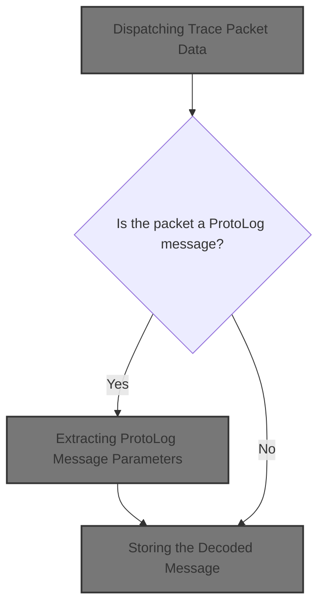

This document describes how trace packet data is processed and transformed into structured log messages for analysis. The flow receives trace packet data, dispatches it to the appropriate parser, formats the message using extracted parameters, and stores the decoded result for future analysis.



# Dispatching Trace Packet Data

```mermaid
%%{init: {"flowchart": {"defaultRenderer": "elk"}} }%%
flowchart TD
    node1["Receive trace packet data"] --> node2{"Trusted sequence ID present?"}
    click node1 openCode "src/trace_processor/importers/proto/winscope/winscope_module.cc:85:118"
    node2 -->|"Yes"| node3["Store sequence ID"]
    click node2 openCode "src/trace_processor/importers/proto/winscope/winscope_module.cc:90:92"
    node2 -->|"No"| node5{"Type of trace packet data?"}
    node3 --> node5
    click node3 openCode "src/trace_processor/importers/proto/winscope/winscope_module.cc:90:92"
    click node5 openCode "src/trace_processor/importers/proto/winscope/winscope_module.cc:93:117"
    node5 -->|"Layers Snapshot"| node6["Delegate to layers snapshot parser (uses timestamp, sequence ID)"]
    click node6 openCode "src/trace_processor/importers/proto/winscope/winscope_module.cc:95:97"
    node5 -->|"Transactions"| node7["Delegate to transactions parser (uses timestamp)"]
    click node7 openCode "src/trace_processor/importers/proto/winscope/winscope_module.cc:99:101"
    node5 -->|"Shell Transition"| node8["Delegate to shell transition parser"]
    click node8 openCode "src/trace_processor/importers/proto/winscope/winscope_module.cc:103:104"
    node5 -->|"Shell Handler Mappings"| node9["Delegate to handler mappings parser"]
    click node9 openCode "src/trace_processor/importers/proto/winscope/winscope_module.cc:106:108"
    node5 -->|"Protolog Message"| node10["Delegate to protolog parser (uses timestamp)"]
    click node10 openCode "src/trace_processor/importers/proto/winscope/winscope_module.cc:110:112"
    node5 -->|"Winscope Extensions"| node11["Delegate to winscope extensions parser (uses timestamp)"]
    click node11 openCode "src/trace_processor/importers/proto/winscope/winscope_module.cc:114:116"
classDef HeadingStyle fill:#777777,stroke:#333,stroke-width:2px;

%% Swimm:
%% %%{init: {"flowchart": {"defaultRenderer": "elk"}} }%%
%% flowchart TD
%%     node1["Receive trace packet data"] --> node2{"Trusted sequence ID present?"}
%%     click node1 openCode "<SwmPath>[src/…/winscope/winscope_module.cc](src/trace_processor/importers/proto/winscope/winscope_module.cc)</SwmPath>:85:118"
%%     node2 -->|"Yes"| node3["Store sequence ID"]
%%     click node2 openCode "<SwmPath>[src/…/winscope/winscope_module.cc](src/trace_processor/importers/proto/winscope/winscope_module.cc)</SwmPath>:90:92"
%%     node2 -->|"No"| node5{"Type of trace packet data?"}
%%     node3 --> node5
%%     click node3 openCode "<SwmPath>[src/…/winscope/winscope_module.cc](src/trace_processor/importers/proto/winscope/winscope_module.cc)</SwmPath>:90:92"
%%     click node5 openCode "<SwmPath>[src/…/winscope/winscope_module.cc](src/trace_processor/importers/proto/winscope/winscope_module.cc)</SwmPath>:93:117"
%%     node5 -->|"Layers Snapshot"| node6["Delegate to layers snapshot parser (uses timestamp, sequence ID)"]
%%     click node6 openCode "<SwmPath>[src/…/winscope/winscope_module.cc](src/trace_processor/importers/proto/winscope/winscope_module.cc)</SwmPath>:95:97"
%%     node5 -->|"Transactions"| node7["Delegate to transactions parser (uses timestamp)"]
%%     click node7 openCode "<SwmPath>[src/…/winscope/winscope_module.cc](src/trace_processor/importers/proto/winscope/winscope_module.cc)</SwmPath>:99:101"
%%     node5 -->|"Shell Transition"| node8["Delegate to shell transition parser"]
%%     click node8 openCode "<SwmPath>[src/…/winscope/winscope_module.cc](src/trace_processor/importers/proto/winscope/winscope_module.cc)</SwmPath>:103:104"
%%     node5 -->|"Shell Handler Mappings"| node9["Delegate to handler mappings parser"]
%%     click node9 openCode "<SwmPath>[src/…/winscope/winscope_module.cc](src/trace_processor/importers/proto/winscope/winscope_module.cc)</SwmPath>:106:108"
%%     node5 -->|"Protolog Message"| node10["Delegate to protolog parser (uses timestamp)"]
%%     click node10 openCode "<SwmPath>[src/…/winscope/winscope_module.cc](src/trace_processor/importers/proto/winscope/winscope_module.cc)</SwmPath>:110:112"
%%     node5 -->|"Winscope Extensions"| node11["Delegate to winscope extensions parser (uses timestamp)"]
%%     click node11 openCode "<SwmPath>[src/…/winscope/winscope_module.cc](src/trace_processor/importers/proto/winscope/winscope_module.cc)</SwmPath>:114:116"
%% classDef HeadingStyle fill:#777777,stroke:#333,stroke-width:2px;
```



<SwmSnippet path="/src/trace_processor/importers/proto/winscope/winscope_module.cc" line="85">

---

<SwmToken path="src/trace_processor/importers/proto/winscope/winscope_module.cc" pos="85:4:4" line-data="void WinscopeModule::ParseTracePacketData(const TracePacket::Decoder&amp; decoder,">`ParseTracePacketData`</SwmToken> dispatches incoming trace packet data to the appropriate parser based on <SwmToken path="src/trace_processor/importers/proto/winscope/winscope_module.cc" pos="88:3:3" line-data="                                          uint32_t field_id) {">`field_id`</SwmToken>. When it hits <SwmToken path="src/trace_processor/importers/proto/winscope/winscope_module.cc" pos="109:5:5" line-data="    case TracePacket::kProtologMessageFieldNumber:">`kProtologMessageFieldNumber`</SwmToken>, it hands off to <SwmToken path="src/trace_processor/importers/proto/winscope/winscope_module.cc" pos="110:1:3" line-data="      protolog_parser_.ParseProtoLogMessage(">`protolog_parser_.ParseProtoLogMessage`</SwmToken>, since that parser knows how to handle the protolog message format and parameters. This sets up the next step, where the protolog message gets decoded in detail.

```c++
void WinscopeModule::ParseTracePacketData(const TracePacket::Decoder& decoder,
                                          int64_t timestamp,
                                          const TracePacketData& data,
                                          uint32_t field_id) {
  std::optional<uint32_t> sequence_id;
  if (decoder.has_trusted_packet_sequence_id()) {
    sequence_id = decoder.trusted_packet_sequence_id();
  }
  switch (field_id) {
    case TracePacket::kSurfaceflingerLayersSnapshotFieldNumber:
      surfaceflinger_layers_parser_.Parse(
          timestamp, decoder.surfaceflinger_layers_snapshot(), sequence_id);
      return;
    case TracePacket::kSurfaceflingerTransactionsFieldNumber:
      surfaceflinger_transactions_parser_.Parse(
          timestamp, decoder.surfaceflinger_transactions());
      return;
    case TracePacket::kShellTransitionFieldNumber:
      shell_transitions_parser_.ParseTransition(decoder.shell_transition());
      return;
    case TracePacket::kShellHandlerMappingsFieldNumber:
      shell_transitions_parser_.ParseHandlerMappings(
          decoder.shell_handler_mappings());
      return;
    case TracePacket::kProtologMessageFieldNumber:
      protolog_parser_.ParseProtoLogMessage(
          data.sequence_state.get(), decoder.protolog_message(), timestamp);
      return;
    case TracePacket::kWinscopeExtensionsFieldNumber:
      ParseWinscopeExtensionsData(decoder.winscope_extensions(), timestamp,
                                  data);
      return;
  }
}
```

---

</SwmSnippet>

# Extracting ProtoLog Message Parameters

<SwmSnippet path="/src/trace_processor/importers/proto/winscope/protolog_parser.cc" line="65">

---

In <SwmToken path="src/trace_processor/importers/proto/winscope/protolog_parser.cc" pos="65:4:4" line-data="void ProtoLogParser::ParseProtoLogMessage(">`ParseProtoLogMessage`</SwmToken>, we start by extracting <SwmToken path="src/trace_processor/importers/proto/winscope/protolog_parser.cc" pos="71:8:8" line-data="  std::vector&lt;int64_t&gt; sint64_params;">`sint64_params`</SwmToken> from the <SwmToken path="src/trace_processor/importers/proto/winscope/protolog_parser.cc" pos="69:9:9" line-data="  protos::pbzero::ProtoLogMessage::Decoder protolog_message(blob);">`protolog_message`</SwmToken> blob. This kicks off the parameter collection needed for decoding the message template later.

```c++
void ProtoLogParser::ParseProtoLogMessage(
    PacketSequenceStateGeneration* sequence_state,
    protozero::ConstBytes blob,
    int64_t timestamp) {
  protos::pbzero::ProtoLogMessage::Decoder protolog_message(blob);

  std::vector<int64_t> sint64_params;
  for (auto it = protolog_message.sint64_params(); it; ++it) {
    sint64_params.emplace_back(it->as_sint64());
  }
```

---

</SwmSnippet>

<SwmSnippet path="/src/trace_processor/importers/proto/winscope/protolog_parser.cc" line="76">

---

Next we extract <SwmToken path="src/trace_processor/importers/proto/winscope/protolog_parser.cc" pos="76:8:8" line-data="  std::vector&lt;double&gt; double_params;">`double_params`</SwmToken> from the <SwmToken path="src/trace_processor/importers/proto/winscope/protolog_parser.cc" pos="77:10:10" line-data="  for (auto it = protolog_message.double_params(); it; ++it) {">`protolog_message`</SwmToken>, continuing the parameter collection. This runs right after <SwmToken path="src/trace_processor/importers/proto/winscope/protolog_parser.cc" pos="71:8:8" line-data="  std::vector&lt;int64_t&gt; sint64_params;">`sint64_params`</SwmToken> and before <SwmToken path="src/trace_processor/importers/proto/winscope/protolog_parser.cc" pos="81:8:8" line-data="  std::vector&lt;bool&gt; boolean_params;">`boolean_params`</SwmToken>, keeping each type separate for decoding.

```c++
  std::vector<double> double_params;
  for (auto it = protolog_message.double_params(); it; ++it) {
    double_params.emplace_back(*it);
  }
```

---

</SwmSnippet>

<SwmSnippet path="/src/trace_processor/importers/proto/winscope/protolog_parser.cc" line="81">

---

Boolean_params are extracted here, right after <SwmToken path="src/trace_processor/importers/proto/winscope/protolog_parser.cc" pos="76:8:8" line-data="  std::vector&lt;double&gt; double_params;">`double_params`</SwmToken>. This keeps all parameter types ready for the decoding step, and sets up for string parameter extraction next.

```c++
  std::vector<bool> boolean_params;
  for (auto it = protolog_message.boolean_params(); it; ++it) {
    boolean_params.emplace_back(*it);
  }
```

---

</SwmSnippet>

<SwmSnippet path="/src/trace_processor/importers/proto/winscope/protolog_parser.cc" line="86">

---

String_params are resolved here using <SwmToken path="src/trace_processor/importers/proto/winscope/protolog_parser.cc" pos="91:10:10" line-data="      auto* decoder = sequence_state-&gt;LookupInternedMessage&lt;">`LookupInternedMessage`</SwmToken>, converting interned IDs to actual strings. Errors are tracked if a string can't be found, and stats are incremented for missing args. This wraps up parameter extraction before handling stacktrace and decoding.

```c++
  auto* storage = context_->trace_processor_context_->storage.get();

  std::vector<std::string> string_params;
  if (protolog_message.has_str_param_iids()) {
    for (auto it = protolog_message.str_param_iids(); it; ++it) {
      auto* decoder = sequence_state->LookupInternedMessage<
          protos::pbzero::InternedData::kProtologStringArgsFieldNumber,
          protos::pbzero::InternedString>(it.field().as_uint32());
      if (!decoder) {
        // This shouldn't happen since we already checked the incremental
        // state is valid.
        string_params.emplace_back("<ERROR>");
        storage->IncrementStats(
            stats::winscope_protolog_missing_interned_arg_parse_errors);
        continue;
      }
      string_params.emplace_back(decoder->str().ToStdString());
    }
```

---

</SwmSnippet>

<SwmSnippet path="/src/trace_processor/importers/proto/winscope/protolog_parser.cc" line="106">

---

After collecting all parameters and handling stacktrace, we call <SwmToken path="src/trace_processor/importers/proto/winscope/protolog_parser.cc" pos="130:9:11" line-data="  auto decoded_message_opt = context_-&gt;protolog_message_decoder_.Decode(">`protolog_message_decoder_.Decode`</SwmToken> to format the message. This step substitutes parameters into the template, producing the final decoded output for storage.

```c++
  std::optional<StringId> stacktrace = std::nullopt;
  if (protolog_message.has_stacktrace_iid()) {
    auto* stacktrace_decoder = sequence_state->LookupInternedMessage<
        protos::pbzero::InternedData::kProtologStacktraceFieldNumber,
        protos::pbzero::InternedString>(protolog_message.stacktrace_iid());

    if (!stacktrace_decoder) {
      // This shouldn't happen since we already checked the incremental
      // state is valid.
      string_params.emplace_back("<ERROR>");
      storage->IncrementStats(
          stats::winscope_protolog_missing_interned_stacktrace_parse_errors);
    } else {
      stacktrace = storage->InternString(
          base::StringView(stacktrace_decoder->str().ToStdString()));
    }
  }

  auto* protolog_table = storage->mutable_protolog_table();

  tables::ProtoLogTable::Row row;
  row.ts = timestamp;
  auto row_id = protolog_table->Insert(row).id;

  auto decoded_message_opt = context_->protolog_message_decoder_.Decode(
      protolog_message.message_id(), sint64_params, double_params,
      boolean_params, string_params);
```

---

</SwmSnippet>

## Formatting the ProtoLog Message

```mermaid
%%{init: {"flowchart": {"defaultRenderer": "elk"}} }%%
flowchart TD
  node1["Check if message ID is tracked"]
  click node1 openCode "src/trace_processor/importers/proto/winscope/protolog_message_decoder.cc:38:39"
  node1 -->|"Not tracked"| node2["Return no decoded message"]
  click node2 openCode "src/trace_processor/importers/proto/winscope/protolog_message_decoder.cc:40:41"
  node1 -->|"Tracked"| node3["Check if group ID is tracked"]
  click node3 openCode "src/trace_processor/importers/proto/winscope/protolog_message_decoder.cc:45:47"
  node3 -->|"Not tracked"| node2
  node3 -->|"Tracked"| node4["Begin formatting message"]
  click node4 openCode "src/trace_processor/importers/proto/winscope/protolog_message_decoder.cc:50:52"

  subgraph loop1["For each placeholder in message template"]
    node4 --> node5{"Is there a matching parameter?"}
    click node5 openCode "src/trace_processor/importers/proto/winscope/protolog_message_decoder.cc:58:169"
    node5 -->|"Yes"| node6["Substitute parameter"]
    click node6 openCode "src/trace_processor/importers/proto/winscope/protolog_message_decoder.cc:70:145"
    node5 -->|"No"| node7[Insert '[MISSING_PARAM]']
    click node7 openCode "src/trace_processor/importers/proto/winscope/protolog_message_decoder.cc:67:142"
    node6 --> node8["Continue formatting"]
    click node8 openCode "src/trace_processor/importers/proto/winscope/protolog_message_decoder.cc:58:169"
    node7 --> node8
    node8 --> node5
  end
  loop1 --> node9["Check for unused parameters"]
  click node9 openCode "src/trace_processor/importers/proto/winscope/protolog_message_decoder.cc:171:176"
  node9 -->|"Unused parameters"| node10["Record parameter mismatch"]
  click node10 openCode "src/trace_processor/importers/proto/winscope/protolog_message_decoder.cc:175:176"
  node9 --> node11["Return decoded message"]
  click node11 openCode "src/trace_processor/importers/proto/winscope/protolog_message_decoder.cc:178:180"

classDef HeadingStyle fill:#777777,stroke:#333,stroke-width:2px;

%% Swimm:
%% %%{init: {"flowchart": {"defaultRenderer": "elk"}} }%%
%% flowchart TD
%%   node1["Check if message ID is tracked"]
%%   click node1 openCode "<SwmPath>[src/…/winscope/protolog_message_decoder.cc](src/trace_processor/importers/proto/winscope/protolog_message_decoder.cc)</SwmPath>:38:39"
%%   node1 -->|"Not tracked"| node2["Return no decoded message"]
%%   click node2 openCode "<SwmPath>[src/…/winscope/protolog_message_decoder.cc](src/trace_processor/importers/proto/winscope/protolog_message_decoder.cc)</SwmPath>:40:41"
%%   node1 -->|"Tracked"| node3["Check if group ID is tracked"]
%%   click node3 openCode "<SwmPath>[src/…/winscope/protolog_message_decoder.cc](src/trace_processor/importers/proto/winscope/protolog_message_decoder.cc)</SwmPath>:45:47"
%%   node3 -->|"Not tracked"| node2
%%   node3 -->|"Tracked"| node4["Begin formatting message"]
%%   click node4 openCode "<SwmPath>[src/…/winscope/protolog_message_decoder.cc](src/trace_processor/importers/proto/winscope/protolog_message_decoder.cc)</SwmPath>:50:52"
%% 
%%   subgraph loop1["For each placeholder in message template"]
%%     node4 --> node5{"Is there a matching parameter?"}
%%     click node5 openCode "<SwmPath>[src/…/winscope/protolog_message_decoder.cc](src/trace_processor/importers/proto/winscope/protolog_message_decoder.cc)</SwmPath>:58:169"
%%     node5 -->|"Yes"| node6["Substitute parameter"]
%%     click node6 openCode "<SwmPath>[src/…/winscope/protolog_message_decoder.cc](src/trace_processor/importers/proto/winscope/protolog_message_decoder.cc)</SwmPath>:70:145"
%%     node5 -->|"No"| node7[Insert '[<SwmToken path="src/trace_processor/importers/proto/winscope/protolog_message_decoder.cc" pos="67:7:7" line-data="            formatted_message.append(&quot;[MISSING_PARAM]&quot;);">`MISSING_PARAM`</SwmToken>]']
%%     click node7 openCode "<SwmPath>[src/…/winscope/protolog_message_decoder.cc](src/trace_processor/importers/proto/winscope/protolog_message_decoder.cc)</SwmPath>:67:142"
%%     node6 --> node8["Continue formatting"]
%%     click node8 openCode "<SwmPath>[src/…/winscope/protolog_message_decoder.cc](src/trace_processor/importers/proto/winscope/protolog_message_decoder.cc)</SwmPath>:58:169"
%%     node7 --> node8
%%     node8 --> node5
%%   end
%%   loop1 --> node9["Check for unused parameters"]
%%   click node9 openCode "<SwmPath>[src/…/winscope/protolog_message_decoder.cc](src/trace_processor/importers/proto/winscope/protolog_message_decoder.cc)</SwmPath>:171:176"
%%   node9 -->|"Unused parameters"| node10["Record parameter mismatch"]
%%   click node10 openCode "<SwmPath>[src/…/winscope/protolog_message_decoder.cc](src/trace_processor/importers/proto/winscope/protolog_message_decoder.cc)</SwmPath>:175:176"
%%   node9 --> node11["Return decoded message"]
%%   click node11 openCode "<SwmPath>[src/…/winscope/protolog_message_decoder.cc](src/trace_processor/importers/proto/winscope/protolog_message_decoder.cc)</SwmPath>:178:180"
%% 
%% classDef HeadingStyle fill:#777777,stroke:#333,stroke-width:2px;
```

<SwmSnippet path="/src/trace_processor/importers/proto/winscope/protolog_message_decoder.cc" line="32">

---

In Decode, we look up the message template and group tag using <SwmToken path="src/trace_processor/importers/proto/winscope/protolog_message_decoder.cc" pos="38:7:7" line-data="  auto tracked_message = tracked_messages_.Find(message_id);">`tracked_messages_`</SwmToken> and <SwmToken path="src/trace_processor/importers/proto/winscope/protolog_message_decoder.cc" pos="45:7:7" line-data="  auto group = tracked_groups_.Find(tracked_message-&gt;group_id);">`tracked_groups_`</SwmToken>. Then we walk through the template, replacing each format specifier with the corresponding parameter from the vectors. If a parameter is missing, we add '\[<SwmToken path="src/trace_processor/importers/proto/winscope/protolog_message_decoder.cc" pos="67:7:7" line-data="            formatted_message.append(&quot;[MISSING_PARAM]&quot;);">`MISSING_PARAM`</SwmToken>\]' and bump a stats counter. The whole thing assumes parameters are ordered to match the specifiers.

```c++
std::optional<DecodedMessage> ProtoLogMessageDecoder::Decode(
    uint64_t message_id,
    const std::vector<int64_t>& sint64_params,
    const std::vector<double>& double_params,
    const std::vector<bool>& boolean_params,
    const std::vector<std::string>& string_params) {
  auto tracked_message = tracked_messages_.Find(message_id);
  if (tracked_message == nullptr) {
    return std::nullopt;
  }

  auto message = tracked_message->message;

  auto group = tracked_groups_.Find(tracked_message->group_id);
  if (group == nullptr) {
    return std::nullopt;
  }

  std::string formatted_message;
  formatted_message.reserve(message.size());

  auto sint64_params_itr = sint64_params.begin();
  auto double_params_itr = double_params.begin();
  auto boolean_params_itr = boolean_params.begin();
  auto str_params_itr = string_params.begin();

  for (size_t i = 0; i < message.length();) {
    if (message.at(i) == '%' && i + 1 < message.length()) {
      switch (message.at(i + 1)) {
        case '%':
          break;
        case 'd': {
          if (sint64_params_itr == sint64_params.end()) {
            context_->storage->IncrementStats(
                stats::winscope_protolog_param_mismatch);
            formatted_message.append("[MISSING_PARAM]");
            break;
          }
          base::StackString<32> param("%" PRId64, *sint64_params_itr);
          formatted_message.append(param.c_str());
          ++sint64_params_itr;
          break;
        }
        case 'o': {
          if (sint64_params_itr == sint64_params.end()) {
            context_->storage->IncrementStats(
                stats::winscope_protolog_param_mismatch);
            formatted_message.append("[MISSING_PARAM]");
            break;
          }
          base::StackString<32> param(
              "%" PRIo64, static_cast<uint64_t>(*sint64_params_itr));
          formatted_message.append(param.c_str());
          ++sint64_params_itr;
          break;
        }
        case 'x': {
          if (sint64_params_itr == sint64_params.end()) {
            context_->storage->IncrementStats(
                stats::winscope_protolog_param_mismatch);
            formatted_message.append("[MISSING_PARAM]");
            break;
          }
          base::StackString<32> param(
              "%" PRIx64, static_cast<uint64_t>(*sint64_params_itr));
          formatted_message.append(param.c_str());
          ++sint64_params_itr;
          break;
        }
        case 'f': {
          if (double_params_itr == double_params.end()) {
            context_->storage->IncrementStats(
                stats::winscope_protolog_param_mismatch);
            formatted_message.append("[MISSING_PARAM]");
            break;
          }
          base::StackString<32> param("%f", *double_params_itr);
          formatted_message.append(param.c_str());
          ++double_params_itr;
          break;
        }
        case 'e': {
          if (double_params_itr == double_params.end()) {
            context_->storage->IncrementStats(
                stats::winscope_protolog_param_mismatch);
            formatted_message.append("[MISSING_PARAM]");
            break;
          }
          base::StackString<32> param("%e", *double_params_itr);
          formatted_message.append(param.c_str());
          ++double_params_itr;
          break;
        }
        case 'g': {
          if (double_params_itr == double_params.end()) {
            context_->storage->IncrementStats(
                stats::winscope_protolog_param_mismatch);
            formatted_message.append("[MISSING_PARAM]");
            break;
          }
          base::StackString<32> param("%g", *double_params_itr);
          formatted_message.append(param.c_str());
          ++double_params_itr;
          break;
        }
        case 's': {
          if (str_params_itr == string_params.end()) {
            context_->storage->IncrementStats(
                stats::winscope_protolog_param_mismatch);
            formatted_message.append("[MISSING_PARAM]");
            break;
          }
          formatted_message.append(*str_params_itr);
          ++str_params_itr;
          break;
        }
        case 'b': {
          if (boolean_params_itr == boolean_params.end()) {
            context_->storage->IncrementStats(
                stats::winscope_protolog_param_mismatch);
            formatted_message.append("[MISSING_PARAM]");
            break;
          }
          formatted_message.append(*boolean_params_itr ? "true" : "false");
          ++boolean_params_itr;
          break;
        }
        default:
          formatted_message.push_back(message[i]);
          formatted_message.push_back(message[i + 1]);
      }

      i += 2;
    } else {
      formatted_message.push_back(message[i]);
      i += 1;
    }
  }
```

---

</SwmSnippet>

<SwmSnippet path="/src/trace_processor/importers/proto/winscope/protolog_message_decoder.cc" line="171">

---

After formatting, Decode checks for leftover parameters. If any are left, it bumps a stats counter for mismatches. Then it returns a <SwmToken path="src/trace_processor/importers/proto/winscope/protolog_message_decoder.cc" pos="178:3:3" line-data="  return DecodedMessage{tracked_message-&gt;level, group-&gt;tag, formatted_message,">`DecodedMessage`</SwmToken> with log level, group tag, formatted message, and location.

```c++
  if (sint64_params_itr != sint64_params.end() ||
      double_params_itr != double_params.end() ||
      boolean_params_itr != boolean_params.end() ||
      str_params_itr != string_params.end()) {
    context_->storage->IncrementStats(stats::winscope_protolog_param_mismatch);
  }

  return DecodedMessage{tracked_message->level, group->tag, formatted_message,
                        tracked_message->location};
}
```

---

</SwmSnippet>

## Storing the Decoded Message

<SwmSnippet path="/src/trace_processor/importers/proto/winscope/protolog_parser.cc" line="133">

---

Back in <SwmToken path="src/trace_processor/importers/proto/winscope/winscope_module.cc" pos="110:3:3" line-data="      protolog_parser_.ParseProtoLogMessage(">`ParseProtoLogMessage`</SwmToken>, we use the <SwmToken path="src/trace_processor/importers/proto/winscope/protolog_message_decoder.cc" pos="32:4:4" line-data="std::optional&lt;DecodedMessage&gt; ProtoLogMessageDecoder::Decode(">`DecodedMessage`</SwmToken> returned from Decode to populate the storage row with all relevant fields. If decoding failed, we increment a stats counter to track the error.

```c++
  if (decoded_message_opt.has_value()) {
    auto decoded_message = decoded_message_opt.value();
    std::optional<std::string> location = decoded_message.location;
    PopulateReservedRowWithMessage(
        row_id, decoded_message.log_level, decoded_message.group_tag,
        decoded_message.message, stacktrace, location);
  } else {
    // Failed to fully decode the message.
    // This shouldn't happen since we should have processed all viewer config
    // messages in the tokenization state, and process the protolog messages
    // only in the parsing state.
    storage->IncrementStats(stats::winscope_protolog_message_decoding_failed);
  }
}
```

---

</SwmSnippet>

&nbsp;

*This is an auto-generated document by Swimm 🌊 and has not yet been verified by a human*

<SwmMeta version="3.0.0" repo-id="Z2l0aHViJTNBJTNBY3BsdXNwbHVzLXBlcmZldHRvJTNBJTNBcmljYXJkb2xvcGV6Zw==" repo-name="cplusplus-perfetto"><sup>Powered by [Swimm](https://app.swimm.io/)</sup></SwmMeta>
