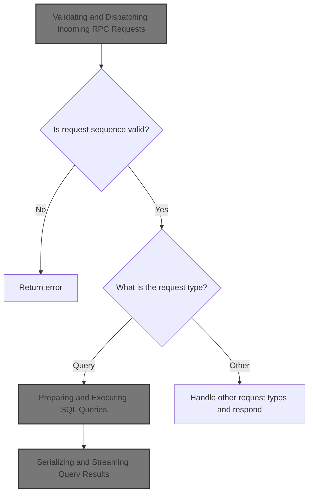

This document describes how incoming RPC requests are processed to enable remote trace analysis, metric computation, and query analysis. Requests are validated for order, dispatched to the appropriate operation, and results are returned to the client as responses.



# Validating and Dispatching Incoming RPC Requests

<SwmSnippet path="/src/trace_processor/rpc/rpc.cc" line="185">

---

In <SwmToken path="src/trace_processor/rpc/rpc.cc" pos="185:4:4" line-data="void Rpc::ParseRpcRequest(const uint8_t* data, size_t len) {">`ParseRpcRequest`</SwmToken>, we start by validating the sequence number to make sure requests are processed in order—if it's out of sequence, we send an error and disconnect. Then, we decode the request and use a switch-case to dispatch to the appropriate handler based on the request type. For queries, we call into <SwmPath>[src/trace_processor/trace_processor_impl.cc](src/trace_processor/trace_processor_impl.cc)</SwmPath> to execute SQL and handle results, including streaming large responses in batches and aborting if a batch is too big. All request handling uses Perfetto-specific protobuf types for decoding and response building.

```c++
void Rpc::ParseRpcRequest(const uint8_t* data, size_t len) {
  RpcProto::Decoder req(data, len);

  // We allow restarting the sequence from 0. This happens when refreshing the
  // browser while using the external trace_processor_shell --httpd.
  if (req.seq() != 0 && rx_seq_id_ != 0 && req.seq() != rx_seq_id_ + 1) {
    char err_str[255];
    // "(ERR:rpc_seq)" is intercepted by error_dialog.ts in the UI.
    snprintf(err_str, sizeof(err_str),
             "RPC request out of order. Expected %" PRId64 ", got %" PRId64
             " (ERR:rpc_seq)",
             rx_seq_id_ + 1, req.seq());
    PERFETTO_ELOG("%s", err_str);
    protozero::HeapBuffered<TraceProcessorRpcStream> err_msg;
    err_msg->add_msg()->set_fatal_error(err_str);
    auto err = err_msg.SerializeAsArray();
    rpc_response_fn_(err.data(), static_cast<uint32_t>(err.size()));
    rpc_response_fn_(nullptr, 0);  // Disconnect.
    return;
  }
  rx_seq_id_ = req.seq();

  // The static cast is to prevent that the compiler breaks future proofness.
  const int req_type = static_cast<int>(req.request());
  static const char kErrFieldNotSet[] = "RPC error: request field not set";
  switch (req_type) {
    case RpcProto::TPM_APPEND_TRACE_DATA: {
      Response resp(tx_seq_id_++, req_type);
      auto* result = resp->set_append_result();
      if (!req.has_append_trace_data()) {
        result->set_error(kErrFieldNotSet);
      } else {
        protozero::ConstBytes byte_range = req.append_trace_data();
        base::Status res = Parse(byte_range.data, byte_range.size);
        if (!res.ok()) {
          result->set_error(res.message());
        }
      }
      resp.Send(rpc_response_fn_);
      break;
    }
    case RpcProto::TPM_FINALIZE_TRACE_DATA: {
      Response resp(tx_seq_id_++, req_type);
      auto* result = resp->set_finalize_data_result();
      base::Status res = NotifyEndOfFile();
      if (!res.ok()) {
        result->set_error(res.message());
      }
      resp.Send(rpc_response_fn_);
      break;
    }
    case RpcProto::TPM_QUERY_STREAMING: {
      if (!req.has_query_args()) {
        Response resp(tx_seq_id_++, req_type);
        auto* result = resp->set_query_result();
        result->set_error(kErrFieldNotSet);
        resp.Send(rpc_response_fn_);
      } else {
        protozero::ConstBytes args = req.query_args();
        protos::pbzero::QueryArgs::Decoder query(args.data, args.size);
        std::string sql = query.sql_query().ToStdString();

        PERFETTO_TP_TRACE(metatrace::Category::API_TIMELINE, "RPC_QUERY",
                          [&](metatrace::Record* r) {
                            r->AddArg("SQL", sql);
                            if (query.has_tag()) {
                              r->AddArg("tag", query.tag());
                            }
                          });

        auto it = trace_processor_->ExecuteQuery(sql);
```

---

</SwmSnippet>

## Preparing and Executing SQL Queries

<SwmSnippet path="/src/trace_processor/trace_processor_impl.cc" line="672">

---

In <SwmToken path="src/trace_processor/trace_processor_impl.cc" pos="672:4:4" line-data="Iterator TraceProcessorImpl::ExecuteQuery(const std::string&amp; sql) {">`ExecuteQuery`</SwmToken>, we trace the query execution for monitoring, record the start in SQL stats for metrics, and sanitize the SQL string by replacing non-breaking spaces. Then, we call into the SQL engine to actually run the query, which is handled in <SwmPath>[src/…/engine/perfetto_sql_engine.cc](src/trace_processor/perfetto_sql/engine/perfetto_sql_engine.cc)</SwmPath>.

```c++
Iterator TraceProcessorImpl::ExecuteQuery(const std::string& sql) {
  PERFETTO_TP_TRACE(metatrace::Category::API_TIMELINE, "EXECUTE_QUERY",
                    [&](metatrace::Record* r) { r->AddArg("query", sql); });

  uint32_t sql_stats_row =
      context()->storage->mutable_sql_stats()->RecordQueryBegin(
          sql, base::GetWallTimeNs().count());
  std::string non_breaking_sql = base::ReplaceAll(sql, "\u00A0", " ");
  base::StatusOr<PerfettoSqlEngine::ExecutionResult> result =
      engine_->ExecuteUntilLastStatement(
          SqlSource::FromExecuteQuery(std::move(non_breaking_sql)));
```

---

</SwmSnippet>

### Running SQL Statements in the Engine

See <SwmLink doc-title="Processing and Executing SQL Statement Sequences">[Processing and Executing SQL Statement Sequences](/.swm/processing-and-executing-sql-statement-sequences.5lo6dntj.sw.md)</SwmLink>

### Wrapping Query Results for Iteration

<SwmSnippet path="/src/trace_processor/trace_processor_impl.cc" line="683">

---

Back in <SwmToken path="src/trace_processor/trace_processor_impl.cc" pos="672:2:4" line-data="Iterator TraceProcessorImpl::ExecuteQuery(const std::string&amp; sql) {">`TraceProcessorImpl::ExecuteQuery`</SwmToken>, after getting the result from the SQL engine, we wrap it in an <SwmToken path="src/trace_processor/trace_processor_impl.cc" pos="683:5:5" line-data="  std::unique_ptr&lt;IteratorImpl&gt; impl(">`IteratorImpl`</SwmToken> and return it as an Iterator. This gives callers a consistent way to access query results.

```c++
  std::unique_ptr<IteratorImpl> impl(
      new IteratorImpl(this, std::move(result), sql_stats_row));
  return Iterator(std::move(impl));
}
```

---

</SwmSnippet>

## Serializing and Streaming Query Results

```mermaid
%%{init: {"flowchart": {"defaultRenderer": "elk"}} }%%
flowchart TD
  node1["Receive RPC request"]
  click node1 openCode "src/trace_processor/rpc/rpc.cc:256:416"
  node1 --> node2{"What is the request type?"}
  click node2 openCode "src/trace_processor/rpc/rpc.cc:256:416"
  node2 -->|"Query"| node3["Process query"]
  click node3 openCode "src/trace_processor/rpc/rpc.cc:256:285"
  node2 -->|"Compute Metric"| node4{"Are required arguments present?"}
  click node4 openCode "src/trace_processor/rpc/rpc.cc:289:300"
  node4 -->|"Yes"| node5["Compute metric"]
  click node5 openCode "src/trace_processor/rpc/rpc.cc:295:297"
  node4 -->|"No"| node6["Return error: Missing arguments"]
  click node6 openCode "src/trace_processor/rpc/rpc.cc:293:294"
  node2 -->|"Analyze Structured Query"| node7["Analyze queries"]
  click node7 openCode "src/trace_processor/rpc/rpc.cc:366:401"
  node2 -->|"Unknown"| node8["Return error: Unknown request type"]
  click node8 openCode "src/trace_processor/rpc/rpc.cc:405:415"

  subgraph loop1["For each query result"]
    node3 --> node10{"Is response size acceptable?"}
    click node10 openCode "src/trace_processor/rpc/rpc.cc:261:266"
    node10 -->|"Yes"| node11["Send result"]
    click node11 openCode "src/trace_processor/rpc/rpc.cc:264:265"
    node10 -->|"No"| node12["Return error: Response too large"]
    click node12 openCode "src/trace_processor/rpc/rpc.cc:275:283"
  end

  subgraph loop2["For each analyzed structured query"]
    node7 --> node13["Package analysis result"]
    click node13 openCode "src/trace_processor/rpc/rpc.cc:388:401"
  end

  node5 --> node14["Send metric result"]
  click node14 openCode "src/trace_processor/rpc/rpc.cc:298:299"
  node6 --> node15["Send error response"]
  click node15 openCode "src/trace_processor/rpc/rpc.cc:293:294"
  node13 --> node16["Send analysis result"]
  click node16 openCode "src/trace_processor/rpc/rpc.cc:402:403"
  node8 --> node17["Send error response"]
  click node17 openCode "src/trace_processor/rpc/rpc.cc:413:414"

classDef HeadingStyle fill:#777777,stroke:#333,stroke-width:2px;

%% Swimm:
%% %%{init: {"flowchart": {"defaultRenderer": "elk"}} }%%
%% flowchart TD
%%   node1["Receive RPC request"]
%%   click node1 openCode "<SwmPath>[src/…/rpc/rpc.cc](src/trace_processor/rpc/rpc.cc)</SwmPath>:256:416"
%%   node1 --> node2{"What is the request type?"}
%%   click node2 openCode "<SwmPath>[src/…/rpc/rpc.cc](src/trace_processor/rpc/rpc.cc)</SwmPath>:256:416"
%%   node2 -->|"Query"| node3["Process query"]
%%   click node3 openCode "<SwmPath>[src/…/rpc/rpc.cc](src/trace_processor/rpc/rpc.cc)</SwmPath>:256:285"
%%   node2 -->|"Compute Metric"| node4{"Are required arguments present?"}
%%   click node4 openCode "<SwmPath>[src/…/rpc/rpc.cc](src/trace_processor/rpc/rpc.cc)</SwmPath>:289:300"
%%   node4 -->|"Yes"| node5["Compute metric"]
%%   click node5 openCode "<SwmPath>[src/…/rpc/rpc.cc](src/trace_processor/rpc/rpc.cc)</SwmPath>:295:297"
%%   node4 -->|"No"| node6["Return error: Missing arguments"]
%%   click node6 openCode "<SwmPath>[src/…/rpc/rpc.cc](src/trace_processor/rpc/rpc.cc)</SwmPath>:293:294"
%%   node2 -->|"Analyze Structured Query"| node7["Analyze queries"]
%%   click node7 openCode "<SwmPath>[src/…/rpc/rpc.cc](src/trace_processor/rpc/rpc.cc)</SwmPath>:366:401"
%%   node2 -->|"Unknown"| node8["Return error: Unknown request type"]
%%   click node8 openCode "<SwmPath>[src/…/rpc/rpc.cc](src/trace_processor/rpc/rpc.cc)</SwmPath>:405:415"
%% 
%%   subgraph loop1["For each query result"]
%%     node3 --> node10{"Is response size acceptable?"}
%%     click node10 openCode "<SwmPath>[src/…/rpc/rpc.cc](src/trace_processor/rpc/rpc.cc)</SwmPath>:261:266"
%%     node10 -->|"Yes"| node11["Send result"]
%%     click node11 openCode "<SwmPath>[src/…/rpc/rpc.cc](src/trace_processor/rpc/rpc.cc)</SwmPath>:264:265"
%%     node10 -->|"No"| node12["Return error: Response too large"]
%%     click node12 openCode "<SwmPath>[src/…/rpc/rpc.cc](src/trace_processor/rpc/rpc.cc)</SwmPath>:275:283"
%%   end
%% 
%%   subgraph loop2["For each analyzed structured query"]
%%     node7 --> node13["Package analysis result"]
%%     click node13 openCode "<SwmPath>[src/…/rpc/rpc.cc](src/trace_processor/rpc/rpc.cc)</SwmPath>:388:401"
%%   end
%% 
%%   node5 --> node14["Send metric result"]
%%   click node14 openCode "<SwmPath>[src/…/rpc/rpc.cc](src/trace_processor/rpc/rpc.cc)</SwmPath>:298:299"
%%   node6 --> node15["Send error response"]
%%   click node15 openCode "<SwmPath>[src/…/rpc/rpc.cc](src/trace_processor/rpc/rpc.cc)</SwmPath>:293:294"
%%   node13 --> node16["Send analysis result"]
%%   click node16 openCode "<SwmPath>[src/…/rpc/rpc.cc](src/trace_processor/rpc/rpc.cc)</SwmPath>:402:403"
%%   node8 --> node17["Send error response"]
%%   click node17 openCode "<SwmPath>[src/…/rpc/rpc.cc](src/trace_processor/rpc/rpc.cc)</SwmPath>:413:414"
%% 
%% classDef HeadingStyle fill:#777777,stroke:#333,stroke-width:2px;
```



<SwmSnippet path="/src/trace_processor/rpc/rpc.cc" line="256">

---

Back in <SwmToken path="src/trace_processor/rpc/rpc.cc" pos="185:4:4" line-data="void Rpc::ParseRpcRequest(const uint8_t* data, size_t len) {">`ParseRpcRequest`</SwmToken>, after getting the query result iterator, we use a serializer to stream results in batches. If a batch is too big, we bail out and send an error response, so clients don't get an unparsable message.

```c++
        QueryResultSerializer serializer(std::move(it));
        for (bool has_more = true; has_more;) {
          const auto seq_id = tx_seq_id_++;
          Response resp(seq_id, req_type);
          has_more = serializer.Serialize(resp->set_query_result());
          const uint32_t resp_size = resp->Finalize();
          if (resp_size < protozero::proto_utils::kMaxMessageLength) {
            // This is the nominal case.
            resp.Send(rpc_response_fn_);
            continue;
          }
          // In rare cases a query can end up with a batch which is too big.
          // Normally batches are automatically split before hitting the limit,
          // but one can come up with a query where a single cell is > 256MB.
          // If this happens, just bail out gracefully rather than creating an
          // unparsable proto which will cause a RPC framing error.
          // If we hit this, we have to discard `resp` because it's
          // unavoidably broken (due to have overflown the 4-bytes size) and
          // can't be parsed. Instead create a new response with the error.
          Response err_resp(seq_id, req_type);
          auto* qres = err_resp->set_query_result();
          qres->add_batch()->set_is_last_batch(true);
          qres->set_error(
              "The query ended up with a response that is too big (" +
              std::to_string(resp_size) +
              " bytes). This usually happens when a single row is >= 256 MiB. "
              "See also WRITE_FILE for dealing with large rows.");
          err_resp.Send(rpc_response_fn_);
          break;
        }
```

---

</SwmSnippet>

<SwmSnippet path="/src/trace_processor/rpc/rpc.cc" line="289">

---

After streaming query results, we continue handling other RPC request types in their own cases, calling internal methods and sending responses for each. This keeps the flow modular and extensible.

```c++
    case RpcProto::TPM_COMPUTE_METRIC: {
      Response resp(tx_seq_id_++, req_type);
      auto* result = resp->set_metric_result();
      if (!req.has_compute_metric_args()) {
        result->set_error(kErrFieldNotSet);
      } else {
        protozero::ConstBytes args = req.compute_metric_args();
        ComputeMetricInternal(args.data, args.size, result);
      }
      resp.Send(rpc_response_fn_);
      break;
    }
    case RpcProto::TPM_SUMMARIZE_TRACE: {
      Response resp(tx_seq_id_++, req_type);
      auto* result = resp->set_trace_summary_result();
      if (!req.has_trace_summary_args()) {
        result->set_error(kErrFieldNotSet);
      } else {
        protozero::ConstBytes args = req.trace_summary_args();
        ComputeTraceSummaryInternal(args.data, args.size, result);
      }
      resp.Send(rpc_response_fn_);
      break;
    }
    case RpcProto::TPM_GET_METRIC_DESCRIPTORS: {
      Response resp(tx_seq_id_++, req_type);
      auto descriptor_set = trace_processor_->GetMetricDescriptors();
      auto* result = resp->set_metric_descriptors();
      result->AppendRawProtoBytes(descriptor_set.data(), descriptor_set.size());
      resp.Send(rpc_response_fn_);
      break;
    }
    case RpcProto::TPM_RESTORE_INITIAL_TABLES: {
      trace_processor_->RestoreInitialTables();
      Response resp(tx_seq_id_++, req_type);
      resp.Send(rpc_response_fn_);
      break;
    }
    case RpcProto::TPM_ENABLE_METATRACE: {
      using protos::pbzero::MetatraceCategories;
      protozero::ConstBytes args = req.enable_metatrace_args();
      EnableMetatrace(args.data, args.size);

      Response resp(tx_seq_id_++, req_type);
      resp.Send(rpc_response_fn_);
      break;
    }
    case RpcProto::TPM_DISABLE_AND_READ_METATRACE: {
      Response resp(tx_seq_id_++, req_type);
      DisableAndReadMetatraceInternal(resp->set_metatrace());
      resp.Send(rpc_response_fn_);
      break;
    }
    case RpcProto::TPM_GET_STATUS: {
      Response resp(tx_seq_id_++, req_type);
      std::vector<uint8_t> status = GetStatus();
      resp->set_status()->AppendRawProtoBytes(status.data(), status.size());
      resp.Send(rpc_response_fn_);
      break;
    }
    case RpcProto::TPM_RESET_TRACE_PROCESSOR: {
      Response resp(tx_seq_id_++, req_type);
      protozero::ConstBytes args = req.reset_trace_processor_args();
      ResetTraceProcessor(args.data, args.size);
      resp.Send(rpc_response_fn_);
      break;
    }
    case RpcProto::TPM_REGISTER_SQL_PACKAGE: {
      Response resp(tx_seq_id_++, req_type);
      base::Status status = RegisterSqlPackage(req.register_sql_package_args());
      auto* res = resp->set_register_sql_package_result();
      if (!status.ok()) {
        res->set_error(status.message());
      }
      resp.Send(rpc_response_fn_);
      break;
    }
    case RpcProto::TPM_ANALYZE_STRUCTURED_QUERY: {
      Response resp(tx_seq_id_++, req_type);
      protozero::ConstBytes args = req.analyze_structured_query_args();
      protos::pbzero::AnalyzeStructuredQueryArgs::Decoder decoder(args.data,
                                                                  args.size);
      std::vector<StructuredQueryBytes> queries;
      for (auto it = decoder.queries(); it; ++it) {
        StructuredQueryBytes n;
        n.format = StructuredQueryBytes::Format::kBinaryProto;
        n.ptr = it->data();
        n.size = it->size();
        queries.push_back(n);
      }
```

---

</SwmSnippet>

<SwmSnippet path="/src/trace_processor/rpc/rpc.cc" line="380">

---

Here we call into the trace processor to analyze structured queries, which lets us extract SQL, textproto, modules, preambles, and column info for the client.

```c++
      std::vector<AnalyzedStructuredQuery> analyzed_queries;
      base::Status status = trace_processor_->AnalyzeStructuredQueries(
          queries, &analyzed_queries);
```

---

</SwmSnippet>

<SwmSnippet path="/src/trace_processor/trace_processor_impl.cc" line="738">

---

<SwmToken path="src/trace_processor/trace_processor_impl.cc" pos="738:6:6" line-data="base::Status TraceProcessorImpl::AnalyzeStructuredQueries(">`AnalyzeStructuredQueries`</SwmToken> checks if the proto descriptor is loaded, generates SQL from the structured query proto, converts the proto to text, computes referenced modules and preambles, executes them, prepares the SQL statement, and extracts column names. All this info is packed into the output vector for each query.

```c++
base::Status TraceProcessorImpl::AnalyzeStructuredQueries(
    const std::vector<StructuredQueryBytes>& sqs,
    std::vector<AnalyzedStructuredQuery>* output) {
  auto opt_idx = metrics_descriptor_pool_.FindDescriptorIdx(
      ".perfetto.protos.TraceSummarySpec");
  if (!opt_idx) {
    metrics_descriptor_pool_.AddFromFileDescriptorSet(
        kTraceSummaryDescriptor.data(), kTraceSummaryDescriptor.size());
  }
  perfetto_sql::generator::StructuredQueryGenerator sqg;
  for (const auto& sq : sqs) {
    AnalyzedStructuredQuery analyzed_sq;
    ASSIGN_OR_RETURN(analyzed_sq.sql, sqg.Generate(sq.ptr, sq.size));
    analyzed_sq.textproto =
        perfetto::trace_processor::protozero_to_text::ProtozeroToText(
            metrics_descriptor_pool_,
            ".perfetto.protos.PerfettoSqlStructuredQuery",
            protozero::ConstBytes{sq.ptr, sq.size},
            perfetto::trace_processor::protozero_to_text::kIncludeNewLines);
    analyzed_sq.modules = sqg.ComputeReferencedModules();
    analyzed_sq.preambles = sqg.ComputePreambles();
    sqg.AddQuery(sq.ptr, sq.size);

    // Execute modules
    // TODO(mayzner): Should be done on an empty engine as we don't actually
    // care about the results of execution of this code.
    for (const auto& module : analyzed_sq.modules) {
      engine_->Execute(SqlSource::FromTraceProcessorImplementation(
          "INCLUDE PERFETTO MODULE " + module));
    }

    // Execute preambles
    // TODO(mayzner): Should be done on an empty engine as we don't actually
    // care about the results of execution of this code.
    for (const auto& preamble : analyzed_sq.preambles) {
      engine_->Execute(SqlSource::FromTraceProcessorImplementation(preamble));
    }

    // Fetch columns
    ASSIGN_OR_RETURN(
        auto last_stmt,
        engine_->PrepareSqliteStatement(
            SqlSource::FromTraceProcessorImplementation(analyzed_sq.sql)));
    auto* sqlite_stmt = last_stmt.sqlite_stmt();
    int col_count = sqlite3_column_count(sqlite_stmt);
    std::vector<std::string> cols;
    for (int i = 0; i < col_count; i++) {
      cols.emplace_back(sqlite3_column_name(sqlite_stmt, i));
    }
    analyzed_sq.columns = std::move(cols);

    output->push_back(analyzed_sq);
  }
```

---

</SwmSnippet>

<SwmSnippet path="/src/trace_processor/rpc/rpc.cc" line="383">

---

Back in <SwmToken path="src/trace_processor/rpc/rpc.cc" pos="185:4:4" line-data="void Rpc::ParseRpcRequest(const uint8_t* data, size_t len) {">`ParseRpcRequest`</SwmToken>, after analyzing structured queries, we build the response by adding SQL, textproto, modules, preambles, and columns for each query. If analysis failed, we set an error message.

```c++
      auto* analyze_result = resp->set_analyze_structured_query_result();
      if (!status.ok()) {
        analyze_result->set_error(status.message());
      }

      for (const auto& r : analyzed_queries) {
        auto* query_res = analyze_result->add_results();
        query_res->set_sql(r.sql);
        query_res->set_textproto(r.textproto);
        for (const std::string& m : r.modules) {
          query_res->add_modules(m);
        }
        for (const std::string& p : r.preambles) {
          query_res->add_preambles(p);
        }
        for (const std::string& c : r.columns) {
          query_res->add_columns(c);
        }
      }
```

---

</SwmSnippet>

<SwmSnippet path="/src/trace_processor/rpc/rpc.cc" line="402">

---

We process the request, build the response, and send it, or reply with 'invalid request' if the type isn't recognized.

```c++
      resp.Send(rpc_response_fn_);
      break;
    }
    default: {
      // This can legitimately happen if the client is newer. We reply with a
      // generic "unknown request" response, so the client can do feature
      // detection
      PERFETTO_DLOG("[RPC] Unknown request type (%d), size=%zu", req_type, len);
      Response resp(tx_seq_id_++, req_type);
      resp->set_invalid_request(
          static_cast<RpcProto::TraceProcessorMethod>(req_type));
      resp.Send(rpc_response_fn_);
      break;
    }
  }  // switch(req_type)
}
```

---

</SwmSnippet>

&nbsp;

*This is an auto-generated document by Swimm 🌊 and has not yet been verified by a human*

<SwmMeta version="3.0.0" repo-id="Z2l0aHViJTNBJTNBY3BsdXNwbHVzLXBlcmZldHRvJTNBJTNBcmljYXJkb2xvcGV6Zw==" repo-name="cplusplus-perfetto"><sup>Powered by [Swimm](https://app.swimm.io/)</sup></SwmMeta>
