This document describes how incoming trace data streams are processed to enable trace recording and protocol communication. Trace data is received, decoded into protocol messages, and responses are delivered to support tracing sessions.

# Receiving and Processing Incoming Trace Data

<SwmSnippet path="/ui/src/plugins/dev.perfetto.RecordTraceV2/tracing_protocol/tracing_protocol.ts" line="180">

---

OnStreamData kicks off the flow by appending incoming data to the buffer and then looping to extract and process each complete message. We call <SwmToken path="ui/src/plugins/dev.perfetto.RecordTraceV2/tracing_protocol/tracing_protocol.ts" pos="185:3:3" line-data="      this.parseFrame(frameData);">`parseFrame`</SwmToken> for each message so it can handle the protocol-specific logic for each frame, moving the flow forward to message handling.

```typescript
  private onStreamData(data: Uint8Array): void {
    this.rxBuf.append(data);
    for (;;) {
      const frameData = this.rxBuf.readMessage();
      if (frameData === undefined) break;
      this.parseFrame(frameData);
    }
  }
```

---

</SwmSnippet>

# Decoding and Handling Protocol Frames

```mermaid
%%{init: {"flowchart": {"defaultRenderer": "elk"}} }%%
flowchart TD
    node1["Frame received"] --> node2{"Is this a recognized reply message?"}
    click node1 openCode "ui/src/plugins/dev.perfetto.RecordTraceV2/tracing_protocol/tracing_protocol.ts:189:192"
    node2 -->|"Yes"| node3{"Did the method succeed?"}
    click node2 openCode "ui/src/plugins/dev.perfetto.RecordTraceV2/tracing_protocol/tracing_protocol.ts:193:194"
    node2 -->|"No"| node8["Notify: Unrecognized frame type"]
    click node8 openCode "ui/src/plugins/dev.perfetto.RecordTraceV2/tracing_protocol/tracing_protocol.ts:210:211"
    node3 -->|"Success"| node4["Deliver reply to waiting request"]
    click node4 openCode "ui/src/plugins/dev.perfetto.RecordTraceV2/tracing_protocol/tracing_protocol.ts:202:205"
    node3 -->|"Failure"| node5{"Should failure be ignored?"}
    click node5 openCode "ui/src/plugins/dev.perfetto.RecordTraceV2/tracing_protocol/tracing_protocol.ts:199:200"
    node5 -->|"Yes"| node4
    node5 -->|"No"| node6["Notify: Method failed"]
    click node6 openCode "ui/src/plugins/dev.perfetto.RecordTraceV2/tracing_protocol/tracing_protocol.ts:200:201"
    node4 --> node7{"Are more replies expected?"}
    click node4 openCode "ui/src/plugins/dev.perfetto.RecordTraceV2/tracing_protocol/tracing_protocol.ts:204:205"
    node7 -->|"No"| node9["Remove request from pending list"]
    click node9 openCode "ui/src/plugins/dev.perfetto.RecordTraceV2/tracing_protocol/tracing_protocol.ts:206:208"
    node7 -->|"Yes"| node10["Wait for additional replies"]
    click node10 openCode "ui/src/plugins/dev.perfetto.RecordTraceV2/tracing_protocol/tracing_protocol.ts:205:206"

classDef HeadingStyle fill:#777777,stroke:#333,stroke-width:2px;

%% Swimm:
%% %%{init: {"flowchart": {"defaultRenderer": "elk"}} }%%
%% flowchart TD
%%     node1["Frame received"] --> node2{"Is this a recognized reply message?"}
%%     click node1 openCode "<SwmPath>[ui/…/tracing_protocol/tracing_protocol.ts](ui/src/plugins/dev.perfetto.RecordTraceV2/tracing_protocol/tracing_protocol.ts)</SwmPath>:189:192"
%%     node2 -->|"Yes"| node3{"Did the method succeed?"}
%%     click node2 openCode "<SwmPath>[ui/…/tracing_protocol/tracing_protocol.ts](ui/src/plugins/dev.perfetto.RecordTraceV2/tracing_protocol/tracing_protocol.ts)</SwmPath>:193:194"
%%     node2 -->|"No"| node8["Notify: Unrecognized frame type"]
%%     click node8 openCode "<SwmPath>[ui/…/tracing_protocol/tracing_protocol.ts](ui/src/plugins/dev.perfetto.RecordTraceV2/tracing_protocol/tracing_protocol.ts)</SwmPath>:210:211"
%%     node3 -->|"Success"| node4["Deliver reply to waiting request"]
%%     click node4 openCode "<SwmPath>[ui/…/tracing_protocol/tracing_protocol.ts](ui/src/plugins/dev.perfetto.RecordTraceV2/tracing_protocol/tracing_protocol.ts)</SwmPath>:202:205"
%%     node3 -->|"Failure"| node5{"Should failure be ignored?"}
%%     click node5 openCode "<SwmPath>[ui/…/tracing_protocol/tracing_protocol.ts](ui/src/plugins/dev.perfetto.RecordTraceV2/tracing_protocol/tracing_protocol.ts)</SwmPath>:199:200"
%%     node5 -->|"Yes"| node4
%%     node5 -->|"No"| node6["Notify: Method failed"]
%%     click node6 openCode "<SwmPath>[ui/…/tracing_protocol/tracing_protocol.ts](ui/src/plugins/dev.perfetto.RecordTraceV2/tracing_protocol/tracing_protocol.ts)</SwmPath>:200:201"
%%     node4 --> node7{"Are more replies expected?"}
%%     click node4 openCode "<SwmPath>[ui/…/tracing_protocol/tracing_protocol.ts](ui/src/plugins/dev.perfetto.RecordTraceV2/tracing_protocol/tracing_protocol.ts)</SwmPath>:204:205"
%%     node7 -->|"No"| node9["Remove request from pending list"]
%%     click node9 openCode "<SwmPath>[ui/…/tracing_protocol/tracing_protocol.ts](ui/src/plugins/dev.perfetto.RecordTraceV2/tracing_protocol/tracing_protocol.ts)</SwmPath>:206:208"
%%     node7 -->|"Yes"| node10["Wait for additional replies"]
%%     click node10 openCode "<SwmPath>[ui/…/tracing_protocol/tracing_protocol.ts](ui/src/plugins/dev.perfetto.RecordTraceV2/tracing_protocol/tracing_protocol.ts)</SwmPath>:205:206"
%% 
%% classDef HeadingStyle fill:#777777,stroke:#333,stroke-width:2px;
```



<SwmSnippet path="/ui/src/plugins/dev.perfetto.RecordTraceV2/tracing_protocol/tracing_protocol.ts" line="189">

---

ParseFrame decodes the incoming protocol frame, checks if it's a method reply, and then passes the reply data to the original caller via <SwmToken path="ui/src/plugins/dev.perfetto.RecordTraceV2/tracing_protocol/tracing_protocol.ts" pos="202:3:3" line-data="      pendInvoke.onResponse(">`onResponse`</SwmToken>. This step is needed to deliver results and clean up pending requests.

```typescript
  private parseFrame(frameData: Uint8Array): void {
    // Get a copy of the ArrayBuffer to avoid the original being overriden.
    // See 170256902#comment21
    const frame = protos.IPCFrame.decode(frameData.slice());
    if (frame.msg === 'msgInvokeMethodReply') {
      const reply = assertExists(frame.msgInvokeMethodReply);
      const pendInvoke = assertExists(this.pendingInvokes.get(frame.requestId));
      // We process messages without a `replyProto` field (for instance
      // `FreeBuffers` does not have `replyProto`). However, we ignore messages
      // without a valid 'success' field.
      if (reply.success === false && !pendInvoke.failSilently) {
        throw new Error(`Tracing Protocol: ${pendInvoke.methodName} failed`);
      }
      pendInvoke.onResponse(
        reply.replyProto ?? undefined,
        Boolean(reply.hasMore),
      );
      if (!reply.hasMore) {
        this.pendingInvokes.delete(frame.requestId);
      }
    } else {
      throw new Error(`Tracing protocol: unrecognized frame ${frame.msg}`);
    }
  }
```

---

</SwmSnippet>

# Handling RPC Responses and Establishing Protocol Connection

```mermaid
%%{init: {"flowchart": {"defaultRenderer": "elk"}} }%%
flowchart TD
  node1["Receive response to tracing request (single reply, not streaming)"] --> node2{"Is there response data?"}
  click node1 openCode "ui/src/plugins/dev.perfetto.RecordTraceV2/tracing_protocol/tracing_protocol.ts:103:104"
  node2 -->|"Yes"| node3["Decode response data"]
  click node2 openCode "ui/src/plugins/dev.perfetto.RecordTraceV2/tracing_protocol/tracing_protocol.ts:105:106"
  node2 -->|"No"| node4["Create empty response"]
  click node4 openCode "ui/src/plugins/dev.perfetto.RecordTraceV2/tracing_protocol/tracing_protocol.ts:107:107"
  node3 --> node5["Make response available to caller"]
  click node3 openCode "ui/src/plugins/dev.perfetto.RecordTraceV2/tracing_protocol/tracing_protocol.ts:106:108"
  node4 --> node5
  click node5 openCode "ui/src/plugins/dev.perfetto.RecordTraceV2/tracing_protocol/tracing_protocol.ts:108:109"
  note1["Note: hasMore is always false, only one response is expected"]
  node1 -.-> note1
classDef HeadingStyle fill:#777777,stroke:#333,stroke-width:2px;

%% Swimm:
%% %%{init: {"flowchart": {"defaultRenderer": "elk"}} }%%
%% flowchart TD
%%   node1["Receive response to tracing request (single reply, not streaming)"] --> node2{"Is there response data?"}
%%   click node1 openCode "<SwmPath>[ui/…/tracing_protocol/tracing_protocol.ts](ui/src/plugins/dev.perfetto.RecordTraceV2/tracing_protocol/tracing_protocol.ts)</SwmPath>:103:104"
%%   node2 -->|"Yes"| node3["Decode response data"]
%%   click node2 openCode "<SwmPath>[ui/…/tracing_protocol/tracing_protocol.ts](ui/src/plugins/dev.perfetto.RecordTraceV2/tracing_protocol/tracing_protocol.ts)</SwmPath>:105:106"
%%   node2 -->|"No"| node4["Create empty response"]
%%   click node4 openCode "<SwmPath>[ui/…/tracing_protocol/tracing_protocol.ts](ui/src/plugins/dev.perfetto.RecordTraceV2/tracing_protocol/tracing_protocol.ts)</SwmPath>:107:107"
%%   node3 --> node5["Make response available to caller"]
%%   click node3 openCode "<SwmPath>[ui/…/tracing_protocol/tracing_protocol.ts](ui/src/plugins/dev.perfetto.RecordTraceV2/tracing_protocol/tracing_protocol.ts)</SwmPath>:106:108"
%%   node4 --> node5
%%   click node5 openCode "<SwmPath>[ui/…/tracing_protocol/tracing_protocol.ts](ui/src/plugins/dev.perfetto.RecordTraceV2/tracing_protocol/tracing_protocol.ts)</SwmPath>:108:109"
%%   note1["Note: <SwmToken path="ui/src/plugins/dev.perfetto.RecordTraceV2/tracing_protocol/tracing_protocol.ts" pos="103:15:15" line-data="      onResponse: (data: Uint8Array | undefined, hasMore: boolean) =&gt; {">`hasMore`</SwmToken> is always false, only one response is expected"]
%%   node1 -.-> note1
%% classDef HeadingStyle fill:#777777,stroke:#333,stroke-width:2px;
```



<SwmSnippet path="/ui/src/plugins/dev.perfetto.RecordTraceV2/tracing_protocol/tracing_protocol.ts" line="103">

---

In <SwmToken path="ui/src/plugins/dev.perfetto.RecordTraceV2/tracing_protocol/tracing_protocol.ts" pos="103:1:1" line-data="      onResponse: (data: Uint8Array | undefined, hasMore: boolean) =&gt; {">`onResponse`</SwmToken>, we enforce that only single, non-streaming responses are handled by asserting <SwmToken path="ui/src/plugins/dev.perfetto.RecordTraceV2/tracing_protocol/tracing_protocol.ts" pos="103:15:15" line-data="      onResponse: (data: Uint8Array | undefined, hasMore: boolean) =&gt; {">`hasMore`</SwmToken> is false. We then decode the response data if present, or create a default response object if not. This sets up the result for the next step, which is protocol creation and connection setup.

```typescript
      onResponse: (data: Uint8Array | undefined, hasMore: boolean) => {
        assertFalse(hasMore); // Should have used invokeStreaming instead.
        const response = exists(data)
          ? method.respType.decode(data)
          : method.respType.create();
```

---

</SwmSnippet>

<SwmSnippet path="/ui/src/plugins/dev.perfetto.RecordTraceV2/tracing_protocol/tracing_protocol.ts" line="49">

---

Create sets up the protocol connection by sending a <SwmToken path="ui/src/plugins/dev.perfetto.RecordTraceV2/tracing_protocol/tracing_protocol.ts" pos="50:7:7" line-data="    // Send the bindService request. This is a one-off request to connect to the">`bindService`</SwmToken> request, waiting for the reply, and extracting the service ID and available RPC methods. This handshake is needed before any RPC calls can be made, and relies on the stream delivering data in the expected format.

```typescript
  static async create(stream: ByteStream): Promise<TracingProtocol> {
    // Send the bindService request. This is a one-off request to connect to the
    // consumer port and list the RPC methods available.
    const requestId = 1;
    const txFrame = new protos.IPCFrame({
      requestId,
      msgBindService: new protos.IPCFrame.BindService({
        serviceName: 'ConsumerPort',
      }),
    });
    const repsponsePromise = defer<Uint8Array>();
    const rxFrameBuf = new ProtoRingBuffer('FIXED_SIZE');
    stream.onData = (data) => {
      rxFrameBuf.append(data);
      const rxFrame = rxFrameBuf.readMessage();
      rxFrame && repsponsePromise.resolve(rxFrame);
    };
    TracingProtocol.sendFrame(stream, txFrame);

    // Wait for the IPC reply. There is no state machine or queueing needed at
    // this point (not just yet) because this is 1 req -> 1 reply.
    const frameData = await repsponsePromise;
    const rxFrame = protos.IPCFrame.decode(frameData);
    assertTrue(rxFrame.msg === 'msgBindServiceReply');
    const replyMsg = assertExists(rxFrame.msgBindServiceReply);
    const boundMethods = new Map<string, number>();
    assertTrue(replyMsg.success === true);
    const serviceId = assertExists(replyMsg.serviceId);
    for (const m of assertExists(replyMsg.methods)) {
      boundMethods.set(assertExists(m.name), assertExists(m.id));
    }
    // Now that the details of the RPC methods are known, build and return the
    // TracingProtocol object, so the caller can finally make calls.
    return new TracingProtocol(stream, serviceId, boundMethods);
  }
```

---

</SwmSnippet>

<SwmSnippet path="/ui/src/plugins/dev.perfetto.RecordTraceV2/tracing_protocol/tracing_protocol.ts" line="108">

---

We just returned from create, so <SwmToken path="ui/src/plugins/dev.perfetto.RecordTraceV2/tracing_protocol/tracing_protocol.ts" pos="103:1:1" line-data="      onResponse: (data: Uint8Array | undefined, hasMore: boolean) =&gt; {">`onResponse`</SwmToken> wraps up by resolving the promise with the response object, handing control back to the caller with the processed result.

```typescript
        resultPromise.resolve(response as ResponseType<T>);
      },
```

---

</SwmSnippet>

&nbsp;

*This is an auto-generated document by Swimm 🌊 and has not yet been verified by a human*

<SwmMeta version="3.0.0" repo-id="Z2l0aHViJTNBJTNBY3BsdXNwbHVzLXBlcmZldHRvJTNBJTNBcmljYXJkb2xvcGV6Zw==" repo-name="cplusplus-perfetto"><sup>Powered by [Swimm](https://app.swimm.io/)</sup></SwmMeta>
